# Petualangan Bitcoin Pertama Anda

Dalam kursus ini, kami akan menjelaskan Bitcoin dalam 25 bab sehingga Anda dapat memahami teknologi ini dengan secara sederhana dan efektif. Kursus ini dapat diakses oleh semua orang dan semuanya dapat mengeksplorasi industri secara keseluruhan: penambang, dompet, platform jual/beli, dan lain-lain...

Kursus ini membutuhkan waktu sekitar 15 jam untuk diselesaikan. Sepanjang perjalanan, kami menyediakan poster dan sumber daya tambahan lainnya.

Anda tidak memerlukan pengetahuan khusus untuk memulai, kursus ini dapat diakses oleh semua orang!

+++

# Pengantar
<partId>3cd2ac82-026c-53e1-874a-baf5842adc6d</partId>

## Menerjang Dunia di luar Jangkauan Pengetahuan
<chapterId>27e3fb60-4b50-556b-9e70-c4f5475c121d</chapterId>

### Selamat datang di paradigma moneter dan teknologi yang baru.

Bitcoin adalah inovasi signifikan yang melampaui definisi sekadar "mata uang internet". Ini merupakan revolusi baik dalam lingkup teknologi maupun uang, yang dapat membuat kita bertanya-tanya tentang hubungan kita dengan mata uang dan masyarakat. Bitcoin adalah mata uang yang **netral** dan **terdesentralisasi**, yang berarti bahwa bitcoin tidak dikontrol oleh entitas atau institusi mana pun. Bitcoin merupakan inovasi signifikan yang melampaui sekedar mata uang. Untuk memahami bitcoin yang populer ini, penting untuk memahami bahwa bitcoin (disebut sebagai BTC) merupakan sebuah protokol komputer (Bitcoin) dan juga merupakan unit moneter (bitcoin).

Protokol ini menggunakan teknologi dasar seperti kriptografi, komunikasi jaringan, dan "blockchain" yang terkemuka, sementara unit bitcoin adalah mata uang yang diperlukan untuk aspek fungsional protokol tersebut. Dalam kehidupan sehari-hari, orang Salvador atau bitcoiner di seluruh dunia menggunakan mata uang bitcoin untuk membeli dan menjual barang dan jasa, dimana mata uang ini memerlukan protokol Bitcoin untuk operasionalnya.

### Kurikulum yang komprehensif dan mudah dipahami

Dalam kursus ini, kami akan membahas aspek moneter dari Bitcoin, termasuk cara membeli dan menjual bitcoin, bagaimana menyimpannya dengan aman di dompet digital, dan cara menggunakannya untuk transaksi. Kami juga akan membahas peran penambang, yang sangat penting untuk menciptakan bitcoin baru dan mengamankan jaringan Bitcoin. Selain itu, kita akan menjelajahi masa depan Bitcoin dan bagaimana teknologi Lightning Network dapat membuat transaksi Bitcoin menjadi lebih baik.


Penting untuk memahami bahwa Bitcoin adalah sistem moneter baru yang merevolusi hubungan kita dengan uang. Mempelajari cara menggunakan Bitcoin adalah keterampilan yang penting, agar Anda bisa memegang kendali atas uang Anda sendiri.

**Bagian 1 - Uang**

- Bab 1 - Apa itu uang?
- Bab 2 - Uang Fiat
- Bab 3 - Hiperinflasi
- Bab 4 - Kebijakan moneter Bitcoin

**Bagian 2 - Dompet Bitcoin**

- Bab 5 - Bagaimana dompet Bitcoin bekerja?
- Bab 6 - Memilih tingkat keamanan Anda
- Bab 7 - Pengaturan dompet Anda
- Bab 8 - Perlindungan jangka panjang

**Bagian 3 - Aspek teknis dari Bitcoin**

- Bab 9 - Pemaparan tentang transaksi
- Bab 10 - Node Bitcoin
- Bab 11 - Penambang
- Bab 12 - Penambang dan ekologi

**Bagian 4 - Menabung dalam Bitcoin**

- Bab 13 - Harga Bitcoin
- Bab 14 - Cara Membeli Bitcoin
- Bab 15 - Bekerja untuk Bitcoin
- Bab 16 - Hyper-bitcoinization

**Seksi 5 - Jaringan Lightning**

- Bab 17 - Pengenalan ke Jaringan Lightning
- Bab 18 - Penggunaan Jaringan Lightning

Sebelum membahas definisi dan fungsi uang dalam masyarakat (Bab 1), kami akan memulai dengan permulaan Bitcoin. Bitcoin adalah teknologi yang relatif baru, sangat unik, dan diluncurkan pada tahun 2009. Oleh karena itu, wajar jika Anda tidak dapat secara instan memahami keseluruhan aspek Bitcoin. Faktanya, sama seperti ketika Anda belajar menggunakan Internet atau mengendarai mobil, Anda tidak perlu mengetahui semua detail teknis untuk menggunakan Bitcoin (menerima, membayar, mengamankan dana Anda).


Yang penting di sini adalah untuk memahami teknologi baru ini secara umum. Kami berharap pelatihan ini akan menyenangkan Anda dan memberikan dasar yang diperlukan untuk memahami dan mungkin terus maju dalam paradigma moneter global baru ini.

## Prasejarah Bitcoin
<chapterId>9a94b627-5b69-5d81-9125-f1fa9b0aa6ad</chapterId>

Sebelum istilah "Bitcoin" menjadi simbol mata uang digital dan transformasi keuangan, serangkaian ide, inovasi, dan gerakan sosial telah menciptakan dasar untuk konsepsualisasinya. Salah satu elemen fundamental dari prasejarah Bitcoin ini adalah gerakan cypherpunk.

### Cypherpunks: Visioner Dunia Digital

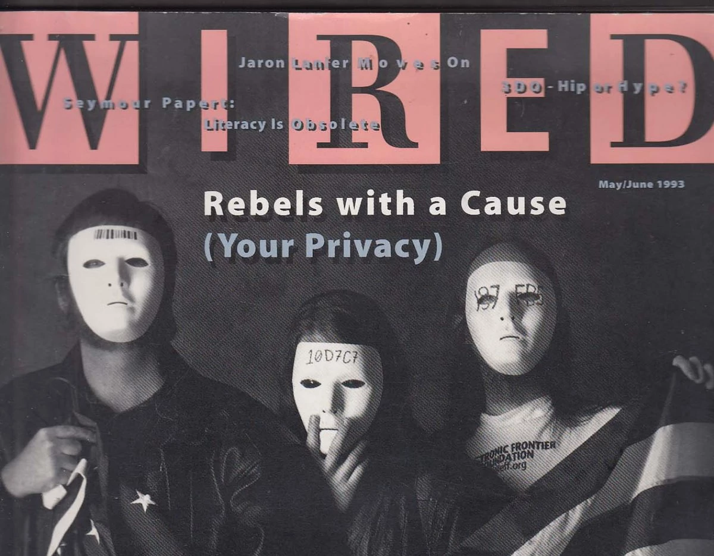
Di inti evolusi teknologi tahun 1980-an dan 1990-an, sekelompok orang mulai secara mendalam mempertanyakan peran privasi dan kebebasan di era digital. Individu-individu ini, yang kemudian dikenal sebagai "cypherpunks," dengan teguh percaya bahwa kriptografi dapat berfungsi sebagai alat untuk melindungi hak individu dari campur tangan pemerintah dan perusahaan besar.

Tokoh ikonik seperti Julian Assange, Wei Dai, Tim May, dan David Chaum berkontribusi dalam mendefinisikan filosofi dan visi cypherpunks. Pemikir-pemikir ini berbagi ide-ide mereka dalam sebuah daftar surel (mailing list atau milis) yang berpengaruh, di mana peserta dari seluruh dunia berdebat tentang cara terbaik menggunakan teknologi untuk memastikan kebebasan individu yang lebih besar.

### Tiga Karya Tulis Pilar Cypherpunks


Gerakan cypherpunk, dengan berakar kuat pada aktivisme digital dan kriptografi, mengungkapkan prinsip-prinsip dan visi masa depannya melalui beberapa karya penting. Di antara tulisan-tulisan ini, tiga di antaranya sangat menonjol:

- "Cypherpunk Manifesto":
  Ditulis oleh Eric Hughes pada tahun 1993, "Cypherpunk Manifesto" menegaskan bahwa privasi adalah hak fundamental. Hughes berargumen bahwa jaminan atas komunikasi yang bebas dan rahasia merupakan elemen penting dalam masyarakat yang bebas. Manifesto tersebut menyatakan, "Kita tidak bisa mengharapkan institusi, korporasi, atau entitas impersonal lainnya untuk melindungi privasi kita... Kita harus mempertahankannya sendiri."

- "Crypto-Anarchist Manifesto":
  Ditulis oleh Timothy C. May pada tahun 1992, manifesto ini menjelaskan bagaimana penggunaan kriptografi dapat membawa masyarakat pada era anarki kriptografis di mana pemerintah tidak berdaya untuk ikut campur tangan dalam urusan pribadi warga. May membayangkan masa depan di mana tukar-menukar informasi, uang, dan pesan dapat terjadi tanpa intervensi pihak ketiga, dan tanpa mengungkapkan informasi pribadi.

- "Deklarasi Kemerdekaan Cyberspace":
Meskipun secara eksklusif tidak tergolong cypherpunk, karya tulis ini mencerminkan sentimen banyak pelaku dalam gerakan tersebut. Ditulis pada tahun 1996 oleh John Perry Barlow, teks ini adalah respons terhadap campur tangan pemerintah dalam regulasi internet yang semakin meningkat. Deklarasi tersebut menegaskan bahwa cyberspace adalah ranah yang berbeda dari dunia fisik dan tidak seharusnya tunduk pada hukum yang sama. Dinyatakan, "Kami tidak memiliki pemerintahan terpilih, dan kami tidak bisa diperintah."

### Pendahulu Bitcoin

Sebelum kemunculan Bitcoin, beberapa upaya telah dilakukan untuk menciptakan mata uang digital. Sebagai contoh, David Chaum memperkenalkan konsep "uang elektronik anonim" dengan proyeknya "DigiCash" pada tahun 1980-an. Sayangnya, dikarenakan berbagai kendala, DigiCash tidak pernah benar-benar diimplementasikan.

Pendahulu penting lainnya adalah "b-money" dari Wei Dai. Meskipun tidak pernah diimplementasikan,konsep ini menyajikan ide tentang mata uang digital anonim di mana deteksi penipuan dilakukan oleh komunitas evaluator dan bukan oleh otoritas pusat.


Dalam situasi yang menguntungkan ini, seorang yang misterius bernama Satoshi Nakamoto menerbitkan whitepaper Bitcoin pada tahun 2008. Satoshi menggabungkan beberapa ide dari gerakan cypherpunk, seperti proof of work dan timestamp kriptografis, untuk menciptakan mata uang digital yang terdesentralisasi dan tak dapat sensor.

Lebih dari sekadar mata uang digital, Bitcoin merepresentasikan pencapaian dari ide-ide cypherpunk. Di luar dari aspek teknologinya, Bitcoin melambangkan revolusi terhadap sistem keuangan tradisional dan menghadirkan alternatif baru yang berdasarkan transparansi, desentralisasi, dan kedaulatan individu.

### Kesimpulan

Pra-sejarah Bitcoin berakar secara dalam pada gerakan cypherpunk dan usaha bersama untuk mencapai kebebasan yang lebih besar di era digital. Dengan menggabungkan prinsip-prinsip kriptografi, desentralisasi, dan integritas, Bitcoin telah menjadi lebih dari sekadar mata uang; Bitcoin adalah hasil dari revolusi filosofis dan teknologi yang terus mereformasi dunia kita.

Oleh karena itu, Bitcoin adalah protokol yang membentang sepanjang periode waktu yang panjang dan memotivasi kita untuk mempertanyakan hubungan kita dengan energi, waktu, dan uang. Namun, apakah Bitcoin sebuah "mata uang" yang sebenarnya? Apa itu uang? Apakah uang ada dalam berbagai bentuk? Kami akan menjelajahi pertanyaan-pertanyaan ini di bab berikutnya.


# Uang
<partId>e913df1a-4cbd-5380-ba67-ca2a0414f671</partId>

## Sejarah Uang
<chapterId>c838e64d-d59f-5703-8c74-ea5e8c4fdd31</chapterId>

Evolusi uang adalah aspek yang menarik dari sejarah manusia, yang mencerminkan kecerdikan peradaban dalam memenuhi kebutuhan ekonomi yang terus berkembang dari waktu ke waktu.


### Dari Kerang hingga Rekening Bank

Awalnya, mata uang memiliki wujud, seringkali berhubungan dengan barang-barang penting seperti biji-bijian, ternak, dan komoditas lainnya. Namun, barang-barang ini memiliki beberapa kelemahan, seperti mudah rusak, membuatnya sulit digunakan sebagai media menabung dalam jangka panjang. Misalnya, kegagalan panen atau penyakit bisa melenyapkan kekayaan seseorang dalam sekejap.
Seiring kemajuan peradaban dan perkembangan perdagangan ke daerah-daerah baru, muncul kebutuhan akan alat tukar yang bersifat universal. Benda-benda seperti kerang dan batu permata pernah diuji coba, tetapi tidak sempurna dalam aplikasinya. Emas akhirnya menjadi standar dikarenakan kelangkaannya, daya tahan, dan dapat dibagi. Dahulu hingga hari ini, emas tetap merupakan simbol kekayaan dan kekuasaan.

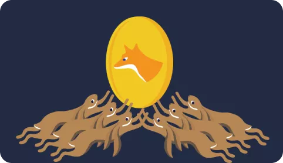

### Apa peran uang?

Uang adalah alat komunikasi yang sangat canggih:
- Uang memungkinkan komunikasi antara masa kini dan masa depan. Kita mengubah waktu dan energi kita menjadi aset yang dapat digunakan kembali di masa depan tanpa risiko depresiasi.
- Uang memungkinkan komunikasi dalam bahasa yang universal. Tanpa saling mengenal, tanpa berbicara bahasa yang sama, dua orang asing dapat bertukar, berdagang, dan menyepakati tentang nilai suatu hal.

Perannya di dunia sulit untuk ditiru secara artifisial. Tidak ada manusia atau kelompok manusia yang dapat menciptakan uang; ini adalah fenomena sosial yang terjadi secara alamiah yang hanya dapat timbul dari interaksi pasar dan kesepakatan sukarela. Harga adalah pertanda dan informasi yang dapat membantu masyarakat memutuskan bagaimana mengalokasikan sumber daya.

Emas sebagai uang adalah hasil dari 4.000 tahun evolusi Darwinisme moneter yang didasarkan pada tiga fungsi utama:

- Penyimpan nilai
- Alat tukar
- Satuan hitung


### Karakteristik uang

Secara ideal, emas memenuhi kriteria mata uang yang efisien: kelangkaan alaminya membuatnya bernilai, sementara sifat kimiawinya memungkinkan emas untuk tidak rusak seiring waktu. Namun, karena bentuknya, emas sulit untuk dibagi atau ditransportasikan secara jarak jauh. Dalam era globalisasi dan digital, emas sulit untuk beradaptasi serta memerlukan institusi terpusat untuk menjamin emas dapat dibagi dan ditukar dengan mudah (koin dicetak).

Meski aspek ini telah membuat emas cocok menjadi alat penyimpan nilai, tetapi kekurangan ini membuatnya tidak cocok untuk menjadi mata uang umum, sementara mata uang fidusia negara (fiat) mudah digunakan sebagai uang, tetapi nilainya terus-menerus mengalami depresiasi yang disebabkan oleh institusi-institusi yang mengontrolnya (raja, bank sentral, kaisar, diktator).

Mata uang yang baik memiliki beberapa kriteria. Mata uang yang baik seharusnya bersifat:


- **Dapat dipertukarkan**, artinya dapat ditukar tanpa kehilangan nilainya
- **Dapat dibagi**, untuk memfasilitasi transaksi dengan volume yang berbeda-beda
- **Likuid**, artinya mudah dikonversi menjadi barang atau jasa.

Untuk memenuhi kriteria ini, berbagai mata uang berkembang langkah demi langkah:

- Batu-batuan -> Koin
- Uang kertas -> Kartu bank
- Blockchain -> Lightning Network

Hingga kini, mata uang masih terus berkembang dari segi bentuknya untuk memfasilitasi berbagai penggunaan yang beragam. Misalnya, meskipun emas adalah penyimpan nilai yang sangat baik, itu tidak lagi cocok untuk ekonomi di era globalisasi saat ini. Demikian pula, adanya fasilitas digital membuat mata uang fidusia seperti dolar dan euro sangat likuid dan mudah dipindahkan, namun nilainya terus terkikis oleh inflasi moneter.

Bitcoin, di sisi lain, menawarkan banyak kemungkinan baru. Karena sifat-sifatnya, seperti jumlahnya yang sangat terbatas, Bitcoin juga dapat menjadi alat penyimpan nilai yang sangat baik. Selain itu, Bitcoin juga merupakan mata uang internet yang netral, yang berarti bahwa media pertukaran yang baik yang tidak mengenal batas. Namun, saat ini Bitcoin belum banyak diterima dalam aktivitas perdagangan, meskipun pengunaannya [terus menerus diadopsi](https://btcmap.org/map).

### Ringkasan cepat dalam poster!


## Mata uang fidusia
<chapterId>25151d46-7db1-5b48-8bba-cbde1944555a</chapterId>

"Orang yang tidak belajar dari sejarah ditakdirkan untuk mengulangi kesalahan yang sama," kata George Santayana. Sebuah kebenaran yang sangat relevan ketika membicarakan tentang sistem moneter saat ini.

### Fidusia = kepercayaan

Hari ini, mata uang utama seperti euro dan dolar dianggap sebagai mata uang yang melibatkan kepercayaan. Hal ini berarti bahwa mata uang tersebut tidak memiliki nilai intrinsik. Nilai mereka sepenuhnya bergantung pada kepercayaan dan keyakinan yang dipercayakan kepada institusi yang mengelolanya.
Mata uang fidusia adalah bentuk mata uang yang ditetapkan secara resmi oleh sebuah institusi, misalnya oleh negara, seperti China dengan Yen, atau organisasi politik-ekonomi, seperti Uni Eropa dengan Euro. Entitas yang bertanggung jawab atas penerbitan mata uang fidusia adalah bank sentral (Contohnya, Bank Rakyat China, Federal Reserve Amerika Serikat, atau Bank Sentral Republik Guinea). Entitas-entitas inilah yang bertanggung jawab dalam menentukan kebijakan moneter dan dengan demikian mengatur berapa banyak jumlah uang yang harus dikeluarkan atau dicetak.


### Depresiasi Moneter: Strategi yang Sudah ada Sejak Zaman Kekaisaran Romawi

Sejak zaman kuno, emas telah berfungsi sebagai patokan moneter. Namun, sifat emas yang tidak fleksibel sering kali membuat para pemimpin - baik itu kaisar Romawi atau pemerintah modern - untuk mengadopsi mata uang alternatif, yang seringkali bersifat fidusia.

Mekanismenya sederhana dan terinspirasi oleh praktik yang telah ada sejak awal peradaban. Para pemimpin yang ingin menguasai kekayaan memulai dengan melakukan sentralisasi emas, seringkali dengan memanfaatkan kekuasaan mereka dan menjanjikan perlindungan dan keamanan. Setelah emas berharga ini berada di tangan mereka, mereka memperkenalkan mata uang baru, yang nilainya ekuivalen dengan emas, dengan mencetak potret diri mereka di atasnya. Mata uang ini kemudian mulai beredar, dan masyarakat cepat terbiasa karena kemudahan penggunaannya.

Secara bertahap, para pemimpin ini secara diam-diam menurunkan nilai mata uang baru, mengurangi nilainya sebesar beberapa persen setiap tahunnya terhadap harga emas. Depresiasi yang tidak mencolok ini seringkali dianggap sebagai justifikasi untuk kepentingan rakyat. Dengan demikian, nilai tabungan mereka yang menabung mata uang fidusia terkikis, sementara negara membiayai proyek-proyeknya melalui inflasi. Selain itu, depresiasi ini membuat utang lebih mudah untuk dilunasi.

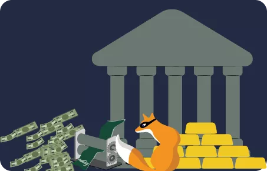

Pada saat kritis, diumumkanlah bahwa mata uang tidak lagi ada hubungannya dengan emas. Masyarakat, yang sekarang terbiasa dengan mata uang fidusia dan seringkali diberikan informasi yang salah tentang masalah keuangan, menerima kenyataan ini. Negara kemudian memiliki kebebasan penuh untuk memanipulasi jumlah uang, dan mereka dapat mencetak uang dalam jumlah yang sangat banyak hampir tanpa biaya.

Strategi ini, ketika dilaksanakan dengan cukup baik, dapat terus menghasilkan dampak selama puluhan tahun. Namun, depresiasi yang terlalu cepat atau hilangnya kepercayaan dapat menyebabkan hiperinflasi (lihat bab berikutnya). Sejarah menunjukkan bahwa dolar telah kehilangan 98% dari nilainya dalam kurun waktu 100 tahun, euro 30% dalam waktu 20 tahun, dan pound sterling 99% sejak kemunculannya.

Pada akhirnya, mata uang mungkin tidak lagi memiliki koneksi apa pun dengan emas, bagaikan harga koin Romawi di akhir Kekaisarannya, bahkan ujung-ujungnya hanya dianggap sebagai nilai numerik, yang tak ada kaitannya lagi dengan realitas fisik.

Kini, kita berada pada momen penting, sebuah titik balik sejarah. Dolar, yang telah lama mendominasi, tampaknya sedang mengalami penurunan pengaruh, dan emas telah kehilangan perannya sebagai acuan moneter. Saat ini kita sedang berada di peralihan menuju siklus moneter yang baru, mengingatkan kita bahwa nilai-nilai dan pelajaran dari sejarah seringkali dilupakan.


### Apakah Bitcoin Solusinya?

Dalam konteks inilah revolusi Bitcoin semakin mendapatkan momentum perkembangan yang pesat. Mata uang ini, yang **tidak memerlukan pihak ketiga yang dipercaya**, bertujuan untuk menjadi sebuah mata uang yang independen dari kendali Negara.

Pencetakan uang menyebabkan inflasi, secara bertahap membuat orang-orang menjadi miskin. Di sisi lain, lembaga keuangan dan individu kaya mendapat keuntungan dari praktik ini, sehingga menciptakan kesenjangan ketidaksetaraan dan dapat mendukung otoritarianisme. Sistem keuangan saat ini diatur dan dibatasi sedemikian rupa untuk menghindari keruntuhan, dan disrupsi apapun dapat memicu krisis ekonomi yang besar. Dikarenakan aktor politik mendapat keuntungan dari sistem ini, serta menghindari untuk melakukan perubahan radikal terhadapnya, sehingga memungkinkan sistem untuk terus berlanjut sampai terjadinya kegagalan besar.
Demi menanggapi tantangan sistemik ini, Bitcoin muncul sebagai solusi yang terdesentralisasi: sebuah sistem moneter paralel baru. Secara historis, emas telah disukai sebagai mata uang karena ketahanannya terhadap pemalsuan. Serupa dengan itu, Bitcoin, melalui sifat terdesentralisasi dan kriptografinya, tidak dapat dipalsukan dan terbatas pada 21 juta unit. Bitcoin adalah mata uang yang mengandalkan transparansi dan netralitas, menawarkan alternatif menarik terhadap sistem moneter terpusat saat ini.

Pada saat yang sama, kemunculan mata uang digital bank sentral, atau CBDCs, tampaknya tidak terelakkan. Bentuk mata uang baru ini akan menawarkan ekonomi yang lebih terencana secara sentral, yang dapat menghambat kebebasan finansial individu dan memfasilitasi penyalahgunaan otoriter.
Kita dapat menyimpulkan bab ini dengan kutipan dari pemenang Hadiah Nobel F.A Hayek pada tahun 1984: "Saya tidak percaya bahwa kita akan pernah menemukan mata uang yang baik sampai kita mengambilnya dari tangan pemerintah. Namun, kita tidak dapat secara paksa mengambilnya dari mereka; yang bisa kita lakukan hanyalah memperkenalkan sesuatu yang tidak dapat mereka hentikan melalui tipu muslihat yang cerdik."

### Ringkasan Singkat dalam Poster!


## Hiperinflasi
<chapterId>b04c024c-54f3-50cb-997f-58721cfc74be</chapterId>

Hiperinflasi adalah fenomena moneter yang hanya terjadi pada mata uang fiat. Fenomena ini ditandai dengan kehilangan kepercayaan secara total terhadap sebuah mata uang tertentu serta peningkatan drastis dalam inflasi melalui pencetakan uang oleh otoritas. Akibatnya, tabungan yang telah dikumpulkan oleh individu dapat menghilang dalam waktu yang relatif singkat, membawa negara ke ambang kehancuran ekonomi, sosial, dan politik.

### Inflasi yang Merajalela!

Mari kita coba memahami dampak inflasi terhadap tabungan dengan mempertimbangkan berbagai tingkat inflasi.

- Dengan tingkat inflasi 2%, Anda kehilangan 2% daya beli Anda setiap tahun, yang artinya kehilangan 10% dalam jangka waktu 5 tahun.
- Dengan 7%, Anda kehilangan setengah daya beli dalam 10 tahun.
- Dengan 20%, Anda hampir kehilangan setengah dari daya beli Anda dalam 3 tahun.

Selama hiperinflasi, tingkat inflasi bukanlah lagi 20% per tahun, namun angka ini bisa mencapai 20% per bulan atau, pada puncaknya, per HARI. Tingkat inflasi harian sebesar 100% per hari selama 3 hari sudah pernah terjadi, serta terus terjadi di dunia kita.

Penting untuk memahami bahwa hiperinflasi tidak mungkin terjadi secara tiba-tiba, secara kebetulan, karena kapitalisme, ataupun karena lawan politik. Hiperinflasi adalah konsekuensi langsung dari keputusan dan kebijakan moneter yang "salah" oleh bankir sentral dan politisi. Konsekuensinya berdampak pada semua warga negara dan serta akan berdampak pada generasi-generasi berikutnya. Sisihkan waktu 5 menit untuk mempelajari tabel di bawah untuk sepenuhnya memahami dampak nyata dari fenomena ini (kursus ECON204 akan membahas topik ini secara detail)."


### Bagaimana Hiperinflasi dapat Terjadi?


Fase 1 - Kehilangan Kepercayaan

- Sentralisasi kekuasaan moneter memfasilitasi proses pencetakan uang dan penyalahgunaannya. Kehilangan kepercayaan pada mata uang kemudian dapat muncul dan memicu hiperinflasi. Individu kemudian mulai mempertanyakan asal-usul uang dan manfaat dari kebijakan moneter yang diterapkan. Kehilangan kepercayaan ini umumnya disebabkan oleh faktor eksternal seperti perang, kebijakan sosial, atau kenaikan harga sumber daya kunci, seperti gandum atau migas.

Fase 2 - Runtuhnya Mata Uang & Naiknya Harga
- Ketika pemerintah kehilangan kendali atas kepercayaan, individu mulai menukar mata uang mereka dengan mata uang lain yang lebih stabil, seperti dolar AS untuk kasus warga Venezuela. Hal ini menyebabkan kenaikan harga, menciptakan "lingkaran setan" di mana barang dan jasa menjadi semakin mahal. Untuk memenuhi kebutuhan ini, negara mencetak lebih banyak uang untuk memperbaiki kebijakan moneter, mengakibatkan inflasi yang semakin tidak terkendali.
Fase 3 - Lingkaran setan pencetakan uang

- Untuk melakukan pembelian barang dan komoditas, uang kertas yang dibutuhkan semakin banyak, sehingga menyebabkan kelangkaan uang kertas. Hal ini menyebabkan pencetakan uang kertas lebih banyak lagi, yang memicu inflasi yang semakin meningkat.


Fase 4 - Munculnya mata uang baru

- Kemudian, mata uang baru diperkenalkan untuk menggantikan yang lama. Contoh mencolok dari hiperinflasi adalah Jerman pada tahun 1920-1924. Untuk menghidupkan kembali perekonomian negara, mata uang baru diciptakan, didukung oleh utang Jerman, Prancis, dan Inggris, dan dijamin oleh lahan-lahan Jerman.

Mengatasi krisis hiperinflasi seringkali memerlukan perubahan radikal, seperti revolusi, perubahan dalam pemerintahan, perubahan dalam bankir sentral, dan lain-lain. Kehilangan kepercayaan, keruntuhan mata uang, dan rekonstruksi adalah fase-fase penting untuk menghidupkan kembali ekonomi baru berbasis mata uang fiat.

### 3 contoh mencolok

- Jerman, 1922-1923

  Salah satu contoh paling mencolok adalah hiperinflasi yang terjadi di Republik Weimar Jerman setelah Perang Dunia I.

  Jerman telah meminjam uang yang jumlahnya sangat banyak untuk membiayai perang, dan tidak hanya Jerman tidak memenangkan perang, tetapi juga harus membayar miliaran dolar sebagai biaya reparasi. Bulan dengan inflasi tertinggi adalah Oktober 1923, puncaknya mencapai 29.500%, atau setara tingkat inflasi 20,9% per hari. Harga barang berlipat ganda setiap 3,7 hari!
  Dikatakan bahwa di restoran, pelayan harus memperbarui harga menu setiap 30 menit untuk disesuaikan dengan inflasi. Mata uang Jerman menjadi begitu tidak bernilai, sehingga beberapa warga lebih memilih untuk membakar uang kertas mereka daripada kayu karena lebih murah.

  

- Hungaria, 1945-1946

  Negara yang mengalami periode hiperinflasi terburuk dalam sejarah hingga saat ini adalah Hungaria setelah Perang Dunia II.

  Hungaria merupakan pihak yang kalah dalam konflik dan perang, dan hal ini telah menghancurkan sebagian besar kapasitas produksi industrinya. Bulan dengan inflasi tertinggi adalah Juli 1946, dengan inflasi harga 41.900.000.000.000.000%, setara dengan 207% per hari. Harga naik dua kali lipat setiap 15 jam!

  Uang kertas terakhir yang dikeluarkan adalah banknote 100 juta miliar pengo (100.000.000.000.000.000) pada tahun 1946.


- Zimbabwe, 2007-2008
  Hingga tahun 2000, Zimbabwe dapat secara independen memenuhi hampir semua kebutuhannya, terkecuali untuk minyak.

  Pada tahun 1997, dolar Zimbabwe anjlok lebih dari 72% setelah pemerintah setuju untuk memberi kompensasi kepada veteran perang yang nilainya setara 450 juta dolar AS. Karena pemerintah tidak memiliki uang sebanyak itu di kasnya, mereka terpaksa memilih untuk mencetak uang. Pada tahun 2005, inflasi mencapai 586% dan pada Maret 2007, inflasi bulanan mencapai 50%.

  Pada Juni 2007, pemerintah menghadapi ini dengan memberlakukan kontrol harga. Barang-barang di toko-toko "dijarah". Para pedagang kini tidak lagi memiliki sarana untuk memasok kembali isi toko mereka.
Pada April 2009, Menteri Keuangan mengumumkan penangguhan dolar Zimbabwe dan mengizinkan penggunaan berbagai mata uang asing untuk perdagangan. Semua rekening bank, rekening dana pensiun, dan lembaga keuangan melihat saldo mereka lenyap dalam semalam.


Kesimpulannya, hiperinflasi memiliki efek buruk yang dapat merusak nilai mata uang dengan cepat, yang mengakibatkan berkurangnya nilai tabungan dan hilangnya kepercayaan terhadap sistem moneter. Seperti yang pernah disampaikan oleh Voltaire, mata uang fiat akan selalu pada akhirnya kehilangan nilai intrinsiknya dan nilainya akan lama-kelamaan menuju nol.
'Sebuah mata uang yang bergantung pada pihak ketiga yang dipercaya seperti lembaga keuangan, dalam praktiknya dan dalam jangka panjang, adalah mata uang yang cacat karena tidak mampu menjamin daya beli atau menjaga tabungan.

### Ringkasan Singkat dalam Poster!

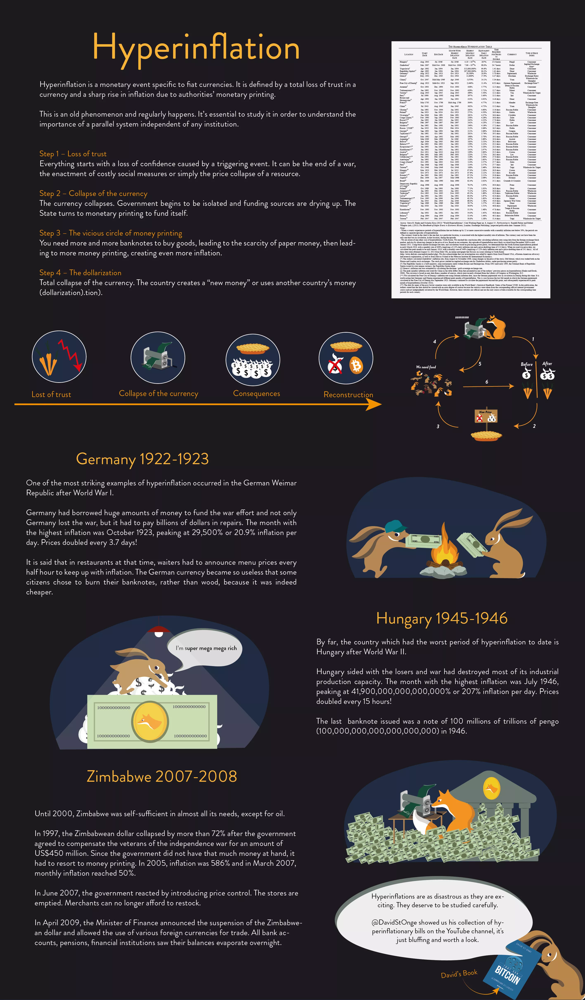

## 21 juta bitcoin
<chapterId>f4a06d76-1963-56fd-93ff-dfa41489bcde</chapterId>

### Kebijakan Moneter Bitcoin

Bitcoin adalah mata uang digital terdesentralisasi dengan jumlah maksimum yang telah ditentukan sebanyak **21 juta unit**. Karakteristik kelangkaan ini ditentukan oleh kode komputernya dan diperkuat oleh persetujuan umum semua pengguna yang berpartisipasi dalam protokol.


Penerbitan moneter Bitcoin dapat diilustrasikan oleh kurva S yang mewakili jumlah bitcoin yang diciptakan seiring waktu. Misalnya, pada tahun 2022, sekitar 18,5 juta bitcoin sudah ada dalam peredaran. Diprediksikan bahwa pada tahun 2025, akan ada sekitar 19,5 juta bitcoin, sekitar ~93% dari total pasokan, dan pada tahun 2037, angka ini akan mencapai 20,4 juta.

### Bagaimana Cara Membuat Bitcoin Baru?

Bitcoin baru adalah hasil dari proses penambangan, yang merupakan prosedur verifikasi transaksi dalam jaringan Bitcoin.


Penambang, yang melakukan tugas ini, diberi imbalan dengan penerbitan bitcoin baru setiap sepuluh menit. Imbalan ini diprogram untuk berkurang setengahnya setiap 210,000 blok, kira-kira setiap empat tahun, melalui peristiwa yang dikenal sebagai "halving" -- yang dapat menjelaskan mengapa kurva penerbitan moneter Bitcoin berbentuk seperti tangga. Karena adanya halving, dapat diprediksi secara matematis bahwa bitcoin akan berhenti diterbitkan pada tahun 2140, ketika jumlah total bitcoin mencapai batasnya sebanyak 21 juta unit.

| Halving ke- | Tinggi Blok | Hadiah BTC Setelah Halving  | Estimasi BTC yang Beredar Setelah Halving |
| -------------- | ------------ | ------------------------- | ------------------------------------------ |
| 1              | 210,000      | 25 BTC                    | 10,500,000 BTC                             |
| 2              | 420,000      | 12.5 BTC                  | 15,750,000 BTC                             |
| 3              | 630,000      | 6.25 BTC                  | 18,375,000 BTC                             |
| 4              | 840,000      | 3.125 BTC                 | 19,687,500 BTC                             |
| 5              | 1,050,000    | 1.5625 BTC                | 20,343,750 BTC                             |
| 6              | 1,260,000    | 0.78125 BTC               | 20,671,875 BTC                             |
| 7              | 1,470,000    | 0.390625 BTC              | 20,835,937.5 BTC                           |
| 8              | 1,680,000    | 0,1953125 BTC             | 20,917,968.75 BTC                          |
| 9              | 1,890,000    | 0,09765625 BTC            | 20,958,984.375 BTC                         |
| 10             | 2,100,000    | 0,048828125 BTC           | 20,979,492.188 BTC                         |
| 11             | 2,310,000    | 0,0244140625 BTC          | 20,989,746.094 BTC                         |
| 12             | 2,520,000    | 0,01220703125 BTC         | 20,994,873.047 BTC                         |
| 13             | 2,730,000    | 0,006103515625 BTC        | 20,997,436.523 BTC                         |
| 14             | 2,940,000    | 0,0030517578125 BTC       | 20,998,718.262 BTC                         |
| 15             | 3,150,000    | 0,00152587890625 BTC      | 20,999,359.131 BTC                         |
| 16             | 3,360,000    | 0,000762939453125 BTC     | 20,999,679.566 BTC                         |
| 17             | 3,570,000    | 0,0003814697265625 BTC    | 20,999,839.783 BTC                         |
| 18             | 3,780,000    | 0,00019073486328125 BTC   | 20,999,919.892 BTC                         |
| 19             | 3,990,000    | 0,000095367431640625 BTC  | 20,999,959.946 BTC                         |
| 20             | 4,200,000    | 0,0000476837158203125 BTC | 20,999,979.973 BTC                         |

Hal mengenai penambang akan secara detail dijelaskan dalam bab penambangan.

### Menjamin kelangkaan digital

Kelangkaan Bitcoin dijamin oleh dua mekanisme kunci: penyesuaian kesulitan penambangan dan teori permainan:

- Penyesuaian kesulitan penambangan adalah mekanisme yang terjadi setiap 2016 blok, atau sekitar dua minggu, untuk memastikan bahwa rata-rata sebuah blok baru ditambahkan ke blockchain setiap sepuluh menit. Frekuensi pembuatan blok dan jumlah total bitcoin adalah aspek tetap dari protokol Bitcoin dan tidak dapat diubah tanpa persetujuan umum, tidak seperti keputusan sewenang-wenang yang dibuat dalam sistem moneter tradisional.


> Tahukah Anda? Saat penambang menambang sebuah blok, mereka akan mendapatkan insentif berupa bitcoin baru (subsidi blok) dan biaya transaksi yang terkait dengan transaksi yang mereka sertakan dalam blok mereka. Seiring jumlah bitcoin yang diterbitkan mendekati batas 21 juta, proporsi insentif melalui biaya transaksi mereka akan lebih besar daripada melalui subsidi blok.'

- Teori permainan adalah konsep matematika yang mengandalkan rasionalitas manusia. Dalam Bitcoin, para penggunalah yang memutuskan diadakannya perubahan protokol atau tidak. Benar, Anda tidak salah membaca: setiap modifikasi pada protokol Bitcoin akan memerlukan persetujuan dari seluruh komunitas pengguna, dan hal ini sangat kompleks. Jadi, jika ada yang ingin menciptakan bitcoin ke-22 juta, pihak tersebut harus meyakinkan semua pengguna untuk rela menurunkan nilai tabungan mereka sendiri, yang sangat tidak mungkin terjadi karena Bitcoin bersifat global dan tidak diatur oleh sebuah institusi terpusat.

Gagasan melakukan devaluasi nilai mata uang bertentangan dengan filosofi dasar Bitcoin, sehingga perubahan batas jumlah maksimum Bitcoin sangatlah tidak mungkin.

### Kebijakan moneter yang dapat diaudit setiap detik dari awal dan selamanya!

Kelangkaan Bitcoin merupakan aset utamanya, dan informasi mengenai jumlah maksimum 21 juta bitcoin yang beredar bersifat publik dan dapat dipastikan oleh siapa saja.

Faktanya, siapa pun dapat memverifikasi jumlah bitcoin yang beredar dengan memasukkan perintah sederhana pada node Bitcoin: `bitcoin-cli gettxoutsetinfo`. Transparansi dan verifikasi ini memperkuat kepercayaan pada sistem Bitcoin, yang tidak didasarkan pada institusi atau individu terpusat, tetapi pada jaminan matematis dan kriptografi yang melekat dalam protokolnya. (Anda akan belajar bagaimana melakukan ini dengan mudah di LN201)

```json
{
  "height": 710560,
  "bestblock": "0000000000000000000887384d67103412ea7f18a43953e65c8c4ac36bf42e54",
  "transactions": 473244,
  "txouts": 1018917,
  "bogosize": 2183872374,
  "hash_serialized_2": "eebb9987337700ffaacbbaa11223344",
  "disk_size": 178239584,
  "total_amount": 18745998.12345678
}
```

Bitcoin, dengan desainnya, menjamin pengelolaan moneter yang baik dengan membatasi kuota penerbitannya dan melindungi tabungan pengguna, membedakannya dari mata uang lain. Selaras dengan prinsip ekonomi Austria (detail di ECON201), jumlahnya yang terkontrol dan distribusinya yang dapat diprediksi menghindarkannya dari risiko inflasi yang melekat pada mata uang tradisional.

Singkatnya, Bitcoin, dengan sifat terdesentralisasinya, kelangkaannya yang diatur, serta transparansinya, menawarkan alternatif yang unik untuk sistem moneter tradisional. Hal ini menggambarkan bagaimana teknologi dapat digunakan untuk menciptakan mata uang yang tidak hanya berguna dan dapat diverifikasi, namun juga dapat menjamin nilai tabungan pengguna dengan membatasi jumlahnya secara ketat.

### Ringkasan Singkat dalam Poster


### Kesimpulan Bagian 1!

# Dompet Bitcoin
<partId>28860585-4f61-59d9-b242-f4c57d837cc1</partId>

## Apa itu dompet Bitcoin?
<chapterId>1c0166ab-cb7a-5bc6-9175-d13482bd91f1</chapterId>

Di bagian 2 ini, kita akan menjelajahi penyimpanan dan keamanan Bitcoin dalam dompet, memungkinkan Anda untuk lebih memahami di mana bitcoin ini berada dan bagaimana berinteraksi dengannya!

### Menguak dompet Bitcoin

Dalam industri ini, dompet dapat digunakan untuk berinteraksi dengan jaringan Bitcoin dan dompet ini memiliki 3 fungsi:

- Memungkinkan Anda menerima bitcoin
- Memungkinkan Anda mengirim bitcoin
- Mengamankannya dari upaya peretasan dan pencurian

Ada bermacam-macam bentuk dompet yang dapat berupa perangkat lunak di komputer Anda, aplikasi di smartphone Anda, perangkat fisik seperti kunci USB, atau bahkan selembar kertas. Jenis dompet Bitcoin yang berbeda-beda masing-masing memiliki kegunaan yang tidak sama. Beberapa digunakan untuk transaksi jumlah besar dengan penekanan pada keamanan, lainnya untuk privasi, atau bahkan untuk pembayaran sehari-hari dalam jumlah kecil.

Oleh karena itu, portofolio dibagi menjadi beberapa kategori besar, selalu dengan pertanyaan inti ini: Apakah Anda pemilik dana Anda atau apakah Anda menyerahkan kontrol atas uang Anda kepada pihak ketiga? Kami akan menjelaskan topik ini secara detail di bab berikutnya, tetapi intinya sederhana: Apakah uang ada di saku Anda atau di saku bankir Anda!


### Bagaimana Cara Kerja Dompet Bitcoin?
Baik itu "bankir" Bitcoin Anda atau diri Anda sendiri, pada umumnya, sebagian besar dompet Bitcoin bekerja dengan teknologi yang serupa, yaitu kriptografi asimetris dengan sistem pasangan kunci: kunci privat untuk pengeluaran dan kunci publik untuk pemasukan.

- Kunci Privat
  Saat Anda menginisialisasi dompet, frasa pemulihan rahasia (kunci privat) akan otomatis dibuat dan diberikan kepada Anda dalam bentuk 24 kata.

  Kunci privat sangatlah penting, karena kunci ini mewakili kepemilikan atas bitcoin beserta hak untuk menggunakan atau mengirimnya. Pemegang kunci privat adalah pemilik Bitcoin.

  Kunci ini harus disimpan secara rahasia dan dijaga dengan baik, karena itulah kunci yang membuka kekayaan Anda!

- Kunci Publik & Alamat
  Kunci publik dibuat bersamaan dengan kunci privat, oleh karena keduanya saling berkaitan. Kunci publik digunakan untuk menghasilkan alamat Bitcoin serta menerima uang. Berbagi kunci publik melibatkan risiko terhadap privasi, tetapi tidak berdampak terhadap keamanan.

  Alamat-alamat ini dibuat oleh dompet Anda dan dapat dibagikan secara aman. Disarankan untuk menggunakannya hanya sekali untuk memaksimalkan privasi Anda.

Oleh karena itu, penting untuk memahami bahwa berkat teknologi ini, kita dapat dengan mudah menerima Bitcoin tanpa memungkinkan pengirim untuk mencuri dana kita! Pikirkan itu seperti kotak surat: orang menyetor uang di dalamnya, tetapi hanya Andalah satu-satunya yang bisa membukanya.


### Apakah Bitcoin Berada di Dalam Dompet?

Meskipun kunci Anda disimpan di dompet Anda, bitcoin sendiri sebenarnya "disimpan" di blockchain Bitcoin, yang merupakan buku besar terdistribusi publik dalam jaringan peer-to-peer Bitcoin (akan dibahas di bagian 3). Itulah mengapa kehilangan perangkat yang di dalamnya terdapat dompet Anda tidak selalu berarti Anda telah kehilangan bitcoin Anda. Yang memungkinkan Anda untuk membuat ulang dompet Anda dan menggunakan bitcoin Anda adalah kunci privat. Oleh karena itu, sangat penting untuk mengamankannya dengan baik.


Untungnya, sejak tahun 2017, kunci privat dapat dikodekan dalam daftar sederhana yang terdiri dari 12 atau 24 kata, disebut frasa mnemonik. Frasa ini adalah cadangan dari dompet Bitcoin Anda, yang memungkinkan Anda untuk membuat ulang dompet Anda dengan perangkat lunak/aplikasi dompet Bitcoin apa pun. Dengan demikian, siapa pun yang memiliki akses ke daftar kata ini memiliki akses ke bitcoin Anda.

### Bagaimana dengan Hacker?

Seseorang mungkin bertanya: bagaimana jika seseorang secara tidak sengaja menebak daftar 12 atau 24 kata tersebut? Singkatnya, berkat teknologi kriptografi yang digunakan untuk membuat dompet, hal itu sangat tidak mungkin. Sebagai analogi, menemukan akses ke dompet Anda secara tidak sengaja sama dengan menemukan "nomor" yang "tepat" antara 1 dan $2^256$, yang hampir setara dengan menemukan "atom" yang "tepat" di Alam Semesta. Namun, jika Anda merasa tingkat keamanan yang ada saat ini tidak memadai, Anda selalu dapat memperkuatnya dengan menambahkan frasa sandi pada dompet Bitcoin Anda.


Dengan demikian, melalui menjamin keamanan dengan baik, kemungkinan dompet Bitcoin Anda diretas sangatlah rendah. Detailnya akan dibahas dalam bagian berikutnya.

Pilihlah dompet yang sesuai dengan kebutuhan dan penggunaan Anda. Tutorial terperinci tentang penggunaan dan pengamanan dompet yang berbeda tersedia di [bagian tutorial universitas kami](https://planb.network/tutorials/wallet).

### Ringkasan Singkat dalam Poster!


## Keamanan dan Dompet Bitcoin
<chapterId>00c1afea-e54a-511f-bab3-2efc2fbfa6a1</chapterId>

### Mengajukan Pertanyaan yang Tepat Sebelum Memulai
Ketika Anda memiliki bitcoin, keamanan dana Anda menjadi perhatian utama. Cara terbaik untuk memilih keamanan yang cocok untuk situasi Anda adalah dengan bertanya (dan menjawab) serangkaian pertanyaan; mode keamanan Anda akan bergantung pada jawaban Anda. Anda dapat memulai dengan bertanya:
- Siapa yang bisa mengakses dana saya? Dengan kata lain, apakah Anda satu-satunya yang memiliki akses ke bitcoin Anda, atau apakah ada pihak ketiga, seperti sebuah perusahaan, yang mengizinkan Anda untuk mengakses dana Anda?
- Pertanyaan kedua Anda mungkin dapat berupa: apa rencana penggunaan bitcoin Anda? Apakah itu jumlah yang Anda gunakan secara reguler? Apakah itu tabungan jangka menengah? Tabungan jangka panjang?
- Kemampuan teknis apa yang Anda miliki?
- Berapa anggaran keamanan Anda?

Perlu diperhatikan bahwa tidak ada solusi universal. Jadi, luangkan waktu untuk menjawab pertanyaan-pertanyaan ini guna membantu menyesuaikan langkah-langkah keamanan Anda.


### Aspek Kompleksitas dompet Bitcoin

Kami akan menetapkan beberapa tingkat keamanan untuk bitcoin Anda:

- **Level 0**, Anda menggunakan layanan yang disebut kustodian, di mana Anda bukan satu-satunya pemegang bitcoin Anda. Perlu diketahui bahwa pihak ketiga terpercaya ini dapat membatasi akses Anda ke dana Anda kapan saja, dan tingkat kedaulatan finansial Anda setara dengan rekening bank dalam sistem perbankan tradisional.


- **Level 1**, Anda menggunakan dompet Bitcoin di ponsel atau komputer Anda, di mana Anda merupakan satu-satunya pemegang bitcoin Anda. Anda dapat dengan mudah melakukan transaksi. Namun, sangat penting untuk melakukan pencadangan frasa mnemonik untuk tetap memiliki akses ke dana Anda apabila terjadi kasus kehilangan ponsel atau komputer. Tingkat keamanan ini sering disebut sebagai "hot wallet", karena kunci privat disimpan pada perangkat dengan akses internet.

- **Level 2**, Anda menggunakan dompet fisik, dan Anda telah mengamankan daftar 12 atau 24 kata Anda. Untuk melakukan transaksi, Anda selalu harus tanda tangan dengan perangkat Anda. Hal ini membuat dana Anda tidak sering diakses dalam kehidupan sehari-hari. Dompet ini sering disebut sebagai "Cold Wallet" karena kunci Anda disimpan pada perangkat yang tidak terhubung ke internet.


- **Level 3**, Anda menggunakan dompet level 1 atau 2 tetapi dengan frasa sandi tambahan. Perlu diketahui bahwa Anda sekarang perlu melakukan pencadangan daftar 12 atau 24 kata **dan** frasa sandi Anda. Sebaiknya, kedua informasi ini disimpan di dua tempat yang berbeda.


- **Level 4**, Anda menggunakan beberapa dompet untuk membuat dompet "multisig", yang berarti dompet ini memerlukan beberapa tanda tangan untuk melakukan transaksi. Perlu diperhatikan bahwa setiap bagian dari multisig harus disimpan di lokasi yang berbeda. Dompet ini sering dipandang sebagai penggunaan Bitcoin tingkat lanjutan, yang terutama digunakan untuk transaksi jumlah besar dan penggunaan korporat.


Dalam kehidupan sehari-hari, akan ada berbagai macam situasi yang memerlukan jenis dompet Bitcoin yang berbeda. Dengan demikian, sangat disarankan untuk menggunakan lebih dari satu tipe dompet. Tidak ada solusi yang cocok untuk semua.

### Keamanan harus disesuaikan
Jumlah yang seseorang bersedia tinggalkan pada tingkat keamanan tertentu tergantung pada individu masing-masing. Bagi sebagian orang, meninggalkan 1 BTC di dompet panas (hot wallet) dianggap wajar, sementara bagi yang lain, hal itu sama sekali tidak. Dalam kasus apapun, hindari menghabiskan banyak uang untuk keamanan dengan membeli dompet fisik ketika Anda ingin mengamankan jumlah kecil. Juga, ingat bahwa memperumit keamanan dan aksesibilitas bitcoin Anda dapat merugikan Anda jika, misalnya, Anda salah menangani cadangan dompet Anda.

Kesimpulannya, kepemilikan langsung atas bitcoin seseorang adalah elemen penting untuk memastikan kedaulatan finansial. Disarankan untuk menggunakan dompet seluler untuk pengeluaran sehari-hari dan dompet fisik offline, atau "dingin," untuk menyimpan jumlah yang lebih besar. Di sisi lain, bisnis harus mempertimbangkan menggunakan sistem multi-tanda tangan, atau "multisig," untuk keamanan yang meningkat dan dibagi. Juga penting untuk menghindari layanan penitipan, yang dapat mereplikasi beberapa kerentanan sistem keuangan tradisional sebanyak mungkin.

Sekarang setelah kita memiliki ini dalam pikiran, mari kita lanjutkan ke bagian selanjutnya untuk melihat langkah-langkah membuat dompet Bitcoin. Namun, jika Anda ingin lebih jauh menjelajahi topik keamanan, Anda dapat membaca [artikel oleh DarthCoin](https://asi0.substack.com/p/bitcoin-soyez-votre-propre-banque).

### Ringkasan cepat dalam poster!


## Menyiapkan dompet
<chapterId>615519eb-4565-557d-86a0-021badf7616f</chapterId>

Keamanan bitcoin Anda sangat penting, dan kesalahan sederhana dapat memiliki konsekuensi yang mahal. Itulah mengapa kita sekarang akan melihat praktik terbaik saat membuat dompet Bitcoin baru.

> Catatan bahwa kursus BTC102 akan memandu Anda melalui langkah ini.

### Langkah ini bukan lelucon!

Kunci pribadi Anda, sering diwakili oleh daftar 24 kata (sering disebut "seed" atau "frasa mnemonik"), mewakili akses ke dana Anda. Jika kunci ini terungkap kepada pihak ketiga, anggap dana yang terkait tidak lagi aman. Oleh karena itu, saat menginisialisasi dompet Anda, penting untuk mengikuti aturan-aturan ini:

- Tutup semua kamera.
- Jangan mengambil foto dari daftar kata.
- Jangan memasukkannya ke komputer atau telepon.
- Jangan menyimpannya sebagai kontak atau mengirimkannya kepada diri Anda sendiri melalui SMS.
- Jangan pernah meninggalkan kata-kata Anda tanpa pengawasan di meja Anda.
- Jangan pernah menyembunyikan daftar kata Anda di tempat yang tidak biasa.

Anda akan secara harfiah mengambil selembar kertas kosong atau mencetak [template](https://bitcoiner.guide/backup.pdf) ini, dan menulis daftar kata secara berurutan, rapi dan jelas, dengan pena. Jika tinta memudar seiring waktu, Anda mungkin kehilangan dana Anda; oleh karena itu, penting untuk menjaga kertas ini terlindungi dari elemen.

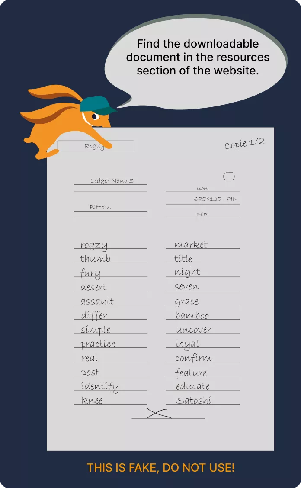

### Tips untuk melakukannya dengan benar

Ada juga solusi alternatif untuk kertas, seperti mengukir frasa mnemonik Anda pada pelat logam. Jika Anda menulisnya dengan salah, ahli waris Anda mungkin tidak dapat membacanya dan oleh karena itu mungkin tidak dapat memulihkan dana. Setelah kata-kata ditulis, disarankan untuk membuat salinan kedua dan menyimpannya di lokasi terpisah dari yang pertama. Ini memberikan cadangan dalam kasus kehilangan atau kecelakaan dengan salinan pertama.


Setelah salinan dibuat, simpan daftar kata-kata di tempat yang aman di mana Anda akan ingat untuk mencarinya! Jangan membuat rencana penyembunyian yang terlalu rumit di mana Anda berisiko kehilangannya.

> Kata-kata Anda = uang Anda.
Dompet "dingin" umumnya memiliki daftar kata ini, sama seperti dompet "panas" di ponsel atau PC. Metode cadangan kunci privat ini sekarang menjadi standar. Ini berarti Anda dapat memasukkan frasa mnemonik Anda ke dalam perangkat lunak dompet apa pun untuk mengembalikan milik Anda. Hanya dompet buruk yang kami sangat tidak menyarankan yang tidak akan memberi Anda daftar 24 kata, tetapi mungkin meminta akun, alamat email, atau lebih buruk, ID.
**PERHATIAN: Ketidakhadiran daftar 24 kata harus membuat Anda waspada.**

### Ringkasan cepat dalam poster!


## Bertahan terhadap ujian waktu
<chapterId>f58cd446-c202-5eff-aab7-e61cc40e5c06</chapterId>

Keamanan adalah perhatian utama dalam ekosistem Bitcoin. Memang, seperti bentuk kekayaan apa pun, bitcoin Anda harus dilindungi dari kehilangan, pencurian, dan degradasi, terutama dalam jangka panjang. Mengamankan bitcoin Anda memerlukan pengetahuan teknis dan kesadaran akan risiko yang terkait, yang membawa kita untuk membahas dua strategi utama: mengukir bitcoin Anda dalam baja dan membuat rencana warisan.

### Mengukir dalam batu

Salah satu metode untuk mengamankan bitcoin Anda dalam jangka panjang adalah dengan mengukir frasa mnemonik Anda pada material yang tahan seperti baja. Ini menciptakan cadangan fisik kunci Anda yang tahan terhadap kerusakan air dan api.

Ada banyak solusi untuk mencapai ini, beberapa berbiaya rendah seperti "Blockmit," sementara yang lain memerlukan lebih banyak peralatan. Anda dapat menjelajahi topik ini sendiri melalui bagian tutorial dari universitas ini.


### Pikirkan tentang generasi berikutnya!

Bersamaan dengan ini, membuat rencana warisan juga merupakan langkah penting untuk memastikan bahwa bitcoin Anda akan dikelola dengan baik setelah kematian Anda. Rencana ini dapat mencakup surat tulisan tangan yang merinci aset Anda, metode akses mereka, dan informasi kontak individu terpercaya untuk dihubungi. Juga penting untuk mendiskusikan warisan bitcoin dengan notaris untuk memastikan kepatuhan pajak, meskipun penting untuk tidak pernah langsung mempercayakan bitcoin Anda kepada pihak ketiga, termasuk notaris.

Jika Anda ingin lebih menjelajahi subjek rencana warisan untuk bitcoin Anda, kami merekomendasikan buku Pamela Morgan [Cryptoasset Inheritance Plan](https://planb.network/resources/books/28) atau mengambil kursus BTC102 di mana kami membimbing Anda dalam pembuatannya.

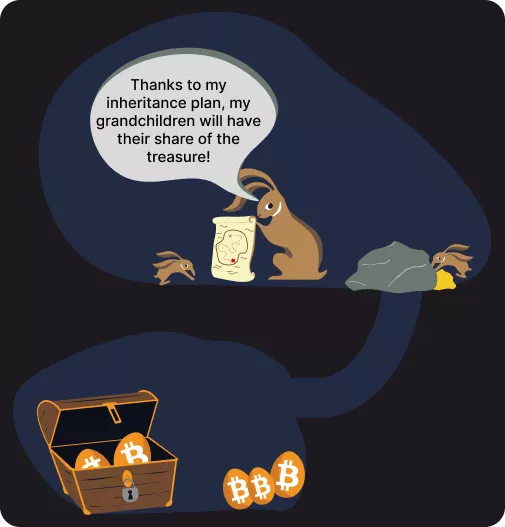

### Privasi itu penting

Keamanan jangka panjang bitcoin Anda tidak terbatas pada membuat cadangan fisik atau mengembangkan rencana warisan. Privasi adalah pertimbangan penting lainnya. Misalnya, lebih baik membeli bitcoin tanpa menyediakan identifikasi untuk meminimalkan risiko pencurian identitas atau sekadar pelacakan dana Anda oleh entitas mana pun dengan sarana yang cukup. Kursus BTC 205 dapat membantu Anda dengan ini jika diperlukan.

Mengenai privasi, sangat penting untuk menghindari berbicara kepada semua orang tentang bitcoin Anda. Memang, kita tidak tahu kemana aset ini akan pergi, dan menjaga kerahasiaan tentang kepemilikannya adalah keputusan yang bijaksana. Anda tidak ingin menarik perhatian pada diri Anda dan dompet Anda.

Dalam urat yang sama, hindari mengungkapkan sistem keamanan Anda dengan keras selama pertemuan bitcoin atau pertemuan dengan orang asing...

### Ringkasan cepat dalam poster!


### Ringkasan tentang keamanan dompet Bitcoin

Dompet Bitcoin adalah perangkat lunak yang memungkinkan Anda untuk menyimpan dan bertransaksi bitcoin. Ada beberapa jenis: dompet seluler atau PC, nyaman untuk jumlah kecil dan/atau pengeluaran rutin; dompet fisik, lebih cocok untuk menyimpan bitcoin dalam jangka menengah dan panjang; dompet multisig, yang lebih kompleks untuk dikelola dan memerlukan beberapa tanda tangan untuk melakukan transaksi.
Saat membuat dompet, Anda harus terlebih dahulu mencadangkan kunci privat Anda. Cadangan ini berbentuk daftar 12 atau 24 kata, atau 12 kata yang dapat Anda tulis pada selembar kertas atau pelat logam. Frase mnemonik ini memungkinkan Anda untuk mengembalikan dompet Anda di aplikasi dompet Bitcoin mana pun. Siapa pun yang memiliki akses ke daftar ini juga memiliki akses ke bitcoin Anda. Dalam Bitcoin, kedaulatan finansial berjalan beriringan dengan tanggung jawab individu, sehingga sangat penting untuk mengamankan akses ke dompet dan cadangan Anda. Untuk melakukan ini, penting untuk mengikuti beberapa aturan:
- Buat rencana warisan: untuk memastikan bahwa orang terkasih Anda dapat mengambil uang dalam kasus terjadi masalah.
- Hindari platform pertukaran: disarankan untuk menghindari meninggalkan Bitcoin Anda di platform pertukaran, karena mereka dapat rentan terhadap serangan peretas.
- Sesuaikan tingkat keamanan Anda: luangkan waktu untuk menjelaskan kebutuhan dan penggunaan Anda, ini akan membantu Anda membuat pilihan di antara dompet Bitcoin yang berbeda yang tersedia.

Sekarang setelah kita telah membahas dasar-dasar dompet Bitcoin dan praktik terbaik untuk mengamankannya, kita akan membahas fungsi teknis Bitcoin di bab berikutnya. Sekali lagi, mengetahui dasar-dasar protokol Bitcoin akan memungkinkan Anda untuk lebih memahami fungsinya, yang akan memungkinkan Anda untuk menggunakan Bitcoin dengan lebih baik.

# Aspek teknis Bitcoin.
<partId>a86d7439-e7a2-5f21-b1e9-6b5e23ca265b</partId>

## Memulai Bitcoin
<chapterId>b7561082-8943-519d-95d1-a5f60dd2686d</chapterId>

### Mari kita mulai dengan sedikit sejarah.


31 Oktober 2008 menandai kelahiran teknologi keuangan baru: Bitcoin. Pada tanggal ini Satoshi Nakamoto, penulis anonim Bitcoin, memperkenalkan inovasinya ke dunia melalui email yang disebarluaskan ke daftar surat cypherpunk, sebuah komunitas penggemar kriptografi yang bersemangat tentang privasi di internet.

Email ini berisi dokumen, yang disebut "White Paper," yang mempresentasikan fungsi Bitcoin. Mengingat kegagalan sistem uang digital sebelumnya, inisiatif ini tidak langsung menimbulkan antusiasme. Namun, White Paper ini akhirnya menjadi referensi bagi pengguna Bitcoin dan telah menjadi subjek banyak debat dalam ekosistem Bitcoin.


Pada 3 Januari 2009, Satoshi secara resmi mengawali jaringan Bitcoin dengan menciptakan blok pertama, yang juga dikenal sebagai blok genesis, yang menandai peluncuran blockchain Bitcoin. Blok ini berisi pesan yang mengungkapkan misi Bitcoin: "03/jan/2009 Kanselir di ambang bailout kedua untuk bank."


> "Kita dapat memenangkan pertempuran besar dalam perlombaan senjata dan mendapatkan
> wilayah kebebasan baru selama beberapa tahun.” - Satoshi Nakamoto


### Protokol Bitcoin mulai hidup

Pada 8 Januari 2009, Satoshi mengumumkan rilis Bitcoin-0.1.0. Tak lama setelah itu, Hal Finney mengambil alih perangkat lunak tersebut dan bergabung dengan jaringan. Sekarang, ada 2 node, dan oleh karena itu 2 penambang, dalam jaringan. Finney mengabadikan langkah ini dengan men-tweet "Running Bitcoin". Pada 12 Januari 2009, transaksi Bitcoin pertama dilakukan antara Satoshi dan Hal Finney. Transaksi ini, sebesar 10 BTC, dicatat dalam blok 170.

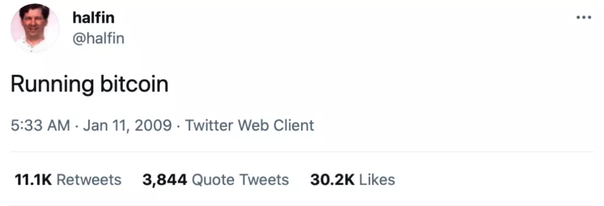
Ketertarikan terhadap Bitcoin berkembang pesat, dan banyak orang mulai menguji, berdebat, memecahkan bug, dan merenungkan aspek etis, ekonomi, dan filosofis dari Bitcoin. Untuk memfasilitasi pertukaran ini, forum BitcoinTalk dibuat pada 22 November 2009 oleh Satoshi. Forum ini dengan cepat menjadi tempat diskusi yang disukai oleh pengguna Bitcoin. Di sana, banyak meme dan simbol yang terkait dengan Bitcoin lahir, seperti [logo Bitcoin](https://bitcointalk.org/index.php?topic=64.0), [Hodl](https://bitcointalk.org/index.php?topic=375643.0) yang terkenal, atau bahkan [Hari Pizza](https://bitcointalk.org/index.php?topic=137.msg1195).

> **Tahukah Anda?** Memang, pada 22 Mei 2010, Laszlo Hanyecz membuat sejarah dengan Bitcoin dengan menawarkan untuk membeli 2 pizza dengan 10.000 BTC. Ini adalah pertama kalinya Bitcoin digunakan untuk membeli barang fisik.


### Menghilangnya Satoshi Nakamoto

Pada tahun 2010, saat Bitcoin mulai menarik perhatian media, Satoshi memutuskan untuk menjauh. Pada 12 Desember 2010, dia mempublikasikan postingan terakhirnya di forum, mengumumkan kepergiannya. Pada 23 April 2011, dia melakukan pertukaran pribadi terakhir yang diketahui melalui email. Satoshi kemudian menghilang, meninggalkan ciptaannya di tangan komunitas.

> “Pemerintah pandai memotong kepala jaringan yang terpusat
> seperti Napster, tapi jaringan P2P murni seperti
> Gnutella dan Tor tampaknya dapat bertahan.” - Satoshi Nakamoto

Meskipun tanpa kehadiran Satoshi, Bitcoin terus berkembang. Setiap 10 menit, sejarah Bitcoin ditulis, dan protokol terus berfungsi seperti yang dimaksudkan. Terlepas dari ketakutan, ketidakpastian, atau keraguan (FOMO untuk Fear Of Missing Out atau FUD untuk Fear Uncertainty Doubt), Bitcoin terus bergerak maju, dengan ketersediaan online sebesar 99.988%.

Bitcoin dipersepsikan secara berbeda oleh setiap individu. Bagi sebagian orang, itu adalah entitas jamur seperti [miselium](https://brandonquittem.com/bitcoin-is-the-mycelium-of-money/), bagi yang lain itu adalah [lubang hitam](https://dergigi.com/2019/05/01/bitcoins-gravity/). Suka atau tidak suka, Bitcoin terus ada, dengan ritme konstan 10 menit per blok, seperti detak jantung sistem moneter baru.

Untuk mempelajari lebih lanjut tentang tulisan Satoshi Nakamoto, saya merekomendasikan [buku Phil Champagne](https://planb.network/resources/books) atau dokumenter ARTE "le mystaire Satoshi".


> “Masalah utama dengan mata uang konvensional adalah semua kepercayaan yang diperlukan untuk membuatnya bekerja. Bank sentral harus dipercaya untuk tidak menurunkan nilai mata uang, tetapi sejarah mata uang fiat penuh dengan pelanggaran kepercayaan tersebut. Bank harus dipercaya untuk menyimpan uang kita dan mentransfernya secara elektronik, tetapi mereka meminjamkannya dalam gelombang gelembung kredit dengan hanya sebagian kecil dalam cadangan.”

Sekarang setelah kita memiliki beberapa latar belakang, mari kita lihat bagaimana transaksi Bitcoin bekerja secara umum.

### Ringkasan cepat dalam poster!

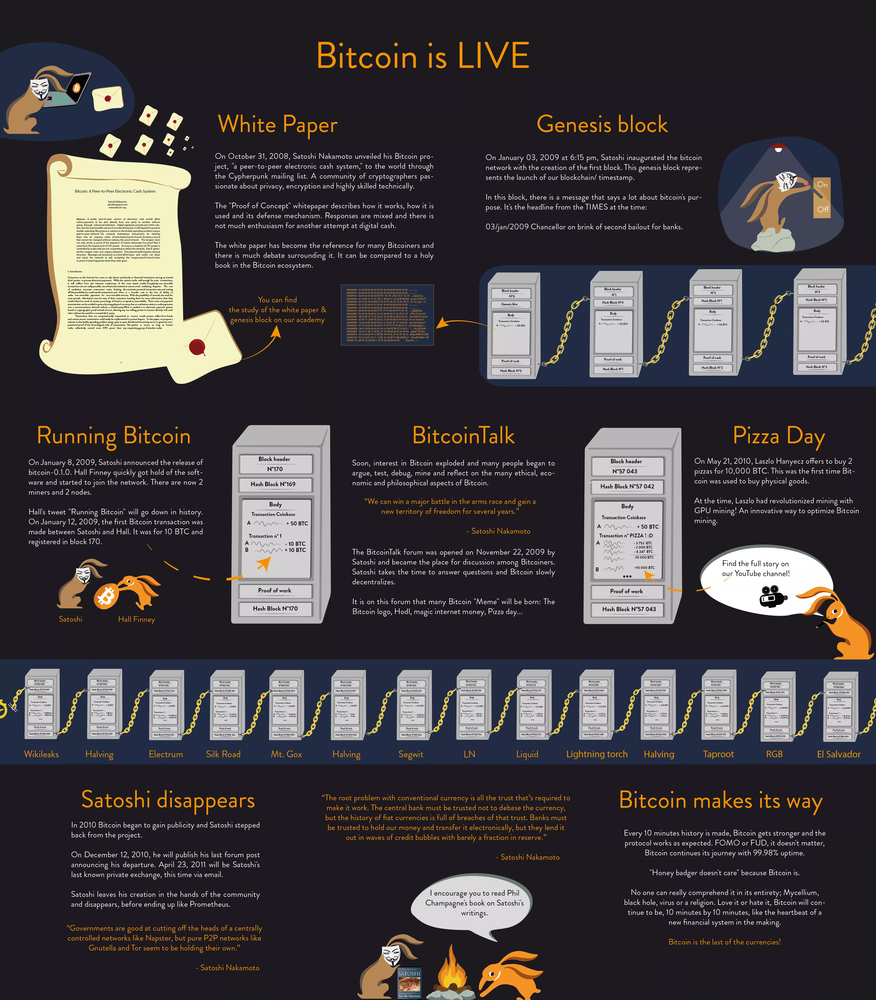

## Transaksi Bitcoin
<chapterId>03482644-5473-590b-975b-b43bb65eac21</chapterId>
Transaksi Bitcoin pada dasarnya adalah transfer kepemilikan bitcoin, menggunakan alamat Bitcoin. Mari kita ambil contoh dua tokoh: Alice dan Bob. Alice ingin mendapatkan bitcoin, sementara Bob sudah memiliki beberapa.

### Langkah 1 - Membuat transaksi melalui dompet

Untuk Bob mentransfer bitcoin kepada Alice, Alice harus memberikan salah satu alamat Bitcoinnya kepada Bob. Alamat ini, yang berasal dari kunci publik Alice, unik untuk dompet Bitcoinnya.

Secara konkret, Alice membuka dompetnya dan menekan "terima". Sebuah kode QR atau alamat seperti ini bc1q7957hh3nj47efn8t2r6xdzs2cy3wjcyp8pch6hfkggy7jwrzj93sv4uykr akan ditampilkan. Ini semacam "IBAN Bitcoin" miliknya. Dia memberikannya kepada Bob.

Kemudian Bob memulai transaksi menggunakan alamat penerimaan Alice. Bob, pada gilirannya, membuka dompet Bitcoinnya, menekan "kirim", menyalin dan menempelkan alamat tersebut, menambahkan jumlah dan biaya transaksi. Biaya ini merupakan insentif bagi penambang untuk memasukkan transaksi dalam blok berikutnya.


> **Mengapa membayar biaya?** Biaya ini penting untuk menciptakan pasar bebas untuk memasukkan transaksi dalam blok, karena jumlah transaksi dalam sebuah blok terbatas. Faktanya, sebuah blok memiliki ukuran 1 MB (dapat diperluas menjadi 4MB setelah pembaruan Segwit), yang sesuai dengan beberapa ribu transaksi per blok. Biaya sebuah transaksi proporsional dengan ukurannya. Ukuran transaksi, pada gilirannya, tergantung pada kompleksitas transaksi.

Untuk menyelesaikan transaksi, Bob harus memberikan tanda tangan dengan kunci pribadi dari alamat yang dia gunakan untuk membayar Alice. Ini memverifikasi bahwa dia adalah pemilik bitcoin yang ingin dia transfer. Langkah ini biasanya dilakukan secara otomatis pada dompet seluler, atau merupakan konfirmasi pada dompet fisik Anda: "Apakah Anda yakin ingin mengirim X ke Y? Ya atau tidak".

### Langkah 2: Propagasi transaksi melalui node ke penambang

Pada tahap ini, transaksi telah dibuat dan dompet Bob akan membagikannya dengan jaringan Bitcoin. Untuk melakukan ini, dompetnya akan berkomunikasi dengan node dari jaringan Bitcoin, dan node ini akan menyebarkan informasi ini ke node lain. Langkah propagasi ini memungkinkan seluruh jaringan untuk melihat transaksi baru ini dan mempertimbangkannya.


Meskipun transaksi ini sekarang diketahui oleh semua orang (melalui alat yang disebut Mempool), transaksi tersebut belum tentu dianggap dikonfirmasi! Memang, para penambanglah yang memvalidasi transaksi dengan memasukkannya ke dalam blok dari blockchain kita yang terkenal.

Penambang memiliki peran mengambil transaksi yang valid dan belum dikonfirmasi, kemudian mengompilasinya ke dalam sebuah blok. Agar blok mereka menjadi blok berikutnya dalam blockchain Bitcoin, mereka harus menyelesaikan teka-teki kriptografi dalam proses yang disebut "proof of work".


### Langkah 3: Transaksi ditambang dalam sebuah blok oleh penambang.

Proof of work ini memerlukan menemukan "hash" yang valid untuk blok yang bersangkutan. Pikirkan ini sebagai sidik jari unik yang terkait dengan blok, terdiri dari 256 karakter. Validitas hash ini tergantung pada kesulitan jaringan Bitcoin. Kita akan membahas mekanisme ini lebih detail nanti. Untuk sekarang, anggap bahwa seorang penambang telah menemukan blok yang valid dan transaksi Bob kepada Alice termasuk di dalamnya.
Blok baru yang valid ini ditambahkan ke blockchain Bitcoin, yang merupakan buku besar publik dan tidak dapat diubah dari semua transaksi Bitcoin. Anggap itu sebagai buku besar bersama untuk semua pengguna Bitcoin. Menurut aturan protokol, sebuah blok ditambahkan kira-kira setiap sepuluh menit berkat penyesuaian kesulitan. Kita akan melihat dalam bagian tentang penambang mekanisme apa yang mencegah modifikasi buku besar transaksi Bitcoin.


### Langkah 4: Blok tersebut valid dan diverifikasi oleh node dompet Alice.

Pada tahap ini, transaksi dianggap valid, penambang kemudian akan menyebarkan blok baru melalui node mereka ke jaringan, dan dompet Alice akan diperbarui.


> Catatan: Meskipun Alice melihat bahwa dia telah menerima bitcoin di salah satu alamatnya, disarankan untuk menganggap transaksi sebagai tidak dapat diubah hanya ketika telah mendapatkan 6 konfirmasi. Ini berarti bahwa 6 blok lain telah ditambang di atas blok yang mengandung transaksi Bob. Dengan kata lain, semakin tua sebuah transaksi di blockchain, semakin tidak dapat diubah menjadi.

### Ringkasan cepat dalam sebuah poster!

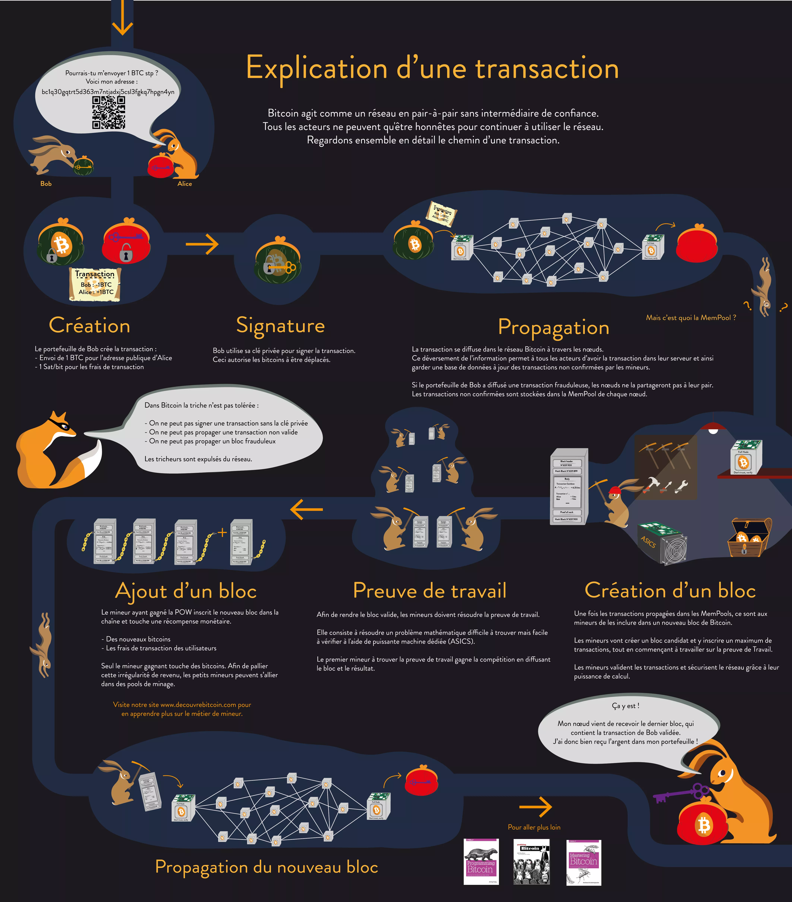

### Apa gunanya semua ini?

Pada akhirnya, sistem transaksi Bitcoin adalah terdesentralisasi dan berfungsi peer-to-peer, tanpa perantara terpercaya.

Bob mengirim transaksinya ke jaringan Bitcoin, dan ketika penambang mempublikasikan blok valid yang mengandung transaksi Bob, Alice dapat mulai menganggap bahwa bitcoin tersebut miliknya. Kepercayaan tidak diperlukan pada setiap langkah transfer kepemilikan bitcoin; hanya aturan protokol dan insentif ekonomi yang membuat bertindak dengan niat jahat dalam protokol Bitcoin terlalu mahal.

Pengguna mentransfer kepemilikan uang mereka dengan menandatangani transaksi secara digital dengan kunci pribadi mereka. Penambang memiliki sedikit kekuasaan, karena pengguna juga memiliki kontrol yang signifikan melalui node Bitcoin yang menangani validasi blok baru dan transaksi yang termasuk. Melalui jaringan node Bitcoin inilah jaringan benar-benar terdesentralisasi.

Faktanya, untuk benar-benar menghancurkan jaringan Bitcoin, semua salinan blockchain di semua node Bitcoin harus dihancurkan - tugas yang praktis mustahil karena distribusi geografis node ini dan kesulitan dalam menyita mereka secara fisik.

Mari kita lihat lebih dekat bagaimana node Bitcoin bekerja.

## Node Bitcoin
<chapterId>8533cebc-f799-528b-89df-8d75d4c37f1c</chapterId>

Node adalah elemen fundamental dari arsitektur jaringan Bitcoin. Mereka melakukan berbagai fungsi penting:

- Mempertahankan salinan blockchain Bitcoin
- Memvalidasi transaksi
- Menyampaikan informasi ke node lain
- Menegakkan aturan protokol Bitcoin.

Oleh karena itu, setiap perangkat yang menjalankan perangkat lunak Bitcoin, yang disebut node Bitcoin (sering melalui [Bitcoin Core](https://bitcoin.org/en/bitcoin-core/)), berkontribusi pada desentralisasi jaringan.


### Node adalah inti pusat dari Bitcoin.

Setiap node memiliki salinan blockchain, yang memungkinkan untuk verifikasi transaksi dan mencegah setiap upaya penipuan. Aspek desentralisasi dari jaringan memberikan ketahanan dan kekuatan luar biasa pada Bitcoin - untuk menghentikan protokol Bitcoin, semua node di seluruh dunia harus dimatikan. Untuk informasi Anda, saat ini (September 2023) terdapat sekitar [45,000 node](https://bitnodes.io/nodes/all/) yang tersebar di seluruh dunia.
Node mampu memverifikasi keabsahan blok dan transaksi karena mereka mengikuti aturan konsensus Bitcoin. Aturan-aturan ini mengatur, antara lain, kebijakan moneter Bitcoin seperti jumlah hadiah penambang (yang akan kita bahas lebih detail di bagian selanjutnya) dan jumlah bitcoin yang beredar. Node bertindak sebagai sistem hukum jaringan dalam suatu cara. Berkat mereka, semua peserta jaringan mengikuti aturan yang sama. Mereka memastikan netralitas protokol Bitcoin. Aturan konsensus sangat jarang berubah, jika ada, karena untuk membuat perubahan, persetujuan dari semua node diperlukan.


Tata kelola dalam protokol berada di luar cakupan pelatihan ini, tetapi ketahuilah bahwa setiap pengguna yang menjalankan node Bitcoin memutuskan aturan mana yang ingin mereka ikuti. Dengan demikian, pengguna dapat memutuskan untuk mengikuti aturan lain (yaitu, membuat modifikasi pada kode), tetapi jika modifikasi ini membatalkan aturan konsensus saat ini, maka node tersebut tidak akan lagi menjadi bagian dari jaringan Bitcoin. Modifikasi besar oleh karena itu jarang terjadi dan memerlukan koordinasi yang signifikan di antara ribuan aktor dengan ideologi dan kepentingan yang bervariasi, yang memaksa protokol untuk hanya menghasilkan pembaruan yang membuatnya "lebih baik" dalam pengertian semua pengguna Bitcoin.

### Seperti apa tampilan sebuah node?

Ada beberapa opsi yang tersedia bagi kita ketika kita ingin memiliki node sendiri, dan biaya pemeliharaannya bervariasi. Anda dapat dengan mudah menjalankan perangkat lunak Bitcoin Core di komputer Anda, tetapi ini akan memerlukan sejumlah besar ruang penyimpanan karena blockchain sekitar ~500GB. Untuk mengatasi kendala ini, Anda dapat memilih untuk hanya menyimpan blok N terakhir di memori, yang disebut "pruned node". Untuk jenis solusi ini, biayanya dapat diabaikan karena node hanya dinyalakan ketika Anda membutuhkannya.


Opsi kedua adalah menggunakan perangkat keras khusus untuk tujuan ini, seperti Raspberry Pi 4 dengan SSD yang cukup besar (sekitar ~1TB). Opsi kedua ini lebih mahal jika Anda harus membeli perangkat kerasnya, tetapi dari segi konsumsi listrik, ini mewakili sedikit kurang dari €10 per tahun.
Dari perspektif bandwidth, mengingat 1 blok 1MB setiap 10 menit, ini mewakili sekitar 5GB per bulan.

### Node harus tetap dapat diakses oleh semua orang!

Biaya terjangkau dan aksesibilitas sebuah node Bitcoin dalam hal sumber daya perangkat keras, penyimpanan, dan bandwidth adalah aspek yang sangat penting karena memfasilitasi desentralisasi jaringan.

Memang, setiap orang memiliki alasan yang baik untuk menjalankan sebuah node! Harga dan usaha minimal untuk manfaat yang diperoleh. Anda hanya perlu memulai petualangan dan bergabung dengan ribuan bitcoiner lainnya karena bersama kita membentuk jaringan Bitcoin.


Sebagai contoh, jika blok-bloknya 100 kali lebih berat, kita tentu bisa melakukan 100 kali lebih banyak transaksi setiap 10 menit, tetapi menjalankan sebuah node Bitcoin akan memerlukan hard disk 50TB, bandwidth lebih dari 500GB/bulan, dan perangkat keras yang mampu memvalidasi ratusan ribu transaksi dalam waktu kurang dari 10 menit. Dalam situasi hipotetis dengan blok 100 kali lebih besar, menjalankan sebuah node Bitcoin tidak akan dapat diakses oleh orang rata-rata, yang akan mengkompromikan desentralisasi protokol dan keabadian transaksi dan aturan konsensus. Dengan demikian, batasan protokol juga dipilih untuk memungkinkan sebanyak mungkin orang menjalankan node Bitcoin mereka sendiri.
Situasi ini tidak sepenuhnya hipotetis karena tahun 2017 ditandai oleh kontroversi intens yang dikenal sebagai "perang blok". Konflik ini menentang aktor yang ingin memodifikasi Bitcoin dengan meningkatkan ukuran blok untuk meningkatkan kapasitas transaksi, dengan mereka yang berusaha untuk mempertahankan kemandirian dan kekuatan pengguna. Pada akhirnya, pengguna dan node menang dengan menolak perubahan yang diusulkan yang dimulai oleh penambang, platform pertukaran, dan institusi.

Menyusul kemenangan ini, node mengaktifkan pembaruan yang disebut SegWit, membuka jalan untuk implementasi Lightning Network, sebuah jaringan pembayaran Bitcoin instan yang menggunakan blockchain Bitcoin. Situasi ini menunjukkan bahwa pengguna, melalui node mereka, memiliki kekuatan nyata dalam Bitcoin, memungkinkan mereka untuk melawan institusi besar.

### Ringkasan dalam poster!


## Penambang
<chapterId>dbb8264a-7434-57e4-9d1b-fbd1bae37fdf</chapterId>

> Penambang berfungsi untuk mengamankan jaringan dan menambahkan transaksi ke dalam blok. Mereka menggunakan listrik melalui mesin ASIC untuk menyelesaikan bukti kerja Bitcoin.


### Penjelasan tentang Bukti Kerja

Bukti Kerja, juga dikenal sebagai "Proof of Work" (POW), adalah konsensus keamanan dari protokol Bitcoin. Ini adalah aturan yang memungkinkan Bitcoin beroperasi dan memastikan ketangguhannya. POW adalah dasar dari segalanya dan memainkan peran krusial dalam teori permainan Bitcoin.

Bayangkan ini sebagai lotere raksasa di mana semua orang dapat berpartisipasi. Tujuannya adalah untuk menemukan nomor spesifik yang akan memungkinkan untuk penandatanganan blok yang valid, dan pemenangnya menerima hadiah dalam bitcoin. Nomor ini sangat sederhana untuk diverifikasi tetapi sulit untuk ditemukan. Faktanya, verifikasi yang mudah dilakukan melalui fungsi hash SHA-256, yang termasuk dalam algoritma penambangan. Untuk menemukan nomor ini, peserta (penambang) akan mencoba miliaran kemungkinan, seperti 1, 52, 2648, 26874615, 15344854131318631, dll.

Jika nomor yang dipilih benar: Jackpot! Jika tidak, pencarian dilanjutkan. Untuk mengoptimalkan jumlah percobaan, mereka akan menggunakan mesin khusus yang disebut ASIC, yang memiliki peran tunggal untuk menghitung miliaran kemungkinan per detik. Jumlah total percobaan disebut HashRate dan memungkinkan untuk mengkuantifikasi keamanan protokol Bitcoin. Untuk mengoperasikan mesin ini, harus dikonsumsi sejumlah besar listrik. Oleh karena itu, POW mengubah energi menjadi mata uang, menghubungkan dunia nyata dan dunia digital untuk menciptakan mata uang berbasis energi pertama.

Mesin berjalan, dan setelah rata-rata 10 menit, seorang pemenang akan muncul. Mereka akan menemukan hash yang benar di bawah ambang kesulitan. Pemenang besar dan satu-satunya kemudian akan menandatangani blok baru dari server timestamp dan melanjutkan blockchain. Pemenang menerima hadiah mereka dan kembali untuk mencoba keberuntungan mereka untuk blok berikutnya. Proses ini telah berulang selama 12 tahun, dan setiap 10 menit, seorang pemenang mengonfirmasi transaksi Bitcoin sambil terus mengamankan transaksi masa lalu. Membuat blockchain Bitcoin kita lebih kuat dan aman.

Setiap 2 minggu (2016 blok), penyesuaian kesulitan menyeimbangkan kembali permainan penambangan global berdasarkan jumlah peserta.

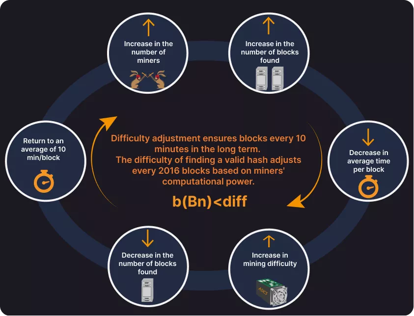

### Penambangan terus berkembang
Selama bertahun-tahun, para penambang telah melengkapi diri mereka dengan perangkat keras komputer yang semakin efisien untuk menghasilkan sebanyak mungkin hash per detik (disebut HashRate) sambil mengonsumsi jumlah energi paling sedikit dengan cara yang paling hemat biaya. Penambang awal seperti Satoshi atau Hal Finney menambang hanya dengan CPU mereka, kemudian yang lain mulai menambang dengan kartu grafis mereka. Saat ini, para penambang menggunakan apa yang disebut ASICs (Application-Specific Integrated Circuit), mesin yang dirancang khusus untuk menerapkan algoritma SHA256.


Hashrate dari jaringan Bitcoin mewakili jumlah percobaan yang dilakukan per detik untuk menemukan blok berikutnya. Hari ini adalah sekitar 400 TH/s, yang merupakan 400.000 miliar percobaan per detik! Semakin tinggi hashrate global, semakin sulit bagi aktor jahat untuk memonopoli sumber daya yang diperlukan untuk memperoleh mayoritas penambangan dan melakukan double spend. Oleh karena itu, lebih ekonomis untuk mengikuti aturan protokol Bitcoin daripada bertindak melawannya. Ini menimbulkan pertanyaan: bagaimana cara penambang dibayar?


### Apa yang dapat ditemukan dalam sebuah blok?


Header blok berisi beberapa elemen seperti waktu, target kesulitan, nomor blok terakhir, versi yang digunakan, dan Merkel Root dari transaksi sebelumnya.

Transaksi coinbase selalu yang pertama; ini mencakup hadiah yang diterima untuk melakukan pekerjaan validator. Kemudian datang transaksi yang divalidasi. Penambang akan memilih transaksi yang membayar paling banyak dan mencoba membuat blok yang memaksimalkan pendapatan mereka, yaitu transaksi berukuran kecil dengan biaya maksimum.

### Kompensasi Penambang

Awalnya, seorang penambang dikompensasi ketika mereka menemukan blok yang valid. Lebih tepatnya, mereka dikompensasi dengan dua cara: (i) melalui subsidi (bitcoin yang baru dicetak) yang termasuk dalam blok dan (ii) melalui biaya transaksi dalam transaksi yang termasuk dalam blok. Jumlah subsidi didefinisikan oleh aturan konsensus dan tergantung pada Epoch yang kita berada. Hadiah blok = Subsidi blok + biaya transaksi.

Memang, untuk blok pertama, subsidi blok adalah 50 bitcoin, kemudian setiap 210.000 blok (sekitar setiap 4 tahun), itu dibagi dua. Hari ini (di 2023), kita berada di Epoch ke-4; oleh karena itu, subsidi adalah 6.25 bitcoin. Subsidi ini adalah mekanisme untuk menciptakan bitcoin baru di Bitcoin. Karena subsidi berkurang dari waktu ke waktu, ini berarti bahwa ada batas 21 juta bitcoin - saat ini, sudah ada lebih dari 19,4 juta bitcoin yang beredar, yang lebih dari 92%.


Metode kedua kompensasi didefinisikan oleh jumlah yang dipilih oleh pengguna untuk biaya transaksi. Karena penambang ingin memaksimalkan pendapatan mereka, mereka akan cenderung memprioritaskan transaksi dengan biaya transaksi tinggi; biaya transaksi mencerminkan urgensi pengguna untuk memiliki transaksi mereka termasuk dalam blok berikutnya.


Selanjutnya, untuk menstabilkan model ekonomi penambang, yang bergantung pada hadiah yang mereka terima untuk setiap blok yang valid, penambang sering berkolaborasi dalam kelompok melalui "mining pools," di mana mereka menggabungkan sumber daya komputasi mereka.

### Mengapa repot-repot melakukan semua ini?
Singkatnya, inovasi Bitcoin adalah mengusulkan solusi untuk masalah pengeluaran ganda melalui penggunaan blockchain yang berbasis pada Proof of Work dengan kesulitan yang berubah-ubah. Dalam dunia digital, konsep kepemilikan berbeda dari dunia fisik. Memang, dalam dunia digital, segala sesuatu dapat disalin dan ditempel, yang menimbulkan masalah dalam hal pengeluaran ganda untuk aset digital yang bernilai. Perantara terpercaya, seperti bank, telah diciptakan untuk menyelesaikan masalah teknologi ini dan memastikan bahwa ketika sebuah aset ditransfer, aset tersebut tidak lagi dimiliki oleh pengirim. Tapi bagaimana ini bisa dilakukan tanpa perantara terpercaya? Masalah ini setara dengan Masalah Jenderal Bizantium, sebuah masalah koordinasi informasi dalam sistem di mana berbagai aktor tidak dapat dipercaya.

Bitcoin adalah semacam solusi untuk menyelesaikan masalah ini, atau setidaknya untuk mengatasinya. "Jenderal" dari Bitcoin, atau penambang, menghasilkan blok (informasi) dan node Bitcoin memverifikasi transaksi keuangan menggunakan aturan konsensus untuk memastikan keaslian informasi. Asimetri dalam biaya energi antara produksi informasi dan verifikasi memastikan keandalan informasi, tanpa pihak ketiga yang terpercaya.

Penambang adalah pembangun keamanan jaringan Bitcoin. Dengan menghabiskan energi untuk menghasilkan hash, mereka membangun dinding yang membuatnya sangat mahal bagi agen jahat untuk menulis ulang sejarah transaksi. Insentif ekonomi ini mencegah mereka untuk berperilaku tidak jujur.

Bahkan dalam kasus serangan 51%, yang berarti bahwa agen memiliki lebih dari setengah dari hashrate, jaringan tetap aman karena penyerang harus menghabiskan energi sebanyak yang dikombinasikan oleh semua penambang untuk mencoba memodifikasi blockchain. Berkat mekanisme proof of work ini, yang memerlukan energi untuk dilakukan, jaringan menjadi aman.

### Ringkasan

Teori permainan yang diterapkan pada Bitcoin mengeliminasi penambang yang tidak jujur. Penambang menggunakan mesin ASIC untuk menambang dan menerima hadiah jika berhasil. Selain itu, mereka sering bergabung dengan kolam penambangan untuk berbagi kekuatan komputasi mereka dan menerima hadiah yang lebih kecil namun lebih teratur. Penambangan Bitcoin adalah proses dengan biaya energi yang tinggi tetapi sangat penting untuk fungsi dan keamanan jaringan Bitcoin. Proof of work dan blockchain menyelesaikan masalah pengeluaran ganda dan memastikan kebenaran informasi tanpa pihak ketiga yang terpercaya. Pengeluaran energi diperlukan untuk menghasilkan informasi, tetapi verifikasi informasi memiliki biaya yang dapat diabaikan. Asimetri ini menjamin keamanan jaringan. Oleh karena itu, lebih ekonomis untuk mengikuti aturan konsensus daripada melanggarnya.

### Ringkasan cepat dalam poster!

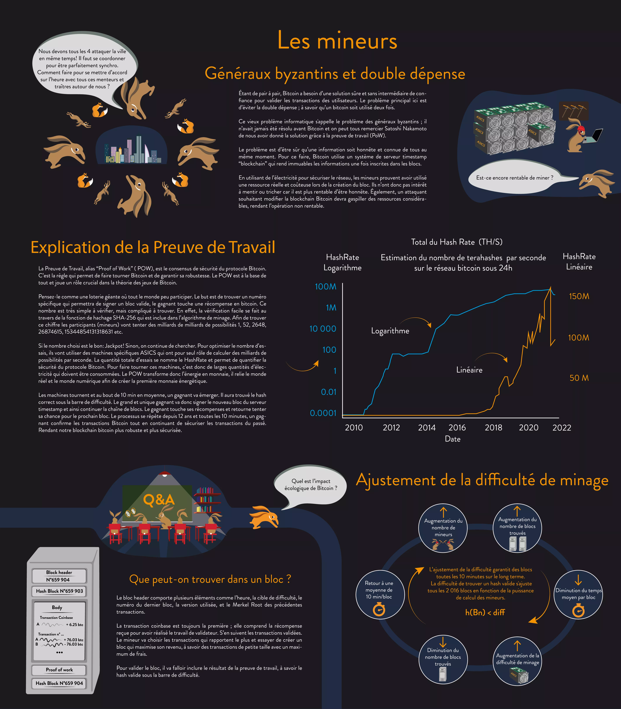

## Bitcoin dan Ekologi
<chapterId>4b227ae6-443a-5739-b443-60b7931130d9</chapterId>

Kita baru saja melihat di bagian sebelumnya bahwa keamanan protokol Bitcoin bergantung pada biaya energi yang tinggi untuk menghasilkan buku besar publik transaksi tanpa pihak ketiga yang terpercaya. Biaya energi secara keseluruhan sering dibandingkan dengan konsumsi listrik sebuah negara kecil. Tapi apakah perbandingan ini masuk akal? Apakah relevan untuk memahami alasan di balik biaya seperti itu?

### Biaya energi dari Bitcoin.
Pertama, mari kita nilai secara kualitatif biaya lingkungan dari penambangan. Seorang penambang harus memiliki mesin seperti ASIC dan sumber energi berupa listrik untuk mengoperasikan mesin-mesin ini. ASIC kebanyakan terbuat dari aluminium dan dapat didaur ulang atau digunakan kembali untuk tujuan kedua (seperti yang ditunjukkan dengan [proyek Attakaï](https://decouvrebitcoin.fr/attakai/), yang mengubah Antminer S9 menjadi pemanas ruangan). Kekhawatiran utama adalah oleh karena itu konsumsi energi. Mari kita coba memberikan lebih banyak konteks untuk ini.
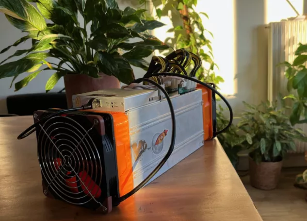

Konsumsi listrik mewakili hampir semua biaya bagi penambang. Oleh karena itu, mereka didorong untuk menemukan sumber listrik yang murah. Namun, karena penambang bersifat mobile, mereka dapat pergi ke tempat-tempat di mana pembangkit listrik dipasang tetapi belum terhubung ke jaringan listrik wilayah tersebut. Penambang bertindak sebagai pembeli terakhir, memungkinkan pembangkit listrik untuk mengamankan pembiayaan bahkan sebelum terhubung ke jaringan listrik. Dan ketika mereka terhubung, permintaan listrik akan meningkat, yang akan menaikkan harga dan membuatnya kurang menguntungkan bagi penambang untuk mendapatkan listrik di tempat-tempat tersebut. Penambang kemudian akan memutuskan untuk memindahkan instalasinya dan menetap lebih jauh di mana permintaan rendah dan oleh karena itu harganya juga rendah.

### Debat yang tidak berkesudahan

Dengan demikian, debat tentang dampak ekologis Bitcoin sering kali salah arah, terutama karena pemahaman yang tidak cukup tentang kegunaan dan operasinya. Bitcoin tidak dapat dinilai hanya dalam hal biaya energi per transaksi, karena penambang mengamankan baik jaringan saat ini maupun historis, transaksi dikelompokkan dan tidak semua setara, dan dampak dari Lightning Network tidak diperhitungkan. Mereka yang mengklaim bahwa Bitcoin mengonsumsi terlalu banyak energi mungkin memiliki motivasi politik atau berusaha menjual solusi blockchain mereka sendiri. Preteks ekologis digunakan untuk membenarkan pelarangan Bitcoin.

Namun, tidak boleh dilupakan bahwa Bitcoin, sebagai penemuan revolusioner, telah memberikan individu yang hidup di bawah penindasan finansial atau rezim diktator sebuah cara untuk berjuang demi kebebasan mereka. Sebagai pilihan terakhir, Bitcoin menawarkan bentuk kebebasan finansial dengan melarikan diri dari sensor dan pembatasan perbankan. Bitcoin lebih dari sekadar mata uang. Ini adalah bentuk komunikasi dan ekspresi kebebasan. Energi yang dihabiskan oleh penambang berkontribusi pada pertahanan kebebasan kita. Bitcoin memungkinkan untuk pembebasan dari sistem keuangan saat ini, yang didominasi oleh utang dan penciptaan uang berlebihan oleh bank sentral.


Bagi mereka yang tinggal di negara-negara dengan inflasi tinggi, Bitcoin adalah masalah bertahan hidup. Ini menyediakan sarana untuk bertahan dalam situasi keuangan yang tidak stabil. Selain itu, Bitcoin menawarkan sistem keuangan yang lebih adil dan setara. Ini juga memberikan kesempatan bagi miliaran orang di seluruh dunia untuk mengakses sistem keuangan. Dilihat dari perspektif ini, apakah konsumsi energi sah?

### Bisakah Bitcoin menjadi positif netto bagi lingkungan?

Akhirnya, sangat penting untuk membahas masalah ekonomi dan lingkungan dari adopsi Bitcoin.

Terutama saat membandingkannya dengan sistem keuangan saat ini. Yang terakhir, karena dorongannya terhadap konsumsi berlebihan dan utang, menimbulkan masalah serius. Akses mudah ke kredit, penerbitan uang oleh bank, dan penggunaan perbankan cadangan fraksional adalah semua faktor yang mempromosikan kelebihan utang dan, akibatnya, konsumsi berlebihan.


Perlu ada reformasi sistem moneter agar mencerminkan kelangkaan sumber daya kita dengan kelangkaan mata uang kita. Ini akan mendorong konsumsi yang lebih bertanggung jawab dan visi jangka panjang. Sebaliknya, inflasi, dengan mendorong konsumsi dan investasi, memiliki dampak negatif jangka panjang terhadap lingkungan.
Sistem keuangan saat ini sejalan dengan ide-ide ekonomi Keynesian, yang, tidak seperti ekonomi Austria, tidak memperhitungkan aspek temporal dan dinamis dari situasi dan sumber daya. Dengan kata lain, mata uang yang tidak terbatas tidak dapat secara efektif mencerminkan sumber daya terbatas dari planet kita.


Politisi, karena visi jangka pendek mereka dan kebutuhan mereka akan pertumbuhan ekonomi untuk terpilih kembali, tidak mampu menyelesaikan masalah ekologis dalam jangka panjang. Sebaliknya, adopsi mata uang yang stabil seperti Bitcoin adalah alternatif potensial yang dapat memberdayakan masyarakat secara ekonomi.

Api di sumur minyak, yang membakar metana untuk mencegah polusi, dapat dipadamkan oleh penambang Bitcoin, yang bermanfaat bagi lingkungan. Bitcoin mendorong penggunaan energi hijau. Metana dapat dikonversi menjadi listrik untuk menggerakkan mesin penambangan, yang menguntungkan bagi semua orang.

Teknologi Bitcoin sering disalahpahami, dan kritik terhadap dampak lingkungannya sering kali sederhana dan jangka pendek. Kritik ini sering kali dimotivasi oleh kepentingan politik. Bitcoin memiliki potensi untuk membantu dengan transisi ekologis dan berkontribusi pada dunia yang lebih hijau. Media sering menyebarkan ide palsu tentang Bitcoin dan ekologi. Jadi, luangkan waktu untuk membentuk opini Anda sendiri. Semuanya transparan dengan Bitcoin.

> Ikuti salah satu maksim Bitcoin: Jangan percaya, verifikasi sendiri!

### Ringkasan cepat dalam sebuah poster!


### Ringkasan singkat aspek teknis Bitcoin

Satoshi Nakamoto merilis protokol Bitcoin pada Januari 2009, yang sejak itu berkembang berkat komunitas pengembang, penambang, dan pengguna dengan node Bitcoin yang terus bertambah. Dengan menyimpan salinan mereka sendiri dari blockchain Bitcoin, sebuah buku besar publik dari semua transaksi Bitcoin, node-node ini dapat memastikan validitas transaksi sesuai dengan aturan konsensus Bitcoin. Ini termasuk memastikan bahwa penambang menghasilkan blok yang valid, yang berisi ribuan transaksi yang tertunda.

Rata-rata, sebuah blok dibuat setiap 10 menit, dan penambang yang menemukan hash yang valid untuk blok berikutnya diberi hadiah oleh protokol dengan jumlah yang ditentukan oleh aturan konsensus, serta biaya transaksi dari semua transaksi yang termasuk dalam blok yang valid. Karena hasil dari algoritma hashing (SHA256) untuk input tertentu dianggap tidak dapat diprediksi, proses penambangan melibatkan pembuatan banyak blok kandidat dan pengujian apakah hash mereka valid atau tidak. Namun, untuk memastikan bahwa waktu rata-rata antara dua blok tetap konstan (~10 menit) terlepas dari jumlah penambang dan kekuatan komputasi mereka, kesulitan menemukan hash yang valid menyesuaikan setiap 2016 blok, sekitar setiap 2 minggu. Penambang telah mengembangkan mesin SHA256 khusus seiring waktu, yang disebut ASICS, untuk meningkatkan hash rate per joule, yang berarti jumlah percobaan per detik dan per energi yang dikonsumsi.

Agar penambang bisa seprofit mungkin dalam aktivitas mereka, mereka harus mendapatkan listrik dengan harga termurah mungkin, yang seringkali berada di lokasi terpencil, di dalam pembangkit listrik yang belum terhubung ke jaringan. Penambang kemudian bertindak sebagai pembeli pilihan terakhir, dan segera setelah harga listrik meningkat karena peningkatan permintaan, penambang akan cenderung memindahkan aktivitas mereka ke tempat lain.
Dengan demikian, protokol Bitcoin adalah sistem moneter yang tidak dapat disensor dan tidak dapat dihentikan karena setiap komponen dari protokol tersebut tersebar secara geografis di seluruh dunia - misalnya, ada sekitar 40.000 node Bitcoin di semua benua. Aturan konsensus Bitcoin sedemikian rupa sehingga secara ekonomi lebih menguntungkan untuk mengikutinya daripada mencoba melanggarnya, dan oleh karena itu tidak diperlukan kepercayaan antar pelaku. Bitcoin tidak memiliki pemimpin dan tidak dapat dihentikan. Memang mungkin untuk mengatur platform pertukaran untuk membatasi Bitcoin, tetapi ini terbatas dalam hal dampak. Singkatnya, tidak ada hakim atau negara yang dapat menyensor atau menghentikan Bitcoin.
# Bagaimana cara mendapatkan Bitcoin?
<partId>517e1bb7-f032-51a0-930a-a91fe5148d3f</partId>

## Bitcoin tidak pernah tidur!
<chapterId>d5e35e41-ea26-5478-8eb9-07daf9dff508</chapterId>

Harga Bitcoin sering kali ditandai dengan volatilitas yang signifikan. Nilainya dapat berfluktuasi secara signifikan tergantung pada variasi pasar dan fase pasar bullish dan bearish. Ini hadir dalam 100% pasar keuangan, termasuk Bitcoin.


> Untuk menyederhanakannya: manusia membeli semua pada saat yang sama dan menjual semua pada saat yang sama. Bitcoin tidak kebal terhadap sifat manusia.

### Memahami Gelombang Adopsi

Pengembangan dan evolusi Bitcoin sebagian besar terkait dengan kelompok-kelompok pelaku yang secara bertahap mengintegrasikan ekosistemnya.


- Para penganut:

Pengguna awal Bitcoin terutama adalah teknofil, cypherpunks, libertarian, dan penggemar emas. Kelompok-kelompok ini tertarik pada Bitcoin karena kemampuannya menawarkan solusi seperti uang elektronik tanpa kepercayaan, resistensi terhadap sensor, atau kebijakan moneter yang transparan dan tidak dapat diubah.

- Dark web & kriminal

Kemudian, penggunaan Bitcoin berkembang ke pasar gelap web seperti Silk Road karena sifatnya yang tidak terkontrol dan pseudonim. Situs ini menarik perhatian pada sifat Bitcoin yang tidak terkontrol dan pseudonim, yang mendorong beberapa pelaku kriminal untuk menggunakannya. Namun, perlu dicatat bahwa penggunaan sebuah alat, bukan alat itu sendiri, yang menentukan legalitas atau ilegalitasnya. Perlu dicatat bahwa penggunaan ilegal Bitcoin tidak menjadikan seseorang sebagai kriminal itu sendiri. Ini adalah penggunaan, bukan alat, yang dapat diklasifikasikan sebagai ilegal. Misalnya, penggunaan Bitcoin untuk aktivitas seperti pembelian obat-obatan tertentu mungkin legal atau ilegal tergantung pada peraturan wilayah tempat aktivitas tersebut berlangsung.

- Demam ICO dan kedatangan masyarakat umum.

Tahun 2017 ditandai dengan gelembung spekulatif yang signifikan di dunia cryptocurrency, terutama dengan peluncuran ribuan Initial Coin Offerings (ICOs). Namun, banyak dari cryptocurrency baru ini tidak memiliki pengembangan atau utilitas konkret dan cepat menghilang. Gelembung 2017 ini diikuti oleh koreksi kuat pada 2018-2019.

- Gelembung NFT dan DeFi

Kemudian lagi pada tahun 2020, pasar mengalami gelembung spekulatif lain yang mendorong harga Bitcoin menjadi $60.000. Gelembung ini berbeda dari yang sebelumnya dengan diversifikasi investor yang lebih besar, termasuk lembaga keuangan dan perusahaan besar. Namun sekali lagi, koreksi kuat terjadi setelah euforia mereda.

### Bitcoin & Volatilitas

Berdasarkan siklus masa lalu, tampaknya periodisitas siklus ekonomi Bitcoin setara dengan durasi antara dua halving. Mungkin karena peristiwa halving bertindak sebagai pemicu dengan memotong setengah emisi bitcoin baru.
Fluktuasi signifikan ini telah menciptakan reputasi untuk bitcoin sebagai aset yang sangat berbahaya yang menyebabkan penggunanya kehilangan uang. Meskipun harga dapat turun sebesar 10-20 atau bahkan 50% dalam beberapa hari, penting untuk memahami bahwa Bitcoin, protokolnya, tidak terpengaruh oleh perubahan harga.

Volatilitas signifikan ini sepenuhnya diterima saat ini oleh pelaku Bitcoin dan dapat diminimalisir dengan beberapa solusi seperti lindung nilai keuangan (stablecoins), keyakinan jangka panjang yang kuat (hodling), atau sederhana tidak menaruh 100% uang seseorang ke dalam Bitcoin tanpa memahami apapun. Memahami mengapa harga bitcoin berfluktuasi begitu banyak adalah esensial untuk dapat maju di industri ini karena pada akhirnya, harga dan sikluslah yang menenangkan dan mengatur pasar kita sampai batas tertentu. Namun, dapat dicatat bahwa seiring pertumbuhan dan pematangan Bitcoin, volatilitas menjadi kurang signifikan.


Meskipun pasangan btc/dollar berfluktuasi dalam jangka pendek, bitcoin, karena jumlah terbatasnya sebanyak 21 juta bitcoin dan proses halvingnya (memotong penciptaan moneter setiap 4 tahun rata-rata), mengikuti tren umum naik secara kua-mekanis. Tentu saja, seperti aset keuangan apa pun, bitcoin tunduk pada siklus ekonomi termasuk periode euforia, gelembung spekulatif, dan koreksi. Fenomena ini cukup umum dalam teknologi baru, di mana pasar tidak selalu rasional atau efisien.

### Pasar yang unik

Siklus gelembung spekulatif ini cukup unik di dunia, karena sangat jarang aset yang sama mengalami begitu banyak gelembung satu demi satu. Ini dapat dijelaskan sederhana karena bitcoin bukanlah gelembung yang akan hilang tetapi mata uang yang sebenarnya digunakan di mana-mana di dunia. Protokol Bitcoin unik karena beroperasi secara global, 24 jam sehari, 7 hari seminggu, membuat regulasi sulit bagi otoritas keuangan.


Hari ini, di tahun 2023, Bitcoin terus bertahan dan tumbuh lebih banyak lagi dengan mengintegrasikan dirinya lebih banyak ke dalam pasar tradisional. Kedatangan ETF Bitcoin yang akan datang, regulasi yang lebih jelas, dan alat akuisisi atau penyimpanan yang lebih baik hanya mendorong tren ini. Bitcoin SEKALI LAGI bertahan dari gelembung spekulatifnya, jadi mungkin ini bukan semua omong kosong!


### Ringkasan cepat dalam poster!


## Mendapatkan bitcoin dengan bekerja
<chapterId>be2d83be-406f-582c-83ca-6aa905ff7b04</chapterId>

### Ekonomi paralel berkembang

Bitcoin dapat dilihat sebagai ekonomi paralel terhadap mata uang fiat. Ini berarti bahwa seseorang dapat menjual barang atau jasa dan dibayar dalam bitcoin. Transaksi dapat dilakukan langsung dalam bitcoin, tanpa perlu melalui platform pertukaran, cukup dari dompet Bitcoin ke dompet Bitcoin.

Ekonomi Bitcoin ada dan berkembang di beberapa wilayah dunia, seperti El Salvador di mana bitcoin telah menjadi alat pembayaran yang sah sejak 2021. Selain itu, beberapa individu, bisnis, dan organisasi sudah menerima Bitcoin sebagai alat pembayaran untuk produk atau jasa mereka.


Selain itu, untuk memudahkan penggunaan bitcoin dalam transaksi sehari-hari, telah diluncurkan sebuah proyek open-source dan kolaboratif: BTCMap (https://btcmap.org/map#2/21.28937/5.46680). Platform ini mencantumkan semua pedagang yang menerima bitcoin serta berbagai komunitas Bitcoin di seluruh dunia. Anda dapat mengunjungi situs web mereka untuk menemukan ekosistem Bitcoin di sekitar Anda. Dengan demikian, meskipun ada kesulitan dan keraguan, ada inisiatif seperti BTCMap yang berkontribusi membuat ekonomi Bitcoin lebih mudah diakses dan nyaman bagi semua orang.

### Mengapa menerima Bitcoin daripada membelinya?

Untuk mendapatkan bitcoin, Anda dapat membelinya di platform yang diatur oleh organisasi seperti AMF (Autorité des Marchés Financiers) di Prancis. Metode ini melibatkan risiko tertentu dan pelacakan transaksi Anda. Metode lain untuk mendapatkan bitcoin adalah dengan menerimanya sebagai alat pembayaran untuk produk atau layanan yang Anda tawarkan. Metode ini memungkinkan Anda untuk memperoleh bitcoin melalui pekerjaan Anda tanpa terus-menerus khawatir tentang harga Bitcoin.

Selain itu, menerima Bitcoin sebagai pedagang memiliki beberapa keuntungan, termasuk ketahanan terhadap sensor, biaya transaksi yang lebih rendah, peningkatan efisiensi, perlindungan terhadap inflasi, serta kebebasan dan kedaulatan finansial.

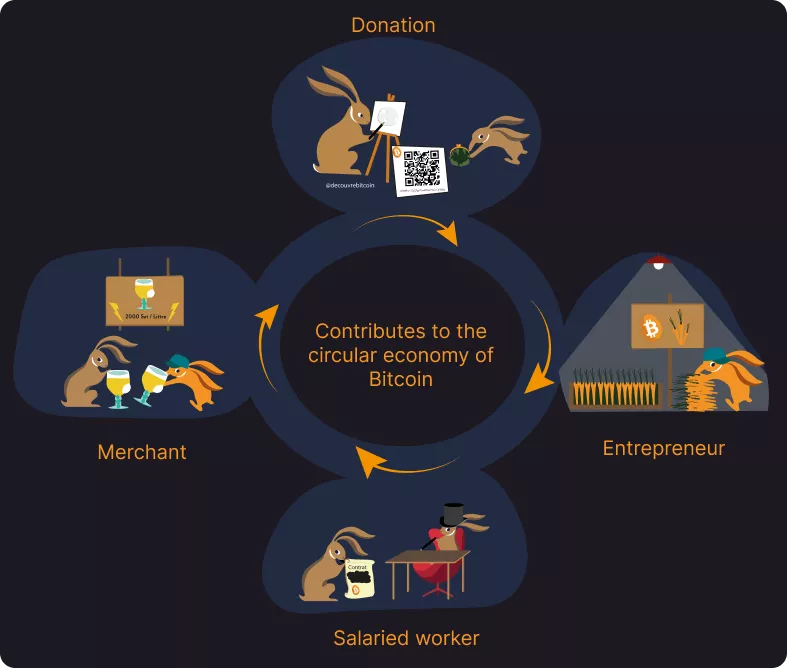

### Bagaimana cara melakukannya:

Untuk menerima Bitcoin, perlu untuk mempelajari solusi yang tersedia dan memilih yang paling cocok untuk bisnis Anda. Tidak ada solusi yang sempurna, dan beberapa faktor harus dipertimbangkan untuk membuat pilihan Anda, seperti volume transaksi yang diharapkan, anggaran yang dialokasikan, dan jenis bisnis (online atau fisik).

Kami akan membahas topik ini secara detail dalam pelatihan lain, tetapi untuk menjaganya sederhana, kita dapat mempertimbangkan beberapa kategori bisnis dan oleh karena itu solusi terkait:

- Solusi online sederhana: OpenNode
- Solusi untuk pedagang amatir: Swiss Bitcoin Pay
- Solusi untuk struktur besar atau bitcoiners yang bersemangat: BTCpay Server

### Ringkasan cepat dalam poster!

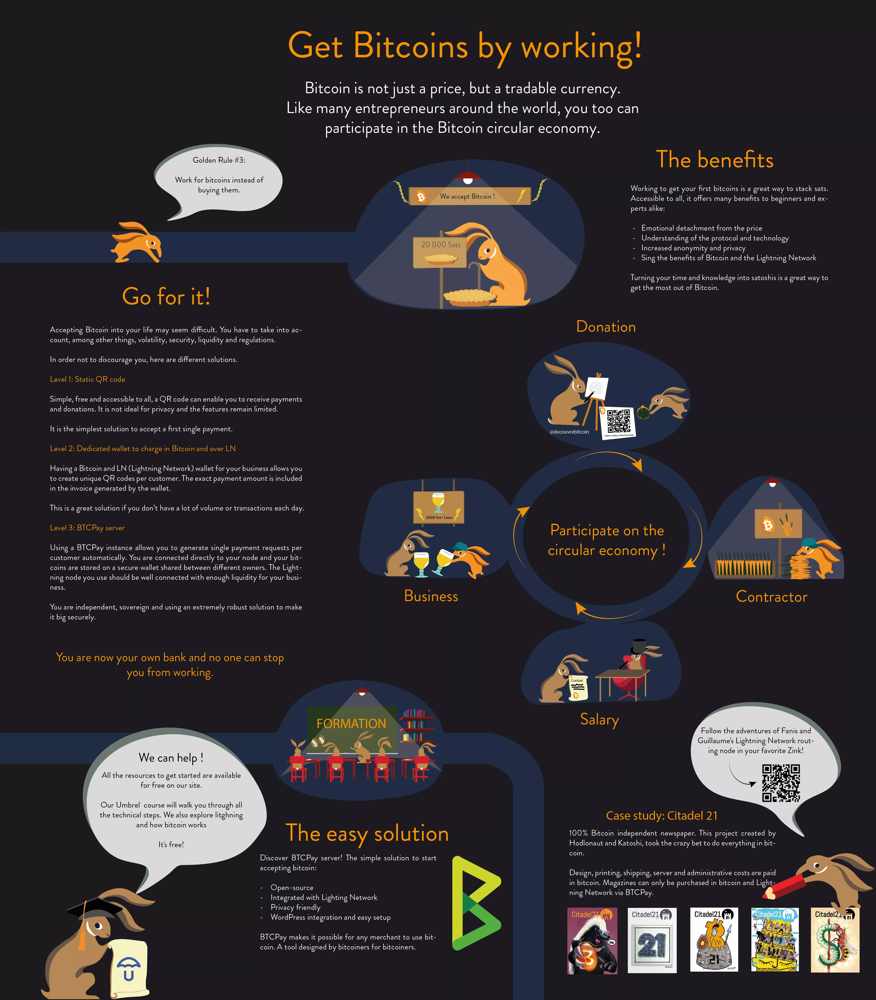

## Menabung dengan Bitcoin
<chapterId>1d9570c6-5b63-51a6-b87c-7bdb0fc4aa87</chapterId>

### Peringatan sebelum memulai!

Bitcoin telah menjadi aset keuangan utama, terutama karena pasokannya yang terbatas dan permintaan yang meningkat. Namun, membeli bitcoin membawa risiko yang memerlukan perhatian khusus. Oleh karena itu, disarankan untuk melakukan penelitian sendiri dan mempelajari lebih lanjut tentang subjek untuk menjadi akrab dengan teknologi sebelum berinvestasi.

- Hanya investasikan apa yang Anda mampu untuk kehilangan.
- Bitcoin adalah aset keuangan yang sangat fluktuatif; harganya bisa turun menjadi 0.
- Kinerja masa lalu tidak menunjukkan kinerja masa depan.
- Hubungi penasihat keuangan Anda jika diperlukan.

> DécouvreBitcoin (Rogzy) tidak memberikan saran investasi dan apa pun yang dinyatakan di sini tidak boleh dianggap sebagai saran tersebut.

### Mini Checklist sebelum terjun

Sebelum terjun ke dalam membeli bitcoin, pastikan Anda memiliki:

- Dompet yang aman.
- Pemahaman yang solid tentang Bitcoin.
- Rencana tabungan untuk diikuti.
- Visi jangka panjang.

Jika subjek masih belum jelas, ketahuilah bahwa kursus BTC102 akan memandu Anda dalam mengamankan dan memperoleh bitcoin pertama Anda. Di sini, kami hanya akan menyentuh permukaan topik.

Secara konkret, ada dua pertanyaan yang harus Anda tanyakan pada diri sendiri:

- Strategi akuisisi apa yang akan diadopsi: secara bertahap atau sekaligus?
- Platform mana yang akan digunakan: yang diatur atau tidak diatur?

### Strategi Akuisisi

- Dollar Cost Average
Pembelian berulang melibatkan pembelian jumlah kecil bitcoin pada interval reguler. Metode ini meratakan harga dari waktu ke waktu dan menyediakan pertumbuhan berkelanjutan dalam jumlah bitcoin yang dimiliki. Ini adalah solusi ideal untuk tabungan jangka panjang tanpa khawatir tentang harga dan volatilitas bitcoin. Aturlah dan lupakan tentang itu.
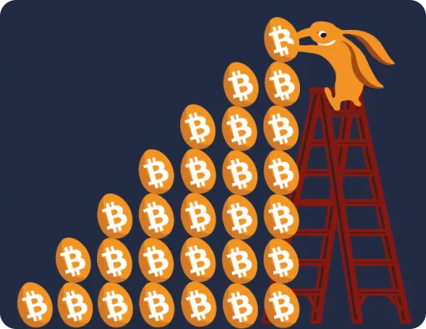

> Hati-hati dengan UTXO: Ingatlah untuk mengkonsolidasikan UTXO Anda di dompet Anda dari waktu ke waktu. Praktik ini penting untuk mengelola bitcoin Anda secara efektif dan menghindari biaya yang tidak perlu selama transaksi.

- Pembelian spontan

Pembelian spontan digunakan untuk segera mendapatkan eksposur terhadap bitcoin. Entah itu membeli saat terjadi crash atau memanfaatkan bonus, keputusan ada di tangan Anda. Anda perlu mengumpulkan keberanian Anda dan menekan tombol beli.

Mengingat volatilitas bitcoin yang signifikan, perhatian khusus harus diberikan pada emosi Anda. FOMO (Fear of Missing Out) dan FUD (Fear, Uncertainty, Doubt) adalah musuh terburuk Anda dalam konteks ini! Tetap tenang dan ikuti strategi yang telah Anda tetapkan sebelumnya untuk menghindari pengambilan keputusan impulsif dan berpotensi merugikan.

### Dari mana kita harus membeli bitcoin kita?

Ada beberapa cara untuk mendapatkan bitcoin, masing-masing dengan regulasinya sendiri. Beberapa platform memerlukan identifikasi untuk verifikasi, sementara yang lain tidak. Sangat penting untuk memahami regulasi yang terkait dengan setiap platform.

- Platform DCA

Metode umum untuk mengakumulasi bitcoin adalah Dollar Cost Averaging (DCA), yang melibatkan investasi jumlah kecil secara reguler. Beberapa platform menawarkan layanan ini, seperti yang terdaftar di [halaman khusus](https://planb.network/tutorials/exchange) kami. Selain kemudahan pengaturan DCA, penarikan ke dompet Anda umumnya otomatis, yang berarti Anda akan selalu memiliki kontrol atas aset Anda.

Hari ini, hampir semua solusi DCA cukup efisien dan memiliki biaya yang hampir serupa, jadi pilihan akan lebih bergantung pada ketersediaan di negara Anda.

- Platform broker

Untuk investasi skala besar, platform yang diatur dan diakui seperti Kraken, Bitstamp, dan Paymium direkomendasikan. Platform ini menawarkan lingkungan yang aman dan terjamin untuk transaksi volume tinggi.

Penggunaannya sederhana dan dapat diakses oleh semua orang:

1. Atur akun KYC/\*
2. Transfer dana ke akun Anda
3. Beli bitcoin
4. Tarik bitcoin ke dompet Anda


Setelah pembelian, disarankan untuk segera menarik bitcoin dari platform pertukaran untuk meminimalkan risiko peretasan dan pemblokiran dana. Biaya penarikan bisa tinggi, terkadang hingga 25 euro tergantung pada platform.

> Regulasi Know Your Customer (KYC) mengharuskan pengguna untuk menyediakan identifikasi untuk memerangi pendanaan terorisme, penghindaran pajak, dan pencucian uang.

Penting untuk dicatat bahwa KYC adalah topik penting di industri kami karena efektivitasnya masih mudah diperdebatkan sementara aspek negatifnya banyak. Dalam banyak program pelatihan dan konten universitas kami, kami menyarankan untuk tidak menggunakan platform KYC penuh jika Anda sudah merupakan pengguna lanjutan.

### Solusi Non-KYC

Selain itu, ada beberapa [marketplace](https://planb.network/tutorials/exchange) untuk membeli dan menjual bitcoin secara peer-to-peer. Jika Anda tertarik dengan ini, Anda dapat mengikuti kursus BTC 205 kami tentang subjek ini. Umumnya, solusi-solusi ini adalah:

- ATM Bitcoin
- Pertemuan fisik dengan penggemar bitcoin lainnya
- Platform ilegal dan tidak diatur
- Solusi pencocokan peer-to-peer
- Neobank yang beroperasi di negara-negara ramah Bitcoin.


Penting juga untuk dicatat bahwa pajak mungkin diterapkan di yurisdiksi Anda. Kami mengundang Anda untuk berkonsultasi dengan peraturan negara Anda sebelum mengambil tindakan apa pun yang mungkin menempatkan Anda dalam risiko.
### Ringkasan cepat dalam sebuah poster!


## Hiper-bitcoinisasi
<chapterId>b7275d31-3b60-5fb7-b9f5-030097010553</chapterId>

### Perlombaan liar baru saja dimulai!

Seperti teknologi baru pada umumnya, adopsi Bitcoin mengikuti kurva S. Kita telah melewati era pengadopsi awal dan indikator tampaknya menunjuk ke arah demokratisasi penuh Bitcoin. Ini adalah teknologi viral yang tidak bisa dihentikan. El Salvador telah mengambil langkah berani dengan mengadopsi Bitcoin secara penuh, menyatakan sebagai alat pembayaran yang sah. Namun, setiap negara bereaksi berbeda terhadap teknologi ini. Beberapa telah melarang dan mengkriminalisasi penggunaannya, menambah kompleksitas adopsi Bitcoin berdasarkan budaya, era, dan bangsa.

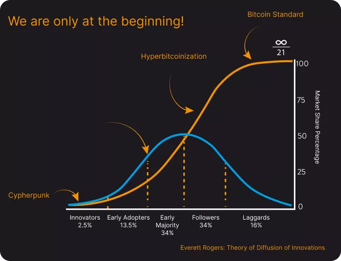

Meningkatnya Bitcoin memaksa perusahaan, universitas, regulator, dan individu untuk mempertimbangkan teknologi baru ini. Alat baru perlu diciptakan, layanan perlu disesuaikan, dan inovasi harus terus dilakukan untuk memastikan kelangsungan hidup mereka. Konteks ini menimbulkan banyak pertanyaan terkait berbagai bidang, termasuk kriptografi, teori permainan, ekonomi dan kebijakan moneter, ilmu komputer, filsafat, energi, hukum, dan regulasi. Singkatnya, Bitcoin adalah objek multidisiplin.


### Bitcoin adalah dari 0 ke 1

Kami mengundang Anda untuk merenungkan revolusi moneter baru ini. Ada begitu banyak hal untuk dijelajahi dengan Bitcoin sehingga sulit untuk memahami semuanya sekaligus. Ambil waktu Anda, Bitcoin tidak akan menghilang. Sebaliknya, revolusi baru saja dimulai. Bersama-sama, kami percaya bahwa kami mampu menciptakan dunia yang kami inginkan untuk diwariskan kepada anak-anak kami. Dunia di mana kedaulatan manusia adalah hak, di mana privasi dihormati secara default, dan di mana uang tidak dimanipulasi. Kami berharap bersama-sama kita akan mencapai ini.


Jika Anda ingin memperluas pengetahuan Anda tentang Bitcoin, sejumlah besar penulis, pemikir, dan esais telah berkontribusi pada lapisan pendidikan Bitcoin. Selama beberapa tahun terakhir, kami telah mencatat dan mengategorikan karya-karya ini untuk menawarkan [perpustakaan sumber daya](https://planb.network/resources) bagi Anda yang paling ingin tahu. Anda akan menemukan podcast terbaik, situs web, artikel, tutorial, buku, dan konten lainnya.

> Milton Friedman, seorang ekonom terkenal, memprediksi pada tahun 1999: "Saya pikir Internet akan menjadi salah satu kekuatan utama untuk mengurangi peran pemerintah. Satu hal yang hilang, tetapi yang akan segera dikembangkan, adalah e-cash yang dapat diandalkan - sebuah metode di mana di Internet Anda dapat mentransfer dana dari A ke B tanpa A mengetahui B atau B mengetahui A."

### Ringkasan cepat dalam sebuah poster!


# Masa Depan Bitcoin: Jaringan Petir
<partId>899fd35e-39e6-5a25-a73e-6fed6e725094</partId>

## Pengantar Singkat tentang Jaringan Petir
<chapterId>b403f1e4-f1ff-572b-a242-9b58cb3736d0</chapterId>
Sekarang setelah kita memahami dasar-dasar protokol Bitcoin, kita akan memperkenalkan sebuah jaringan pembayaran yang menggunakan protokol Bitcoin untuk memungkinkan transaksi super cepat. Kita tentu saja berbicara tentang Lightning Network!

### Dalam Sebuah Kacang

Lightning Network adalah teknologi revolusioner yang telah secara mendalam mengubah persepsi kita tentang Bitcoin. Ini adalah solusi yang menangani masalah skalabilitas Bitcoin.

Untuk sepenuhnya memahami Lightning Network, sangat penting untuk memahami bagaimana Bitcoin berkembang. Bitcoin berkembang dalam lapisan infrastruktur: lapisan pertama adalah blockchain, dan lapisan kedua adalah Lightning Network.


Diakui sebagai lapisan dari Bitcoin, Lightning Network divalidasi dan diimplementasikan pada tahun 2017. Ini memungkinkan transaksi Bitcoin yang instan dengan biaya rendah, sehingga menyelesaikan masalah skalabilitas Bitcoin. Tapi, apa sebenarnya masalah skalabilitas yang dihadapi Bitcoin ini?

### Sebuah Blockchain Tidak Dapat Tumbuh Tanpa Batas

Masalah skalabilitas merujuk pada tantangan dalam mengimplementasikan sistem moneter yang mampu menyediakan jumlah transaksi per detik yang terus meningkat seiring dengan adopsinya. Ini berkaitan dengan trilema blockchain. Bayangkan sebuah segitiga dengan desentralisasi, keamanan, dan skalabilitas sebagai titik-titik sudutnya.


Protokol berbasis blockchain hanya dapat memuaskan dua dari tiga aspek ini. Dalam protokol Bitcoin, pilihan telah dibuat untuk mendukung desentralisasi/keamanan. Di satu sisi, ukuran blok 1MB dan waktu antara dua blok (rata-rata 10 menit) memungkinkan menjalankan node Bitcoin dengan biaya lebih rendah, mendukung desentralisasi. Di sisi lain, produksi blok melalui Proof-of-Work membuat penipuan dalam protokol sangat mahal sambil memudahkan verifikasi oleh node jaringan, sehingga mendukung keamanan. Namun, pilihan ini memberikan batasan pada jumlah rata-rata transaksi dalam sebuah blok, kira-kira sesuai dengan beberapa transaksi per detik. Angka ini terlihat konyol jika dibandingkan dengan kapasitas pemrosesan dari prosesor pembayaran seperti VISA, yang adalah 1700/detik. Namun, batasan ini diperlukan untuk bertransaksi dengan Bitcoin secara tahan sensor dan tanpa kepercayaan. Namun, mereka yang mengembangkan Bitcoin telah memikirkan masalah ini sejak awal.

### Lightning sebagai Lapisan di Atas

Setelah bertahun-tahun refleksi dan beberapa percobaan, protokol Lightning muncul. Dengan menggunakan sejumlah spesifikasi, protokol ini memungkinkan pembangunan jaringan pembayaran peer-to-peer dengan memanfaatkan keamanan dan kemampuan pemrograman dari protokol transaksi Bitcoin. Lightning Network bertindak sebagai jaringan dari saluran pembayaran, memungkinkan transaksi instan dengan biaya rendah untuk pengirim. Jaringan saluran pembayaran ini bahkan memungkinkan transaksi antar individu yang tidak memiliki koneksi saluran langsung.


Layanan transfer uang tradisional seperti Western Union, bank sentral, Visa, dan Mastercard bisa menghilang jika mereka tidak mengadopsi teknologi Lightning Network. Lightning Network lebih efisien dan hemat biaya dibandingkan sistem pembayaran saat ini. Memang, Lightning Network memungkinkan transaksi hampir tak terbatas antara dua rekan yang berbagi saluran, tanpa pengeluaran energi pada blockchain dasar selain transaksi untuk mengumumkan pembuatan saluran.


Transaksi diamankan melalui kriptografi dan secara tidak langsung melalui energi yang dikonsumsi oleh penambang di Bitcoin. Transaksi dapat dilakukan secara instan, tanpa batasan geografis, dan biayanya sangat rendah, seringkali kurang dari 0,5%.

Secara ringkas, Lightning Network adalah upaya yang menjanjikan untuk menerapkan sistem pembayaran yang efisien untuk bertransaksi dalam Bitcoin. Sudah ada banyak dompet Lightning yang tersedia, yang dapat Anda temukan di bagian tutorial kami atau melalui pelatihan Lightning Network kami.

### Ringkasan Cepat dalam Poster!


## Kasus Penggunaan Jaringan Lightning<chapterId>684e31f9-ebd1-51b6-91c0-1e6a315f1141</chapterId>

Seperti yang baru saja kita lihat, protokol Bitcoin, meskipun revolusioner, menghadapi tantangan signifikan dalam hal skalabilitas untuk menangani semua transaksi sehari-hari kita. Untuk menyelesaikan masalah ini, sebuah solusi lapis kedua yang dikenal sebagai Jaringan Lightning diusulkan pada tahun 2016 dan sekarang memiliki beberapa implementasi yang berbeda, yang semuanya interoperable:

- Core-lightning oleh Blockstream
- Eclair oleh Acinq
- LND oleh Lightning strike

Jaringan peer-to-peer ini bertujuan untuk memfasilitasi mikro-transaksi, yang merupakan transaksi dengan nilai sangat rendah yang sebaliknya tidak praktis karena biaya tinggi dan waktu konfirmasi yang lama di blockchain Bitcoin.

### Apa saja kasus penggunaan jaringan ini?

Teknologi ini membuka pintu ke berbagai potensi aplikasi untuk Bitcoin yang sebelumnya di luar jangkauan karena kendala yang diperlukan untuk memastikan keamanan dan desentralisasi Bitcoin. Di antara aplikasi ini dalam kehidupan sehari-hari, kita dapat menyebutkan penagihan instan dalam perdagangan (baik fisik maupun online), streaming uang untuk pembayaran real-time, dan mikro-donasi untuk konten. Dengan mengerahkan jaringan transaksi yang hampir instan, aman, dan biaya rendah (rata-rata kurang dari 0,5%), banyak model bisnis yang sebelumnya tidak terbayangkan dapat diimplementasikan. Ini dimungkinkan karena Jaringan Lightning menggunakan sats (desimal bitcoin) untuk berfungsi.


Industri video game menawarkan contoh yang sangat menarik tentang bagaimana Jaringan Lightning dapat digunakan untuk mengubah model bisnis yang ada. Konsep "skin in the game" adalah ide yang baru-baru ini mendapatkan popularitas dalam konteks ini. Ini pada dasarnya melibatkan memiliki taruhan finansial dalam hasil dari sebuah permainan.
Jaringan Lightning memungkinkan pemain untuk bertaruh jumlah uang yang sangat kecil saat bermain game, seperti beberapa satoshi (sekitar sebagian kecil dari sen euro). Ini memungkinkan untuk pembentukan taruhan yang merangsang persaingan sambil secara signifikan meningkatkan biaya pengerahan bot.


Singkatnya, masa depan mikro-transaksi dengan Bitcoin terlihat menjanjikan berkat inovasi seperti Jaringan Lightning. Seiring teknologi ini terus berkembang dan matang, kita dapat mengharapkan untuk melihat aplikasi baru dan menarik muncul dalam waktu dekat. Ambil contoh, konsep "streaming uang." Dengan Jaringan Lightning, kita dapat melakukan mikro-transaksi setiap menit (potensial tanpa pihak ketiga yang dipercaya), yang membuka pintu untuk bereksperimen dengan model ekonomi di mana konsumen membayar untuk konten berdasarkan apa yang mereka konsumsi.


Dalam sistem seperti itu, uang secara otomatis dibagi, berdasarkan persentase yang telah ditentukan, di antara berbagai kontributor untuk layanan atau produk. Ini bisa merevolusi cara kita memikirkan tentang model pembayaran. Misalnya, alih-alih membayar langganan bulanan untuk sebuah layanan, pengguna bisa dikenakan biaya per menit, atau bahkan per detik, untuk waktu yang mereka habiskan menggunakan layanan tersebut. Model ekonomi seperti itu bisa memiliki implikasi mendalam bagi pencipta konten, yang akan termotivasi untuk menghasilkan konten berkualitas untuk mempertahankan perhatian pengguna. Pengguna, pada gilirannya, hanya akan membayar untuk konten yang mereka konsumsi, sehingga mengeliminasi biaya langganan di muka. Bahkan dapat dibayangkan menggunakan sistem ini untuk menyewa barang.


Kesimpulan, Lightning Network membuka berbagai kasus penggunaan yang menarik bagi pengguna Bitcoin. Model ekonomi dan peluang bisnis yang dihasilkan sangat banyak dan bervariasi. Kami mendorong Anda untuk mencobanya sendiri dengan mencoba aplikasi podcast [Fountain](https://www.fountain.fm/), yang memungkinkan Anda mendapatkan beberapa sats sebagai hadiah untuk mendengarkan podcast favorit Anda!
### Ringkasan cepat dalam poster!


## Pil merah atau pil biru?
<chapterId>c81cdb45-6aa9-5462-9835-c4852084b2cc</chapterId>

Seperti yang dikatakan Morpheus kepada Neo: "Anda mengambil pil biru, cerita berakhir, Anda bangun di tempat tidur Anda, dan Anda percaya apa pun yang ingin Anda percaya. Anda mengambil pil merah, Anda tetap di Wonderland, dan saya akan menunjukkan seberapa dalam lubang kelinci itu." Apakah Anda siap untuk menjelajahi lubang kelinci Bitcoin? Hati-hati, karena Anda mungkin menemukan kembali kebebasan finansial Anda!


### Masa depan teknologi dan implikasinya

Teknologi berkembang secara eksponensial, dan tidak ada yang bisa memprediksi perkembangan masa depannya dengan pasti. Konektivitas dunia dan kecerdasan buatan terus maju. Pengetahuan yang dapat diperoleh seseorang melalui internet menjadi semakin tak terukur seiring waktu.

Mari kita ambil AI sebagai contoh. Teknologi ini sudah melampaui atau mendekati kinerja tingkat manusia dalam semakin banyak domain, seperti video game, produksi gambar dan teks, serta analisis data. Salah satu implikasi potensial adalah lebih dari 80% pekerjaan akan hilang karena AI dan otomatisasi. Beberapa opsi tersedia bagi kita, seperti membatasi kemajuan teknologi atau memanfaatkan peningkatan modal dari keuntungan produktivitas yang diciptakan oleh AI.

Pertanyaan penting yang harus diajukan adalah:

- Bagaimana kita mengelola masyarakat di mana 80% pekerjaan akan hilang?
- Bagaimana kita merevitalisasi populasi?
- Apakah masih perlu sebanyak itu guru?
- Konsekuensi geopolitik, politik, dan manusia dari otomatisasi tidak cukup dibahas.
  Komputasi, internet, streaming, dan VR akan mengubah pendidikan. Kita bisa memiliki kursus universal untuk semua siswa Prancis yang dikelola oleh pemerintah dan guru yang tidak lagi memberikan kuliah tetapi langsung mendampingi siswa. Anak-anak bisa masuk ke dunia virtual dan didampingi dalam belajar sejarah.

- Di mana batas antara guru dan AI?
- Bagaimana kita dapat menjamin masyarakat yang hidup dalam kemakmuran?

Pertanyaan-pertanyaan fundamental untuk masa depan kita ini harus didiskusikan dan diputuskan secara kolektif. Tapi apa hubungannya dengan Bitcoin? Seperti internet untuk mode komunikasi, Bitcoin adalah revolusi teknologi untuk mode organisasi skala besar yang baru, membawa kita kemungkinan bertukar nilai tanpa pihak ketiga yang dipercaya. Apakah kita ingin menghambat evolusi teknologi sistem moneter atau menuai peningkatan modal melalui keuntungan produktivitas sepuluh kali lipat dari menggunakan protokol Bitcoin dan Lightning?

### Apa masa depan keuangan?

Refleksi ini juga menimbulkan pertanyaan tentang siapa yang harus memegang, mengotorisasi, dan melacak uang yang kita gunakan. Tujuannya adalah untuk memutuskan antara sistem tertutup dengan pemimpin yang tidak dipilih atau sistem terbuka tanpa pihak ketiga yang dipercaya, di mana netralitas berlaku.

- Apakah mata uang merupakan bentuk properti pribadi?
- Dapatkah rekening para pengunjuk rasa diblokir tanpa perintah Mahkamah Agung?
- Siapa yang menjamin sistem keuangan?
- Bagaimana seseorang bisa berdaulat atas uang mereka dan mengandalkan pihak ketiga yang dipercaya?
- Dapatkah uang dikirim ke sisi lain dunia tanpa biaya atau perantara?
Menerima teknologi baru ini dapat menghasilkan ekonomi skala besar di seluruh dunia. Haruskah kita mengizinkan pergerakan bebas aliran modal? Blokade internasional memiliki konsekuensi ekonomi dan politik. Apakah etis menggunakan perantara keuangan seperti Western Union, yang terkadang membebankan biaya hingga 25%? Kami percaya bahwa dalam dunia yang semakin digital, uang harus didemokratisasi dan dianggap sebagai barang umum yang dimiliki oleh rakyat daripada negara atau lembaga keuangan yang tidak transparan.
Pertanyaan tentang siapa yang harus mengontrol sistem perbankan sangat penting karena aturan permainan perbankan tidak transparan dan dapat dipahami oleh semua orang, memungkinkan kasta politisi dan regulator untuk mempertahankan cengkeraman mereka pada sistem. Penting untuk mempertanyakan apakah pasar bebas atau sekelompok intelektual yang harus mengontrol sistem perbankan.

### Kebebasan kita dipertaruhkan.

Sensor juga harus dipertanyakan karena siapa yang memiliki pengetahuan untuk memutuskan apa yang harus disensor atau tidak? Media telah mengubah posisi mereka terhadap informasi tertentu dan orang-orang yang sebelumnya disensor sekarang tidak lagi disensor.

- Siapa yang memutuskan apa itu sensor atau propaganda?
- Siapa yang memiliki tangan ilahi atas sistem kita?

Toleransi terhadap sensor dapat menghancurkan kebebasan berekspresi dan hak untuk berkumpul. Menerapkan sensor secara teknis sulit tanpa menciptakan distopia yang lengkap. Entitas mana yang harus memiliki kekuatan sensor? Pertanyaan tentang sensor rumit dan sulit untuk mengetahui siapa yang harus disensor atau tidak. Sensor dapat memiliki dampak negatif pada inovasi dan kebebasan untuk berusaha.

Ada 2,4 miliar orang di dunia tanpa rekening bank, yang tentu saja menciptakan ketidaksetaraan geografis. Bitcoin memungkinkan kesetaraan dalam transaksi, terlepas dari status sosial atau posisi politik Anda. Protokol Bitcoin apolitis dan tidak memberikan hak istimewa khusus kepada presiden atau aktor lainnya. Pemimpin harus memiliki hak istimewa yang sama seperti orang biasa untuk mendorong perkembangan ke atas daripada meninggalkan beberapa di atas dan yang lainnya di bawah. Haruskah semua orang memiliki mata uang yang sama, terlepas dari status sosial mereka? Penting untuk memikirkan dunia yang ingin kita tinggalkan untuk anak-anak kita. Kami ingin meninggalkan dunia terbuka di mana mereka bebas melakukan apa yang mereka inginkan dengan uang mereka.

Bitcoin itu penting dan tidak boleh dianggap hanya sebagai permainan keberuntungan. Sangat penting untuk terus bertanya tentang Bitcoin.

### Bitcoin: protokol revolusioner

Seperti yang telah kita lihat di bab sebelumnya, protokol Bitcoin netral terhadap semua penggunanya. Berkat aturan konsensus dan kriptografi, kita dapat mencatat transaksi secara tidak dapat diubah dalam buku besar publik global, menjamin transfer nilai moneter tanpa pihak ketiga yang dipercaya. Infrastruktur lapis kedua (dan segera lapis ketiga, dengan RGB) memungkinkan skalabilitas jaringan dan pengembangan fungsionalitas baru, terutama untuk mengatasi masalah skalabilitas.

Bitcoin memiliki semua karakteristik yang diperlukan untuk menjadi mata uang yang efisien dan sehat: dapat dibagi, dapat diangkut secara instan, tidak dapat disensor, biaya verifikasi yang dapat diabaikan, dan dengan kebijakan moneter yang sudah ditetapkan untuk berabad-abad yang akan datang dengan 21 juta unit ini. Bitcoin bersifat pseudonim dan dapat ditukar di mana saja di dunia tanpa otorisasi dari entitas mana pun, Anda hanya perlu memegang kunci pribadi Anda sendiri - seperti pepatah "Bukan kunci Anda, bukan bitcoin Anda".

Bitcoin diadopsi oleh berbagai kelompok orang, dari kriptografer hingga libertarian hingga bisnis tradisional dan bahkan sebuah negara. Namun, Bitcoin adalah untuk semua orang, dan jumlah penggunanya terus bertambah, begitu juga dengan jumlah node Bitcoin yang berfungsi sebagai penjaga sejarah transaksi, memastikan desentralisasinya.
Bitcoin tidak bisa dihentikan lagi dan tidak bisa disensor lagi. Ini adalah revolusi damai untuk mengubah sistem moneter dan memungkinkan inklusivitas finansial. Pengguna dapat memperoleh bitcoin dengan menerima mereka sebagai pembayaran untuk perdagangan mereka atau dengan membelinya melalui platform yang diatur atau tidak diatur. Bitcoin dapat disimpan dalam dompet, aplikasi seluler, atau perangkat fisik. Tidak ada perantara terpercaya dalam Bitcoin, para pendukung Bitcoin menganjurkan transparansi, kebebasan, dan tanggung jawab individu - seperti pepatah "Jangan Percaya, Verifikasi".
Mengubah sistem finansial memerlukan perubahan mata uang. Satoshi menciptakan Bitcoin pada tahun 2008 untuk mengusulkan percobaan ini. Memiliki akses ke uang yang mudah dan "ajaib" merusak. Oleh karena itu, Bitcoin adalah alternatif untuk membangun sistem moneter netral yang baru. Bitcoin memungkinkan untuk melepaskan diri dari sistem perbankan. Ini adalah fenomena sosial yang membawa kita untuk berpartisipasi dalam revolusi damai. Apakah Anda siap untuk bergabung?

## Pengakuan dan terus menggali lubang kelinci
<chapterId>c153facd-fe77-5954-b18b-d0e2243e787a</chapterId>

### Lanjutkan

Selamat telah menyelesaikan kursus BTC 101 ini! Saya sungguh berharap Anda menikmatinya dan ini membuka pintu untuk Anda. Penemuan Anda tentang bitcoin baru saja dimulai, dan saya mengundang Anda untuk menjelajahi semua kursus lain yang tersedia di universitas.

- [BTC 102](https://planb.network/courses/btc102) akan membantu Anda menyiapkan rencana bitcoin Anda
- [LN 201](https://planb.network/courses/ln201) dan [LN 202](https://planb.network/courses/ln202) akan memungkinkan Anda untuk menemukan Lightning Network, jaringan pembayaran lapis kedua
- [ECON 201](https://planb.network/courses/econ201) akan membahas ekonomi Austria
- [SECU 101](https://planb.network/courses/secu101) akan memungkinkan Anda untuk memperbarui keamanan digital Anda
- [MINAGE 201](https://planb.network/courses/min201) untuk mempelajari lebih lanjut tentang penambangan
- dan masih banyak lagi...

## Dukung kami
<chapterId>3e6e756b-b6c4-5d41-bece-767922348067</chapterId>

Kursus ini, serta semua konten di universitas ini, telah ditawarkan kepada Anda secara gratis oleh komunitas kami. Untuk mendukung kami, Anda dapat membagikannya dengan orang lain, menjadi anggota universitas, dan bahkan berkontribusi pada pengembangannya melalui [GitHub kami](https://github.com/DecouvreBitcoin/sovereign-university-data). Atas nama seluruh tim, terima kasih!

## Catat pelatihan
<chapterId>44d01865-5c89-55a5-a397-a014960eec0f</chapterId>

Sistem penilaian untuk pelatihan akan segera diintegrasikan ke dalam platform E-learning baru ini! Sementara itu, terima kasih banyak telah mengikuti kursus ini dan jika Anda menikmatinya, pertimbangkan untuk membagikannya dengan orang lain.

Terima kasih yang sebesar-besarnya kepada pendukung Patreon kami, anggota, dan donor atas dukungan finansial mereka, terima kasih kepada orang-orang yang membagikan, dan terima kasih kepada mereka yang membuat pelatihan ini mungkin: Rachel, Muriel, tim StackinSat, JohnOnChain, Fanis, Guillaume, Lounes, para pemeriksa, dan para reviewer.

Sampai jumpa lagi!
