# La première marche vers l'adoption de Bitcoin

De nos jours, de nombreux contenus pédagogiques sont disponibles sur internet, permettant à tout à chacun de s'éduquer autour de Bitcoin et de son écosystème.
Toutefois, **une chose manque cruellement à beaucoup d'entre-nous, bitcoiners: la possibilité de se rencontrer, d'échanger, de partager nos connaissances**. Mais également, de **construire ensemble**.

Afin de remédier à ce besoin grandissant, de nombreux bitcoiners décident régulièrement de **créer de nouvelles communautés autour de chez eux**. Des rencontres sont alors proposées, lorsque le nombre de participants est suffisant; et ces dernières, devenant très souvent récurrentes, deviennent alors un terrain fertile pour la réalisation de présentations et d'ateliers, aussi bien techniques que vulgarisateurs.

Dans cette formation intitulée "**COMMU101**", nous tâcherons de présenter l'**intérêt de créer une communauté et/ou un meet-up Bitcoin**, puis nous détaillerons et proposerons **différents outils permettant de développer l'identité visuelle et numérique** de sa communauté ou de son meet-up.
Par suite, nous présenterons **différents projets et initiatives** pouvant être mis en place facilement, notamment d'un point de vue pédagogique. Plusieurs ressources déjà préconçues seront alors proposées en open-source.
Enfin, une réflexion plus profonde sera menée sur **l'évolution des communautés d'un point de vue national**; mais également, sur **leur rôle dans l'hyperbitcoinisation du monde de demain**.

+++

# Introduction

## Recontextualisation

Depuis 2009, Bitcoin ne cesse de se développer. Cela passe par la mise en place de nouvelles propositions d'améliorations de Bitcoin (BIP), par la création de nouvelles couches scalabilisant le réseau (Lightning Network entre autre) et par le développement de multiples entreprises et start-ups.

Son développement est également visible on-chain, notamment par son nombre de transactions qui ne fait que s'accroître.
Ainsi, entre le 1er janvier 2018 et le 1er janvier 2024, on estime que le nombre de transactions sur la couche principale de Bitcoin a [augmenté de 66,2%](https://dune.com/queries/3375917/5663935); tandis qu'entre août 2021 et août 2023, le nombre de transactions publiques sur la surcouche qu'est Lightning [a augmenté de 1212%](https://river.com/learn/files/river-lightning-report-2023.pdf).

Cette vision statistique est bien sûr intimement liée:
* à l'accentuation de l'[intérêt d'utiliser Bitcoin pour de nombreux individus](https://profedustream.substack.com/p/21-raisons-dutiliser-bitcoin) partout dans le monde, dans l'objectif de s'émanciper du système bancaire et/ou d'utiliser une monnaie moins volatile ou moins dévaluée que la leur, comme c'est le cas pour les populations vivant au Liban, en Syrie, en Égypte, en Argentine, etc.;
* à l'appréciation de son prix au cours du temps, l'amenant de par son émission monétaire à devenir une réserve de valeur et un investissement à long terme;
* au développement successif du marché spéculatif des crypto-monnaies, en particulier en 2017/2018 et en 2020/2021;
* à l'apparition de plus en plus régulière de Bitcoin dans les médias.

####
Alors que Bitcoin n'est encore qu'à ses balbutiements, ce constat - que vous connaissez certainement déjà - nous amène alors à réfléchir à deux choses.
D'une part, comment peut-on amener les bitcoiners à aller plus loin dans leur apprentissage et dans leurs projets, afin d'**exploiter le plein potentiel de Bitcoin**?
D'autre part, comment pourrions-nous amener les nouvelles personnes arrivant par appât du gain dans "l'écosystème des crypto-monnaies" à ne pas perdre leur argent dans le dernier memecoin à la mode, mais à **s'éduquer sur les fondamentaux de Bitcoin**?
####
À ces deux problématiques, la meilleure des solutions est d'être sur le terrain et d'éduquer.

## Pourquoi créer une communauté ou un meet-up Bitcoin?

### Quelle différence entre communauté et meet-up?

Bien que, dans l'écosystème Bitcoin, il n'existe pas de définition spécifique à ces deux termes, une communauté peut être vue comme le regroupement de plusieurs individus partageant une (ou des) passion(s) commune(s), et communiquant ensemble plus ou moins régulièrement.
En parallèle, un meet-up est un événement organisé par (et pour) cette communauté, dans un objectif précis. Il vient donc généralement à être réalisé une fois la communauté associée créée.

En ce sens, dans l'ensemble de ce cours, nous considérerons que pour lancer un meet-up Bitcoin, il sera au préalable nécessaire d'avoir échangé avec d'autres personnes intéressées par la réalisation de ce type d'événement; et donc, qu'**une communauté Bitcoin devra avoir été créée en amont**.

### Pourquoi créer une communauté?

Comme dit [précédemment](LIEN DE LA PARTIE 1.1), créer une communauté peut avoir plusieurs objectifs.

D'une part, lorsqu'elle est composée de bitcoiners, une communauté peut permettre à ses membres d'échanger et de partager des informations entre-eux. L'entre-aide est alors généralement au centre de cette dernière, permettant à chacun d'accélérer son apprentissage.
Cela a d'ailleurs particulièrement du sens dans le cas de Bitcoin, tant son terrier est profond.

En parallèle, une communauté constituée de bitcoiners peut également permettre de construire entre pairs. C'est ainsi que de multiples initiatives et projets d'envergure naissent, se construisent et se développent.
###
D'autre part, une communauté Bitcoin peut également avoir des objectifs plus ouverts; notamment dans l'optique d'éduquer un maximum la population sur:
1. ce qu'est Bitcoin;
2. son fonctionnement
3. ce qu'il apporte à notre société;
4. les inepties non sourcées et/ou trompeuses que certaines personnalités et médias cherchent à répandre;
5. ses différences fondamentales avec les autres crypto-monnaies.

Construisant petit à petit les premières citadelles du monde de demain, **les communautés Bitcoin du monde entier se dressent comme un rempart particulièrement pertinent face aux tentatives de désinformation et/ou de censure dans certains pays**. En parallèle, **elles créent un terrain fertile pour l'apprentissage des fondamentaux de Bitcoin**; permettant à toute personne ne l'ayant pas encore compris de pouvoir disposer, lorsqu'elle sera prête, des contacts et ressources pour entrevoir un monde nouveau.

De plus, **Bitcoin étant inclusif, il semble être du rôle d'une communauté de responsabiliser et d'éduquer tous les futurs bitcoiners aux fondamentaux de Bitcoin**; y compris les plus rétissants.
### 
###
Bien que nous en parlerons plus loin dans ce cours, il est tout de même pertinent de formuler dès maintenant qu'**une communauté peut entièrement exister de manière numérique**. Ainsi, un groupe Telegram "Bitcoin Londres", un groupe Facebook "Bitcoin Berlin", un serveur Discord "Bitcoin Madrid" ou une liste de diffusion par mail "Bitcoin France" constituent, de manière entièrement digitale, des communautés.
Cela signifie donc qu'**une communauté n'a, techniquement, pas besoin de rencontres physiques pour exister, avancer et développer ses projets. Son but reste toutefois de partager, de construire et d'éduquer**.

### Pourquoi créer un meet-up?

Comme dit précédemment, **la création d'un meet-up suit la création d'une communauté, tant il lui est complémentaire**.

En effet, au fil du parcours du bitcoiner, une quantité très significative de personnes souligne la volonté (et le besoin) de **rencontrer et d'échanger physiquement avec d'autres personnes** de ce même écosystème. Cela s'explique généralement par la naissance d'un sentiment de solitude, présent chez nombre d'entre-elles.

L'organisation de ces meet-ups peut ainsi permettre des rencontres physiques bien plus conviviales qu'en audio ou en visio. Elles peuvent alors s'effectuer **autour d'un verre ou d'un repas**, et permettent de pouvoir échanger de manière plus précise et plus directe, avec un plus grand nombre de personnes.

Pour les bitcoiners, les meet-ups peuvent alors être un moment **propice à la discussion autour de sujets techniques ou de projets** qu'ils sont entrain de développer; et pour les "bitcoiners en devenir", de **découvrir l'univers de Bitcoin et de s'y plonger petit à petit**.
###
De plus, ces événements peuvent également permettre l'annonce de projets relatifs à Bitcoin, de développer le prêt de matériels ou de livres, de réaliser une projection en avant-première d'un documentaire; mais aussi, de réaliser une conférence ou un atelier sur un sujet donné. Nous en parlerons ainsi plus en détail dans la partie 6/8 de ce cours, intitulée "[Des exemples de projets et d’initiatives](LIEN).
### 
Bien qu'il appartienne à chaque communauté de se faire son propre avis, de lancer ses propres projets et d'effectuer ses propres expériences, **les meet-ups semblent s'imposer comme essentiels au développement de Bitcoin et des communautés**; et cela, sur l'ensemble des territoires.

**Leur mise en place demande toutefois un peu d'organisation et de temps**; et c'est la raison pour laquelle nous nous efforcerons, dans ce cours, de partager l'expérience résumée de [la soixantaine de communautés Bitcoin françaises et belges](https://btcmap.org/communities/map#2/5.24949/0.20000); **afin que vous puissiez créer et développer votre communauté et votre meet-up le plus simplement possible**.

## Où créer sa communauté et son meet-up?

Une fois que vous vous serez décidé de fonder une communauté Bitcoin, la première question qui se posera à vous devrait être: où la créer? Et cette question est essentielle.

En effet, bien que la création d'une communauté ne repose initialement que sur des outils de communication et des réseaux sociaux numériques, **le lieu géographique a besoin d'être réfléchi pour plusieurs raisons**.
### 
Dans un premier temps, lorsque l'on cherche à échanger et rencontrer d'autres bitcoiners, il est habituel de commencer par faire quelques recherches sur internet. On en vient donc assez rapidement à découvrir et se tourner vers des serveurs Discord ou canaux Telegram comme ceux de [Decouvre Bitcoin](https://decouvrebitcoin.fr/), voire des forums de discussion tels que [bitcointalk.org](https://bitcointalk.org/).

Après quelques mois d'échanges par écrans interposés, vient la plupart du temps un moment où l'envie d'aller plus loin se fait sentir. Cette envie se cristalise alors en un besoin de rencontrer d'autres bitcoiners, dont l'on se sent "proche" physiquement. Autrement dit: des bitcoiners de sa ville, voire de son département.
Malheureusement, **il est tout à fait possible qu'aucune communauté Bitcoin n'existe à ce moment là près de chez vous. C'est donc certainement le moment pour vous d'endosser le rôle d'ambassadeur d'une nouvelle communauté**.

Avant de se lancer, il est cependant essentiel d'anticiper l'étape d'après: une potentielle rencontre. Un meet-up quoi !
Or, il est évident que si les membres de votre communauté ont deux heures de route aller pour venir à votre événement, peu d'entre-eux feront le déplacement.
C'est la raison pour laquelle **la géocalisation de votre communauté (et donc, de vos futurs meet-ups) a un impact considérable sur son développement**.
### 
Voici donc quelques réflexions pouvant vous orienter:
1) **Créez et développez votre communauté dans une moyenne ou une grande ville**. Cela vous permettra ainsi:
    * de **trouver beaucoup plus aisément un lieu** agréable pour réaliser votre meet-up et/ou vos projets (présentations, ateliers, acceptation de Bitcoin en tant que moyen de paiement, etc.);
    * d'**accentuer le sentiment d'implication et d'appartenance** d'un plus grande nombre de personnes envers votre communauté et vos événements;
    * de **rejoindre vos événements plus facilement** (transports en commun, parking pour les voitures, etc.). **Le choix d'un lieu pour l'organisation d'un meet-up physique, près des transports en commun et de parkings, est donc clairement à préconiser**.

2) **Choisissez un nom pour votre communauté / meet-up en référence à cette ville**, permettant ainsi aux gens de s'y identifier facilement. Par exemple: "Bitcoin Paris", "Einundzwanzig Berlin", "Satoshi Spritz Milano", etc.
###
Un autre point sur lequel il est plus que pertinent de s'informer est: **existe-t-il déjà un meet-up près de chez soi?**
Pour ce faire, vous ne devriez pas être sans savoir que le site [btcmap.org](https://btcmap.org/communities/map#0/0/0/) recense la quasi-totalité des communautés et meet-ups mondiaux.

Après quelques recherches, si vous décidez donc de créer un meet-up ou une communauté dans la même ville (ou dans celle d'à côté) qu'un meet-up actif depuis plusieurs mois/années, il vous faut savoir que cela peut créer une forme de concurrence; même involontaire.
Alors bien évidemment, Bitcoin étant décentralisé, chacun est libre de faire ce qu'il souhaite. Mais il est évident qu'**il est plus pertinent d'unir le plus possible ses forces plutôt que de multiplier les communautés proches; et donc, de diminuer la capacité d'impact de chacune**.
En ce sens, la "convention" suivante peut vous permettre de trancher sur la question: si aucune une communauté Bitcoin active n'existe à moins de 45 minutes de chez vous (disons par exemple en voiture), alors il peut sembler pertinent d'en créer une nouvelle.
Mais bien évidemment, vous êtes parfaitement libre de faire comme bon vous semble.

Si toutefois une communauté Bitcoin existe mais n'est pas active, il semble peut-être plus pertinent de la reprendre et de rallumer sa flamme; en contactant par exemple ses anciens créateurs dans l'optique d'obtenir les accès aux canaux de communication et réseaux sociaux précédemment utilisés.

À contrario, dans le cas où une ancienne communauté Bitcoin a - disons - "évolué", que ne partage plus vos valeurs et que vous n'avez pas la motivation ou le temps de les orange-piller, créer un fork est toujours possible.

## Quels objectifs se fixer?

Maintenant que vous avez trouvé la ville (ou le lieu géographique) à laquelle vous rattacherez votre communauté, il est désormais essentiel de **réfléchir aux objectifs que vous souhaiteriez atteindre**.
Cette question peut être répondue seul(e), au lancement de votre communauté / meet-up, comme elle peut l'être une fois que plusieurs membres vous ont rejoint et que votre communauté est active.

Pour vous aider, nous avons listé ci-dessous quelques réflexions pouvant vous être utiles.
###
1. **Pourquoi, en tant que bitcoiner, ais-je créé cette communauté?** Est-ce pour partager mes connaissances? Pour éduquer? Pour apprendre des autres? Pour rencontrer d'autres personnes partageant une même vision? Pour m'impliquer dans l'écosystème? Pour rencontrer des professionnels? Pour simplement boire des bières et se faire de nouveaux potes?

Évidemment, en fonction de vos réponses, votre positionnement et vos motivations ne seront pas les mêmes.
Par exemple, si votre objectif est de **partager vos connaissances dans le but d'éduquer sur Bitcoin**, il est évident que la **création de contenus pédagogiques** (articles, podcasts, vidéos, présentations, flyers, etc.) est pertinente. Vous ferez alors gagner des dizaines d'heures de recherche et de travail à autrui. Cela peut d'ailleurs être poussé encore plus loin, à travers notamment l'**organisation d'ateliers (workshops), de présentations et de conférences**.

En parallèle, si votre objectif est de "simplement" rencontrer d'autres bitcoiners pour partager votre quotidien, cela peut s'effectuer de manière beaucoup plus détendue; par exemple autour d'un verre.
Vous n'êtes cependant pas sans savoir que trinquer permet de faciliter les interactions sociales, en particulier lorsqu'il s'agit d'alcool. Or, bien qu'il soit encore aujourd'hui régulier de se sentir seul et incompris de tous lorsque l'on est profondément persuadé de ce qu'apporte Bitcoin à notre société, il est important de ne pas oubliez que **boire des bières permet de discuter du monde, mais pas de le transformer** :smirk: 

En ce sens, **se fixer des objectifs et projets concrets semble nécessaire**.
###
2. Est-ce pertinent de **donner une dimension physique à ma communauté**? Si oui, quels types d'événements pourraient être réalisés?

Dans le cas où vous souhaitez donner une dimension physique à votre communauté, votre premier événement sera certainement un meet-up. Son objectif sera alors évidemment de rencontrer petit à petit les bitcoiners vivant près de chez vous.

Toutefois, comme nous le verrons plus tard dans la section [Des exemples de projets et d'initiatives](LIEN), **un meet-up peut être construit de différentes manières, avec des objectifs divers et variés**.
Il peut en effet permettre de **coupler découverte de nouvelles personnes et présentation pédagogique sur une notion spécifique associée à Bitcoin, présentation professionnelle de solutions Bitcoin ou d'entreprises, stratégie d'orange-pilling de commerçants, etc**. À chaque organisateur de meet-up de se positionner en fonction de ses objectifs.

Parfois, en fonction des sujets traités (comme par exemple pour des présentations techniques ou des ateliers manuels), il peut être pertinent de réaliser un **événement en supplément du meet-up**, dans un endroit différent et sur un moment différent.

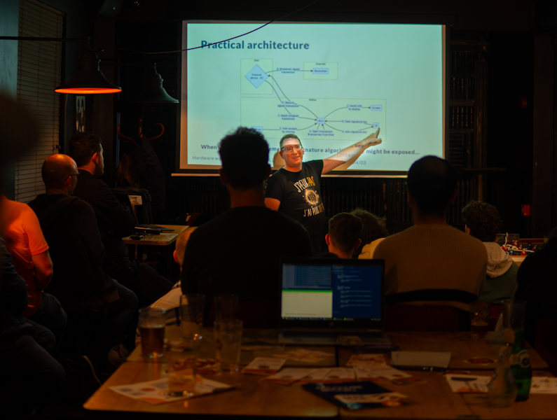

###
3. Quelle implication souhaiterais-je que ma communauté ait dans l'écosystème Bitcoin?

Ce questionnement, beaucoup plus avancé, peut être réfléchi dès la création de sa communauté.
En effet, si vous aspirez à **développer une communauté soudée, impliquée, regorgeant de bitcoiners motivés** qui souhaitent éduquer et orange-piller un maximum de personnes autour de vous, alors il vous faudra:
* d'une part, **vous rapprocher des communautés développées déjà existantes**, dans l'objectif d'accéder à un panel plus conséquent d'informations, d'avoir accès à une multitude de liens et de ressources open-source réutilisables, mais aussi de recevoir un coup de main lorsque vous en aurez besoin;
* d'autre part, **vous organiser - et donc répartir les tâches - au sein de votre communauté, afin de pouvoir aller plus loin ensemble**.
###
Bien évidemment, se fixer des objectifs n'est pas chose aisée. Toutefois, des **objectifs à court terme, à moyen terme et à long terme** peuvent être définis à plusieurs moments dans l'évolution de votre communauté.
**Par exemple, lors de la création de votre communauté, vous pourriez choisir de vous focaliser à court terme sur le développement de ses réseaux sociaux et de ses canaux de communication. À moyen terme, le développement de ressources pédagogiques (articles, flyers, etc.) semble accessible et pertinent. Enfin, à long terme, sous par exemple 6 mois, le lancement d'un meet-up physique est généralement envisageable**.

Quelques mois plus tard, **lorsque vos meet-ups seront réguliers, vous pourriez alors définir à court terme la mise en place de présentations ou d'ateliers sur des thèmes spécifiques; à moyen terme, la réalisation d'une campagne de sensisbilisation / d'éducation à Bitcoin; et à long terme, la création d'une association ou la recherche d'un bar acceptant Bitcoin comme moyen de paiement**.
### 
Gardez cependant en tête que créer une communauté ne se fait pas en claquant des doigts: **cela demande du temps, de la motivation et un soupçon d'organisation**.
Parfois, cela peut même être démoralisant; en particulier lorque personne ne se présente à un de vos meet-ups et que vous vous sentez seul à porter sur vos épaules cette cause.

C'est la raison pour laquelle **ce cours a été construit dans l'objectif de vous partager toutes les ressources et toutes les astuces possibles afin que votre communauté puisse se développer et devenir autonome**.

# Concevoir une identité propre à sa communauté Bitcoin

Dans de ce cours la suite, nous considérerons que:
* vous souhaitez créer une communauté (voire, par la suite,  un meet-up) dans une ville ou un lieu géographique que vous avez déjà défini;
* vous vous êtes fixés des objectifs sur différents horizons de temps, ces derniers n'étant évidemment pas gravés dans la roche.

**La seconde étape de la création d'une communauté est évidemment celle de son identité**. Cela passe par le choix de son nom, mais également de **son identité visuelle**.

C'est la raison pour laquelle nous nous efforcerons, dans cette partie 2/8, de vous proposer des tutoriels et solutions logicielles vous permettant de concevoir l'identité visuelle de votre communauté; et cela, sans pour autant avoir les compétences d'un designer.

## Pourquoi et comment créer sa propre identité?

Il est évident que lorsqu'un être humain s'identifie à un groupe, il se sent plus impliqué. En ce sens, disposer d'une identité propre à votre communauté est essentiel.

Cela passe tout d'abord par le choix du nom. En effet, suivant les pays, différentes initiatives et/ou communautés nationales existent.
Par exemple, **en France, les cinquante communautés qui s'y sont développées se nomment "Bitcoin [VILLE]" ou "[VILLE] Bitcoin"; amenant ainsi leur groupe Telegram à se nommer "Bitcoin [VILLE] meet-up" ou "[VILLE] Bitcoin meet-up"**.
En Allemagne, l'initiative "Einundzwanzig" (qui signifie "21") a amené la quasi totalité des communautés germanophones à s'appeler "Einundzwanzig [VILLE]"; tandis qu'en Italie, l'initiative "Satoshi Spritz" - qui est instigatrice de la grande majorité des communautés italiennes actuelles - nomme ses communautés "Satoshi Spritz [VILLE]".
**Chaque communauté a donc sa propre identité, relative à sa ville d'origine; mais également, à l'identité globale de son pays**.

Ainsi, bien qu'il vous est parfaitement possible de créer une nouvelle communauté française avec le nom que vous souhaitez, **il semble plus pertinent dans notre pays de l'appeler "Bitcoin [VILLE]" ou "[VILLE] Bitcoin"**.

###
En parallèle, **l'identité visuelle de votre communauté et de votre meet-up joue un rôle essentiel sur son développement**, car c'est entre autre grâce à elle que l'on se rappellera de votre initiative.
C'est la raison pour laquelle, **lors de la création de vos réseaux sociaux et de vos canaux de communication, un logo et une bannière doivent avoir été conçus**. Cela n'a toutefois pas besoin d'être réalisé par un designer professionnel, et des outils simples d'utilisation et gratuits existent.

Pour créer son identité visuelle, le mieux est donc de partir d'un élément ou d'un lieu marquant de votre ville. Cela peut par exemple être à Paris la Tour Eiffel, à Lille le beffroi ou la citadelle, à Monaco le rocher monégasque, à Marseille le vieux port, etc.
En partant de cet élément, il est alors possible de concevoir un logo plus ou moins travaillé, en fonction de la complexité souhaitée.

Pour vous donner des idées, voici quelques exemples de logos de communautés françaises:
- À Marseille, le logo représente la basilique Notre-Dame-de-la-Garde, qui surplombe la ville: 

- À Monaco, il fait référence au rocher monégasque: 
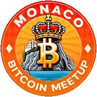
- À Lille, le logo épuré représente à la citadelle de Vauban et son parc, présents à quelques minutes du centre ville: 

- À Saint-Malo, la hermine - emblême de la ville - est mise en valeur: 
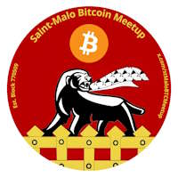

Il est donc désormais de votre ressort de **trouver un élement ou un lieu marquant de votre ville et de l'utiliser pour construire le visuel de votre communauté Bitcoin**.

### 
Par ailleurs, si l'inspiration vous transcende, il vous est même possible d'aller plus loin en créant un écusson, une devise voire une chanson liée à votre communauté. Votre imagination est alors votre seule limite !

## Créer un logo, une affiche et une bannière

### Utiliser Canva

Afin de réaliser les différents visuels de sa communauté, **il est possible d'utiliser [Canva](https://www.canva.com/)**.

Ce site, facile d'utilisation et gratuit, est particulièrement apprécié pour sa quantité de modèles déjà préconçus; que vous pouvez dupliquer et modifier à votre guise.

Lors de la **création de votre logo**, il vous est alors possible d'effectuer sur la page d'accueil une recherche des différents logos déjà pré-construits, de dupliquer celui ou ceux qui vous intéressent; puis de les modifier à votre guise.
Ajouter en arrière plan l'élément représentatif de votre ville (en important une photo ou en faisant une recherche "Illustrations" ou "Images" dans le menu de gauche "Éléments") peut alors être effectué. Par la suite, insérer par dessus le logo ou ₿ de Bitcoin - quitte à en modifier la couleur si souhaité - est une possibilité.

Dans le cas de la **création d'une banière ou d'une affiche**, il vous suffit d'effectuer de nouveau une recherche sur la page d'accueil du site afin d'obtenir une affiche pré-conçue. Par suite, après l'avoir dupliquée, il vous sera possible de la modifier en changeant les textes et polices, en ajoutant le logo de votre communauté et en important des photos pour les glisser dans un cadre (que vous obtiendrez en cherchant "cadre" dans le menu de gauche "Éléments").
Par ailleurs, le menu de gauche "Designs" permet de rechercher d'autres modèles suivant votre demande.

Enfin, il est également possible de rechercher sur la page d'accueil une **miniature ou une bannière YouTube pré-conçue**, de la dupliquer puis de la modifier à votre guise.

Bref, **les possibilités sont infinies et dépendent de vos besoins mais aussi de la charte graphique que vous souhaitez créer** pour votre communauté et vos meet-ups / événements !
###
Afin de pouvoir vous aiguiller plus en détail, nous vous proposons ci-dessous un tutoriel vidéo non-exhaustif présentant quelques possibilités:
[Tutoriel Canva](https://www.youtube.com/watch?v=sgloI_v-nAk&list=PLVkpvudLgb2mwT8VP-S6FCCZJ8BpbQfmt&index=10)
###
Voici également quelques fichier pré-conçus, duplicables et modifiables à votre guise que nous utilisons avec notre association Bitcoin Lille:
- **affiche d'annonce de meet-up** (pour les réseaux sociaux, et imprimée en A4 ou A3): [lien](https://www.canva.com/design/DAGBvBXFJ8A/92-j_toeLU8QbVAD0NwoAA/edit?utm_content=DAGBvBXFJ8A&utm_campaign=designshare&utm_medium=link2&utm_source=sharebutton)
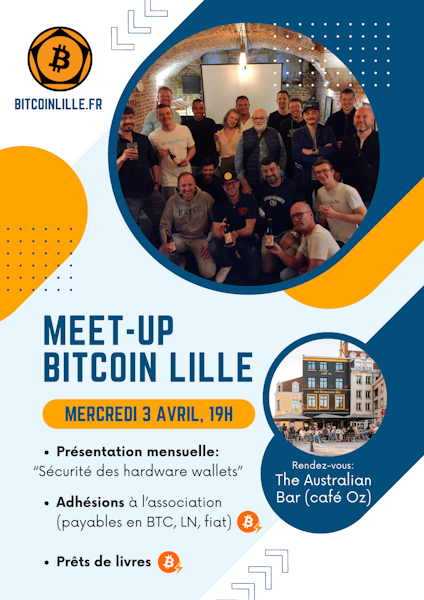

- **affiche d'annonce d'événement** coinjoint (pour les réseaux sociaux, et imprimée en A4 ou A3): [lien](https://www.canva.com/design/DAGBvG3rNCc/oXtNR9pduRs22AqclG4O2g/edit?utm_content=DAGBvG3rNCc&utm_campaign=designshare&utm_medium=link2&utm_source=sharebutton)

- **bannière pour certains réseaux sociaux**: [lien](https://www.canva.com/design/DAGBvOXyNqw/iSJG9PbIQHgGWHz5PhlXSQ/edit?utm_content=DAGBvOXyNqw&utm_campaign=designshare&utm_medium=link2&utm_source=sharebutton)

- **annonce d'un jeu concours**: [lien](https://www.canva.com/design/DAGBvIjuA_w/YzSUXzOmbNV9oCma9mluOw/edit?utm_content=DAGBvIjuA_w&utm_campaign=designshare&utm_medium=link2&utm_source=sharebutton)

- **charte** de notre bibliothèque, affichée en A4 lors des meet-ups: [lien](https://www.canva.com/design/DAGBvPqL7N4/LmUItfsysypRLSOFOzBXcQ/edit?utm_content=DAGBvPqL7N4&utm_campaign=designshare&utm_medium=link2&utm_source=sharebutton)

- **flyer** "21 raisons d'utiliser Bitcoin", écrit par @ProfEduStream: [lien](https://www.canva.com/design/DAFtAR1NauQ/ZDwl2CchIJ9Gpb36N6-7iw/edit?utm_content=DAFtAR1NauQ&utm_campaign=designshare&utm_medium=link2&utm_source=sharebutton)
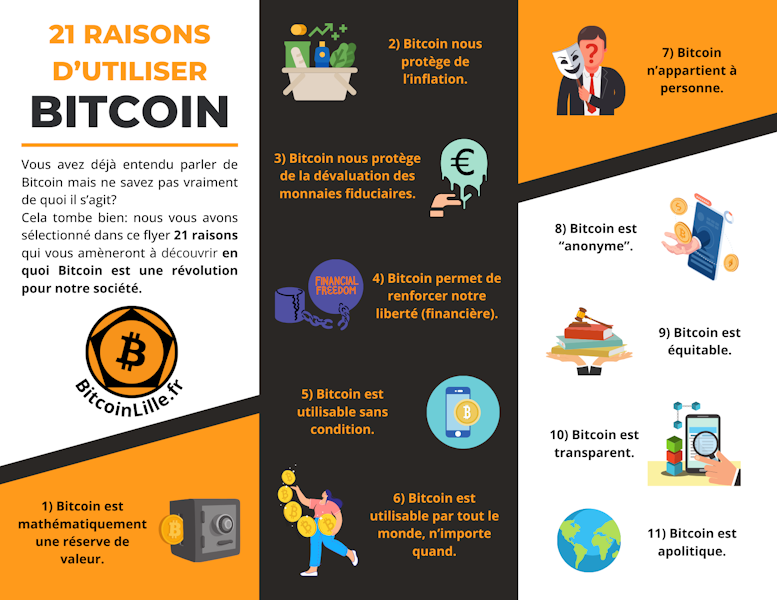
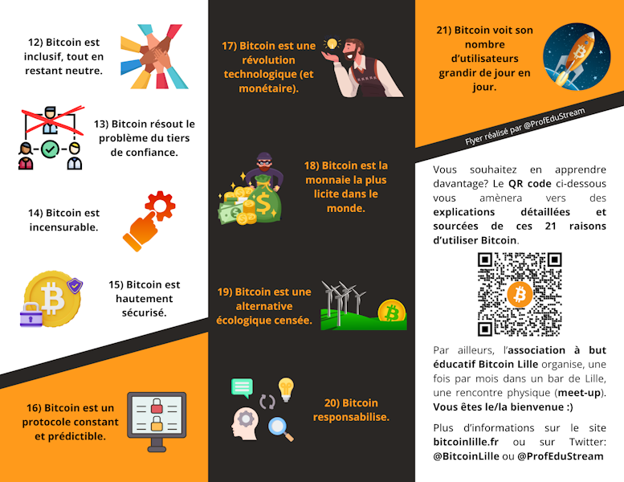

- **présentation powerpoint** "Chapitre 2 - Comprendre les transactions sur Bitcoin", par @ProfEduStream: [lien](https://www.canva.com/design/DAFsEcnOro8/Mz9FYdTGhsvozZOe0Y9jtw/edit?utm_content=DAFsEcnOro8&utm_campaign=designshare&utm_medium=link2&utm_source=sharebutton)
### 
Comme vous pouvez l'observer, les possibilités sont infinies et cela dépend bien évidemment de vos besoins. **N'hésitez donc pas à concevoir vous-même de nouveaux modèles, puis prenez quelques minutes pour les partagez autour de vous afin que cela puisse faire gagner plusieurs heures de travail aux autres communautés de votre pays**.
En effet, n'oubliez pas que **toute communauté aura, un moment ou un autre, les même problématiques et les même besoins que vous. En partageant vos ressources de manière open-source, vous accélérez donc de manière sous-jacente le développement de toutes les autres communautés Bitcoin**.
###
Toutefois, lors de la création de vos visuels, pensez à bien faire attention aux dimensions attendues par les réseaux sociaux et applications de communication que vous comptez utiliser.
Voici donc quelques proportions et standards qui pourraient vous servir:

| Réseau / Plateforme | Logo | Bannière | Affiche / Image 
| -------- | -------- | -------- | -------- |
| Telegram     | 512 x 512     | N/A     | N/A     |
| Signal     | N/A     | N/A     | N/A     |
| Twitter     | 400 x 400     | 1500 x 500     | 1200 x 628     |
| Meet-up     | N/A     | N/A     | N/A     |
| Discord     | 512 x 512     | 960 x 540     | N/A     |
| Facebook     | 512 x 512     | 851 x 315     | 960 x 720     |
###
En ce sens, dans le cas de la création d'un **logo**, la taille adéquate est de **512 pixels par 512 pixels**.
Pour une **bannière**, cela **dépend spécifiquement de l'application ou du site** que vous utilisez.
Quant aux **affiches et autres images**, le **format A4** classique est généralement pertinent.

### Utiliser une intelligence artificielle

Bien que Canva permette de faire d'innombrables choses (logos, affiches, bannières, flyers, etc.), ce n'est évidemment pas le seul site ou logiciel permettant de réaliser cet ensemble de tâches.
En ce sens, si vous êtes plus à l'aise d'utiliser une autre suite logicielle (notamment Photoshop ou Illustrator), faites au plus pratique pour vous.

Toutefois, que ce soit dans la création d'un logo pour sa communauté comme dans l'ajout de visuels agréables dans des affiches, présentations ou flyers, **il peut être pertinent d'utiliser une intelligence artificielle pour agrémenter vos supports**.
### 
Pour ce faire, de nombreuses IAs existent. On compte notamment:
- [midjourney](https://docs.midjourney.com/docs/quick-start) (payante);
- [leonardo](https://leonardo.ai/) (gratuite, limitée par compte);
- [copilot](https://copilot.microsoft.com/) (gratuite, limitée par compte);
- [DALL-E](https://www.dall-efree.com/) (payante).

Évidemment, de nombreuses autres intelligences artificielles ont vu le jour ces derniers mois dans le domaine de la création de contenus visuels. Cette liste est donc non-exhaustive.
###
Dans le cas où l'on souhaiterait par exemple réaliser une image ou un logo futuriste du meet-up "Bitcoin Londres", on peut alors demander à l'IA "copilot":
- [ ] *Crée moi un logo Bitcoin avec en arrière plan le pont de Londres et Big Ben. Futuriste* - [Lien](https://copilot.microsoft.com/images/create/un-logo-bitcoin-futuriste-avec-en-arric3a8re-plan-le-/1-6612ba1758df4384bc33c4bca00ab45b?FORM=SYDBIC)

Si les quatre propositions de copilot ne sont toutefois pas assez réalistes à votre goût, il vous est possible d'ajouter à la conversation:
- [ ] *Rends le 4ème plus beaucoup plus réaliste* - [Lien](https://copilot.microsoft.com/images/create/un-logo-bitcoin-futuriste-avec-en-arric3a8re-plan-le-/1-6612ba64b72d4cea9830ab7eb844f785?FORM=SYDBIC)

Le dernier rendu est d'ailleurs plutôt sympa !
###
Cependant, si l'on souhaite un logo beaucoup plus épuré, pour par exemple un sticker, on peut alors entrer sur "copilot":
- [ ] *Crée moi le logo du "Londres Bitcoin Meetup" avec un style british et épuré* - [Lien](https://copilot.microsoft.com/images/create/logo-for-27londres-bitcoin-meetup27-with-a-british-a/1-6612bb9451924859a6c34b350b3a6ebc?FORM=SYDBIC)
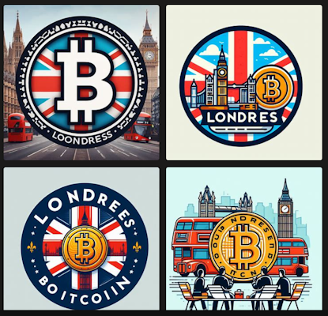

Le second recond est typique et de peut tout à fait faire l'affaire !
###
Toutefois, bien qu'elle permette de réaliser des rendus visuels très intéressants en un temps record, **l'intelligence artificielle ne permettra malheureusement pas de réaliser au détail près ce que vous souhaiteriez faire**.
Prenez donc votre mal en patience, essayez de dicter des consignes (des "prompts") les plus précis possibles; et **si vous n'êtes pas satisfaits des rendus obtenus, rien ne vous empêche de vous rapprocher d'un bitcoiner qui maîtrise mieux le sujet**. Contre quelques sats (ou gratuitement), il est certain qu'il vous réalisera un logo ou un visuel de qualité.

# Créer des canaux de communication pour sa communauté Bitcoin

Maintenant que vous disposez de votre nom, d'un logo, d'une potentielle bannière et que vous avez décidé de vos objectifs à court, moyen et long terme, il est désormais venu le moment fatidique de lancer ses canaux de communications !

## Quels canaux de communication privilégier?

Comme dit précédemment, en fonction des motivations et habitudes de chacun, les canaux de communication d'une communauté peuvent être différents.

Par exemple, **en France, en Allemagne et en Italie, Telegram et Twitter sont les canaux de communication principaux**. Ils sont ainsi devenus au fil du temps des "standards de communication" pour les communautés Bitcoin de ces pays. Certaines communautés utilisent toutefois d'autres canaux en plus, dans des objectifs précis.
À contrario, en République Tchèque, les nombreuses communautés qui s'y sont développées utilisent **Matrix**, un protocole de messagerie instantanée chiffré. Dans leur pays, Telegram n'est donc que peu utilisé.

En ce sens, **dans l'objectif de choisir ses canaux de communication, le plus pertinent est de commencer par prendre exemple sur les communautés limitrophes de son pays**.
Pour ce faire, accéder à la carte [btcmap.org](https://btcmap.org/communities/map#0/0/0/) vous donnera un avis déjà bien précis des canaux de communication les plus utilisés dans votre pays.
En Suisse par exemple, les informations sont principalement relayées par le biais du Telegram, du Twitter et du site internet de la communauté.
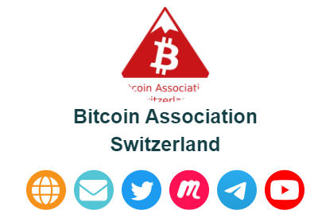
###
**Dans le cas de la France (et de la francophonie de manière générale), le principal canal de communication est Telegram**. Plus de 90% des meet-ups français en ont d'ailleurs un: c'est un "must-have".
Par suite, **le principal réseau social utilisé par les communautés est Twitter** (70% des meet-ups français); réseau social sur lequel une majorité de bitcoiners sont présents.
De plus, près de 30% des meet-ups français (mais également tous les meet-ups canadiens) possèdent un compte - payant - sur l'application **Meetup**. Cela peut en effet être un excellent moyen de donner de la visibilité à ses événements en dehors de l'écosystème Bitcoin.
Enfin, 30% des meet-ups français ont également un **site internet**; et 10%, un serveur **Discord** et un compte **NOSTR**.
###
Évidemment, d'autres canaux de communication et réseaux sociaux sont parfois utilisés: Matrix, Keet, Signal, Facebook, Instagram, LinkedIn, etc. **Chaque communauté est en effet libre de développer les canaux qu'elle souhaite**.
Il va cependant s'en dire que, **plus les canaux de communication et réseaux sociaux sont multipliés, plus cela demande du temps pour le(ou les) organisateur(s) de s'en occuper**, d'y poster les informations importantes régulièrement et de modérer si besoin.
###
**Pour toute personne souhaitant lancer une communauté en France, il est donc conseillé pour commencer de ne créer que:**
- **un groupe Telegram**;
- **un compte Twitter**.

En fonction de votre temps et de vos envies, vous pourrez par la suite développer d'autres réseaux; quitte à en **attribuer la modération à des futurs membres de votre communauté**.

## Créer et configurer un canal, un groupe ou un super-groupe Telegram

Comme dit précédemment, Telegram est un "must-have" dans de nombreux pays. Toutefois, lors de la création du canal de communication de sa communauté sur cette application de messagerie instantanée, il est important de comprendre les différences entre:
- un canal Telegram;
- un groupe Telegram;
- un super-groupe Telegram.

Nous le verrons alors par la suite, mais **il est très fortement recommandé de choisir "groupe Telegram" lors de la création** (voire, suivant vos objectifs, "super-groupe Telegram").
###
Pour les tutoriels qui suivront, nous utiliserons l'application APK "Telegram+"; application qui permet de pouvoir aller plus loin dans la configuration de son Telegram. Cela n'est toutefois pas nécessaire, la création d'un groupe ou super-groupe Telegram pouvant se faire désormais très facilement sur téléphone:
[Tutoriel Telegram+](https://www.youtube.com/watch?v=Z5mE-LksBZw&list=PLVkpvudLgb2mwT8VP-S6FCCZJ8BpbQfmt&index=4)

### Créer un canal Telegram

Si vous souhaitez créer un endroit où vos membres peuvent échanger ensemble de manière directe, se répondent les uns aux autres, etc. alors un canal Telegram n'est absolument pas ce sur quoi vous devez vous tourner !
Passez donc directement à la section suivante, intitulée [Créer un groupe Telegram](LIEN).

En effet, **un canal Telegram n'est qu'une vitrine des informations postées par les administrateurs, dans lequel les membres ne pourront pas faire grand chose de plus qu'ajouter des émojis**.
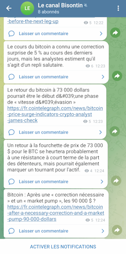

Il est toutefois possible d'ajouter la possibilité pour les membres du canal de commenter chaque post de l'administrateur du canal, mais cela se fera dans des discussions séparées; clivant fortement les échanges. **La création d'un canal Telegram n'est donc généralement pas conseillée pour une communauté**.
###
Tutoriel pour créer un canal Telegram:
[Tutoriel canal Telegram](https://www.youtube.com/watch?v=N5S7cgySV8U&list=PLVkpvudLgb2mwT8VP-S6FCCZJ8BpbQfmt&index=4)

### Créer un groupe Telegram 

À contrario, **créer un groupe Telegram est tout à fait pertinent**.
En effet, pour prendre des exemples connus comme les groupes Messenger ou WhatsApp, toutes les personnes qui rejoindront ce **groupe Telegram pourront échanger ensemble, se répondre; et cela, toujours dans une même discussion**.
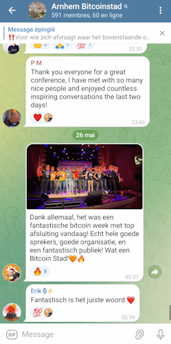

Les administrateurs de ce canal pourront alors:
- poster eux-mêmes des messages;
- **épingler** les plus importants;
- poster des **sondages** (très pratique pour choisir la date du prochain meet-up lorsque cela n'est pas encore régulier, i.e. que la communauté est encore peu développée);
- créer un **lien d'invitation customisé** (à condition que le groupe soit "public" et non "privé", ce qui est à définir dans les paramètres. Il est d'ailleurs très pratique d'avoir son lien d'invitation Telegram du style: t.me/Bitcoin[VILLE]);
- **ajouter ou supprimer des permissions, des administrateurs et des membres**;
- **ajouter une "photo de profil"** au groupe Telegram (i.e. le logo de votre communauté), **et modifier son nom**.
###
Tutoriel pour créer un groupe Telegram:
[Tutoriel canal Telegram](https://www.youtube.com/watch?v=u1BuxEsmFuA&list=PLVkpvudLgb2mwT8VP-S6FCCZJ8BpbQfmt&index=5)

Petite remarque: comme dit précédemment, le tutoriel ci-dessus a été réalisé sur ordinateur avec l'APK "Telegram+". Toutefois, sachez qu'il est désormais très facile de créer un groupe Telegram sur téléphone.
Il n'est donc plus nécessaire de télécharger "Telegram+" pour réaliser cette tâche; à moins que vous ne souhaitiez aller plus loin dans les paramètres de confidentialité de votre groupe.

### Créer un super-groupe Telegram

Le point négatif d'un groupe Telegram est que, lorsqu'il commence à y avoir plusieurs centaines de membres, les discussions en parallèle dans le même canal de communication commencent à devenir fouillies. Cela entraîne alors un effet indésirable: certains membres ne suivent plus quotidiennement le groupe Telegram, les amenant parfois à râter des informations importantes; comme par exemple la date du prochain meet-up.

Pour remédier à cela, plusieurs solutions peuvent être appliquées:
1. **épingler en tant qu'administrateur les messages importants**, pour que tout le monde en soit notifié (appuyer 1 fois avec son doigt sur le message en question, puis sélectionner "Épinger");
2. proposer à sa communauté d'**utiliser un serveur Discord** avec des canaux de communication divers et variés, que chacun peut rendre muet s'il le souhaite;
3. de **créer un "super-groupe" Telegram**.
### 
Mais qu'est-ce qu'un super-groupe Telegram?

C'est tout simplement **un groupe Telegram dans lequel on y intègre plusieurs "sujets"**. Ainsi, un sujet **"Informations importantes"** peut être créé, dans lequel on n'y postera que les informations importantes et associées aux prochains événements / meet-ups.
Un sujet **"Général"** peut également être mis en place, dans lequel tous les membres pourraient discuter.
Enfin, **des sujets spécifiques** (minage, développement d'un projet, prochaine conférence, etc.) peuvent être ajoutés.

À vous de modifier cela en fonction de vos envies; à l'image par exemple du super-groupe d'Abidjan Bitcoin Meet-up.

###
Toutefois, il est à noter qu'**un super-groupe Telegram peut être plus difficile à utiliser pour certains membres**. En effet, parfois, certains ne parviennent pas à comprendre **comment accéder aux autres sujets de ce super-groupe** (pour cela, il suffit simplement de cliquer sur le logo du groupe; et cela ouvre la liste des sujets créés). Les aider en leur envoyant une petite vidéo tutorielle en capture d'écran peut alors être une bonne idée.
###
De manière générale, il n'existe pas un nombre de membres type à partir duquel il est pertinent d'utiliser un super-groupe Telegram plutôt qu'un groupe Telegram. C'est donc à vous de faire ce choix, en fonction des besoins et demandes de vos membres; tout en sachant qu'un groupe Telegram peut être facilement converti en super-groupe Telegram (et inversement). Pour cela, il suffit de créer un sujet (ou de tous les supprimer).
###
Tutoriel pour créer un super-groupe Telegram:
[Tutoriel super-groupe Telegram](https://www.youtube.com/watch?v=GWVqpjBtg-U&list=PLVkpvudLgb2mwT8VP-S6FCCZJ8BpbQfmt&index=6)

Petite remarque: comme dit précédemment, le tutoriel ci-dessus a été réalisé sur ordinateur avec l'APK "Telegram+". Toutefois, sachez qu'il est désormais très facile de créer un super-groupe Telegram sur téléphone.
Pour ce faire, il suffit de créer un groupe Telegram; puis, dans ses paramètres, de cliquer sur le bouton "Sujets" pour en ajouter. Une fois la modification validée, une liste de sujets apparaîtra; et vous pourrez la modifier à votre guise.
Il n'est donc plus nécessaire de télécharger "Telegram+" pour réaliser ces tâches; à moins que vous ne souhaitiez aller plus loin dans les paramètres de confidentialité de votre super-groupe.

## Paramétrer son groupe ou super-groupe Telegram

Maintenant que vous avez créé votre groupe (ou super-groupe) Telegram, est venu le moment de **réfléchir aux permissions de ce dernier; ainsi qu'à sa modération**. Et, évidemment, chaque communauté est libre de faire comme elle le souhaite !

Toutefois, **d'expérience, il est préférable de retirer aux membres les permissions**:
- **envoyer un sondage**;
- **envoyer des fichiers** (cas des virus);
- **envoyer des messages vocaux**;
- **ajouter des utilisateurs** (dans le cas où un bot entre dans le groupe);
- **épingler des messages**;
- **modifier les informations de l'échange**.
###
Il est également **très fortement conseillé d'écrire une description de son meet-up lors de la création du groupe ou super-groupe Telegram**, car celle-ci sera vue par toute personne souhaitant l'intégrer. Cela peut par exemple être:

> Bienvenue sur le Telegram de @Bitcoin[VILLE] 🔥
> 
> Nous organisons un meet-up tous les premiers mercredis du mois, au bar [NOM_DU_BAR] à [VILLE] 🍻
> 
> Pour accéder à nos autres réseaux sociaux: [LIEN_SOUHAITÉ] 🌐

On observe d'ailleurs, sur l'image ci-dessus, que le lien d'invitation a été customisé par les administrateurs du groupe Telegram Bitcoin Lille, car ce dernier est public.
###
Par la suite, dans "Paramètres du groupe", il peut être pertinent de **valider "Approuver les nouveaux membres"**.
En effet, d'expérience, il est déjà arrivé qu'un groupe Telegram d'une communauté Bitcoin se fasse attaquer par plusieurs milliers de faux comptes souhaitant rejoindre le groupe dans l'objectif de le spammer et de le détruire.
En plus de permettre en amont le retrait des faux comptes pornographiques souhaitant accéder à votre groupe, **activer l'approbation des membres vous sauvera avec certitude d'une attaque de type spam**.

Enfin, dans la partie "Administrateurs", il est possible d'ajouter un "Anti-spam agressif", supprimant automatiquement les messages considérés comme tel. Cela n'est toutefois pas forcément nécessaire.

##  Insérer un bot multi-fonction dans un canal Telegram

**Une autre possibilité pour paramétrer et sécuriser son groupe ou super-groupe Telegram est d'ajouter un bot multi-fonction**. Cela permet en effet d'aller beaucoup plus loin dans sa configuration.

Parmi les multiples options possibles avec **le bot [@GroupHelpBot](https://telegram.me/grouphelpbot)**, on note entre autre:
- **ajouter un règlement** (commande /rules);
- configurer un **mécanisme anti-spam**;
- ajouter un **message automatique de bienvenue, personnalisable, automatiquem à l'entrée d'un nouveau membre et qui se supprime après quelques minutes**; 
- configurer le **mécanisme anti-flood**;
- ajouter une commande @administrateur;
- ajouter des blocages;
- ajouter une commande pour obtenir le lien du groupe (/link);
- configurer la permission des commandes;
- supprimer automatiquement certains types de messages;
- etc.

Trois autres idées simples sont:
- **créer une commande** "/lien" permettant d'envoyer le lien d'accès au groupe Telegram;
- même chose pour obtenir les réseaux sociaux ("/reseaux") ou votre potentiel règlement en cas de modération ("/reglement");
- **bloquer l'entrée de bots** et les "entrées/sorties".

D'innombrables options supplémentaires s'offrent également à vous. Un conseil toutefois: **ne cherchez pas à trop brider les échanges**.
###
Tutoriel pour ajouter un bot multi-fonction à un groupe ou super-groupe Telegram:
[Tutoriel bot multi-fonction Telegram](https://www.youtube.com/watch?v=l72GZcEFDtU&list=PLVkpvudLgb2mwT8VP-S6FCCZJ8BpbQfmt&index=8)

Petite remarque: comme dit précédemment, toute cette procédure peut être désormais réalisée sur téléphone.

## Créer un serveur Discord

À l'augmentation du nombre de membres dans son groupe Telegram, la transformation en un super-groupe Telegram peut être la solution.
Toutefois, comme dit précédemment, **les potentielles "difficultés d'utilisation" et l'augmentation du nombre de sujets et de messages dans un super-groupe Telegram peut entraîner un début de désintérêt pour une partie des membres actifs**.

**Discord se présente alors comme une alternative** à la création d'un super-groupe Telegram, puisqu'il permet de **créer des salons textuels et vocaux spécifiques**; et, surtout, que ses utilisateurs peuvent rendre muet tous les salons qui ne les intéressent pas.

Évidemment, en plus de Telegram et de Twitter, cela demande encore un peu plus de temps pour s'en occuper; en particulier lors de sa configuration et de son lancement.

Dans l'objectif de vous faciliter la tâche, **nous vous partageons donc un [serveur Discord pré-fait, duplicable et modifiable](https://discord.com/template/bDY4eXXJk2C8) à votre guise**:
[Tutoriel serveur Discord duplicable](https://www.youtube.com/watch?v=i3V6_359Ajw&list=PLVkpvudLgb2mwT8VP-S6FCCZJ8BpbQfmt&index=2)

## Fusionner un salon textuel de son serveur Discord avec son groupe Telegram

Lorsqu'il est bien construit, un serveur Discord peut être un véritable atout pour sa communauté.
En effet, de nombreux bitcoiners utilisent déjà quotidiennement Discord (et pas Telegram), et leur **permettre de suivre les conversations du groupe Telegram directement au sein même du serveur Discord est un gain conséquent de temps**. Et inversement.

C'est la raison pour laquelle un bot open-source nommé [TediCross](https://github.com/TediCross/TediCross) a été développé. Son objectif est simple: transférer automatiquement les messages d'un salon textuel Discord vers un groupe Telegram (ou un sujet d'un super-groupe Telegram); et inversement. Cela peut donc être très intéressant à mettre en place.
### 
Toutefois, il n'est pas sans noter que son installation n'est pas très évidente, qu'**il faille continuellement faire tourner une invite de commande (CMD) sur un ordinateur pour que ce bot fonctionne**; mais aussi, qu'il y a parfois un bug d'erreur. Heureusement, dans cette situation, il suffit simplement de le relancer; et tout rentre alors dans l'ordre.

Dans l'optique de vous faire de nouveau gagner du temps, voici un tutoriel expliquant comment ajouter un bot multi-fonction à un groupe ou super-groupe Telegram:
[Tutoriel bot TediCross Discord - Telegram](https://www.youtube.com/watch?v=e4YAPG0ITF8&list=PLVkpvudLgb2mwT8VP-S6FCCZJ8BpbQfmt&index=7)

## Réfléchir à d'autres canaux de communication, privés et plus sécurisés

Comme dit précédemment dans cette partie, Twitter et Telegram sont les deux principaux canaux de communication utilisés en Europe (voire dans le monde).
Toutefois, vous n'êtes pas sans savoir que **Telegram n'est pas la messagerie la plus sécurisée et la plus confidentielle et que Twitter l'entreprise la plus libre de ses mouvements du monde**.
En ce sens, **il est tout à fait pertinent - lorsque vous aurez du temps à y allouer - de commencer à réfléchir à des alternatives**.

C'est d'ailleurs la raison pour laquelle, dans les prochains mois, des tutoriels d'utilisation de protocoles de communication plus confidentiels et plus sécurisés seront proposés [au sein même de ce cours, sur planb.network](LIEN).
###
Mais pourquoi réfléchir à ces alternatives?

Tout simplement parce qu'à l'image du réseau social NOSTR comme des applications de communication Matrix, Signal ou Element, ces dernières sont décentralisées et/ou chiffrées. En plus du **gain de confidentialité** dans les échanges réalisés entre les différents membres de votre communauté, cela permet également de **se prémunir d'une fermeture (censure?) de votre groupe ou super-groupe Telegram**.
Qu'y a-t-il donc de mieux, à l'image du protocole Bitcoin, que d'**être incensurable et immuable**?

# Lancer ses réseaux sociaux

Ça y est, votre communauté est lancée et vous disposez désormais d'un ou de plusieurs canaux de communication (Telegram et/ou Matrix par exemple) !
Par contre, vous y êtes pour le moment... seul(e). Il va donc falloir **faire - un peu - de communication**.

## L'importance de la visibilité pour le développement de sa communauté Bitcoin

Il est évident que si personne ne parvient à accéder à vos canaux de communication, sur lesquels vous posterez régulièrement des informations (date du prochain meet-up, projets, etc.), vous allez oeuvrer dans le vide. C'est la raison pour laquelle **les réseaux sociaux - et certaines plateformes précises, dont nous parlerons par la suite - vont jouer un rôle prépondérant dans le développement de votre communauté**.

Parmi ces réseaux sociaux, **Twitter se positionne comme un quasi-incontournable dans le monde de Bitcoin**. En ce sens, il semble important de **disposer d'un profil sur cette plateforme**; quand bien même sa centralisation et son développement sont loin d'être corrects.
C'est la raison pour laquelle un **profil NOSTR spécifique à votre communauté** peut également être créé, dans l'idée d'anticiper de potentielles restrictions et/ou censures sur Twitter. Après tout: mieux vaut prévenir que guérir.

D'autres réseaux sociaux peuvent évidemment être utilisés. C'est le cas de Facebook (cas d'un groupe ou d'une page Facebook) ou même LinkedIn.
Néanmoins, il est à rappeller que **plus il y a de canaux de communication et de réseaux sociaux à créer - et donc à alimenter -, plus cela prend du temps. Il vaut donc mieux se concentrer sur les plus pertinents; et Twitter (et NOSTR) semblent être de bons candidats**.

Dans la suite de ce cours, nous expliquerons en détail comment créer un compte Twitter et comment l'utiliser avec pertinence pour gagner un maximum en visibilité. Des explications et tutoriels similaires concernant NOSTR seront ajoutés à cette partie [Lancer ses réseaux sociaux](LIEN), d'ici quelques semaines.

## Créer un profil Twitter

Très simple d'utilisation, Twitter est un réseau social nécessitant la modification de certains paramètres afin de gagner en confidentialité.

**Lors de la création d'un nouveau compte Twitter, quatre informations essentielles doivent être renseignées**:
1. **le @ Twitter**, qui définira votre identité et vous permettra d'être facilement recherchable. Si votre communauté se nomme "Bitcoin [VILLE]", il est donc tout à fait pertinent de choisir "@Bitcoin[VILLE]";
2. **le logo et la bannière** que vous aurez créés pour votre communauté ou votre meet-up (voir section [Créer un logo, une affiche et une bannière](LIEN));
3. **la description**, qui vous permettra en une centaine de caractères de donner les informations importantes sur votre communauté. Cela peut par exemple être:
> Compte officiel de la communauté Bitcoin [VILLE] #BTC | Meet-ups tous les 1ers mercredis du mois à [NOM_DU_BAR] de [VILLE] 🍻 | Nous rejoindre sur Telegram 🔽
4. En dessous de cette description, il est également possible d'**insérer un lien**. Ce dernier peut alors amener les utilisateurs à accéder à une page "réseaux sociaux" disponible sur le site internet de votre communauté, comme il peut les amener vers votre canal de communication Telegram.
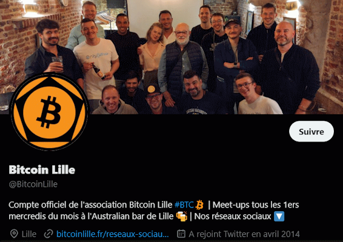

De plus, **quelques paramètres de confidentialité semblent être pertinents à modifiés**; les plus pertinents étant évidemment:
* le fait de **laisser son compte Twitter en mode "public"** (posts visibles par n'importe qui);
* de **pouvoir être identifiable par tout le monde** (attention aux scams);
* de **désactiver le suivi de localisation et le partage de données à d'autres entités** (question de confidentialité).
#### 
Au fil du temps, vous viendrez alors à poster sur Twitter. Ces tweets annonceront alors votre prochain événement, une information importante dans l'écosystème ou même une annonce d'une autre communauté que vous suivez.
Or, comme l'immense majorité des réseaux sociaux, **la visibilité est le nerf de la guerre**.

Afin de vous faire gagner une quantité de temps assez conséquente, nous avons pris le temps d'étudier le [code open-source de l'algorithme de classement de Twitter](https://github.com/twitter).
Voici donc **les principaux points auxquels il faut faire attention pour que votre visibilité s'accroisse**:
* Généralités:
    - **tweetez dans la langue que vous avez paramétrée** sur votre compte Twitter, ou en anglais (pénalité démentielle sinon);
    - **ne tweetez que des informations liées au domaine d'expertise de votre compte** (pénalité forte sinon);
    - tweetez 1 à 2 fois par jour (la régularité est importante);
    - **tweetez sur des horaires à forte visibilité** (le plus intéressant étant le jeudi ou vendredi entre 8h et 10h; voir le "Twitter Analytics" de votre compte).

* Lors de l'écriture d'un tweet:
    - **ajoutez une photo** (voire une vidéo);
    - **ajoutez un seul hashtag à votre tweet** (#Bitcoin est généralement le plus pertinent. Si cela a du sens, et à condition qu'il soit lié au domaine d'expertise de votre compte, ajoutez un hashtag en tendance);
    - **encouragez votre communauté à liker** (poids de 0,5), **à retweeter** (poids de 1) **mais surtout à répondre** (poids de 27 !);
    - **répondez aux personnes qui répondent à vos tweets** (poids de 75 !);
    - **n'ajoutez pas de lien dans votre tweet initial** (cela peut se faire dans le premier commentaire par exemple);
    - écrivez les mots en entier, sans utiliser d'abréviations.

* D'autres points à noter:
    - tweetez en fonction des tendances, à condition qu'elles soient dans le domaine d'expertise de votre compte;
    - **repostez / retweetez les tweets les plus vus**;
    - **réalisez de temps en temps des sondages**;
    - **écrivez si possible des threads**;
    - encouragez votre communauté à aller voir et à suivre votre profil.
###
De plus, **il est possible d'épingler sur votre profil Twitter un tweet auquel vous souhaiteriez donner une visibilité importante**.
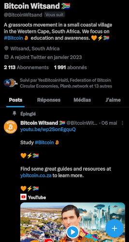

Notez également qu'il est possible, sur téléphone comme ordinateur, d'être connecté simultanément à deux comptes Twitter en même temps. Cela peut être très pratique pour ne pas avoir à se connecter / déconnecter entre son compte personnel et son compte communautaire; tout comme cela peut vous jouez des tours si vous postez involontairement avec le compte de votre communauté une photo de vous déguisé... Prudence, donc !
###
Enfin, bien que votre nom d'utilisateur "@Bitcoin[VILLE]" est unique et vous appartient désormais, il peut être pertinent de créer en amont les comptes "@Bitcoin_[VILLE]", "@[VILLE]Bitcoin" ou "@[VILLE]_Bitcoin" afin d'**être certain que personne ne cherchera à dupliquer votre identité**. Mieux vaut en effet anticiper !
###
Tutoriel pour créer un compte Twitter:
[Tutoriel compte Twitter](https://www.youtube.com/watch?v=pp3DDakV0bA&list=PLVkpvudLgb2mwT8VP-S6FCCZJ8BpbQfmt&index=11)

## Se rapprocher des meet-ups limitrophes

Maintenant que vos canaux de communication et réseaux sociaux ont été créés, paramétrés et saupoudrés de l'empreinte visuelle de votre ville / communauté / meet-up, il est désormais venu le moment de suivre les "bonnes personnes" sur ces derniers.

Sur Twitter, cela peut commencer par **suivre certains comptes oeuvrant au développement de Bitcoin au niveau international**, comme @Bitcoin, @bitcoincoreorg, @planb_network, @FBCEglobal, par retweeter le fameux "Running bitcoin" du 11 janvier 2009 de @halfin; mais aussi - et surtout - par **suivre les comptes des communautés et meet-ups Bitcoin de son pays**.
En effet, **cela permettra mutuellement de se suivre, de se taguer et donc de collectivement gagner en visibilité**.
C'est d'ailleurs le cas entre la cinquantaine de communautés Bitcoin françaises; et il en est de même avec la majorité des initiatives "Satoshi Spritz" en Italie et "Einundzwanzig" en Allemagne.

Bien que cela puisse paraître inutile aux yeux de certain(e)s, **suivre les comptes des communautés et initiatives locales / de son pays peut amener indirectement à la réalisation de projets communs**, voire de "partenariats". C'est ainsi que les communautés Bitcoin Liège et Bitcoin Lille sont venues à prendre contact (mais aussi, Bitcoin Aix et Bitcoin Marseille); les amenant désormais à effectuer au moins une fois par an un meet-up commun.
Le cas des repas du **Cercle du Coin** en est un autre exemple.

De plus, en France, il peut également être pertinent de **suivre les initiatives @KonsensusFR, @bitcoinpointfr, @DecouvreBitcoin et @btcmap**. Ce ne sont évidemment que des propositions, et chaque communauté est bien évidemment libre de faire ce qu'il lui plaît, en toute décentralisation et en toute autonomie.

## [Btcmap.org](https://btcmap.org/)

À ce stade, votre communauté est déjà lancée. Il ne reste plus qu'à attendre l'arrivée de nouveaux bitcoiners et de nouvelles personnes intéressées, dans l'optique de la développer.

Cependant, vous ne pouvez pas aller plus loin sans savoir qu'**il existe des plateformes permettant aux bitcoiners intéressés de trouver des communautés et meet-ups près de chez eux**.
C'est la raison pour laquelle **il est crucial que vous preniez quelques minutes pour faire une demande de référencement sur ces sites / plateformes**.
###
Parmi celles-ci, on note notamment:
* **[Btcmap.org](https://btcmap.org/)**, site internet qui regroupe deux cartes mis à jour quotidiennement: **[la carte mondiale des commerces acceptant Bitcoin](https://btcmap.org/map)**, et **[la carte des communautés mondiales](https://btcmap.org/communities)**. De nombreux bitcoiners, lors de leurs vacances ou même dans leur quotidien, scrutent régulièrement ces cartes afin de pouvoir faire de nouvelles rencontres ou de nouveaux achats. **Btcmap est clairement LA référence mondiale. Et pour votre visibilité, votre communauté se doit d'y être référencée.**
* **[BitcoinerEvents](https://www.bitcoinerevents.com/)** est un site internet créé par des bitcoiners, pour les bitcoiners. Il est ainsi possible d'**y poster les prochains événements de sa communauté**. Malheureusement, en France, cette plateforme est relativement peu utilisée.
* en fonction des pays, il existe également des initiatives uniques. C'est notamment le cas, **en France, du site internet [bitcoin.fr](https://bitcoin.fr/events/categories/evenements/), qui recense chaque mois les dizaines d'événements Bitcoin en France**. Si vous ne les avez donc pas encore suivis sur Twitter ou contactés pour donner les informations de votre communauté et/ou de vos événements, c'est le moment ! **Par ailleurs, dans l'optique de les aider à tenir à jour ce calendrier d'événements français, il serait appréciable que toutes les communautés Bitcoin françaises prennent l'habitude:**
    * **de mentionner @bitcoinpointfr sur Twitter à chaque nouvelle annonce d'événement de sa communauté**;
    * **d'épingler dans son groupe Telegram communautaire l'annonce de ce dit événement**.

### 
Il n'est pas sans noter que d'autres plateformes et applications permettent également de gagner en visibilité. **[Meetup](https://www.meetup.com/)** est l'une d'elles. En effet, il s'agit d'un site internet (et d'une application sur téléphone) permettant de créer un événement; mais aussi de chercher ceux autour de chez soi.
Malheureusement, pour pouvoir créer des meet-ups, il faut débourser près de 8€ par mois (soit environ 90€ par an), ce qui est onéreux pour une communauté qui n'est encore ni structurée ni mature. Toutefois, Meetup est très utilisée dans certains pays, en particulier au Canada et aux États-Unis; son principal intérêt étant qu'elle permet de gérer de manière intégrée les inscriptions aux rencontres.

En parallèle, **[Orangepillapp](https://www.orangepillapp.com/)** est une application téléphone payante permettant aux bitcoiners à se rencontrer. Elle est toutefois, elle aussi, payante (50 000 sats/an, ou 200 000 sats à vie).
###
Bien qu'elles permettent de développer la visibilité de votre communauté et de vos événements, ces deux dernières applications ne sont toutefois pas conseillées au lancement de votre communauté, tout simplement car elles sont payantes.
**Débuter avec un référencement sur [btcmap.org](https://btcmap.org/), sur [BitcoinerEvents](https://www.bitcoinerevents.com/); et pour les communautés françaises, sur [bitcoin.fr](https://bitcoin.fr) est donc clairement suffisant**.
### 
Toutes nos félicitations ! Votre **communauté est créée**, vos **visuels réalisés**, vos **objectifs fixés**, vos **canaux de communication établis**, vos **réseaux sociaux lancés** et votre **stratégie de visibilité établie**.
Une fois qu'un petit groupe de bitcoiners vous aura rejoint, il n'y aura plus qu'à passer à l'étape supérieure: **se lancer dans la folle aventure d'un meet-up Bitcoin !**
