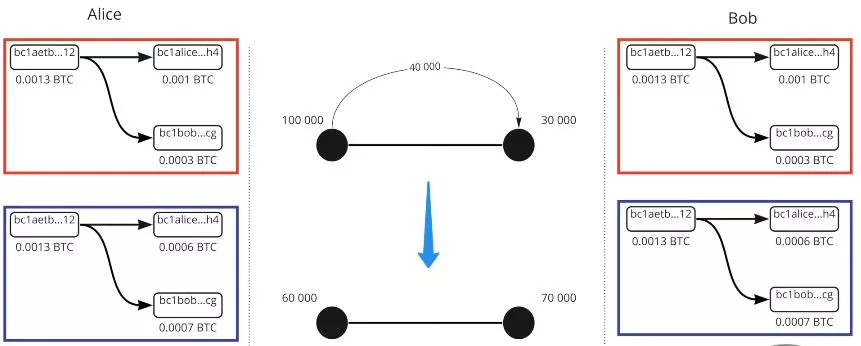
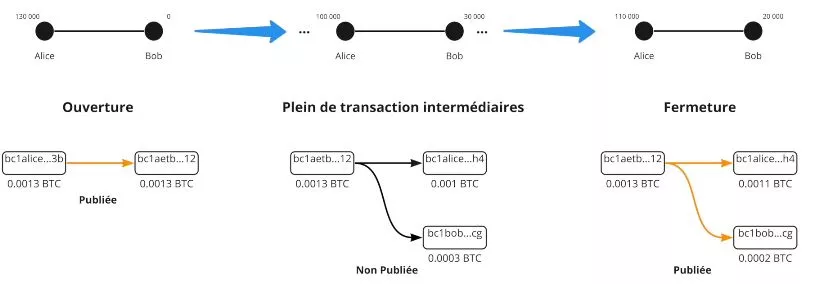
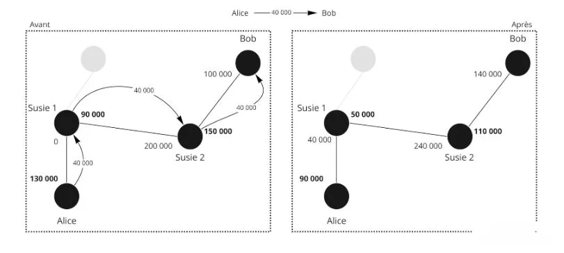
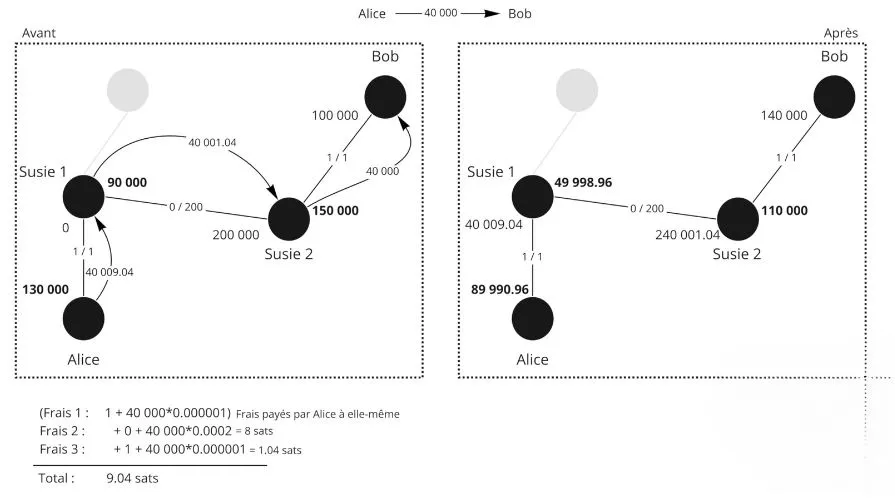
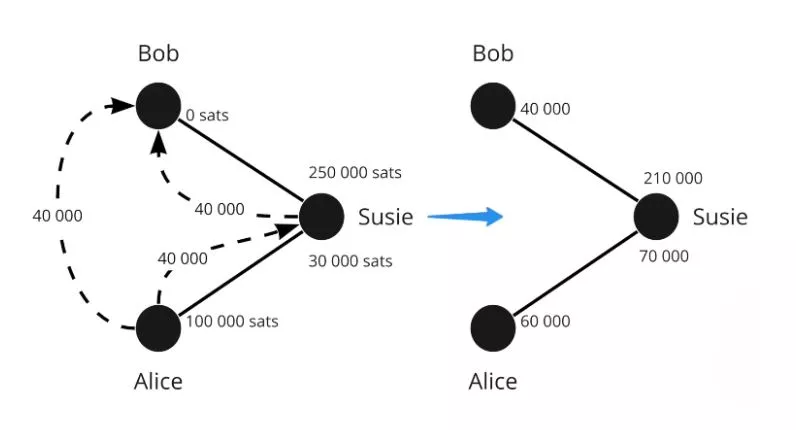
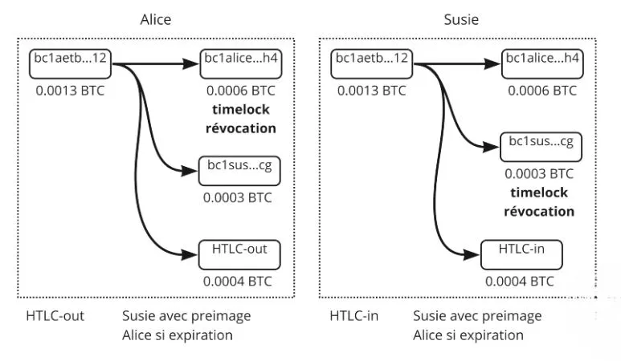
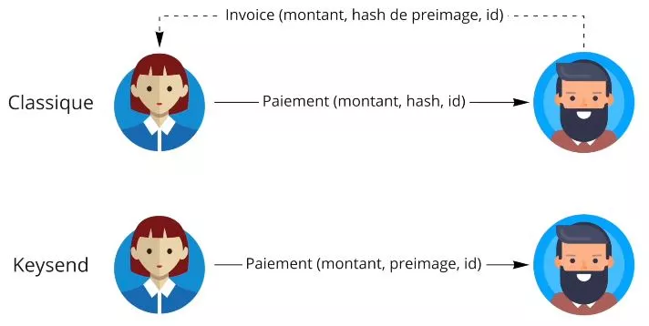
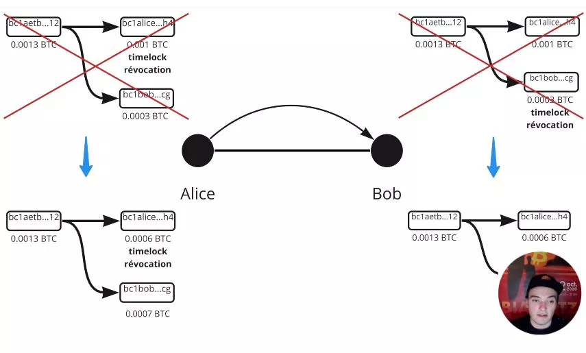
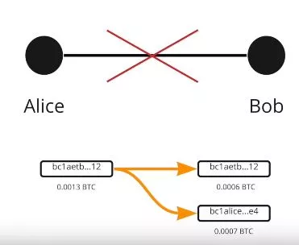

# Un viaggio verso il secondo strato di Bitcoin

Questa formazione è un corso teorico sul funzionamento tecnico di Lightning Network.

Benvenuti nel mondo entusiasmante di Lightning Network, un secondo strato di Bitcoin, che rappresenta un'innovazione tecnologica sofisticata e ricca di potenzialità. Ci apprestiamo ad approfondire gli aspetti tecnici di questa tecnologia, senza concentrarci su tutorial o scenari d'uso specifici. Per trarre il massimo da questa formazione, è indispensabile una solida comprensione di Bitcoin. Si tratta di un'esperienza che richiede un approccio serio e concentrato. Potete anche considerare di seguire il corso LN 202 in parallelo, che offre un aspetto più pratico a questa esplorazione. Preparatevi a imbarcarvi per un viaggio che potrebbe cambiare la vostra percezione dell'ecosistema Bitcoin.

Buona scoperta!

+++

# I fondamentali

## Comprendere Lightning Network

La rete Lightning è un'infrastruttura di pagamento di secondo livello, costruita sulla rete Bitcoin, che consente transazioni veloci e a basso costo. Per comprendere appieno come funziona la rete Lightning, è essenziale capire cosa sono i canali di pagamento e come funzionano.

Un canale di pagamento su Lightning è una sorta di "strada privata" tra due utenti, che consente transazioni Bitcoin veloci e ripetitive. Quando un canale viene aperto, ha una capacità fissa, che è definita in anticipo dagli utenti. Questa capacità rappresenta l'importo massimo di Bitcoin che può essere trasmesso nel canale in un determinato momento.

I canali di pagamento sono bidirezionali, il che significa che hanno due "lati". Ad esempio, se Alice e Bob aprono un canale di pagamento, Alice può inviare Bitcoin a Bob e Bob può inviare Bitcoin ad Alice. Le transazioni all'interno del canale non modificano la capacità totale del canale, ma modificano la ripartizione di questa capacità tra Alice e Bob.


Perché una transazione sia possibile in un canale di pagamento Lightning, l'utente che invia i fondi deve avere abbastanza Bitcoin dal suo lato del canale. Se Alice vuole inviare 1 Bitcoin a Bob attraverso il loro canale, deve avere almeno 1 Bitcoin dal suo lato del canale.
Limiti e funzionamento dei canali di pagamento su Lightning.
Anche se la capacità di un canale di pagamento Lightning è fissa, ciò non limita il numero totale di transazioni o il volume totale di Bitcoin che possono essere trasmessi attraverso il canale. Ad esempio, se Alice e Bob hanno un canale con una capacità di 1 Bitcoin, possono effettuare centinaia di transazioni da 0,01 Bitcoin o migliaia di transazioni da 0,001 Bitcoin, fintanto che la capacità totale del canale non viene superata in un determinato momento.

Nonostante questi limiti, i canali di pagamento Lightning sono un modo efficace per effettuare transazioni Bitcoin veloci e a basso costo. Consentono agli utenti di inviare e ricevere Bitcoin senza dover pagare commissioni di transazione elevate o attendere lunghe conferme sulla rete Bitcoin.

In sintesi, i canali di pagamento su Lightning offrono una soluzione potente per coloro che desiderano effettuare transazioni Bitcoin veloci ed a basso costo. Tuttavia, è essenziale comprendere il loro funzionamento e i loro limiti per poterne trarre pieno vantaggio.


Esempio:

- Alice ha 100.000 SAT
- Bob ha 30.000 SAT

Questo è lo stato attuale del canale. Durante una transazione, Alice decide di inviare 40.000 SAT a Bob. Può farlo perché 40.000 < 100.000.

Il nuovo stato del canale è quindi:

- Alice 60.000 SAT
- Bob 70.000 SAT

```
Stato iniziale del canale:
Alice (100.000 SAT) ============== Bob (30.000 SAT)

Dopo il trasferimento di Alice a Bob di 40.000 SAT:
Alice (60.000 SAT) ============== Bob (70.000 SAT)

```


Ora Bob desidera inviare 80.000 SAT ad Alice. Non avendo la liquidità, non può farlo. La capacità massima del canale è di 130.000 SAT, con una spesa possibile fino a 60.000 SAT per Alice e 70.000 SAT per Bob.


## Bitcoin, indirizzi, UTXO e transazioni

In questo secondo capitolo, prendiamo il tempo di studiare come funzionano realmente le transazioni Bitcoin, il che ci sarà molto utile per comprendere Lightning. Ci soffermiamo anche per un istante sulla nozione di indirizzo multi-firma, che è fondamentale per comprendere il prossimo capitolo dedicato all'apertura di canali sulla rete Lightning.

- Chiave privata > Chiave pubblica > Indirizzo: durante una transazione, Alice invia denaro a Bob. Quest'ultimo fornisce un indirizzo dato dalla sua chiave pubblica. Alice, che ha ricevuto il denaro su un indirizzo tramite la sua chiave pubblica, utilizza ora la sua chiave privata per firmare la transazione e sbloccare i bitcoin dell'indirizzo.
- Durante una transazione, in Bitcoin tutti i bitcoin devono muoversi. Chiamati UTXO (Unspend Transaction Output), i pezzi di bitcoin partiranno tutti per poi tornare al proprietario stesso.

Alice ha 0,002 BTC, Bob ha 0 BTC. Alice decide di inviare 0,0015 BTC a Bob. Firmerà una transazione di 0,002 BTC in cui 0,0015 andranno a Bob e 0,0005 torneranno nel suo portafoglio.


Da un UTXO (Alice ha 0,0002 BTC su un indirizzo) abbiamo quindi creato 2 UTXO (Bob ha 0,0015 e Alice ha recuperato un nuovo UTXO (indipendente dal precedente) di 0,0005 BTC).

```
Alice (0,002 BTC)
  |
  V
Transazione Bitcoin (0,002 BTC)
  |
  |----> Bob (0,0015 BTC)
  |
  V
Alice (nuovo UTXO: 0,0005 BTC)
```

In Lightning Network, vengono utilizzate firme multiple. Sono quindi necessarie 2 firme per sbloccare i fondi, ovvero due chiavi private per spostare i soldi. Quindi possono essere Alice e Bob a dover accettare insieme di sbloccare i fondi (l'UTXO). In LN precisamente, sono transazioni 2/2 quindi sono necessarie entrambe le firme a differenza delle firme multiple 2/3 o 3/5 dove è necessaria solo una combinazione del numero completo di chiavi.


# Apertura e chiusura dei canali

## Apertura del canale

Ora ci concentriamo più in dettaglio sull'apertura del canale e su come questa viene effettuata attraverso una transazione Bitcoin.

Lightning Network ha diversi livelli di comunicazione:

- Comunicazione p2p (protocollo Lightning Network)
- Canale di pagamento (protocollo Lightning Network)
- Transazione Bitcoin (protocollo Bitcoin)


Per aprire un canale, i due nodi parlano attraverso un canale di comunicazione:

- Alice: "Ciao, voglio aprire un canale!"
- Bob: "Ok, ecco il mio indirizzo pubblico."


Alice ha ora 2 indirizzi pubblici per creare un indirizzo multi-sig 2/2. Può quindi effettuare una transazione Bitcoin per inviare denaro.

Supponiamo che Alice abbia un UTXO di 0,002 BTC e voglia aprire un canale con Bob di 0,0013 BTC. Quindi creerà una transazione con 2 UTXO in uscita:

- un UTXO di 0,0013 verso l'indirizzo multi-sig 2/2
- un UTXO di 0,0007 verso uno dei suoi indirizzi di cambio (ritorno degli UTXO).

Questa transazione non è ancora pubblica perché se lo fosse a questo punto, dovrebbe fidarsi di Bob per poter sbloccare i soldi del multi-sig.

Ma come fare?

Alice creerà una seconda transazione chiamata "transazione di ritiro" prima di pubblicare il deposito dei fondi nel multi-sig.


La transazione di ritiro spenderà i fondi dell'indirizzo multi-sig verso un suo indirizzo (prima che tutto sia pubblicato).
Una volta costruite entrambe le transazioni, Alice informa Bob che è tutto pronto e gli chiede di firmare con la sua chiave pubblica spiegandogli che in questo modo potrà recuperare i suoi fondi nel caso qualcosa andasse storto. Bob accetta perché non è disonesto.
Alice può quindi recuperare i fondi da sola, avendo già la firma di Bob. Pubblica quindi le transazioni. Il canale è quindi aperto con 0,0013 BTC (130.000 SAT) dal lato di Alice.


## Transazione Lightning e di impegno


Ora analizziamo cosa succede realmente dietro le quinte quando si trasferiscono fondi da un lato all'altro di un canale Lightning Network, con particolare attenzione alla nozione di transazione di impegno. La transazione di prelievo/chiusura on-chain rappresenta lo stato del canale, garantendo a chi appartengono i fondi dopo ogni trasferimento. Quindi dopo un trasferimento su Lightning Network, c'è un aggiornamento di questa transazione/contratto non realizzato tra le due parti, Alice e Bob creano quindi una stessa transazione con lo stato attuale del canale nel caso di una chiusura:

- Alice apre un canale con Bob con 130.000 SAT dal suo lato. La transazione di prelievo accettata da entrambi in caso di chiusura dice che 130.000 SAT andranno ad Alice alla chiusura, Bob è d'accordo perché è giusto.


- Alice invia 30.000 SAT a Bob. Quindi c'è una nuova transazione di prelievo che dice che in caso di chiusura, Alice riceverà 100.000 SAT e Bob 30.000 SAT. Entrambi sono d'accordo perché è giusto.


- Alice invia 10.000 SAT a Bob, una nuova transazione di prelievo viene creata per dire che Alice recupera 90.000 SAT e Bob 40.000 SAT. Entrambi sono d'accordo perché è giusto.


```
Stato iniziale del canale:
Alice (130.000 SAT) =============== Bob (0 SAT)

Dopo il primo trasferimento:
Alice (100.000 SAT) =============== Bob (30.000 SAT)

Dopo il secondo trasferimento:
Alice (90.000 SAT) =============== Bob (40.000 SAT)
```

I soldi non si muovono mai, ma il saldo finale viene aggiornato tramite una transazione firmata ma non pubblicata on-chain. La transazione di prelievo è quindi una transazione di impegno. I trasferimenti di satoshi sono un'altra transazione di impegno più recente che aggiorna il saldo.

## Transazioni di impegno

Se le transazioni di impegno indicano uno stato del canale con la liquidità al momento X, è possibile imbrogliare pubblicando uno stato precedente? La risposta è sì, poiché abbiamo già la pre-firma dei due partecipanti nella transazione non pubblicata.



Per risolvere questo problema, aggiungeremo complessità:

- Timelock = fondi bloccati fino al blocco N
- Chiave di revoca = segreto di Alice e segreto di Bob'

Questi due elementi vengono aggiunti alla transazione di impegno. Di conseguenza, Alice deve necessariamente attendere la fine del Timelock, e chiunque detenga la chiave di revoca può spostare i fondi senza attendere la fine del Timelock. Se Alice cerca di imbrogliare, Bob usa la chiave di revoca per rubare e punire Alice.


Ora (e in realtà) la transazione di impegno non è la stessa per Alice e Bob, sono simmetriche ma ognuna con diverse restrizioni, si scambiano reciprocamente il loro segreto per creare la chiave di revoca della transazione di impegno precedente. Quindi, all'inizio, Alice crea il canale con Bob, 130.000 SAT dal suo lato, ha un Timelock che le impedisce di recuperare immediatamente i suoi soldi, deve aspettare un po'. La chiave di revoca può sbloccare i soldi ma solo Alice l'ha (transazione di impegno di Alice). Una volta che c'è un trasferimento, Alice fornirà il suo vecchio segreto a Bob e quindi quest'ultimo potrà svuotare il canale allo stato precedente nel caso in cui Alice cerchi di imbrogliare (Alice viene quindi punita).


Allo stesso modo, Bob fornirà il suo segreto ad Alice. In modo che se cerca di imbrogliare, Alice possa punirlo. L'operazione si ripete ad ogni nuova transazione di impegno. Viene deciso un nuovo segreto e una nuova chiave di revoca. Quindi, per ogni nuova transazione, è necessario distruggere la transazione di impegno precedente fornendo il segreto di revoca. In questo modo, se Alice o Bob cercano di imbrogliare, l'altro può agire prima (grazie al Timelock) e quindi evitare un imbroglio. Durante la transazione n°3, viene quindi fornito il segreto della transazione n°2 per consentire ad Alice e Bob di difendersi da Alice o Bob.


La persona che crea la transazione con il Timelock (colui che invia i soldi) può utilizzare la chiave di revoca solo dopo il Timelock. Tuttavia, la persona che riceve i soldi può utilizzarla prima del Timelock in caso di imbroglio da un lato all'altro di un canale sulla rete Lightning. In particolare, esaminiamo in dettaglio i meccanismi che consentono di proteggersi da eventuali imbrogli da parte del proprio partner all'interno del canale.

## Chiusura del canale

Ci concentriamo sulla chiusura del canale attraverso una transazione Bitcoin, che può assumere diverse forme a seconda dei casi. Esistono 3 tipi di chiusura del canale:

- Il buono: chiusura cooperativa
- Il brutale: chiusura forzata (non cooperativa)
- Il truffatore: chiusura da parte di un truffatore




### Il buono

I due partner si parlano e accettano di chiudere il canale. Quindi, interrompono tutte le transazioni e convalidano uno stato finale del canale. Si mettono d'accordo sui costi di rete (la persona che apre il canale paga i costi di chiusura). Creano quindi la transazione di chiusura. Quindi, c'è una transazione di chiusura, diversa dalle transazioni di impegno poiché non c'è Timelock e chiave di revoca. La transazione viene quindi pubblicata e Alice e Bob ricevono i loro saldi rispettivi. Questo tipo di chiusura è rapido (poiché non c'è Timelock) e generalmente poco costoso.


### Il brutale

Alice vuole chiudere il canale, comunica ma Bob non risponde perché è offline (interruzione di Internet o elettricità). Alice pubblicherà quindi la transazione di impegno più recente (l'ultima). La transazione viene quindi pubblicata e il Timelock si attiva. Quindi, i costi sono stati decisi durante la creazione di questa transazione X tempo fa! La MemPool è la rete che è cambiata da allora, il protocollo utilizza di default costi 5 volte superiori a quelli attuali durante la creazione della transazione. Creazione di costi a 10 SAT quindi la transazione ha considerato 50 SAT. Al momento della pubblicazione forzata, la transazione di chiusura della rete è:

- 1 SAT = sovrappagato di 50\*
- 100 SAT = sottopagato di 2\*

Ciò rende quindi la chiusura forzata più lunga (Timelock) e soprattutto più rischiosa in termini di costi e quindi di possibile convalida da parte dei minatori.


### Il truffatore

Alice cerca di imbrogliare pubblicando una vecchia transazione di impegno. Ma Bob sorveglia la MemPool e controlla se ci sono transazioni che cercano di pubblicare quelle vecchie. Se ne trova, utilizza la chiave di revoca per punire Alice e prendere tutti i SAT del canale.


In conclusione, la chiusura del canale in Lightning Network è una fase cruciale che può assumere diverse forme. In una chiusura cooperativa, entrambe le parti comunicano e concordano su uno stato finale del canale. È l'opzione più rapida e meno costosa. Al contrario, una chiusura forzata si verifica quando una delle parti non risponde. È una situazione più costosa e più lunga a causa dei costi di transazione imprevedibili e dell'attivazione del Timelock. Infine, se un partecipante cerca di imbrogliare pubblicando una vecchia transazione di impegno, il truffatore, può essere punito perdendo tutti i SAT del canale. È quindi cruciale comprendere questi meccanismi per un utilizzo efficace ed equo della Lightning Network.

# Una rete di liquidità

## Lightning Network

In questo settimo capitolo, esaminiamo il funzionamento di Lightning come rete di canali e come i pagamenti vengono instradati dalla loro origine alla loro destinazione.
Lightning è una rete di canali di pagamento. Ci sono quindi migliaia di peer con i loro canali di liquidità che sono connessi tra loro e si auto-utilizzano per effettuare transazioni tra peer non connessi.


La liquidità dei canali non può essere spostata in altri canali di liquidità.

`Alice -> Eden -> Bob`. I satoshi non si sono spostati da `Alice -> Bob`, ma da `Alice -> Eden` e da `Eden -> Bob`.

Ogni persona e canale ha quindi una liquidità diversa. Per effettuare pagamenti, è quindi necessario trovare un percorso nella rete con abbastanza liquidità. Se manca, il pagamento non verrà effettuato.

Sia la seguente rete:

```
Stato iniziale della rete:
Alice (130 SAT) ==== (0 SAT) Susie (90 SAT) ==== (200 SAT) Eden (150 SAT) ==== (100 SAT) Bob
```


Se Alice vuole trasferire 40 SAT a Bob, la liquidità verrà ridistribuita lungo il percorso tra le due parti.

```
Dopo il trasferimento di Alice a Bob di 40 SAT:
Alice (90 SAT) ==== (40 SAT) Susie (50 SAT) ==== (240 SAT) Eden (110 SAT) ==== (140 SAT) Bob
```


Tuttavia, nello stato iniziale, Bob non può inviare 40 SAT ad Alice perché Susie non ha liquidità con Alice per inviarle 40 SAT, quindi il pagamento non è possibile tramite questo percorso. È quindi necessario un altro percorso dove la transazione è possibile.

Nel primo esempio, si nota che Susie ed Eden non hanno perso né guadagnato nulla. Per accettare di essere utilizzati per instradare la transazione, i nodi della rete Lightning Network richiedono commissioni!

Ci sono commissioni diverse a seconda di dove si trova la liquidità.

Alice - Bob

- Commissioni di Alice = Alice -> Bob
- Commissioni di Bob = Bob -> Alice


Ci sono due tipi di commissioni:

- una commissione fissa indipendentemente dall'importo: 1 SAT (per impostazione predefinita ma modificabile)
- una commissione variabile (0,01% per impostazione predefinita)

Esempio di commissioni:

- Alice - Susie; 1/1 (1 in commissione fissa e 1 in commissione variabile)
- Susie - Eden; 0/200
- Eden - Bob; 1/1

Quindi:

- Commissioni 1: (pagate da Alice a se stessa) 1 + (40.000 \* 0,000001)
- Commissioni 2: 0 + 40.000 \* 0,0002 = 8 SAT
- Commissioni 3: 1 + 40.000 \* 0,000001 = 0,4 SAT


Invio:

1. Invio di 40.009,04 Alice -> Susie; Alice paga le sue commissioni a se stessa, quindi non conta
2. Susie fornisce il servizio di inviare 40.001,04 a Eden, prende la sua commissione di 8 SAT
3. Eden fornisce il servizio di inviare 40.000 a Bob, prende la sua commissione di 1,04 SAT.

Alice ha pagato 9,04 SAT di commissioni e Bob ha ricevuto 40.000 SAT.



In LN, è il nodo di Alice che decide il percorso prima dell'invio. Quindi c'è una ricerca del miglior percorso e solo Alice conosce il percorso e il prezzo. Il pagamento viene inviato ma Susie non ha informazioni.


Per Susie o Eden: non sanno chi è il destinatario finale o chi sta inviando. Questo è un routing a cipolla. Il nodo deve quindi tenere traccia della rete per trovare il percorso, ma nessuno degli intermediari ha informazioni.

## HTLC - Contratto Hashed Time Locked

In un sistema di routing classico, come si fa a garantire che Eden non imbrogli e rispetti la sua parte del contratto?

HTLC è quindi un contratto di pagamento che può essere sbloccato solo con un segreto. Se non viene rivelato, il contratto scade. È quindi un pagamento condizionale. Come vengono utilizzati?



Consideriamo la seguente situazione
`Alice (100.000 SAT) ==== (30.000 SAT) Susie (250.000 SAT) ==== (0 SAT) Bob`

- Bob genera un segreto S (la preimmagine) e ne calcola l'hash r = hash(s)
- Bob invia una fattura ad Alice con "r"
- Alice invia un HTLC di 40.000 SAT a Susie con la condizione di rivelare "s'" tale che hash(s') = r
- Susie invia un HTLC simile a Bob
- Bob sblocca l'HTLC di Susie mostrandole "s"
- Susie sblocca l'HTCL di Alice mostrandole "S"

Se Bob è offline e non raccoglie mai il segreto che gli dà la legittimità di ricevere i soldi, in questo caso l'HTLC scadrà dopo un certo numero di blocchi.


Gli HTLC scadono nell'ordine dall'ultimo al primo: quindi scadenza Susie - Bob poi Alice - Susie.
In questo modo, se Bob torna, non cambia nulla. In caso contrario, se Alice annulla mentre Bob torna, sarà un casino e le persone potrebbero aver lavorato per niente.

E allora, la domanda è: in caso di chiusura, cosa succede? In realtà, le nostre transazioni di impegno sono ancora più complesse. È necessario rappresentare il saldo intermedio nel caso in cui il canale venga chiuso.

Quindi c'è un HTLC-out di 40.000 satoshi (con le limitazioni viste in precedenza) nella transazione di impegno tramite un output n°3.



Quindi Alice ha nella transazione di impegno:

- Output n°1: 60.000 SAT per Alice tramite un Timelock e una chiave di revoca (ciò che le rimane)
- Output n°2: 30.000 che appartengono già a Susie
- Output n°3: 40.000 in HTLC

La transazione di impegno di Alice è con un HTCL-out perché invia alla destinataria, Susie, un HTLC-in.


Quindi, se pubblichiamo questa transazione di impegno, Susie può recuperare i soldi del HTCL con l'immagine "s". Se non ha la preimmagine, Alice recupera i soldi una volta che il HTCL scade. Pensate alle uscite (UTXO) come a diversi pagamenti con diverse condizioni.
Una volta effettuato il pagamento (scadenza o esecuzione), lo stato del canale cambia e la transazione con HTCL non esiste più. Torniamo a qualcosa di classico.
In caso di chiusura cooperativa: si interrompono i pagamenti e quindi si attende l'esecuzione dei trasferimenti/HTCL, la transazione è leggera quindi meno costosa perché ci sono al massimo 1 o 2 output.
In caso di chiusura forzata: si pubblica con tutti gli HTLC in corso, diventa quindi molto pesante e molto costoso. Ed è un casino.

In sintesi, il sistema di routing di Lightning Network utilizza contratti Hash Time-Locked (HTLC) per garantire un pagamento sicuro e verificabile. Gli HTLC consentono di effettuare pagamenti condizionati in cui i soldi possono essere sbloccati solo con un segreto, garantendo così che i partecipanti rispettino i loro impegni.
Nell'esempio presentato, Alice desidera inviare SAT a Bob tramite Susie. Bob genera un segreto, crea un hash di esso e lo trasmette ad Alice. Alice e Susie creano un HTLC basato su questo hash. Una volta che Bob sblocca l'HTLC di Susie mostrandole il segreto, Susie può quindi sbloccare l'HTLC di Alice.
Nel caso in cui Bob non rivelasse il segreto entro un certo periodo di tempo, l'HTLC scade. La scadenza avviene nell'ordine inverso, assicurando che se Bob torna online, non ci siano conseguenze indesiderate.

Alla chiusura del canale, se è una chiusura cooperativa, i pagamenti vengono interrotti e gli HTLC vengono risolti, il che è generalmente meno costoso. Se la chiusura è forzata, tutte le transazioni HTLC in corso vengono pubblicate, il che può diventare molto costoso e disordinato.
In sintesi, il meccanismo degli HTLC aggiunge un ulteriore livello di sicurezza nella Lightning Network, garantendo che i pagamenti vengano eseguiti correttamente e che gli utenti rispettino i loro impegni.

## Trovare la propria strada

L'unica informazione pubblica è la capacità totale del canale (Alice + Bob) ma non si sa dove si trova la liquidità.
Per avere maggiori informazioni, il nostro nodo ascolta il canale di comunicazione di LN per annunci di nuovi canali e aggiornamenti delle commissioni dei canali. Il tuo nodo guarda anche la blockchain per la chiusura dei canali.

Poiché non abbiamo tutte le informazioni, dobbiamo fare una ricerca di grafico/percorso con le informazioni che abbiamo (capacità massima dei canali e non dove si trova la liquidità).

Criteri:

- Probabilità di successo - Costi
- Scadenza degli HTLC
- Numero di nodi intermedi
- Casuale


Quindi se ci sono 3 possibili percorsi:

- Alice > 1 > 2 > 5 > Bob
- Alice > 1 > 2 > 4 > 5 > Bob
- Alice 1 > 2 > 3 > Bob

Cerchiamo quindi il migliore in teoria con il minor costo e la maggior probabilità di successo: il massimo di liquidità e il minor numero di hop (salti) possibile.

Ad esempio, se 2-3 ha una capacità di soli 130.000 SAT, inviare 100.000 è molto improbabile, quindi la scelta n. 3 non ha possibilità di successo.


Ora l'algoritmo ha fatto le sue 3 scelte e proverà quindi la prima:

Scelta 1:

- Alice invia un HTCL a 1 di 100.000 SAT;
- 1 fa un HTLC di 100.000 SAT per il 2
- Il 2 fa un HTLC di 100.000 SAT al 5, ma il 5 non può, quindi annuncia.

L'informazione viene restituita, quindi Alice decide di provare la seconda strada:

- Alice invia un HTLC di 100.000 a 1
- 1 fa un HTLC di 100.000 a 2
- 2 fa un HTLC di 100.000 verso 4
- 4 fa un HTLC di 100.000 verso Bob. Bob ha la liquidità quindi va bene.
- Bob utilizza la preimmagine (hash) dell'HTLC e quindi utilizza il segreto per recuperare i 100.000 SAT
- 5 ha quindi ora il segreto dell'HTLC per recuperare l'HTLC bloccato di 4
- 4 ha quindi ora il segreto dell'HTLC per recuperare l'HTLC bloccato di 2
- 2 ha quindi ora il segreto dell'HTLC per recuperare l'HTLC bloccato di 1
- 1 ha quindi ora il segreto dell'HTLC per recuperare l'HTLC bloccato di Alice

Alice non ha visto il fallimento del percorso 1, ha solo aspettato un secondo in più. Un fallimento di pagamento si verifica quando non c'è alcun percorso possibile. Per facilitare la ricerca del percorso, Bob può fornire informazioni ad Alice per aiutarla nella sua fattura:

- L'importo
- Il suo indirizzo
- L'hash della preimmagine in modo che Alice possa creare l'HTLC
- Indicazioni sui canali di Bob

Bob conosce la liquidità dei canali 5 e 3 perché è direttamente connesso ad essi, può indicarlo ad Alice. Avvisa Alice che il nodo 3 è inutile, evitando ad Alice di potenzialmente fare il suo percorso.
Un altro elemento sarebbero i canali privati (quindi non pubblicati sulla rete) che Bob può avere. Se Bob ha un canale privato con 1, può dire ad Alice di usarlo e darebbe Alice > 1 > Bob.


In conclusione, il routing delle transazioni su Lightning Network è un processo complesso che richiede la considerazione di diversi fattori. Mentre la capacità totale dei canali è pubblica, la distribuzione precisa della liquidità non è direttamente accessibile. Ciò obbliga i nodi a stimare le rotte più probabili di successo, tenendo conto di criteri come le commissioni, la scadenza degli HTLC, il numero di nodi intermedi ed un fattore di casualità. Quando sono possibili più rotte, i nodi cercano di minimizzare le commissioni e massimizzare le possibilità di successo scegliendo canali con una liquidità sufficiente e un numero minimo di salti. Se un tentativo di transazione fallisce a causa di una liquidità insufficiente, viene provata un'altra rotta fino a quando una transazione ha successo.

Inoltre, per facilitare la ricerca della rotta, il destinatario può fornire informazioni aggiuntive, come l'indirizzo, l'importo, l'hash della preimmagine e indicazioni sui suoi canali. Ciò può aiutare a identificare i canali con una liquidità sufficiente ed evitare tentativi di transazioni inutili. In definitiva, il sistema di routing su Lightning Network è progettato per ottimizzare la velocità, la sicurezza e l'efficienza delle transazioni, preservando la privacy degli utenti.

# Strumenti di Lightning Network

## Fattura, LNURL, Keysend


Una fattura LN (o invoice) è lunga e non piacevole da leggere, ma consente di rappresentare in modo denso una richiesta di pagamento.

Esempio:
lnbc1m1pskuawzpp5qeuuva2txazy5g483tuv9pznn9ft8l5e49s5dndj2pqq0ptyn8msdqqcqzpgxqrrsssp5v4s00u579atm0em6eqm9nr7d0vr64z5j2sm5s33x3r9m4lgfdueq9qyyssqxkjzzgx5ef7ez3dks0laxayx4grrw7j22ppgzyhpydtv6hmc39skf9hjxn5yd3kvv7zpjdxd2s7crcnemh2fz26mnr6zu83w0a2fwxcqnvujl3

- lnbc1m = parte leggibile
- 1 = separazione dal resto
- Poi il resto
- Bc1 = Codifica Bech32 (base 32), quindi si utilizzano 32 caratteri.
- 10 = 1.2.3.4.5.6.7.8.9.0
- 26 = abcdefghijklmnopqrstuvwxyz
- 32 = non il "b-i-o" e non il "1"

### lnbc1m

- ln = Lightning
- Bc = bitcoin (mainnet)
- 1 = importo
- M = milli (10*-3 / u = micro 10*-6 / n = nano 10*-9 / p = pico 10*-12)
  qui 1m = 1 \* 0.0001btc = 100 000 BTC
  « Ha chiesto di pagare 100.000 SAT sulla rete Lightning della mainnet di bitcoin per pskuawzpp5qeuuva2txazy5g483tuv9pznn9ft8l5e49s5dndj2pqq0ptyn8msdqqcqzpgxqrrsssp5v4s00u579atm0em6eqm9nr7d0vr64z5j2sm5s33x3r9m4lgfdueq9qyyssqxkjzzgx5ef7ez3dks0laxayx4grrw7j22ppgzyhpydtv6hmc39skf9hjxn5yd3kvv7zpjdxd2s7crcnemh2fz26mnr6zu83w0a2fwxcqnvujl3 »

### Timestamp (quando è stato creato)

Contiene 0 o più parti aggiuntive:

- hash preimmagine
- Segreto di pagamento (onion routing)
- Dati arbitrari
- Chiave pubblica LN del destinatario
- Tempo di scadenza (default 1h)
- Indicazioni di instradamento
- Firma del pacchetto

Esistono altri tipi di fattura. Il metaprotocollo LNURL consente di fornire direttamente una quantità di satoshi invece di fare una richiesta. Si tratta di una soluzione molto flessibile che consente di migliorare l'esperienza dell'utente.


Un Keysend consente ad Alice di inviare denaro a Bob senza che Bob lo richieda. Alice recupera l'ID di Bob, crea una pre-immagine senza chiedere a Bob e la include nel suo messaggio. Bob riceverà quindi una richiesta a sorpresa in cui potrà rilasciare il denaro perché Alice ha già fatto il lavoro.



In conclusione, una fattura sulla Rete Lightning, sebbene complessa a prima vista, codifica efficacemente una richiesta di pagamento. Ogni sezione della fattura contiene informazioni chiave, tra cui l'importo da pagare, il destinatario, il timestamp di creazione e potenzialmente altre informazioni come l'hash della pre-immagine, il segreto di pagamento, le indicazioni di instradamento e il tempo di scadenza. Protocolli come LNURL e Keysend offrono notevoli miglioramenti in termini di flessibilità e di esperienza utente, rendendo possibile, ad esempio, l'invio di fondi senza la preventiva richiesta della controparte. Queste tecnologie rendono il processo di pagamento più fluido ed efficiente su Lightning Network.

## Gestione della liquidità


Diamo alcuni punti di riferimento generali per rispondere alla domanda ricorrente sulla gestione della liquidità su Lightning.

In LN, ci sono 3 tipi di persone:

- Gli acquirenti: hanno liquidità in uscita, è il più semplice perché basta aprire dei canali
- I commercianti: è più complicato perché hanno bisogno di liquidità in entrata tramite altri nodi e altri attori. Devono avere persone connesse a loro
- I nodi di routing: vogliono essere equilibrati con liquidità da entrambi i lati e una buona connessione a molti nodi per essere utilizzati il più possibile

Quindi se hai bisogno di liquidità in entrata, puoi acquistarla da servizi.


Alice acquista un canale con Susie per 1 milione di satoshi, quindi apre un canale con direttamente 1.000.000 SAT dal lato in entrata. Può quindi accettare fino a 1 milione di SAT di pagamento dai clienti che sarebbero connessi con Susie (che è molto connessa).

Un'altra soluzione sarebbe quella di effettuare pagamenti; paghi 100.000 per X motivo, puoi ora ricevere 100.000.


### Soluzione Loop Out: Atomic swap LN - BTC

Alice 2 milioni - Susie 0


Alice vuole inviare la liquidità a Susie, quindi fa un Loop out (un nodo speciale che offre un servizio professionale di riequilibrio LN/BTC).
Alice invia 1 milione a loop tramite il nodo di Susie, quindi Susie ha la liquidità e Loop restituisce il saldo on-chain al nodo di Alice.


Quindi i 1 milione vanno a Susie, quest'ultima invia 1 milione a Loop, Loop invia 1 milione ad Alice. Alice ha quindi spostato la liquidità verso Susie al prezzo di alcune commissioni pagate a Loop per il servizio.

L'aspetto più complicato in LN è mantenere la liquidità.


In conclusione, la gestione della liquidità sulla rete Lightning Network è una sfida chiave, che dipende dal tipo di utente: acquirente, commerciante o nodo di routing. Gli acquirenti, che hanno bisogno di liquidità in uscita, hanno il compito più semplice: aprono semplicemente dei canali. I commercianti, che necessitano di liquidità in entrata, devono essere connessi ad altri nodi e attori. I nodi di routing, invece, cercano di mantenere un equilibrio di liquidità da entrambi i lati. Esistono diverse soluzioni per gestire la liquidità, come l'acquisto di canali o il pagamento per aumentare la capacità di ricezione. L'opzione "Loop Out", che consente uno scambio atomico tra LN e BTC, offre una soluzione interessante per riequilibrare la liquidità. Nonostante queste strategie, mantenere la liquidità sulla rete Lightning Network rimane una sfida complessa.

# Vai oltre

## Riassunto della formazione

Il nostro obiettivo era quello di spiegare come funziona la rete Lightning e come si basa su Bitcoin per funzionare.

La rete Lightning è una rete di canali di pagamento. Abbiamo visto come funziona un canale di pagamento tra due parti interessate, ma abbiamo anche ampliato la nostra visione all'intera rete, alla nozione di rete di canali di pagamento.


I canali vengono aperti tramite una transazione Bitcoin e possono ospitare quante transazioni possibili. Lo stato del canale è rappresentato da una transazione di impegno che invia a ciascuna delle parti interessate ciò che possiede dal proprio lato del canale. Quando avviene una transazione all'interno del canale, le parti interessate si impegnano sul nuovo stato revocando il vecchio stato e costruendo una nuova transazione di impegno.



Le coppie si proteggono dalla frode con chiavi di revoca e un time lock. La chiusura consensuale reciproca è preferita per chiudere il canale. In caso di chiusura forzata, viene pubblicata l'ultima transazione di impegno.



I pagamenti possono utilizzare i canali di altri nodi intermediari. I pagamenti condizionati all'hash (HTLC) consentono di bloccare i fondi in attesa della completa risoluzione del pagamento. Il routing a cipolla viene utilizzato in Lightning Network. I nodi intermediari non conoscono la destinazione finale dei pagamenti. Alice deve calcolare il percorso del pagamento, ma non ha tutte le informazioni sulla liquidità nei canali intermediari.


C'è una componente di probabilità quando si invia un pagamento tramite Lightning Network.


Per ricevere pagamenti, è necessario gestire la liquidità nei canali, che può essere fatto chiedendo ad altre persone di aprire canali verso di noi, aprendo canali da soli e utilizzando strumenti come Loop o acquistando/noleggiando canali su marketplace.

## Intervista a Fanis

Ecco un riassunto dell'intervista:

Lightning Network è una soluzione di pagamento ultra-veloce su Bitcoin che consente di superare le limitazioni legate alla scalabilità della rete. Tuttavia, i bitcoin su Lightning non sono altrettanto sicuri come quelli sulla blockchain Bitcoin poiché la decentralizzazione e la sicurezza sono privilegiate a discapito della scalabilità.

L'aumento eccessivo della dimensione dei blocchi non è una buona soluzione poiché comporta compromessi in termini di nodi e capacità dei dati. Invece, Lightning Network consente di creare canali di pagamento tra due utenti di Bitcoin senza far apparire le transazioni sulla blockchain, risparmiando spazio sui blocchi e consentendo a Bitcoin di scalare oggi.

Tuttavia, ci sono critiche riguardanti la scalabilità e la centralizzazione di Lightning Network, con potenziali problemi legati alla chiusura dei canali e alle alte commissioni di transazione. Per risolvere questi problemi, si consiglia di evitare di aprire piccoli canali per evitare problemi futuri e di aumentare le commissioni di transazione con Child Pay for Parent (CPFP).

Le soluzioni considerate per il futuro di Lightning Network sono il batching e la creazione di canali in gruppi per ridurre le commissioni di transazione, nonché l'aumento della dimensione dei blocchi a lungo termine. Tuttavia, è importante notare che i bitcoin su Lightning non sono altrettanto sicuri come i bitcoin sulla blockchain Bitcoin.

La privacy su Bitcoin e Lightning sono correlate, con il routing a cipolla che garantisce un certo livello di privacy per le transazioni. Tuttavia, su Bitcoin, tutto è trasparente per impostazione predefinita, con euristiche utilizzate per tracciare i Bitcoin da un indirizzo all'altro sulla blockchain Bitcoin.

L'acquisto di Bitcoin con KYC consente all'exchange di conoscere le transazioni di prelievo, mentre le quantità rotonde e gli indirizzi di cambio consentono di sapere quale parte di una transazione è destinata a un'altra persona e quale parte è destinata a se stessi.

Per migliorare la privacy, le azioni congiunte e i coinjoin consentono di eludere i calcoli di probabilità effettuando transazioni in cui più persone effettuano una transazione insieme. Le società di analisi della blockchain hanno più difficoltà a determinare cosa fai con i tuoi bitcoin seguendoti.

Su Lightning, ci sono solo due persone che sono a conoscenza della transazione ed è più confidenziale rispetto a Bitcoin. Il routing a cipolla significa che un nodo intermedio non conosce l'emittente e il destinatario del pagamento.

Per utilizzare Lightning Network, si consiglia di seguire una formazione sul tuo canale YouTube o direttamente sul sito scopri Bitcoin, o di utilizzare la formazione su Umbrell. È anche possibile inviare testo arbitrario durante un pagamento su Lightning utilizzando un campo dedicato per questo, il che può essere utile per donazioni o messaggi.
Tuttavia, è importante notare che i nodi di routing su Lightning potrebbero essere regolamentati in futuro, con alcuni Stati che cercheranno di regolare i nodi di routing.
Per i commercianti, è necessario gestire la liquidità per accettare i pagamenti sulla Lightning Network, con attuali vincoli che possono essere superati con soluzioni adeguate.

Infine, il futuro di Bitcoin è promettente con una possibile proiezione di un milione entro cinque anni. Per garantire la professionalizzazione dell'industria e la creazione di un sistema alternativo a quello del sistema bancario esistente, è importante contribuire alla rete e smettere di fidarsi.

## Ringraziamenti e continuate a scavare la tana del coniglio

Congratulazioni! 🎉
Hai completato il corso LN 201 - Introduzione a Lightning Network!
Puoi essere fiero di te perché non è facile. Sappi che poche persone scendono così in profondità nella tana del Bitcoin.

Innanzitutto, un grande ringraziamento a Fanis Makalakis per averci offerto questo fantastico corso gratuito su un aspetto più etnico di Lightning. Non esitare a seguirlo su Twitter, sul suo blog o tramite il suo lavoro presso LN market.

Inoltre, se desideri aiutare il progetto, non esitare a sponsorizzarci su Patreon. I tuoi doni saranno utilizzati per produrre contenuti per nuovi corsi e ovviamente sarai il primo a essere informato (compresa la prossima di Fanis che è in preparazione!).

L'avventura di Lightning Network continua con il corso su Umbrel e l'installazione di un nodo Lightning Network. Fine della teoria e inizio della pratica con il corso LN 202!

Baci e a presto!

Rogzy'
