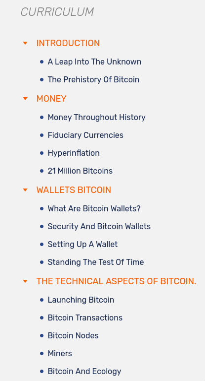

# This Part is used as a Description Page of the Course

In this course, I will explain how to create a course using the PlanB Network Format. 

You should state here the approximate time volume that it takes to finish the whole course. 
The course should take approximately 1 hour. 
Throughout the journey, explanatory scheme and additional resources are available.

Better to state also the prerequisite here.
You don't need any specific knowledge to get started, the course is accessible to everyone!

In this description page we will also displayed the `thumbnail.webp` image present in the `assets/` folder. 

+++

# This is a Part of the course
<partId>97ccb669-12a0-5eed-83ac-c2f51839d998</partId>

## This is a Chapter of the course 
<chapterId>4dc58281-5179-507c-afde-8c9204cbd3fd</chapterId>

### This is a Section of the course 

Courses is composed of 3 different sub-elements that are:
- Part, defined by the `# ` level and useful to separate the course in theme or main subject
- Chapter, defined by the `## ` level and useful to separate the part content in several pages as on PlanB Network each chapter is displayed on its own page
- Section, defined by the `### ` level and useful to separate Chapter in sub-subject for clarity

This three object are used to create the curriculuum on the PBN platform. Here's an example for [BTC101](https://planb.network/en/courses/btc101) 

You can see that here we have used 2 syntaxes from the Markdown syntax to redirect to an link and to displayed an image that is located in the `assets/` folder of the course folder. 

You may noticed that the image is in the subfolder `assets/en/`, it's because it is a picture that contains english text that will be translated in other languages. If the image doesn't contain text it should be in the subfolder `assets/no-txt/`. 

Although every image format is valid, we prefer for storage efficiency reason to convert every image into `.webp` format. If you don't know how to do it, we have a python script that do the job and our code revieviers could also do while reviewing your PR. 

## This is 2nd Chapter 
<chapterId>3ff2a050-c311-55ce-a3c6-3cc450cad1ce</chapterId>

A chapter doesn't necessarily contains sections (`###`) but a part must contains at least one chapter. 

If you want to learn more about markdown syntax, you can read the [github documentation](https://docs.github.com/en/get-started/writing-on-github/getting-started-with-writing-and-formatting-on-github/basic-writing-and-formatting-syntax) about it.

A cool trick is to embed video like this : 

## Part and Chapter UUIDs
<chapterId>eac81877-db9b-5027-87e2-2b28b59459a0</chapterId>

To better identify each element of the course, we have decided to add UUIDs for each Chapter and Part. Here again there's a python script available for it, but reviewers could do it too. 
The UUIDs are the identical between 2 languages of the same content. 

