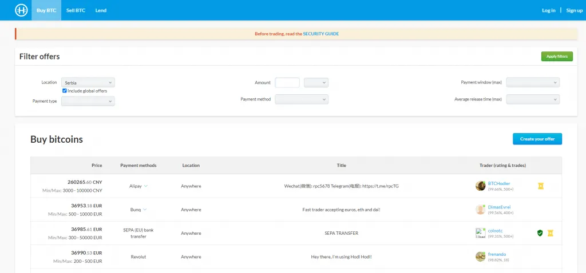
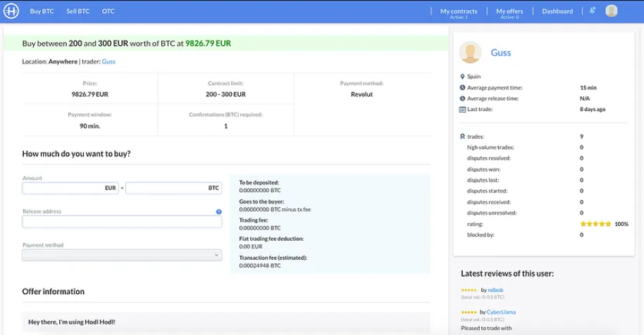
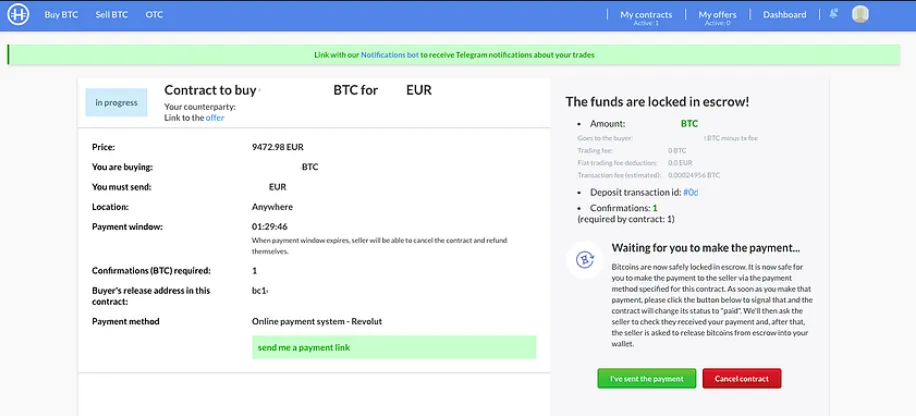
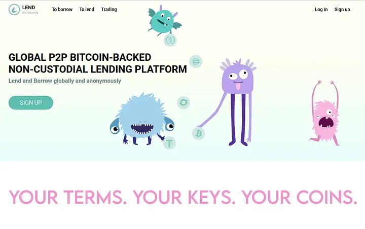
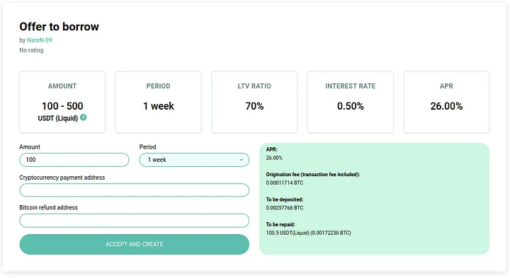

Hodl Hodl es un intercambio descentralizado de Bitcoin que prioriza el control y la seguridad del usuario. A diferencia de los intercambios tradicionales, opera en un modelo de igual a igual, permitiendo intercambios directos entre usuarios. Con su sistema de custodia multi-firma, Hodl Hodl garantiza la seguridad de los fondos durante las transacciones. La plataforma también admite varios métodos de pago y ofrece opciones de negociación como contratos por diferencia (CFDs).

https://hodlhodl.com/pages/faq_help

## guía de escritura:

Iniciando tu viaje con HodlHodl: Una guía paso a paso

HodlHodl es un intercambio de criptomonedas de igual a igual (P2P) que admite exclusivamente una moneda digital pero ofrece la flexibilidad de comerciar en cualquier moneda, incluyendo todas las monedas fiduciarias y altcoins. Un aspecto importante de esta plataforma P2P es que no impone ninguna tarifa de depósito o retiro, en cambio, cobra tarifas de negociación que van desde el 0.5% al 0.6%, dependiendo del estado de verificación del usuario. Los usuarios tienen la ventaja de una amplia gama de métodos de pago, lo que hace de HodlHodl una de las plataformas P2P más versátiles. Algunos de los métodos de pago comúnmente utilizados incluyen SWIFT, SEPA, transferencias bancarias, transacciones con tarjeta de crédito, PayPal, Venmo, MoneyGram y Western Union. Sin embargo, las opciones de pago disponibles dependen de la aceptación del vendedor.

Una de las características destacadas de HodlHodl son los límites de negociación variables, que se relajan progresivamente con el aumento del volumen de negociación y las operaciones exitosas. La cantidad mínima de negociación de BTC se establece en 0.001 BTC, y la oferta de préstamo más baja no debe ser inferior a 50 USD en valor criptográfico. La plataforma no exige ningún procedimiento de Conoce a tu cliente (KYC) o Anti-Lavado de Dinero (AML) en cumplimiento de su política de mantener el anonimato del usuario. Sin embargo, los usuarios que optan por la verificación pueden disfrutar de beneficios como comisiones reducidas, límites de transacción aumentados y un estado "Verificado" visible. HodlHodl tiene un alcance global extenso, que acomoda a usuarios de casi todos los países con algunas excepciones como Corea del Norte, Irak, Siria y Sudán.

### Creación de cuenta

Para crear tu propia cuenta, simplemente haz clic en 'Registrarse', ubicado en la esquina derecha de la página de inicio de la plataforma. Como era de esperar, se te pedirá que ingreses una dirección de correo electrónico, elijas un nombre de usuario y establezcas una contraseña de pago. Además, la plataforma te solicita que definas tu zona horaria local, ya que esto ayuda a agilizar tus horas de operación y facilita el proceso de transacción.

### Personaliza tu perfil

Después de registrarte exitosamente, tu siguiente paso sería completar tu perfil con algunos detalles necesarios.

La personalización de tu perfil debe incluir:

- Información personal: esto incluye tu nombre de usuario elegido, correo electrónico y una breve biografía.
- Autenticación de dos factores (2FA): habilitar 2FA mejora la seguridad de tu perfil, lo cual siempre es una medida prudente.
- Acceso a la API: esto no es obligatorio y permanece inactivo de forma predeterminada.
- Perfiles P2P anteriores: si has interactuado con otras plataformas P2P anteriormente, vincular esta información puede aumentar tu credibilidad entre otros comerciantes.

### Registra la dirección de tu BTC

Para comenzar a operar con BTC, primero deberás proporcionar tu dirección de BTC. Esto se puede ingresar dentro del menú "Configuración de Trading". Después de registrar tu dirección, puedes proceder a "Comprar BTC" o "Vender BTC" para iniciar tu viaje de trading.

## Paso a paso hacia tu primera operación

Guía de Bitcoiner Q&A https://bitcoiner.guide/hodlhodl/

1. Visita hodlhodl.com y crea tu cuenta. Los únicos detalles que debes proporcionar son un nombre de usuario y una dirección de correo electrónico. Luego serás redirigido a la página de inicio.

2. Haz clic en "Comprar BTC" en el encabezado del sitio web.

3. Selecciona tu tipo y método de pago deseado. También puedes especificar una cantidad específica aquí si es necesario.

4. Selecciona la oferta deseada. Luego puedes revisar los detalles de la operación y también leer los informes de actividad y calificaciones de los pares.

5. Una vez que estés satisfecho, puedes especificar cuánto deseas comprar, ingresar la dirección a la que te gustaría que se envíe el bitcoin y confirmar el método de pago anunciado por el vendedor. Haz clic en "Aceptar oferta y crear contrato".

6. Ahora tienes tu contrato creado y debes hacer clic en "Generar Fideicomiso", donde se te pedirá que crees una contraseña de pago. La contraseña de pago es una clave de encriptación para el par de claves de fideicomiso del usuario. Se utiliza para depositar o liberar Bitcoin en o desde el fideicomiso.

7. Ahora debes esperar a que el vendedor deposite sus bitcoins en la billetera de fideicomiso. Después de iniciar el contrato, puedes chatear con el vendedor utilizando el cuadro de chat en el lado derecho de la página.

8. Una vez que el vendedor haya depositado sus fondos en el fideicomiso, verás esta pantalla que te aconseja no enviar tu dinero hasta que haya un número suficiente de confirmaciones en la cadena de bloques (esto varía según las condiciones de la operación). Puedes verificar el progreso de la transacción de depósito del vendedor haciendo clic en el enlace azul "ID de transacción de depósito".

9. Una vez confirmado, recibirás una notificación y luego podrás enviar los fondos al vendedor según los detalles que te proporcionará. Una vez que hayas hecho esto, haz clic en "He enviado el pago".

10. Luego deberás esperar a que el vendedor confirme que ha recibido los fondos, momento en el cual el bitcoin se liberará en la dirección que especificaste al inicio del contrato. También se te dará la oportunidad de calificar a tu par.

¡Felicidades, acabas de comprar bitcoins sin KYC!

Dos consejos finales:

- Hodl Hodl es una plataforma basada en web, por lo que siempre recomendaría acceder a través del navegador Tor para proteger tu privacidad.
- Si eres usuario de Telegram, asegúrate de vincular tu perfil con el bot de Hodl Hodl. De esa manera recibirás actualizaciones en vivo sobre cada operación, lo que te permitirá tomar medidas rápidas.

## Opción de préstamo

Esta guía te ayudará a dar tus primeros pasos en el uso de la plataforma Lend en Hodl Hodl.

> FUENTE/ https://medium.com/hodl-hodl/quick-guide-to-lend-or-borrow-on-lend-at-hodl-hodl-5a535d526217

Lend at Hodl Hodl (lend.hodlhodl.com) es una plataforma diseñada para que los usuarios de todo el mundo puedan prestar o pedir prestado entre sí sin tener que confiar en un tercero o completar un procedimiento de verificación.

LEND te permite prestar o pedir prestado diferentes stablecoins o criptomonedas utilizando BTC como garantía. (Por el momento, no es posible prestar BTC, aunque esa posibilidad se está desarrollando para el futuro).

Una vez que te hayas registrado en la plataforma solo con tu apodo y un correo electrónico, estarás listo para comenzar a prestar o pedir prestado.

Primero, vamos a buscar entre las ofertas existentes aquella que se ajuste a nuestras necesidades. (Siempre ten en cuenta que puedes publicar tu propia oferta si ninguna de las ofertas existentes te satisface).

Más abajo en la página principal encontramos el cuadro de búsqueda:

La herramienta de búsqueda nos muestra las ofertas para pedir prestado de forma predeterminada.

Si queremos prestar, debemos seleccionar el botón correspondiente.

Ingresamos la cantidad que queremos pedir prestado y la criptomoneda que estamos buscando.

La relación LTV se refiere al porcentaje de criptomoneda que recibiremos en función del valor en BTC que colocamos como garantía. Cuanto mayor sea el LTV, mayor será la cantidad que pedimos prestado en relación con el valor en BTC que depositamos como garantía, pero también será mayor la posibilidad de que nuestra garantía (BTC) se liquide si su precio baja. Si elegimos un LTV bajo, la cantidad que pedimos prestado en relación con el valor en BTC que depositamos como garantía también será baja, y habrá menos posibilidades de que nuestra garantía (BTC) se liquide en caso de una disminución en su precio.

Finalmente, elegimos el plazo del préstamo que estamos dispuestos a aceptar. Es decir, durante cuánto tiempo el prestamista nos dará la cantidad solicitada y se establecerá una fecha de devolución final. El crédito puede ser devuelto en su totalidad el día en que vence el plazo o a través de pagos parciales durante todo el período del contrato.

Al hacer clic en el botón "Buscar ofertas", la plataforma nos devolverá todas las ofertas que coincidan con nuestros criterios de búsqueda, y podremos elegir la que mejor se adapte a nosotros.

Supongamos que elegimos la siguiente oferta:

El usuario "NateN-09" ofrece prestar entre 100 y 500 USDT enviados a través de la red Liquid por un período de 1 semana, a una tasa del 0.50% (ten en cuenta que la tasa se aplica a todo el período del contrato).

En la sección APR (Tasa de Porcentaje Anual) puedes ver cuánto corresponde la tasa propuesta a una extensión anual, solo como referencia para comparar con otros servicios financieros.

La relación porcentual (LTV) entre el valor de la garantía y la cantidad que el prestamista nos dará se establece en un 70%, por lo tanto, debemos colocar un 30% más del valor en BTC como garantía para respaldar el préstamo. En otras palabras, él/ella nos presta el 70% en stablecoins (o criptomonedas) del valor en BTC que bloqueamos como garantía. Esto se llama un préstamo sobrecolateralizado.

Una vez que ingresamos a la oferta, veremos los detalles de la siguiente manera:

Si la oferta parece adecuada y decidimos aceptarla, completamos los campos pendientes y confirmamos con el botón "ACEPTAR Y CREAR".

> En este caso, la cantidad ofrecida va desde 100 hasta 500 USDT a través de la red Liquid, por lo que ingresamos la cantidad que necesitamos en el campo correspondiente.
> El período del préstamo en esta oferta está fijado en 1 semana.
> En el campo "Dirección de pago de criptomonedas" ingresamos aquella donde queremos recibir la criptomoneda que estamos pidiendo prestada.

En el campo "Dirección de reembolso de Bitcoin" colocamos aquella donde queremos recibir nuestros BTC una vez que hayamos devuelto el préstamo.
En el marco verde a la derecha podemos ver los detalles del contrato, incluida la comisión de origen cobrada por la plataforma por proporcionar las herramientas técnicas para llevar a cabo el contrato.

Una vez que se acepta el contrato, se crea una dirección de custodia de múltiples firmas donde debemos depositar la cantidad de BTC adeudada para respaldar el contrato.

Para generar esta dirección en la cadena de bloques de Bitcoin, se nos pedirá una "Contraseña de pago" (diferente de la de inicio de sesión) que actuará como nuestra clave privada para recuperar nuestros BTC al final del contrato.

Cuando hayamos enviado los BTC a la dirección de custodia y se haya confirmado, el prestatario podrá enviar la criptomoneda solicitada a la dirección que ingresamos en el paso anterior.

Una vez que los hayamos recibido, confirmaremos el enlace con la ID de la transacción de pago que el prestatario nos ha enviado, y el contrato estará activo.

Debemos tener cuidado de que el LTV no aumente demasiado durante el período del contrato para que nuestro colateral no sea liquidado. Pero no te preocupes, la plataforma nos enviará un correo electrónico y una notificación cada vez que el LTV se acerque a los márgenes de riesgo.

Podemos hacer pagos parciales para devolver el préstamo o podemos hacerlo todo junto al final del plazo.

Una vez que se haya devuelto el préstamo completo más los intereses y se hayan confirmado los pagos, podremos retirar nuestros BTC de la dirección de custodia de múltiples firmas y el contrato estará finalizado.

En un artículo futuro describiremos los pasos a seguir si actuamos como prestamistas.

Si tienes alguna duda sobre el procedimiento, no dudes en contactarnos a través de cualquiera de nuestros canales de soporte.

Contáctanos

- Plataforma de negociación Hodl Hodl: hodlhodl.com
- Préstamos en Hodl Hodl: lend.hodlhodl.com
- Predicciones de Hodl Hodl: predictions.hodlhodl.com
- Correo electrónico: support@hodlhodl.com
- Blog: hodlhodl.medium.com
- Twitter: twitter.com/hodlhodl
- Telegram: t.me/HodlHodl
- Reddit: hodlhodl.reddit.com
- Facebook: facebook.com/HHodl
- Youtube: youtube.com/c/HodlHodl
