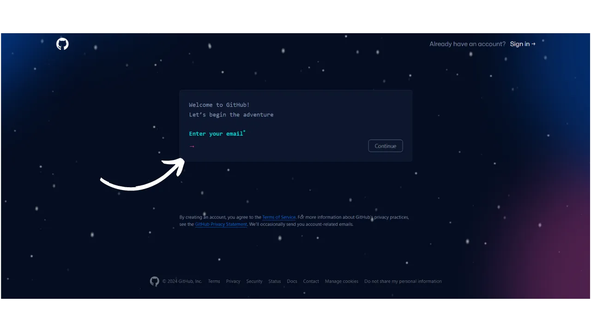
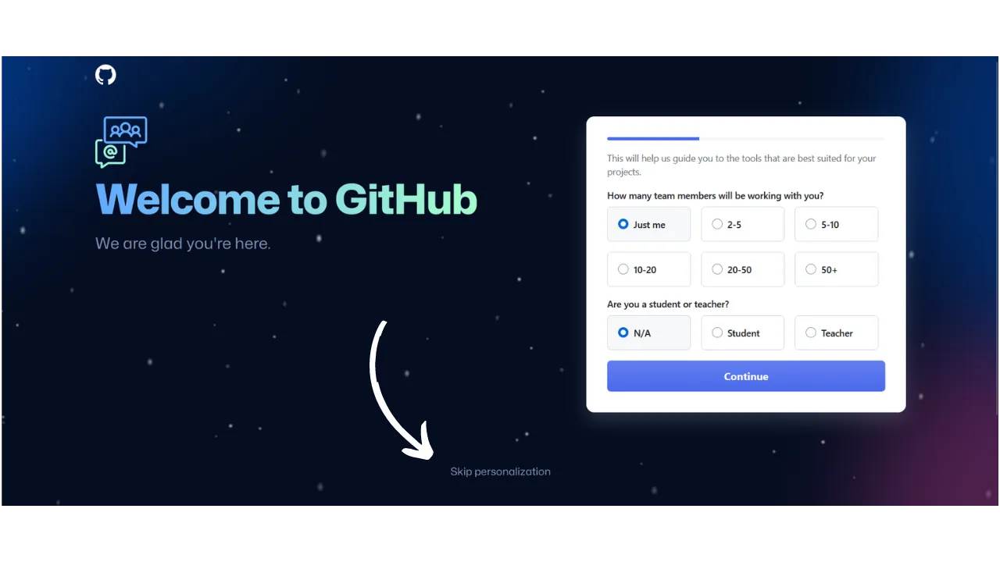
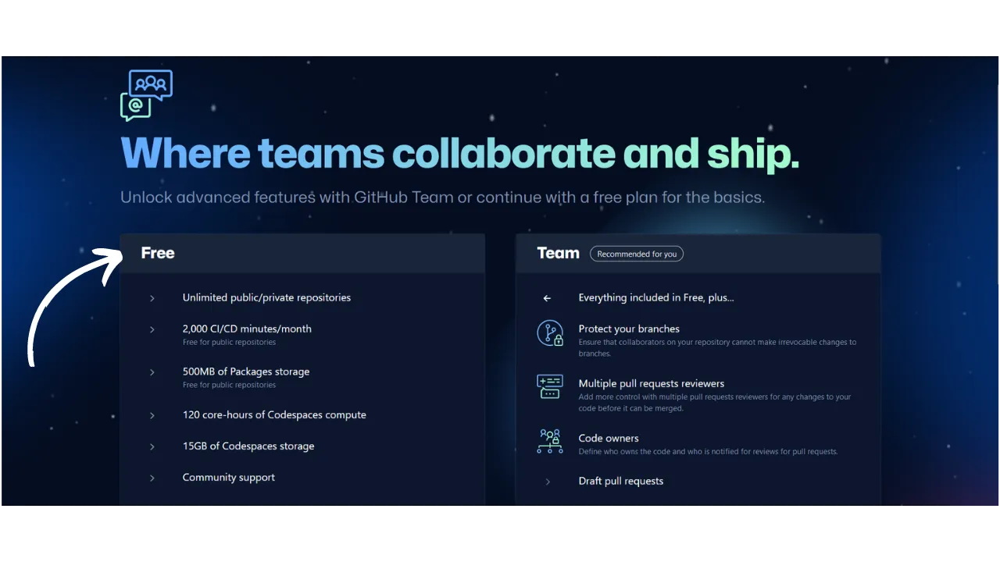
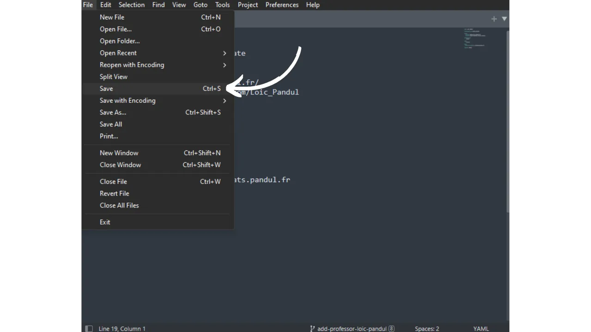
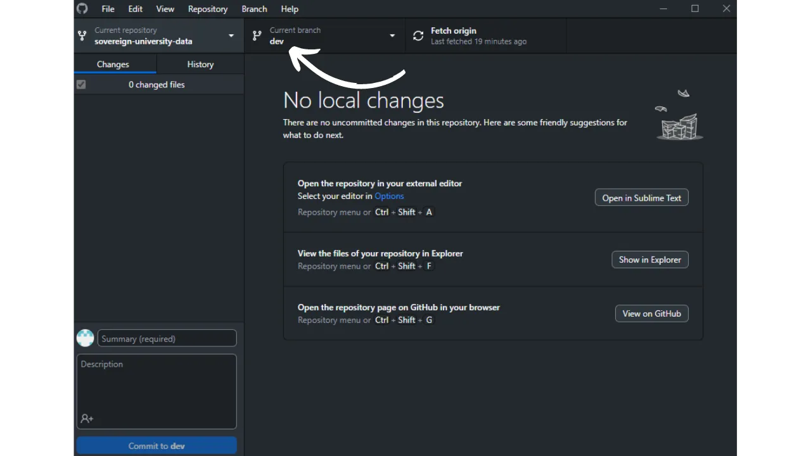
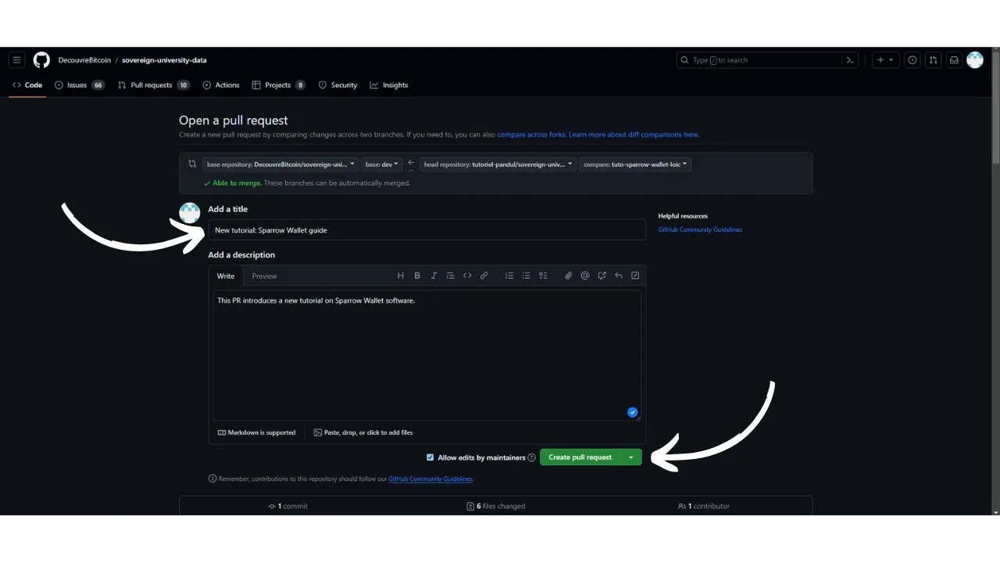

The mission of PlanB is to provide top-tier educational resources on Bitcoin, in as many languages as possible. All content published on the site is open-source and hosted on GitHub, thus offering anyone the opportunity to participate in enriching the platform. Contributions can take various forms: correcting and proofreading existing texts, translating into other languages, updating information, or creating new tutorials not yet available on our site.

If you wish to contribute to the PlanB Network, but you're not comfortable using GitHub, this tutorial is designed especially for you. We will detail how to contribute to PlanB Network via GitHub, while using Obsidian, a tool designed to facilitate writing.

You will see that setting up the entire work process is quite lengthy, especially if you've never used GitHub before. However, the use of Git makes collaboration on content writing easier, as it allows for precise tracking of changes, efficient version management, and also enables the review and improvement of content by other contributors. Moreover, once the work process is set up on your PC, you will find that Git greatly facilitates your work. You might even come out with the desire to use Git for your other personal projects because this software is so effective.

## Git Glossary
- **Fetch origin:** Command that retrieves recent information and changes from a remote repository without merging them with your local work.
- **Pull origin:** Command that fetches updates from a remote repository and immediately integrates them into your local branch to synchronize it.
- **Sync Fork:** Command on GitHub that updates your fork of a project with the latest changes from the source repository.
- **Push origin:** Command used to send your local modifications to a remote repository.
- **Pull Request:** A request sent by a contributor to indicate that they have pushed modifications on a branch in a remote repository and wish these modifications to be reviewed and potentially integrated (merged) into the main branch of the repository.
- **Commit:** Saving your modifications. A commit is like an instant snapshot of your work at a given moment, which helps to keep a history of changes.
- **Branch:** A parallel version of the repository, allowing you to work on modifications without affecting the main branch (called "`dev`" on the PlanB repository).
- **Merge:** Merging consists of integrating the modifications from one branch into another. It is used, for example, to add the modifications from a working branch onto the main branch.
- **Fork:** To fork a repository means to create a copy of that repository on your own GitHub account, allowing you to work on the project without affecting the original repository.
- **Clone:** Cloning a repository means making a local copy on your computer, giving you access to all the files and the modification history.

- **Repository:** A storage space for a project on GitHub. It contains all the project files as well as the history of all the modifications that have been made.

## What type of content to write on PlanB Network?
We are primarily looking for tutorials on tools related to Bitcoin or its ecosystem. These contents can be structured around six main categories:
- Wallet;
- Node;
- Mining;
- Merchant;
- Exchange;
- Privacy.

Beyond these topics specifically related to Bitcoin, PlanB is also looking for contributions on themes that highlight individual sovereignty, such as:
- Open source tools;
- Computing;
- Cryptography;
- Energy;
- Mathematics;
- Economics;
- DIY;
- LifeHacking...

For example, we currently have tutorials on Tails, Nostr, or GrapheneOS. These tools are not directly related to Bitcoin, but they are systems that can interest us in a sovereignty approach in the digital world, or in learning to achieve it. These contents can be integrated into a sub-category of the "Others" section.

You have the choice between designing a tutorial from scratch or republishing a tutorial previously published on your website (provided you own the copyright) to also share it on PlanB Network, adding a link to the original article.

Whatever your choice, keep in mind that all content published on PlanB Network is under the free license [CC-BY-SA](https://creativecommons.org/licenses/by-sa/4.0/). This license allows anyone to copy and, potentially, modify your content, provided that the original source is duly credited.

## Contribution Process
To add a tutorial to the PlanB Network site, you need to make a Pull Request on the GitHub repository currently named [sovereign-university-data](https://github.com/DecouvreBitcoin/sovereign-university-data). Your contribution must conform to the standard structure and include all necessary files. This is precisely what we will detail in the following parts.

Then, an administrator will review your tutorial. If adjustments are required, they will inform you so that the modifications can be made. Once approved, the tutorial will be integrated into the repository.

## Step 1: Creating a GitHub Account
If you haven't yet signed up for GitHub, you'll need to create an account. To do this, go to [https://github.com/signup](https://github.com/signup). Enter your email address, then choose a strong password. 
Next, choose your username. You have the option to reveal your true identity or to prefer the use of a pseudonym. Click on `Continue` and complete the Captcha. An email containing a confirmation code will be sent to you; you will need to enter it to finalize the creation of your account.

Fill in the questions if you want GitHub to guide you towards certain tools, or click on `skip personalization` to skip.

Choose the free plan by clicking on the `Continue for free` button.

You will then be redirected to your dashboard. If you wish, you can customize your account by clicking on your profile picture located at the top right of the screen, then accessing the `Settings` menu.

In this section, you have the option to add a new profile picture, select a name, customize your biography, or add a link to your personal website.

I also advise you to take a look at the `Password and authentication` menu, in order to set up two-factor authentication.

## Step 2: Install GitHub Desktop 
Go to https://desktop.github.com/ to download the GitHub Desktop software. This software allows you to interact easily with GitHub, without having to use a terminal.

Upon the first launch of the software, you will be asked to connect your GitHub account. To do this, click on `Sign in to GitHub.com`.

An authentication page will open in your browser. Enter your email address and password chosen in the previous step, then click on the `Sign in` button.

Click on `Authorize desktop` to confirm the connection between your account and the software.

You will automatically be redirected to the GitHub Desktop software. Click on `Finish`.

If you have just created your GitHub account, you will be redirected to a page indicating that you have not yet created any repositories. At this stage, set aside the GitHub Desktop software; we will return to it later.

## Step 3: Install Obsidian
Let's move on to installing the writing software. Here, you have several options. There is a multitude of software specialized in editing Markdown files, such as Typora, designed specifically for writing. Although it is not ideal, it is also possible to choose a code editor, like Visual Studio Code (VSC) or Sublime Text. However, as a writer, I prefer to use the Obsidian software. Let's see together how to install it and get started. 
Go to https://obsidian.md/download and download the software. Install it, choose your language, then click on `Quick Start`.

You will arrive at the Obsidian software. At the moment, you have no files open.

## Step 4: Fork the PlanB Network repository
Go to the PlanB Network data repository at the following address: [https://github.com/DecouvreBitcoin/sovereign-university-data](https://github.com/DecouvreBitcoin/sovereign-university-data). If you are not logged into your GitHub account, please log in again.

From this page, click on the `Fork` button at the top right of the window.

In the creation menu, you can leave the default settings. Make sure the `Copy the dev branch only` box is checked, then click on the `Create fork` button.

You will then arrive at your own fork of the PlanB Network repository. 

This fork thus constitutes a separate repository from the original, although it currently contains the same data. You will now work on this new repository.

## Step 5: Clone your repository 
Return to the GitHub Desktop software. By now, your fork should appear in the `Your repositories` section. If you do not see it immediately, use the double arrow button to refresh the list. When your fork appears, click on it to select it.

Then click on the blue button: `Clone [username]/sovereign-university-data`.

Afterward, you have the option to modify the local access path on your computer where the clone of your repository will be stored. You can keep the default path. To confirm, click on the blue `Clone` button.

Wait while GitHub Desktop clones your fork locally.

After cloning the repository, the software offers you two options. You must select the first one: `To contribute to the parent project`. This choice will allow you to present your future work as a contribution to the parent project (`DecouvreBitcoin/sovereign-university-data`), and not exclusively as a modification of your personal fork (`[username]/sovereign-university-data`). Once the option is selected, click on `Continue`.

Your GitHub Desktop is now correctly configured. Now, you can leave the software open in the background to follow the modifications that we will make.

## Step 6: Create a new Obsidian vault
Open the Obsidian software and click on the small vault icon at the bottom left of the window.

Click on the `Open` button to open an existing folder as a vault.

Your file explorer will open. You need to locate and select the folder titled `GitHub`, which should be in your `Documents` directory among your files. This path corresponds to the one you established during step 5. After choosing the folder, confirm its selection. The creation of your vault on Obsidian will then launch on a new page of the software.

-> **Attention**, it is important not to choose the `sovereign-university-data` folder when creating a new vault in Obsidian. Instead, select the parent folder, `GitHub`. If you select the `sovereign-university-data` folder, the configuration folder `.obsidian`, containing your local Obsidian settings, will automatically be integrated into the repository. We want to avoid this, as it is not necessary to transfer your Obsidian configurations to the PlanB Network repository. An alternative is to add the `.obsidian` folder to the `.gitignore` file, but this method would also result in a modification of the `.gitignore` file of the source repository, which is not desirable.

On the left side of the window, you can see the file tree with your different GitHub repositories that have been cloned locally. By clicking on the arrows next to the folder names, you can expand them to access the subfolders of the repositories and their documents.

Don't forget to set Obsidian to dark mode: "*Light attracts bugs*" ;)

## Step 7: Install a code editor
Most of your modifications will be on files in Markdown format (`.md`). To edit these documents, you can use Obsidian, the software we discussed earlier. However, PlanB Network uses other file formats, and you will need to modify some of them.
For example, when creating a new tutorial, you will need to create a YAML (`.yml`) file to include your tutorial's tags, its title, as well as your teacher identifier. Obsidian does not offer the possibility to modify this type of files, so you will need a code editor.
For this, several options are available to you. Although the standard notepad on your computer can be used to make these modifications, this solution is not ideal for neat work. I rather recommend choosing software specifically designed for this purpose, such as [VS Code](https://code.visualstudio.com/download) or [Sublime Text](https://www.sublimetext.com/download). Sublime Text, being particularly lightweight, will be more than sufficient for our needs.

Install one of these programs, and keep it aside for later.

## Step 8: Add a new teacher (optional)
If you have previously contributed to PlanB Network, you already have a contributor identifier. You can find it in your teacher folder accessible via [this page](https://github.com/DecouvreBitcoin/sovereign-university-data/tree/dev/professors). If this is the case, you can skip this step and go directly to step 9.

If you have not yet contributed to PlanB Network, you will need to create your profile so that your name appears on your future tutorials. To do this, we will start by creating a new branch dedicated to adding your teacher profile. A branch in Git is a parallel version of the project, which allows you to make changes without affecting the main branch, until the work is ready to be merged.

Before proceeding to create a new branch, it is important to ensure that you are working on the most recent version of the project to reduce the risk of conflicts when merging your changes. To do this, open your browser and head to the page of your fork of the PlanB repository. This is the fork you established on GitHub at step 4. The URL of your fork should look like:

`https://github.com/[username]/sovereign-university-data`

Make sure you are on the main branch `dev` then click on the `Sync fork` button. If your fork is not up to date, GitHub will offer to update your branch. Proceed with this synchronization. If, on the contrary, your branch is already up to date, GitHub will inform you.

Now that your fork on GitHub is synchronized with the source repository of PlanB Network, it's time to also refresh the local repository on your computer. Open the GitHub Desktop software and ensure that your fork is correctly selected in the upper left corner of the window.
Click on the `Fetch origin` button. If your local repository is already up to date, GitHub Desktop will not suggest any further action. Otherwise, the `Pull origin` option will appear. Click on this button to update your local repository.

After syncing your repository with the latest contributions, you are ready to create a new working branch. Still using GitHub Desktop, ensure that you are on the main branch `dev`.

Click on this branch, then click on the `New Branch` button.

Make sure the new branch is based on the source repository, namely `DecouvreBitcoin/sovereign-university-data`. Name your branch in a way that the title is clear about its purpose, using dashes to separate each word. Since this branch is intended for adding a professor profile, an example name could be: `add-professor-[your-name]`. After entering the name, click on `Create branch` to confirm its creation.

Now click on the `Publish branch` button to save your new working branch on your online fork on GitHub.

At this point, on GitHub Desktop, you should find yourself on your new branch. This means that all modifications made locally on your computer will be exclusively recorded on this specific branch. Also, as long as this branch remains selected on GitHub Desktop, the files visible locally on your machine correspond to those of this branch (`add-professor-your-name`), and not to those of the main branch (`dev`).

To add your professor profile, open your file explorer and head to your local repository, in the `professors` folder. You will find it under the path: `\GitHub\sovereign-university-data\professors`.

Within this folder, create a new folder named with your name or pseudonym. Make sure there are no spaces in the folder name. Thus, if your name is "Loic Pandul" and no other professor has this name, the folder to create will be named `loic-pandul`.

To make the task easier, you can already copy and paste all the documents from another professor into your own folder. We will then proceed to modify these documents to customize them according to your profile.
Begin by navigating to the `assets` folder. Delete the profile picture of the professor that you previously copied, and replace it with your own profile picture. It is imperative that this image is in `.webp` format and that it is named `profile`, thus giving the complete file name `profile.webp`. Be aware, this image will be published on the Internet and accessible to everyone.

Next, open the `professor.yml` file with your code editor (VSC or Sublime Text). You will arrive at the file copied from an existing professor.

You must then update the existing information with your own:
- **name:** enter your name or your pseudonym;
- **links:** indicate your accounts on social networks such as Twitter and Nostr, as well as the URL of your personal website (optional);
- **affiliation:** mention the name of the company that employs you (optional);
- **tags:** specify your areas of specialization from the following list, knowing that you can add your own themes. However, be sure to limit the number of tags to 4 at most to ensure a good UI:
	- privacy,
	- cryptography,
	- bitcoin,
	- mining,
	- lightning-network,
	- economy,
	- history,
	- merchants,
	- security,
	- ...
- **tips:** provide your Lightning address for donations to allow readers of your future tutorials to send you some sats (optional);
- **company:** if you own one, indicate the name of your company (optional).

You must also modify the `contributor-id`. This identifier is used to recognize you on the website, but is not made public outside of GitHub. You are free to choose any combination of two words, referring to the English list of 2048 words from BIP39, accessible here: [https://github.com/bitcoin/bips/blob/master/bip-0039/english.txt](https://github.com/bitcoin/bips/blob/master/bip-0039/english.txt). Do not forget to insert a dash between the two chosen words. For example, here, I chose `crazy-cactus`.

Once you have finished modifying the `professor.yml` document, click on `File > Save` to save your file. You can then exit your code editor.

It's time to proceed with writing your biography. Within your teacher file, you can delete documents written in languages that do not concern you, which were initially copied from another teacher. Keep exclusively the file corresponding to your native language. For example, in my case, I only kept the `fr.yml` file, given that my language is French.

Double-click on this file to open it with your code editor. In this file, you have the opportunity to write your complete biography under the `bio` section and a summary or a succinct title under `short_bio`.

After saving your `fr.yml` document, it is necessary to create a copy of this file for each of the following six languages:
- German (DE);
- English (EN);
- French (FR);
- Spanish (ES);
- Italian (IT);
- Portuguese (PT).

Proceed to copy-paste your original file, then translate each document into the corresponding language. If you are proficient in the language, you may perform the translation manually. Otherwise, feel free to use an automatic translation tool or a chatbot. If you prefer, it is also possible to only keep the biography in your native language; we will then handle the translation after the submission of your Pull Request.

Your teacher folder should thus look like this:

Now return to GitHub Desktop. On the left side of your window, you should observe all the modifications made to the documents, specific to your branch. Ensure that these modifications are indeed correct.

If the modifications seem correct to you, add a title for your commit. A commit is a save of the modifications made to the branch, accompanied by a descriptive message, allowing to follow the evolution of a project over time. Once the title is entered, press the blue `Commit to [your branch]` button to validate these modifications.

Then click on the `Push origin` button. This will send your commit to your fork.

If you have finished your modifications for this branch, click now on the `Preview Pull Request` button.

You can check one last time that your modifications are indeed correct, then click on the `Create pull request` button.

You will be automatically redirected to your browser on GitHub to the page for preparing your Pull Request. A Pull Request is a request made to integrate the modifications of your branch into the main branch of the PlanB Network repository, which allows for the review and discussion of changes before their merger.

On this preparation page, indicate a title that briefly summarizes the changes you wish to merge with the source repository. Add a brief comment describing these changes. After completing these steps, click on the green `Create pull request` button to confirm the merge request. 
Your PR will then be visible in the `Pull Request` tab of the main repository of PlanB Network. All you have to do is wait until an administrator contacts you to confirm the merger of your contribution or to request any additional modifications.

After merging your PR with the main branch, it is recommended to delete your working branch (`add-professor-your-name`) to maintain a clean history on your fork. GitHub will automatically offer you this option on your PR page:

On the GitHub Desktop software, you can switch back to the main branch of your fork (`dev`).

If you wish to make changes to your contribution after you have already submitted your PR, the procedure to follow depends on the current state of your PR:
- If your PR is still open and has not yet been merged, make the changes locally while staying on the same branch. Once the modifications are finalized, use the `Push origin` button to add a new commit to your still open PR;
- In the event that your PR has already been merged with the main branch, you will need to start the process from the beginning by creating a new branch, then submitting a new PR. Ensure that your local repository is synchronized with the source repository of PlanB Network before proceeding.

## Step 9: Adding a New Tutorial
Congratulations, you have completed all the preparation steps! You are now ready to contribute to PlanB Network. From now on, for each new article you wish to publish, you will need to create a new branch from `dev`. A branch in Git is a parallel version of the project, which allows you to make changes without affecting the main branch, until the work is ready to be merged.

Before proceeding to create a new branch, it is important to ensure that you are working on the most recent version of the project to reduce the risk of conflicts when merging your modifications. To do this, open your browser and head to the page of your fork of the PlanB repository. This is the fork you established on GitHub at step 4. The URL of your fork should look like: `https://github.com/[your-username]/sovereign-university-data`.

Ensure you are on the main branch `dev` then click on the `Sync fork` button. If your fork is not up to date, GitHub will offer to update your branch. Proceed with this update. If, on the contrary, your branch is already up to date, GitHub will inform you. 
Now that your fork on GitHub is synchronized with the source repository of PlanB Network, it's time to also refresh the local repository on your computer. Open the GitHub Desktop software and ensure your fork is correctly selected in the upper left corner of the window.

Click on the `Fetch origin` button. If your local repository is already up to date, GitHub Desktop will not suggest any further action. Otherwise, the `Pull origin` option will appear. Click on this button to update your local repository.

After syncing your repository with the latest contributions, you are ready to create a new working branch. Still from GitHub Desktop, verify that you are indeed on the main branch `dev`.

Click on this branch, then click on the `New Branch` button.

Ensure the new branch is based on the source repository, namely `DecouvreBitcoin/sovereign-university-data`. Name your branch in a way that the title is clear about its purpose, using dashes to separate each word. For example, let's say our goal is to write a tutorial on using the Sparrow Wallet software. In this case, the working branch dedicated to writing this tutorial could be named: `tuto-sparrow-wallet-loic`. Once the appropriate name is entered, you will just need to click on `Create branch` to confirm the creation of the branch.

Now click on the `Publish branch` button to save your new working branch on your online fork on GitHub.

At this point, on GitHub Desktop, you should find yourself on your new branch. This means that all modifications made locally on your computer will be exclusively recorded on this specific branch. Also, as long as this branch remains selected on GitHub Desktop, the files visible locally on your machine correspond to those of this branch (`tuto-sparrow-wallet-loic`), and not to those of the main branch (`dev`).

Now that the working branch has been created, it's time to integrate your new tutorial. To do this, open your file manager and navigate to the `sovereign-university-data` folder, which represents the local clone of your repository. You should normally find it under `Documents\GitHub\sovereign-university-data`. Within this directory, it will be necessary to locate the appropriate sub-folder for placing your tutorial. The organization of the folders reflects the different sections of the PlanB Network website. In our example, since we want to add a tutorial on Sparrow Wallet, it is appropriate to go to the following path: `sovereign-university-data\tutorials\wallet` which corresponds to the `WALLET` section on the website.

Within the `wallet` folder, you need to create a new directory specifically dedicated to your tutorial. The name of this folder should evoke the software covered in the tutorial, making sure to connect words with dashes. For my example, the folder will be titled `sparrow-wallet`.

In this new folder dedicated to your tutorial, it is appropriate to prepare various elements:
- Create an `assets` folder, intended to receive all the illustrations necessary for your tutorial;
	- Within this `assets` folder, you need to create 6 sub-folders named `fr`, `de`, `en`, `it`, `es`, and `pt`, in order to classify the visuals according to the corresponding languages.
- A `tutorial.yml` file must be created to record the details related to your tutorial;
- A markdown format file is to be created to write the actual content of your tutorial. This file must be titled according to the language code of the writing. For example, for a tutorial written in French, the file must be called `fr.md`.

The organization of your folder should look like this:

To begin, open your `tutorial.yml` file using your code editor. Fill it with the information specified below:
- **builder**: Enter the title of your tutorial, which must be both precise and evocative of the content you will present;
- **tags**: Determine a series of keywords closely related to the subject of your article, to facilitate its search and indexing;
- **category**: Select an appropriate sub-category among those available on the PlanB site, based on the content of your tutorial. For example, for a tutorial related to the `WALLET` section, the available options are `Desktop`, `Hardware`, and `Mobile`;
- **level**: Indicate the difficulty level of your tutorial by opting for one of the following four categories:
	- Beginner (`beginner`),
	- Intermediate (`intermediary`),
	- Advanced (`advanced`),
- Expert (`expert`).- **professor**: Enter your contributor ID as it appears on your professor profile. For more details, refer to step 8 of this article;
- **link** (optional): If you wish to credit a source website for the tutorial you are developing, such as your own personal site, this is where you can add the relevant link.

Once you have finished modifying your `tutorial.yml` file, save your document by clicking on `File > Save`. You can now close your code editor.

Within the `assets` folder, you need to add a file named `logo.webp`, which will serve as a thumbnail for your article. This image, which must be in `.webp` format, should have a square dimension to align with the user interface. You are free to choose the logo of the software covered in the tutorial or any other relevant image, provided it is free of rights.

In addition, also add an image titled `cover.webp` in the same location. This image will be displayed at the top of your tutorial. Ensure that this image, like the logo, respects usage rights and is suitable for the context of your tutorial.

The language subfolders located in the `assets` folder are used to organize the diagrams and visuals that will accompany your tutorial. If your images contain text, consider translating them for each concerned language, to make your content accessible to an international audience.

**-> Tip:** When sharing files publicly, such as images, it is important to remove superfluous metadata. These can contain sensitive information, like location data, creation dates, or details about the author. To protect your privacy, it is advisable to delete this metadata. To simplify this operation, you can use specialized tools like [Exif Cleaner](https://exifcleaner.com/), which allows for the cleaning of a document's metadata through a simple drag-and-drop.

Now, you can open your file that will host your tutorial, named with the code of your language, such as `en.md`. Go to Obsidian, on the left side of the window, scroll through the folder tree until you reach the folder of your tutorial and the file you are looking for.

Click on the file to open it.

We will start by filling out the `Properties` section at the top of the document. In the event that this section is missing from your file (if the document is completely blank), you can reproduce it by copying it from another existing tutorial.

You can also add it manually in this way using your code editor:

Fill in the name of your tutorial as well as a short description of it.

Then add your cover image at the beginning of your tutorial. To do this, type:

``

This syntax will be useful whenever adding an image to your tutorial is necessary. The exclamation point indicates that it is an image, with the alternative text (alt) specified between the brackets. The path to the image is indicated between the parentheses.

Continue writing your tutorial by writing your content. When you want to integrate a subtitle, apply the appropriate markdown formatting by prefixing the text with `##`.

When adding visual elements to your tutorial, be sure to select the path corresponding to the language of your content. For example:

``

If your visual contains text, such as a diagram, it is advisable to translate it into the six proposed languages (German, English, French, Italian, Spanish, and Portuguese) and place each translated version in its dedicated linguistic sub-folder within the `assets` folder.

Images must be numbered sequentially according to their order of appearance in the tutorial. Thus, the first visual will be named `1.webp`, the second `2.webp`, and so on. You can use different image formats such as `jpeg`, `png`, or `webp`.

Once you have finished writing your tutorial in the language of your choice, the next step is to submit a Pull Request. The administrator will then add the five missing translations of your tutorial, thanks to our automated translation method. To proceed with the Pull Request, open the GitHub Desktop software. It should automatically detect the changes you have made locally compared to the original repository. Before continuing, carefully check on the left side of the interface that these changes correspond exactly to what you expected.

If the changes seem correct to you, add a title for your commit. A commit is a save of the changes made to the branch, accompanied by a descriptive message, allowing to follow the evolution of a project over time. Once the title is entered, press the blue `Commit to [your branch]` button to validate these changes.

Then click on the `Push origin` button. This will send your commit to your fork.

If you have finished your edits for this branch, click now on the `Preview Pull Request` button.

You can check one last time that your modifications are correct, then click on the `Create pull request` button.

You will be automatically redirected to your browser on GitHub to the preparation page of your Pull Request. A Pull Request is a request made to integrate the changes from your branch to the main branch of the PlanB Network repository, which allows for the review and discussion of the changes before their merge.

On this preparation page, indicate a title that briefly summarizes the modifications you wish to merge with the source repository. Add a brief comment describing these changes. After completing these steps, click on the green `Create pull request` button to confirm the merge request.

Your PR will then be visible in the `Pull Request` tab of the main repository of PlanB Network. All you have to do now is wait until an administrator contacts you to confirm the merge of your contribution or to request any additional modifications.

After the merge of your PR with the main branch, it is recommended to delete your working branch (`tuto-sparrow-wallet`) to maintain a clean history on your fork. GitHub will automatically offer you this option on the page of your PR:

On the GitHub Desktop software, you can switch back to the main branch of your fork (`dev`).

If you wish to make modifications to your contribution after having already submitted your PR, the procedure to follow depends on the current state of your PR:
- If your PR is still open and has not yet been merged, perform the modifications locally while staying on the same branch. Once the modifications are finalized, use the `Push origin` button to add a new commit to your still open PR;
- In the case where your PR has already been merged with the main branch, you will need to start the process from the beginning by creating a new branch, then submitting a new PR. Ensure that your local repository is synchronized with the source repository of PlanB Network before proceeding.
