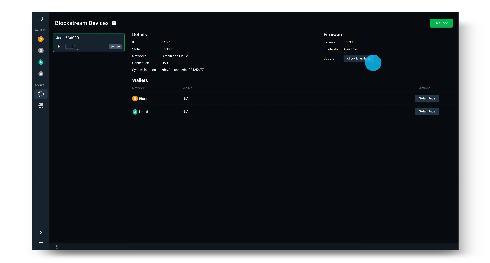
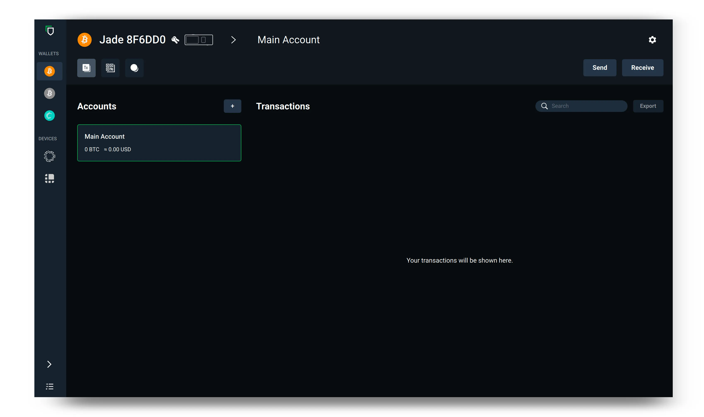
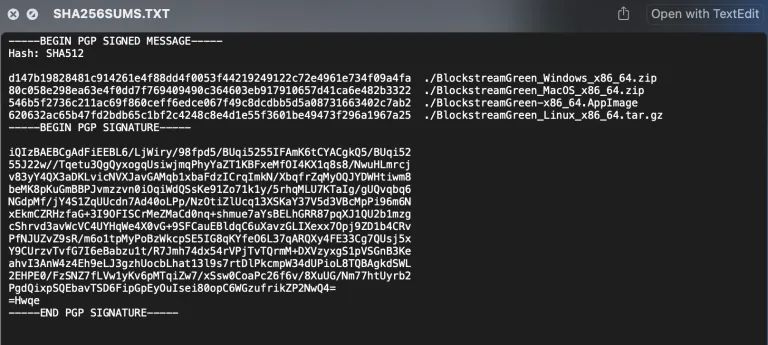
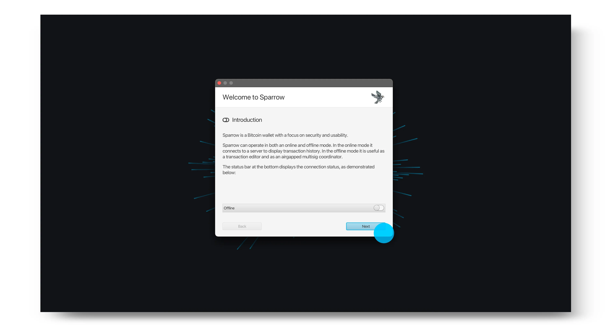

## Tutorial video


Blockstream Jade - Mobile Bitcoin Hardware Wallet FULL TUTORIAL by BTCsession

## Full writing guide


### Pre-requisites

1. Download the latest version of Blockstream Green.

2. Install this driver to make sure Jade is recognized by your computer.

### Desktop Setup


pen Blockstream Green, then click the Blockstream logo under Devices.


Plug in Jade to your desktop using the supplied USB cable.

> Note: If Jade is not recognized by your computer, make sure to download the driver found in the guide here.

Once your Jade appears in Green, update Jade by clicking Check for updates and select the latest firmware version. Use the scroll wheel or toggle on Jade to confirm and continue with the update. Make sure your Jade still shows the "Initialize" button, otherwise you will have to wait until after setting Jade up to upgrade it. Use the back button to get to this screen if necessary.



After you have updated Jade's firmware, select Setup Jade on the network and security policy you would like to use.

> Tip: The security policy is listed under Type on the login screen shown below. If you are not sure whether to select Singlesig or Multisig Shield, please review our guide here. (https://help.blockstream.com/hc/en-us/articles/4403642609433)


Next, select to create a New wallet and choose 12 words to generate your recovery phrase. Clicking Advanced will provide you with the option of a 12 and 24 word recovery phrase.


Record the recovery phrase offline on paper (or by using a dedicated recovery phrase backup device for extra security). Then, use the wheel or toggle on the top of your Jade to verify your recovery phrase. This step ensures you have it written down correctly.


Set and confirm your six-digit PIN. This is used to unlock Blockstream Jade each time you login to your wallet.


Now, simply select Go to Wallet on the Green desktop app and you will see your wallet open on Blockstream Green. Blockstream Jade will also show that it is Ready! You can now use your Jade to send and receive Bitcoin transactions.



After you have finished using your wallet, disconnect your Blockstream Jade from your device. Next time you want to use the wallet on Blockstream Jade, simply reconnect your device and follow the prompts.

source: https://help.blockstream.com/hc/en-us/articles/17478506300825

### Appendix A - Verifying the Green Wallet download file

Verifying the download means to check that the file you downloaded has not been modified since being released by the developer.

We do this by checking that the signature (produced by the developers private key) together with the file downloaded and the developers public key return a TRUE result when passing through the gpg –verify function. I’ll show you how to do that next. If you want to learn the background to this, I have this guide and this one.

First, we get the signing key:

For Linux, open the terminal, and run this command (you should just copy and paste the text, and include the quotation marks):

```bash
gpg --keyserver keyserver.ubuntu.com --recv-keys "04BE BF2E 35A2 AF2F FDF1 FA5D E7F0 54AA 2E76 E792"
```

For Mac, you do the same thing, except you’ll need to download and install GPG Suite first.

For Windows, you do the same thing, except you’ll need to download and install GPG4Win first.

You’ll get an ouput saying the public key has been imported.


This image has an empty alt attribute; its file name is image-3-1024x162.webp

Next, we need to get the file containing the hash of the software. It’s stored on Blockstream’s GitHub page. First go to their info page here, and click on the link for “desktop”. It will take to to the latest release page on GitHub and there you’ll see a link to the SHA256SUMS.asc file, which is a text document containing Blockstream’s published hash of the program we downloaded.


GitHub:


It’s not necessary, but after saving to disk, I renamed “SHA256SUMS.asc” to “SHA256.txt” to more easily open the file on the Mac using the text editor. This was the content of the file:



The text we are after is at the top. Depending on which file we downloaded, there is a corresponding hash output which we’ll be comparing against later.

The bottom part of the document contains the signature made on the message above – it’s a two in one file.

The order doesn’t matter, but before checking the hash, we’re going to check that the hash message is genuine (ie hasn’t been tampered with).

Open terminal. You need to be in the correct directory where the SHA256SUMS.asc file was downloaded. Assuming you downloaded it to the “Downloads” directory, for Linux and Mac, change to the directory like this (case sensitive):

```bash
cd Downloads
```

Of course, you have to hit <enter> after these commends. For Windows, open CMD (command prompt), and type the same thing (although it’s not case sensitive).

For Windows and Mac, you needed to have already downloaded GPG4Win and GPG Suite, respectively, as instructed earlier. For Linux, gpg comes with the Operating System. From Terminal (or CMD for Windows), type this command:

```bash
gpg --verify SHA256SUMS.asc
```

The exact spelling of the file name (in red) may be different on the day you fetch the file, so make sure the command matches with the filename as downloaded. You should get this output, and ignore the warning about the trusted signature – that just means you haven’t manually told the computer you trust the public key we imported earlier.


This image has an empty alt attribute; its file name is image-4-1024x165.webp

This ouput confirms the signature is good, and we are confident the private key of “info@greenaddress.it” signed the data (the hash report).

Now we should hash our downloaded zip file and compare the output as published. Note that in the SHA256SUMS.asc file, there is a bit of text that says “Hash: SHA512” which confuses me, as the file clearly has SHA256 outputs within, so I’m going to ignore that.

For Mac and Linux, open terminal, navigate to where the zip file was downloaded (probably you’ll need to type “cd Downloads” again, unless you haven’t closed the terminal since). By the way you can always check what directory you are in by typing PWD (“print working directory), and if this is all foreign, it’s useful to watch a quick YouTube video by searching “how to navigate the Linux/Mac/Windows file system”.

To has the file, type this:

```bash
shasum -a 256 BlockstreamGreen_MacOS_x86_64.zip
```

You should check what your file is called exactly, and modify the text in blue above if needed.

You’ll get an output like this (yours will differ if the file is different to mine):


Next, visually compare the hash output with what is in the SHA256SUMS.asc file. If they match, then –> SUCCESS! Congratulations.

source: https://armantheparman.com/jade/

### Using it on Sparrow

If you already know how to use SParrow then it's as always:

> Note: it's the same process with Specter for exemple

Download Sparrow using the link provided here.


Click Next to follow the setup guide to learn about the different connection options.



Choose your desired server then select Create New Wallet.


Enter a name for your wallet and click Create Wallet.


Choose your desired policy and script types then select Connected Hardware Wallet.

> Note: If you have previously used Blockstream Jade as a Singlesig wallet with Blockstream Green and would like to view your transactions in Sparrow, make sure the script type matches the account type that contains your funds in Green. You will also need the derivation path to match as well.


Plug in your Blockstream Jade and click Scan. You will then be prompted to enter your PIN on Jade.

> Tip: Before connecting your Jade, make sure the Blockstream Green app is not open. If Green is open, this may cause issues with your Jade being detected within Sparrow.


Select Import Keystore to import the public key of the default account, or select the arrow to manually select the derivation path you would like to use.


After your desired key has been imported, click Apply.


You have now successfully set up your wallet and you can begin receiving, storing and spending your bitcoin using Sparrow and Blockstream Jade.

> Note: If you were previously using Jade with Blockstream Green as a Multisig Shield wallet, you should not expect your new Sparrow wallet to show the same balance - these are different wallets. To access your Multisig Shield wallet again, simply connect your Jade back to Blockstream Green.


source: https://help.blockstream.com/hc/en-us/articles/7559912660761-How-do-I-use-Blockstream-Jade-with-Sparrow-

### green app

if you're more a mobile guide, you can use it with blockstream green

- How to set up Blockstream Jade with Green | Blockstream Jade - https://youtu.be/7aacxnc6DHg

- How to receive bitcoin to a Jade wallet | Blockstream Jade - https://youtu.be/CVtcDdiPqLA
