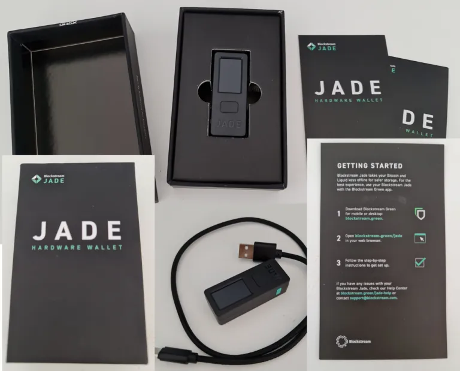
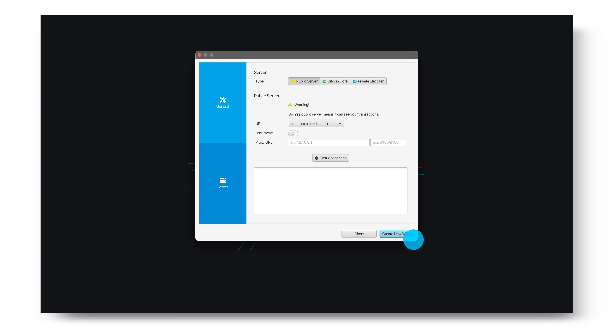
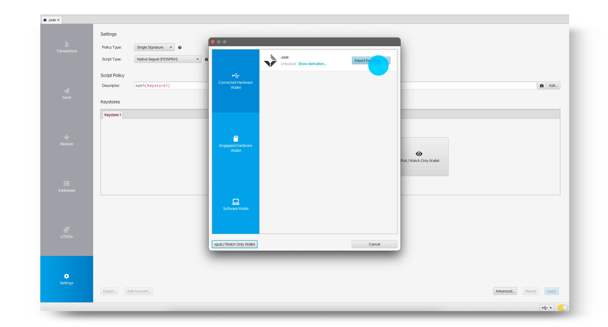

## Vídeo tutorial


Blockstream Jade - Mobile Bitcoin Hardware Wallet TUTORIAL COMPLETO por BTCsession

## Guia completo de escrita



### Pré-requisitos

1. Baixe a versão mais recente do Blockstream Green.

2. Instale este driver para garantir que o Jade seja reconhecido pelo seu computador.

### Configuração no desktop


Abra o Blockstream Green e clique no logotipo do Blockstream em Dispositivos.


Conecte o Jade ao seu desktop usando o cabo USB fornecido.

> Observação: Se o Jade não for reconhecido pelo seu computador, certifique-se de baixar o driver encontrado no guia aqui.

Assim que o Jade aparecer no Green, atualize o Jade clicando em Verificar atualizações e selecione a versão mais recente do firmware. Use a roda de rolagem ou o botão de alternância no Jade para confirmar e continuar com a atualização. Verifique se o Jade ainda mostra o botão "Inicializar", caso contrário, você terá que esperar até depois de configurar o Jade para atualizá-lo. Use o botão voltar para voltar a esta tela, se necessário.


Depois de atualizar o firmware do Jade, selecione Configurar Jade na política de rede e segurança que você deseja usar.

> Dica: A política de segurança é listada em Tipo na tela de login mostrada abaixo. Se você não tem certeza se deve selecionar Singlesig ou Multisig Shield, consulte nosso guia aqui. (https://help.blockstream.com/hc/en-us/articles/4403642609433)


Em seguida, selecione criar uma nova carteira e escolha 12 palavras para gerar sua frase de recuperação. Clicar em Avançado fornecerá a opção de uma frase de recuperação de 12 e 24 palavras.


Registre a frase de recuperação offline em papel (ou usando um dispositivo de backup de frase de recuperação dedicado para segurança extra). Em seguida, use a roda de rolagem ou o botão de alternância no topo do seu Jade para verificar sua frase de recuperação. Esta etapa garante que você a tenha anotado corretamente.


Defina e confirme seu PIN de seis dígitos. Isso é usado para desbloquear o Blockstream Jade cada vez que você fizer login na sua carteira.


Agora, basta selecionar Ir para a carteira no aplicativo desktop Green e você verá sua carteira aberta no Blockstream Green. O Blockstream Jade também mostrará que está Pronto! Agora você pode usar seu Jade para enviar e receber transações de Bitcoin.


Depois de terminar de usar sua carteira, desconecte o Blockstream Jade do seu dispositivo. Da próxima vez que você quiser usar a carteira no Blockstream Jade, basta reconectar seu dispositivo e seguir as instruções.

fonte: https://help.blockstream.com/hc/en-us/articles/17478506300825

### Apêndice A - Verificando o arquivo de download do Green Wallet

Verificar o download significa verificar se o arquivo que você baixou não foi modificado desde o lançamento pelo desenvolvedor.
Fazemos isso verificando se a assinatura (produzida pela chave privada do desenvolvedor) juntamente com o arquivo baixado e a chave pública do desenvolvedor retornam um resultado VERDADEIRO ao passar pela função gpg –verify. Vou te mostrar como fazer isso a seguir. Se você quiser aprender o contexto disso, tenho este guia e este outro.
Primeiro, obtemos a chave de assinatura:

Para Linux, abra o terminal e execute este comando (você deve apenas copiar e colar o texto e incluir as aspas):

```bash
gpg --keyserver keyserver.ubuntu.com --recv-keys "04BE BF2E 35A2 AF2F FDF1 FA5D E7F0 54AA 2E76 E792"
```

Para Mac, você faz a mesma coisa, exceto que precisará baixar e instalar o GPG Suite primeiro.

Para Windows, você faz a mesma coisa, exceto que precisará baixar e instalar o GPG4Win primeiro.

Você receberá uma saída informando que a chave pública foi importada.


Esta imagem possui um atributo alt vazio; seu nome de arquivo é image-3-1024x162.webp

Em seguida, precisamos obter o arquivo contendo o hash do software. Ele está armazenado na página do GitHub da Blockstream. Primeiro, vá para a página de informações deles aqui e clique no link para "desktop". Isso o levará para a página de lançamento mais recente no GitHub e lá você verá um link para o arquivo SHA256SUMS.asc, que é um documento de texto contendo o hash publicado pela Blockstream do programa que baixamos.


GitHub:


Não é necessário, mas depois de salvar no disco, renomeei "SHA256SUMS.asc" para "SHA256.txt" para abrir mais facilmente o arquivo no Mac usando o editor de texto. Este era o conteúdo do arquivo:


O texto que estamos procurando está no topo. Dependendo do arquivo que baixamos, há uma saída de hash correspondente que iremos comparar posteriormente.

A parte inferior do documento contém a assinatura feita na mensagem acima - é um arquivo dois em um.

A ordem não importa, mas antes de verificar o hash, vamos verificar se a mensagem de hash é genuína (ou seja, não foi adulterada).

Abra o terminal. Você precisa estar no diretório correto onde o arquivo SHA256SUMS.asc foi baixado. Supondo que você o baixou para o diretório "Downloads", para Linux e Mac, mude para o diretório assim (diferencia maiúsculas de minúsculas):

```bash
cd Downloads
```

É claro, você precisa pressionar <enter> após esses comandos. Para Windows, abra o CMD (prompt de comando) e digite a mesma coisa (embora não seja sensível a maiúsculas e minúsculas).

Para Windows e Mac, você precisava ter baixado o GPG4Win e o GPG Suite, respectivamente, conforme instruído anteriormente. No Terminal (ou CMD para Windows), digite este comando:

```bash
gpg --verify SHA256SUMS.asc
```

A grafia exata do nome do arquivo (em vermelho) pode ser diferente no dia em que você buscar o arquivo, portanto, verifique se o comando corresponde ao nome do arquivo baixado. Você deve obter esta saída e ignorar o aviso sobre a assinatura confiável - isso apenas significa que você não informou manualmente ao computador que confia na chave pública que importamos anteriormente.


Esta imagem possui um atributo alt vazio; seu nome de arquivo é image-4-1024x165.webp
Este resultado confirma que a assinatura é válida e temos confiança de que a chave privada de "info@greenaddress.it" assinou os dados (o relatório de hash).

Agora devemos fazer o hash do nosso arquivo zip baixado e comparar o resultado com o publicado. Note que no arquivo SHA256SUMS.asc, há um trecho de texto que diz "Hash: SHA512", o que me confunde, já que o arquivo claramente possui saídas SHA256, então vou ignorar isso.

Para Mac e Linux, abra o terminal, navegue até onde o arquivo zip foi baixado (provavelmente você precisará digitar "cd Downloads" novamente, a menos que você não tenha fechado o terminal desde então). A propósito, você sempre pode verificar em qual diretório está digitando PWD ("print working directory"), e se isso for tudo estranho, é útil assistir a um vídeo rápido no YouTube pesquisando "como navegar no sistema de arquivos do Linux/Mac/Windows".

Para fazer o hash do arquivo, digite isso:

```bash
shasum -a 256 BlockstreamGreen_MacOS_x86_64.zip
```

Você deve verificar como seu arquivo é chamado exatamente e modificar o texto em azul acima, se necessário.

Você obterá uma saída como esta (a sua será diferente se o arquivo for diferente do meu):


Em seguida, compare visualmente a saída do hash com o que está no arquivo SHA256SUMS.asc. Se eles coincidirem, então -> SUCESSO! Parabéns.

fonte: https://armantheparman.com/jade/

### Usando no Sparrow

Se você já sabe como usar o Sparrow, então é como sempre:

> Nota: é o mesmo processo com o Specter, por exemplo.

Baixe o Sparrow usando o link fornecido aqui.


Clique em Avançar para seguir o guia de configuração e aprender sobre as diferentes opções de conexão.


Escolha o servidor desejado e selecione Criar Nova Carteira.



Digite um nome para sua carteira e clique em Criar Carteira.


Escolha as políticas e tipos de script desejados e selecione Conectar Carteira de Hardware.

> Nota: Se você já usou o Blockstream Jade como uma carteira Singlesig com o Blockstream Green e deseja visualizar suas transações no Sparrow, certifique-se de que o tipo de script corresponda ao tipo de conta que contém seus fundos no Green. Você também precisará que o caminho de derivação corresponda também.


Conecte o seu Blockstream Jade e clique em Escanear. Em seguida, você será solicitado a inserir seu PIN no Jade.

> Dica: Antes de conectar o Jade, certifique-se de que o aplicativo Blockstream Green não esteja aberto. Se o Green estiver aberto, isso pode causar problemas com a detecção do Jade dentro do Sparrow.


Selecione Importar Keystore para importar a chave pública da conta padrão ou selecione a seta para selecionar manualmente o caminho de derivação que você deseja usar.



Após a importação da chave desejada, clique em Aplicar.


Agora você configurou sua carteira com sucesso e pode começar a receber, armazenar e gastar seus bitcoins usando o Sparrow e o Blockstream Jade.

> Nota: Se você estava usando anteriormente o Jade com o Blockstream Green como uma carteira Multisig Shield, não espere que sua nova carteira Sparrow mostre o mesmo saldo - essas são carteiras diferentes. Para acessar sua carteira Multisig Shield novamente, basta reconectar o Jade ao Blockstream Green.


source: https://help.blockstream.com/hc/en-us/articles/7559912660761-How-do-I-use-Blockstream-Jade-with-Sparrow-

### aplicativo green

se você prefere um guia móvel, você pode usá-lo com o blockstream green

- Como configurar o Blockstream Jade com o Green | Blockstream Jade - https://youtu.be/7aacxnc6DHg

- Como receber bitcoin em uma carteira Jade | Blockstream Jade - https://youtu.be/CVtcDdiPqLA
