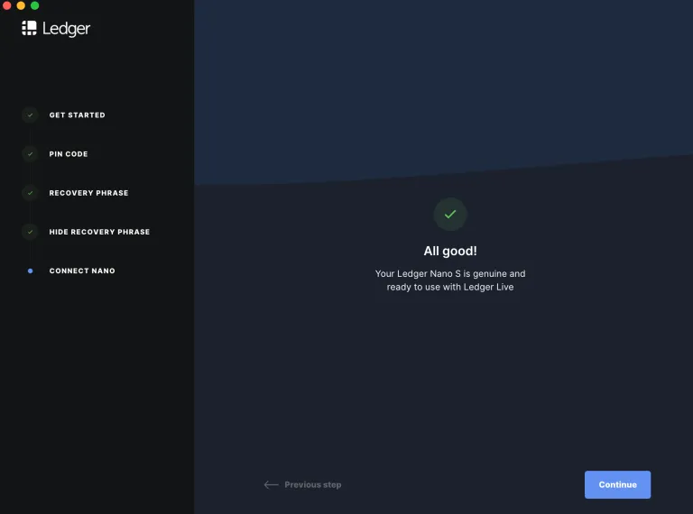
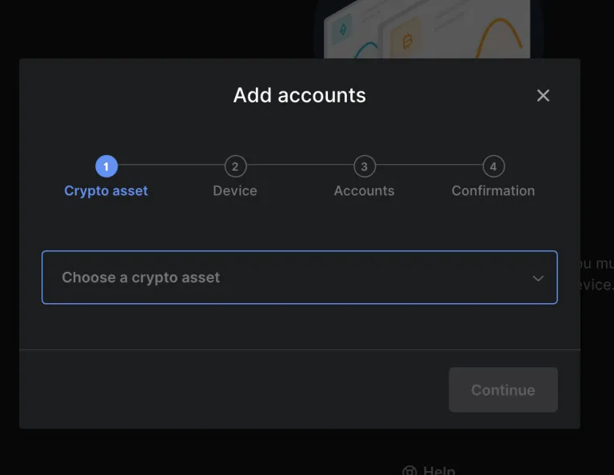
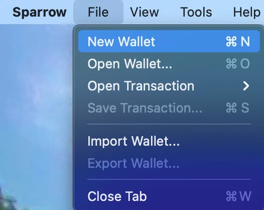
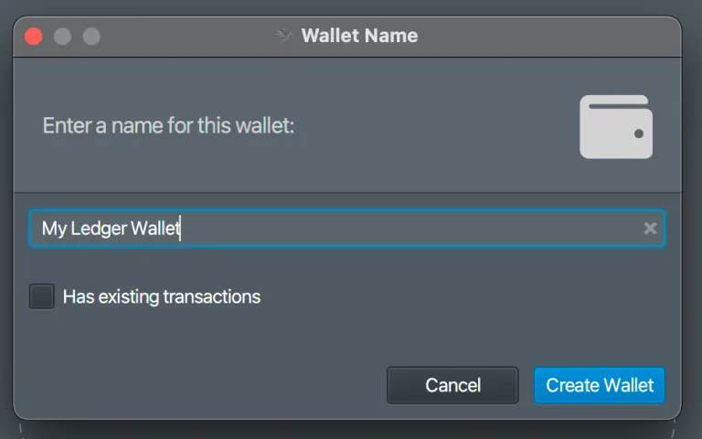
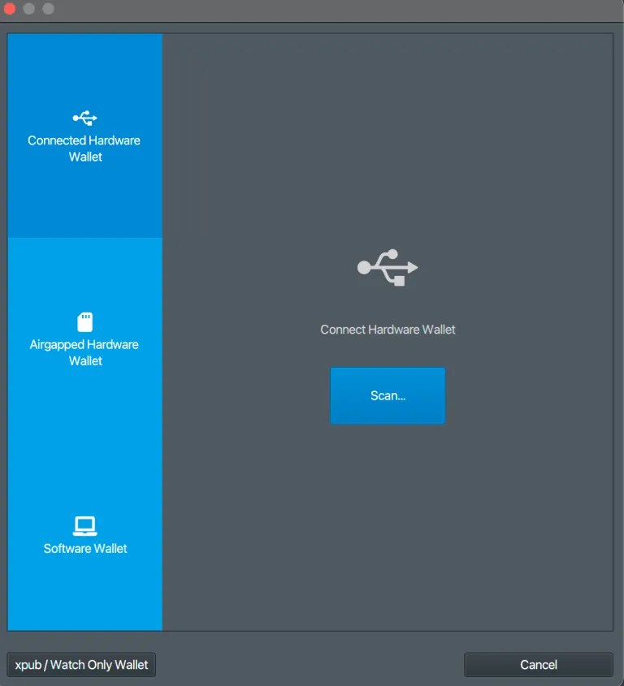
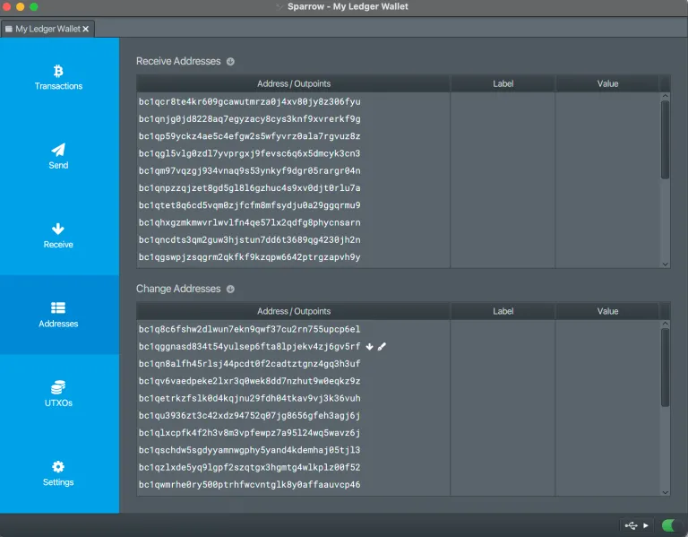

Kalter physischer Geldbeutel – 60 € – Anfänger – Zum Sichern von 2.000 € bis 50.000 €

Ledger ist die französische Lösung zur sicheren Aufbewahrung von Bitcoins auf einfache Weise.

In diesem Tutorial behandeln wir auch den Abschnitt über Passphrasen, eine fortschrittliche Sicherheitslösung zur Aufbewahrung großer Summen: 20.000 € - 100.000 €.

https://www.youtube.com/watch?v=_vsHNTLi8MQ

# Verbindung des Ledger mit der Sparrow Bitcoin Wallet (Anleitung)

Stellen Sie sicher, dass Sie zuerst den anderen Teil "Verwendung von Bitcoin-Hardware-Wallets" durchgehen. Ich werde einige Schritte überfliegen und mich hauptsächlich auf das konzentrieren, was spezifisch für Ledger ist.

## Einrichten des Geräts

Der Ledger wird mit seinem eigenen USB-Kabel geliefert. Stellen Sie sicher, dass Sie dieses verwenden und nicht einfach irgendein altes Kabel. Einige USB-Kabel übertragen nur Strom. Dieses überträgt Daten UND Strom. Als ich das Gerät mit einem herumliegenden USB-Ladekabel für Telefone verwendet habe, konnte das Gerät keine Verbindung herstellen.

Schließen Sie es an Ihren Computer an und das Gerät wird eingeschaltet.


Durchlaufen Sie die Optionen. Sie werden sehen:

1. Als neues Gerät einrichten
2. Aus Wiederherstellungssatz wiederherstellen

Im Grunde genommen wird gefragt, ob Sie möchten, dass das Gerät einen Seed für Sie erstellt oder ob Sie bereits einen haben, den Sie verwenden möchten. Es ist bewährte Praxis, Ihren eigenen Seed zu erstellen, aber dies ist sehr fortgeschritten und fällt nicht in den Rahmen dieses Artikels. Wählen Sie "Als neues Gerät einrichten".

Sie werden dann aufgefordert, eine PIN auszuwählen. Diese gehört nicht zu Ihrem Bitcoin Seed und ist nur für dieses Gerät bestimmt. Sie sperrt das Gerät.

Es werden Ihnen dann 24 Wörter präsentiert, die Sie durchgehen und aufschreiben müssen.

Seltsamerweise heißt es am Ende "Drücken Sie links, um Ihre Wörter zu überprüfen". Das beschreibt nicht, wie Sie bestätigen, um fortzufahren, sondern bedeutet nur, dass Sie zurückgehen und sich die Wörter erneut ansehen können. Drücken Sie stattdessen rechts und bestätigen Sie durch gleichzeitiges Drücken von links und rechts.

Der nächste Teil ist super nervig. Es werden die 24 Wörter durcheinander gebracht und Sie müssen jedes einzelne, von 1 bis 24, bestätigen, indem Sie alle Wörter für jede Auswahl durchgehen. Sobald Sie fertig sind, können Sie mit einem zweifachen Tastendruck bestätigen und fortfahren.


Auf Ihrem Dashboard sehen Sie eine Einstellungsschaltfläche und eine Plus-Schaltfläche, mit der Sie Apps installieren können. Aber Sie müssen zuerst eine Verbindung zu Ledger Live herstellen. Das machen wir als Nächstes...

## Ledger Live herunterladen

Sie können Ledger Live von ihrer Webseite herunterladen, aber es ist besser, es von GitHub zu beziehen, wo der Quellcode aufbewahrt wird.

Suchen Sie bei Google nach "ledger live GitHub" oder klicken Sie auf diesen Link https://github.com/LedgerHQ/ledger-live-desktop


Scrollen Sie nach unten, bis Sie die Überschrift "Downloads" sehen...


Unten sehen Sie den Link: Anweisungen zum Überprüfen des Hashes und der Signaturen der Installationspakete finden Sie auf dieser Seite. Klicken Sie auf diesen Link. (https://live.ledger.tools/lld-signatures)


Oben gibt es Linkoptionen für das Softwarepaket, das Sie benötigen, abhängig von Ihrem Betriebssystem. Klicken Sie auf den entsprechenden Link, um es herunterzuladen.

Als Nächstes möchten wir den Hash des Downloads überprüfen, für zusätzliche Sicherheit.
'Ledger veröffentlicht den Hash jeder der auf dieser Seite verfügbaren Dateien. Wir werden den Download jetzt hashen und das Ergebnis vergleichen. Es muss identisch sein, um sicherzustellen, dass die Datei nicht manipuliert wurde.
Öffnen Sie das Terminal auf einem Mac oder CMD auf Windows. Befolgen Sie diese Befehle...

cd Downloads

<Enter>

```bash
shasum -a 512 ledger-live-desktop-2.32.2-mac.dmg # <--- Für Mac
certutil -hashfile ledger-live-desktop-2.32.2-win.exe SHA512 # <--- Für Windows
```

<Enter>

Hoffentlich ist offensichtlich, dass die Befehle nach den Pfeilen beginnen. Stellen Sie sicher, dass Sie den Dateinamen in den Befehlen genau auf den heruntergeladenen Dateinamen ändern, falls dieser Artikel veraltet ist. Sie müssen nach jedem Befehl die <Enter>-Taste drücken. Die Befehle, wie sie hier zu sehen sind, passen möglicherweise nicht in einer Zeile in Ihrem Webbrowser. Beachten Sie, dass alles in einer Zeile eingegeben wird.

Schauen Sie sich die Ausgabe des Hashes an und stellen Sie sicher, dass sie mit dem auf GitHub veröffentlichten übereinstimmt.

Idealerweise möchten Sie sicherstellen, dass die veröffentlichten Hashes nicht gefälscht sind. Wir tun dies mit GPG-Signaturen, aber das fällt nicht in den Rahmen dieses Artikels. Wenn Sie mehr darüber erfahren möchten (und ich empfehle Ihnen, es irgendwann zu tun), lesen Sie diesen Artikel durch.

## Verbindung zu Ledger Live herstellen

Bevor Sie Ledger Live ausführen, ist es hilfreich, einen VPN einzuschalten. Ledger erhält immer noch alle Ihre Adressen, aber sie kennen nicht Ihre IP-Adresse, die Ihre Heimadresse preisgibt. Mullvad VPN ist ein ausgezeichneter VPN-Dienst und nicht sehr teuer (ich mache keine Werbung, es ist nur das, was ich verwende).

Installieren Sie die Software auf Ihrem Computer und führen Sie sie aus.


Wählen Sie Ihr Gerät aus und wählen Sie "Erstmalige Verwendung..."


Sie werden dann durch einen Assistenten geführt, aber wir haben bereits alle diese Schritte durchgeführt, damit Sie sie durchgehen können.


Nach vielen Schritten und einem Quiz wird überprüft, ob das Gerät echt ist. Sie müssen sicherstellen, dass Sie verbunden sind und die PIN eingegeben haben, und dann wird auf dem Gerät gefragt, ob Sie Ledger Live die Verbindung erlauben möchten. Das müssen Sie natürlich bestätigen.



Es gab einige Shitcoin-Werbung, die als "Release Notes" getarnt war, in dem nächsten Pop-up. Schließen Sie es und dann sollten Sie zu diesem Bildschirm gelangen.


Sie müssen auf "Konto hinzufügen" klicken, um eine Bitcoin Wallet zu erhalten.



Stellen Sie sicher, dass Sie Bitcoin auswählen und nicht Bitcoin Cash oder irgendeinen anderen Shitcoin. Es wird das Gerät überprüfen und Sie müssen auf dem Gerät bestätigen, um fortzufahren. Es werden Adressen für ein paar Minuten berechnet. Klicken Sie dann auf FERTIG.


Großartig. Jetzt haben Sie einen Shitcoin Wallet Manager mit einer Bitcoin Wallet auf Ihrem Computer. Sie benötigen dies tatsächlich nicht mehr und können es loswerden. Der eigentliche Zweck bestand darin, die Bitcoin App auf dem Gerät selbst zu erhalten, und dies war der einzige Weg, abgesehen von einigen extremen Software-Engineering-Techniken.

Erinnern Sie sich daran, dass wir zuvor auf dem Gerät einen Einstellungen-Button und einen Plus-Sign-Button hatten. Jetzt haben wir einen zusätzlichen Button - den Bitcoin App-Button.

Sie können Ledger Live jetzt schließen.

## Eine Passphrase hinzufügen'

Jetzt, da wir die Bitcoin-App haben, können wir unserer Seed-Phrase eine Passphrase hinzufügen. Das konnten wir zuvor nicht tun, als die Seed-Phrase zum ersten Mal erstellt wurde, weil wir am Anfang die Bitcoin-App nicht hatten und uns mit Ledger Live verbinden mussten, um sie zu bekommen.
Gehen Sie zum "Einstellungen"-Menü auf dem Gerät, dann zum Untermenü "Sicherheit". Wählen Sie dann "Passphrase" aus. Sie sehen "Erweiterte Funktion". Klicken Sie auf die rechte Taste, dann sehen Sie "Handbuch lesen..." und nach einem Klick auf die rechte Taste sehen Sie "Zurück". Aber das ist noch nicht das Ende. Intuitiv würde man das denken, aber klicken Sie noch einmal auf die rechte Taste. Sie sehen "Passphrase einrichten".

Sie können sich entscheiden, sie "an die PIN anhängen" oder "vorübergehend einstellen". Ich empfehle, sie "an die PIN anzuhängen". Auf diese Weise können Sie je nach eingegebener PIN beim ersten Einschalten des Geräts auf verschiedene Wallets zugreifen. Wenn Sie "vorübergehend einstellen", müssen Sie jedes Mal, wenn Sie auf dieses Wallet zugreifen möchten, die Passphrase eingeben, aber immer von der Standard-PIN aus.

Geben Sie die Passphrase ein und bestätigen Sie sie.

Es wird nach der "aktuellen PIN" gefragt. Dies ist nicht die PIN, die Sie mit der neuen Passphrase verknüpfen. Es ist die PIN, die Sie eingegeben haben, als Sie das Gerät für diese Sitzung eingeschaltet haben.

Sie können jetzt zum Hauptmenü zurückkehren, indem Sie mehrmals die Option "Zurück" auswählen.

## Beobachtung des Wallets

In früheren Artikeln habe ich erklärt, wie man die Sparrow Wallet herunterlädt und überprüft und wie man sie mit Ihrem eigenen Knoten oder einem öffentlichen Knoten verbindet. Sie sollten diesen Anleitungen folgen:

- Installieren Sie Bitcoin Core (https://armantheparman.com/bitcoincore/)

- Installieren Sie die Sparrow Bitcoin Wallet (https://armantheparman.com/download-sparrow/)

- Verbinden Sie die Sparrow Bitcoin Wallet mit Bitcoin Core (https://armantheparman.com/sparrowcore/)

Eine Alternative zur Verwendung der Sparrow Bitcoin Wallet ist die Electrum Desktop Wallet, aber ich werde weiterhin die Sparrow Bitcoin Wallet erklären, da ich sie für die meisten Menschen als die beste halte. Fortgeschrittene Benutzer können Electrum als Alternative verwenden.

Jetzt werden wir sie laden und mit dem Ledger verbinden, mit dem Wallet, das die Passphrase enthält. Dieses Wallet wurde nie mit Ledger Live verbunden, da es erst NACHDEM wir das Gerät mit Ledger Live verbunden haben, erstellt wurde. Stellen Sie sicher, dass Sie es nie wieder mit Ledger Live verbinden, um Ihr neues privates Wallet nicht zu gefährden.

Erstellen Sie ein neues Wallet:



Geben Sie ihm einen hübschen Namen.



Beachten Sie das Kontrollkästchen "Hat bestehende Transaktion". Wenn dies ein Wallet ist, das Sie zuvor verwendet haben, dann aktivieren Sie dieses Kontrollkästchen, sonst wird Ihr Guthaben fälschlicherweise als Null angezeigt. Durch Aktivieren dieses Kontrollkästchens fordern Sie Sparrow auf, die Datenbank von Bitcoin Core (die Blockchain) nach früheren Transaktionen zu durchsuchen. Für diese Anleitung verwenden wir ein brandneues Wallet, daher können Sie das Kontrollkästchen deaktiviert lassen.


Klicken Sie auf "Verbundene Hardware Wallet" und stellen Sie sicher, dass das Gerät tatsächlich verbunden ist, eingeschaltet ist, die PIN eingegeben wurde und Sie die Bitcoin-App geöffnet haben.



Klicken Sie auf "Scannen" und dann auf "Keystore importieren" auf dem nächsten Bildschirm.


Auf dem nächsten Bildschirm gibt es nichts zu bearbeiten, das Ledger hat es für Sie ausgefüllt. Klicken Sie auf "Anwenden".


Auf dem nächsten Bildschirm können Sie ein Passwort hinzufügen. Verwechseln Sie dies nicht mit "Passphrase"; viele Leute tun das. Die Benennung ist unglücklich. Das Passwort ermöglicht es Ihnen, dieses Wallet auf Ihrem Computer zu sperren. Es ist spezifisch für diese Software auf diesem Computer. Es gehört nicht zu Ihrem Bitcoin-Privatschlüssel.

'

Nach einer Pause, während der Computer nachdenkt, werden Sie sehen, wie sich die Buttons auf der linken Seite von grau zu blau ändern. Herzlichen Glückwunsch, Ihre Brieftasche ist jetzt einsatzbereit. Machen Sie Transaktionen nach Herzenslust und senden Sie diese.



## Empfangen

Um Bitcoin zu empfangen, gehen Sie zum Tab "Adressen" auf der linken Seite und wählen Sie eine der Adressen zum Empfangen aus. Klicken Sie mit der rechten Maustaste auf die gewünschte Adresse und wählen Sie "Adresse kopieren". Gehen Sie dann zu Ihrer Börse, von der das Geld gesendet wird, und fügen Sie es dort ein. Oder Sie können die Adresse einem Kunden geben, der sie verwenden kann, um Ihnen zu bezahlen.

Wenn Sie die Brieftasche zum ersten Mal verwenden, sollten Sie einen sehr kleinen Betrag erhalten und ihn an eine andere Adresse innerhalb der Brieftasche oder zurück zur Börse senden, um zu beweisen, dass die Brieftasche wie erwartet funktioniert.

Sobald Sie das getan haben, müssen Sie die aufgeschriebenen Wörter sichern. Eine einzige Kopie reicht nicht aus. Haben Sie mindestens zwei Papierkopien (Metall ist besser) und bewahren Sie sie an zwei verschiedenen, gut gesicherten Orten auf. Dadurch wird das Risiko verringert, dass eine Naturkatastrophe Ihre HWW und Ihre Papierkopie in einem Vorfall zerstört. Lesen Sie "Verwendung von Bitcoin-Hardware-Brieftaschen" für eine ausführliche Diskussion dazu.

## Senden


Wenn Sie eine Zahlung vornehmen, müssen Sie die Adresse, an die Sie zahlen möchten, im Feld "An" einfügen. Sie können das Label tatsächlich nicht leer lassen, es dient nur zur Aufzeichnung Ihrer eigenen Brieftasche, aber Sparrow erlaubt es nicht - geben Sie einfach etwas ein (nur Sie werden es sehen). Geben Sie den Betrag ein und Sie können auch die Gebühr manuell anpassen.

Die Brieftasche kann die Transaktion nicht signieren, es sei denn, die HWW ist verbunden. Das ist die Aufgabe der HWW - die Transaktion empfangen, sie signieren und signiert zurückgeben. Stellen Sie sicher, dass Sie beim Signieren auf dem Gerät visuell überprüfen, ob die Adresse, an die Sie zahlen, auf dem Gerät und auf dem Bildschirm des Computers identisch ist, sowie die Rechnung, die Sie erhalten (z. B. Sie haben möglicherweise eine E-Mail erhalten, um an eine bestimmte Adresse zu zahlen).

Beachten Sie auch, dass, wenn Sie eine Münze wählen, die größer ist als der Zahlungsbetrag, der Restbetrag an eine der Änderungsadressen Ihrer Brieftasche zurückgesendet wird. Einige Leute wussten das nicht und haben ihre Transaktion in einer öffentlichen Blockchain nachgeschlagen und gedacht, dass einige Bitcoin an eine Adresse eines Angreifers gesendet wurden, aber in Wirklichkeit handelte es sich um ihre eigene Änderungsadresse.

## Firmware

Um die Firmware zu aktualisieren, müssen Sie sich mit Ledger Live verbinden. Wenn Sie dies tun möchten, sollten Sie das Gerät zuerst löschen und sicherstellen, dass Sie Ihre Backup-Wörter und Passphrase zur Wiederherstellung des Geräts zur Verfügung haben. Der Grund, warum ich das Gerät lieber zuerst lösche, ist, dass Sie Ihr Gerät mit Ledger Live verbinden müssen, um die Firmware zu aktualisieren, und ich ziehe es vor, Ihre neue Brieftasche (die mit der Passphrase) Ledger Live niemals auszusetzen. Ich vertraue Ledger einfach nicht, dass sie meine öffentlichen Schlüsselinformationen nicht aus dem Gerät extrahieren, wenn ich mich mit Ledger Live verbinde. Sie behaupten, dass sie es nicht tun, aber ich kann das selbst nicht überprüfen, es sei denn, ich lese den Code und verstehe auch die interne Hardware.

## Fazit

Dieser Artikel hat Ihnen gezeigt, wie Sie eine Ledger HWW auf sicherere und privaterer Weise verwenden können als beworben - aber dieser Artikel allein reicht nicht aus. Wie ich am Anfang sagte, sollten Sie ihn mit den Informationen aus "Verwendung von Bitcoin-Hardware-Brieftaschen" kombinieren.
Tipps:

Statische Lightning-Adresse: dandysack84@walletofsatoshi.com
https://armantheparman.com/ledgersparrow/'
