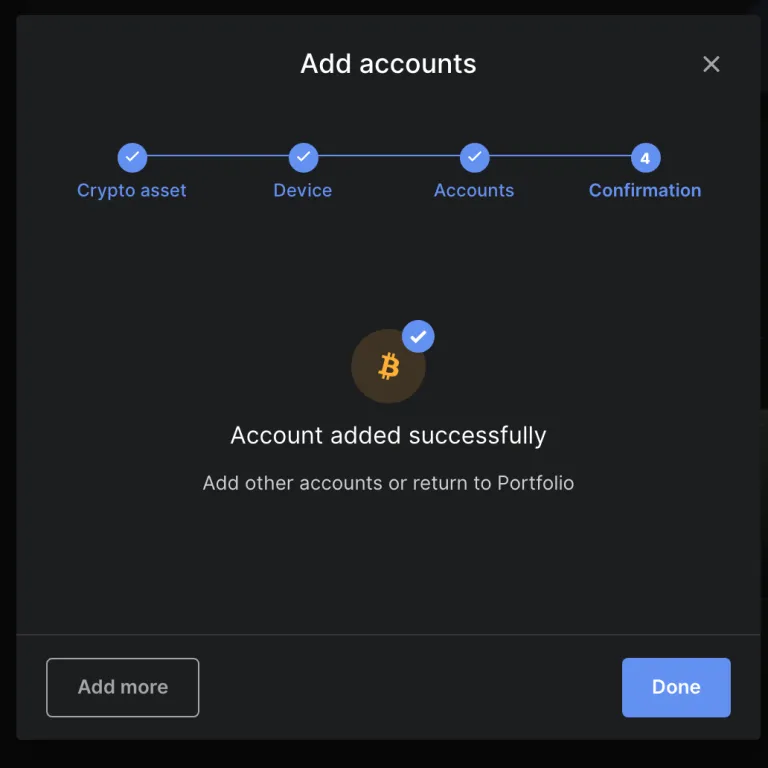
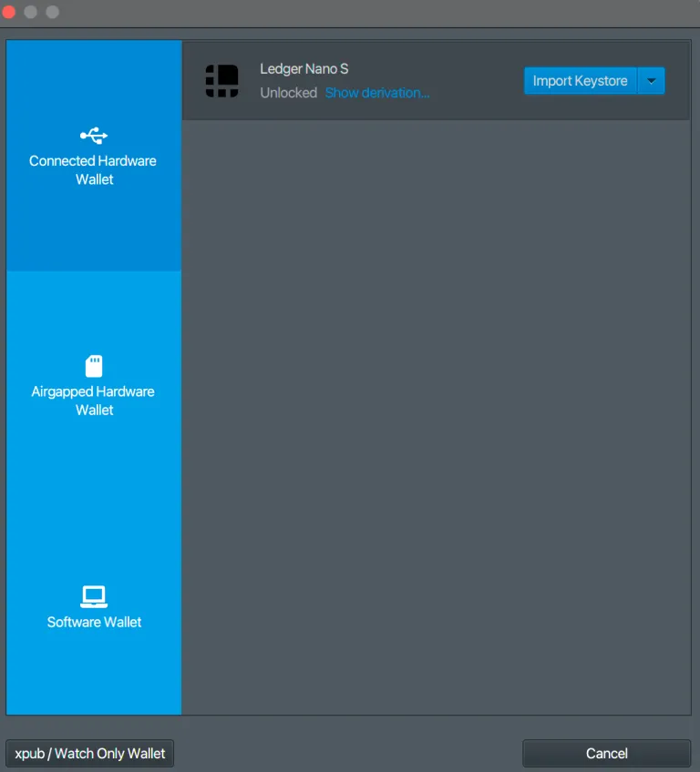
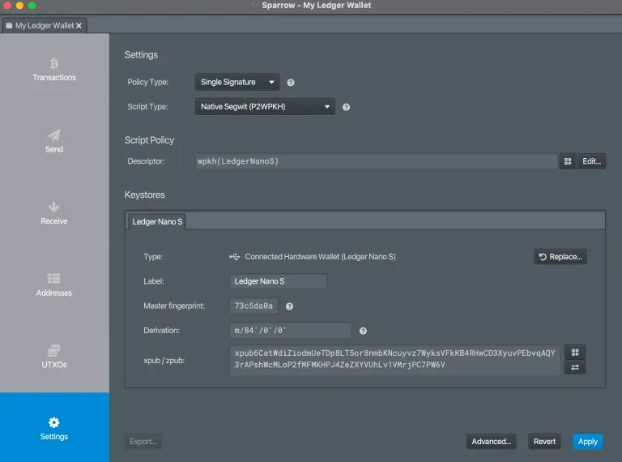

Cold physical wallet – €60 – Beginner – To secure €2,000 to €50,000

Ledger is the French solution for securing bitcoins in a simple way.

In this tutorial, we also discuss the passphrases section, an advanced security solution for storing large sums: 20,000€ – 100,000€.

https://www.youtube.com/watch?v=_vsHNTLi8MQ

# Connect Ledger to Sparrow Bitcoin Wallet (writing guide)

Make sure you go through the other piece “Using Bitcoin Hardware Wallets” first. I will skim through some steps and focus mostly on what is specific to Ledger here.

## Setting up the device

The Ledger comes with its own USB cable. Make sure you use that and not just any old cable. Some USB cables are power only. This one transmits data AND power. When I’ve used the device with a phone charging USB cable lying around, the device has failed to connect.

Connect it to your computer and the device will power on.


Cycle through the options. You’ll see

1. Set up as new device
2. Restore from recovery phrase

Basically, it’s asking if you want the device to create a seed for you or if you have one already that you’d like to use. It’s best practice to make your own seed, but doing that safely is very advanced, and outside the scope of this article. Choose “Set up as new device”

You’ll then be asked to choose a PIN. This is not part of your Bitcoin seed and is specific to this device only. It locks the device.

It will then present to you 24 words that you need to cycle through and write down.

Oddly, when you get to the end, it says “press left to verify your words”. That doesn’t describe how you confirm to proceed, it just means you can go back and look at the words again. Press right instead, and confirm by pressing left and right simultaneously.

The next bit is super annoying. It mixes up the 24 words and you have to confirm each one, 1 to 24, by cycling through all the words for each selection. Once you are done, it allows you to confirm with a two-button press and continue.


You will see on your dashboard that you have a settings button, and a plus-sign button that allows you to install apps. But you need to connect to Ledger Live first. We’ll do that next…

## Download Ledger Live

You could download Ledger Live from their webpage, but it’s better to get it from GitHub, where the source code is kept.

Google “ledger live GitHub” or click this link https://github.com/LedgerHQ/ledger-live-desktop


Scroll down until you see the heading, “Downloads”…


At the bottom, you’ll see the link: Instructions for verifying the hash and signatures of the installation packages are available on this page. Click that link.(https://live.ledger.tools/lld-signatures)


At the top, there are link choices for the software package you need, depending on your operating system. Click the appropriate one to download.

Next, we want to verify the download’s hash, for extra security.

Ledger publishes the hash of each of the files available on this page. We will now hash the download and compare the output. It needs to be identical to make sure the file hasn’t been tampered with.

Open terminal on a Mac or CMD on windows. Follow these commands…

cd Downloads

<Enter>

```bash
shasum -a 512 ledger-live-desktop-2.32.2-mac.dmg # <--- For Mac
certutil -hashfile ledger-live-desktop-2.32.2-win.exe SHA512 # <--- For Windows
```

<Enter>

Hopefully it’s obvious the commands begin after the arrows. Make sure, if this article is out of date, you change the file name in the commands to exactly the file name you downloaded. You need to hi the <Enter> key after each command. The commands as seen here might not fit on one line in your web browser. Note, it is all typed on one line.

Look at the output of the hash and make sure it is identical to the one published on GitHub.

Ideally, you want to get extra fancy and make sure that the hashes that are published are not fake. We do this with gpg signatures, but it’s outside of the scope of this article. If you want to learn about that (and I suggest you eventually do), then look through this article.

## Connect to Ledger Live

Before you run Ledger Live, it helps privacy a little to turn on a VPN. Ledger will still get all your addresses, but they won’t know your IP address, which gives away your home address. Mullvad VPN is an excellent VPN service and it is not very expensive (I’m not advertising, it’s just what I use).

Install the software onto your computer and run it.


Select your device, and select “First time using…”


You’ll then be taken through a wizard, but we’ve done all these steps so you can cycle through.


After many steps and a quiz, it will check the device is genuine. You need to make sure you are connected and entered the pin, and then it will ask on the device if you allow Ledger Live to connect. You have to confirm that, of course.


There was some shitcoin advertising disguised as “release notes” in the next pop up. Dismiss it, and then you should get to this screen.


You have to click “Add account” to get a Bitcoin Wallet.


Make sure you choose Bitcoin, and not Bitcoin Cash or any other shitcoin. It will check the device, and you have to confirm to proceed ON THE DEVICE. It will calculate addresses for a couple of minutes. Then click DONE.




Great. Now you have a shitcoin wallet manager containing a Bitcoin wallet on your computer. You actually don’t need this anymore and can get rid of it. The real purpose was to get the Bitcoin App on the device itself, and this was the only way, short of performing some extreme software engineer techniques.

Remember that earlier, on the device, we had a settings button and a plus-sign button. Now we have an extra button – the Bitcoin App button.

You can shutdown Ledger Live now.

## Add a passphrase

Now that we have the Bitcoin App, we can add a passphrase to our seed phrase. We couldn’t do that before when the seed was first created because at the start, we didn’t have the Bitcoin App, and we needed to connect to Ledger Live to get it.

Go to the “settings” menu within the device, then the submenu “security”. Then select passphrase. You’ll see “Advanced feature”. Click the right button, you’ll see “read manuel…” and then after a right button click, you’ll see “back”. But that’s not the end. Intuitively, you’d think that but click the right button again. You’ll see “set up passphrase”.

You can decide to “attach to PIN” or “Set temporarily”. I recommend “attach to the PIN”. That way, you can access different wallets depending on the PIN you enter when you first power up the device. If you “set temporarily”, you’ll have to enter the passphrase each time you want to access that wallet, but it’s always from the default PIN.

Enter the passphrase and confirm it.

It will ask you for the “Current PIN”. This is not the PIN you are associating with the new passphrase. It’s the PIN you entered when you powered up the device for this session.

You can now exit to the main menu by selecting the back option a few times.

## Watching Wallet

In previous articles, I explained how to download and verify Sparrow wallet, and how to connect it to your own node, or a public node. You should follow these guides:

- Install Bitcoin Core ( https://armantheparman.com/bitcoincore/)

- Install Sparrow Bitcoin Wallet (https://armantheparman.com/download-sparrow/)

- Connect Sparrow Bitcoin Wallet to Bitcoin Core (https://armantheparman.com/sparrowcore/)

An alternative to using Sparrow Bitcoin Wallet is Electrum Desktop Wallet, but I will proceed to explain Sparrow Bitcoin Wallet as I judge it to be the best for most people. Advanced users may like to use Electrum as an alternative.

We will now load it up and connect the Ledger, with the wallet containing the passphrase. This wallet has never been exposed to Ledger Live because it was created AFTER we connected the device to Ledger Live. Make sure you never connect it to Ledger Live ever again to not expose your new private wallet.

Create a New Wallet:


Name it something pretty


Notice the checkbox, “Has existing transaction”. If this is a wallet you’ve used before, then check this otherwise your balance will incorrectly show as zero. Checking this box asks Sparrow to examine Bitcoin Core’s database (the blockchain) for previous transactions. For this guide, we’re using a brand new wallet, so you can leave the box unchecked.


Click on “Connected Hardware Wallet” and make sure the device is actually connected, turned on, PIN entered, and you have entered the Bitcoin App.


Click “Scan” and then “Import Keystore” on the next screen.



There’s nothing to edit in the next screen, the Ledger has filled it for you. Click “Apply”



The next screen allows you to add a password. Don’t confuse this with “passphrase”; many people will. The naming is unfortunate. The password allows you to lock this wallet on your computer. It is specific to this software on this computer. It is not part of your Bitcoin private key.


After a pause, while the computer thinks, you will see the buttons on the left change from grey to blue. Congratulations, your wallet is now ready to use. Make and send transactions to your heart’s content.


## Receiving

To receive some bitcoin, go to the Addresses tab on the left and choose one of the addresses to receive. Just right-click the address you want, and select “copy address”. Then go to your exchange where the money is being sent from and paste it there. Or you may give the address to a customer who can use it to pay you.

When you use the wallet for the first time, you should receive a very small amount, practice spending it to another address, either within the wallet or back to the exchange, to prove that the wallet is functioning as expected.

Once you do that, you must back up the words that you wrote down. A single copy is not enough. Have two paper copies at least (metal is better), and keep them in two different, well secured, locations. This reduces the risk of a natural disaster destroying your HWW and paper back up in one incident. See “Using Bitcoin Hardware Wallets” for a full discussion on this.

## Sending


When making a payment, you need to paste in the address you are paying to in the “Pay to” field. You can’t actually leave the Label blank, it’s just for your own wallets’ records, but Sparrow doesn’t allow it – just enter something (only you will see it). Enter the amount and you can also manually adjust the fee you want.

The Wallet can not sign the transaction unless the HWW is connected. That’s the job of the HWW – to receive the transaction, sign it, and give it back, signed. Make sure when you sign on the device, you visually inspect the address you are paying to is the same on the device and on the computer screen, and the invoice you receive (eg you might have received an email to pay a certain address).

Also pay attention that if you choose to use a coin that is larger than the payment amount, then the remainder will be sent back to one of your wallets’ change addresses. Some people have not known this, and looked up their transaction on a public blockchain, and thought that some bitcoin was sent to an attackers address, but in fact, it was their own change address.

## Firmware

To update the firmware, you need to connect to Ledger Live. If you want to do this, you should wipe the device first, and make sure you have your backup words and passphrase available to restore the device. The reason I prefer to wipe the device first is that you have to connect your device to Ledger Live to update the firmware, and I prefer not to expose your new wallet (the one with the passphrase) to Ledger Live, ever. I just don’t trust Ledger is not extracting my public key information from the device when I connect to Ledger Live. They claim they don’t, but I can’t verify that myself unless I read the code, and understand the internal hardware as well.

## Conclusion

This article showed you how to use a Ledger HWW in a safer and more private way than advertised – but this article alone is not enough. As I said at the start, you should combine it with the information provided in “Using Bitcoin Hardware Wallets“.
Tips:

Static Lightning Address: dandysack84@walletofsatoshi.com
https://armantheparman.com/ledgersparrow/
