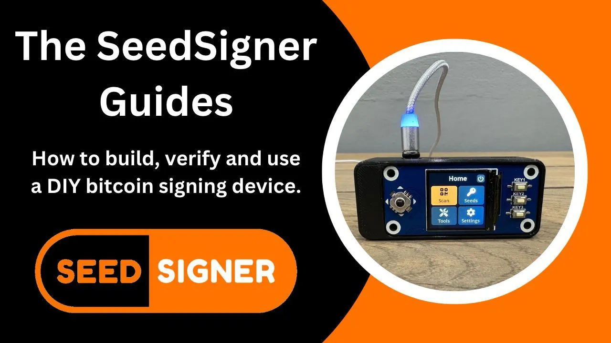

## Matériel :

1. Raspberry Pi Zéro (version 1.3)

Raspberry Pi Zero

Pour une solution complètement déconnectée, assurez-vous d'utiliser la version 1.3 sans capacité WiFi ou Bluetooth, mais n'importe quel modèle Raspberry Pi 2/3/4 ou Zero fonctionnera.

Note : Les Raspberry Pi n'ont généralement pas de broches attachées ; les broches devront soit être soudées, soit un outil appelé "GPIO Hammer" peut être utilisé.
GPIO Hammer

Si votre soudure n'est pas tout à fait à la hauteur, ou si vous ne possédez pas encore un fer à souder, vous pouvez utiliser "GPIO Hammer" comme alternative à la soudure.

2. Chapeau LCD WaveShare 1,3 pouces avec écran 240 × 240 pixels

WaveShare LCD Hat

Waveshare 1.3″ 240×240 pxl LCD

Note : Choisissez soigneusement l'écran Waveshare ; assurez-vous d'acheter le modèle qui a une résolution de 240×240 pixels.
plus d'informations

3. Module de caméra compatible Pi Zero

Raspberry Pi Camera

Aokin / AuviPal 5MP 1080p avec module de caméra vidéo OV5647 ; d'autres marques avec le module de capteur OV5647 devraient également fonctionner, mais elles peuvent ne pas être compatibles avec l'enceinte Orange Pill.

Note : Vous aurez besoin d'un câble ruban de caméra spécifiquement compatible avec le Raspberry Pi Zero.

4. Carte MicroSD avec au moins 4 Go de capacité

ressources étendues : https://seedsigner.com/explainers/

## Logiciel :

Installation du logiciel

1. Téléchargez le dernier fichier "seedsigner_x_x_x.img.zip"
   dernière version

2. Décompressez le fichier "seedsigner_x_x_x.img.zip"

3. Utilisez Balena Etcher ou un outil similaire pour écrire le fichier d'image .img décompressé sur une carte microsd
   BALENA ETCHER

4. Installez la carte microsd dans SeedSigner.
   Clé publique GPG de SeedSigner
   seedsigner_pubkey.gpg

## Tutoriel vidéo

_guide tiré de Southerbitcoiner, créé par Cole_

### Une collection de guides vidéo couvrant SeedSigner : un portefeuille matériel/DIY open source

SeedSigner est un appareil de signature Bitcoin que vous pouvez construire à partir de zéro. Ça semble difficile, mais cette série en 4 parties devrait vous aider :) Je vous suggère de regarder les parties 1 et 2, puis de décider si vous voulez utiliser un ordinateur de bureau (regardez la partie 3) ou un appareil mobile (regardez la partie 4).

Tout ce que vous devez savoir se trouve ci-dessous. D'autres liens utiles incluent le site web de SeedSigner, leur Github, leur Keybase, la dernière version et les exigences matérielles.

### Partie 1 : Comment construire un SeedSigner :

Dans cette vidéo, je vous montre comment télécharger et vérifier le logiciel SeedSigner, quels sont les composants nécessaires et comment assembler votre SeedSigner.

### Partie 2 : Test de votre SeedSigner'

Avant d'utiliser mon SeedSigner, j'ai effectué quelques tests pour m'assurer qu'il ne faisait rien de malveillant. Je pensais partager cette étape également. Voici comment vérifier que votre SeedSigner exporte le portefeuille correct (xpub), comment vérifier les calculs des lancers de dés de SeedSigner et comment vérifier les graines enfant bip-85 de SeedSigner.

### Partie 3 : Comment utiliser SeedSigner avec Sparrow Wallet (ordinateur de bureau)

SeedSigner est capable de générer des graines et de signer des transactions bitcoin. Mais en lui-même, il n'est pas capable de construire des transactions. Vous devez utiliser un "coordinateur" de portefeuille avec votre SeedSigner. Voici comment utiliser Sparrow Wallet avec votre SeedSigner :

### Partie 4 : Comment utiliser SeedSigner avec Blue Wallet (mobile)

SeedSigner est capable de générer des graines et de signer des transactions bitcoin. Mais en lui-même, il n'est pas capable de créer des transactions. Vous devez utiliser un "coordinateur" de portefeuille avec votre SeedSigner. Voici comment utiliser Blue Wallet avec votre SeedSigner :

Ce sont tous les guides SeedSigner, pour le moment ! Faites-moi savoir si vous pensez que j'ai oublié quelque chose. Voici ce qui est sur ma liste pour de potentielles vidéos :

> Revue globale de SeedSigner. Est-ce un bon choix pour un appareil de signature ? Avantages/inconvénients ?

> Comment utiliser Bip-85 avec SeedSigner
> Comment être oncle Jim avec SeedSigner

Vous avez trouvé cela utile ? Considérez envoyer un pourboire pour aider à financer les futures vidéos :

https://www.southernbitcoiner.com/donate/
