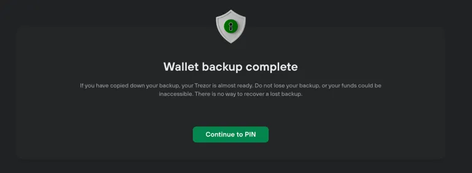
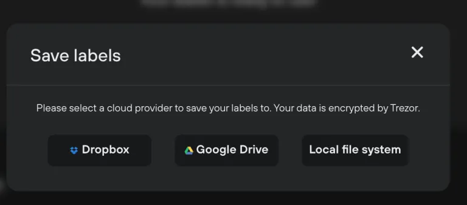
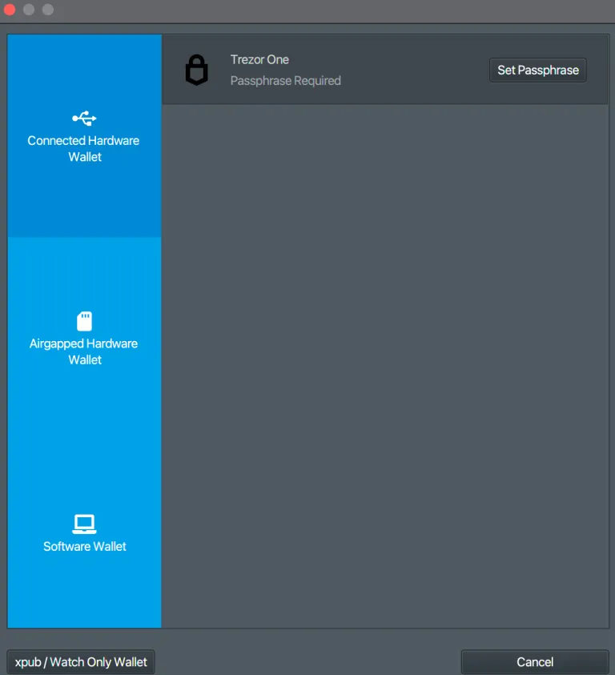

Cold hardware portfolio – 60€ – Beginner – Secure between 2 000€ and 50 000€.

As cold physical wallet, Trezor is ideal to starting in Bitcoin. It’s easy to use, not too expensive and functional.

We have already made tutorials on how to use it :

1. Setting it up
2. Recovering bitcoins
3. Using, sending and receiving bitcoins

Would you like to have your own Trezor too?
You can contribute to the project by clicking below !

settin up -https://www.youtube.com/watch?v=q-BlT6R4_bE

recovery: https://www.youtube.com/watch?v=3n4d4egjiFM

use : https://www.youtube.com/watch?v=syouZjLC1zY

## writing guide

guide proposed by https://armantheparman.com/trezor/

## Setting up the Trezor

The Trezor comes with its own micro USB cable. Make sure you use that and not just any old cable lying around. Some USB cables are power only. This one transmits data AND power. If you use the device with a phone-charging USB cable, the device may fail to connect.

Connect it to your computer and the device will power on. You’ll get a message that says “Go to Trezor.io/start”. Do that, and download Trezor Suite to your computer.


Click the download button (“Get Desktop App”)


Notice the Signature and Signing key links. To verify the download (check that your download has not been tampered with), there are additional steps that are optional if you’re starting out, but MANDATORY if you have significant wealth to secure. Instructions for that are in Appendix A ( end of guide)

Connect the Trezor to the computer with the micro USB cable, and install and run the program. Here’s how it looks on a Mac:


You’ll get a silly warning after running the program, just continue:


Click on Setup Trezor


If the firmware is out of date, allow Trezor to update the firmware.

Next, you can create a new seed, or restore a wallet from a different device with a seed you already have. I’ll go through creating a new seed.


Click “Create new wallet” – and confirm you want to do this on the device itself by clicking the confirm button.

Then click the only option “Standard seed backup”


Then click “create backup”


Click on the three checkmarks to turn them green (of course read each message), and then click “begin backup”.


Next, you’ll see this:


On the device, see the words presented to you one by one and write them down NEATLY and IN ORDER.



Set a PIN to lock the device (this is not part of your seed, it’s just to lock the device so no one can access the seed contained inside).


You have options to add shitcoins to your wallet – I urge you not to, and save in Bitcoin only, as I explain here (why bitcoin) and here (why bitcoin only).


Name your wallet, and click “Access Suite”:


It’s simplest to create a wallet with no passphrase, but best to create one with a passphrase (your real wallet) AND one without a passphrase (your decoy wallet). Each time you access the device through Trezor Suite, you’ll be asked if you want to “apply” the passphrase or not.


I selected “Hidden Wallet” and typed in a passphrase that I made up “craigwrightisaliarandafraud”


I like how it’s called a “hidden” wallet, as it explains partly how passphrases function.

Confirm the passphrase on the device.

Because this wallet is empty, I was asked to confirm that the passphrase is correct:


You will then be asked if you’d like to enable labelling. Not something I’ve explored, but it sounds like a way you can label your transactions and save the data to your computer or cloud.



Finally, your wallet will be available:


What you have on your computer is what’s called a “watching wallet”, because it has your public keys (and addresses), but not your private keys. You need the private keys to spend (by signing transactions with the private keys). The way to do that is by connecting the hardware wallet. The point of the hardware wallet is that transactions can be passed back and forth between the computer and the Trezor, a signature can be applied inside the Trezor, and the private key always remains contained inside the device (for security against computer malware).

The Trezor Suite is a poor watching-wallet for various reasons. It’s OK for the bare minimum, but if you want to advance, read on and learn how to connect the device to Sparrow Bitcoin Wallet.

## Watching Wallet

In previous articles, I explained how to download and verify Sparrow Bitcoin Wallet, and how to connect it to your own node, or a public node. You can follow these guides:

- Install Bitcoin Core
- Install Sparrow Bitcoin Wallet
- Connect Sparrow Bitcoin Wallet to Bitcoin Core

An alternative to using Sparrow Bitcoin Wallet is Electrum Desktop Wallet, but I will proceed to explain Sparrow Bitcoin Wallet as I judge it to be the best for most people. Advanced users may like to use Electrum as an alternative (see my guide).

We will now load it up Sparrow and connect the Trezor (with the seed phrase but now with a passphrase). This wallet has never been exposed to Trezor Suite because it will be created AFTER we connected the device to Trezor Suite. Make sure you never connect it to Trezor Suite ever again to not expose your new wallet. (You can connect it with no passphrase because that can be your decoy wallet).

Create a New Wallet:


Name it something pretty


Click on “Connected Hardware Wallet”.


Click “Scan” and then “set passphrase” on the next screen to create a brand new wallet (use a brand new passphrase, eg the old passphrase with a number afterwards would work). Then “send passphrase”, then confirm it on the device.



Then click “import keystore”.

There’s nothing to edit on the next screen, the Trezor has filled it for you. Click “Apply”


The next screen allows you to add a password. Don’t confuse this with “passphrase”; many people will. The naming is unfortunate. The password allows you to lock this wallet on your computer. It is specific to this software on this computer. It is not part of your Bitcoin private key.

Click “Apply”


After a pause, while the computer thinks, you will see the buttons on the left change from grey to blue. Congratulations, your wallet is now ready to use. Make and send transactions to your heart’s content.


Receiving

To receive some bitcoin, go to the Addresses tab on the left and choose one of the addresses to receive. Just right-click the address you want, and select “copy address”. Then go to your exchange where the money is being sent from and paste it there. Or you may give the address to a customer who can use it to pay you.

When you use the wallet for the first time, you should receive a very small amount, practice spending it to another address, either within the wallet or back to the exchange, to prove that the wallet is functioning as expected.

Once you do that, you must back up the words that you wrote down. A single copy is not enough. Have two paper copies at least (metal is better), and keep them in two different, well secured, locations. This reduces the risk of a natural disaster destroying your HWW and paper backup in one incident. See “Using Bitcoin Hardware Wallets” for a full discussion on this.

## Sending


When making a payment, you need to paste in the address you are paying to in the “Pay to” field. You can’t actually leave the Label blank, it’s just for your own wallets’ records, but Sparrow doesn’t allow it – just enter something (only you will see it). Enter the amount and you can also manually adjust the fee you want.

The Wallet can not sign the transaction unless the HWW is connected. That’s the job of the HWW – to receive the transaction, sign it, and give it back, signed. Make sure when you sign on the device, you visually inspect the address you are paying to is the same on the device and on the computer screen, and the invoice you receive (eg you might have received an email to pay a certain address).

Also pay attention that if you choose to use a coin that is larger than the payment amount, then the remainder will be sent back to one of your wallets’ change addresses. Some people have not known this, and looked up their transaction on a public blockchain, and thought that some bitcoin was sent to an attacker’s address, but in fact, it was their own change address.
Firmware

To update the firmware, you need to connect to Trezor Suite. If you want to do this, make sure you have your backup words and passphrase available to restore the device, just in case the device resets.
Conclusion

This article showed you how to use a Trezor HWW in a safer and more private way than advertised – but this article alone is not enough. As I said at the start, you should combine it with the information provided in “Using Bitcoin Hardware Wallets“.
Appendix A -Verify the software download

## Appendix A -Verify the software download


Download the Signature (a text file) and the Signing key (a text file) and make note of the file names and where you downloaded the file to.

Next, for Mac, you’ll need to download GPG Suite (See instructions here).

For Windows, you’ll need GPG4win (See instructions here).

For Linux, GPG is already part of every package. In case you don’t have it, get it with the command: sudo apt-get install gpg

Next, for Mac/Windows or Linux, open the terminal, and enter the command:

```bash
gpg –import XXXXXXXXXX
```

where XXXXXXXXXX is the full path to the signing key file (full path meaning the directory and the file name where the file is). You should see a confirmation of a successful key import.

Then

```bash
gpg –verify ZZZZZZZZZZ WWWWWWWWWW
```

where ZZZZZZZZZZ is the full path to the signature file and WWWWWWWWWW is the full path to the Trezor Suite program that you downloaded.

You should see a message “Good signature from SatoshiLabs” somewhere in the output. There is a warning down the bottom which is safe to ignore.
