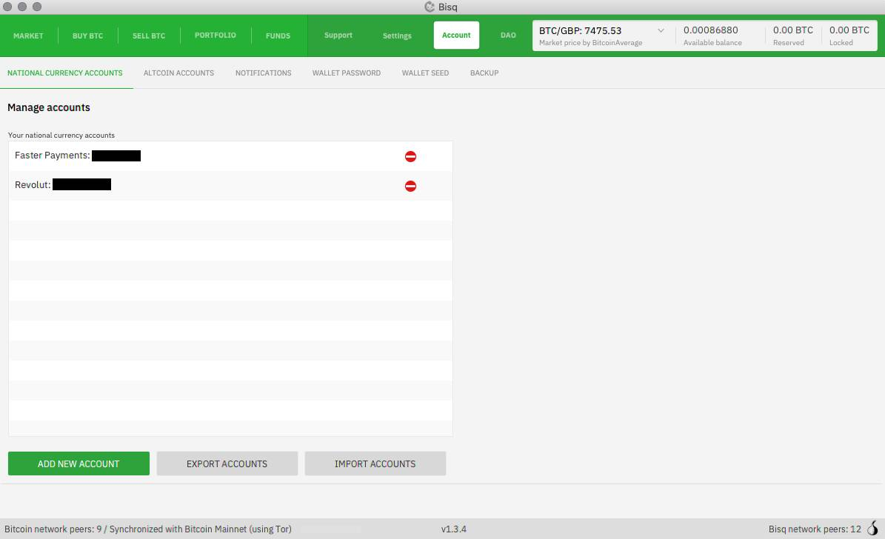
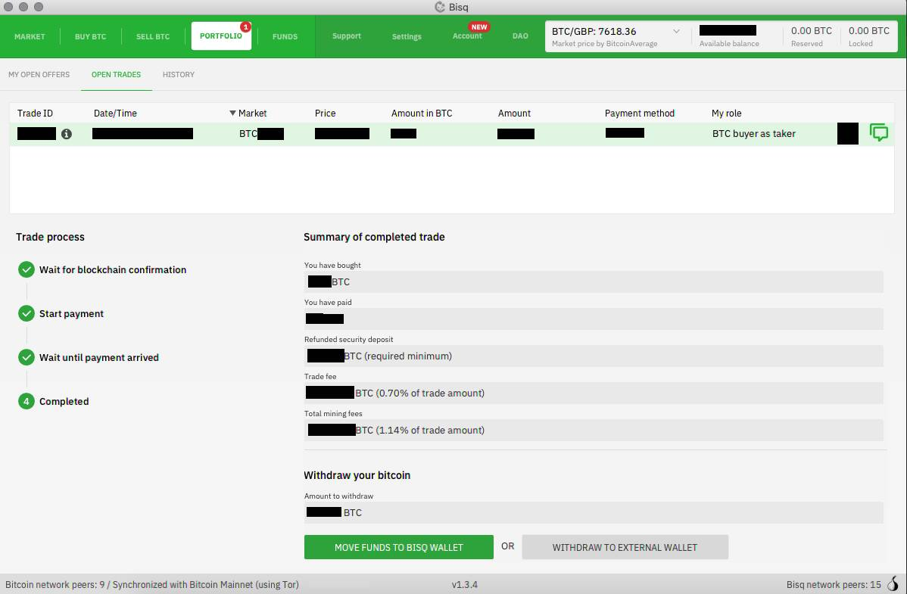

Bisq ist eine dezentrale Handelsplattform für digitale Vermögenswerte, hauptsächlich Bitcoin. Es ermöglicht direkte, sichere und private Transaktionen zwischen Benutzern weltweit ohne die Notwendigkeit eines Vermittlers.

Website: https://bisq.network/
Info: https://bisq.network/getting-started/

_Achten Sie darauf, nichts überstürzt zu tun, Bisq ist eine fortgeschrittene Lösung. Sobald es eingerichtet ist, ist es sehr leistungsstark, aber wenn Sie ein absoluter Anfänger sind, ist es möglicherweise nicht geeignet._

## Tutorial-Video

Vollständiges Tutorial von BTC Session:

## Schreibanleitung:

Ursprüngliche Anleitung vom Bisq-Team: https://bisq.network/getting-started/

_Wenn Sie eine aktuellere Anleitung mit Bildern und mehr für Anfänger geeigneten Inhalten kennen, teilen Sie sie gerne mit uns!_

1. Bisq herunterladen und installieren

Sie können Bisq einfach von dieser Website (https://bisq.network/downloads) oder von GitHub (https://github.com/bisq-network/bisq/releases/latest) herunterladen und installieren.

Es ist auch eine gute Idee, Ihre Installationsdatei zu überprüfen, um sicherzustellen, dass sie nicht manipuliert wurde. Sehen Sie sich hierzu die Videos an. Weitere Details finden Sie in diesem Wiki-Artikel. (https://bisq.wiki/Downloading_and_installing)

Wenn Sie Bisq aus dem Quellcode erstellen möchten, finden Sie hier Anweisungen. Bisq ist freie Open-Source-Software, zu der Sie beitragen können. (https://bisq.wiki/Contributor_checklist)

2. Schlüssel sichern, Seed notieren

Mit Bisq haben Sie die volle Kontrolle über Ihre Gelder und Ihre Daten. Das bedeutet, dass Sie eine beispiellose Souveränität behalten, aber auch, dass Ihnen niemand helfen kann, wenn Sie etwas Wichtiges verlieren. Daher ist es wichtig, vor der Nutzung von Bisq zum Handeln ordnungsgemäße Backups durchzuführen.

Wir haben auch eine kurze Tour durch die Bisq-Benutzeroberfläche vorbereitet, damit Sie das Beste daraus machen können.

Weitere Details finden Sie im Wiki: Notieren Sie Ihre Seed-Wörter und sichern Sie Ihr Datenverzeichnis. (https://bisq.wiki/Backing_up_application_data)

3. Zahlungskonto erstellen

Um Bitcoin auf Bisq zu handeln, müssen Sie eine Möglichkeit einrichten, andere Gelder zu senden oder zu empfangen. Bisq kümmert sich nur um die Bitcoin-Seite eines Handels - die andere Seite wird über Fiat-Zahlungsdienste (Banken, Geldanweisungen, Bargeld) oder Altcoin-Wallets abgewickelt.
Sie sind sich nicht sicher, welchen Zahlungsdienst Sie einrichten sollen? Auf dem Wiki gibt es eine vollständige Liste der Zahlungsmethoden (https://bisq.wiki/Payment_methods). Wenn Sie mit Fiat handeln möchten, stellen Sie bitte sicher, dass Sie das Video zu den Kontolimits ansehen oder diesen Artikel im Wiki lesen. (https://bisq.wiki/Account_limits)

Auf Bisq stehen viele Altcoins zum Handel zur Verfügung. Hier sind einige Tipps für die wichtigsten Märkte:

- Monero. Wenn Sie XMR senden, stellen Sie sicher, dass Ihre Wallet in der Lage ist, den Transaktionsschlüssel, die Transaktions-ID und die Empfängeradresse bereitzustellen.
- BSQ. Sie finden Ihre BSQ-Adresse unter DAO > BSQ Wallet > Receive.
- Liquid BTC. Wenn Sie L-BTC empfangen, müssen Sie eine Wallet verwenden, die Ihren Blind Key offenlegen kann, wie z.B. die Core Elements Software (Blockstream Green funktioniert zum Zeitpunkt der Erstellung dieses Textes nicht).

4. Führen Sie einen Handel durch

Ein Angebot zu erstellen bringt Ihnen normalerweise einen besseren Preis und mehr Kontrolle (z.B. die Festlegung der Zahlungsmethode und des Einzahlungsprozentsatzes), aber ein Angebot anzunehmen kann bequemer sein.

Hier finden Sie die Handelsgebühren (https://bisq.wiki/Trading_fees).

Sie werden feststellen, dass Angebotsersteller deutlich weniger zahlen. Beachten Sie, dass es eine mobile App für iOS und Android gibt, mit der Sie Benachrichtigungen über neue Angebote und Aktionen zu offenen Trades erhalten können. Um beide Seiten eines Bisq-Handels gleichzeitig nebeneinander zu sehen, sollten Sie unbedingt unser Video zur Vogelperspektive eines Bisq-Handels ansehen.

Das ist es - die grundlegenden Informationen, um mit Bisq zu beginnen.

## Schritt-für-Schritt-Anleitung für den Handel

Schritt-für-Schritt-Anleitung von Bitcoiner.guide, auch bekannt als bitcoinQ&A https://bitcoiner.guide/bisq/

3. Jetzt, da Ihre Zahlungsmethode eingerichtet ist, können Sie zum Tab "BTC kaufen" gehen und die Verkäufer sehen, die Bitcoin im Austausch gegen Ihre gewählte Zahlungsmethode anbieten. Hier sehen Sie den BTC-Preis, den prozentualen Unterschied zum "Spot"-Preis und die Menge an Bitcoin, die von jedem Verkäufer zum Verkauf angeboten wird. Sobald Sie ein Angebot gefunden haben, das Ihnen gefällt, klicken Sie auf "Angebot annehmen, um BTC zu kaufen".

4. Dadurch gelangen Sie zu einem Bildschirm, auf dem Sie die Details überprüfen und bestätigen können, bevor Sie den Handel eingeben. Wenn Sie zufrieden sind, klicken Sie auf "nächster Schritt".

5. Sie müssen nun Ihre Handels-Wallet mit einer kleinen Menge an Bitcoin finanzieren, die als Sicherheitsleistung dient. Dies entspricht in der Regel etwa 15% der Handelsgröße. Der Verkäufer muss ebenfalls eine Einzahlung auf seiner Seite hinterlegen.

6. Sie können das Angebot jetzt bestätigen und den Handel starten.

7. Sie müssen nun eine sehr kurze Wartezeit in Kauf nehmen, während das Bitcoin-Netzwerk die Transaktion des Handels bestätigt, bei der die Sicherheitsleistungen beider Parteien in die Treuhand-Multisig überführt werden.

8. Nach einer Bestätigung auf der Blockchain sehen Sie dann ein Fenster mit den Details des Verkäufers, an den Sie die Zahlung senden müssen.

 9. Sobald Sie die Zahlung gesendet haben, drücken Sie die Schaltfläche, um zu bestätigen, dass Sie dies getan haben, und warten Sie dann darauf, dass der Verkäufer bestätigt, dass er Ihre Gelder erhalten hat. Zu diesem Zeitpunkt können Sie auch über Ende-zu-Ende-verschlüsselte Nachrichten mit Ihrem Handelspartner chatten, indem Sie auf "Trader-Chat öffnen" drücken.
Sobald der Verkäufer den Erhalt der Gelder bestätigt hat, werden die gekauften Bitcoins zusammen mit Ihrer Sicherheitsleistung in Ihre Bisq-Brieftasche freigegeben.

10. Das ist es, Ihr erster Handel ist jetzt abgeschlossen! Sie können jetzt entweder Ihre Bitcoins auf eine externe Brieftasche abheben oder in Ihrem Bisq-Konto belassen.

## Die Kompromisse beim Kauf von nicht-KYC (von Bitcoin Q&A)

So einfach der Kauf auf Bisq auch ist, es gibt einige Kompromisse, die man beachten sollte.

1. Sie benötigen BTC, bevor Sie handeln können, um eine Sicherheitsleistung zu bilden. Kein Problem, wenn Sie schon länger dabei sind, aber es könnte ein Problem werden, wenn Sie Bisq zum ersten Mal nutzen möchten. Ihre beste Option in diesem Fall ist es, etwas Bitcoin von einem Freund oder Familienmitglied zu bekommen.

2. KYC-freier Bitcoin zieht oft einen Aufschlag über dem Spotpreis an, was einige Käufer abschrecken kann. Wie ich bereits erwähnt habe, geht es hier um Kompromisse, und ich persönlich wäre bereit, 5-8% über dem Spotpreis zu zahlen, um meine persönlichen Daten sicher zu halten.

Wenn Sie nicht in Eile sind, können Sie auch ein "Kaufangebot" einrichten, bei dem Sie dem Bisq-Netzwerk mitteilen können, dass Sie eine bestimmte Menge Bitcoin zu einem bestimmten Preis relativ zum Marktwert kaufen möchten. Wenn ein Verkäufer vorbeikommt und Ihr Angebot mag, kann er es annehmen.

3. Dezentrale Börsen können manchmal unter Liquiditätsengpässen leiden, im Vergleich zu größeren zentralisierten Einrichtungen. Wenn Sie größere Beträge häufiger kaufen möchten, könnten Sie Schwierigkeiten haben.

4. Obwohl es mir noch nie passiert ist, funktioniert der Peer-to-Peer-Handel manchmal nicht wie beabsichtigt, und Benutzer müssen den Streitbeilegungsprozess durchlaufen. Glücklicherweise sind solche Fälle aufgrund der Anreizstrukturen von Bisq selten.

Wie bei den meisten mit Bitcoin zusammenhängenden Dingen ist die gesamte KYC/Non-KYC-Debatte nuanciert und voller Kompromisse. Ich verstehe, dass die gängigsten Fiat-Onramps wie Coinbase und CashApp das Leben sehr einfach machen, insbesondere für Anfänger, aber bitte nehmen Sie sich einen Moment Zeit, um die Kompromisse abzuwägen und sich über die Alternativen zu informieren, bevor Sie Ihre persönlichen Informationen so bereitwillig preisgeben.
