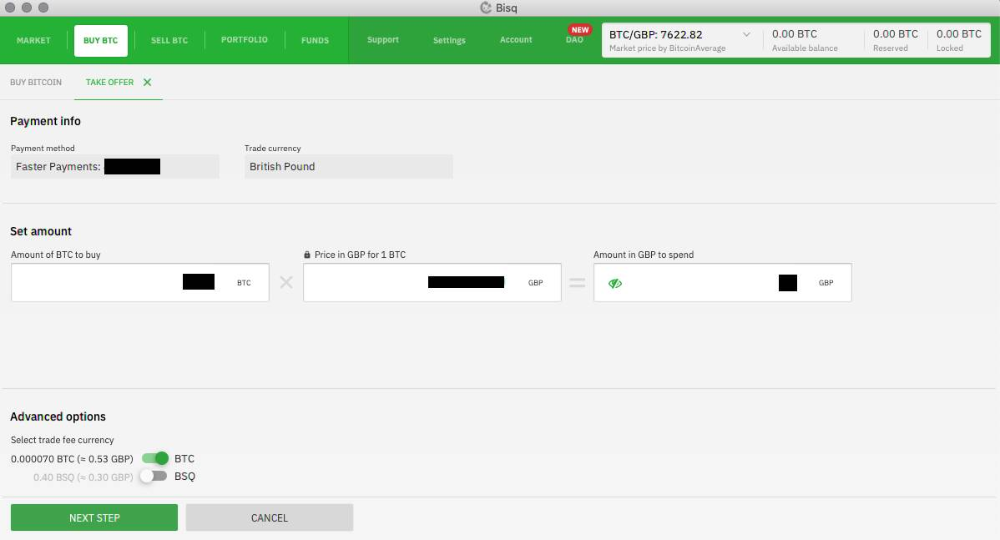
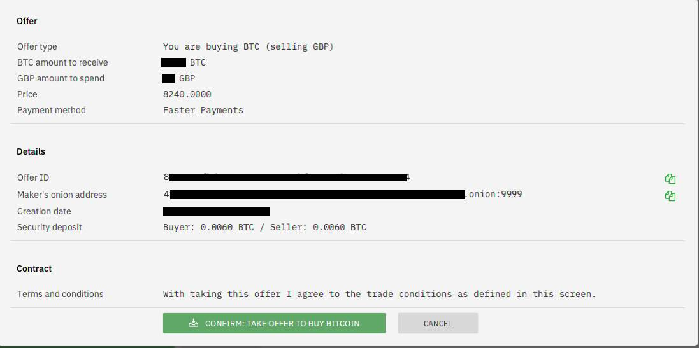
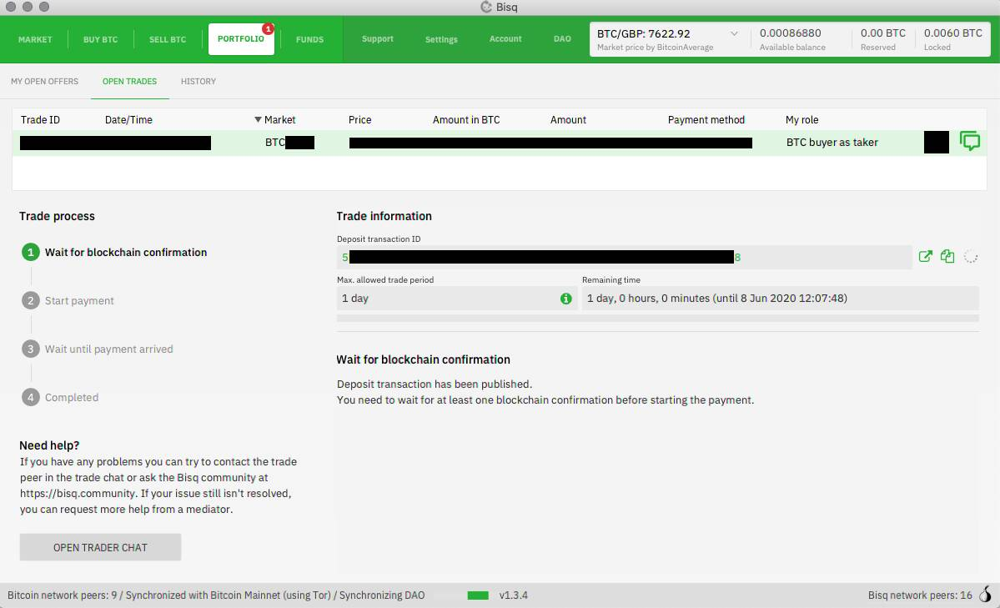
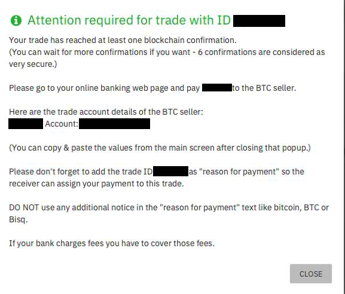
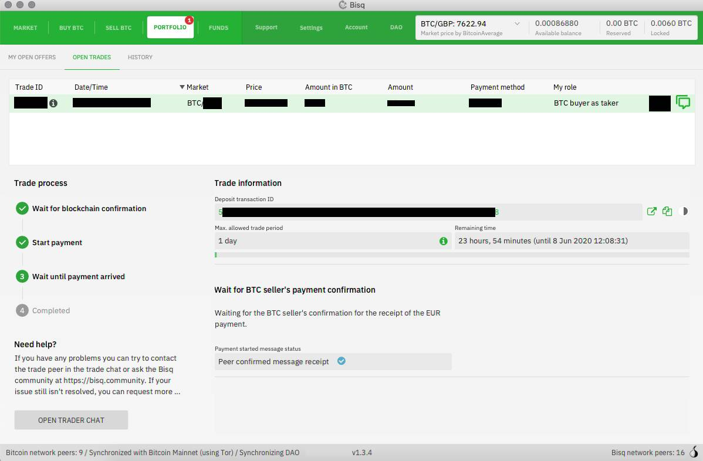

Bisq è una piattaforma di trading decentralizzata per asset digitali, principalmente Bitcoin. Fornisce transazioni dirette, sicure e private tra utenti di tutto il mondo senza la necessità di un intermediario.

Sito web: https://bisq.network/
informazioni: https://bisq.network/getting-started/

_Stai attento a non fare nulla in modo sconsiderato, Bisq è una soluzione avanzata. Una volta configurato, è molto potente, ma se sei un principiante completo, potrebbe non essere adatto a te._

## video tutorial

Tutorial completo di BTC Session:

## Guida alla scrittura:

Guida originale del team di Bisq: https://bisq.network/getting-started/

_Se conosci una guida più aggiornata con immagini e orientata ai principianti, sentiti libero di condividerla con noi!_

1. Scarica e installa Bisq

Puoi scaricare e installare Bisq facilmente da questo sito web (https://bisq.network/downloads) o da GitHub (https://github.com/bisq-network/bisq/releases/latest).

È anche una buona idea verificare il file del programma di installazione per essere sicuri che non sia stato manomesso. Vedi i video qui per le istruzioni. Ulteriori dettagli sono presenti in questo articolo del wiki. (https://bisq.wiki/Downloading_and_installing)

Se desideri compilare Bisq dal codice sorgente, ecco le istruzioni (https://github.com/bisq-network/bisq/blob/master/docs/build.md). Bisq è un software open-source gratuito/libero a cui puoi contribuire. (https://bisq.wiki/Contributor_checklist)

2. Fai il backup delle chiavi, annota il seed

Con Bisq, hai il totale controllo dei tuoi fondi e dei tuoi dati. Ciò significa che mantieni un'autonomia senza precedenti, ma significa anche che nessuno può aiutarti se perdi qualcosa di importante, quindi è fondamentale fare backup adeguati prima di utilizzare Bisq per il trading.

Abbiamo anche preparato un breve tour dell'interfaccia di Bisq in modo da poterne trarre il massimo vantaggio.

Ulteriori dettagli sono presenti nel wiki: annotare le parole seed e fare il backup della directory dei dati. (https://bisq.wiki/Backing_up_application_data)

3. Crea un account di pagamento

Per poter scambiare bitcoin su Bisq, devi impostare un modo per inviare o ricevere altri fondi. Bisq si occupa solo del lato bitcoin di uno scambio, mentre l'altro lato viene gestito tramite servizi di pagamento fiat (banche, vaglia postali, contanti) o portafogli di altcoin.

Non sei sicuro di quale tipo di account di pagamento impostare? C'è una lista completa dei metodi di pagamento nel wiki (https://bisq.wiki/Payment_methods). Se stai scambiando fiat, assicurati di guardare il video sui limiti dell'account o leggere questo articolo nel wiki (https://bisq.wiki/Account_limits).

Ci sono molte altcoin disponibili per il trading su Bisq. Ecco alcuni consigli per i mercati principali:

- Monero. Se invii XMR, assicurati che il tuo portafoglio sia in grado di fornire la chiave di transazione, l'ID di transazione e l'indirizzo del destinatario.
- BSQ. Puoi trovare il tuo indirizzo BSQ in DAO > BSQ Wallet > Receive.
- Liquid BTC. Se ricevi L-BTC, devi utilizzare un portafoglio in grado di rivelare la tua chiave di oscuramento, come il software core Elements (Blockstream Green non funzionerà, al momento della scrittura).

4. Fai uno scambio

Fare un'offerta di solito ti darà un prezzo migliore e più controllo (ad esempio, impostare il metodo di pagamento e la percentuale di deposito), ma accettare un'offerta può essere più conveniente.

Vedi le commissioni di trading qui (https://bisq.wiki/Trading_fees).

Noterai che i creatori di offerte pagano molto meno. Tieni presente che c'è un'app mobile per iOS e Android che puoi utilizzare per ricevere notifiche per nuove offerte e azioni sugli scambi aperti. Per vedere entrambi i lati di uno scambio Bisq contemporaneamente, affiancati, assicurati di guardare il nostro video Bird's Eye View di uno scambio Bisq.

Questo è tutto: gli elementi essenziali per iniziare con Bisq.

## Guida passo passo per lo scambio

Guida passo passo di Bitcoiner.guide, alias bitcoinQ&A https://bitcoiner.guide/bisq/

3. Ora che il tuo metodo di pagamento è impostato, puoi andare alla scheda 'Acquista BTC' e vedere i venditori che offrono bitcoin in cambio del tuo metodo di pagamento scelto. Qui puoi vedere il prezzo del BTC, la differenza percentuale rispetto al prezzo 'spot' e la quantità di bitcoin in vendita da ciascun venditore. Una volta trovata un'offerta che ti piace, fai clic su 'Accetta offerta per acquistare BTC'.

4. Questo ti porterà a una schermata in cui puoi controllare e confermare i dettagli prima di entrare nello scambio. Quando sei soddisfatto, premi 'passaggio successivo'.

5. Ora devi finanziare il tuo portafoglio di scambio con una piccola quantità di bitcoin che funge da deposito di sicurezza. Di solito si tratta di circa il 15% della dimensione dello scambio. Anche il venditore deve effettuare un deposito dal suo lato.

6. Ora puoi confermare l'offerta e avviare lo scambio.

7. Avrai ora una breve attesa mentre la rete Bitcoin conferma la transazione dello scambio, che mette i depositi di sicurezza di entrambe le parti nell'escrow multi-sig.

8. Dopo una conferma sulla blockchain, vedrai una finestra con i dettagli del venditore a cui inviare il pagamento.

 9. Una volta inviato il pagamento, premi il pulsante per confermare di averlo fatto e poi attendi che il venditore confermi di aver ricevuto i tuoi fondi. A questo punto puoi anche chattare con il tuo partner di scambio tramite messaggi crittografati end-to-end premendo "Apri chat con il trader". Una volta che il venditore conferma di aver ricevuto i fondi, i bitcoin acquistati insieme al tuo deposito di sicurezza saranno rilasciati nel tuo portafoglio Bisq.

10. Ecco fatto, il tuo primo scambio è completo! Ora puoi decidere se prelevare i tuoi bitcoin in un portafoglio esterno o lasciarli nel tuo account Bisq.

## I compromessi nell'acquisto di bitcoin senza KYC (da bitcoin Q&A)

Anche se l'acquisto su Bisq è semplice, ci sono alcuni compromessi di cui bisogna essere consapevoli.

1. Hai bisogno di BTC prima di fare uno scambio per formare un deposito di sicurezza. Non è un problema se sei nel giro da un po' di tempo, ma potrebbe diventare un problema se vuoi usare Bisq come primo acquisto. La tua migliore opzione in questo caso è ottenere alcuni bitcoin da un amico o un familiare.

2. I bitcoin senza KYC spesso attraggono un premio sopra il prezzo di mercato, il che può scoraggiare alcuni acquirenti. Come ho discusso in precedenza, si tratta di compromessi e personalmente sarei disposto a pagare un 5-8% in più rispetto al prezzo di mercato per poter mantenere al sicuro i miei dati personali.

Se non hai fretta di acquistare, puoi anche creare un "Offerta di acquisto" in cui puoi far sapere alla rete Bisq che sei disposto a acquistare una certa quantità di bitcoin a un certo prezzo rispetto al valore di mercato. Se un venditore si presenta e accetta la tua offerta, può accettarla.

3. Gli scambi decentralizzati a volte possono soffrire di carenze di liquidità rispetto alle entità centralizzate più grandi. Se stai cercando di acquistare importi più grandi più frequentemente, potresti avere difficoltà.

4. Anche se non mi è mai successo, a volte il trading peer-to-peer non va come previsto e gli utenti devono seguire il processo di risoluzione delle controversie. Fortunatamente, grazie alla struttura degli incentivi di Bisq, questi casi sono rari.

Come per la maggior parte delle cose legate a Bitcoin, il dibattito KYC/Non-KYC è sfumato e pieno di compromessi. Capisco che le piattaforme più comuni come Coinbase e CashApp rendano molto facile l'acquisto, soprattutto per i principianti, ma ti prego di prenderti un attimo per considerare i compromessi e valutare le alternative prima di dare via così facilmente le tue informazioni personali.
