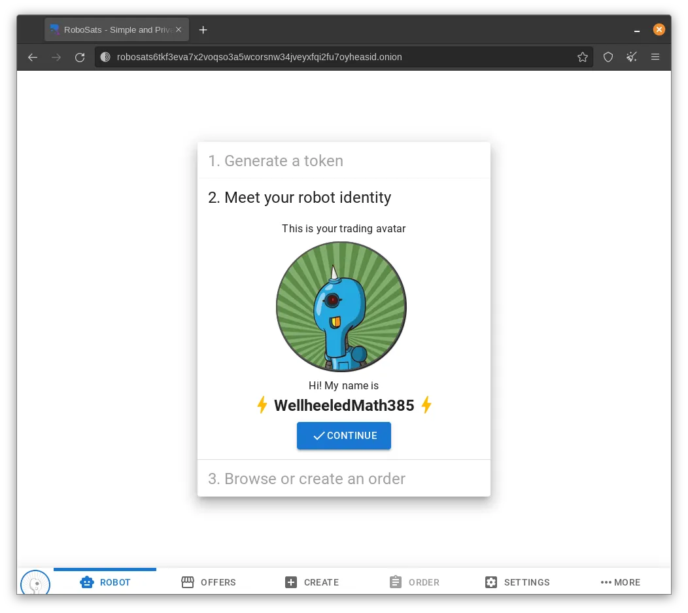
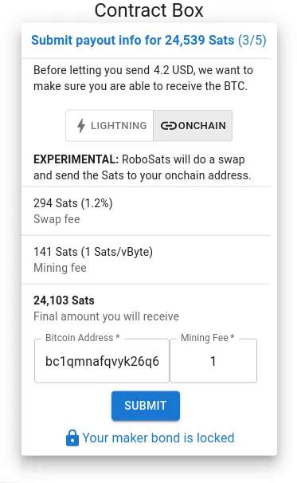
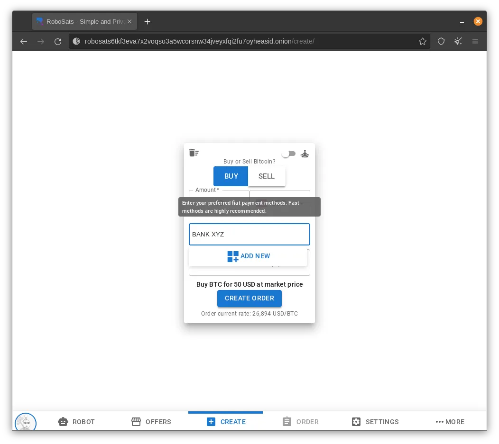

RoboSats (https://learn.robosats.com/) is an easy way to privately exchange Bitcoin for national currencies It simplifies the peer-to-peer experience and makes use lightning hold invoices to minimize custody and trust requirements.

## Guide

> This guide is from Bitocin Q&A ( https://bitcoiner.guide/robosats/). All credit to him, support him there (https://bitcoiner.guide/contribute); BitcoinQ&A is also a bitcoin mentor. Contact him for mentoring !

RoboSats - A simple and private Lightning based P2P exchange

## Before You Start

### Things you need to know

| Jargon       | Definition                                                                                                                                                                                     |
| ------------ | ---------------------------------------------------------------------------------------------------------------------------------------------------------------------------------------------- |
| Robot        | Your automatically generated private trade identity. Do not re-use the same robot more than once as this can degrade your privacy.                                                             |
| Token        | A string of random characters used to generate your unique robot.                                                                                                                              |
| Maker        | A user who creates an offer to buy or sell Bitcoin.                                                                                                                                            |
| Taker        | A user who takes another user up on their offer to buy or sell Bitcoin.                                                                                                                        |
| Bond         | An amount of Bitcoin locked up by both peers as a pledge to play fair and complete their part of the trade. Bonds are typically 3% of the total trade amount and are powered by Hodl Invoices. |
| Trade Escrow | Used by the seller as a method of holding the trade amount of Bitcoin, again using Hodl Invoices.                                                                                              |
| Fees         | RoboSats charges 0.2% of the trade amount, which is split between both maker and taker. The taker pays 0.175% and the maker pays 0.025%.                                                       |

## Things you need to have

### A Lightning Wallet

RoboSats is Lightning native, so you’re going to need a Lightning Wallet to fund the bond and receive the purchased sats as a buyer. You should take care when choosing your wallet, due to the technology used to make RoboSats function, not all are compatible.

If you’re a node runner, Zeus is by far the best option. If you don’t have your own node, I’d highly recommend Phoenix, a cross platform mobile wallet with simple setup and access to Lightning. Phoenix was used in the production of this guide.

### Some Bitcoin

Buyers and sellers need to fund a bond before any trade can take place. This is usually a very small amount (~3% of the trade amount), but is a prerequisite nonetheless.

Using RoboSats to buy your first sats? Why not get a friend to loan you the tiny amount required to get started!? If you’re flying solo, here are some other great options to obtain some noKYC sats to get you started.

### Access to RoboSats

Obviously you’re going to need to access RoboSats! There are four main ways in which you can do this:

1. Via Tor Browser (Recommended!)
2. Via a regular web-browser (Not recommended!)
3. Via the Android APK
4. Your own client

If you’re new to the Tor browser, learn more and download it [here](https://www.torproject.org/download/).

A quick note for iOS users looking to access RoboSats via Tor from their phones. ‘Onion Browser’ is not Tor Browser. Instead use Orbot + Safari and Orbot + DuckDuckGo.

## Buying Bitcoin

The following steps were conducted in May 2023 using version 0.5.0, accessed via the Tor browser. The steps should be identical for users accessing RoboSats via the Android APK.

At the time of writing RoboSats is still undergoing active development, so the interface may change a little in the future, but the basic steps required to complete the trade should remain largely unchanged.

> When you first load RoboSats you’ll be met with this landing page. Click Start.

Generate your token and store it somewhere safe like an encrypted notes app or password manager. This token can be used to recover your temporary Robot ID in the event that your browser or app closes mid way through a trade.

Meet your new Robot identity, then click Continue.

Click Offers to browse the order book. At the top of the page you can then filter to your preferences. Be sure to take note of the bond percentages and premium over the average exchange rate.

- Choose Buy
- Choose your currency
- Choose your payment method(s)

> Click on the offer you’d like to take. Enter the amount (in your chosen fiat currency) that you’d like to purchase from the seller, then have a final check of the details and click Take Order.

If the seller is not online (denoted by a red dot on their profile image), you’ll see a warning that the trade could take longer than usual. If you continue and the seller does not proceed in time, you’ll be compensated 50% of their bond amount for your wasted time.

Next, you need to lock up your trade bond by paying the invoice on screen. This is a hold invoice that freezes in your wallet. It will only be charged if you fail to complete your side of the trade.

In your Lightning Wallet, scan the QR code and pay the invoice.

Next, in your Lightning Wallet generate an invoice for the amount shown and paste into the space provided.

Wait for the seller to lock their trade amount. When this takes place, RoboSats will automatically move to the next step where the chat window will open. Say Hi and ask the seller for their fiat payment information. Once provided, send the payment via the chosen method then confirm this in RoboSats. All chat in RoboSats is PGP encrypted meaning only you and your trade peer can read the messages.

Once the seller confirms receipt of the payment, RoboSats automatically releases the payment using the invoice provided earlier.

When the invoice is paid, the trade is finished and your bond is unlocked. You’ll then see a trade summary.

Check your Lightning Wallet for confirmation that the sats have arrived.

## Additional Features

As well as the obvious buying and selling of Bitcoin, RoboSats has a few other features you should know about.
Robot Garage

Want to have multiple trades going at the same time, but don’t want to share the same identity across them? No problem! Click on the Robot tab, generate an additional Robot and create or take your next order.

### Creating Orders

As well as taking someone else’s offer, you can create your own and wait for another Robot to come to you.

- Open the Create page.
- Define if your order is to buy or sell Bitcoin.
- Enter the amount and currency you want to Buy/Sell with.
- Enter the payment method(s) you’re willing to use.
- Enter the ‘Premium over Market’ % you’re willing to accept. Note that this can be a negative figure to bid at a discount vs than the current market price.
- Click Create Order.
- Pay the Lightning invoice to lock your Maker Bond.
- Your order is now live. Sit back and wait for someone to accept it.

### On-chain Payouts

RoboSats is Lightning focused, but buyers do have the option to receive their sats to an on-chain Bitcoin address. Buyers can select this option after locking up their bond. After selecting on-chain, the buyer will see an overview of the fees. The additional fees for this service include:

- A swap fee collected by RoboSats - This fee is dynamic and moves depending on how busy the Bitcoin network is.
- A mining fee for the payout transaction - This is configurable by the buyer.

### P2P Swaps

RoboSats allows users to swap sats into or out of their Lightning Wallet. Simply click the swap button at the top of the offers page to view the current swap offers.

As the buyer of a ‘Swap In’ offer, you send on-chain Bitcoin to the peer and receive sats back, minus the advertised fees and/or premiums, to your Lightning Wallet. As the buyer of a ‘Swap Out’ offer, you send sats via Lightning and receive Bitcoin, minus any fees and/or premiums, to your on-chain address. Samourai or Sparrow Wallet users can also leverage the Stowaway feature to complete a swap.

RoboSats swap offers can also incorporate pegged alternatives to Bitcoin that include RBTC, LBTC and WBTC. You should take extreme care if interacting with these tokens as they all come with various tradeoffs. Pegged Bitcoin is not Bitcoin!

### Run your own RoboSats Client

Umbrel, Citadel and Start9 node runners can install their own RoboSats client directly onto their node. The benefits of doing so are listed as:

- Dramatically faster load times.
- Safer: you control what RoboSats client app you run.
- Access RoboSats safely from any browser / device. No need to use TOR if you are on your local network or using VPN: your node backend handles the torification needed for anonymization.
- Allows control over what P2P market coordinator you connect to (defaults to robosats6tkf3eva7x2voqso3a5wcorsnw34jveyxfqi2fu7oyheasid.onion)

## FAQ

### Can I be scammed?

As a buyer, if you’ve sent the fiat required for your side of the trade, but the seller fails to release the sats to you then you can open a dispute. If during this dispute process you can prove to the RoboSats arbitrators that you did send the fiat, the sellers escrowed funds and their trade bond will be released to you.
How do I cancel a trade?

You can cancel a trade after posting your bond by clicking the Collaborative Cancel button within the trade menu. If your trade peer is happy to cancel, you will incur no fees. But if your trade partner wants to complete the trade and you go ahead and cancel anyway, you’ll lose your trade bond.

### Does RoboSats work with ‘X’ payment method?

There are no restrictions on payment methods in RoboSats. If you don’t see any offers in your desired method, create your own offer using it!

### What does RoboSats learn about me when I use it?

Providing you use RoboSats via Tor or the Android app, nothing at all! Learn more here.

- Tor protects your network privacy.
- PGP encryption keeps your trade chat private.
- No accounts means one Robot per trade. This means RoboSats can’t correlate multiple trades to a single entity.

However, there are some caveats! Lightning is fairly private as a sender, but not as a receiver. If you receive to your own Lightning node, your node ID is shared in your invoices. This node ID gives anyone with knowledge of it a starting point to try and link your on-chain activity. This is also true if a user opts to receive their trade via an on-chain payout.

To mitigate this, users can opt to use a solution such as a Proxy Wallet for Lightning or Coinjoin for on-chain.

### Federation

Right now there is a single RoboSats coordinator operated by the RoboSats developer team. In Bitcoin, any form of centralisation makes for an easier target for governments or regulators who may not look fondly upon a specific service.

With RoboSats being an Open Source project, anybody could take the code and start running their own coordinator. Whilst this does somewhat decentralise the risk away from a single target, it also fragments an already thin liquidity market.

The RoboSats team realise this and have started work on a federated model. As an end user, this should not change the trade flow demonstrated above by much, but there will be extra views or screens for you to add or remove different coordinators that arise.

END of guide
https://bitcoiner.guide/robosats/
