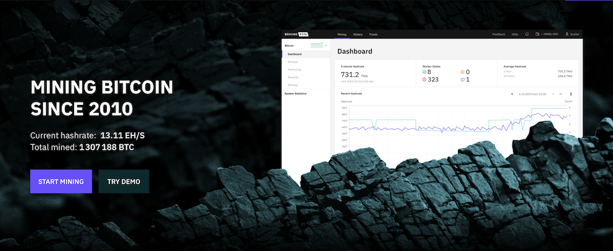

Braiins Pool, anciennement connue sous le nom de Slush Pool, est la toute première pool de minage de Bitcoin. Créée en novembre 2010, elle a miné son premier bloc le 16 décembre 2010, le bloc 97834.

En mai 2024, Braiins Pool possède une puissance de calcul de 13 EH/s, représentant environ 1,8 % du hashrate total de Bitcoin. Elle a miné un total de 1 307 188 bitcoins, soit environ 6 % des 21 millions de bitcoins qui existeront au maximum.

### Système de Rémunération

Depuis fin 2023, Braiins Pool a changé son système de rémunération en adoptant le système FPPS (Full Pay Per Share). Cela signifie que les mineurs reçoivent chaque jour les récompenses pour tout leur travail de la veille, même si la pool n'a pas trouvé de bloc. Cela diffère de l'ancien système où les mineurs ne recevaient une récompense qu'au moment où la pool trouvait un bloc.

### Frais de Pool

Les frais de Braiins Pool sont de 2,5 %, cependant si vous utiliser BraiinsOS sur vos machines les frais seront de 0%

### Retraits

**Retraits en Lightning**
Les retraits en Lightning permettent de retirer ses récompenses sans montant minimum une fois par jour via une adresse Lightning. 
Pour utiliser cette méthode, vous devez disposer d'un wallet compatible avec les adresses Lightning.

**Retraits On-Chain**
Les retraits On-Chain sont limités à un montant minimum et peuvent être soumis à des frais. 
Montant minimum : 20 000 sats
Frais : 10 000 sats pour les montants inférieurs à 500 000 sats
Gratuit pour les montants supérieurs à 500 000 sats
Les retraits peuvent être déclenchés par intervalle de temps ou par montant.

## Création du compte

 pour commencer à utiliser Braiins Pool [Rendez-vous sur leur site Internet](https://braiins.com/pool) puis cliquez sur "SIGN UP" en haut à droite

Rentrez vos informations et valider, vous recevrez ensuite par mail une demande de confirmation de votre adresse. Confirmer avec le lien dans le mail que vous avez reçus puis connectez vous à la platforme

## Ajouter un "worker"

Un worker est le mineur que vous allez connecter à la pool. Pour ajouter un nouveau mineur, cliquez sur "Workers" dans le menu latéral de gauche.

Puis sur le bouton violet "Connect Workers +".

Dans cette fenêtre, sélectionnez votre zone géographique.

Si le mineur que vous voulez connecter utilise BraiinsOS, sélectionnez le protocole "Stratum V2". Autrement, choisissez "Stratum V1".

Vous aurez les informations à renseigner sur la page web de votre mineur (reportez-vous à la documentation de votre mineur pour savoir où entrer ces informations).

Ici, **"stratum+tcp://eu.stratum.braiins.com:3333"** est l'URL de la pool.

**JimZap.workerName** est votre identifiant et le nom de votre mineur, où JimZap est l'identifiant et .workerName le nom du mineur. Si vous avez plusieurs mineurs, vous pouvez soit leur donner le même nom, auquel cas leur puissance de calcul sera additionnée sur le tableau de bord, soit leur donner un nom différent pour pouvoir les monitorer individuellement.

Et le mot de passe est toujours le même **"anything123"**

Une fois que vous aurez rentré ces informations sur la page web de votre mineur et qu'il aura commencé le minage, vous le verrez apparaître après quelques minutes sur le Dashboard de Braiins Pool.

## Présentation du Dashboard

Dans le bandeau supérieur, vous pouvez voir le hashrate total moyen de tous vos mineurs sur 5 minutes, 1h et 24h. Et un récapitulatif du nombre de mineurs en ligne ou hors ligne.
En dessous, un graphique permet de suivre l'évolution de votre puissance de calcul.

Sous ce graphique vous avez plusieurs informations sur vos récompenses en sats.

**"Today's Mining Rewards"** Indique le nombre de sats que vous avez minés dans la journée. À la fin de la journée, cette valeur sera réinitialisée à 0 et les sats seront envoyés sur votre compte.

**"Yesterday's Total Reward"** Le nombre de sats que vous avez miné la veille

**"Est. Profitability (1 TH/s)"** Est une estimation du nombre de sats que vous gagnez en une journée pour une puissance de calcul de 1 TH/s. Par exemple, si la valeur est de 77 sats, et que vous avez une puissance de calcul de 10 TH/s de manière ininterrompue pendant toute la journée, alors vous gagnerez en théorie 77 x 10 = 770 sats par jour.

**"All Time Reward"** Le total de sats que vous avez minés avec Braiins Pool

**"Reward Scheme"** Le taux de frais appliqué par la pool

**"Next Payout ETA"** Estimation du temps qu'il faudra avant de pouvoir retirer les sats de la plateforme. Ici, l'estimation n'affiche rien car le minage est en cours seulement depuis quelques minutes.

**"Account Balance"** Le nombre de sats disponibles sur votre compte, que vous pourrez ensuite retirer.

## Paramétrer les retraits

Vous pouvez retirer vos récompenses soit on-chain, soit en lightning avec une adresse.

En haut, cliquez sur "Funds". Par défaut, vous avez un compte "Bitcoin Account". Vous pouvez en créer d'autres pour partager les récompenses. Nous y reviendrons dans la section suivante.

Pour le moment, cliquez sur "Set up".

Dans cette nouvelle fenêtre, vous pouvez choisir "Onchain payout". 

Donnez un nom à ce wallet, une adresse BTC, et choisissez le type de déclencheur que vous voulez. "Threshold" signifie que le paiement sera déclenché quand vous aurez cumulé un montant défini de BTC, et avec "Time interval", le paiement sera déclenché à intervalles réguliers (jour/semaines/mois).

À savoir que le montant minimum est de 0.0002 BTC et qu'en dessous de 0.005 BTC, des frais de 0.0001 BTC seront appliqués.

## Partager les récompences

