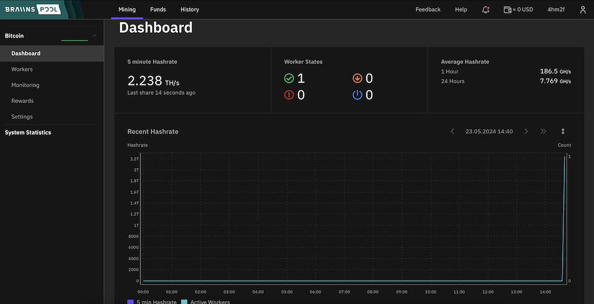
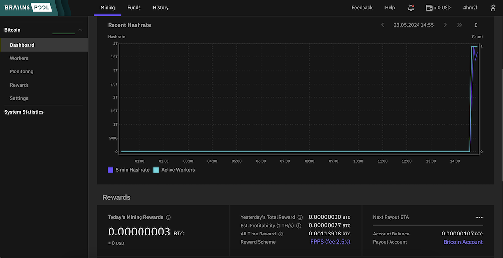

Braiins Pool, anteriormente conhecido como Slush Pool, é o primeiro pool de mineração de Bitcoin. Estabelecido em novembro de 2010, minerou seu primeiro bloco em 16 de dezembro de 2010, bloco 97834.

Em maio de 2024, o Braiins Pool possui uma capacidade computacional de 13 EH/s, representando cerca de 1,8% do hashrate total do Bitcoin. Minou um total de 1.307.188 bitcoins, o que representa aproximadamente 6% dos 21 milhões máximos de bitcoins que existirão.

### Sistema de Compensação

Desde o final de 2023, o Braiins Pool mudou seu sistema de compensação para adotar o sistema FPPS (Full Pay Per Share). Isso significa que os mineradores recebem recompensas todos os dias por todo o seu trabalho do dia anterior, mesmo que o pool não tenha encontrado um bloco. Isso difere do sistema antigo onde os mineradores só recebiam uma recompensa quando o pool encontrava um bloco.

**Vale ressaltar, [segundo um tweet de Mononaut](https://x.com/mononautical/status/1777686545715089605) que analisa a TimeChain do Bitcoin, que muitos pools de mineração usando o sistema FPPS enviariam os bitcoins minerados para um endereço da AntPool, o que significaria que a AntPool controla o hashrate de todos esses pools, cerca de 47% do hashrate global do Bitcoin. Isso é uma péssima notícia para a descentralização da rede.**

### Taxas do Pool

As taxas para o Braiins Pool são de 2,5%, no entanto, se você usar o BraiinsOS em suas máquinas, as taxas serão de 0%

### Saques

**Saques via Lightning**
Os saques via Lightning permitem que você retire suas recompensas sem um valor mínimo uma vez por dia através de um endereço Lightning.
Para usar este método, você deve ter uma carteira compatível com endereços Lightning.

**Saques On-Chain**
Os saques On-Chain são limitados a um valor mínimo e podem estar sujeitos a taxas.
Valor mínimo: 20.000 sats
Taxas: 10.000 sats para valores abaixo de 500.000 sats
Grátis para valores acima de 500.000 sats
Os saques podem ser acionados por intervalo de tempo ou por quantidade.

## Criação de Conta

Para começar a usar o Braiins Pool [acesse o site deles](https://braiins.com/pool) e clique em "SIGN UP" no canto superior direito

Insira suas informações e valide, você então receberá um e-mail solicitando a confirmação do seu endereço. Confirme com o link no e-mail recebido e então faça login na plataforma

## Adicionando um "trabalhador"
Um trabalhador é o minerador que você conectará ao pool. Para adicionar um novo minerador, clique em "Workers" no menu lateral esquerdo.

Em seguida, clique no botão roxo "Connect Workers +".

Nesta janela, selecione sua área geográfica.

Se o minerador que você deseja conectar usa BraiinsOS, selecione o protocolo "Stratum V2". Caso contrário, escolha "Stratum V1".

Você terá as informações para inserir na página web do seu minerador (consulte a documentação do seu minerador para saber onde inserir essas informações).

Aqui, **"stratum+tcp://eu.stratum.braiins.com:3333"** é a URL do pool.
**JimZap.workerName** é o seu identificador e o nome do seu minerador, onde JimZap é o identificador e .workerName é o nome do minerador. Se você tiver múltiplos mineradores, pode dar a eles o mesmo nome, caso em que o poder de computação deles será somado no painel de controle, ou dar nomes diferentes para monitorá-los individualmente.
E a senha é sempre a mesma **"anything123"**

Uma vez que você tenha inserido essa informação na página web do seu minerador e ele tenha começado a minerar, você verá ele aparecer após alguns minutos no Painel de Controle da Braiins Pool.

## Visão Geral do Painel

No banner superior, você pode ver a taxa de hash total média de todos os seus mineradores ao longo de 5 minutos, 1 hora e 24 horas. E um resumo do número de mineradores online ou offline.
Abaixo, um gráfico permite que você acompanhe a evolução do seu poder de computação.

Abaixo deste gráfico, você tem várias informações sobre suas recompensas em sats.

**"Recompensas de Mineração de Hoje"** Indica o número de sats que você minerou hoje. No final do dia, esse valor será reiniciado para 0 e os sats serão enviados para sua conta.

**"Recompensa Total de Ontem"** O número de sats que você minerou no dia anterior

**"Rentabilidade Estimada (1 TH/s)"** É uma estimativa do número de sats que você ganha em um dia para um poder de computação de 1 TH/s. Por exemplo, se o valor for 77 sats, e você tiver um poder de computação de 10 TH/s continuamente ao longo do dia, então você teoricamente ganharia 77 x 10 = 770 sats por dia.

**"Recompensa Total"** Os sats totais que você minerou com a Braiins Pool

**"Esquema de Recompensa"** A taxa de comissão aplicada pela pool

**"Próximo Pagamento Estimado"** Estimativa do tempo que levará antes que você possa retirar os sats da plataforma. Aqui, a estimativa não mostra nada porque a mineração só está em andamento há alguns minutos.

**"Saldo da Conta"** O número de sats disponíveis em sua conta, que você pode então retirar.
## Configurando Saques
Você pode retirar suas recompensas tanto on-chain quanto via lightning com um endereço.

No topo, clique em "Funds". Por padrão, você tem uma "Conta Bitcoin". Você pode criar outras para compartilhar as recompensas. Voltaremos a isso na próxima seção.

Por agora, clique em "Set up".

Nesta nova janela, você pode escolher "Pagamento on-chain".

Nomeie esta carteira, forneça um endereço BTC e selecione o tipo de gatilho que você deseja. "Threshold" significa que o pagamento será acionado quando você tiver acumulado uma quantidade definida de BTC, e com "Intervalo de Tempo", o pagamento será acionado em intervalos regulares (dia/semanas/meses).

Note que o valor mínimo é 0.0002 BTC e que abaixo de 0.005 BTC, uma taxa de 0.0001 BTC será aplicada.

Se você quiser usar saques via Lightning, você precisará de uma carteira que forneça um endereço Lightning. Por exemplo, você pode usar getAlby.

Clique no topo da janela em "Pagamento via Lightning".

Insira seu endereço Lightning e marque a caixa "Eu entendo..." e então valide.

Com este método de saque, suas recompensas serão enviadas para sua carteira todos os dias.

Uma vez que você tenha validado suas configurações de pagamento, você receberá um email de confirmação.

## Compartilhando Recompensas

Braiins Pool também permite que você compartilhe suas recompensas entre várias carteiras.

Para fazer isso, clique no topo em "Mining" e então à esquerda em "Settings".

Nesta página, você poderá adicionar outra "Financial Account" clicando em "Add Another Financial Account" e distribuir suas recompensas em % entre estas diferentes contas às quais você deve associar uma carteira. Para associar uma nova carteira a uma Financial Account, consulte a seção anterior.