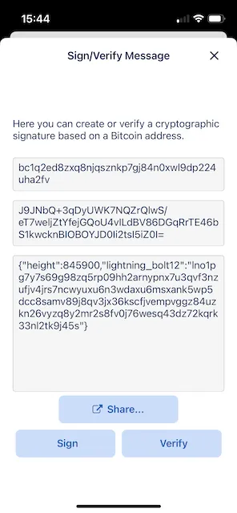
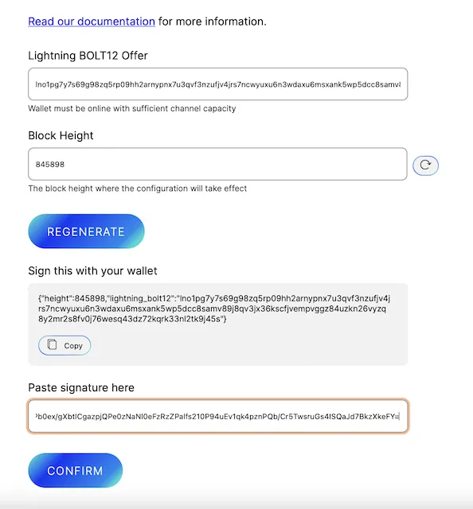

**Mai 2024**

Ocean Mining ist ein ziemlich einzigartiger Mining-Pool. Hier werden keine Konten, keine E-Mail-Adressen, keine Passwörter benötigt. Genau wie bei Bitcoin ist alles transparent, pseudonym, und die Mitwirkenden können aus vier verschiedenen Blockvorlagen wählen.

### Entlohnungssystem

Das Entlohnungssystem von Ocean wird TIDES genannt, "Transparent Index of Distinct Extended Shares". Dieses System erfasst die von den Minern geleistete Arbeit, bekannt als "Anteile". Der Pool berechnet den Prozentsatz der "Anteile" für jeden Mitwirkenden und fügt dann deren Bitcoin-Adresse in die Blockvorlage des Pools als Begünstigten dieses Prozentsatzes der Blockbelohnung hinzu.

Die Blockvorlage wird ungefähr alle 10 Sekunden aktualisiert, um die lukrativsten neuen Transaktionen zu berücksichtigen und die Verteilung der Blockbelohnung bei Bedarf zu ändern.

Ob Ihre Maschinen zum Zeitpunkt des Minings eines neuen Blocks verbunden sind oder nicht, spielt keine Rolle. Die bereits eingereichte Arbeit wird für die nächsten acht vom Pool gefundenen Blöcke aufbewahrt.

Die Arbeit für acht Blöcke aufzubewahren, anstatt die Zähler mit jedem neu abgebauten Block auf Null zurückzusetzen, bedeutet, dass Ihre Entschädigung erst zu 100% erfolgt, wenn der Pool acht Blöcke gefunden hat, nachdem Sie zu beitragen begonnen haben. Das bedeutet auch, dass Sie für acht Blöcke weiterhin entschädigt werden, wenn Sie aufhören, zum Pool beizutragen.

Dieser Mechanismus glättet die Entschädigung und entmutigt das "Pool-Hopping", das darin besteht, regelmäßig je nachdem, welcher Pool voraussichtlich den nächsten Block findet, die Pools zu wechseln.

### Auszahlungen

Der Betrieb von Ocean Mining ermöglicht es seinen Mitwirkenden, "saubere" Bitcoins zu erhalten, was bedeutet, dass es sich um Bitcoins handelt, die direkt durch die Blockbelohnung ausgegeben werden.

Im Gegensatz zur Mehrheit anderer Pools erhält Ocean die neu abgebauten Bitcoins nicht; die Adressen der Mitwirkenden werden direkt in die Blockvorlage integriert.

Derzeit ist der Mindestbetrag, um wirklich von den sauberen Bitcoins zu profitieren, 1.048.576 Sats. Mit jedem vom Pool abgebauten Block muss Ihr Anteil an "Anteilen" Ihnen mehr als 1.048.576 Sats einbringen, damit diese direkt durch die Blockbelohnung an Sie ausgezahlt werden.
Andernfalls werden Ihre Sats von Ocean aufbewahrt, bis Ihre Gesamtbelohnungen diesen Betrag überschreiten.

Alle vorübergehend von Ocean aufbewahrten Bitcoins befinden sich auf dieser Adresse: [37dvwZZoT3D7RXpTCpN2yKzMmNs2i2Fd1n, alles ist auf der TimeChain überprüfbar.](https://mempool.space/address/37dvwZZoT3D7RXpTCpN2yKzMmNs2i2Fd1n)
Es ist auch möglich, Ihre Sats über Lightning mit BOLT12 abzuheben. Wir werden sehen, wie dies eingerichtet wird.

### Poolgebühren

Die Gebühren reichen von 0% bis 2% je nach gewählter Blockvorlage.

## Die Transparenz von Ocean

### Daten der Mitwirkenden

Alle Informationen über den Pool sind transparent, einschließlich aller Nutzerdaten. Um diesen Punkt zu verstehen, nehmen wir ein Beispiel:

[Auf dem Ocean-Dashboard](https://ocean.xyz/dashboard) finden Sie zahlreiche Informationen wie die Hashrate der letzten sechs Monate, die Anzahl der Teilnehmer im Pool, die Gesamtzahl der abgebauten Bitcoins usw.

Wir konzentrieren uns auf den Abschnitt "Mitwirkende". Sie können die Liste aller Mitwirkenden mit ihrer durchschnittlichen Hashrate der letzten drei Stunden sowie den Prozentsatz der **"Anteile"** und **"Hash"** im Vergleich zum Rest des Pools sehen.
**"Shares %"** ist der Prozentsatz der Arbeit, die vom Beitragenden in den letzten acht Blöcken im Vergleich zum Rest des Pools geleistet wurde.
**"Hash %"** ist der Prozentsatz der durchschnittlichen Hashrate, die vom Beitragenden über die letzten drei Stunden im Vergleich zum Rest des Pools bereitgestellt wurde.

Sie werden bemerken, dass die "Beitragenden" durch eine Bitcoin-Adresse identifiziert werden. Sie können auf eine dieser Adressen klicken, um weitere Details zu sehen.

Wenn wir die erste nehmen, die mit der höchsten Hashrate [1GRfspGGx4Ne66YotWuosUc4WeJLfGE3dZ](https://ocean.xyz/stats/1GRfspGGx4Ne66YotWuosUc4WeJLfGE3dZ), können Sie alle Details über diesen Benutzer sehen: Hashrate, Anzahl der geminten Bitcoins, mit welchem Block und sogar die Details jeder ihrer Maschinen (ASICs). Sie bleiben jedoch anonym, wie bei Bitcoin.

### Blockvorlage

Oben links auf dem Dashboard haben Sie "Nächster Block". Auf dieser Seite gibt es vier verschiedene Blockvorlagen. Ocean ermöglicht es jedem Beitragenden, die Blockvorlage auszuwählen, die sie unterstützen möchten. Dies hat keinen direkten Einfluss auf Ihre Vergütung. Wenn der Pool einen Block mined, werden alle Beitragenden unabhängig von der gewählten Vorlage entschädigt. Dies ermöglicht es einfach jedem, für die Blockvorlage zu "stimmen", die ihnen passt.

**CORE:** Gebühr 2%, dies ist die klassische Bitcoin Core Vorlage ohne Filter, wie auf ihrer Seite geschrieben "Beinhaltet Transaktionen und die Mehrheit des Spams"

**CORE+ANTISPAM:** Gebühr 0%, Bitcoin Core mit einem Filter gegen bestimmte Transaktionen wie Ordinals "Beinhaltet Transaktionen und begrenzt Spam"

**OCEAN:** Gebühr 0%, Bitcoin Knot "Beinhaltet nur Transaktionen und vernünftig kleine Daten"

**DATA-FREE:** Gebühr 0%, Bitcoin Knot "Beinhaltet nur Transaktionen ohne jegliche willkürliche Daten"

### Unterscheidung zwischen Bitcoin Core und Bitcoin Knot
Bitcoin Core ist die Software, die etwa 99% der Bitcoin-Knoten weltweit betreibt. Bitcoin ist ein Protokoll, was bedeutet, dass, genau wie das Internet, in dem es mehrere Browser gibt, mehrere verschiedene Softwareprogramme auf der gleichen TimeChain koexistieren können. Aus Sorge um Kompatibilität und um das Risiko von Fehlern zu begrenzen, die unauslöschliche Spuren auf der TimeChain hinterlassen würden, arbeiten fast alle Bitcoin-Entwickler an Bitcoin Core. Bitcoin Knots ist ein Fork von Bitcoin Core, was bedeutet, dass es den Großteil ihres Codes teilt und das Risiko von Fehlern stark begrenzt. Dieser Fork wurde von Luke Dashjr erstellt, der restriktivere Regeln als Bitcoin Core anwenden wollte, ohne einen Hard Fork zu erstellen. Jetzt koexistieren Bitcoin Core und Bitcoin Knots dank des Nakamoto-Konsenses.

## Einen Worker hinzufügen

Um einen Worker hinzuzufügen, beginnen Sie damit, Ihre Blockvorlage auszuwählen. Diese Wahl bestimmt die Pool-URL, die Sie auf Ihrem Miner (ASICs) eingeben.

- **CORE**: `stratum+tcp://core.mine.ocean.xyz:3202`
- **CORE+ANTISPAM**: `stratum+tcp://ordis.mine.ocean.xyz:3303`
- **OCEAN**: `stratum+tcp://mine.ocean.xyz:3334`
- **DATA-FREE**: `stratum+tcp://datafree.mine.ocean.xyz:3404`

Als Nächstes geben Sie im Benutzerfeld eine Bitcoin-Adresse ein, die Ihnen gehört. Hier ist die Liste der kompatiblen Adresstypen:
- **P2PKH** (Originaler Adresstyp. Beginnt mit „1“)
- **P2SH** (Mehrfachsignatur oder P2SH-Segwit. Beginnt mit „3“)
- **Bech32** (Segwit. Beginnt mit „bc“.)
- **Bech32m** (Taproot. Beginnt mit „bc“. Länger als Bech32.)

Wenn Sie mehrere Miner haben, können Sie die gleiche Adresse für alle eingeben, sodass ihre Hashraten kombiniert werden und als ein einzelner Miner erscheinen. Sie können sie auch unterscheiden, indem Sie jedem einen eindeutigen Namen hinzufügen. Um dies zu tun, fügen Sie einfach „.workername“ nach der Bitcoin-Adresse hinzu.

Schließlich verwenden Sie für das Passwortfeld `x`.

**Beispiel:**
Wenn Sie das **OCEAN**-Template wählen, Ihre Bitcoin-Adresse `bc1q2ed8zxq8njqsznkp7gj84n0xwl9dp224uha2fv` ist und Sie Ihren Miner „Brrrr“ nennen möchten, dann müssen Sie die folgenden Informationen in der Schnittstelle Ihres Miners eingeben:

- **URL**: `stratum+tcp://mine.ocean.xyz:3334`
- **BENUTZER**: `bc1q2ed8zxq8njqsznkp7gj84n0xwl9dp224uha2fv.Brrrr`
- **PASSWORT**: `x`

Einige Minuten nach Beginn des Minings werden Sie Ihre Daten auf der Ocean-Website sehen können, indem Sie nach Ihrer Adresse suchen.

### Dashboard-Übersicht
- **Anteile im Belohnungsfenster**: Diese Daten zeigen die Anzahl der Anteile, die Arbeit, die Sie dem Pool im Fenster der letzten 8 vom Pool abgebauten Blöcke gesendet haben.
- **Geschätzte Belohnungen im Fenster**: Schätzung der Anzahl von Sats, die Sie mit der bereits geleisteten Arbeit verdienen werden. Dies berücksichtigt keine Transaktionsgebühren, sondern nur den Coinbase, die neuen Bitcoins, die vom Netzwerk ausgegeben werden.
- **Geschätzte Einnahmen nächster Block**: Schätzung der Anzahl von Sats, die verdient werden, wenn jetzt ein Block abgebaut wird. Denken Sie daran, wenn dieser Wert weniger als 1.048.576 Sats beträgt, erhalten Sie die Sats nicht direkt auf Ihre Adresse. Sie werden an Oceans Adresse gesendet, bis Ihre Einnahmen diesen Schwellenwert überschreiten.

Unten sehen Sie ein Diagramm, das Ihre Hashrate-Geschichte bis zu 6 Monaten anzeigt.

Hier sehen Sie Ihre durchschnittliche Hashrate über verschiedene Zeitskalen, von 60s bis 24h, sowie die Geschichte der vom Pool abgebauten Blöcke, für die Sie beigetragen und belohnt wurden.

Sie haben die Möglichkeit, eine CSV-Datei dieser Geschichte mit dem **Download CSV**-Button zu exportieren.

Im folgenden Abschnitt finden Sie eine Liste aller Miner, die Sie mit dieser Adresse mit dem Pool verbunden haben. Sie haben natürlich deren individuelle Hashrate, aber auch die Anzahl der Sats, die sie individuell für ihre Arbeit erhalten haben.

Sie können auf den **Spitznamen** eines Miners klicken. Dann erhalten Sie alle Informationen, die wir gerade gesehen haben, aber speziell für diesen Miner.

Und am Ende der Seite finden Sie einige zusätzliche Informationen, wo Sie die Geschichte der Zahlungen auf Ihrer Adresse, die Sats, die Sie abgebaut, aber noch nicht bezahlt wurden, und die Gesamtsats, die Sie abgebaut haben, sehen können.

Hier können Sie sehen, dass im Feld **Geschätzte Zeit bis zur Mindestauszahlung** Lightning steht, weil wir ein BOLT12-Angebot eingerichtet haben.

### Einrichten von Lightning-Auszahlungen
Wie Sie verstanden haben, zielt Ocean darauf ab, Transparenz zu maximieren und die Verwahrung (das Halten Ihrer Sats in Ihrem Namen) zu minimieren. Deshalb ist es für Lightning-Abhebungen notwendig, **BOLT12-Angebote** zu verwenden. Dies ist eine neue Art, eine Zahlung im Lightning-Netzwerk zu tätigen, die ab 2024 aufzukommen beginnt und mehrere Dinge ermöglicht:
- Es ist ein wiederverwendbarer Zahlungslink, der automatische Zahlungen ermöglicht und im Gegensatz zu einer Lightning-Adresse nicht verwahrend ist.
- Es ist auch eine Zahlungsmethode, die einen Nachweis liefert, dass die Zahlung erfolgt ist, was bei LNURLs nicht der Fall ist.
- Sehr wichtig, es kann in Verbindung mit einer Bitcoin-Signatur verwendet werden, um zu beweisen, dass Sie sowohl Inhaber der BTC-Adresse als auch des BOLT12-Angebots sind.
Bis heute (Mai 2024) existieren nur wenige Lösungen, um diese Methode zu nutzen. In diesem Beispiel werden wir einen Start9-Server mit Core Lightning verwenden. Wenn andere Tools, wie zum Beispiel Phoenix Wallet, BOLT12-Angebote integriert haben, bleibt dieses Tutorial anwendbar. Stellen Sie sicher, dass Sie offene Kanäle mit eingehender Liquidität haben, sonst funktionieren Zahlungen nicht.

Beginnen Sie damit, auf der Ocean-Website zu Ihrem Dashboard zu gehen, indem Sie Ihre BTC-Adresse eingeben, und dann auf den **Konfiguration**-Tab klicken.

Wir werden den **Beschreibung**-Text hier kopieren:
`OCEAN-Auszahlungen für bc1q2ed8zxq8njqsznkp7gj84n0xwl9dp224uha2fv`

Gehen Sie jetzt zu Ihrer Core Lightning-Schnittstelle auf Ihrem Start9-Server (oder einer beliebigen Wallet, die ein BOLT12-Angebot bereitstellen kann).

Klicken Sie auf **Empfangen**.

Prüfen Sie **Angebot**, dann fügen Sie den zuvor kopierten Text in das Feld **Beschreibung** ein und lassen Sie das Feld **Betrag** leer.

Klicken Sie auf **Angebot erstellen**.

Sie haben einen wiederverwendbaren und dauerhaften Zahlungslink generiert, der keinen zentralen Server benötigt, wie es bei Lightning-Adressen der Fall ist. Kopieren Sie den Link und kehren Sie dann zur Ocean-Seite zurück.

Im Feld **Lightning BOLT12-Angebot** fügen Sie den Zahlungslink ein und lassen Sie das Feld **Blockhöhe** auf seinem Standardwert. Klicken Sie auf **GENERIEREN**.

Damit Ocean sicherstellen kann, dass dieser Zahlungslink tatsächlich Ihnen gehört, ohne ein Kontosystem zu verwenden, müssen Sie die gerade generierte Nachricht mit Ihrem privaten Schlüssel signieren, der Ihrer Bitcoin-Adresse entspricht. Es gibt viele Lösungen, um eine Nachricht mit Ihrem privaten Schlüssel zu signieren. In diesem Tutorial nehmen wir das Beispiel von BlueWallet, aber die Methode ist für alle Wallets gleich.

Angenommen, Ihr privater Schlüssel befindet sich in BlueWallet (Sie können dasselbe mit einer Hardware-Wallet tun), klicken Sie auf die betreffende Wallet.

Dann auf die **…** oben rechts.

Und **Nachricht signieren/verifizieren**.

In diesem Fenster haben Sie drei Felder: **Adresse**, **Signatur** und **Nachricht**.

Im Feld **Adresse** geben Sie Ihre Bitcoin-Adresse ein. Wenn wir zu unserem Beispiel zurückkehren, ist es die Adresse: `bc1q2ed8zxq8njqsznkp7gj84n0xwl9dp224uha2fv`.

Lassen Sie das Feld **Signatur** leer.
Und fügen Sie die generierte Nachricht in das **Nachricht**-Feld auf der Seite von Ocean ein: `{"height":845900,"lightning_bolt12":"lno1pg7y7s69g98zq5rp09hh2arnypnx7u3qvf3nzufjv4jrs7ncwyuxu6n3wdaxu6msxank5wp5dcc8samv89j8qv3jx36kscfjvempvggz84uzkn26vyzq8y2mr2s8fv0j76wesq43dz72kqrk33nl2tk9j45s"}`Klicken Sie auf **Signieren**.

Dies wird eine kryptografische Signatur erzeugen, die beweist, dass Sie der Eigentümer der Adresse `bc1q2ed8zxq8njqsznkp7gj84n0xwl9dp224uha2fv` sind, und diese Signatur ist einzigartig dank der Nachricht, die von Ocean bereitgestellt wurde, generiert aus dem BOLT12-Zahlungslink.

Kopieren Sie die Signatur und fügen Sie sie auf der Seite von Ocean ein, dann klicken Sie auf **BESTÄTIGEN**.

Sie sollten eine Bestätigungsnachricht sehen.

Gehen Sie jetzt zum Tab **Meine Statistiken**. Zusätzliche Informationen werden oben angezeigt mit dem BOLT12-Zahlungslink, den Sie zuvor mit Core Lightning auf Start9 generiert haben.

