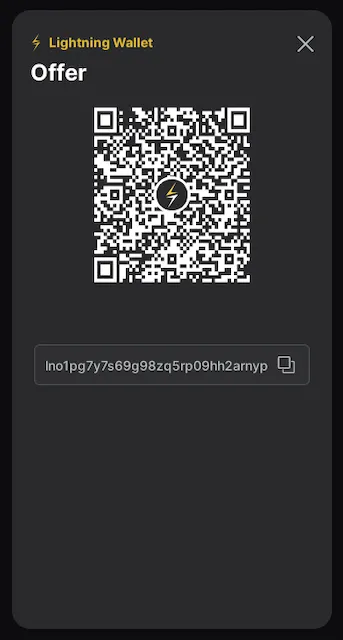
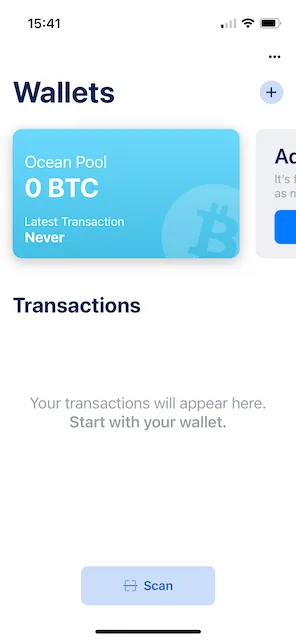
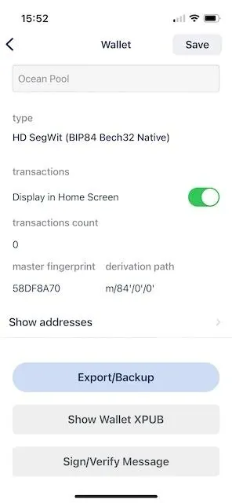

**Mai 2024**

Ocean Mining est une pool de minage un peu particulière. Ici, pas de compte, pas d'adresse e-mail, pas de mot de passe. A l'image de Bitcoin tout est transparent, pseudonyme et les contributeurs peuvent choisir parmi quatre blocs templates différents.

### Système de rémunération

Le système de rémunération d'Ocean s'appelle TIDES, "Transparent Index of Distinct Extended Shares". Ce système enregistre le travail fourni par les mineurs, ce que l'on appelle les "shares". La pool calcule le pourcentage de "shares" de chaque contributeur, puis ajoute leur adresse Bitcoin dans le bloc template de la pool comme bénéficiaire de ce pourcentage de la récompense de bloc. 

Le bloc template est actualisé environ toutes les 10 secondes pour prendre en compte les nouvelles transactions les plus rémunératrices et pour changer la répartition de la récompense de bloc si nécessaire.

Que vos machines soient connectées ou non au moment ou la pool mine un nouveau bloc n'a pas d'importance. Le travail déjà envoyé est conservé pendant les huit prochains blocs trouvés par la pool.

Le fait de conserver le travail pendant huit blocs au lieu de remettre les compteurs à zéro à chaque nouveau bloc miné implique que votre rémunération sera à 100 % seulement une fois que la pool aura trouvé huit blocs après que vous ayez commencé à contribuer. Cela veut aussi dire que vous continuerez à être rémunéré pendant huit blocs si vous arrêtez de contribuer à la pool. 

Ce mécanisme permet à la fois de lisser la rémunération et de décourager le « pool hopping », qui consiste à changer de pool régulièrement en fonction de celle qui a le plus de probabilité de trouver le prochain bloc.

### Retraits

Le fonctionnement d'Ocean Mining permet à ses contributeurs de récupérer des bitcoins "blancs", c'est-à-dire des bitcoins qui sont directement émis par la récompence de bloc. 

Contrairement à la majorité des autres pools, Ocean ne reçoit pas les bitcoins nouvellement minés, les adresses des contributeurs sont directement intégrées dans le bloc template.

Pour le moment, le montant minimum pour réellement profiter des bitcoins blancs est de 1 048 576 sats. Il faut qu’à chaque bloc miné par la pool, votre part de « shares » vous donne droit à plus de 1 048 576 sats pour qu'ils vous soient directement payés par la récompense de bloc. 
Autrement, vos sats seront conservés par Ocean le temps que vos récompenses totales dépassent ce montant. 

Tous les bitcoins provisoirement conservés par Ocean sont sur cette adresse :  [37dvwZZoT3D7RXpTCpN2yKzMmNs2i2Fd1n, tous est vérifiable sur la TimeChain.](https://mempool.space/address/37dvwZZoT3D7RXpTCpN2yKzMmNs2i2Fd1n)

Il est également possible de retirer ses sats en Lightning via BOLT12. Nous verrons comment le paramétrer.

### Frais de pool

Les frais sont de 0 % à 2 % selon le bloc template choisi.

## La transparence d’Ocean

### Données contributeurs

Toutes les informations de la pool sont transparentes, y compris toutes les données utilisateurs. Pour comprendre ce point, nous allons prendre un exemple:

[Sur le dashboard d'Ocean](https://ocean.xyz/dashboard), vous avez de nombreuses informations comme le hashrate des six derniers mois, le nombre de participants à la pool, le nombre total de bitcoins minés, etc.

Nous allons nous intéresser à la partie "Contributors". Vous pouvez voir la liste de tous les contributeurs avec leur hashrate moyen sur les trois dernières heures ainsi que le pourcentage de **"shares"** et de **"hash"** par rapport au reste de la pool.

**« Shares % »** est le pourcentage de travail fourni par le contributeur dans la fenêtre des huit derniers blocs par rapport au reste de la pool.

**« Hash % »** est le pourcentage du hashrate moyen fourni par le contributeur sur les trois dernières heures par rapport au reste de la pool.

Vous constaterez que les "Contributors" sont identifiés par une adresse Bitcoin. Vous pouvez cliquer sur l’une de ces adresses pour avoir plus de détails. 

Si nous prenons la première, celle qui a le hashrate le plus élevé 
[1GRfspGGx4Ne66YotWuosUc4WeJLfGE3dZ](https://ocean.xyz/stats/1GRfspGGx4Ne66YotWuosUc4WeJLfGE3dZ), vous pourrez voir tous les détails concernant cet utilisateur : hashrate, nombre de bitcoins minés, avec quel bloc, et même le détail de chacune de ses machines (ASICs). Cependant, il reste pseudonyme, comme sur Bitcoin.

### Bloc template

En haut à gauche sur le dashboard, vous avez « Next block ». Sur cette page, vous avez quatre blocs templates différents. Ocean permet à chaque contributeur de choisir le bloc template qu’il souhaite soutenir. Cela n’a pas d’impact direct sur votre rémunération. Quand la pool mine un bloc, tous les contributeurs sont rémunérés indépendamment du template qu’ils ont choisi. Cela permet simplement à chacun de « voter » pour le bloc template qui lui correspond.

**CORE:** Frais 2 %, il s’agit du template classique Bitcoin Core sans filtre, comme écrit sur leur page « Inclut les transactions et la majorité du spam »

**CORE+ANTISPAM:** Frais 0 %, Bitcoin Core avec un filtre contre certaines transactions comme les Ordinals « Inclut les transactions et limite le spam »

**OCEAN:** Frais 0 %, Bitcoin Knot « Inclut seulement les transactions et les données raisonnablement petites »

**DATA-FREE:** Frais 0 %, Bitcoin Knot « Inclut seulement les transactions sans aucune donnée arbitraire »

### Distinction entre Bitcoin Core et Bitcoin Knot

Bitcoin Core est le logiciel qui permet de faire fonctionner environ 99 % des nœuds Bitcoin à travers le monde. Bitcoin est un protocole, ce qui signifie que, comme pour Internet, où il existe plusieurs navigateurs, il peut y avoir plusieurs logiciels différents qui cohabitent sur la même TimeChain. Cependant, par souci de compatibilité et pour limiter le risque de bugs qui laisseraient des traces indélébiles sur la TimeChain, la quasi-totalité des développeurs Bitcoin travaillent sur Bitcoin Core. Bitcoin Knot est un fork de Bitcoin Core, ce qui signifie qu’il partage la majorité de leur code, limitant grandement le risque de bugs. Ce fork a été créé par Luke Dashjr, qui souhaitait appliquer des règles plus restrictives que Bitcoin Core sans créer de hard fork. Désormais, Bitcoin Core et Bitcoin Knot cohabitent grâce au consensus de Nakamoto.

## Ajouter un Worker

Pour ajouter un worker, commencez par choisir votre bloc template. Ce choix déterminera l’URL de la pool à renseigner sur votre mineur (ASICs).

- **CORE** : `stratum+tcp://core.mine.ocean.xyz:3202`
- **CORE+ANTISPAM** : `stratum+tcp://ordis.mine.ocean.xyz:3303`
- **OCEAN** : `stratum+tcp://mine.ocean.xyz:3334`
- **DATA-FREE** : `stratum+tcp://datafree.mine.ocean.xyz:3404`

Ensuite, pour le champ user, renseignez une adresse Bitcoin que vous possédez. Voici la liste des types d’adresses compatibles :
- **P2PKH** (Original address type. Begins with “1”)
- **P2SH** (Multisignature or P2SH-Segwit. Begins with “3”)
- **Bech32** (Segwit. Begins with “bc”.)
- **Bech32m** (Taproot. Begins with “bc”. Longer than Bech32.)

Si vous avez plusieurs mineurs, vous pouvez entrer la même adresse sur tous pour que leurs hashrates soient additionnés et apparaissent comme un seul mineur. Vous pouvez également les distinguer en ajoutant un nom distinct à chacun. Pour cela, ajoutez simplement « .workername » après l’adresse Bitcoin.

Enfin, pour le champ password, utilisez `x`.

**Exemple :**
Si vous choisissez le template **OCEAN**, que votre adresse Bitcoin est `bc1q2ed8zxq8njqsznkp7gj84n0xwl9dp224uha2fv` et que vous souhaitez nommer votre mineur « Brrrr », alors vous devrez renseigner les informations suivantes dans l’interface de votre mineur :

- **URL** : `stratum+tcp://mine.ocean.xyz:3334`
- **USER** : `bc1q2ed8zxq8njqsznkp7gj84n0xwl9dp224uha2fv.Brrrr`
- **PASSWORD** : `x`

Quelques minutes après avoir commencé le minage, vous pourrez voir vos données sur le site d'Ocean en recherchant votre adresse.

### Présentation du Dashboard

- **Shares in Reward Window** : Cette donnée indique le nombre de shares, le travail que vous avez envoyé à la pool dans la fenêtre des 8 derniers blocs minés par la pool.
- **Estimated Rewards in Windows** : Estimation du nombre de sats que vous allez gagner avec le travail déjà effectué. Cela ne prend pas en compte les frais de transaction, mais seulement la coinbase, les nouveaux bitcoins émis par le réseau.
- **Estimated Earnings Next Block** : Estimation du nombre de sats gagnés si un bloc est miné maintenant. Pour rappel, si cette valeur est inférieure à 1 048 576 sats, vous ne recevrez pas directement les sats sur votre adresse. Ils seront envoyés sur l’adresse d'Ocean en attendant que vos gains dépassent ce seuil.

En-dessous, vous avez un graphe qui affiche l’historique de votre hashrate jusqu’à 6 mois.

Ici, vous avez votre hashrate moyen sur différentes échelles de temps, de 60s à 24h, ainsi que l’historique des blocs minés par la pool pour lesquels vous avez contribué et été récompensé.

Vous avez la possibilité d’exporter un fichier CSV de cet historique avec le bouton **Download CSV**

Dans la partie suivante, vous avez la liste de tous les mineurs que vous avez connectés à la pool avec cette adresse. Vous avez, bien sûr, leur hashrate individuel, mais aussi le nombre de sats qu’ils ont reçus individuellement pour leur travail.

Vous pouvez cliquer sur le **Nickname** de n’importe quel mineur. Vous aurez alors toutes les informations que l’on vient de voir, mais spécifiquement pour ce mineur.

Et tout en bas de la page, quelques informations additionnelles où vous pourrez voir l’historique des paiements sur votre adresse, les sats que vous avez minés mais qui n’ont pas encore été payés, et le total des sats que vous avez minés.

Ici, vous pouvez voir que dans la case **Estimated Time Until Minimum Payout**, il est écrit Lightning car nous avons paramétré un BOLT12 offer.

### Paramétrer les retraits en Lightning

Comme vous l'avez compris, Ocean cherche à mettre en place un maximum de transparence et un minimum de custody (détenir vos sats à votre place).

C'est pourquoi, pour les retraits en Lightning, il est nécessaire d'utiliser les **BOLT12 offers**. C'est une nouvelle manière d'effectuer un paiement sur le réseau Lightning qui commence à émerger en 2024 et qui permet plusieurs choses :
- C'est un lien de paiement réutilisable, permettant de faire des paiements automatiques et, contrairement à une adresse Lightning, le BOLT12 est non-custodial.
- C'est également une méthode de paiement qui permet d'avoir une preuve que le paiement a été effectué, ce qui n'est pas le cas avec des LNURL.
- Très important, il peut être utilisé conjointement avec une signature Bitcoin pour prouver que vous êtes à la fois le détenteur de l’adresse BTC et du BOLT12 offer.

À ce jour (mai 2024), peu de solutions existent pour utiliser cette méthode. Dans cet exemple, nous allons utiliser un serveur Start9 avec Core Lightning. Quand d'autres outils, comme Phoenix Wallet par exemple, auront intégré les BOLT12 offers, ce tutoriel restera applicable. Assurez-vous que vous avez des canaux ouverts avec de la liquidité entrante, sinon les paiements ne fonctionneront pas.

Commencez par aller sur votre dashboard sur le site d'Ocean en renseignant votre adresse BTC, puis cliquez sur l’onglet **Configuration**.

Nous allons copier le texte de **Description**, ici :
`OCEAN Payouts for bc1q2ed8zxq8njqsznkp7gj84n0xwl9dp224uha2fv`

Allez maintenant sur votre interface Core Lightning sur votre serveur Start9 (ou n’importe quel wallet capable de fournir un BOLT12 offer).

Cliquez sur **Receive**.

Cochez **Offer**, puis collez le texte précédemment copié dans le champ **Description** et laissez le champ **Amount** vide.

Cliquez sur **Generate Offer**.

Vous avez généré un lien de paiement réutilisable et permanent qui ne nécessite pas de serveur central comme c’est le cas avec les adresses Lightning. Copiez le lien puis retournez sur la page d'Ocean.

Dans le champ **Lightning BOLT12 Offer**, collez le lien de paiement et laissez le champ **Block Height** à sa valeur par défaut. Cliquez sur **GENERATE**.

Pour qu'Ocean puisse s’assurer que ce lien de paiement est bien le vôtre sans pour autant utiliser un système de compte, vous allez devoir signer le message qui vient d’être généré avec votre clé privée correspondant à l’adresse Bitcoin que vous utilisez. De nombreuses solutions existent pour signer un message avec votre clé privée. Dans ce tutoriel, nous prendrons l’exemple de BlueWallet, mais la méthode est la même pour tous les wallets.

En admettant que votre clé privée est dans BlueWallet (vous pouvez faire la même chose avec un hardware wallet), cliquez sur le wallet concerné.

Puis sur les **…** en haut à droite.

Et **Sign/Verify Message**.

Dans cette fenêtre, vous avez trois champs : **Adresse**, **Signature** et **Message**.

Dans le champ **Adresse**, entrez votre adresse Bitcoin. Si l’on reprend notre exemple, il s’agit de l’adresse : `bc1q2ed8zxq8njqsznkp7gj84n0xwl9dp224uha2fv`.

Laissez le champ **Signature** vide.

Et collez le message généré sur la page d'Ocean dans le champ **Message** : `{"height":845900,"lightning_bolt12":"lno1pg7y7s69g98zq5rp09hh2arnypnx7u3qvf3nzufjv4jrs7ncwyuxu6n3wdaxu6msxank5wp5dcc8samv89j8qv3jx36kscfjvempvggz84uzkn26vyzq8y2mr2s8fv0j76wesq43dz72kqrk33nl2tk9j45s"}`

Cliquez sur **Sign**.

Cela va générer une signature cryptographique qui prouve que vous êtes le propriétaire de l’adresse `bc1q2ed8zxq8njqsznkp7gj84n0xwl9dp224uha2fv`, et cette signature est unique grâce au message fourni par Ocean, généré à partir du lien de paiement BOLT12.

Copiez la signature et collez-la sur la page d'Ocean, puis cliquez sur **CONFIRM**.

Vous devriez voir un message de confirmation.

Allez maintenant sur l’onglet **My Stats**. Une information supplémentaire s’affiche en haut avec le lien de paiement BOLT12 que vous avez généré précédemment avec Core Lightning sur Start9.

