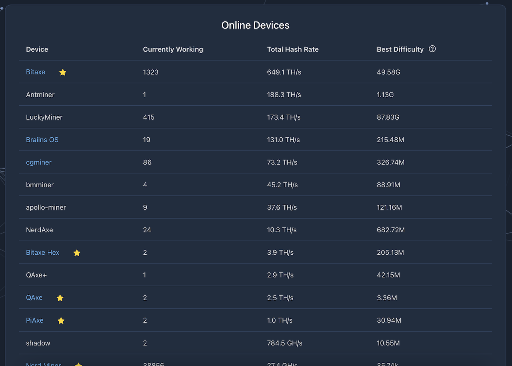

**Public Pool** n’est pas une pool comme les autres, c'est ce qu'on appelle également une **Solo Pool**. Si votre mineur réussit à miner un bloc, alors vous récupérez toute la récompense de bloc, elle n'est pas partagée avec les autres participants de la pool ni avec la pool elle-même.

**Public Pool** sert uniquement à fournir un **bloc template** à votre mineur pour que celui-ci puisse effectuer son travail, sans que vous ayez besoin d'avoir un **noeud Bitcoin** et le logiciel qui communique avec votre mineur. Étant donné que vous ne mutualisez pas votre puissance de calcul avec celle des autres participants, vos chances de réussir à miner un bloc sont évidemment très faibles, il s'agit un peu d'un système de loterie, où parfois un heureux chanceux gagne le gros lot.

Sur le **Dashboard** de **Public Pool**, vous avez tout de même quelques statistiques comme le **Hashrate total** de la pool ainsi qu’une répartition des différents types de mineurs qui sont connectés à la pool.

Dans les premières lignes, on peut voir **Bitaxe** avec 1323 **Bitaxe** connectés pour un total de 649TH/s. Le **Bitaxe** est un projet **Open source** qui permet de réutiliser simplement une puce d'un **ASIC** comme le **Antminer S19** sur une carte électronique **opensource** pour fabriquer un tout petit mineur de 0,5TH/s pour 15W. C’est ce mineur que nous allons utiliser comme exemple pour ce tutoriel.

## Ajouter un **Worker** 👷‍♂️

Tout en haut de la page, vous pouvez copier l'adresse de la pool **stratum+tcp://public-pool.io:21496**.

Ensuite, pour le champ **user**, renseignez une adresse **Bitcoin** que vous possédez.

Si vous avez plusieurs mineurs, vous pouvez entrer la même adresse sur tous pour que leurs **hashrates** soient additionnés et apparaissent comme un seul mineur. Vous pouvez également les distinguer en ajoutant un nom distinct à chacun. Pour cela, ajoutez simplement **.workername** après l’adresse **Bitcoin**.

Enfin, pour le champ **password**, utilisez **‘x’**.

Exemple : Si votre adresse **Bitcoin** est **‘bc1q2ed8zxq8njqsznkp7gj84n0xwl9dp224uha2fv’** et que vous souhaitez nommer votre mineur **« Brrrr »**, alors vous devrez renseigner les informations suivantes dans l’interface de votre mineur :
* **URL** : stratum+tcp://public-pool.io:21496
* **USER** : **‘bc1q2ed8zxq8njqsznkp7gj84n0xwl9dp224uha2fv.Brrrr’**
* **Password** : **‘x’**

Si votre mineur est un **Bitaxe**, les champs sont un peu différents, mais les informations restent les mêmes :
* **URL** : public-pool.io (ici, il faut supprimer la partie au début **‘stratum+tcp://’** et la partie à la fin **‘:21496’** qui sera reportée dans le champ port)
* **Port** : 21496
* **User** : **‘bc1q2ed8zxq8njqsznkp7gj84n0xwl9dp224uha2fv.Brrrr’**
* **Password** : **‘x’**

Quelques minutes après avoir commencé le minage, vous pourrez voir vos données sur le site de **Public Pool** en recherchant votre adresse.

## Dashboard

Une fois que vous serez connecté à **Public Pool**, vous pourrez accéder à votre **Dashboard** en faisant une recherche avec votre adresse **Bitcoin** que vous avez renseignée dans le champ **User**. Dans notre cas ici, il s'agit de **‘bc1q2ed8zxq8njqsznkp7gj84n0xwl9dp224uha2fv’**.

Sur le **Dashboard**, différentes informations sont affichées à la fois sur vos données et sur le réseau.

Vous avez **Network Hash Rate** qui correspond à la puissance de travail totale du réseau **Bitcoin**.

La **Network Difficulty** indique la difficulté qu'il faut atteindre pour valider un bloc.

Et **Your Best Difficulty** est la difficulté la plus élevée que vous avez atteinte. Si, par chance 🍀, vous atteignez la difficulté du réseau, alors vous remportez toute la récompense de bloc... après 100 blocs. Il faudrait attendre 100 blocs avant de pouvoir les dépenser.

Vous avez également le **Block Height** qui est le numéro du dernier bloc qui a été miné ainsi que son poids exprimé en WU, le maximum étant 4 000 000.

En dessous, vous pourrez voir toutes les stats de chacun de vos appareils individuellement si vous leur avez donné un nom distinct en ajoutant **.nom** derrière votre adresse **Bitcoin** dans le champ **User**.
