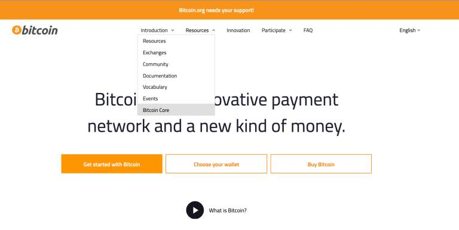
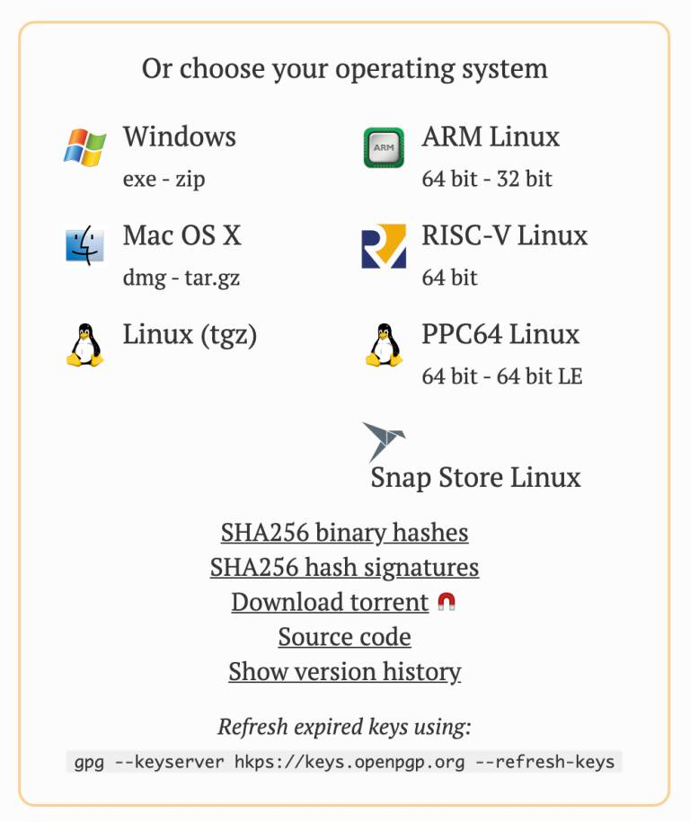
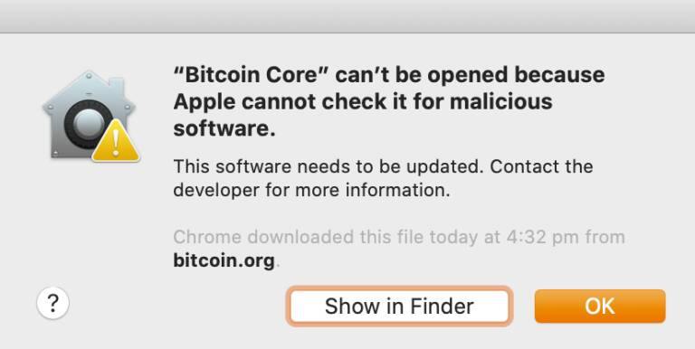
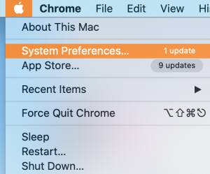
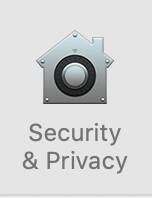

Instalar Bitcoin Core en tu computadora regular se puede hacer, pero no es lo ideal. Si no te importa dejar tu computadora encendida las 24 horas del día, esto funcionará bien. Si necesitas apagar la computadora, resulta molesto esperar a que el software se sincronice cada vez que la vuelves a encender.

Estas instrucciones son para usuarios de Mac o Windows. Es probable que los usuarios de Linux no necesiten mi ayuda, pero las instrucciones para Linux son muy similares a las de Mac.

## Empezar desde cero

Idealmente, quieres usar una computadora limpia, una sin malware. Incluso si usas una billetera de hardware, el malware puede engañarte y hacerte perder tus monedas.

Puedes formatear una computadora vieja y usarla como una computadora dedicada para Bitcoin, o comprar una computadora/portátil dedicada.

## El disco duro

Bitcoin Core ocupará aproximadamente 400 gigabytes de datos en tu disco duro y seguirá creciendo. Puedes usar tu disco duro interno, pero también puedes conectar un disco duro externo. Explicaré ambas opciones. Idealmente, deberías usar un disco de estado sólido (SSD). Si tienes una computadora vieja, probablemente no tenga uno de estos internamente. Simplemente compra un SSD externo de 1 o 2 terabytes y úsalo. El disco duro regular probablemente funcionará, pero podrías tener problemas y será mucho más lento.


## Descargar Bitcoin Core

Ve a bitcoin.org (asegúrate de no ir a bitcoin.com, que es un sitio de shitcoin propiedad de Roger Ver, que engaña a las personas para que compren Bitcoin Cash en lugar de Bitcoin)

Una vez allí, no es obvio dónde obtener el software. Ve al menú de recursos y haz clic en "Bitcoin Core", como se muestra a continuación:



Esto te llevará a la página de descarga:


Haz clic en el botón naranja "Download Bitcoin Core":


Hay varias opciones para elegir, dependiendo de tu computadora. Las dos primeras son relevantes para esta guía; elige Windows o Mac en la barra izquierda. Comenzará a descargar después de hacer clic en él, probablemente en tu directorio de Descargas.

## Verificar la descarga (parte 1)

Necesitas el archivo que contiene los hashes de varias versiones. Este archivo solía estar en la página de descargas de bitcoin.org, pero ahora se ha trasladado a bitcoincore.org/en/download:


Necesitas el archivo de hashes binarios SHA256. Este archivo contiene los hashes SHA256 de los diferentes paquetes de descarga de Bitcoin Core.

A continuación, necesitamos calcular el hash de la descarga de Bitcoin Core y compararlo con lo que el archivo dice que debería ser el hash. Así sabremos que la descarga es idéntica a lo que se espera, según bitcoincore.org.

Navega nuevamente al directorio de Descargas y ejecuta este comando (reemplaza las X por el nombre completo del archivo de descarga de Bitcoin Core):

```
PARA MAC —–> shasum -a 256 XXXXXXXXXXXX
PARA WINDOWS —–> certutil -hashfile XXXXXXXXXXX SHA256
```

Obtendrás un resultado de hash. Haz una nota de ello y compáralo con el hash contenido en el archivo SHA256SUMS.
Si las salidas son idénticas, entonces has verificado que no se ha manipulado ningún dato... casi. Aún necesitamos asegurarnos de que el archivo SHA256SUMS no sea malicioso.
Para continuar con el siguiente paso, debemos tener instalado gpg en nuestra computadora.

Para hacer eso, consulta mi guía de SHA256/gpg y desplázate aproximadamente hasta la sección "Descargar gpg" y busca el subtítulo de tu sistema operativo. Luego vuelve aquí.

## Obtén la clave pública

De vuelta en la página de descarga, obtén el archivo de firmas de hash SHA256



Haz clic en él y guarda el archivo en el disco, preferiblemente en el directorio de Descargas.

Este archivo contiene firmas de varias personas del archivo SHA256SUMS.

Queremos la clave pública del desarrollador principal, Wladimir J. van der Laan, en el anillo de claves de nuestra computadora. Su ID de clave pública es:
1 - 01EA 5486 DE18 A882 D4C2 6845 90C8 019E 36C2 E964

Copia ese texto en el siguiente comando:

```
gpg --keyserver hkp://keyserver.ubuntu.com --recv-keys 01EA5486DE18A882D4C2684590C8019E36C2E964
```

Por interés, en cualquier momento puedes ver qué claves hay en el anillo de claves de la computadora con este comando:

```
gpg --list-keys
```

## Verifica la descarga (parte 2)

Ya tenemos la clave pública, así que ahora podemos verificar el archivo SHA256SUMS que contiene los hashes de la descarga de Bitcoin Core y la firma de esos hashes.

Abre Terminal o CMD nuevamente y asegúrate de estar en el directorio de Descargas. Desde allí, ejecuta este comando:

```
gpg –verify SHA256SUMS.asc SHA256SUMS
```

El primer archivo listado es la ortografía exacta del archivo de firma. El segundo archivo listado debería ser la ortografía exacta del archivo de texto que contiene los hashes. Ambos archivos deben estar en el mismo directorio y debes estar en el directorio de los archivos, de lo contrario, debes escribir la ruta completa para cada archivo.

Este es el resultado que deberías obtener


Es seguro ignorar el mensaje de ADVERTENCIA, eso solo te recuerda que no has conocido a Wladimir en una parte clave y le has preguntado personalmente cuál es su clave pública, y luego le has dicho a tu computadora que confíe completamente en esta clave.

Si recibiste este mensaje, ahora sabes que el archivo SHA256SUMS.asc no ha sido manipulado después de que Wladimir lo firmó.

## Instala Bitcoin Core

No deberías necesitar instrucciones detalladas sobre cómo instalar el programa.


## Ejecuta Bitcoin Core

En una Mac, es posible que recibas una advertencia (Apple sigue siendo anti-Bitcoin)



Haz clic en OK y luego abre tus Preferencias del Sistema



Haz clic en el icono de Seguridad y Privacidad:



Luego haz clic en "abrir de todos modos":


El error aparecerá nuevamente, pero esta vez tendrás un botón ABRIR disponible. Haz clic en él.


Bitcoin Core debería cargarse y se te presentarán algunas opciones:


Aquí puedes elegir usar la ruta predeterminada para descargar la cadena de bloques, o puedes elegir tu unidad externa. Recomiendo no cambiar la ruta predeterminada si vas a usar la unidad interna, ya que facilita la configuración al instalar otro software para comunicarse con Bitcoin Core.

Puedes elegir ejecutar un nodo podado, lo cual ahorra espacio pero limita lo que puedes hacer con tu nodo. De cualquier manera, descargarás la cadena de bloques completa y la verificarás de todos modos, así que si tienes espacio, guarda lo que descargaste y no lo podas si puedes evitarlo.

Una vez que confirmes, la cadena de bloques comenzará a descargarse. Tomará varios días.


Puedes apagar la computadora y volver a descargar si quieres, no causará ningún daño.
