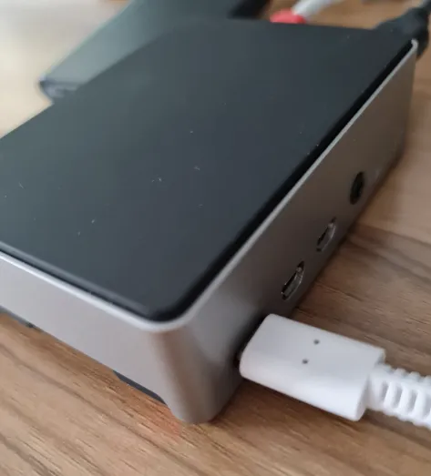
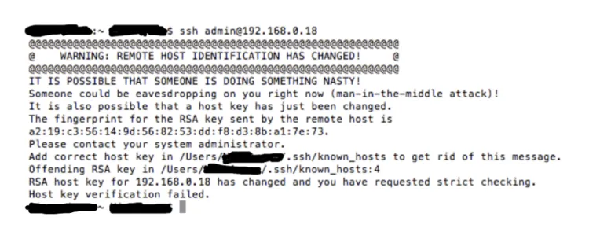
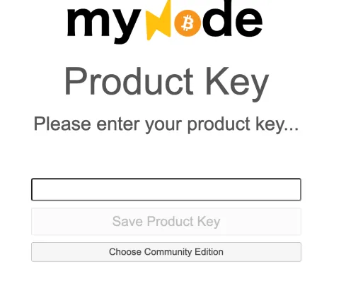
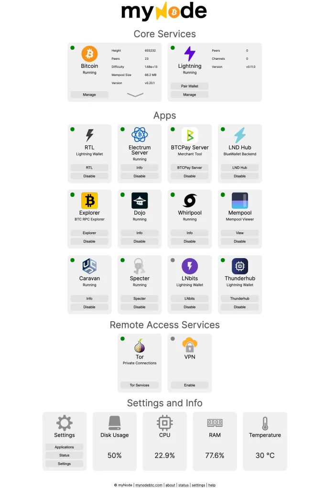

https://mynodebtc.com/

Nejjednodušší a nejmocnější způsob, jak provozovat Bitcoin a Lightning uzel! Kombinujeme nejlepší open source software s naším rozhraním, správou a podporou, abyste mohli snadno, soukromě a bezpečně používat Bitcoin a Lightning.

## Typy nastavení uzlů

Existují různá nastavení uzlů. MyNode je vynikající. Přichází s mnoha aplikacemi a ještě více, pokud zaplatíte za prémiovou verzi. Jinak je velmi zdlouhavé stahovat všechny tyto aplikace samostatně. MyNode to značně usnadňuje, jak uvidíte.

Alternativou a podobnou možností je RaspiBlitz. GUI není tak pěkné a aplikace se hodně překrývají s aplikacemi, které přicházejí s MyNode, ale Raspiblitz je zdarma jako open source software (FOSS) a MyNode úplně ne. Dalším rozdílem je, že MyNode běží v Docker kontejneru. Docker mi přijde náročný a těžko řešitelný při problémech. To je problém pouze v případě, že narazíte na chyby nebo bugy. Vývojář nabízí pomoc pro prémiové uživatele a existuje také chatovací skupina na Telegramu.

RaspiBlitz je jen několik programů nainstalovaných na Linuxu, bez Dockeru. Externí pevný disk lze snadno připojit k jinému Linuxovému stroji s Bitcoin Core a můžete pokračovat, pokud potřebujete.

Další možností je jen nainstalovat Bitcoin Core a nějakou variantu Electrum Serveru (existuje jich několik) na operační systém. Mám návody pro Linux (Raspberry Pi), Mac a Windows.

## Nákupní seznam

- Raspberry Pi 4, paměť 4Gb nebo 8Gb (4Gb je dostatečných)

- Oficiální napájecí zdroj Raspberry Pi (Velmi důležité! Nezískávejte generické, vážně)

- Pouzdro pro Pi. Pouzdro FLIRC je úžasné. Celé pouzdro je chladič a nepotřebujete ventilátor, který může být hlučný

- 16 Gb microSD karta (potřebujete jednu, ale několik je užitečných)

- Čtečka paměťových karet (většina počítačů nebude mít slot pro microSD kartu).

- Externí SSD 1Tb pevný disk.  
  Poznámka: SSD je klíčové. nepoužívejte přenosný externí pevný disk, i když je levnější

- Ethernetový kabel (pro připojení k domácímu routeru)

- Monitor nepotřebujete

## Stáhněte si obraz MyNode

Přejděte na webovou stránku MyNode Link


Klikněte na <Download Now>

Stáhněte si verzi pro Raspberry Pi 4:


Je to velký soubor:


Stáhněte si SHA 256 hash


Otevřete terminál na Macu nebo Linuxu nebo Příkazový řádek pro Windows. Napište:

```bash
shasum -a 256 DOWNLOADEDFILENAME # <--- Mac/Linux
certUtil -hashfile DOWNLOADEDFILENAME SHA256 # <--- Windows
```

Počítač přemýšlí asi 20 sekund. Poté zkontrolujte, zda výstupní hash soubor odpovídá tomu, který jste stáhli z webové stránky v předchozím kroku. Pokud je totožný, můžete pokračovat.
Nahrajte SD kartu

## Stáhněte a nainstalujte Balena Etcher. Link

Nepodařilo se mi najít digitální podpis pro toto. Pokud víte jak, dejte mi vědět a já tento článek aktualizuji.

Použití Etcheru je samovysvětlující. Vložte vaši micro SD kartu a nahrajte software Raspberry Pi (.img soubor) na SD kartu.


Jakmile je hotovo, disk již není čitelný. Můžete dostat chybovou hlášku od operačního systému a disk by měl zmizet z plochy. Vytáhněte kartu.

## Nastavení Pi a vložení SD karty

Součástky (pouzdro není zobrazeno):


Připojte ethernetový kabel a USB konektor pevného disku (ještě ne připojujte napájení). Vyhněte se připojení k modře zbarveným USB portům uprostřed. Jsou to USB 3. MyNode doporučuje použít port USB 2, i když disk může být kompatibilní s USB 3.


Sem vložte micro SD kartu:


Nakonec připojte napájení:



## Zjistěte IP adresu Pi

S MyNode nikdy nepotřebujete monitor. Potřebujete však další počítač ve vaší domácí síti. Pokud není vaše Pi připojeno ethernetem a chcete spoléhat na WiFi, zjištění IP adresy vyžaduje pokročilé počítačové dovednosti. Nemohu vám pomoci, omlouvám se. Potřebujete ethernetové připojení. (Problém spočívá v potřebě přístupu k monitoru a operačnímu systému pro připojení k WiFi a zadání hesla).

Zkontrolujte váš router pro seznam všech IP adres všech připojených zařízení.

Zadal jsem 192.168.0.1 do prohlížeče (instrukce, které přišly s mým routerem), přihlásil se a byl schopen vidět zařízení „MyNode“ s IP 192.168.0.18. Poznamenejte si, že tyto IP adresy nejsou veřejně viditelné na internetu (nejdříve procházejí routerem), jsou to jen identifikátory zařízení ve vaší domácí síti.

Nalezení IP je klíčové.

> AKTUALIZACE: můžete použít terminál na Macu nebo Linuxovém stroji k nalezení IP adresy všech zařízení připojených ethernetem ve vaší domácí síti pomocí příkazu „arp -a“. Výstup není tak přehledný, jak by zobrazil router, ale všechny potřebné informace jsou tam. Pokud není zřejmé, které je Pi, proveďte pokus a omyl.

## SSH připojení k Pi

Máte možnost přihlásit se na zařízení na dálku pomocí příkazu SSH, ale není to nutné (je to nutné, pokud jde o RaspiBlitz Node). Ukážu vám to stejně, protože je to velmi užitečné.

Otevřete počítač Mac nebo Linux (pro Windows stáhněte putty, nástroj SSH) a napište:

```bash
ssh admin@192.168.0.18
```

Použijte vaši vlastní IP adresu. Uživatelské jméno pro zařízení MyNode je ve výchozím nastavení „admin“. Heslo je ve výchozím nastavení „bolt“.

Pokud jste své Pi používali dříve a vyměnili jste micro SD kartu, dostanete tuto chybu:



To, co potřebujete udělat, je navigovat tam, kde je soubor „known_hosts“ a smazat ho. Je to bezpečné. Chybová zpráva vám ukáže cestu. Pro mě to bylo /Users/MojeUživatelskéJméno/.ssh/

Nezapomeňte na „.“ před ssh, což naznačuje, že se jedná o skrytý adresář.

Pak zkuste příkaz ssh znovu.

Tentokrát uvidíte tento výstup:


Soubor, který jste smazali, byl smazán a přidáváte nový otisk prstu. Napište ano a stiskněte <enter>.

Budete vyzváni k zadání hesla. Je to „bolt“
Nyní máte přístup k terminálu MyNode Pi bez monitoru a můžete potvrdit, že vše bylo hladce načteno.


## Přístup přes webový prohlížeč

Otevřete prohlížeč. Musí to být počítač ve vaší domácí síti, zvenčí to udělat nemůžete. Existuje způsob, ale je to složité. Nezkoušel jsem to.

Do okna prohlížeče zadejte IP adresu. Stane se toto:


Zadejte heslo “bolt” – později ho změňte.

Poté se stane toto:


Vyberte Formátovat disk


Teď počkáme.

V určitém okamžiku budete dotázáni, zda chcete zadat váš produktový klíč, nebo použít zdarma “community edition” — já vám ukážu Premium edici. Doporučuji, pokud na to máte, zaplatit za premium verzi, stojí to za to.



Poté uvidíte průběh stahování bloků. Trvá to dny:


Je bezpečné vypnout stroj během stahování, pokud potřebujete. Jděte do nastavení a najděte tlačítko pro vypnutí stroje. Nevytrhávejte jen tak kabel, mohli byste poškodit instalaci nebo pevný disk.

Ujistěte se, že hned na začátku jdete do “Nastavení” a zakážete quicksync. Začne se tím stahování počátečních bloků od začátku.


Chtěl jsem pokračovat ve vytváření průvodce, takže tady je další MyNode, který jsem připravil dříve. Takto vypadá stránka, když je blockchain synchronizován a několik “aplikací” bylo aktivováno a synchronizováno:



Všimněte si, že Electrum Server musí být také synchronizován, takže jakmile je Bitcoin Blockchain synchronizován, klikněte na tlačítko pro spuštění tohoto procesu – trvá to den nebo dva. Vše ostatní je aktivováno během několika minut po výběru aktivace. Můžete na věci klikat a prozkoumávat. Nic nerozbijete. Pokud se něco pokazí (to se mi stalo, ale myslím, že kvůli levným dílům), budete muset znovu provést flash a začít stahování znovu. Problém, který mám s MyNode, je, že pokud potřebujete “znovu provést flash”, musíte začít synchronizaci blockchainu znovu od začátku. Existují technické způsoby, jak to obejít, ale není to jednoduché.

Pokud chcete vyzkoušet také jiný uzel, například RaspiBlitz, potřebujete další externí SSD pevný disk a další micro SD kartu k flashování. Jinak je to stejné vybavení, jen nemůžete provozovat MyNode a RaspiBlitz současně, to je jasné. Pokud to chcete udělat, je čas nakoupit další Raspberry Pi.

Nyní, když máte běžící uzel, používejte ho, nenechte ho jen tak stát a nic pro vás nedělat. Podívejte se na můj článek (a video) o tom, jak připojit vaši Electrum Desktop Wallet k Electrum Server a Bitcoin Core zde.