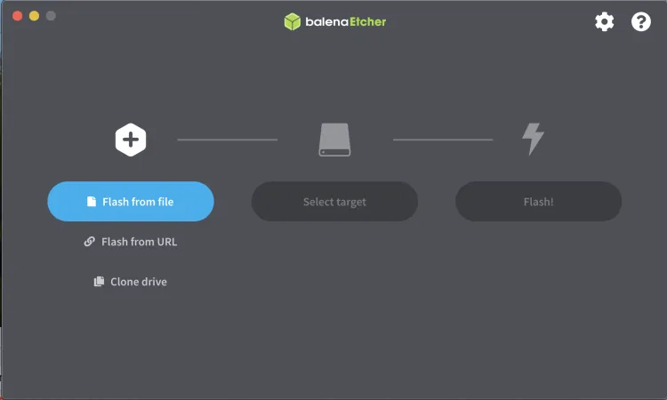
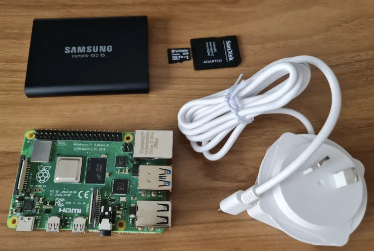

https://mynodebtc.com/

Helpoin ja tehokkain tapa käyttää Bitcoin- ja Lightning-nodia! Yhdistämme parhaat avoimen lähdekoodin ohjelmistot käyttöliittymäämme, hallintaamme ja tukeemme, jotta voit helposti, yksityisesti ja turvallisesti käyttää Bitcoinia ja Lightningia.

## Noden asennustyypit

Node-asennuksia on erilaisia. MyNode on erinomainen. Sen mukana tulee monia sovelluksia, ja vielä enemmän, jos maksat premium-version. Muuten sovellusten lataaminen itse on hyvin työlästä. MyNode tekee tästä melko helppoa, kuten näet.

Vaihtoehtoinen ja samankaltainen vaihtoehto on RaspiBlitz. Käyttöliittymä ei ole yhtä mukava, ja sovellukset menevät paljon päällekkäin MyNoden mukana tulevien sovellusten kanssa, mutta Raspiblitz on ilmaista avoimen lähdekoodin ohjelmistoa (FOSS) ja MyNode ei aivan. Toinen ero on, että MyNode toimii Docker-säiliössä. Dockerin käyttö tuntuu pelottavalta ja vaikeasti vianmääritykseltä. Tämä on vain ongelma, jos kohtaat virheitä tai bugeja. Kehittäjä tarjoaa apua premium-käyttäjille ja on olemassa myös Telegram-keskusteluryhmä.

RaspiBlitz on vain useita ohjelmia asennettuna Linuxiin ilman Dockeria. Ulkoisen kovalevyn voi helposti liittää toiseen Linux-koneeseen, jossa on Bitcoin Core, ja siinä kaikki, jos tarvitset.

Toinen vaihtoehto on vain asentaa Bitcoin Core ja Electrum Serverin eri versioita (niitä on useita) käyttöjärjestelmään. Minulla on oppaita Linuxille (Raspberry Pi), Macille ja Windowsille.

## Ostoslista

- Raspberry Pi 4, 4 Gt muistia tai 8 Gt (4 Gt riittää)

- Virallinen Raspberry Pi -virtalähde (Erittäin tärkeä! Älä hanki yleismallia, vakavasti)

- Kotelo Pi:lle. FLIRC-kotelo on mahtava. Koko kotelo toimii lämpösiilinä, eikä tuuletinta tarvita, mikä voi olla meluisa

- 16 Gt:n microSD-kortti (tarvitset yhden, mutta muutama on kätevä)

- Muistikortinlukija (useimmissa tietokoneissa ei ole microSD-korttipaikkaa).

- Ulkoinen SSD 1Tt kovalevy.  
  Huom: SSD on ratkaiseva. älä käytä kannettavaa ulkoista kovalevyä, vaikka se olisi halvempi

- Ethernet-kaapeli (kotireitittimeen liittämiseen)

- Et tarvitse näyttöä

## Lataa MyNode-kuva

Siirry MyNoden verkkosivustolle Linkki


Klikkaa <Lataa nyt>

Lataa Raspberry Pi 4 -versio:


Se on iso tiedosto:


Lataa SHA 256 -tiivisteet


Avaa terminaali Macissa tai Linuxissa tai komentokehote Windowsissa. Kirjoita:

```bash
shasum -a 256 LADATTUTIEDOSTONNIMI # <--- Mac/Linux
certUtil -hashfile LADATTUTIEDOSTONNIMI SHA256 # <--- Windows
```

Tietokone ajattelee noin 20 sekuntia. Tarkista sitten, että tulosteen tiiviste vastaa edellisessä vaiheessa verkkosivustolta ladattua. Jos se on identtinen, voit jatkaa.
Väläytä SD-kortti

## Lataa ja asenna Balena Etcher. Linkki

En löytänyt tälle digitaalista allekirjoitusta. Jos tiedät miten, kerro minulle niin päivitän tämän artikkelin.

Etcher on itsestään selvä käyttää. Aseta microSD-korttisi ja väläytä Raspberry Pi -ohjelmisto (.img-tiedosto) SD-kortille.



Kun olet valmis, asema ei ole enää luettavissa. Saatat saada virheilmoituksen käyttöjärjestelmältä, ja aseman pitäisi kadota työpöydältä. Vedä kortti ulos.

## Aseta Pi paikoilleen ja työnnä SD-kortti sisään

Osat (kotelo ei näy):




Yhdistä ethernet-kaapeli ja kiintolevyn USB-liitin (ei vielä virtaa). Vältä yhdistämistä keskellä oleviin sinisiin USB-portteihin. Ne ovat USB 3. MyNode suosittelee käyttämään USB 2 -porttia, vaikka asema olisikin USB 3 -yhteensopiva.


Mikro-SD-kortti menee tähän:


Lopuksi, yhdistä virta:


## Etsi Pin IP-osoite

MyNode:n kanssa et tarvitse näyttöä. Tarvitset kuitenkin toisen tietokoneen kotiverkossa. Jos Pi ei ole yhdistetty ethernetin kautta ja haluat käyttää WiFiä, IP-osoitteen löytäminen vaatii korkean tason tietokonetaitoja. Valitettavasti en voi auttaa tässä. Tarvitset ethernet-yhteyden. (Ongelma johtuu tarpeesta päästä käsiksi näyttöön ja käyttöjärjestelmään WiFiin yhdistämiseksi ja salasanan syöttämiseksi).

Tarkista reitittimesi, löytääksesi listan kaikista yhteydessä olevista laitteista.

Kirjoitin selaimessa 192.168.0.1 (reitittimeni mukana tulleet ohjeet), kirjauduin sisään ja näin laitteen "MyNode" IP-osoitteella 192.168.0.18. Huomaa, että nämä IP-osoitteet eivät ole julkisesti näkyvissä internetissä (ne kulkevat ensin reitittimen kautta), ne ovat vain tunnisteita kotiverkkosi laitteille.

IP-osoitteen löytäminen on ratkaisevan tärkeää.

> PÄIVITYS: voit käyttää terminaalia Mac- tai Linux-koneella etsiäksesi kaikkien Ethernetillä yhdistettyjen laitteiden IP-osoitteet kotiverkossa komennolla “arp -a”. Tuloste ei ole yhtä selkeä kuin mitä reititin näyttää, mutta kaikki tarvittava tieto on siellä. Jos ei ole ilmeistä, mikä on Pi, suorita kokeilu ja virhe -menetelmä.

## SSH:lla Pi:hin

Sinulla on mahdollisuus kirjautua laitteeseen etänä SSH-komennolla, mutta se ei ole pakollista (se on, jos käytössä on RaspiBlitz Node). Näytän kuitenkin miten, sillä se on erittäin kätevää.

Avaa Mac- tai Linux-tietokone (Windowsille, lataa putty, SSH-työkalu) ja kirjoita:

```bash
ssh admin@192.168.0.18
```

Käytä omaa IP-osoitettasi. MyNode-laitteen käyttäjänimi on oletuksena “admin”. Salasana on oletuksena “bolt”.

Jos olet käyttänyt Pi:täsi aiemmin ja vaihtanut mikro-SD-korttia, saat tämän virheen:


Sinun täytyy navigoida sinne, missä “known_hosts”-tiedosto on ja poistaa se. Se on turvallista. Virheviesti näyttää sinulle polun. Minulle se oli /Users/MyUserName/.ssh/

Älä unohda “.” ennen ssh, se osoittaa, että kyseessä on piilotettu hakemisto.

Yritä sitten ssh-komentoa uudelleen.

Tällä kertaa näet tämän tulosteen:


Poistamasi tiedosto on poistettu ja lisäät uuden sormenjäljen. Kirjoita yes ja paina <enter>.

Sinua pyydetään syöttämään salasana. Se on “bolt”
Sinulla on nyt pääsy MyNode Pi -terminaaliin ilman monitoria, ja voit vahvistaa, että kaikki on latautunut sujuvasti.

## Pääsy verkkoselaimen kautta

Avaa selain. Sen on oltava tietokone kotiverkossasi, et voi tehdä tätä ulkopuolelta. On olemassa tapa, mutta se on vaikea. En ole testannut sitä.

Kirjoita IP-osoite selaimen osoiteikkunaan. Tämä tapahtuu:

Syötä salasana “bolt” – vaihda se myöhemmin.

Sitten tämä tapahtuu:

Valitse Aseman alustus

Nyt odotamme.

Jossain vaiheessa sinulta kysytään, haluatko syöttää tuoteavaimen, vai käyttää ilmaista “yhteisöversiota” — aion näyttää Premium-version. Suosittelen maksamaan premium-versiosta, jos sinulla on varaa, se on todella sen arvoinen.

Näet sitten lohkojen latauksen edistymisen. Se kestää päiviä:

Koneen voi turvallisesti sammuttaa latauksen aikana, jos tarve vaatii. Mene asetuksiin ja etsi nappi koneen sammuttamiseksi. Älä vain vedä johtoa irti, se voi vahingoittaa asennusta tai kovalevyä.

Varmista, että alussa menet “Asetuksiin” ja poistat pikasynkronoinnin käytöstä. Se aloittaa alkuperäisen lohkolatauksen alusta.

Halusin jatkaa oppaan luomista, joten tässä on toinen MyNode, jonka valmistelin aiemmin. Tältä sivu näyttää, kun lohkoketju on synkronoitu, ja useita “sovelluksia” on otettu käyttöön ja synkronoitu:

Huomaa, että myös Electrum-palvelimen on synkronoiduttava, joten heti kun Bitcoin-lohkoketju on synkronoitu, klikkaa nappia aloittaaksesi sen prosessin – kestää päivän tai kaksi. Kaikki muu otetaan käyttöön muutamassa minuutissa, kun valitset sen käyttöön. Voit klikkailla asioita ja tutkia. Et riko mitään. Jos jotain menee rikki (minulle kävi näin, mutta luulen, että syynä olivat halvat osat), sinun on uudelleenflashattava ja aloitettava lataus uudelleen. Ongelmani MyNoden kanssa on, että jos sinun on "uudelleenflashattava", sinun on aloitettava lohkoketjun synkronointi alusta. Teknisiä kiertotapoja on olemassa, mutta se ei ole helppoa.

Jos haluat kokeilla myös toista nodea, kuten RaspiBlitziä, tarvitset lisäksi SSD-ulkoisen kovalevyn ja toisen micro SD -kortin flashausta varten. Muuten, laitteisto on sama, et vain voi ajaa MyNodea ja RaspiBlitziä samanaikaisesti, ilmiselvästi. Jos haluat tehdä niin, on aika shoppailla toinen Raspberry Pi.

Nyt kun sinulla on node käynnissä, käytä sitä, älä anna sen vain olla tekemättä mitään sinulle. Seuraa artikkeliani (ja videota) siitä, miten yhdistää Electrum Desktop Wallet Electrum Serveriin ja Bitcoin Coreen täällä.