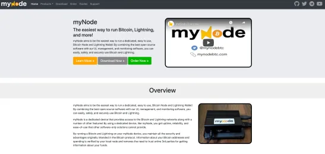
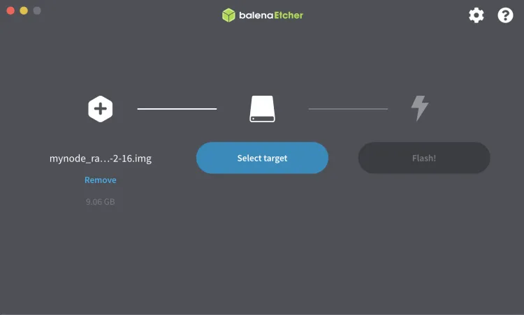
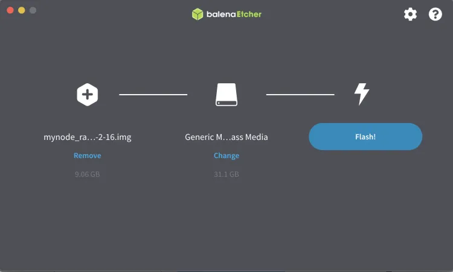
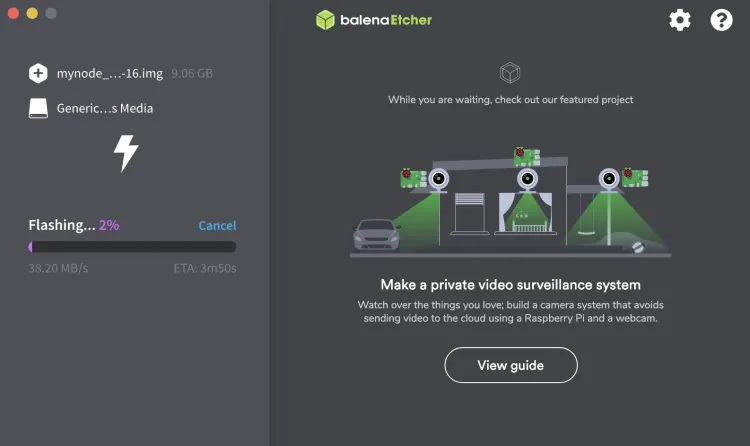
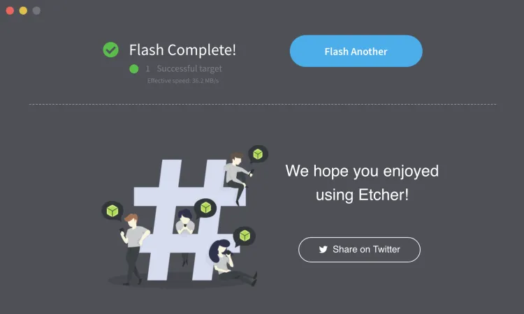
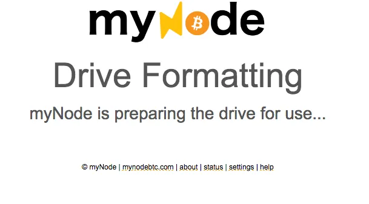

https://mynodebtc.com/

Il modo più semplice e potente per eseguire un nodo Bitcoin e Lightning! Abbiamo combinato il miglior software open source con la nostra interfaccia, gestione e supporto in modo da poter utilizzare facilmente, privatamente e in modo sicuro Bitcoin e Lightning.

## Tipi di configurazioni del nodo

Ci sono varie configurazioni del nodo. MyNode è eccellente. Ci sono molte app incluse e ancora di più se paghi per la versione premium. Altrimenti, scaricare tutte quelle app da soli sarebbe molto noioso. MyNode lo rende piuttosto facile, come vedrai.

Un'opzione alternativa e simile è RaspiBlitz. L'interfaccia grafica non è altrettanto bella e le app si sovrappongono molto con quelle incluse in MyNode, ma Raspiblitz è un software open source gratuito (FOSS) e MyNode non lo è del tutto. Un'altra differenza è che MyNode viene eseguito in un contenitore Docker. Trovo Docker intimidatorio e difficile da risolvere. Questo è un problema solo se si verificano errori o bug. Lo sviluppatore offre assistenza agli utenti premium e c'è anche un gruppo di chat Telegram.

Il RaspiBlitz è semplicemente una serie di programmi installati su Linux, senza Docker. L'unità disco esterna può essere facilmente collegata a un altro computer Linux con Bitcoin Core e via, nel caso ne avessi bisogno.

Un'altra opzione è installare semplicemente Bitcoin Core e una varietà di server Electrum (ce ne sono diversi) su un sistema operativo. Ho delle guide per Linux (Raspberry Pi), Mac e Windows.

## Lista della spesa

- Raspberry Pi 4, 4 GB di memoria o 8 GB (4 GB sono più che sufficienti)

- Alimentatore ufficiale Raspberry Pi (Molto importante! Non prendere uno generico, seriamente)

- Una custodia per il Pi. La custodia FLIRC è fantastica. L'intera custodia funge da dissipatore di calore e non hai bisogno di una ventola, che potrebbe essere rumorosa

- Scheda microSD da 16 GB (ne hai bisogno, ma ne sono utili alcune)

- Un lettore di schede di memoria (la maggior parte dei computer non ha uno slot per una scheda microSD).

- Unità disco esterna SSD da 1 TB.  
  Nota: l'SSD è fondamentale. Non utilizzare un disco rigido esterno portatile anche se è più economico

- Un cavo Ethernet (per collegarsi al router di casa)

- Non hai bisogno di un monitor

## Scarica l'immagine di MyNode

Vai al sito web di MyNode Link



Clicca su <Download Now>

Scarica la versione per Raspberry Pi 4:


È un file grande:


Scarica gli hash SHA 256


Apri il terminale su Mac o Linux o il Prompt dei comandi su Windows. Digita:

```
Mac/Linux: “shasum -a 256 NOMEFILESCARICATO”
Windows: “certUtil -hashfile NOMEFILESCARICATO SHA256”
```

Il computer ci pensa per circa 20 secondi. Quindi, controlla che l'hash del file di output corrisponda a quello scaricato dal sito web nel passaggio precedente. Se è identico, puoi procedere.
Flash della scheda SD

## Scarica e installa Balena Etcher. Link

Non sono riuscito a trovare la firma digitale per questo. Se sai come farlo, fammelo sapere e aggiornerò questo articolo.
Etcher è autoesplicativo da usare. Inserisci la tua scheda micro SD e flasha il software Raspberry Pi (.img file) sulla scheda SD.








Una volta fatto, l'unità non è più leggibile. Potresti ricevere un errore dal sistema operativo e l'unità dovrebbe scomparire dal desktop. Togli la scheda.

## Configura il Pi e inserisci la scheda SD

Le parti (il case non è mostrato):


Collega il cavo Ethernet e il connettore USB del disco rigido (non ancora l'alimentazione). Evita di collegarti alle porte USB di colore blu al centro. Sono USB 3. MyNode consiglia di utilizzare la porta USB 2, anche se il disco potrebbe supportare USB 3.


La scheda micro SD va qui:


Infine, collega l'alimentazione:


## Trova l'indirizzo IP del Pi

Non hai mai bisogno di un monitor con MyNode. Tuttavia, hai bisogno di un altro computer nella rete domestica. Se il tuo Pi non è collegato tramite Ethernet e vuoi fare affidamento sul WiFi, trovare l'IP richiede competenze informatiche di alto livello. Non posso aiutarti, mi dispiace. Hai bisogno di una connessione Ethernet. (Il problema deriva dalla necessità di accedere a un monitor e al sistema operativo per connettersi al WiFi e inserire una password).

Controlla il tuo router per una lista di tutti gli IP dei dispositivi collegati.

Ho digitato 192.168.0.1 nel browser (istruzioni fornite dal mio router), effettuato l'accesso e sono riuscito a vedere un dispositivo "MyNode" con l'IP 192.168.0.18. Nota che questi indirizzi IP non sono visibili pubblicamente su Internet (passano prima attraverso il router), sono solo identificatori per i dispositivi nella tua rete domestica.

Trovare l'IP è cruciale.

> AGGIORNAMENTO: puoi utilizzare il terminale su un computer Mac o Linux per trovare l'indirizzo IP di tutti i dispositivi collegati tramite Ethernet nella rete domestica utilizzando il comando "arp -a". L'output non è così bello come quello che mostrerà il router, ma tutte le informazioni necessarie sono presenti. Se non è ovvio quale sia il Pi, prova con il metodo del tentativo ed errore.

## Accedi al Pi tramite SSH

Hai la possibilità di accedere al dispositivo in remoto tramite il comando SSH, ma non è obbligatorio (lo è se si tratta di un nodo RaspiBlitz). Ti mostrerò comunque come farlo, perché è molto comodo.

Apri un computer Mac o Linux (per Windows, scarica putty, uno strumento SSH) e digita:

```
ssh admin@192.168.0.18
```

Usa il tuo indirizzo IP. Il nome utente predefinito per il dispositivo MyNode è "admin". La password predefinita è "bolt".

Se hai già utilizzato il tuo Pi in precedenza e hai scambiato la scheda micro SD, otterrai questo errore:


Quello che devi fare è navigare fino al percorso in cui si trova il file "known_hosts" e cancellarlo. È sicuro farlo. Il messaggio di errore ti mostra il percorso. Per me era /Users/MyUserName/.ssh/'
Non dimenticare il "." prima di ssh, questo indica che è una directory nascosta.
Quindi prova di nuovo il comando ssh.

Questa volta vedrai questo output:


Il file che hai eliminato è stato eliminato e stai aggiungendo una nuova impronta digitale. Digita sì e <invio>.

Ti verrà chiesto di inserire la password. È "bolt".

Ora hai accesso al terminale del MyNode Pi, senza un monitor, e puoi confermare che tutto è stato caricato correttamente.


## Accesso tramite browser web

Apri un browser. Deve essere un computer nella tua rete domestica, non puoi farlo da fuori. C'è un modo, ma è difficile. Non l'ho testato.

Digita l'indirizzo IP nella barra degli indirizzi del browser. Succederà questo:


Inserisci la password "bolt" - cambiala in seguito.

Poi succederà questo:


Scegli "Format Drive"



Ora aspettiamo.

Ad un certo punto ti verrà chiesto se vuoi inserire la tua chiave di prodotto o utilizzare la versione gratuita "community edition" - io mostrerò la versione Premium. Consiglio di pagare per la versione premium se te lo puoi permettere, ne vale davvero la pena.


Vedrai quindi il progresso dei blocchi scaricati. Ci vogliono giorni:


Puoi spegnere la macchina durante il download se necessario. Vai nelle impostazioni e trova il pulsante per spegnere la macchina. Non staccare semplicemente la spina, potresti corrompere l'installazione o il disco rigido.

Assicurati, all'inizio, di andare su "Impostazioni" e disabilitare quicksync. Inizierà il download del blocco iniziale dall'inizio.


Volevo procedere con la creazione della guida, quindi ecco un altro MyNode che ho preparato in precedenza. Ecco come appare la pagina quando la blockchain è sincronizzata e diversi "app" sono stati abilitati e sincronizzati:


Nota che anche il server Electrum deve sincronizzarsi, quindi non appena la blockchain di Bitcoin è sincronizzata, clicca il pulsante per avviare quel processo - ci vogliono uno o due giorni. Tutto il resto viene abilitato in pochi minuti una volta che selezioni di abilitarlo. Puoi cliccare su cose ed esplorare. Non romperai nulla. Se qualcosa si rompe (mi è successo, ma penso perché avevo parti economiche) dovrai riflashare e ricominciare a scaricare. Il problema che ho con MyNode è che se devi "riflashare" devi ricominciare la sincronizzazione della blockchain da zero. Ci sono modi tecnici per aggirare questo problema, ma non è facile.

Se vuoi provare anche un altro nodo, ad esempio un RaspiBlitz, hai bisogno di un'unità disco esterna SSD aggiuntiva e un'altra scheda micro SD da flashare. Altrimenti, è la stessa attrezzatura, semplicemente non puoi eseguire contemporaneamente MyNode e RaspiBlitz, ovviamente. Se vuoi farlo, è ora di cercare un altro Raspberry Pi.

Ora che hai un nodo in esecuzione, usalo, non lasciarlo lì senza far nulla per te. Segui il mio articolo (e video) su come collegare il tuo portafoglio desktop Electrum a Electrum Server e Bitcoin Core qui.
