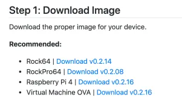
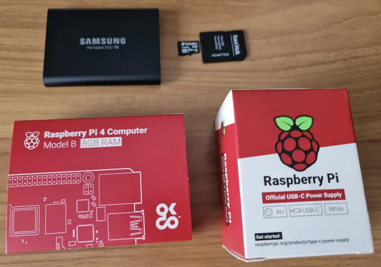
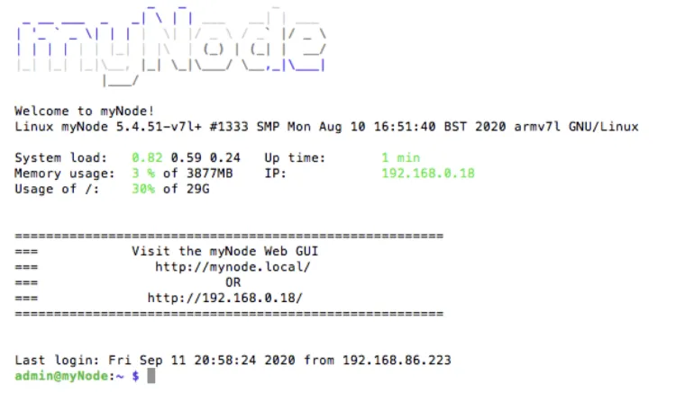
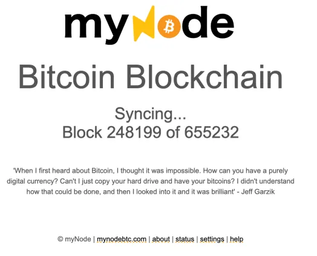

https://mynodebtc.com/

Cách dễ dàng và mạnh mẽ nhất để chạy một Node Bitcoin và Lightning! Chúng tôi kết hợp phần mềm mã nguồn mở tốt nhất với giao diện, quản lý và hỗ trợ của mình để bạn có thể sử dụng Bitcoin và Lightning một cách dễ dàng, riêng tư và an toàn.

## Các loại cài đặt Node

Có nhiều cách cài đặt Node. MyNode thật tuyệt vời. Có nhiều ứng dụng đi kèm với nó, và còn nhiều hơn nữa nếu bạn trả phí cho phiên bản cao cấp. Nếu không, việc tải xuống tất cả những ứng dụng đó sẽ rất mất công. MyNode làm cho việc này trở nên khá dễ dàng như bạn sẽ thấy.

Một lựa chọn thay thế và tương tự là RaspiBlitz. Giao diện người dùng (GUI) không đẹp như vậy, và các ứng dụng trùng lặp nhiều với các ứng dụng đi kèm với MyNode, nhưng Raspiblitz là phần mềm mã nguồn mở miễn phí (FOSS) và MyNode thì không hẳn. Một sự khác biệt khác là MyNode được chạy trong một container Docker. Tôi thấy Docker khó hiểu và khó khắc phục sự cố. Điều này chỉ là một vấn đề nếu bạn gặp lỗi hoặc sự cố. Nhà phát triển cung cấp sự hỗ trợ cho người dùng cao cấp và cũng có một nhóm chat Telegram.

RaspiBlitz chỉ là nhiều chương trình được cài đặt trên Linux, không qua Docker. Ổ đĩa cứng ngoài có thể dễ dàng được kết nối với một máy Linux khác có Bitcoin Core, và bạn có thể bắt đầu, nếu cần.

Một lựa chọn khác là chỉ cài đặt Bitcoin Core và một loại Electrum Server (có một số) trên một hệ điều hành. Tôi có hướng dẫn cho Linux (Raspberry Pi), Mac và Windows.

## Danh sách mua sắm

- Raspberry Pi 4, bộ nhớ 4Gb hoặc 8Gb (4Gb là đủ)

- Nguồn điện chính thức của Raspberry Pi (Rất quan trọng! Đừng mua hàng không chính hãng, nghiêm túc đấy)

- Một vỏ cho Pi. Vỏ FLIRC rất tuyệt. Toàn bộ vỏ là một tản nhiệt và bạn không cần quạt, có thể gây ồn

- Thẻ microSD 16 Gb (bạn cần một cái, nhưng có vài cái là tiện)

- Một đầu đọc thẻ nhớ (hầu hết máy tính sẽ không có khe cắm cho thẻ microSD).

- Ổ cứng SSD ngoài 1Tb.  
  Lưu ý: SSD là rất quan trọng. đừng sử dụng ổ cứng ngoài di động mặc dù nó rẻ hơn

- Một cáp ethernet (để kết nối với router nhà bạn)

- Bạn không cần màn hình

## Tải xuống Hình ảnh MyNode

Truy cập vào trang web MyNode Link


Nhấp <Download Now>

Tải xuống phiên bản Raspberry Pi 4:



Đó là một tệp lớn:


Tải xuống các bản hash SHA 256


Mở terminal trên Mac hoặc Linux hoặc Command Prompt cho Windows. Gõ:

```bash
shasum -a 256 DOWNLOADEDFILENAME # <--- Mac/Linux
certUtil -hashfile DOWNLOADEDFILENAME SHA256 # <--- Windows
```

Máy tính sẽ suy nghĩ khoảng 20 giây. Sau đó, kiểm tra xem tệp hash đầu ra có trùng khớp với tệp đã tải xuống từ trang web ở bước trước không. Nếu giống hệt, bạn có thể tiếp tục.
Ghi vào thẻ SD

## Tải xuống và cài đặt Balena Etcher. Link

Tôi không thể tìm thấy chữ ký số cho điều này. Nếu bạn biết cách, vui lòng cho tôi biết và tôi sẽ cập nhật bài viết này.

Etcher rất dễ sử dụng. Chèn thẻ micro SD của bạn và ghi phần mềm Raspberry Pi (.img file) vào thẻ SD.


Một khi hoàn thành, ổ đĩa sẽ không còn có thể đọc được. Bạn có thể nhận được một thông báo lỗi từ hệ điều hành, và ổ đĩa sẽ biến mất khỏi màn hình desktop. Hãy rút thẻ ra.

## Thiết lập Pi và lắp thẻ SD

Các bộ phận (vỏ không được hiển thị):




Kết nối cáp ethernet và cổng USB của ổ cứng (chưa kết nối nguồn điện). Tránh kết nối vào cổng USB màu xanh ở giữa. Đó là USB 3. MyNode khuyên bạn nên sử dụng cổng USB 2, mặc dù ổ đĩa có thể tương thích với USB 3.


Thẻ micro SD được lắp vào đây:


Cuối cùng, kết nối nguồn điện:


## Tìm địa chỉ IP của Pi

Bạn không cần một màn hình với MyNode. Tuy nhiên, bạn cần một máy tính khác trên mạng nhà. Nếu Pi của bạn không được kết nối qua ethernet và bạn muốn dùng WiFi, việc tìm địa chỉ IP đòi hỏi kỹ năng máy tính cao cấp. Xin lỗi, tôi không thể giúp bạn. Bạn cần một kết nối ethernet. (Vấn đề xuất phát từ việc cần truy cập vào một màn hình và hệ điều hành để kết nối với WiFi và nhập mật khẩu).

Kiểm tra router của bạn, để xem danh sách tất cả các IP của tất cả các thiết bị được kết nối.

Tôi đã gõ 192.168.0.1 vào trình duyệt (hướng dẫn đi kèm với router của tôi), đăng nhập, và có thể thấy một thiết bị “MyNode” với IP 192.168.0.18. Lưu ý rằng các địa chỉ IP này không được hiển thị công khai trên internet (chúng được đi qua router trước), chúng chỉ là các bộ nhận dạng cho các thiết bị trên mạng nhà bạn.

Việc tìm địa chỉ IP là rất quan trọng.

> CẬP NHẬT: bạn có thể sử dụng terminal trên máy Mac hoặc Linux để tìm địa chỉ IP của tất cả các thiết bị kết nối Ethernet trên mạng nhà bằng lệnh “arp -a”. Kết quả không đẹp mắt như những gì router sẽ hiển thị, nhưng tất cả thông tin bạn cần đều ở đó. Nếu không rõ đâu là Pi, hãy thử và lỗi.

## SSH vào Pi

Bạn có tùy chọn đăng nhập từ xa vào thiết bị bằng lệnh SSH, nhưng không bắt buộc (nếu là RaspiBlitz Node thì bắt buộc). Tôi sẽ hướng dẫn bạn cách làm vì nó rất tiện lợi.

Mở một máy tính Mac hoặc Linux (đối với Windows, tải về putty, một công cụ SSH) và gõ:

```bash
ssh admin@192.168.0.18
```

Sử dụng địa chỉ IP của bạn. Tên người dùng mặc định cho thiết bị MyNode là “admin”. Mật khẩu mặc định là “bolt”.

Nếu bạn đã sử dụng Pi của mình trước đó và đã thay đổi thẻ micro SD, bạn sẽ nhận được lỗi này:


Bạn cần điều hướng đến nơi có file “known_hosts” và xóa nó. Điều này là an toàn. Thông báo lỗi sẽ chỉ cho bạn đường dẫn. Đối với tôi, đó là /Users/TenNguoiDung/.ssh/

Đừng quên dấu “.” trước ssh, điều này chỉ ra rằng đó là một thư mục ẩn.

Sau đó, thử lại lệnh ssh.

Lần này bạn sẽ thấy đầu ra này:


File bạn đã xóa đã được xóa và bạn đang thêm một dấu vân tay mới. Gõ yes và <enter>.

Bạn sẽ được yêu cầu nhập mật khẩu. Mật khẩu là “bolt”.
Bạn đã có quyền truy cập terminal vào MyNode Pi mà không cần màn hình và có thể xác nhận mọi thứ đã được tải mượt mà.



## Truy cập qua Trình Duyệt Web

Mở một trình duyệt. Nó cần phải là một máy tính trong mạng nhà bạn, bạn không thể làm điều này từ bên ngoài. Có một cách, nhưng nó khó. Tôi chưa thử nghiệm nó.

Gõ địa chỉ IP vào cửa sổ địa chỉ của trình duyệt. Điều này sẽ xảy ra:


Nhập mật khẩu “bolt” – sau đó hãy thay đổi nó.

Sau đó điều này sẽ xảy ra:


Chọn Format Drive


Bây giờ chúng ta chờ đợi.

Tại một thời điểm nào đó bạn sẽ được hỏi liệu bạn muốn nhập khóa sản phẩm của mình, hoặc sử dụng phiên bản “community edition” miễn phí — Tôi sẽ giới thiệu phiên bản Premium. Tôi thực sự khuyên bạn nên trả tiền cho phiên bản premium nếu bạn có khả năng, nó rất đáng giá.


Sau đó bạn sẽ thấy tiến trình của việc tải xuống các block. Mất vài ngày:



Bạn có thể tắt máy trong quá trình tải xuống nếu bạn cần. Đi đến cài đặt và tìm nút để tắt máy. Đừng chỉ rút dây, bạn có thể làm hỏng việc cài đặt hoặc ổ cứng.

Đảm bảo, ngay từ đầu, đi đến “Cài đặt” và vô hiệu hóa quicksync. Nó sẽ bắt đầu tải xuống block ban đầu từ đầu.


Tôi muốn tiếp tục tạo hướng dẫn, vì vậy đây là một MyNode khác mà tôi đã chuẩn bị trước. Đây là cách trang trông khi blockchain đã được đồng bộ, và một số “ứng dụng” đã được kích hoạt và đồng bộ:


Lưu ý rằng Electrum Server cũng cần được đồng bộ, vì vậy ngay khi Bitcoin Blockchain được đồng bộ, nhấp vào nút để bắt đầu quá trình đó – mất một hoặc hai ngày. Mọi thứ khác được kích hoạt trong vài phút sau khi bạn chọn để kích hoạt nó. Bạn có thể nhấp vào các thứ và khám phá. Bạn sẽ không làm hỏng bất cứ thứ gì. Nếu có gì đó hỏng (điều này đã xảy ra với tôi, nhưng tôi nghĩ là do tôi dùng phụ tùng rẻ tiền) bạn sẽ phải flash lại và bắt đầu tải xuống lại. Vấn đề tôi gặp phải với MyNode là nếu bạn cần “flash lại” bạn sẽ cần phải bắt đầu đồng bộ blockchain lại từ đầu. Có những cách kỹ thuật để giải quyết vấn đề này, nhưng nó không dễ dàng.

Nếu bạn muốn thử một node khác nữa, chẳng hạn như RaspiBlitz, bạn cần một ổ cứng SSD ngoài thêm và một thẻ micro SD khác để flash. Ngoài ra, đó là cùng một thiết bị, bạn chỉ không thể chạy MyNode và RaspiBlitz cùng một lúc, rõ ràng. Nếu bạn muốn làm điều đó, đã đến lúc mua một Raspberry Pi khác.

Bây giờ bạn đã có một node đang chạy, hãy sử dụng nó, đừng chỉ để nó đó không làm gì cho bạn. Hãy theo dõi bài viết (và video) của tôi về cách kết nối Ví Desktop Electrum của bạn với Electrum Server và Bitcoin Core tại đây.