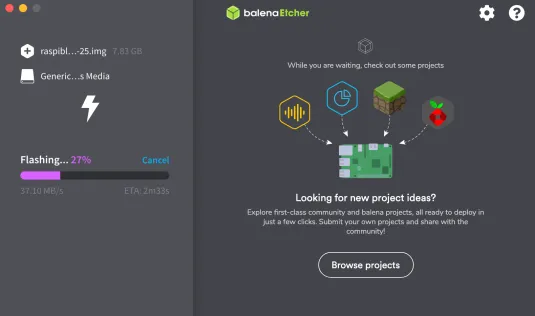
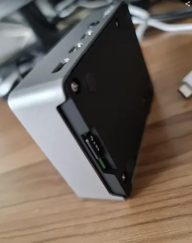
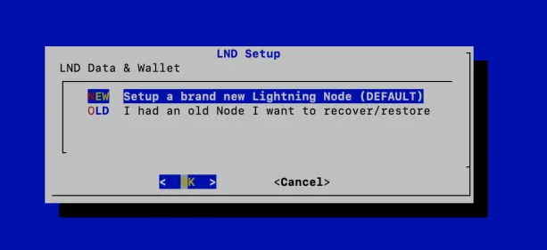
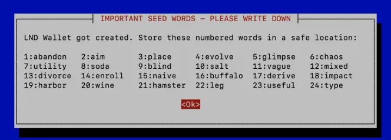
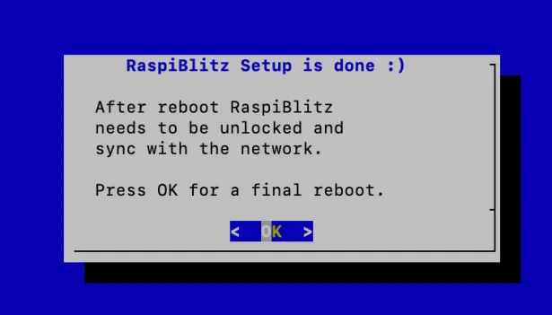

RaspiBlitz je projekt "udělej si sám" Lightning Node (LND a/nebo Core Lightning), který běží společně s Bitcoin-Fullnode na RaspberryPi (1TB SSD) a s pěkným displejem pro snadné nastavení a monitorování.

RaspiBlitz je hlavně zaměřen na učení se, jak provozovat vlastní uzly decentralizovaně z domova - protože: Není váš Node, nejsou vaše pravidla. Objevujte a rozvíjejte rostoucí ekosystém Lightning Network tím, že se stanete její plnohodnotnou součástí. Sestavte jej jako součást workshopu nebo jako víkendový projekt sami.


RASPIBLITZ - Jak provozovat Lightning a Bitcoin Full Node od BTC session

# Parmanův průvodce nastavením Raspiblitz

Raspiblitz je vynikající systém pro provoz Bitcoin Node a přidružených aplikací. Doporučuji toto a My Node uzly většině uživatelů (ideálně mít dva uzly pro redundanci.) Jednou z hlavních výhod je, že Raspiblitz uzel je "Free Open Source Software", na rozdíl od MyNode nebo Umbrel. Proč je to důležité? Vysvětluje Vlad Costa. RaspbiBlitz můžete také provozovat s WiFi připojením místo ethernetu – zde je doplňující průvodce pro to. (S MyNode jsem nenašel způsob, jak to udělat).

Můžete koupit připravený uzel s připojeným mini displejem, nebo si ho můžete postavit sami (nepotřebujete displej).

Průvodce na stránce github je vynikající, ale možná příliš podrobný pro mírně pokročilého uživatele. Mé instrukce budou stručnější a doufejme snadněji pochopitelné.

V podstatě je proces velmi podobný procesu nastavení uzlu MyNode s Raspberry Pi 4. Průvodce Raspiblitz navrhuje koupit monitor, ale opravdu ho nepotřebujete a nedoporučoval bych to. Nepotřebujete ani extra klávesnici nebo myš. Stačí přistupovat k terminálu zařízení přes počítač ve stejné domácí síti a použít příkaz ssh pomocí terminálu. To je možné s Linuxem/Macem (snadno) a trochu těžší s Windows.

## Krok 1: Kupte si vybavení.

Potřebujete přesně stejné vybavení, které potřebujete k provozu uzlu MyNode. Můžete vyzkoušet jedno nebo druhé, jediný rozdíl je data na mikro SD kartě.

- Raspberry Pi 4, 4Gb paměti nebo 8Gb (4Gb je dostatečné)
- Oficiální napájecí zdroj Raspberry Pi (Velmi důležité! Nezískávejte generické, vážně)
- Pouzdro pro Pi. (Pouzdro FLIRC je úžasné. Celé pouzdro je chladič a nepotřebujete ventilátor, který může být hlučný)
- 32 Gb mikroSD karta (potřebujete jednu, ale několik je praktických.)
- Čtečka paměťových karet (většina počítačů nebude mít slot pro mikroSD kartu).
- Externí SSD 1Tb pevný disk.
- Ethernetový kabel (pro připojení k domácímu routeru).

Nepotřebujete monitor (ani klávesnici nebo myš)

Poznámka: Tohle je špatný pevný disk: Jedná se o přenosný externí pevný disk. Není to SSD. SSD je zásadní. Proto je levný (Cena v AUD)


Tohle je správný typ, který byste měli získat:


Tohle je rychlejší, ale zbytečně drahé:


## Krok 2: Stáhněte si obraz Raspiblitz
Přejděte na webovou stránku Raspiblitz na GitHubu a najděte odkaz "download image" (stáhnout obraz):


Na webové stránce je uveden sha-256 hash staženého souboru. S každou aktualizací se změní. Pokud nevíte, o co jde, měli byste to vědět, takže jsem napsal průvodce, který si můžete přečíst zde.


## Krok 3: Ověření obrazu

Před pokračováním, pokud nevíte, jak se orientovat v souborovém systému přes příkazovou řádku, je to snadné se naučit a měli byste to udělat.

Zde je užitečné video pro Linux, ale platí to i pro Mac.

Pro Windows zde je jednoduchý tutoriál.
Mac/Linux

Počkejte, až se soubor dokončí stahování (důležité!), a poté otevřete terminál, přejděte do složky, kam jste soubor stáhli, a zadejte následující příkaz…

```bash
shasum -a 256 xxxxxxxxxxxxxx
```

kde xxxxxxxxxxxxxx je název souboru, který jste právě stáhli. Pokud nejste ve složce, kde je tento soubor, musíte zadat celou cestu.

Počítač přemýšlí asi 20 sekund. Zkontrolujte, že výstupní hash soubor odpovídá tomu, který jste stáhli z webové stránky v předchozím kroku. Pokud je totožný, můžete pokračovat.
Windows

Otevřete příkazový řádek a přejděte do složky, kam jste soubor stáhli, a zadejte tento příkaz:

```bash
certUtil -hashfile xxxxxxxxxxxxxxx SHA256
```

kde xxxxxxxxxxxxxx je název souboru, který jste právě stáhli. Pokud nejste ve složce, kde je tento soubor, musíte zadat celou cestu.

Počítač přemýšlí asi 20 sekund. Zkontrolujte, že výstupní hash soubor odpovídá tomu, který jste stáhli z webové stránky v předchozím kroku. Pokud je totožný, můžete pokračovat.

## Krok 4: Příprava SD karty

K tomu můžete použít Balena Etcher. Stáhněte si ho zde.

Použití Etcher je intuitivní. Vložte vaši micro SD kartu a naflashujte na ni software Raspiblitz (.img soubor).





Po dokončení již nebude jednotka čitelná. Může se objevit chyba od operačního systému a jednotka by měla zmizet z plochy. Vyjměte kartu.

## Krok 5: Nastavení Pi a vložení SD karty

Součásti (obal není zobrazen):


Připojte ethernetový kabel a USB konektor pevného disku (zatím ne připojujte napájení). Vyhněte se připojení k modrým USB portům uprostřed. Jsou to USB 3. Použijte port USB 2, i když je disk kompatibilní s USB 3 (spolehlivější).


Micro SD karta jde sem:



Nakonec připojte napájení:


## Krok 6: Najděte IP adresu Pi

S Raspiblitz nikdy nepotřebujete monitor. Potřebujete však další počítač ve vaší domácí síti. Pokud není vaše Pi připojeno ethernetem a chcete spoléhat na WiFi, nalezení IP vyžaduje určité počítačové dovednosti. Nemohu vám pomoci, promiňte. Potřebujete ethernetové připojení. (Problém spočívá v potřebě přístupu k monitoru a operačnímu systému pro připojení WiFi a zadání hesla.)

Zkontrolujte váš router pro seznam všech IP všech připojených zařízení.
Zadal jsem 192.168.0.1 do prohlížeče (podle instrukcí, které přišly s mým routerem), přihlásil se a byl schopen vidět mé zařízení s IP adresou 192.168.0.191. Poznamenejme, že tyto IP adresy nejsou veřejně viditelné na internetu (nejdříve procházejí routerem), jsou to pouze identifikátory pro zařízení ve vaší domácí síti.
Nalezení IP adresy je klíčové.

> AKTUALIZACE: na Macu nebo Linuxovém stroji můžete použít terminál k nalezení IP adresy všech zařízení připojených přes Ethernet v domácí síti pomocí příkazu „arp -a“. Výstup není tak přehledný, jak by zobrazil router, ale všechny potřebné informace jsou tam. Pokud není zřejmé, které zařízení je Pi, proveďte pokus omyl.

## Krok 7: SSH připojení k Pi

Nezapomeňte vložit SD kartu do Pi před jeho zapnutím. Počkejte několik minut a poté na jiném Linuxu/Macu otevřete terminál.

Pro Mac/Linux, v terminálu napište:

```bash
ssh admin@vaše_Pi_IP_adresa
```

Pro Windows, budete muset nainstalovat putty pro ssh připojení k Pi. Napište stejný příkaz jako výše.

Poprvé, když to uděláte, nebo kdykoli změníte OS Pi vyměněním SD karty, můžete dostat tuto chybu…


Způsob, jak to opravit, je navigovat tam, kde je soubor „known_hosts“ (v chybové zprávě se dozvíte kde), a smazat ho. Příkaz je "rm known_hosts"

Poté opakujte příkaz ssh pro přihlášení. Tohle se stane…


Napište ano (celé slovo) pro pokračování.

Pokud se připojení podaří, budete požádáni o heslo. To není pro váš počítač, ale pro raspiblitz. Obecné heslo je „raspiblitz“, a to později změníte. Okno terminálu se změní na modré a budete mít možnosti menu jako ve starých DOS menu. Navigujte pomocí šipek nebo myši.


Postupujte podle výzev, nastavte svá hesla a poté vám bude nabídnuta možnost formátování disku, pokud je to potřeba.

Poté vás požádají, jestli chcete kopírovat data blockchainu z jiného zdroje nebo je znovu stáhnout. Kopírování je učící proces a instrukce jsou velmi dobré, a je dobré je mít po ruce….


Jednodušší, ale pomalejší způsob je stáhnout celý řetězec od začátku…


Přes terminál se bude rychle přelévat spousta textu. Můžete si to splést s procesem stahování blockchainu, ale podle mého to vypadá, že se generuje soukromý klíč pro komunikaci.

Poté se objeví možnosti Lightning.



Vytvořte nové heslo pro zamčení vaší lightning peněženky, poté bude vytvořena nová peněženka a dostanete 24 slov, která si máte zapsat…



Ujistěte se, že si je zapišete a bezpečně uschováte. Slyšel jsem o jedné osobě, která to neudělala, protože neplánovala používat lightning, ale pak se rok později rozhodla jej používat a otevřela kanály. Pak si uvědomila, že její slova nejsou zálohována, a nebylo možné je znovu z zařízení extrahovat, musela všechny své kanály zavřít a začít znovu. Vyvázla z toho, ale jiní nemusí mít takové štěstí.

Po tomto několik minut textu proběhne oknem terminálu. A pak…


Budete odhlášeni ze ssh relace. Přihlaste se znovu, tentokrát s vaším novým heslem, heslem A. Jakmile se dostanete dovnitř, bude po vás požadováno heslo C k odemčení vaší lightning peněženky.
Teď čekáme. Uvidíme se za 2 týdny. Terminál můžete zavřít, nic to s Pi nedělá, je to jen okno pro komunikaci.


Pokud z jakéhokoli důvodu chcete Pi vypnout před dokončením stahování blockchainu, je to v pořádku, pokud to uděláte správně. Blockchain bude pokračovat ve stahování tam, kde skončil, jakmile se znovu připojíte.

Stiskněte CTRL+c pro ukončení modré obrazovky. Dostanete se do Linuxového terminálu Pi. Zde můžete napsat „menu“, které načte následující obrazovku, a odtud můžete Pi vypnout.


KONEC průvodce

Takže odteď je váš uzel připraven k použití. Pokud potřebujete další pomoc s navigací mezi možnostmi, obraťte se na github pro další tutoriály a průvodce https://github.com/raspiblitz/raspiblitz#feature-documentation