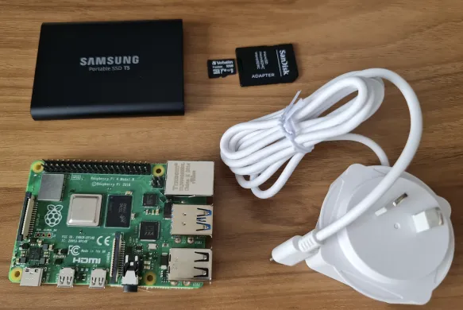
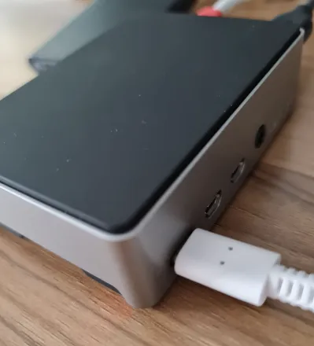
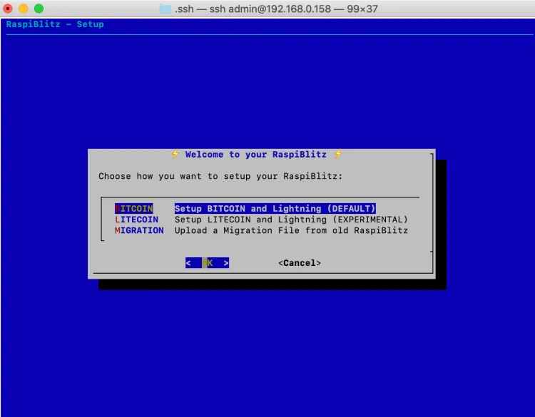
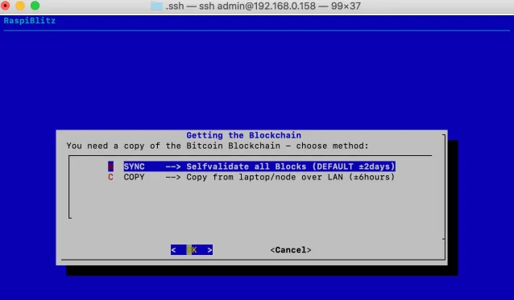

Il RaspiBlitz è un nodo Lightning fai-da-te (LND e/o Core Lightning) che funziona insieme a un Bitcoin-Fullnode su un RaspberryPi (SSD da 1TB) e un bel display per una facile configurazione e monitoraggio.

Il RaspiBlitz è principalmente rivolto all'apprendimento di come eseguire il proprio nodo decentralizzato da casa - perché: Non è il tuo nodo, non sono le tue regole. Scopri e sviluppa l'ecosistema in crescita della Lightning Network diventandone una parte integrante. Costruiscilo come parte di un workshop o come progetto da fare nel weekend.


RASPIBLITZ - Come eseguire un nodo Lightning e Bitcoin Full Node di BTC session

# Guida all'installazione di Raspiblitz di Parman

Il Raspiblitz è un eccellente sistema per eseguire un nodo Bitcoin e le relative app. Raccomando questo e il nodo My Node alla maggior parte degli utenti (avere due nodi per la ridondanza sarebbe ideale). Un vantaggio importante è che il nodo Raspiblitz è "Software Open Source gratuito", a differenza di MyNode o Umbrel. Perché è importante? Vlad Costa spiega. Puoi anche eseguire il RaspbiBlitz con una connessione WiFi anziché Ethernet - ecco una guida supplementare per questo. (Non ho trovato un modo per farlo con MyNode).

Puoi acquistare un nodo già pronto con uno schermo miniaturizzato allegato, oppure puoi costruirlo tu stesso (non hai bisogno di uno schermo).

La guida sulla pagina di GitHub è eccellente, ma potrebbe essere troppo dettagliata per un utente moderatamente esperto. Le mie istruzioni saranno più concise e sperabilmente più facili da seguire.

Essenzialmente, il processo è molto simile al processo di configurazione di un nodo MyNode con un Raspberry Pi 4. La guida Raspiblitz suggerisce di acquistare un monitor, ma in realtà non ne hai bisogno e non lo consiglierei. Non hai nemmeno bisogno di una tastiera o di un mouse aggiuntivi. Accedi semplicemente al menu terminale del dispositivo tramite un computer sulla stessa rete domestica e utilizza il comando ssh tramite il terminale. Questo è possibile con Linux/Mac (facile) e un po' più difficile con Windows.

## Passo 1: Acquista l'attrezzatura.

Hai bisogno esattamente della stessa attrezzatura necessaria per eseguire un nodo MyNode. Puoi provare uno o l'altro, l'unica differenza è il contenuto della scheda micro SD.

- Raspberry Pi 4, 4 GB di memoria o 8 GB (4 GB sono più che sufficienti)
- Alimentatore ufficiale Raspberry Pi (Molto importante! Non prendere uno generico, seriamente)
- Una custodia per il Pi (La custodia FLIRC è fantastica. L'intera custodia funge da dissipatore di calore e non hai bisogno di una ventola, che potrebbe essere rumorosa)
- Scheda microSD da 32 GB (ne hai bisogno di una, ma ne sono utili alcune)
- Un lettore di schede di memoria (la maggior parte dei computer non ha uno slot per una scheda microSD).
- Hard disk esterno SSD da 1 TB.
- Un cavo Ethernet (per collegarti al router di casa).

Non hai bisogno di un monitor (o di una tastiera o di un mouse).
Nota: Questo è il disco rigido sbagliato: si tratta di un disco rigido esterno portatile. Non è un SSD. L'SSD è fondamentale. Ecco perché è economico (Prezzo in AUD)


Questo è il tipo giusto da ottenere:


Questo è più veloce, ma inutilmente costoso:


## Passo 2: Scarica l'immagine di Raspiblitz

Vai al sito web di Raspiblitz su Github e trova il link "download image":


L'hash sha-256 del file scaricato è fornito sul sito web. Cambierà con ogni aggiornamento. Se non capisci di cosa si tratta, dovresti farlo, quindi ho scritto una guida che puoi leggere qui.


## Passo 3: Verifica l'immagine

Prima di procedere, se non conosci il sistema di file sulla riga di comando, è facile imparare e dovresti farlo.

Ecco un video utile per Linux, ma si applica anche a Mac.

Per Windows, ecco un semplice tutorial.
Mac/Linux

Aspetta che il file finisca di scaricare (importante!), quindi apri il terminale, vai nella cartella in cui hai scaricato il file e digita il seguente comando...

```
shasum -a 256 xxxxxxxxxxxxxx
```

dove xxxxxxxxxxxxxx è il nome del file appena scaricato. Se non ti trovi nella directory in cui si trova il file, devi digitare il percorso completo.

Il computer ci pensa per circa 20 secondi. Verifica che l'hashfile di output corrisponda a quello scaricato dal sito web nel passaggio precedente. Se è identico, puoi procedere.
Windows

Apri il prompt dei comandi e vai nella cartella in cui è stato scaricato il file, quindi digita questo comando:

```
certUtil -hashfile xxxxxxxxxxxxxxx SHA256
```

dove xxxxxxxxxxxxxx è il nome del file appena scaricato. Se non ti trovi nella directory in cui si trova il file, devi digitare il percorso completo.

Il computer ci pensa per circa 20 secondi. Verifica che l'hashfile di output corrisponda a quello scaricato dal sito web nel passaggio precedente. Se è identico, puoi procedere.

## Passo 4: Flash della scheda SD

Puoi usare Balena Etcher per farlo. Scaricalo qui.

Etcher è autoesplicativo da usare. Inserisci la tua scheda micro SD e flasha il software Raspiblitz (.img file) sulla scheda SD.


Una volta fatto, il disco non è più leggibile. Potresti ricevere un errore dal sistema operativo e il disco dovrebbe scomparire dal desktop. Rimuovi la scheda.

## Passo 5: Configura il Pi e inserisci la scheda SD

Le parti (il case non è mostrato):




Collega il cavo Ethernet e il connettore USB del disco rigido (ancora senza alimentazione). Evita di collegarti alle porte USB di colore blu al centro. Sono USB 3. Usa la porta USB 2, anche se il disco potrebbe essere compatibile con USB 3 (più affidabile).


La scheda micro SD va qui:


Infine, collega l'alimentazione:



## Passo 6: Trova l'indirizzo IP del Pi

Non hai mai bisogno di un monitor con il Raspiblitz. Tuttavia, hai bisogno di un altro computer nella rete domestica. Se il tuo Raspberry Pi non è collegato tramite ethernet e vuoi fare affidamento sul WiFi, trovare l'indirizzo IP richiede alcune competenze informatiche. Mi dispiace, non posso aiutarti. Hai bisogno di una connessione ethernet. (Il problema deriva dalla necessità di accedere a un monitor e al sistema operativo per connettersi al WiFi e inserire una password.)
Controlla il tuo router per una lista di tutti gli indirizzi IP dei dispositivi connessi.

Ho digitato 192.168.0.1 nel browser (istruzioni fornite dal mio router), ho effettuato l'accesso e sono riuscito a vedere il mio dispositivo con l'indirizzo IP 192.168.0.191. Nota che questi indirizzi IP non sono visibili pubblicamente su Internet (passano prima attraverso il router), sono solo identificatori per i dispositivi nella tua rete domestica.

Trovare l'indirizzo IP è cruciale.

> AGGIORNAMENTO: puoi utilizzare il terminale su un Mac o una macchina Linux per trovare l'indirizzo IP di tutti i dispositivi connessi tramite Ethernet nella rete domestica utilizzando il comando "arp -a". L'output non è così bello come quello che mostrerà il router, ma tutte le informazioni necessarie sono presenti. Se non è ovvio quale sia il Raspberry Pi, prova con il metodo del tentativo ed errore.

## Passaggio 7: Accedi al Pi tramite SSH

Ricorda di inserire la scheda SD nel Raspberry Pi prima di accenderlo. Aspetta qualche minuto, quindi su un altro computer Linux/Mac, apri il terminale.

Per Mac/Linux, nel terminale digita:

```
ssh admin@indirizzo_IP_del_tuo_Pi
```

Per Windows, dovrai installare putty per accedere al Pi tramite SSH. Digita lo stesso comando di cui sopra.

La prima volta che lo fai, o ogni volta che cambi il sistema operativo del Pi cambiando la scheda SD, potresti ricevere o meno questo errore...


Il modo per risolverlo è navigare fino alla posizione del file "known_hosts" (te lo indica nel messaggio di errore) e cancellarlo. Il comando è "rm known_hosts"

Quindi, ripeti il comando ssh per effettuare l'accesso. Accadrà questo...


Digita "yes" (per intero) per procedere.

Se hai successo, ti verrà chiesta una password. Questa non è per il tuo computer, ma per il raspiblitz. La password predefinita è "raspiblitz" e la cambierai successivamente. La finestra del terminale diventerà blu e avrai opzioni di menu simili ai vecchi menu DOS. Naviga con i tasti freccia o con il mouse.



Segui le istruzioni, imposta le tue password e quindi rileverà il tuo hard disk e ti darà l'opzione di formattarlo se necessario.

Poi ti verrà chiesto se vuoi copiare i dati della blockchain da un'altra fonte o scaricarli nuovamente. Copiarli è un processo di apprendimento e le istruzioni sono abbastanza buone, quindi è utile tenerle a portata di mano...


Il modo semplice ma più lento è scaricare l'intera catena da zero...



Molto testo lampeggerà sullo schermo del terminale. Potresti confonderlo con il processo di download della blockchain, ma a me sembra che stia generando una chiave privata per la comunicazione.

Poi compaiono le opzioni di Lightning.


Crea una nuova password per bloccare il tuo portafoglio Lightning, quindi verrà creato un nuovo portafoglio e ti verranno fornite 24 parole da annotare...


Assicurati di scriverlo e tenerlo al sicuro. Ho sentito di una persona che non lo ha fatto perché non aveva intenzione di utilizzare il lightning, ma poi, un anno dopo, ha deciso di utilizzarlo e ha aperto dei canali. Poi, rendendosi conto che le sue parole non erano state salvate, e ricordo che non era possibile estrarre nuovamente le parole dal dispositivo, ha dovuto chiudere tutti i suoi canali e ricominciare da capo. È riuscito a cavarsela, ma altri potrebbero non essere così fortunati.
A seguito di ciò, alcuni minuti di testo scorrono nella finestra del terminale. Poi...


Verrai disconnesso dalla sessione ssh. Effettua nuovamente l'accesso, questa volta con la tua nuova password, password A. Una volta dentro, ti verrà chiesta la password C per sbloccare il tuo portafoglio lightning.

Ora aspettiamo. Ci vediamo tra 2 settimane. Puoi chiudere il terminale, non fa nulla al Pi, è solo una finestra di comunicazione.


Se per qualche motivo desideri spegnere il Pi prima che il blockchain abbia finito di scaricare, va bene purché lo faccia correttamente. Il blockchain continuerà a scaricare da dove si era interrotto una volta che ti riconnetti.

Premi CTRL+c per uscire dalla schermata blu. Accederai al terminale Linux del Pi. Qui puoi digitare "menu" che carica la schermata seguente e da lì puoi spegnere il Pi.


FINE della guida

Quindi da ora il tuo nodo è pronto per partire. Se hai ancora bisogno di aiuto per navigare tra le opzioni, consulta il github per ulteriori tutorial e guide https://github.com/raspiblitz/raspiblitz#feature-documentation
