O RaspiBlitz é um nó Lightning (LND e/ou Core Lightning) faça-você-mesmo que roda junto com um Bitcoin-Fullnode em um RaspberryPi (1TB SSD) e uma tela agradável para facilitar a configuração e monitoramento.

O RaspiBlitz é principalmente direcionado para aprender como executar seu próprio nó descentralizado em casa - porque: Não é o seu Nó, Não são as suas Regras. Descubra e desenvolva o crescente ecossistema da Lightning Network se tornando uma parte integral dele. Construa-o como parte de um workshop ou como um projeto de fim de semana.


RASPIBLITZ - Como Executar um Nó Lightning e Bitcoin Full Node por BTC session

# Guia de Configuração do Raspiblitz do Parman

O Raspiblitz é um excelente sistema para executar um Nó Bitcoin e aplicativos associados. Eu recomendo isso e o nó My Node para a maioria dos usuários (Tenha dois nós para redundância, idealmente). Uma grande vantagem é que o nó Raspiblitz é "Software Livre e de Código Aberto", ao contrário do MyNode ou Umbrel. Por que isso é importante? Vlad Costa explica. Você também pode executar o RaspbiBlitz com uma conexão WiFi em vez de Ethernet - aqui está um guia complementar para isso. (Eu não encontrei uma maneira de fazer isso com o MyNode).

Você pode comprar um nó pronto com uma tela mini acoplada, ou pode construí-lo você mesmo (você não precisa de uma tela).

O guia na página do github é excelente, mas possivelmente muito detalhado para um usuário moderadamente experiente. Minhas instruções serão mais sucintas e, esperançosamente, mais fáceis de seguir.

Essencialmente, o processo é muito semelhante ao processo de configuração de um nó MyNode com um Raspberry Pi 4. O guia Raspiblitz sugere que você compre um monitor, mas você realmente não precisa de um, e eu não recomendaria. Você nem precisa de um teclado ou mouse extras. Acesse o menu do terminal do dispositivo por meio de um computador na mesma rede doméstica e use o comando ssh usando o terminal. Isso é possível com Linux/Mac (fácil) e um pouco mais difícil com o Windows.

## Passo 1: Compre o equipamento.

Você precisa exatamente do mesmo equipamento necessário para executar um nó MyNode. Você pode experimentar um ou outro, a única diferença é os dados no cartão micro SD.

- Raspberry Pi 4, 4Gb de memória ou 8Gb (4Gb é suficiente)
- Fonte de alimentação oficial do Raspberry Pi (Muito importante! Não compre genérico, sério)
- Uma caixa para o Pi. (A caixa FLIRC é incrível. A caixa inteira é um dissipador de calor e você não precisa de um ventilador, que pode ser barulhento)
- Cartão microSD de 32 Gb (você precisa de um, mas alguns são úteis)
- Um leitor de cartão de memória (a maioria dos computadores não tem uma entrada para cartão microSD).
- Disco rígido externo SSD de 1Tb.
- Um cabo Ethernet (para conectar ao roteador doméstico).

Você não precisa de um monitor (ou teclado ou mouse).
'Nota: Este é o disco rígido errado: Este é um disco rígido externo portátil. Não é um SSD. SSD é crucial. É por isso que é barato (Preço em AUD)


Este é o tipo certo para obter:

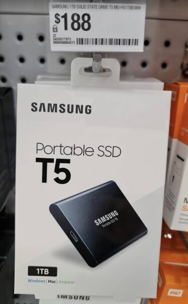

Isso é mais rápido, mas desnecessariamente caro:


## Passo 2: Baixe a imagem do Raspiblitz

Acesse o site do Raspiblitz no GitHub e encontre o link "download image":


O hash sha-256 do arquivo baixado é fornecido no site. Ele mudará a cada atualização. Se você não entende o que isso significa, deveria, então escrevi um guia que você pode ler aqui.


## Passo 3: Verifique a imagem

Antes de prosseguir, se você não conhece o sistema de arquivos na linha de comando, é fácil aprender e você deveria.

Aqui está um vídeo útil para Linux, mas também se aplica ao Mac.

Para o Windows, aqui está um tutorial simples.
Mac/Linux

Aguarde o término do download do arquivo (importante!), em seguida, abra o terminal, navegue até onde você baixou o arquivo e digite o seguinte comando...

```
shasum -a 256 xxxxxxxxxxxxxx
```

onde xxxxxxxxxxxxxx é o nome do arquivo que você acabou de baixar. Se você não estiver no diretório onde o arquivo está, você terá que digitar o caminho completo.

O computador pensa por cerca de 20 segundos. Verifique se o hash do arquivo de saída corresponde ao baixado no site no passo anterior. Se for idêntico, você pode prosseguir.
Windows

Abra o prompt de comando e navegue até onde o arquivo foi baixado e digite este comando:

```
certUtil -hashfile xxxxxxxxxxxxxxx SHA256
```

onde xxxxxxxxxxxxxx é o nome do arquivo que você acabou de baixar. Se você não estiver no diretório onde o arquivo está, você terá que digitar o caminho completo.

O computador pensa por cerca de 20 segundos. Verifique se o hash do arquivo de saída corresponde ao baixado no site no passo anterior. Se for idêntico, você pode prosseguir.

## Passo 4: Grave o cartão SD

Você pode usar o Balena Etcher para fazer isso. Baixe-o aqui.

O Etcher é autoexplicativo de usar. Insira seu cartão micro SD e grave o software Raspiblitz (arquivo .img) no cartão SD.


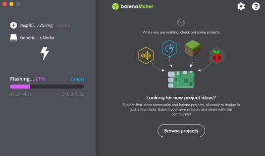


Uma vez concluído, o drive não é mais legível. Você pode receber um erro do sistema operacional e o drive deve desaparecer da área de trabalho. Retire o cartão.

## Passo 5: Configure o Pi e insira o cartão SD

As peças (case não mostrado):

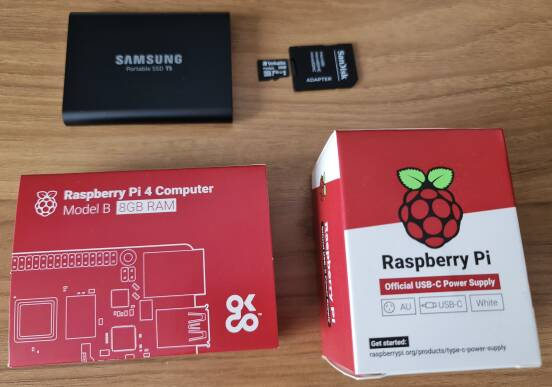

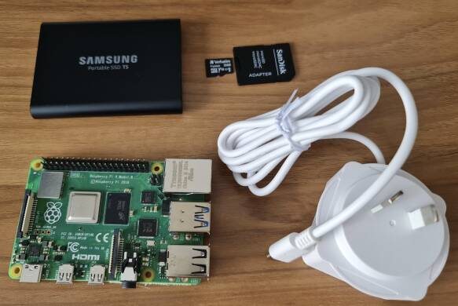

Conecte o cabo Ethernet e o conector USB do disco rígido (ainda não conecte a energia). Evite conectar às portas USB azuis no centro. Elas são USB 3. Use a porta USB 2, mesmo que o disco possa ser compatível com USB 3 (mais confiável).


O cartão micro SD vai aqui:

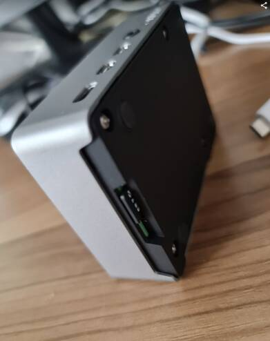

Por fim, conecte a energia:

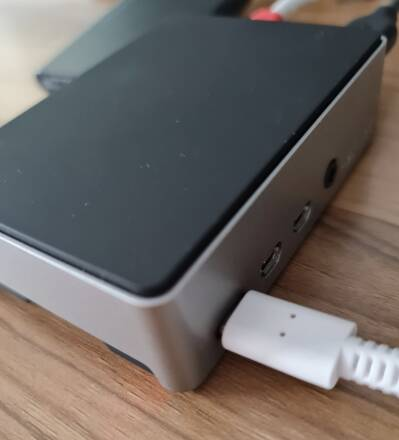

## Passo 6: Encontre o endereço IP do Pi'

Você nunca precisa de um monitor com o Raspiblitz. No entanto, você precisa de outro computador na rede doméstica. Se o seu Pi não estiver conectado por ethernet e você quiser usar o WiFi, encontrar o IP requer algumas habilidades em informática. Não posso ajudar, desculpe. Você precisa de uma conexão ethernet. (O problema vem da necessidade de acesso a um monitor e ao sistema operacional para conectar o WiFi e inserir uma senha.)
Verifique o seu roteador para obter uma lista de todos os IPs dos dispositivos conectados.

Digitei 192.168.0.1 no navegador (instruções que vieram com o meu roteador), fiz login e consegui ver meu dispositivo com o IP 192.168.0.191. Observe que esses endereços IP não são visíveis publicamente na internet (eles passam pelo roteador primeiro), eles são apenas identificadores para dispositivos em sua rede doméstica.

Encontrar o IP é crucial.

> ATUALIZAÇÃO: você pode usar o terminal em um Mac ou em uma máquina Linux para encontrar o endereço IP de todos os dispositivos conectados por Ethernet na rede doméstica usando o comando "arp -a". A saída não é tão bonita quanto a que o roteador exibirá, mas todas as informações necessárias estão lá. Se não estiver óbvio qual é o Pi, faça tentativa e erro.

## Passo 7: Acesse o Pi via SSH

Lembre-se de inserir o cartão SD no Pi antes de ligá-lo. Aguarde alguns minutos e, em seguida, em outro computador com Linux/Mac, abra o terminal.

Para Mac/Linux, no terminal, digite:

```
ssh admin@endereço_IP_do_seu_Pi
```

Para Windows, você precisará instalar o putty para acessar o Pi via SSH. Digite o mesmo comando acima.

Na primeira vez que fizer isso, ou sempre que você alterar o sistema operacional do Pi trocando o cartão SD, você poderá ou não receber este erro...

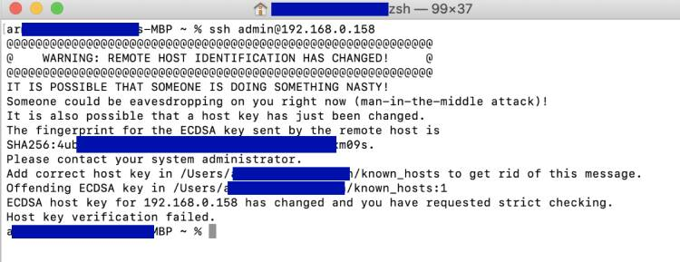

A maneira de corrigir é navegar até onde o arquivo "known_hosts" está (isso é informado na mensagem de erro) e excluí-lo. O comando é "rm known_hosts"

Em seguida, repita o comando ssh para fazer login. Isso acontecerá...


Digite yes (por extenso) para prosseguir.

Se for bem-sucedido, você será solicitado a inserir uma senha. Isso não é para o seu computador, mas sim para o raspiblitz. A senha genérica é "raspiblitz" e você a alterará posteriormente. A janela do terminal ficará azul e você terá opções de menu como os antigos menus do DOS. Navegue com as teclas de seta ou com o mouse.

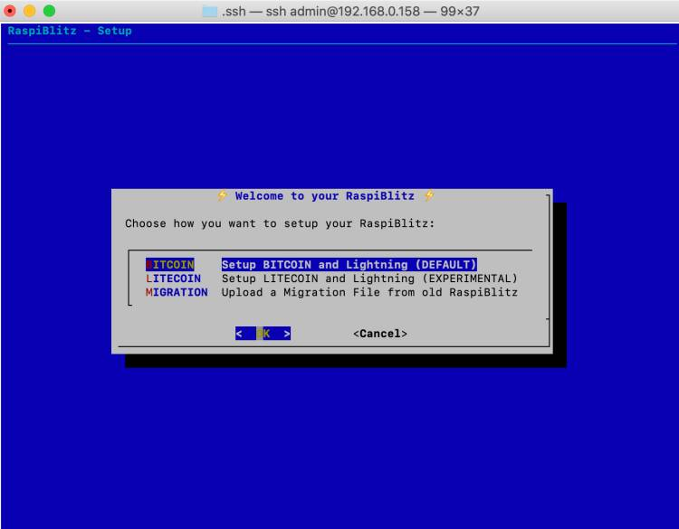

Siga as instruções, defina suas senhas e, em seguida, ele detectará seu disco rígido e dará a opção de formatá-lo, se necessário.

Em seguida, você será perguntado se deseja copiar os dados da blockchain de outra fonte ou baixá-los novamente. Copiar é um processo de aprendizado e as instruções são bastante boas e úteis...

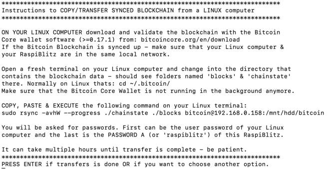

A maneira simples, mas mais lenta, é baixar toda a cadeia do zero...

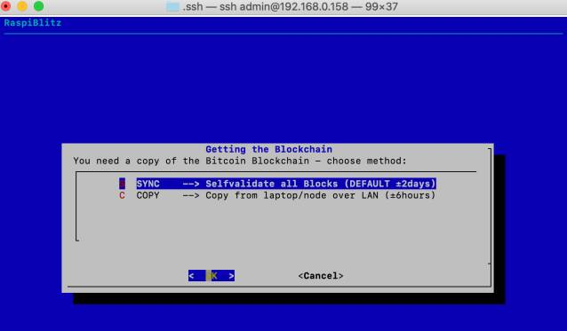

Muito texto será exibido rapidamente na tela do terminal. Você pode confundir isso com o processo de download da blockchain, mas parece, para mim, que está gerando uma chave privada para comunicação.

Em seguida, as opções do Lightning aparecem.

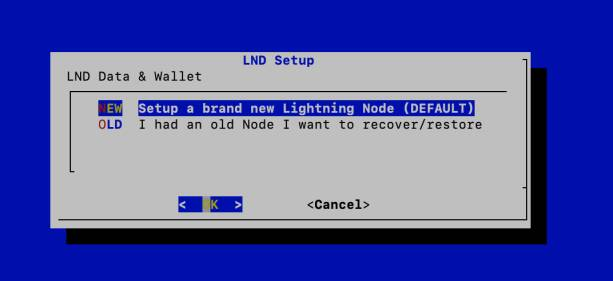

Crie uma nova senha para proteger sua carteira Lightning, em seguida, uma nova carteira será criada e você receberá 24 palavras para anotar...

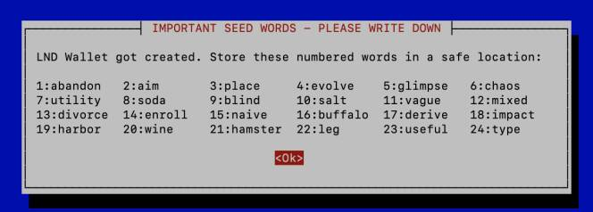

Certifique-se de anotá-lo e mantê-lo seguro. Ouvi falar de uma pessoa que não o fez porque não planejava usar o lightning, mas depois de um ano decidiu usá-lo e abriu canais. Em seguida, percebendo que suas palavras não estavam sendo copiadas, e lembro que não era possível extrair as palavras novamente do dispositivo, ele teve que fechar todos os seus canais e começar de novo. Ele se safou, mas outros podem não ter tanta sorte.
Após isso, alguns minutos de texto rolam na janela do terminal. Em seguida...

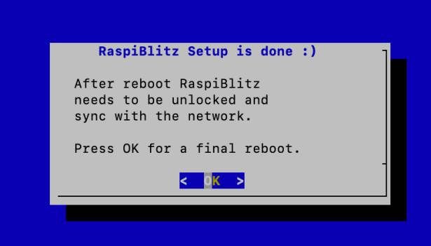

Você será desconectado da sessão ssh. Faça login novamente, desta vez com sua nova senha, senha A. Depois de entrar, você será solicitado a fornecer a senha C para desbloquear sua carteira lightning.

Agora, vamos esperar. Nos vemos em 2 semanas. Você pode fechar o terminal, ele não afeta o Pi, é apenas uma janela de comunicação.


Se, por algum motivo, você quiser desligar o Pi antes que o blockchain termine de ser baixado, tudo bem, desde que você faça isso corretamente. O blockchain continuará sendo baixado de onde parou assim que você reconectar.

Pressione CTRL+c para sair da tela azul. Você estará acessando o terminal Linux do Pi. Aqui você pode digitar "menu", que carrega a seguinte tela, e a partir daí você pode desligar o Pi.

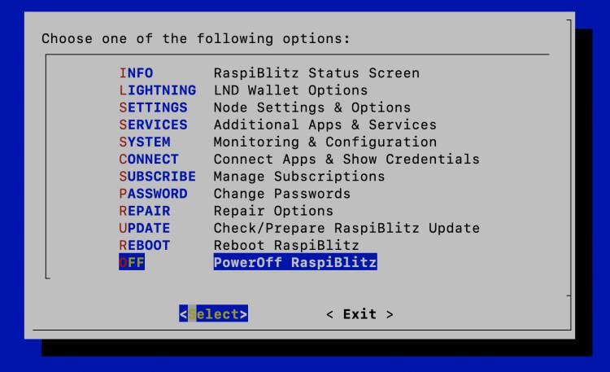

FIM do guia

A partir de agora, seu nó está pronto para funcionar. Se você ainda precisar de ajuda para navegar em mais opções, consulte o GitHub para obter mais tutoriais e guias https://github.com/raspiblitz/raspiblitz#feature-documentation
