Das Betreiben und Verwenden eines eigenen Knotens ist entscheidend, um aktiv am Bitcoin-Netzwerk teilzunehmen. Obwohl das Betreiben eines Bitcoin-Knotens dem Benutzer keinen finanziellen Vorteil bringt, ermöglicht es ihm, seine Privatsphäre zu wahren, unabhängig zu handeln und sein Vertrauen in das Netzwerk zu kontrollieren.

In diesem Artikel werden wir uns ausführlich mit RoninDojo befassen, einer großartigen Lösung, um einen eigenen Bitcoin-Knoten zu betreiben.

### Inhaltsverzeichnis:

- Was ist RoninDojo?
- Welche Hardware sollte gewählt werden?
- Wie installiert man RoninDojo?
- Wie verwendet man RoninDojo?
- Fazit

Wenn Sie mit dem Betrieb und der Rolle eines Bitcoin-Knotens nicht vertraut sind, empfehle ich Ihnen, diesen Artikel zu lesen: Der Bitcoin-Knoten - Teil 1/2: Technische Grundlagen.

## Was ist RoninDojo?

Dojo ist ein vollständiger Bitcoin-Knotenserver, der von den Teams von Samouraï Wallet entwickelt wurde. Sie können ihn frei auf jeder Maschine installieren.

RoninDojo ist ein Installationsassistent und Verwaltungstool für Dojo und verschiedene andere Tools. RoninDojo übernimmt die ursprüngliche Implementierung von Dojo und fügt viele weitere Tools hinzu, während die Installation und Verwaltung erleichtert wird.

Sie bieten auch eine "Plug-and-Play"-Hardware, den RoninDojo Tanto, mit vorinstalliertem RoninDojo auf einem von ihren Teams zusammengebauten Gerät. Der Tanto ist eine kostenpflichtige Lösung, die für diejenigen interessant ist, die sich nicht mit technischen Details befassen möchten.

Der Code von RoninDojo ist Open Source, daher ist es auch möglich, diese Lösung auf eigener Hardware zu installieren. Diese Option ist kostengünstig, erfordert jedoch etwas mehr Aufwand, was wir in diesem Artikel tun werden.

RoninDojo ist ein Dojo, daher können Sie problemlos Whirlpool CLI in Ihren Bitcoin-Knoten integrieren, um das bestmögliche CoinJoin-Erlebnis zu haben. Mit Whirlpool CLI können Sie nicht nur Ihre Bitcoins rund um die Uhr remixen, ohne Ihren eigenen Computer eingeschaltet lassen zu müssen, sondern Sie können auch Ihre Privatsphäre erheblich verbessern.

RoninDojo enthält viele weitere Tools, die auf Ihrem Dojo basieren, wie z.B. den Boltzmann-Rechner, mit dem Sie den Grad der Vertraulichkeit einer Transaktion bestimmen können, den Electrum-Server, um Ihre verschiedenen Bitcoin-Wallets mit Ihrem Knoten zu verbinden, oder den Mempool-Server, um Ihre Transaktionen privat zu beobachten.
Im Vergleich zu einer anderen Knotenlösung wie Umbrel, die ich Ihnen in diesem Artikel vorgestellt habe, ist RoninDojo stark auf "On Chain" -Lösungen und Tools zur Optimierung der Benutzerdatenschutz ausgerichtet. RoninDojo ermöglicht daher keine Interaktion mit dem Lightning Network.
Ein RoninDojo bietet weniger Tools im Vergleich zu einem Umbrel, aber die wenigen wesentlichen Funktionen für einen Bitcoiner auf Ronin sind unglaublich stabil.

Wenn Sie also nicht alle Funktionen eines Umbrel-Servers benötigen und nur einen einfachen und stabilen Knoten mit einigen wesentlichen Tools wie Whirlpool oder Mempool wünschen, ist RoninDojo sicherlich eine gute Lösung für Sie.

Meiner Meinung nach ist die Entwicklungslinie von Umbrel stark auf das Lightning Network und vielseitige Tools ausgerichtet. Es bleibt ein Bitcoin-Knoten, aber man versucht, ihn zu einem multitaskingfähigen Mini-Server zu machen. Im Gegensatz dazu nähert sich die Entwicklungslinie von RoninDojo eher der von Samourai Wallet-Teams und konzentriert sich auf die wesentlichen Tools eines Bitcoiners, die ihm volle Unabhängigkeit und optimiertes Bitcoin-Datenschutzmanagement ermöglichen.

Bitte beachten Sie, dass die Einrichtung eines RoninDojo-Knotens etwas komplexer ist als die eines Umbrel-Knotens.

Nun, da wir ein Bild von RoninDojo gezeichnet haben, schauen wir uns an, wie dieser Knoten eingerichtet wird.

## Welche Hardware wählen?

Für die Auswahl der Maschine, auf der RoninDojo gehostet und ausgeführt wird, stehen Ihnen mehrere Optionen zur Verfügung.

Wie bereits erwähnt, ist die einfachste Option, den Tanto zu bestellen, eine Plug-and-Play-Maschine, die speziell für diesen Zweck entwickelt wurde. Um Ihren eigenen zu bestellen, gehen Sie hierhin: https://shop.ronindojo.io/product-category/nodes/.

Da das RoninDojo-Team Open-Source-Code produziert, ist es auch möglich, RoninDojo auf anderen Maschinen zu implementieren. Die neuesten Versionen des Installationsassistenten finden Sie auf dieser Seite: https://ronindojo.io/en/downloads.html, und die neuesten Code-Versionen finden Sie auf dieser Seite: https://code.samourai.io/ronindojo/RoninDojo.

Persönlich habe ich es auf einem Raspberry Pi 4 8GB installiert und alles funktioniert einwandfrei.

Beachten Sie jedoch, dass das RoninDojo-Team darauf hinweist, dass es häufig Probleme mit dem Gehäuse und dem SSD-Adapter gibt. Es wird daher nicht empfohlen, ein Gehäuse mit einem Kabel für das SSD Ihrer Maschine zu verwenden. Verwenden Sie stattdessen eine Speichererweiterungskarte, die speziell für Ihr Motherboard entwickelt wurde, wie diese: Raspberry Pi 4 Speichererweiterungskarte.

Hier ist ein Beispiel für die Einrichtung Ihres eigenen RoninDojo-Knotens:

- Ein Raspberry Pi 4.
- Ein Gehäuse mit einem Lüfter.
- Eine kompatible Speichererweiterungskarte.
- Ein Stromkabel.
- Eine industrielle microSD-Karte mit 16 GB oder mehr.
- Eine SSD mit 1 TB oder mehr.
- Ein RJ45-Ethernetkabel, empfohlen wird Kategorie 8.

## Wie installiere ich RoninDojo?

### Schritt 1: Vorbereiten der bootfähigen microSD-Karte.

Sobald Sie Ihre Maschine zusammengebaut haben, können Sie mit der Installation von RoninDojo beginnen. Erstellen Sie zunächst eine bootfähige microSD-Karte, indem Sie das entsprechende Disk-Image darauf brennen.

Legen Sie Ihre microSD-Karte in Ihren persönlichen Computer ein und besuchen Sie dann die offizielle RoninDojo-Website, um das RoninOS-Disk-Image herunterzuladen: https://ronindojo.io/en/downloads.html.

Laden Sie das Disk-Image herunter, das zu Ihrer Hardware passt. In meinem Fall habe ich das Image "MANJARO-ARM-RONINOS-RPI4-22.03.IMG.XZ" heruntergeladen:

Nachdem das Image heruntergeladen wurde, überprüfen Sie seine Integrität mithilfe der entsprechenden .SHA256-Datei. Wie Sie dies im Detail tun können, wird in diesem Artikel beschrieben: Wie überprüft man die Integrität einer Bitcoin-Software unter Windows?

Spezifische Anweisungen zur Überprüfung der Integrität von RoninOS finden Sie auch auf dieser englischen Seite: https://wiki.ronindojo.io/en/extras/verify.

Um dieses Image auf Ihre microSD-Karte zu brennen, können Sie eine Software wie Balena Etcher verwenden, die Sie hier herunterladen können: https://www.balena.io/etcher/.

Wählen Sie das Image in Etcher aus und flashen Sie es auf die microSD-Karte:

Sobald der Vorgang abgeschlossen ist, können Sie die bootfähige microSD-Karte in den Raspberry Pi einlegen und die Maschine einschalten.

### Schritt 2: RoninOS konfigurieren.

RoninOS ist das Betriebssystem Ihres RoninDojo-Knotens. Es handelt sich um eine modifizierte Version von Manjaro, einer Linux-Distribution. Nachdem Sie Ihre Maschine gestartet und einige Minuten gewartet haben, können Sie mit der Konfiguration beginnen.

Um sich remote mit Ihrem RoninDojo-Knoten zu verbinden, müssen Sie die IP-Adresse Ihrer Maschine finden. Dazu können Sie beispielsweise auf das Administrations-Dashboard Ihres Internet-Routers zugreifen oder eine Software wie https://angryip.org/ verwenden, um Ihr lokales Netzwerk zu scannen und die IP-Adresse der Maschine zu finden.

Sobald Sie die IP-Adresse gefunden haben, können Sie von einem anderen Computer im selben lokalen Netzwerk aus mit SSH auf Ihre Maschine zugreifen.

Öffnen Sie einfach das Terminal auf einem Computer mit MacOS oder Linux. Auf einem Computer mit Windows können Sie ein spezialisiertes Tool wie Putty oder direkt Windows PowerShell verwenden.

Sobald das Terminal geöffnet ist, geben Sie den folgenden Befehl ein:

> ssh root@192.168.?.?

Ersetzen Sie die beiden Fragezeichen einfach durch die zuvor gefundene IP-Adresse Ihres RoninDojo.
Tipp: Klicken Sie mit der rechten Maustaste, um in einem Shell-Programm ein Element einzufügen.

Anschließend gelangen Sie zum Konfigurationspanel von Manjaro. Wählen Sie die richtige Tastaturbelegung aus, indem Sie mit den Pfeiltasten das Dropdown-Menü durchsuchen.

Wählen Sie einen Benutzernamen und ein Passwort für Ihre Sitzung aus. Verwenden Sie ein starkes Passwort und machen Sie eine sichere Sicherungskopie davon. Sie können vorübergehend ein schwaches Passwort während der Installation verwenden und es später problemlos mit der Möglichkeit zum "Kopieren und Einfügen" in RoninUI ändern. Dadurch können Sie ein sehr sicheres Passwort verwenden, ohne zu viel Zeit mit dem manuellen Schreiben während der Einrichtung von Manjaro zu verbringen.

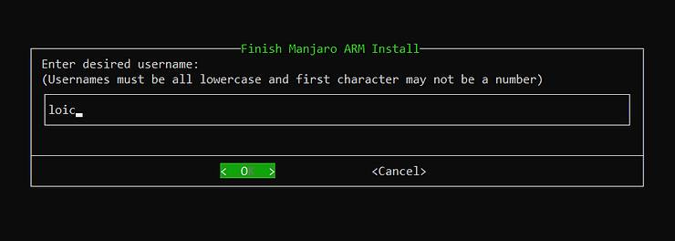

Sie werden auch aufgefordert, ein Root-Passwort festzulegen. Geben Sie für das Root-Passwort direkt ein starkes Passwort ein. Sie haben keine Möglichkeit, es später über RoninUI zu ändern. Denken Sie auch daran, dieses Root-Passwort gut zu sichern.

Geben Sie dann Ihren Standort und Ihre Zeitzone ein.

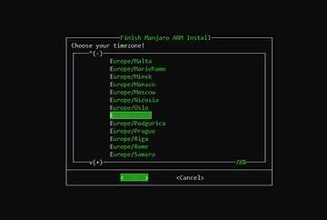

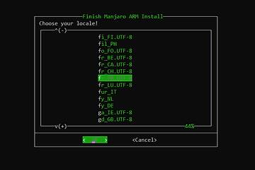

Wählen Sie anschließend einen Hostnamen aus.

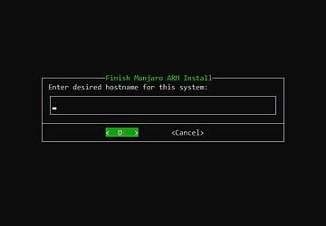

Überprüfen Sie abschließend die Manjaro-Konfigurationsinformationen und bestätigen Sie.

Schritt 3: RoninDojo herunterladen.

Die anfängliche Konfiguration von RoninOS wird durchgeführt. Sobald dies abgeschlossen ist, wie im obigen Screenshot, wird die Maschine neu gestartet. Warten Sie dann einen Moment und geben Sie den folgenden Befehl ein, um erneut eine Verbindung zu Ihrer RoninDojo-Maschine herzustellen:

> ssh Benutzername@192.168.?.?

Ersetzen Sie einfach "Benutzername" durch den zuvor gewählten Benutzernamen und die Fragezeichen durch die IP-Adresse Ihrer RoninDojo-Maschine.

Geben Sie dann Ihr Benutzerpasswort ein.

Im Terminal sieht das so aus:

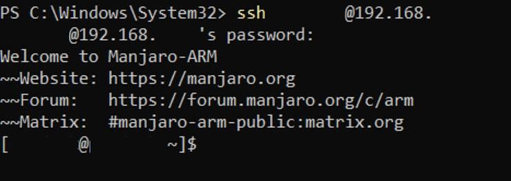

Sie sind jetzt mit Ihrer Maschine verbunden, die derzeit nur RoninOS hat. Jetzt müssen Sie RoninDojo installieren.

Laden Sie die neueste Version von RoninDojo herunter, indem Sie den folgenden Befehl eingeben:

> git clone https://code.samourai.io/ronindojo/RoninDojo

Der Download erfolgt schnell. Im Terminal sehen Sie Folgendes:

Warten Sie, bis der Download abgeschlossen ist, und installieren Sie dann die Benutzeroberfläche von RoninDojo und greifen Sie darauf zu, indem Sie den folgenden Befehl verwenden:

> ~/RoninDojo/ronin

Sie werden dann aufgefordert, Ihr Benutzerpasswort einzugeben:

Diese Anweisung ist nur beim ersten Zugriff auf Ihren RoninDojo erforderlich. Danach müssen Sie lediglich den Befehl [SSH pseudo@192.168.?.?] eingeben, wobei "pseudo" durch Ihren Benutzernamen und die IP-Adresse Ihres Knotens ersetzt wird, um über SSH auf RoninCLI zuzugreifen. Sie werden nach Ihrem Benutzerpasswort gefragt.

Dann sehen Sie diese wunderschöne Animation:

Dann gelangen Sie schließlich zur Benutzeroberfläche von RoninDojo CLI.

### Schritt 4: RoninDojo installieren.

Navigieren Sie vom Hauptmenü aus mit den Pfeiltasten Ihrer Tastatur zum Menü "System". Verwenden Sie die Eingabetaste, um Ihre Auswahl zu bestätigen.

Gehen Sie dann zum Menü "System Setup & Install".

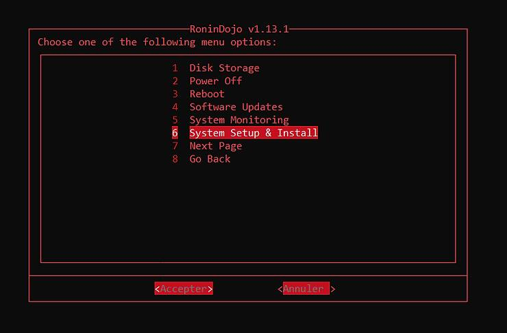

Aktivieren Sie schließlich "System Setup" und "Install RoninDojo", indem Sie die Leertaste verwenden, und wählen Sie "Akzeptieren", um die Installation zu starten.

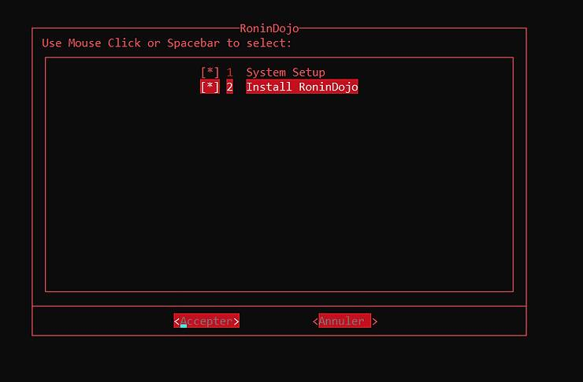

Lassen Sie die Installation in Ruhe durchlaufen. In meinem Fall hat es etwa 2 Stunden gedauert. Lassen Sie Ihr Terminal während des Vorgangs geöffnet.

Schauen Sie gelegentlich auf Ihr Terminal, Sie werden aufgefordert, an bestimmten Stellen der Installation eine Taste zu drücken, wie zum Beispiel hier:

Am Ende der Installation sehen Sie, wie die verschiedenen Container gestartet werden:

Dann wird Ihr Knoten neu gestartet. Verbinden Sie sich erneut mit RoninCLI für den nächsten Schritt.

### Schritt 5: Herunterladen der Proof-of-Work-Kette und Zugriff auf RoninUI.

Nach Abschluss der Installation beginnt Ihr Knoten mit dem Herunterladen der Proof-of-Work-Kette von Bitcoin. Dies wird als IBD (Initial Block Download) bezeichnet. Dies dauert in der Regel zwischen 2 und 14 Tagen, abhängig von Ihrer Internetverbindung und Ihrem Gerät.

Sie können den Fortschritt des Ketten-Downloads über die RoninUI-Webinterface verfolgen.

Um darauf von einem lokalen Netzwerk aus zuzugreifen, geben Sie in die Adressleiste Ihres Browsers ein:

- Entweder direkt die IP-Adresse Ihres Geräts (192.168.?.?)

- Oder: ronindojo.local

Denken Sie daran, Ihr VPN zu deaktivieren, falls Sie eines verwenden.

### Mögliche Abweichung

Wenn Sie keine Verbindung zu RoninUI über Ihren Browser herstellen können, überprüfen Sie die Funktionsfähigkeit der Anwendung über Ihr Terminal, das über SSH mit Ihrem Knoten verbunden ist. Gehen Sie wie folgt vor, um zum Hauptmenü zu gelangen:

- Geben Sie ein: SSH pseudo@192.168.?.? und ersetzen Sie es durch Ihre Anmeldeinformationen.

- Geben Sie Ihr Benutzerpasswort ein.

Nachdem Sie sich im Hauptmenü befinden, gehen Sie zu:

> RoninUI > Neustart

Wenn die Anwendung erfolgreich neu gestartet wird, liegt das Problem wahrscheinlich bei der Verbindung von Ihrem Browser aus. Überprüfen Sie, ob Sie kein VPN verwenden und ob Sie mit demselben Netzwerk wie Ihr Knoten verbunden sind.

Wenn der Neustart einen Fehler ausgibt, versuchen Sie das Betriebssystem zu aktualisieren und dann RoninUI neu zu installieren. Um das Betriebssystem zu aktualisieren:

> System > Software-Updates > Betriebssystem aktualisieren

Nachdem die Aktualisierung und der Neustart abgeschlossen sind, stellen Sie über SSH eine Verbindung zu Ihrem Knoten her und installieren Sie RoninUI erneut:

> RoninUI > Neu installieren

Nach dem erneuten Herunterladen von RoninUI versuchen Sie, sich über Ihren Browser bei RoninUI anzumelden.

> Tipp: Wenn Sie versehentlich aus RoninCLI herauskommen und sich im Manjaro-Terminal befinden, geben Sie einfach den Befehl "ronin" ein, um direkt zum Hauptmenü von RoninCLI zurückzukehren.

### Web-Anmeldung

Sie können sich auch von jedem Netzwerk aus über die RoninUI-Web-Schnittstelle anmelden, indem Sie Tor verwenden. Gehen Sie dazu wie folgt vor: Rufen Sie die Tor-Adresse Ihrer RoninUI aus RoninCLI ab:

> Anmeldedaten > Ronin UI

Notieren Sie sich die mit .onion endende Tor-Adresse und melden Sie sich bei Ronin UI an, indem Sie diese Adresse in Ihrem Tor-Browser eingeben. Achten Sie darauf, Ihre Anmeldedaten nicht preiszugeben, da es sich um sensible Informationen handelt.

Nach der Anmeldung werden Sie nach Ihrem Benutzerpasswort gefragt. Dies ist dasselbe Passwort, das Sie für die Anmeldung über SSH verwenden.

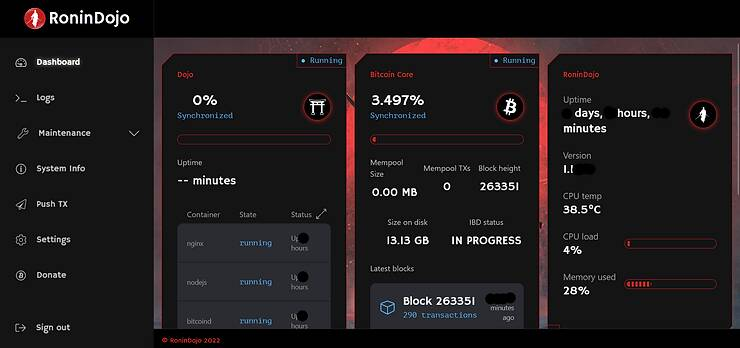

Hier können Sie den Fortschritt der IBD (Initial Block Download) verfolgen. Bitte haben Sie Geduld, da Sie alle Transaktionen, die seit dem 3. Januar 2009 auf Bitcoin durchgeführt wurden, wiederherstellen.

Nachdem die gesamte Blockchain heruntergeladen wurde, wird der Indexer die Datenbank komprimieren. Dieser Vorgang dauert etwa 12 Stunden. Sie können auch den Fortschritt unter "Indexer" in RoninUI verfolgen.

Ihr RoninDojo-Knoten wird danach voll funktionsfähig sein:

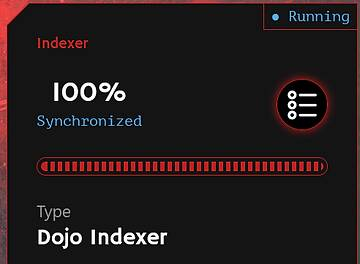

Wenn Sie das Benutzerpasswort ändern möchten, um ein stärkeres Passwort zu verwenden, können Sie dies jetzt im "Einstellungen"-Tab tun. Auf RoninDojo gibt es keine zusätzliche Sicherheitsebene, daher empfehle ich Ihnen, ein wirklich sicheres Passwort zu wählen und seine Sicherung zu pflegen.

## Wie man RoninDojo verwendet?

Nachdem die Blockchain heruntergeladen und komprimiert wurde, können Sie die Dienste Ihres neuen RoninDojo-Knotens nutzen. Lassen Sie uns sehen, wie Sie sie verwenden können.

### Verbindung Ihrer Wallet-Software mit Electrs.

Die erste Funktion Ihres frisch installierten und synchronisierten Knotens besteht darin, Ihre Transaktionen an das Bitcoin-Netzwerk zu senden. Sie möchten daher wahrscheinlich Ihre verschiedenen Wallet-Management-Software damit verbinden.

Dies können Sie mit dem Electrum Rust Server (electrs) tun. Die Anwendung ist normalerweise auf Ihrem RoninDojo-Knoten vorinstalliert. Wenn dies nicht der Fall ist, können Sie sie manuell über die RoninCLI-Schnittstelle installieren.

Gehen Sie einfach zu:

> Anwendungen > Anwendungen verwalten > Electrum Server installieren

Um die Tor-Adresse Ihres Electrum-Servers zu erhalten, gehen Sie in der RoninCLI-Menüleiste zu:

> Anmeldeinformationen > Electrs

Geben Sie einfach den .onion-Link in Ihre Wallet-Software ein. Zum Beispiel in der Sparrow Wallet gehen Sie einfach zum Tab:

> Datei > Einstellungen > Server

Wählen Sie "Private Electrum" als Servertyp aus und geben Sie dann die Tor-Adresse Ihres Electrum-Servers in das entsprechende Feld ein. Klicken Sie abschließend auf "Verbindung testen", um Ihre Verbindung zu testen und zu speichern.

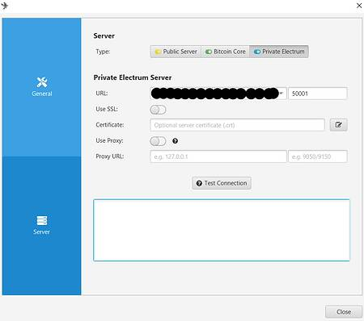

### Verbinden Sie Ihre Wallet-Software mit Samourai Dojo.

Anstatt Electrs zu verwenden, können Sie auch Samourai Dojo verwenden, um Ihre kompatible Wallet-Software mit Ihrem RoninDojo-Knoten zu verbinden. Zum Beispiel bietet Samourai Wallet diese Option an.

Dazu müssen Sie lediglich den Verbindungs-QR-Code Ihres Dojo scannen. Um darauf über RoninUI zuzugreifen, klicken Sie auf die Registerkarte "Dashboard" und dann auf die Schaltfläche "Verwalten" im Bereich Ihres Dojo. Dort können Sie die Verbindungs-QR-Codes für Ihr Dojo und BTC-RPC Explorer sehen. Klicken Sie auf "Werte anzeigen", um sie sichtbar zu machen.

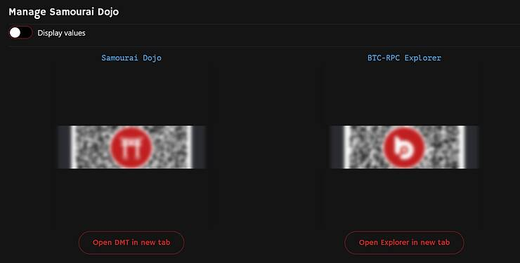

Um Ihre Samourai Wallet mit Ihrem Dojo zu verbinden, müssen Sie diesen QR-Code während der Installation der Anwendung scannen:

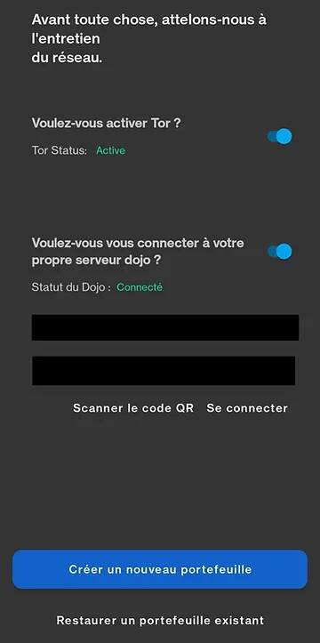

### Verwendung eines eigenen Mempool Explorers.

Als Bitcoiner ist der Explorer ein unverzichtbares Werkzeug, mit dem Sie verschiedene Informationen über die Bitcoin-Blockchain überprüfen können. Mit Mempool können Sie beispielsweise in Echtzeit die von anderen Benutzern berechneten Gebühren überprüfen, um Ihre eigenen optimal anzupassen. Sie können auch den Bestätigungsstatus einer Ihrer Transaktionen überprüfen oder das Guthaben einer Adresse anzeigen.

Die Verwendung dieser Explorer-Tools kann Ihre Privatsphäre gefährden und erfordert, dass Sie einer Drittanbieter-Datenbank vertrauen. Wenn Sie dieses Online-Tool verwenden, ohne Ihren eigenen Knoten zu verwenden:

- Sie riskieren, Informationen über Ihre Wallet preiszugeben.

- Sie vertrauen dem Website-Betreiber für die von ihm gehostete Proof-of-Work-Blockchain.

Um diese Risiken zu vermeiden, können Sie Ihre eigene Mempool-Instanz auf Ihrem Knoten über das Tor-Netzwerk verwenden. Mit dieser Lösung schützen Sie nicht nur Ihre Privatsphäre bei der Nutzung des Dienstes, sondern Sie müssen auch keinem Anbieter mehr vertrauen, da Sie Ihre eigene Datenbank abfragen.

Beginnen Sie damit, Mempool Space Visualizer von RoninCLI zu installieren:

> Anwendungen > Anwendungen verwalten > Mempool Space Visualizer installieren

Nach der Installation erhalten Sie den Link zu Ihrem Mempool. Die Tor-Adresse ermöglicht Ihnen den Zugriff von jedem Netzwerk aus. Auf die gleiche Weise erhalten wir diesen Link über RoninCLI:

> Anmeldeinformationen > Mempool

Geben Sie einfach Ihre Mempool Tor-Adresse in den Tor-Browser ein, um Ihre eigene Mempool-Instanz basierend auf Ihren eigenen Daten zu nutzen. Ich empfehle Ihnen, diese Tor-Adresse zu Ihren Favoriten hinzuzufügen, um schnelleren Zugriff zu haben. Sie können auch eine Verknüpfung auf Ihrem Desktop erstellen.

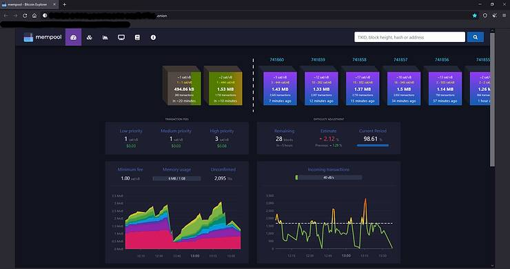

Wenn Sie den Tor-Browser noch nicht haben, können Sie ihn hier herunterladen: https://www.torproject.org/download/

Sie können auch von Ihrem Smartphone aus darauf zugreifen, indem Sie den Tor-Browser installieren und dieselbe Adresse eingeben. Von überall aus können Sie den Zustand der Bitcoin-Kette über Ihren eigenen Knoten überprüfen.

### Verwendung von Whirlpool CLI.

Ihr RoninDojo-Knoten enthält auch WhirlpoolCLI, eine Remote-Befehlszeilenschnittstelle zur Automatisierung von Whirlpool-Mixes.

Wenn Sie eine CoinJoin mit der Whirlpool-Implementierung durchführen, muss die verwendete Anwendung geöffnet bleiben, um Mixes und Remixes ausführen zu können. Dies kann für Benutzer, die hohe Anonymitätssätze wünschen, lästig sein, da das Gerät, auf dem die Whirlpool-Anwendung läuft, ständig eingeschaltet bleiben muss. Konkret bedeutet dies, dass Sie Ihren persönlichen Computer oder Ihr Telefon mit geöffneter Anwendung ständig eingeschaltet lassen müssen, wenn Sie Ihre UTXOs rund um die Uhr in Remixes einbringen möchten.

Eine Lösung für diese Einschränkung besteht darin, WhirlpoolCLI auf einer Maschine zu verwenden, die ständig eingeschaltet ist, wie z.B. ein Bitcoin-Knoten. Dadurch können unsere UTXOs rund um die Uhr und an 7 Tagen in der Woche gemischt werden, ohne dass eine andere Maschine als unser Bitcoin-Knoten eingeschaltet bleiben muss.
WhirlpoolCLI wird zusammen mit WhirlpoolGUI verwendet, einer grafischen Benutzeroberfläche, die auf einem persönlichen Computer installiert wird und es ermöglicht, Coinjoins einfach zu verwalten. In diesem Artikel erkläre ich Ihnen im Detail, wie Sie Whirlpool CLI mit Ihrem eigenen Dojo einrichten können: https://www.pandul.fr/post/comprendre-et-utiliser-le-coinjoin-sur-bitcoin#:~:text=dans%20cette%20partie.-,Tutoriel%20%3A%20Whirpool%20CLI%20sur%20Dojo%20et%20Whirlpool%20GUI.,-Si%20vous%20souhaitez
Wenn Sie mehr über Coinjoin im Allgemeinen erfahren möchten, erkläre ich Ihnen alles in diesem Artikel: https://www.pandul.fr/post/comprendre-et-utiliser-le-coinjoin-sur-bitcoin

### Verwendung von Whirlpool Stat Tool.

Nachdem Sie Coinjoins mit Whirlpool durchgeführt haben, möchten Sie vielleicht konkret wissen, wie hoch das Maß an Vertraulichkeit Ihrer gemischten UTXOs ist. Whirlpool Stat Tool ermöglicht es Ihnen, dies einfach zu tun. Mit diesem Tool können Sie den prospektiven Score und den retrospektiven Score Ihrer gemischten UTXOs berechnen. Um mehr über die Berechnung dieser Anon Sets und ihre Funktionsweise zu erfahren, empfehle ich Ihnen, diesen Abschnitt zu lesen: https://www.pandul.fr/post/comprendre-et-utiliser-le-coinjoin-sur-bitcoin#:~:text=perdre%20en%20confidentialit%C3%A9.-,Anon%20Sets.,-Comme%20expliqu%C3%A9%20pr%C3%A9c%C3%A9demment

Das Tool ist auf Ihrem RoninDojo vorinstalliert. Derzeit ist es nur über RoninCLI verfügbar. Um es aus dem Hauptmenü zu starten, gehen Sie zu:

> Samourai Toolkit > Whirlpool Stat Tool

Die Anweisungen zur Verwendung werden angezeigt. Sobald dies abgeschlossen ist, drücken Sie eine beliebige Taste, um zur Befehlszeile zu gelangen:

Der Terminal wird angezeigt:

> wst#/tmp>

Um diese Benutzeroberfläche zu verlassen und zum RoninCLI-Menü zurückzukehren, geben Sie einfach den Befehl ein:

> quit

Um zu beginnen, setzen wir den Proxy auf Tor, um die OXT-Daten vertraulich abrufen zu können. Geben Sie den Befehl ein:

> socks5 127.0.0.1:9050

Laden Sie dann die Daten des Pools herunter, der Ihre Transaktion enthält:

> download 0001
>
> Ersetzen Sie 0001 durch den Bezeichnungscode des gewünschten Pools.

Die Bezeichnungscodes für WST lauten wie folgt:

- Pool 0,5 Bitcoins: 05

- Pool 0,05 Bitcoins: 005

- Pool 0,01 Bitcoins: 001

- Pool 0,001 Bitcoins: 0001

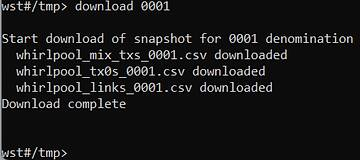

Nachdem die Daten heruntergeladen wurden, laden Sie sie mit dem Befehl:

> load 0001
>
> Ersetzen Sie 0001 durch den Bezeichnungscode des gewünschten Pools.

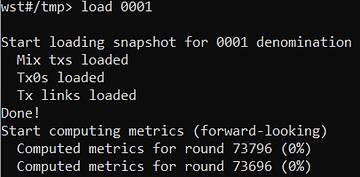
Lassen Sie den Ladevorgang ablaufen, dies kann einige Minuten dauern. Nachdem die Daten geladen wurden, geben Sie den Befehl "score" gefolgt von Ihrer TXID (Transaktions-ID) ein, um ihre Anon Sets zu erhalten:

> score TXID
>
> Ersetzen Sie TXID durch die ID Ihrer Transaktion.

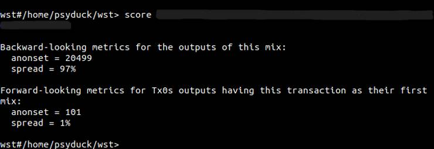

WST zeigt Ihnen dann den rückwärtsgerichteten Score (rückwärtsgerichtete Metriken) und den vorwärtsgerichteten Score (vorwärtsgerichtete Metriken) an. Neben den Scores der Anon Sets gibt Ihnen WST auch die Diffusionsrate Ihrer Ausgabe in Bezug auf das Anon Set der Pool an.

Bitte beachten Sie, dass der vorwärtsgerichtete Score Ihrer UTXO anhand der TXID Ihres ersten Mixes und nicht anhand Ihres letzten Mixes berechnet wird. Im Gegensatz dazu wird der rückwärtsgerichtete Score einer UTXO anhand der TXID des letzten Zyklus berechnet.

Nochmals, wenn Sie diese Konzepte der Anon Sets nicht verstehen, empfehle ich Ihnen, diesen Teil meines Artikels über Coinjoin zu lesen, in dem ich alles im Detail mit Diagrammen erkläre: https://www.pandul.fr/post/comprendre-et-utiliser-le-coinjoin-sur-bitcoin#:~:text=perdre%20en%20confidentialit%C3%A9.-,Anon%20Sets.,-Comme%20expliqu%C3%A9%20pr%C3%A9c%C3%A9demment

### Verwenden des Boltzmann Calculators.

Der Boltzmann Calculator ist ein Tool, mit dem Sie verschiedene fortgeschrittene Metriken für eine Bitcoin-Transaktion berechnen können, insbesondere deren Entropieniveau. Diese Daten ermöglichen es Ihnen, die Vertraulichkeit einer Transaktion zu quantifizieren und mögliche Fehler zu erkennen. Dieses Tool ist auf Ihrem RoninDojo-Knoten vorinstalliert.

Um darauf von RoninCLI aus zuzugreifen, verbinden Sie sich über SSH und gehen Sie dann zum Menü:

> Samourai Toolkit > Boltzmann Calculator

Bevor ich Ihnen erkläre, wie Sie es auf RoninDojo verwenden, werde ich Ihnen erklären, was diese Metriken repräsentieren, wie sie berechnet werden und wofür sie dienen.

Diese Indikatoren können für jede Bitcoin-Transaktion verwendet werden, sind jedoch besonders interessant, um die Qualität einer Coinjoin-Transaktion zu untersuchen.

1. Der erste Indikator, der von dieser Software berechnet wird, ist die Anzahl der möglichen Kombinationen. Es wird auf dem Calculator als "nb combinations" angezeigt. Basierend auf den Werten der UTXO repräsentiert dieser Indikator die Anzahl der möglichen Zuordnungen von Eingängen zu Ausgängen.

> Wenn Sie mit dem Begriff "UTXO" nicht vertraut sind, empfehle ich Ihnen, diesen kurzen Artikel zu lesen: Mechanismus einer Bitcoin-Transaktion: UTXO, Inputs und Outputs.

Mit anderen Worten, dieser Indikator repräsentiert die Anzahl möglicher Interpretationen für eine gegebene Transaktion. Zum Beispiel: Ein Coinjoin mit einer Whirlpool-Struktur von 5x5 hat eine Anzahl möglicher Kombinationen von 1496:

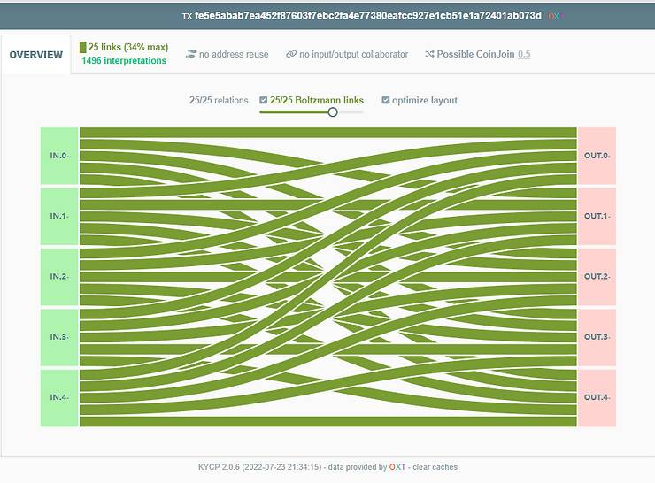

Quelle: https://kycp.org/#/fe5e5abab7ea452f87603f7ebc2fa4e77380eafcc927e1cb51e1a72401ab073d

2. Der zweite berechnete Indikator ist die Entropie einer Transaktion ("Entropy"). Da die Anzahl möglicher Kombinationen für eine Transaktion sehr hoch sein kann, kann man sich entscheiden, stattdessen die Entropie zu verwenden. Die Entropie repräsentiert den binären Logarithmus der Anzahl möglicher Kombinationen. Die Formel lautet wie folgt:

- E: Entropie der Transaktion.

- C: Anzahl möglicher Kombinationen für die Transaktion.

> E = log2(C)

In der Mathematik ist der binäre Logarithmus (mit Basis 2) die Umkehrfunktion der Potenzfunktion von 2. Mit anderen Worten, der binäre Logarithmus von x ist die Potenz, zu der die Zahl 2 erhöht werden muss, um den Wert x zu erhalten.

Daher gilt:

> E = log2(C)
> C = 2^E

Dieser Indikator wird also in Bits ausgedrückt. Zum Beispiel hier die Berechnung der Entropie einer Coinjoin-Transaktion mit einer Whirlpool-Struktur von 5x5, bei der wie zuvor erwähnt 1496 mögliche Kombinationen existieren:

> C = 1496
>
> E = log2(1496)
>
> E = 10,5469 Bits

Diese Coinjoin-Transaktion hat also eine Entropie von 10,5469 Bits, was sehr gut ist.

Je höher dieser Indikator ist, desto mehr verschiedene Interpretationen der Transaktion gibt es und desto vertraulicher ist die Transaktion.

Nehmen wir ein weiteres Beispiel. Hier ist eine "klassische" Transaktion mit einer Eingabe und zwei Ausgaben:

Quelle: https://oxt.me/graph/transaction/tiid/9815286

Diese Transaktion hat nur eine mögliche Interpretation:

> [(inp 0) > (Outp 0 ; Outp 1)]

Ihre Entropie ist daher gleich 0:

> C = 1
>
> E = log2(C)
>
> E = 0

3. Der dritte Indikator, der vom Boltzmann-Rechner zurückgegeben wird, ist die Effizienz der Tx namens "Wallet Efficiency". Dieser Indikator ermöglicht es einfach, die Eingangstransaktion mit der besten möglichen Transaktion in derselben Konfiguration zu vergleichen.

Wir werden also das Konzept der maximalen Entropie einführen, die die höchstmögliche erreichbare Entropie für eine gegebene Transaktionsstruktur darstellt. Zum Beispiel hat die Coinjoin-Struktur vom Typ Whirlpool 5x5 eine maximale Entropie von 10,5469. Der Effizienzindikator vergleicht diese maximale Entropie mit der tatsächlichen Entropie der Eingangstransaktion. Die Formel lautet wie folgt:

- ER: Tatsächliche Entropie in Bits ausgedrückt.
- EM: Maximale Entropie mit derselben Struktur in Bits ausgedrückt.
- Ef: Effizienz in Bits ausgedrückt.

> Ef = ER - EM
>
> Ef = 10,5469 - 10,5469
>
> Ef = 0 Bits

Dieser Indikator wird auch in Prozent ausgedrückt, die Formel lautet dann:

- CR: Anzahl der möglichen Kombinationen in der Realität.
- CM: Anzahl der möglichen Kombinationen maximal mit derselben Struktur.
- Ef: Effizienz in Prozent ausgedrückt.

> Ef = CR/CM
>
> Ef = 1496/1496
>
> Ef = 100%

Eine Effizienz von 100% bedeutet also, dass diese Transaktion die maximale Vertraulichkeit in Bezug auf ihre Struktur aufweist.

Der vierte berechnete Indikator ist die Entropiedichte ("Entropy Density"). Sie ermöglicht es, die Entropie für jeden Eingang oder Ausgang zu berechnen. Auf diese Weise kann dieser Indikator verwendet werden, um die Effizienz zwischen verschiedenen Transaktionen unterschiedlicher Größe zu vergleichen.

Die Berechnung ist sehr einfach, man teilt die Entropie der Transaktion durch die Anzahl der Inputs und Outputs in der Transaktion. Zum Beispiel für eine Coinjoin vom Typ Whirlpool 5x5 haben wir:

    ED: Entropiedichte in Bits ausgedrückt.
    E: Entropie der Transaktion in Bits ausgedrückt.
    T: Gesamtzahl der Inputs und Outputs in der Transaktion.

T = 5 + 5 = 10
ED = E / T
ED = 10,5469 / 10
ED = 1,054 Bits

Die fünfte Information, die vom Boltzmann-Rechner bereitgestellt wird, ist die Tabelle der Wahrscheinlichkeiten für Verbindungen zwischen Eingängen und Ausgängen. Diese Tabelle gibt Ihnen einfach die Wahrscheinlichkeit (Boltzmann-Score) an, dass ein bestimmter Eingang zu einem bestimmten Ausgang gehört.

Wenn wir unser Beispiel mit einem Whirlpool Coinjoin nehmen, sieht die Wahrscheinlichkeitstabelle wie folgt aus:

| Eingang | Ausgang 0 | Ausgang 1 | Ausgang 2 | Ausgang 3 | Ausgang 4 |
| ------- | --------- | --------- | --------- | --------- | --------- | --- | --- | --- | --- | --- | --- | --- |
| 0       | 34%       | 34%       | 34%       | 34%       | 34%       |
| 1       | 34%       | 34%       | 34%       | 34%       | 34%       |
| 2       | 34%       | 34%       | 34%       | 34%       | 34%       |
| 3       | 34%       | 34%       | 34%       | 34%       | 34%       |     | 4   | 34% | 34% | 34% | 34% | 34% |

Hier sehen wir, dass jeder Input die gleiche Wahrscheinlichkeit hat, mit jedem Output verbunden zu sein.

Wenn wir jedoch das Beispiel einer Transaktion mit einem Input und zwei Outputs nehmen, sieht das so aus:

| Input | Output 0 | Output 1 |
| ----- | -------- | -------- |
| 0     | 100%     | 100%     |

In diesem Beispiel sehen wir, dass die Wahrscheinlichkeit, dass jeder Output von Input 0 stammt, 100% beträgt.

Je niedriger diese Wahrscheinlichkeit ist, desto höher ist die Vertraulichkeit.

6. Die sechste berechnete Information ist die Anzahl der deterministischen Links. Es wird auch das Verhältnis der deterministischen Links bereitgestellt. Dieser Indikator zeigt die Anzahl der Links zwischen Inputs und Outputs der gegebenen Transaktion, die eine Wahrscheinlichkeit von 100% haben, d.h. unbestreitbar sind.

Das Verhältnis gibt dann an, wie viele deterministische Links es in der Transaktion im Verhältnis zur Gesamtzahl der Links gibt.

Zum Beispiel hat eine Coinjoin Whirlpool-Transaktion keine deterministischen Links zwischen den Eingängen und Ausgängen. Der Indikator ist also gleich null und das Verhältnis beträgt ebenfalls 0%.

Für die zweite untersuchte Transaktion (1 Input und 2 Outputs) beträgt der Indikator 2 und das Verhältnis beträgt 100%.

Wenn dieser Indikator gleich null ist, deutet dies auf eine gute Vertraulichkeit hin.

Nun, da wir die Indikatoren untersucht haben, schauen wir uns an, wie man sie mit dieser Software berechnet. Gehen Sie von RoninCLI aus zum Menü:

> Samourai Toolkit > Boltzmann Calculator

Sobald das Programm gestartet ist, geben Sie die Transaktions-ID ein, die Sie untersuchen möchten. Sie können mehrere Transaktionen eingeben, indem Sie sie mit einem Komma trennen und dann die Eingabetaste drücken:

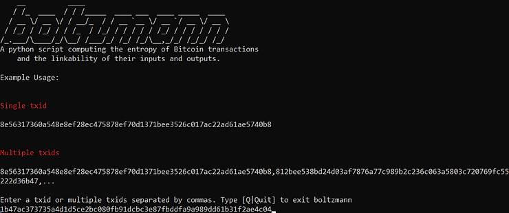

Der Rechner gibt Ihnen dann alle Indikatoren zurück, die wir zuvor gesehen haben:

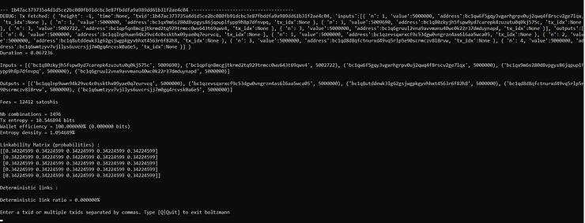

Geben Sie den Befehl "Quit" ein, um das Programm zu beenden und zum RoninCLI-Menü zurückzukehren.

Um mehr über den Boltzmann Calculator zu erfahren, empfehle ich Ihnen, diese Artikel zu lesen:

- https://medium.com/@laurentmt/introducing-boltzmann-85930984a159

- https://gist.github.com/LaurentMT/e758767ca4038ac40aaf

### Verbindung zu Bisq herstellen.

Bisq ist eine Handelsplattform, die es Ihnen ermöglicht, Bitcoins peer-to-peer zu kaufen und zu verkaufen. Es wird mit einer Desktop-Software verwendet, die unter Tor läuft und den Austausch von Bitcoins ermöglicht, ohne dass Sie Ihre Identität angeben müssen.
Bisq sichert Peer-to-Peer-Transaktionen mit einem 2/2 Multi-Signatur-System. Sie können diese Software mit Ihrem eigenen RoninDojo-Knoten verwenden, um die Privatsphäre Ihrer Transaktionen zu optimieren und den Daten Ihres eigenen Knotens in der Blockchain zu vertrauen.
Um die Bisq-Software herunterzuladen, besuchen Sie ihre offizielle Website: https://bisq.network/

Um die Software zu nutzen, empfehle ich Ihnen, diese Seite zu lesen: https://bisq.network/getting-started/

Um den Verbindungslin zu Ihrem RoninDojo abzurufen, müssen Sie sich über SSH mit RoninCLI verbinden. Gehen Sie dann zum Menü:

> Anwendungen > Anwendungen verwalten

Geben Sie Ihr Passwort ein und aktivieren Sie das Kontrollkästchen mit der Leertaste:

> [ ] Bisq-Verbindung aktivieren

Bestätigen Sie Ihre Auswahl. Lassen Sie Ihren Knoten installieren und holen Sie sich dann die Tor V3-Adresse von:

> Anmeldeinformationen > Bitcoind

Kopieren Sie die Adresse unter "Bitcoin Daemon".

Sie können auch Ihre Bitcoind Tor V3-Adresse über die RoninUI-Schnittstelle abrufen, indem Sie einfach auf "Verwalten" in der Box "Bitcoin Core" auf dem "Dashboard" klicken:

Um Ihren Knoten mit Bisq zu verbinden, gehen Sie zum Menü:

> Einstellungen > Netzwerkinformationen

Klicken Sie auf die Sprechblase "Benutzerdefinierte Bitcoin Core-Knoten verwenden". Geben Sie dann Ihre Bitcoin TorV3-Adresse in das dafür vorgesehene Feld ein, mit ".onion", aber ohne "http://".

Starten Sie die Bisq-Software neu. Ihr Knoten ist nun mit Ihrem Bisq verbunden.

### Weitere Funktionen.

Ihr RoninDojo-Knoten enthält auch weitere grundlegende Funktionen. Sie haben unter anderem die Möglichkeit, spezifische Informationen zu scannen, um sicherzustellen, dass sie berücksichtigt werden.

Zum Beispiel kann es manchmal vorkommen, dass Ihre mit Ihrem RoninDojo verbundene Brieftasche Ihre eigenen Bitcoins nicht findet. Der Kontostand beträgt 0, obwohl Sie sicher sind, dass Sie Bitcoin in dieser Brieftasche besitzen. Es gibt viele mögliche Ursachen, die berücksichtigt werden müssen, einschließlich eines Fehlers bei den Ableitungspfaden, und es ist auch möglich, dass Ihr Knoten Ihre Adressen nicht beobachtet.

Um dies zu beheben, können Sie überprüfen, ob Ihr Knoten Ihre xpub mit dem "xpub tool" verfolgt. Um darauf von RoninUI aus zuzugreifen, gehen Sie zum Menü:

> Wartung > XPUB-Tool

Geben Sie die xpub ein, die Probleme verursacht, und klicken Sie auf "Überprüfen", um diese Information zu überprüfen.

Wenn Ihr Knoten die xpub verfolgt, sehen Sie Folgendes:

Übersetzung:
Stellen Sie sicher, dass alle Transaktionen korrekt angezeigt werden. Überprüfen Sie auch, ob der Ableitungstyp mit dem Ihres Wallets übereinstimmt. Hier sehen wir, dass der Knoten diese xpub als BIP44-Ableitung interpretiert. Wenn dieser Ableitungstyp nicht mit dem Ihres Wallets übereinstimmt, klicken Sie auf die Schaltfläche "Retype" und wählen Sie dann BIP44/BIP49/BIP84 entsprechend Ihrer Wahl aus:

Wenn Ihre xpub nicht von Ihrem Knoten verfolgt wird, wird der folgende Bildschirm angezeigt, der Sie zum Import auffordert:

Sie können auch die anderen Wartungstools verwenden:

- Transaktionstool: Ermöglicht Ihnen, die Details einer bestimmten Transaktion zu überprüfen.

- Adresstool: Ermöglicht Ihnen, zu überprüfen, ob eine bestimmte Adresse von Ihrem Dojo verfolgt wird.

- Blocks erneut scannen: Zwingt Ihren Knoten, einen ausgewählten Blockbereich erneut zu scannen.

Auf RoninUI finden Sie auch das "Push Tx" -Tool. Damit können Sie eine signierte Transaktion an das Bitcoin-Netzwerk senden. Diese muss im hexadezimalen Format eingegeben werden:

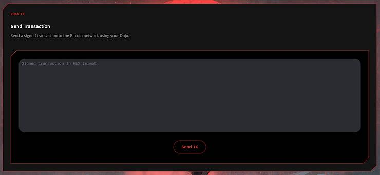

## Fazit.

Wir haben gesehen, wie man diese großartige RoninDojo-Software installiert und verwendet. Es ist eine ausgezeichnete Wahl, um Ihren eigenen Bitcoin-Knoten zu betreiben. Es ist eine stabile Lösung, die alle wesentlichen Tools für einen Bitcoiner integriert und auf dem neuesten Stand hält.

Wenn Sie keine Angst vor der Verwendung der Befehlszeile haben und keine Tools für das Lightning Network benötigen, könnte Ihnen RoninDojo gefallen.

Wenn möglich, denken Sie daran, den Entwicklern, die diese Open-Source-Software kostenlos zur Verfügung stellen, eine Spende zu machen: https://donate.ronindojo.io/

Um mehr über RoninDojo zu erfahren, empfehle ich Ihnen, die unten stehenden externen Ressourcen zu besuchen.

### Weitere Informationen:

- Verständnis und Verwendung von CoinJoin in Bitcoin.

- Hash-Funktionen - Auszug aus dem eBook "Demokratisiertes Bitcoin 1".

- Alles über das Bitcoin-Passwort.

### Externe Ressourcen:

- https://samouraiwallet.com/dojo
- https://ronindojo.io/index.html
- https://wiki.ronindojo.io/en/home
- https://code.samourai.io/ronindojo/RoninDojo
- https://gist.github.com/LaurentMT/e758767ca4038ac40aaf
- https://medium.com/@laurentmt/introducing-boltzmann-85930984a159
- https://oxt.me/
- https://kycp.org/#/
- https://fr.wikipedia.org/wiki/Formule_de_Boltzmann
- https://wiki.ronindojo.io/en/setup/bisq
- https://bisq.network/
