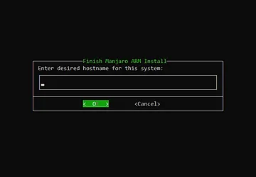
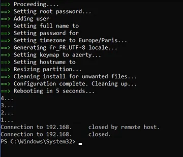
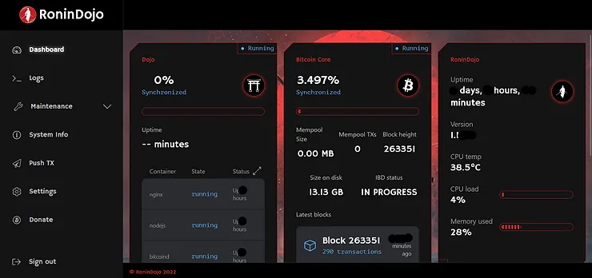
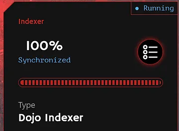
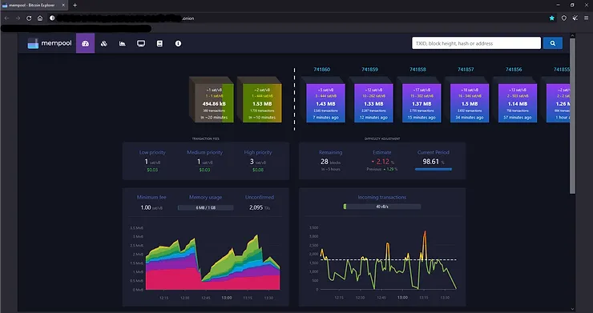
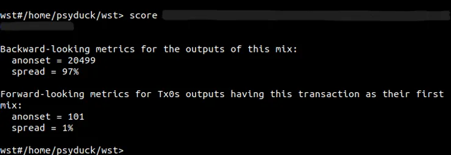

**ADVERTENCIA: Aunque este tutorial sigue siendo operativo para la instalación de RoninDojo v1, no te permitirá actualizar tu nodo a RoninDojo v2. Por lo tanto, aunque esta versión sigue siendo funcional, ya no se actualiza. Para beneficiarte de las últimas mejoras y características, te recomiendo encarecidamente que consultes nuestro tutorial dedicado a la instalación directa de RoninDojo v2 en tu Raspberry Pi:** [https://planb.network/tutorials/privacy/ronin-dojo-v2](https://planb.network/tutorials/privacy/ronin-dojo-v2)

---

Ejecutar y utilizar su propio nodo es esencial para participar realmente en la red de Bitcoin. Aunque ejecutar un nodo Bitcoin no proporciona ninguna ventaja económica al usuario, le permite preservar su privacidad, actuar de manera independiente y tener control sobre su confianza en la red.

En este artículo, examinaremos en detalle RoninDojo, una excelente solución para ejecutar su propio nodo Bitcoin.

### Contenido:

- ¿Qué es RoninDojo?
- ¿Qué hardware elegir?
- ¿Cómo instalar RoninDojo?
- ¿Cómo utilizar RoninDojo?
- Conclusión

Si no está familiarizado con el funcionamiento y el papel de un nodo Bitcoin, le recomiendo que comience leyendo este artículo: El nodo Bitcoin - Parte 1/2: Conceptos técnicos.

## ¿Qué es RoninDojo?

Dojo es un servidor de nodo completo de Bitcoin desarrollado por el equipo de Samouraï Wallet. Puede instalarlo libremente en cualquier máquina.

RoninDojo es una herramienta de instalación y administración para Dojo y varias otras herramientas. RoninDojo toma la implementación original de Dojo y agrega muchas otras herramientas, facilitando su instalación y gestión.

También ofrecen un hardware "plug-and-play", el RoninDojo Tanto, con RoninDojo preinstalado en una máquina ensamblada por su equipo. El Tanto es una solución de pago, interesante para aquellos que no quieren ensuciarse las manos.

El código de RoninDojo es de código abierto, por lo que también es posible instalar esta solución en su propio hardware. Esta opción es económica, pero requiere un poco más de manipulación, que es lo que haremos en este artículo.

RoninDojo es un Dojo, por lo que permite integrar fácilmente Whirlpool CLI en su nodo Bitcoin para tener la mejor experiencia posible de CoinJoin. Con Whirlpool CLI, no solo podrá mezclar sus bitcoins las 24 horas del día, los 7 días de la semana sin tener que dejar encendida su computadora personal, sino que también podrá mejorar significativamente su privacidad.

RoninDojo integra muchas otras herramientas que se basarán en su Dojo, como el calculador Boltzmann que permite determinar el grado de privacidad de una transacción, el servidor Electrum para conectar sus diferentes billeteras Bitcoin a su nodo, o el servidor Mempool para observar sus transacciones de forma privada.
En comparación con otra solución de nodo como Umbrel, que presenté en este artículo, RoninDojo se enmarca en una línea de desarrollo profundamente orientada hacia soluciones "On Chain" y herramientas que optimizan la privacidad de los usuarios. Por lo tanto, RoninDojo no permite interactuar con la Lightning Network.
RoninDojo ofrece menos herramientas en comparación con Umbrel, pero las pocas características esenciales para un Bitcoiner presentes en Ronin son increíblemente estables.

Entonces, si no necesitas todas las características de un servidor Umbrel y solo deseas tener un nodo simple y estable con algunas herramientas esenciales como Whirlpool o Mempool, entonces RoninDojo es probablemente una buena solución para ti.

En mi opinión, la línea de desarrollo de Umbrel está muy orientada hacia la Lightning Network y herramientas versátiles. Aunque sigue siendo un nodo de Bitcoin, se busca convertirlo en un mini-servidor multitarea. Por otro lado, la línea de desarrollo de RoninDojo se acerca más a la de los equipos de Samourai Wallet y se centra en las herramientas esenciales de un Bitcoiner que le permiten tener plena independencia y una gestión optimizada de su privacidad en Bitcoin.

Ten en cuenta que configurar un nodo RoninDojo es ligeramente más complejo que un nodo Umbrel.

Ahora que hemos podido describir a RoninDojo, veamos juntos cómo configurar este nodo.

## ¿Qué hardware elegir?

Para elegir la máquina que alojará y ejecutará RoninDojo, tienes varias opciones.

Como se explicó anteriormente, la opción más sencilla será pedir el Tanto, una máquina plug-and-play diseñada específicamente para este propósito. Para pedir el tuyo, ve aquí: https://shop.ronindojo.io/product-category/nodes/.

Dado que los equipos de RoninDojo producen código de código abierto, también es posible implementar RoninDojo en otras máquinas. Puedes encontrar las últimas versiones del asistente de instalación en esta página: https://ronindojo.io/en/downloads.html, y las últimas versiones del código en esta página: https://code.samourai.io/ronindojo/RoninDojo.

Personalmente, lo he instalado en una Raspberry Pi 4 de 8GB y funciona perfectamente.

Sin embargo, ten en cuenta que los equipos de RoninDojo nos indican que a menudo hay problemas debido a la carcasa y al adaptador del SSD. Por lo tanto, no se recomienda utilizar una carcasa con un cable para el SSD de tu máquina. Es mejor utilizar una tarjeta de expansión de almacenamiento especialmente diseñada para tu placa base, como esta: Carte d'extension de stockage Raspberry Pi 4.

Aquí tienes un ejemplo de configuración para hacer tu propio nodo RoninDojo:

- Una Raspberry Pi 4.
- Una carcasa con un ventilador.
- Una tarjeta de expansión de almacenamiento compatible.
- Un cable de alimentación.
- Una tarjeta micro SD industrial de 16GB o más.
- Un SSD de 1TB o más.
- Un cable ethernet RJ45, se recomienda categoría 8.

## ¿Cómo instalar RoninDojo?

### Paso 1: Preparar la micro SD con capacidad de arranque.

Una vez que hayas montado tu máquina, podrás comenzar la instalación de RoninDojo. Para ello, comienza creando una micro SD con capacidad de arranque grabando la imagen de disco adecuada.

Inserta tu tarjeta micro SD en tu computadora personal y visita el sitio web oficial de RoninDojo para descargar la imagen de disco RoninOS: https://ronindojo.io/en/downloads.html.

Descarga la imagen de disco que corresponda a tu hardware. En mi caso, descargué la imagen "MANJARO-ARM-RONINOS-RPI4-22.03.IMG.XZ":

Una vez descargada la imagen, verifica su integridad utilizando el archivo .SHA256 correspondiente. Te explico detalladamente cómo hacer esto en este artículo: ¿Cómo verificar la integridad de un software de Bitcoin en Windows?

Las instrucciones específicas para verificar la integridad de RoninOS también están disponibles en esta página en inglés: https://wiki.ronindojo.io/en/extras/verify.

Para grabar esta imagen en tu micro SD, puedes utilizar un software como Balena Etcher que puedes descargar aquí: https://www.balena.io/etcher/.

Para hacerlo, selecciona la imagen en Etcher y grábala en la micro SD:

Una vez que la operación haya finalizado, puedes insertar la micro SD con capacidad de arranque en el Raspberry Pi y encender la máquina.

### Paso 2: Configurar RoninOS.

RoninOS es el sistema operativo de tu nodo RoninDojo, es una versión modificada de Manjaro, una distribución de Linux. Después de iniciar tu máquina y esperar unos minutos, podrás comenzar su configuración.

Para conectarte a ella de forma remota, deberás encontrar la dirección IP de tu máquina RoninDojo. Para ello, puedes, por ejemplo, acceder al panel de administración de tu router, o también puedes descargar un software como https://angryip.org/ para escanear tu red local y encontrar la IP de la máquina.

Una vez que hayas encontrado la IP, podrás acceder a tu máquina desde otra computadora conectada a la misma red local utilizando SSH.

Desde una computadora con MacOS o Linux, simplemente abre la terminal. Desde una computadora con Windows, puedes utilizar una herramienta especializada como Putty o directamente Windows PowerShell.

Una vez que hayas abierto la terminal, escribe el siguiente comando:

> ssh root@192.168.?.?

Simplemente reemplaza los dos signos de interrogación por la IP de tu RoninDojo encontrada anteriormente.
Consejo: En una terminal, haz clic derecho para pegar un elemento.

Luego, llegarás al panel de configuración de Manjaro. Elije la disposición correcta de tu teclado usando las flechas para cambiar el objetivo en la lista desplegable.

Elige un nombre de usuario y una contraseña para tu sesión. Utiliza una contraseña fuerte y haz una copia de seguridad segura. Puedes usar una contraseña débil durante la instalación y luego cambiarla fácilmente con la opción de "copiar y pegar" en RoninUI. Esto te permitirá tener una contraseña muy segura sin tener que pasar mucho tiempo escribiéndola manualmente durante la configuración de Manjaro.

Luego, también se te pedirá que elijas una contraseña de root. Para la contraseña de root, ingresa directamente una contraseña fuerte. No podrás cambiarla desde RoninUI. Asegúrate también de hacer una copia de seguridad de esta contraseña de root.

Luego ingresa tu localidad y zona horaria.

Luego elige un nombre de host.

Finalmente, verifica la información de configuración de Manjaro y confirma.

### Paso 3: Descargar RoninDojo.

La configuración inicial de RoninOS se realizará. Una vez que haya terminado, como se muestra en la captura de pantalla anterior, la máquina se reiniciará. Espera unos momentos y luego ingresa el siguiente comando para volver a conectarte a tu máquina RoninDojo:

> ssh pseudo@192.168.?.?

Simplemente reemplaza "pseudo" con el nombre de usuario que elegiste anteriormente y los signos de interrogación con la IP de tu RoninDojo.

Luego ingresa tu contraseña de usuario.

En la terminal, se verá así:

Ahora estás conectado a tu máquina que actualmente solo tiene RoninOS. Ahora debes instalar RoninDojo en ella.

Descarga la última versión de RoninDojo ingresando el siguiente comando:

> git clone https://code.samourai.io/ronindojo/RoninDojo

La descarga se realizará rápidamente. Verás esto en la terminal:

Espera a que termine la descarga y luego instala y accede a la interfaz de usuario de RoninDojo usando el siguiente comando:

> ~/RoninDojo/ronin

Se te pedirá que ingreses tu contraseña de usuario:

Esta orden solo es necesaria la primera vez que accedes a tu RoninDojo. Después, para acceder a RoninCLI a través de SSH, simplemente debes ingresar el comando [SSH pseudo@192.168.?.?] reemplazando "pseudo" por tu nombre de usuario y colocando la IP de tu nodo. Se te pedirá tu contraseña de usuario.

Luego verás esta magnífica animación:

Finalmente llegarás a la interfaz de usuario CLI de RoninDojo.

### Paso 4: Instalar RoninDojo.

Desde el menú principal, accede al menú "System" utilizando las flechas de tu teclado. Utiliza la tecla Enter para confirmar tu elección.

Luego ve al menú "System Setup & Install".

Finalmente, marca "System Setup" y "Install RoninDojo" utilizando la barra espaciadora, luego selecciona "Aceptar" para iniciar la instalación.

Deja que la instalación se realice tranquilamente. En mi caso, esto tomó aproximadamente 2 horas. Mantén tu terminal abierto durante la operación.

De vez en cuando, revisa tu terminal, se te pedirá que presiones una tecla en ciertos momentos de la instalación, como aquí por ejemplo:

Al finalizar la instalación, verás que los diferentes contenedores se inician:

Luego, tu nodo se reiniciará. Conéctate nuevamente a RoninCLI para el siguiente paso.

### Paso 5: Descargar la cadena de prueba de trabajo y acceder a RoninUI.

Una vez finalizada la instalación, tu nodo comenzará a descargar la cadena de prueba de trabajo de Bitcoin. Esto se conoce como IBD (Initial Block Download). Esto generalmente lleva entre 2 y 14 días, dependiendo de tu conexión a internet y tu dispositivo.

Puedes seguir el progreso de la descarga de la cadena accediendo a la interfaz web de RoninUI.

Para acceder desde una red local, ingresa en la barra de direcciones de tu navegador:

- Directamente la dirección IP de tu máquina (192.168.?.?)

- O bien: ronindojo.local

Asegúrate de desactivar tu VPN si estás utilizando uno.

### Posible complicación

Si no puedes acceder a RoninUI desde tu navegador, verifica el correcto funcionamiento de la aplicación desde tu Terminal conectado a tu nodo a través de SSH. Conéctate al menú principal siguiendo los pasos anteriores:

- Escribe: SSH pseudo@192.168.?.? reemplazando con tus credenciales.

- Ingresa tu contraseña de usuario.

Una vez en el menú principal, ve a:

> RoninUI > Reiniciar

Si la aplicación se reinicia correctamente, el problema está en la conexión desde tu navegador. Verifica que no estés utilizando una VPN y asegúrate de estar conectado a la misma red que tu nodo.

Si al reiniciar aparece un error, intenta actualizar el sistema operativo y luego reinstala RoninUI. Para actualizar el SO:

> Sistema > Actualizaciones de software > Actualizar sistema operativo

Una vez que la actualización y el reinicio hayan finalizado, vuelve a conectarte a tu nodo a través de SSH y luego reinstala RoninUI:

> RoninUI > Reinstalar

Después de descargar nuevamente RoninUI, intenta acceder a través de tu navegador.

> Consejo: Si sales accidentalmente de RoninCLI y te encuentras en la terminal de Manjaro, simplemente ingresa el comando "ronin" para volver directamente al menú principal de RoninCLI.

### Inicio de sesión web

También puedes acceder a la interfaz web de RoninUI desde cualquier red utilizando Tor. Para hacerlo, obtén la dirección Tor de tu RoninUI desde RoninCLI:

> Credenciales > Ronin UI

Obtén la dirección Tor que termina en .onion y luego accede a Ronin UI ingresando esta dirección en tu navegador Tor. Ten cuidado de no filtrar tus credenciales, ya que son información sensible.

Una vez que hayas iniciado sesión, se te pedirá tu contraseña de usuario. Es la misma que utilizas para iniciar sesión a través de SSH.

Podemos ver el progreso de la IBD. Ten paciencia, estás descargando todas las transacciones realizadas en Bitcoin desde el 3 de enero de 2009.

Después de descargar toda la cadena de bloques, el indexador compactará la base de datos. Esta operación lleva aproximadamente 12 horas. También puedes seguir su progreso en "Indexer" en RoninUI.

Tu nodo RoninDojo estará completamente funcional después de esto:

Si deseas cambiar la contraseña de usuario por una más segura, puedes hacerlo ahora desde la pestaña "Configuración". En RoninDojo, no hay una capa de seguridad adicional, así que te recomiendo que elijas una contraseña realmente fuerte y que cuides su respaldo.

## ¿Cómo utilizar RoninDojo?

Una vez que la cadena se haya descargado y compactado, podrás comenzar a disfrutar de los servicios que te ofrece tu nuevo nodo RoninDojo. Veamos cómo utilizarlos.

### Conectar tus billeteras de software a electrs.

La primera utilidad de su nodo recién instalado y sincronizado será difundir sus transacciones a la red de Bitcoin. Por lo tanto, seguramente querrá conectar sus diferentes software de gestión de carteras.
Puede hacer esto a través de Electrum Rust Server (electrs). La aplicación normalmente viene preinstalada en su nodo RoninDojo. Si no es así, puede instalarla manualmente desde la interfaz RoninCLI.

Simplemente vaya a:

> Aplicaciones > Administrar aplicaciones > Instalar Electrum Server

Para obtener la dirección Tor de su Servidor Electrum, desde el menú RoninCLI, vaya a:

> Credenciales > Electrs

Solo tendrá que ingresar el enlace en .onion en el software de su cartera. Por ejemplo, en Sparrow Wallet, simplemente vaya a la pestaña:

> Archivo > Preferencias > Servidor

En el tipo de servidor, seleccione "Private Electrum", luego ingrese la dirección Tor de su Servidor Electrum en el campo correspondiente. Finalmente, haga clic en "Probar conexión" para probar y guardar su conexión.

### Conectar sus software de carteras a Samourai Dojo.

En lugar de usar Electrs, también puede usar Samourai Dojo para conectar su cartera de software compatible a su nodo RoninDojo. Por ejemplo, Samourai Wallet ofrece esta opción.

Para hacer esto, simplemente escanee el código QR de conexión de su Dojo. Para acceder a él desde RoninUI, haga clic en la pestaña "Panel de control" y luego en el botón "Administrar" en el cuadro de su Dojo. Luego podrá ver los códigos QR de conexión a su Dojo y a BTC-RPC Explorer. Para mostrarlos en texto claro, haga clic en "Mostrar valores".

Para conectar su cartera Samourai Wallet a su Dojo, deberá escanear este código QR durante la instalación de la aplicación:

### Utilizar su propio explorador de Mempool.

Herramienta esencial para los usuarios de Bitcoin, el explorador le permite verificar diferentes información sobre la cadena de bloques de Bitcoin. Con Mempool, por ejemplo, puede verificar en tiempo real las tarifas aplicadas por otros usuarios para ajustar las suyas. También puede verificar el estado de confirmación de una de sus transacciones o ver el saldo de una dirección.

Estas herramientas de explorador pueden exponerlo a riesgos de pérdida de privacidad y lo obligan a confiar en la base de datos de un tercero. Cuando utiliza esta herramienta en línea sin pasar por su propio nodo:

- Corre el riesgo de filtrar información sobre su cartera.

- Confía en el administrador del sitio web para la cadena de prueba de trabajo que aloja.

Para evitar estos riesgos, puedes utilizar tu propia instancia de Mempool en tu nodo a través de la red Tor. Con esta solución, no solo preservas tu privacidad al utilizar el servicio, sino que también ya no necesitas confiar en un proveedor, ya que consultas tu propia base de datos.
Para ello, comienza por instalar Mempool Space Visualizer desde RoninCLI:

> Aplicaciones > Administrar aplicaciones > Instalar Mempool Space Visualizer

Una vez instalado, obtén el enlace a tu Mempool. La dirección Tor te permitirá acceder a ella desde cualquier red. De la misma manera, obtenemos este enlace a través de RoninCLI:

> Credenciales > Mempool

Simplemente ingresa tu dirección Mempool Tor en el navegador Tor para disfrutar de tu propia instancia de Mempool, basada en tus propios datos. Te recomiendo agregar esta dirección Tor a tus favoritos para poder acceder a ella más rápidamente. También puedes crear un acceso directo en tu escritorio.

Si aún no tienes el navegador Tor, puedes descargarlo aquí: https://www.torproject.org/download/

También puedes acceder a él desde tu teléfono inteligente instalando Tor Browser y luego ingresando la misma dirección. Desde cualquier lugar, podrás ver el estado de la cadena de Bitcoin utilizando tu propio nodo.

### Utilizando Whirlpool CLI.

Tu nodo RoninDojo también incluye WhirlpoolCLI, una interfaz de línea de comandos remota que permite automatizar las mezclas de Whirlpool.

Cuando realizas un CoinJoin con la implementación de Whirlpool, la aplicación que estás utilizando debe permanecer abierta para poder ejecutar mezclas y remezclas. Este proceso puede resultar tedioso para el usuario que busca tener conjuntos anónimos elevados, ya que el dispositivo que aloja la aplicación con Whirlpool debe permanecer encendido constantemente. En pocas palabras, esto significa que si deseas comprometer tus UTXO en remezclas las 24 horas del día, los 7 días de la semana, deberás dejar tu computadora personal o tu teléfono encendidos constantemente con la aplicación abierta.

Una solución a esta limitación es utilizar WhirlpoolCLI en una máquina destinada a estar encendida constantemente, como por ejemplo un nodo Bitcoin. Gracias a esto, nuestros UTXO podrán remezclarse las 24 horas del día y los 7 días de la semana sin necesidad de dejar otra máquina que no sea nuestro nodo Bitcoin en funcionamiento.
WhirlpoolCLI se utiliza junto con WhirlpoolGUI, una interfaz gráfica que se instala en una computadora personal para facilitar la gestión de Coinjoins. En este artículo, explicaré en detalle cómo configurar Whirlpool CLI con su propio dojo: https://www.pandul.fr/post/comprendre-et-utiliser-le-coinjoin-sur-bitcoin#:~:text=dans%20cette%20partie.-,Tutoriel%20%3A%20Whirpool%20CLI%20sur%20Dojo%20et%20Whirlpool%20GUI.,-Si%20vous%20souhaitez
Para obtener más información sobre Coinjoin en general, lo explico todo en este artículo: https://www.pandul.fr/post/comprendre-et-utiliser-le-coinjoin-sur-bitcoin

### Usar Whirlpool Stat Tool.

Después de realizar CoinJoins con Whirlpool, es posible que desee saber concretamente cuál es el nivel de privacidad de sus UTXO mezclados. Whirlpool Stat Tool le permite hacer esto fácilmente. Con esta herramienta, podrá calcular la puntuación prospectiva y la puntuación retrospectiva de sus UTXO mezclados. Para obtener más información sobre el cálculo de estos conjuntos anónimos y cómo funcionan, le recomiendo que lea esta parte: https://www.pandul.fr/post/comprendre-et-utiliser-le-coinjoin-sur-bitcoin#:~:text=perdre%20en%20confidentialit%C3%A9.-,Anon%20Sets.,-Comme%20expliqu%C3%A9%20pr%C3%A9c%C3%A9demment

La herramienta está preinstalada en su RoninDojo. Por el momento, solo está disponible desde RoninCLI. Para iniciarlo desde el menú principal, vaya a:

> Samourai Toolkit > Whirlpool Stat Tool

Las instrucciones de uso se mostrarán. Una vez que haya terminado, presione cualquier tecla para acceder a las líneas de comando:

Verá que se muestra el terminal:

> wst#/tmp>

Para salir de esta interfaz y volver al menú RoninCLI, simplemente escriba el comando:

> quit

Para comenzar, vamos a configurar el proxy en Tor para poder extraer los datos de OXT de manera confidencial. Escriba el comando:

> socks5 127.0.0.1:9050

Luego, descargue los datos del pool que contiene su transacción:

> download 0001
>
> Reemplace 0001 con el código de denominación del pool que le interese.

Los códigos de denominación son los siguientes en WST:

- Pool 0.5 bitcoins: 05

- Pool 0.05 bitcoins: 005

- Pool 0.01 bitcoins: 001

- Pool 0.001 bitcoins: 0001

Una vez que se hayan descargado los datos, cárguelos con el comando:

> load 0001
>
> Reemplace 0001 con el código de denominación del pool que le interese.

Deje que se complete la carga, esto puede llevar unos minutos. Después de cargar los datos, escriba el comando "score" seguido de su TXID (identificador de transacción) para obtener sus conjuntos Anon:

> score TXID
>
> Reemplace TXID con el identificador de su transacción.

WST mostrará primero la puntuación retrospectiva (métricas retrospectivas) y luego la puntuación prospectiva (métricas prospectivas). Además de las puntuaciones de los conjuntos Anon, WST también le proporcionará la tasa de difusión de su salida en el pool en función del conjunto Anon.

Tenga en cuenta que la puntuación prospectiva de su UTXO se calcula a partir de la TXID de su mezcla inicial, no de su última mezcla. Por otro lado, la puntuación retrospectiva de un UTXO se calcula a partir de la TXID del último ciclo.

Una vez más, si no entiende estos conceptos de conjuntos Anon, le recomiendo que lea esta parte de mi artículo sobre Coinjoin en el que lo explico todo en detalle con diagramas: https://www.pandul.fr/post/comprendre-et-utiliser-le-coinjoin-sur-bitcoin#:~:text=perdre%20en%20confidentialit%C3%A9.-,Anon%20Sets.,-Comme%20expliqu%C3%A9%20pr%C3%A9c%C3%A9demment

### Utilizando la calculadora Boltzmann.

La calculadora Boltzmann es una herramienta que le permite calcular fácilmente diversas métricas avanzadas sobre una transacción de Bitcoin, incluido su nivel de entropía. Todos estos datos le permitirán poner números al nivel de confidencialidad de una transacción y detectar posibles errores. Esta herramienta está preinstalada en su nodo RoninDojo.

Para acceder a ella desde RoninCLI, conéctese a través de SSH y vaya al menú:

> Samourai Toolkit > Boltzmann Calculator

Antes de explicar cómo usarlo en RoninDojo, explicaré qué representan estas métricas, cómo se calculan y para qué sirven.

Estos indicadores se pueden utilizar para cualquier transacción de Bitcoin, pero son particularmente interesantes para estudiar la calidad de una transacción Coinjoin.

1. El primer indicador calculado por este software es el número de combinaciones posibles. Se muestra en la calculadora como "nb combinations". Dado los valores de UTXO, este indicador representa el número de asignaciones posibles de las entradas a las salidas.

> Si no está familiarizado con el término "UTXO", le recomiendo que lea este breve artículo: Mecanismo de una transacción de Bitcoin: UTXO, inputs y outputs.

En otras palabras, este indicador representa el número de interpretaciones posibles para una transacción dada. Por ejemplo: una Coinjoin con una estructura Whirlpool 5x5 tendrá un número de combinaciones posibles igual a 1496:

Crédito: https://kycp.org/#/fe5e5abab7ea452f87603f7ebc2fa4e77380eafcc927e1cb51e1a72401ab073d

2. El segundo indicador calculado es la entropía de una transacción ("Entropy"). Dado que el número de combinaciones posibles puede ser muy alto para una transacción, se puede optar por utilizar la entropía en su lugar. La entropía representa el logaritmo binario del número de combinaciones posibles. Su fórmula es la siguiente:

- E: entropía de la transacción.

- C: número de combinaciones posibles para la transacción.

> E = log2(C)

En matemáticas, el logaritmo binario (base 2) es la función recíproca de la función potencia de 2. En otras palabras, el logaritmo binario de x es la potencia a la que el número 2 debe elevarse para obtener el valor x.

Así:

> E = log2(C)
> C = 2^E

Este indicador se expresa en bits. Por ejemplo, aquí está el cálculo de la entropía de una transacción Coinjoin con una estructura Whirlpool 5x5, con un número de combinaciones posibles igual a 1496:

> C = 1496
>
> E = log2(1496)
>
> E = 10.5469 bits

Esta transacción Coinjoin tiene una entropía de 10.5469 bits, lo cual es muy bueno.

Cuanto mayor sea este indicador, más interpretaciones diferentes de la transacción habrá, y por lo tanto, más confidencial será la transacción.

Tomemos otro ejemplo. Aquí hay una transacción "clásica" que tiene una entrada y dos salidas:

Crédito: https://oxt.me/graph/transaction/tiid/9815286

Esta transacción solo tiene una única interpretación posible:

> [(inp 0) > (Outp 0 ; Outp 1)]

Por lo tanto, su entropía será igual a 0:

> C = 1
>
> E = log2(C)
>
> E = 0

3. El tercer indicador devuelto por el calculador Boltzmann es la eficiencia de la Tx llamada "Wallet Efficiency". Este indicador simplemente permite comparar la transacción de entrada con la mejor transacción posible en la misma configuración.

Por lo tanto, vamos a introducir el concepto de entropía máxima que representa la entropía más alta alcanzable para una estructura de transacción dada. Por ejemplo, la estructura de Coinjoin de tipo Whirlpool 5x5 tendrá una entropía máxima igual a 10.5469. Por lo tanto, el indicador de eficiencia compara esta entropía máxima con la entropía real de la transacción de entrada. Su fórmula es la siguiente para:

- ER: Entropía real expresada en bits.
- EM: Entropía máxima con la misma estructura expresada en bits.
- Ef: Eficiencia expresada en bits.

> Ef = ER - EM
>
> Ef = 10.5469 - 10.5469
>
> Ef = 0 bits

Este indicador también se expresa en porcentaje, por lo que la fórmula es la siguiente para:

- CR: Número de combinaciones posibles reales.
- CM: Número de combinaciones posibles máximas con la misma estructura.
- Ef: Eficiencia expresada en porcentaje.

> Ef = CR/CM
>
> Ef = 1496/1496
>
> Ef = 100%

Una eficiencia del 100% significa que esta transacción tiene la máxima privacidad posible en comparación con su estructura.

4. El cuarto indicador calculado es la densidad de la entropía ("Entropy Density"). Permite relacionar la entropía con cada entrada o salida. Por lo tanto, se puede utilizar este indicador para comparar la eficiencia entre varias transacciones de diferentes tamaños.

Su cálculo es muy sencillo, se divide la entropía de la transacción por el número de inputs y outputs presentes en ella. Por ejemplo, para un Coinjoin de tipo Whirlpool 5x5 tendríamos:

    ED: Densidad de la entropía expresada en bits.
    E: Entropía de la transacción expresada en bits.
    T: número total de inputs y outputs en la transacción.

T = 5 + 5 = 10
ED = E / T
ED = 10.5469 / 10
ED = 1.054 bits

La quinta información proporcionada por el calculador Boltzmann es la tabla de probabilidades de enlaces entre las entradas y salidas. Esta tabla simplemente le dará la probabilidad (puntuación de Boltzmann) de que una entrada dada corresponda a una salida dada.

Si retomamos nuestro ejemplo con un Coinjoin Whirlpool, la tabla de probabilidades sería:

| Input | Output 0 | Output 1 | Output 2 | Output 3 | Output 4 |
| ----- | -------- | -------- | -------- | -------- | -------- | --- | --- | --- | --- | --- | --- | --- |
| 0     | 34%      | 34%      | 34%      | 34%      | 34%      |
| 1     | 34%      | 34%      | 34%      | 34%      | 34%      |
| 2     | 34%      | 34%      | 34%      | 34%      | 34%      |
| 3     | 34%      | 34%      | 34%      | 34%      | 34%      |     | 4   | 34% | 34% | 34% | 34% | 34% |

Aquí se puede ver que cada entrada tiene la misma probabilidad de estar relacionada con cada salida.

Sin embargo, si tomamos el ejemplo de una transacción con una entrada y dos salidas, entonces se tiene:

| Entrada | Salida 0 | Salida 1 |
| ------- | -------- | -------- |
| 0       | 100%     | 100%     |

En este ejemplo se puede ver que la probabilidad de que cada salida provenga de la entrada 0 es del 100%.

Cuanto más baja sea esta probabilidad, mayor será la confidencialidad.

6. La sexta información que se calcula es el número de enlaces deterministas. También se proporcionará la proporción de enlaces deterministas. Este indicador permite resaltar el número de enlaces entre las entradas y salidas de la transacción dada que tienen una probabilidad del 100%, es decir, que son indiscutibles.

La proporción permite indicar el número de enlaces deterministas en la transacción en relación con el número total de enlaces.

Por ejemplo, una transacción Coinjoin Whirlpool no tiene ningún enlace determinista entre las entradas y salidas. El indicador será igual a cero y la proporción también será del 0%.

Sin embargo, para la segunda transacción estudiada (1 entrada y 2 salidas), el indicador es igual a 2 y la proporción es igual al 100%.

Por lo tanto, si este indicador es igual a cero, indica una buena confidencialidad.

Ahora que hemos estudiado los indicadores, veamos cómo calcularlos utilizando este software. Desde RoninCLI, vaya al menú:

> Samourai Toolkit > Boltzmann Calculator

Una vez que se haya iniciado el software, ingrese el identificador de la transacción que desea estudiar. Puede ingresar varias transacciones separándolas con una coma y luego presionar Enter:

El calculador le devolverá todos los indicadores que hemos visto anteriormente:

Escriba el comando "Quit" para salir del software y volver al menú de RoninCLI.

Para obtener más información sobre el calculador Boltzmann, le recomiendo que lea estos artículos:

- https://medium.com/@laurentmt/introducing-boltzmann-85930984a159

- https://gist.github.com/LaurentMT/e758767ca4038ac40aaf

### Conectar Bisq.

Bisq es una plataforma de intercambio que le permite realizar compras y ventas de bitcoins de igual a igual. Se utiliza con un software de escritorio que se ejecuta a través de Tor y que permite intercambiar bitcoins sin necesidad de proporcionar su identidad.
Bisq asegura las transacciones peer-to-peer mediante un sistema de multi-firma 2/2. Puedes utilizar este software con tu propio nodo RoninDojo para optimizar la privacidad de tus transacciones y confiar en los datos de la blockchain de tu propio nodo.

Para descargar el software Bisq, visita su sitio web oficial: https://bisq.network/

Para familiarizarte con el software, te recomiendo que leas esta página: https://bisq.network/getting-started/

Para obtener el enlace de conexión desde tu RoninDojo, deberás conectarte a RoninCLI a través de SSH. Luego, ve al menú:

> Aplicaciones > Administrar aplicaciones

Ingresa tu contraseña y luego marca la casilla con la tecla de espacio:

> [ ] Habilitar conexión Bisq

Confirma tu elección. Deja que tu nodo se instale y luego obtén la dirección Tor V3 desde:

> Credenciales > Bitcoind

Copia la dirección debajo de "Bitcoin Daemon".

También puedes obtener tu dirección Bitcoind Tor V3 desde la interfaz RoninUI simplemente haciendo clic en "Administrar" en la sección "Bitcoin Core" desde el "Tablero":

Para conectar tu nodo desde Bisq, accede al menú:

> Configuración > Información de red

Haz clic en el globo "Usar nodos Bitcoin Core personalizados". Luego ingresa tu dirección Bitcoin TorV3 en el campo correspondiente, con el ".onion" pero sin el "http://".

Reinicia el software Bisq. Tu nodo ahora está conectado a tu Bisq.

### Otras características.

Tu nodo RoninDojo también incluye otras características básicas. Tienes la opción de escanear información específica para asegurarte de que se tenga en cuenta.

Por ejemplo, a veces puede suceder que tu billetera conectada a tu RoninDojo no encuentre los bitcoins que te pertenecen. El saldo está en 0 aunque estés seguro de que tienes bitcoins en esa billetera. Hay muchas posibles causas a considerar, como un error en las rutas de derivación, y una de ellas es que tu nodo no esté observando tus direcciones.

Para solucionarlo, puedes verificar que tu nodo esté rastreando correctamente tu xpub con la herramienta "xpub tool". Para acceder a ella desde RoninUI, ve al menú:

> Mantenimiento > Herramienta XPUB

Ingresa la xpub que está causando problemas y haz clic en "Verificar" para verificar esta información.

Si tu xpub está siendo rastreada correctamente por el nodo, verás esto:

Verifique que todas las transacciones aparezcan correctamente. También verifique que el tipo de derivación coincida con el de su billetera. Aquí podemos ver que el nodo interpreta esta xpub como una derivación BIP44. Si este tipo de derivación no coincide con el de su billetera, haga clic en el botón "Retype" y seleccione BIP44/BIP49/BIP84 según su elección:

Si su xpub no está rastreada por su nodo, verá aparecer esta pantalla que le invita a importarla:

También puede utilizar otras herramientas de mantenimiento:

- Transaction Tool: Le permite observar los detalles de una transacción específica.

- Address Tool: Le permite verificar que una dirección específica esté siendo rastreada por su Dojo.

- Rescan Blocks: Obliga a su nodo a volver a escanear un rango de bloques seleccionado.

También encontrará en RoninUI la herramienta "Push Tx". Le permite difundir una transacción firmada a la red de Bitcoin. Esta debe ingresarse en formato hexadecimal:

## Conclusión.

Hemos podido ver cómo instalar y familiarizarnos con esta magnífica herramienta que es RoninDojo. Es una excelente opción para ejecutar su propio nodo de Bitcoin. Es una solución estable que integra y mantiene actualizadas todas las herramientas esenciales para un Bitcoiner.

Si no le temes al uso de la terminal y no necesitas herramientas relacionadas con la Lightning Network, entonces RoninDojo puede ser de tu agrado.

Si puedes, considera hacer una donación a los desarrolladores que producen estos software de código abierto de forma gratuita para ti: https://donate.ronindojo.io/

Para obtener más información sobre RoninDojo, te recomiendo que consultes los enlaces en mis recursos externos a continuación.

### Para ir más allá:

- Comprender y utilizar CoinJoin en Bitcoin.

- Las funciones hash - extracto del libro electrónico Bitcoin Démocratisé 1.

- Todo sobre la frase de contraseña de Bitcoin.

### Recursos externos:

- https://samouraiwallet.com/dojo
- https://ronindojo.io/index.html
- https://wiki.ronindojo.io/en/home
- https://code.samourai.io/ronindojo/RoninDojo
- https://gist.github.com/LaurentMT/e758767ca4038ac40aaf
- https://medium.com/@laurentmt/introducing-boltzmann-85930984a159
- https://oxt.me/
- https://kycp.org/#/
- https://fr.wikipedia.org/wiki/Formule_de_Boltzmann
- https://wiki.ronindojo.io/en/setup/bisq
- https://bisq.network/
