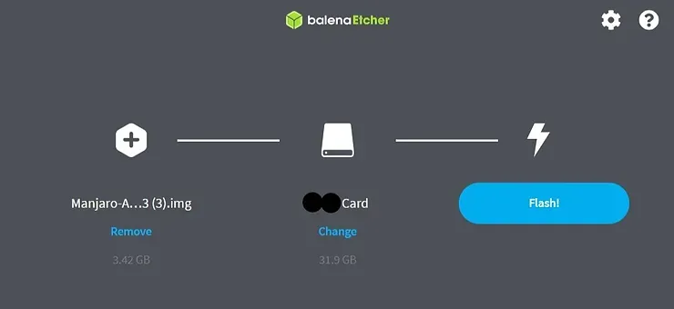
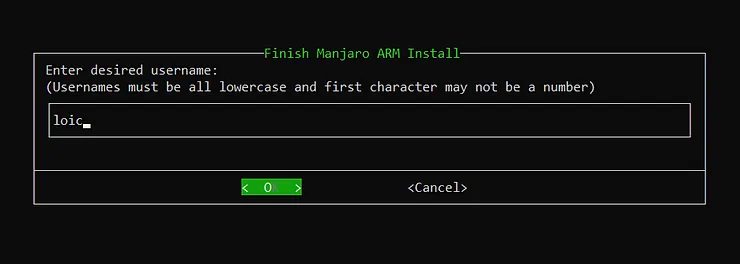
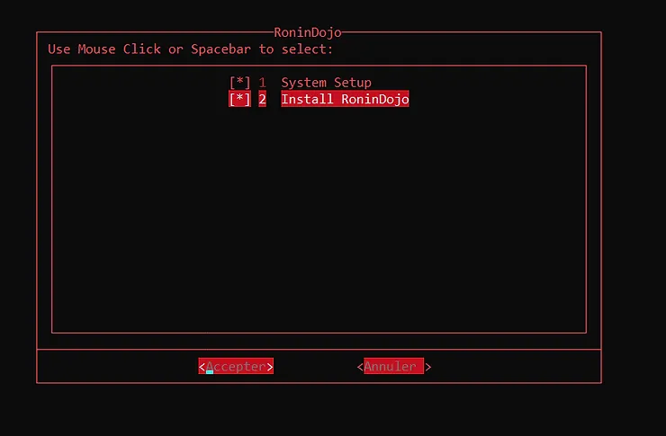
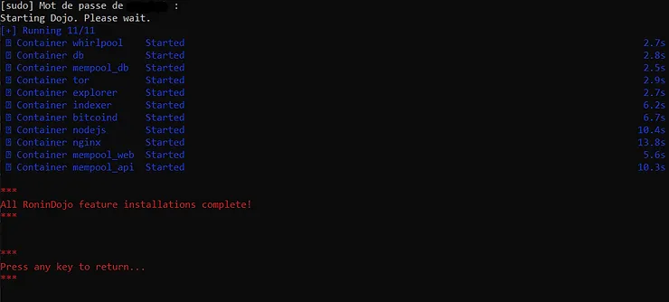
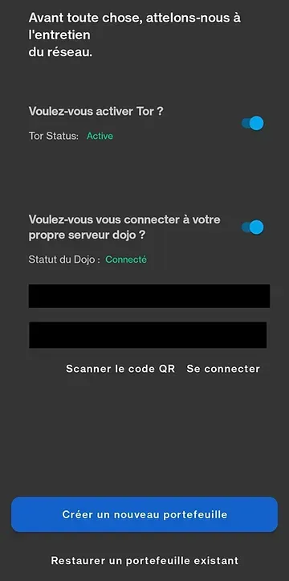
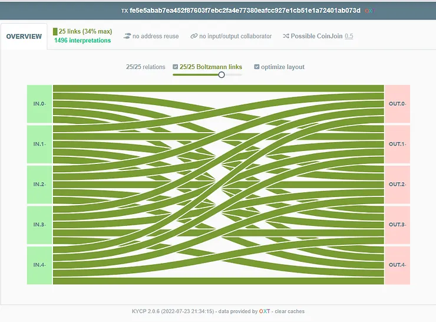
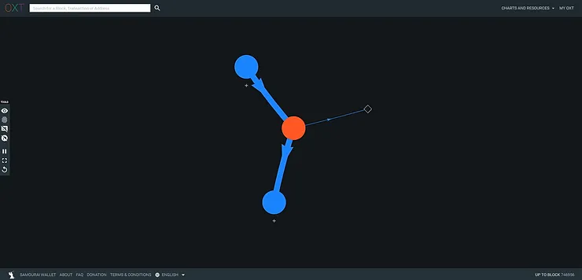
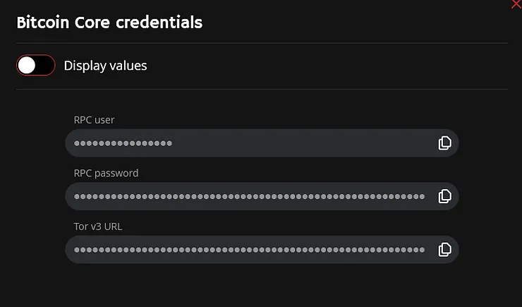

**ATTENTION : Bien que ce tutoriel reste opérationnel pour l'installation de RoninDojo v1, il ne vous permettra pas de mettre à niveau votre nœud vers RoninDojo v2. Ainsi, bien que cette version demeure fonctionnelle, elle n'est plus tenue à jour. Pour bénéficier des dernières améliorations et fonctionnalités, je vous recommande fortement de consulter notre tutoriel dédié à l'installation directe de RoninDojo v2 sur votre Raspberry Pi :** https://planb.network/tutorials/privacy/ronin-dojo-v2

---

Faire tourner et utiliser son propre nœud est essentiel pour prendre réellement part au réseau Bitcoin. Bien qu'exécuter un nœud Bitcoin n'apporte aucun avantage pécuniaire à l'utilisateur, il lui permet de préserver sa confidentialité, d'agir en toute indépendance et de maîtriser sa confiance envers le réseau.

Dans cet article, nous allons étudier en détail RoninDojo, une super solution pour faire tourner son propre nœud Bitcoin.

### Sommaire :

- Qu'est-ce que RoninDojo ?
- Quel matériel choisir ?
- Comment installer RoninDojo ?
- Comment utiliser RoninDojo ?
- Conclusion

Si vous n'êtes pas à l'aise avec le fonctionnement et le rôle d'un nœud Bitcoin, je vous conseille de commencer par lire cet article : Le nœud Bitcoin - Partie 1/2 : Notions techniques.

## Qu'est-ce que RoninDojo ?

Dojo est un serveur nœud complet Bitcoin développé par les équipes de Samouraï Wallet. Vous pouvez l'installer librement sur n'importe quelle machine.

RoninDojo est un assistant d'installation et un outil d'administration pour Dojo et pour divers autres outils. RoninDojo reprend donc l'implémentation originelle de Dojo, et vient y ajouter de nombreux autres outils tout en facilitant son installation et sa gestion.

Ils proposent ainsi un matériel "plug-and-play", le RoninDojo Tanto, avec RoninDojo préinstallé sur une machine montée par leurs équipes. Le Tanto est une solution payante, intéressante pour ceux qui ne veulent pas mettre les mains dans le cambouis.

Le code de RoninDojo est open-source, il est donc également possible d'installer cette solution sur votre propre matériel. Cette option est économique mais elle requiert un petit peu plus de manipulations, c'est ce que nous allons faire dans cet article.

RoninDojo est un Dojo, il permet donc d'intégrer facilement Whirlpool CLI à votre nœud Bitcoin afin de disposer de la meilleure expérience possible de CoinJoin. Grâce à Whirlpool CLI, non seulement vous pourrez laisser vos bitcoins se remixer 24h/24 7j/7 sans avoir besoin de laisser allumer votre ordinateur personnel, mais vous pourrez également améliorer fortement votre confidentialité.

RoninDojo intègre de nombreux autres outils qui vont venir s'appuyer sur votre Dojo comme par exemple : le calculateur Boltzmann qui permet de déterminer le degré de confidentialité d'une transaction, le serveur Electrum pour connecter vos différents portefeuilles Bitcoin à votre nœud ou encore le serveur Mempool pour observer vos transactions de façon privée.

Par rapport à une autre solution de nœud comme Umbrel, que je vous ai présentée dans cet article, RoninDojo s'inscrit dans une ligne de développement profondément tournée vers les solutions "On Chain" et vers des outils permettant d'optimiser la confidentialité des utilisateurs. RoninDojo ne permet donc pas d'interagir avec le Lightning Network.

Un RoninDojo propose moins d'outils par rapport à un Umbrel, mais les quelques fonctionnalités essentielles pour un Bitcoiner présentes sur Ronin sont incroyablement stables.

Donc si vous n'avez pas besoin de toutes les fonctionnalités d'un serveur Umbrel, et que vous souhaitez exclusivement disposer d'un nœud simple et stable avec quelques outils essentiels comme Whirlpool ou Mempool, alors RoninDojo est sûrement une bonne solution pour vous.

Selon moi, la ligne de développement d'Umbrel est très tournée vers le Lightning Network et vers des outils polyvalents. Cela reste un nœud Bitcoin, mais on cherche à en faire un mini-serveur multi-tâches. À l'inverse, la ligne de développement de RoninDojo se rapproche plus de celle des équipes de Samourai Wallet, et se focalise sur les outils essentiels d'un Bitcoiner lui permettant une pleine indépendance et un gestion optimisée de sa confidentialité sur Bitcoin.

Veuillez noter que la mise en place d'un nœud RoninDojo reste légèrement plus complexe qu'un nœud Umbrel.

Maintenant que nous avons pu dresser le portrait de RoninDojo, voyons ensemble comment mettre en place ce nœud.

## Quel matériel choisir ?

Pour choisir la machine qui héberge et fait tourner RoninDojo, vous disposez de plusieurs options.

Comme expliqué précédemment, le choix le plus simple sera de commander le Tanto, une machine plug-and-play conçue spécialement pour cet usage. Pour commander le votre, c'est par ici : https://shop.ronindojo.io/product-category/nodes/.

Etant donné que les équipes de RoninDojo produisent du code open-source, il est également possible d'implémenter RoninDojo sur d'autres machines. Vous pouvez ainsi retrouver les dernières versions de l'assistant d'installation sur cette page : https://ronindojo.io/en/downloads.html, et les dernières versions du code sur cette page : https://code.samourai.io/ronindojo/RoninDojo

Personnellement, je l'ai installé sur un Raspberry Pi 4 8GO et tout fonctionne parfaitement.

Attention tout de même, les équipes de RoninDojo nous indique qu'il y a souvent des problèmes à cause du boitier et de l'adaptateur du SSD. Il est donc déconseillé d'utiliser un boitier avec un câble pour le SSD de votre machine. Préférez plutôt utiliser une carte d'extension de stockage spécialement conçue pour votre carte mère comme celle-ci : Carte d'extension de stockage Raspberry Pi 4.

Voici un exemple de mise en place pour faire votre propre nœud RoninDojo :

- Un Raspberry Pi 4.
- Un boitier avec un ventilateur.
- Une carte d'extension de stockage compatible.
- Un câble d'alimentation.
- Une micro SD industrielle de 16GO ou plus.
- Un SSD de 1TO ou plus.
- Un câble ethernet RJ45, catégorie 8 conseillée.\*

## Comment installer RoninDojo ?

### Etape 1 : Préparer la micro SD bootable.

Une fois que vous avez monté votre machine, vous allez pouvoir commencer l'installation de votre RoninDojo. Pour ce faire, commencez par créer une micro SD bootable en y gravant l'image disque adéquat.

Insérez votre carte micro SD dans votre ordinateur personnel, puis rendez-vous sur le site officiel de RoninDojo pour récupérer l'image disque RoninOS : https://ronindojo.io/en/downloads.html.

Téléchargez l'image disque qui correspond à votre matériel. Dans mon cas, j'ai téléchargé l'image "MANJARO-ARM-RONINOS-RPI4-22.03.IMG.XZ" :

Une fois l'image téléchargée, vérifiez son intégrité grâce au fichier en .SHA256 correspondant. Je vous décris en détail comment faire cela dans cet article : Comment vérifier l'intégrité d'un logiciel Bitcoin sous Windows ?

Les instructions spécifiques à la vérification de l'intégrité de RoninOS sont également disponibles sur cette page en anglais : https://wiki.ronindojo.io/en/extras/verify.

Pour graver cette image sur votre micro SD, vous pouvez utiliser un logiciel tel que Balena Etcher que vous pouvez télécharger ici : https://www.balena.io/etcher/.

Pour ce faire, sélectionnez l'image dans Etcher et flashez la sur la micro SD :

Une fois que l'opération est terminée, vous pouvez insérer la micro SD bootable dans le Raspberry Pi et allumer la machine.

### Etape 2 : Configurer RoninOS.

RoninOS est le système d'exploitation de votre nœud RoninDojo, C'est une version modifiée de Manjaro, une distribution Linux. Après avoir démarré votre machine et attendu quelques minutes, vous pourrez commencer sa configuration.

Pour vous y connecter à distance, vous allez devoir trouver l'adresse IP de votre machine RoninDojo. Pour ce faire vous pouvez par exemple vous connecter au tableau d'administration de votre box internet, ou bien vous pouvez également télécharger un logiciel tel que https://angryip.org/ pour scanner votre réseau local et trouver l'IP de la machine.

Une fois l'IP trouvée, vous pourrez prendre la main sur votre machine depuis un autre ordinateur connecté au même réseau local en utilisant SSH.

Depuis un ordinateur sous MacOS ou Linux, ouvrez simplement le terminal. Depuis un ordinateur sous Windows, vous pouvez utiliser un outil spécialisé comme Putty ou bien directement Windows PowerShell.

Une fois le terminal ouvert, tapez la commande suivante :

> ssh root@192.168.?.?

Remplacez y simplement les deux points d'interrogation par l'IP de votre RoninDojo trouvée précédemment.

> Astuce : Dans un Shell, faites un clic droit pour coller un élément.

Ensuite, vous allez arriver sur le panneau de configuration de Manjaro. Choisissez la juste disposition de votre clavier en utilisant les flèches pour changer de cible dans la liste déroulante.

Choisissez un nom d'utilisateur et un mot de passe pour votre session. Utilisez un mot de passe fort et faite en une sauvegarde sûre. Vous pouvez éventuellement utiliser un mot de passe léger le temps de l'installation, vous pourrez par la suite modifier facilement ce mot de passe avec la possibilité de le "copier-coller" dans RoninUI. Cela vous permettra de mettre un mot de passe très costaud, sans pour autant passer trop de temps à l'écrire manuellement lors de la mise en place de Manjaro.

Ensuite, on vous demandera également de choisir un mot de passe root. Pour le mot de passe root, entrez directement un mot de passe fort. Vous n'aurez pas la possibilité de le modifier depuis RoninUI. Pensez également à bien sauvegarder ce mot de passe root.

Puis entrez votre localité et votre zone temporelle.

Ensuite choisissez un nom d'hôte.

Enfin, vérifiez les informations de configuration de Manjaro puis validez.

### Etape 3 : Télécharger RoninDojo.

La configuration initiale de RoninOS va se faire. Une fois terminée comme sur la capture d'écran ci-dessus, la machine va redémarrer. Attendez alors quelques instants, puis entrez la commande suivante pour vous connecter de nouveau à votre machine RoninDojo :

> ssh pseudo@192.168.?.?

Remplacez y simplement "pseudo" par le nom d'utilisateur que vous avez choisi précédemment, ainsi que les points d'interrogation par l'IP de votre RoninDojo.

Entrez ensuite votre mot de passe utilisateur.

Dans le terminal, cela donne ça :

Vous êtes maintenant connecté à votre machine qui dispose pour le moment simplement de RoninOS. Il va falloir maintenant y installer RoninDojo.

Téléchargez la dernière version de RoninDojo en entrant la commande suivante :

> git clone https://code.samourai.io/ronindojo/RoninDojo

Le téléchargement se fait rapidement. Cela vous donnera cela dans le terminal :

Attendez la fin du téléchargement puis installez et accédez à l'interface utilisateur de RoninDojo en utilisant la commande suivante :

> ~/RoninDojo/ronin

On va alors vous demander d'entrer votre mot de passe utilisateur :

> Cette commande est nécessaire seulement la première fois que vous accédez à votre RoninDojo. Par la suite, pour accéder à RoninCLI via SSH, vous devrez simplement entrer la commande [SSH pseudo@192.168.?.?] en remplaçant "pseudo" par votre nom d'utilisateur et en mettant l'IP de votre nœud. On vous demandera votre mot de passe utilisateur.

Ensuite vous verrez cette magnifique animation :

Puis vous arriverez enfin sur l'interface utilisateur CLI de RoninDojo.

### Etape 4 : Installer RoninDojo.

Depuis le menu principal, accédez au menu "System" en utilisant les flèches de votre clavier. Utilisez la touche d'entrée pour valider votre choix.

Puis allez dans le menu "System Setup & Install".

Enfin, cochez "System Setup" et "Install RoninDojo" en utilisant la barre d'espace, puis sélectionnez "Accepter" pour lancer l'installation.

Laissez l'installation se faire tranquillement. Dans mon cas cela a pris environ 2 heures. Laissez votre terminal ouvert durant l'opération.

Regardez parfois votre terminal, on va vous demander de taper sur une touche à certains stades de l'installation comme ici par exemple :

A la fin de l'installation, vous verrez les différents conteneurs démarrer :

Puis votre nœud va redémarrer. Connectez vous de nouveau à RoninCLI pour l'étape suivante.

### Etape 5 : Télécharger la chaine de preuve de travail et accéder à RoninUI.

Une fois l'installation terminée, votre nœud va se mettre à télécharger la chaine de preuve de travail Bitcoin. C'est ce que l'on appelle l'IBD (Initial Block Download). Cela prend en général entre 2 et 14 jours en fonction de votre connexion internet et de votre appareil.

Vous pouvez suivre l'avancement du téléchargement de la chaine en vous connectant à l'interface web RoninUI.

Pour y accéder depuis un réseau local, tapez sur votre navigateur dans la barre d'adresse :

- Soit directement l'adresse IP de votre machine (192.168.?.?)

- Soit : ronindojo.local

Pensez à désactiver votre VPN si vous en utilisez un.

### Possible twist

Si vous ne parvenez pas à vous connecter à RoninUI depuis votre navigateur, vérifiez le bon fonctionnement de l'application depuis votre Terminal connecté à votre nœud via SSH. Connectez vous au menu principal en procédant comme précédemment :

- Tapez : SSH pseudo@192.168.?.? en remplaçant avec vos identifiants.

- Entrez votre mot de passe utilisateur.

Une fois sur le menu principal, allez dans :

> RoninUI > Restart

Si l'application redémarre correctement, c'est un problème au niveau de la connexion depuis votre navigateur. Vérifiez que vous n'utilisiez pas un VPN et vérifiez que vous soyez bien connecté au même réseau que votre nœud.

Si le redémarrage sort une erreur, essayez de mettre à jour le système d'exploitation puis de réinstaller RoninUI. Pour mettre à jour l'OS :

> System > Software Updates > Update Operating System

Une fois la mise à jour et le redémarrage terminés, reconnectez vous à votre nœud via SSH puis réinstallez RoninUI :

> RoninUI > Re-install

Suite au nouveau téléchargement de RoninUI, essayez de vous connecter via votre navigateur à RoninUI.

> Astuce : Si vous sortez de RoninCLI sans faire exprès, et que vous vous retrouvez sur le terminal Manjaro, entrez simplement la commande "ronin" pour revenir directement sur le menu principal de RoninCLI.

### Web log in

Vous pouvez également vous connecter à l'interface web RoninUI depuis n'importe quel réseau en utilisant Tor. Pour ce faire, récupérez l'adresse Tor de votre RoninUI depuis RoninCLI :

> Credentials > Ronin UI

Récupérez l'adresse Tor terminant par .onion puis connectez vous à Ronin UI en entrant cette adresse dans votre navigateur Tor. Attention à ne pas faire fuiter vos différents credentials, ce sont des informations sensibles.

Une fois connecté, on vous demandera votre mot de passe utilisateur. C'est le même que vous utilisez pour vous connecter via SSH.

Nous pouvons y observer l'avancée de l'IBD. Patience, vous êtes en train de récupérer l'intégralité des transactions effectuées sur Bitcoin depuis le 3 Janvier 2009.

Après avoir téléchargé l'ensemble de la chaine de blocs, l'indexeur va compacter la base de donnée. Cette opération prend environ 12 heures. Vous pouvez également suivre son avancement sous "Indexer" sur RoninUI.

Votre nœud RoninDojo sera complètement fonctionnel après cela :

Si vous souhaitez changer le mot de passe utilisateur pour en mettre un plus fort, vous pouvez le faire dès maintenant depuis l'onglet "Settings". Sur RoninDojo, il n'y a pas de couche de sécurité supplémentaire, alors je vous conseille de mettre un mot de passe réellement costaud et d'en soigner sa sauvegarde.

## Comment utiliser RoninDojo ?

Une fois la chaine téléchargée et compactée, vous pourrez commencer à profiter des services que vous offre votre nouveau nœud RoninDojo. Voyons ensemble comment les utiliser.

### Connecter ses logiciels de portefeuilles à electrs.

La première utilité de votre nœud fraichement installé et synchronisé sera de diffuser vos transactions au réseau Bitcoin. Vous allez donc sûrement vouloir y connecter vos différents logiciels de gestion de portefeuilles.

Vous pouvez faire cela grâce à Electrum Rust Server (electrs). L'application est normalement préinstallée sur votre nœud RoninDojo. Si ce n'est pas le cas, vous pouvez l'installer manuellement depuis l'interface RoninCLI.

Allez simplement dans :

> Applications > Manage Applications > Install Electrum Server

Pour obtenir l'adresse Tor de votre Electrum Server, depuis le menu RoninCLI, allez dans :

> Credentials > Electrs

Vous n'aurez plus qu'à entrer le lien en .onion sur le logiciel de votre portefeuille. Par exemple sur Sparrow Wallet, il suffit d'aller dans l'onglet :

> File > Preferences > Server

En type de serveur, sélectionnez "Private Electrum", puis entrez l'adresse Tor de votre Serveur Electrum dans la case correspondante. Enfin, cliquez sur "Test Connection" pour tester et enregistrer votre connexion.

### Connecter ses logiciels de portefeuilles à Samourai Dojo.

Plutôt que d'utiliser Electrs, vous pouvez également utiliser Samourai Dojo pour connecter votre portefeuille logiciel compatible à votre nœud RoninDojo. Par exemple, Samourai Wallet propose cette option.

Pour ce faire, il suffira de scanner le QR code de connexion de votre Dojo. Pour y accéder depuis RoninUI, cliquez sur l'onglet "Dashboard" puis sur le bouton "Manage" dans la case de votre Dojo. Vous pourrez ensuite voir les QR codes de connexion à votre Dojo et à BTC-RPC Explorer. Pour les mettre en clair, cliquez sur "Display values".

Pour connecter votre portefeuille Samourai Wallet à votre Dojo, vous devrez scanner ce QR code à l'installation de l'application :

### Utiliser son propre Explorer Mempool.

Outil essentiel du Bitcoiner, l'explorer vous permet de vérifier différentes informations sur la chaine Bitcoin. Avec Mempool, vous pouvez par exemple vérifier en temps réel les frais appliqués par les autres utilisateurs afin d'ajuster au mieux les vôtres. Vous pouvez également vérifier le stade de confirmation d'une de vos transactions, ou encore regarder le solde d'une adresse.

Ces outils d'explorer peuvent vous exposer à des risques de perte de confidentialité et vous obligent à faire confiance à la base de données d'un tiers. Lorsque vous utilisez cet outil en ligne sans passer par votre propre nœud :

- Vous risquez de faire fuiter des informations sur votre portefeuille.

- Vous faites confiance au gestionnaire du site web pour la chaine de preuve de travail qu'il héberge.

Afin d'éviter ces risques, vous pouvez utiliser votre propre instance Mempool sur votre nœud via le réseau Tor. Avec cette solution, non seulement vous préservez votre confidentialité lorsque vous utilisez le service, mais vous n'avez également plus besoin de faire confiance à un prestataire puisque vous interrogez votre propre base de donnée.

Pour cela, commencez par installer Mempool Space Visualizer depuis RoninCLI :

> Applications > Manage Applications > Install Mempool Space Visualizer

Une fois installé, récupérez le liens vers votre Mempool. L'adresse Tor vous permettra d'y accéder depuis n'importe quel réseau. De la même façon, nous récupérons ce lien via RoninCLI :

> Credentials > Mempool

Entrez simplement votre adresse Mempool Tor dans le navigateur Tor pour profiter de votre propre instance Mempool, basée sur vos propres données. Je vous conseille d'ajouter cette adresse Tor à vos favoris afin de pouvoir y accéder plus rapidement. Vous pouvez également en faire un raccourci sur votre bureau.

Si vous ne disposez pas encore du navigateur Tor, vous pouvez le télécharger ici : https://www.torproject.org/download/

Vous pouvez aussi y accéder depuis votre smartphone en y installant Tor Browser puis en entrant cette même adresse. Depuis n'importe où, vous pourrez regarder l'état de la chaine Bitcoin en utilisant votre propre nœud.

### Utiliser Whirlpool CLI.

Votre nœud RoninDojo inclut également WhirlpoolCLI, une interface de ligne de commande à distance permettant d'automatiser les mixes Whirlpool.

Lorsque vous réalisez un CoinJoin avec l'implémentation Whirlpool, l'application que vous utilisez doit rester ouverte afin de pouvoir exécuter des mixes et des remixes. Ce procédé peut être fastidieux pour l'utilisateur qui cherche à disposer d'anon sets élevés, puisque l'appareil qui héberge l'application intégrant Whirlpool doit constamment rester allumé. Concrètement, cela veut dire que si vous souhaitez engager vos UTXO dans des remixes 24h/24, vous devrez alors laisser votre ordinateur personnel ou votre téléphone constamment allumé avec l'application ouverte.

Une solution à cette contrainte est d'utiliser WhirlpoolCLI sur une machine destinée à être allumée constamment, comme par exemple un nœud Bitcoin. Grâce à cela, nos UTXO pourront se remixer 24h/24 et 7j/7 sans que l'on ait besoin de laisser une autre machine que notre nœud Bitcoin en fonctionnement.

WhirlpoolCLI s'utilise avec WhirlpoolGUI, une interface graphique à installer sur un ordinateur personnel permettant de gérer facilement les Coinjoins. Je vous explique en détail comment mettre en place Whirlpool CLI avec votre propre dojo dans cet article : https://www.pandul.fr/post/comprendre-et-utiliser-le-coinjoin-sur-bitcoin#:~:text=dans%20cette%20partie.-,Tutoriel%20%3A%20Whirpool%20CLI%20sur%20Dojo%20et%20Whirlpool%20GUI.,-Si%20vous%20souhaitez

Pour en savoir plus sur le Coinjoin de façon générale, je vous explique tout dans cet article : https://www.pandul.fr/post/comprendre-et-utiliser-le-coinjoin-sur-bitcoin

### Utiliser Whirlpool Stat Tool.

Après avoir réalisé des CoinJoin avec Whirlpool, vous souhaiterez peut-être savoir concrètement quel est le niveau de confidentialité de vos UTXO mixés. Whirlpool Stat Tool vous permet de faire cela facilement. Grâce à cet outil, vous pourrez calculer le score prospectif et le score rétrospectif de vos UTXO mixés. Pour en savoir plus sur le calcul de ces Anon Sets et sur leur fonctionnement, je vous conseille de lire cette partie : https://www.pandul.fr/post/comprendre-et-utiliser-le-coinjoin-sur-bitcoin#:~:text=perdre%20en%20confidentialit%C3%A9.-,Anon%20Sets.,-Comme%20expliqu%C3%A9%20pr%C3%A9c%C3%A9demment

L'outil est préinstallé sur votre RoninDojo. Pour le moment, il est uniquement disponible depuis RoninCLI. Pour le lancer depuis le menu principal, allez dans :

> Samourai Toolkit > Whirlpool Stat Tool

Les instructions d'utilisation vont défiler. Une fois cela terminé, tapez sur n'importe quelle touche pour accéder aux lignes de commande :

Vous verrez s'afficher le terminal :

> wst#/tmp>

Pour quitter cette interface et revenir au menu RoninCLI, tapez simplement la commande :

> quit

Pour commencer, on va définir le proxy sur Tor afin de pouvoir extraire les données d'OXT en toute confidentialité. Tapez la commande :

> socks5 127.0.0.1:9050

Téléchargez ensuite les données de la pool qui contient votre transaction :

> download 0001
>
> Remplacez 0001 par le code de dénomination de la pool qui vous intéresse.

Les codes de dénominations sont les suivants sur WST :

- Pool 0,5 bitcoins : 05

- Pool 0,05 bitcoins : 005

- Pool 0,01 bitcoins : 001

- Pool 0,001 bitcoins : 0001

Une fois les données téléchargées, chargez les avec la commande :

> load 0001
>
> Remplacez 0001 par le code de dénomination de la pool qui vous intéresse.

Laissez le chargement se faire, cela peut prendre quelques minutes. Après avoir chargé les données, tapez la commande score suivie de votre TXID (identifiant de transaction) pour obtenir ses Anon Sets :

> score TXID
>
> Remplacez TXID par l'identifiant de votre transaction.

WST vous affiche alors le score rétrospectif (Backward-looking metrics) puis le score prospectif (Forward-looking metrics). En plus des scores des Anon Sets, WST vous donne également le taux de diffusion de votre output dans la pool en fonction de l'anon set.

Veuillez noter que le score prospectif de votre UTXO se calcul à partir de la TXID de votre mix initial, et non pas à partir de votre dernier mix. Au contraire, le score rétrospectif d'un UTXO se calcul à partir de la TXID du dernier cycle.

Encore une fois, si vous ne comprenez pas ces concepts d'Anon Sets, je vous conseille de lire cette partie de mon article sur le Coinjoin dans laquelle je vous explique tout en détail avec des schémas : https://www.pandul.fr/post/comprendre-et-utiliser-le-coinjoin-sur-bitcoin#:~:text=perdre%20en%20confidentialit%C3%A9.-,Anon%20Sets.,-Comme%20expliqu%C3%A9%20pr%C3%A9c%C3%A9demment

### Utiliser le calculateur Boltzmann.

Le calculateur Boltzmann est un outil qui vous permet de calculer facilement différentes métriques avancées sur une transaction Bitcoin, et notamment son niveau d'entropie. Toutes ces données vous permettront de mettre des chiffres sur le niveau de confidentialité d'une transaction et de détecter d'éventuelles erreurs. Cet outil est préinstallé sur votre nœud RoninDojo.

Pour y accéder depuis RoninCLI, connectez vous via SSH, puis allez dans le menu :

> Samourai Toolkit > Boltzmann Calculator

Avant de vous expliquer comment l'utiliser sur RoninDojo, je vais vous expliquer ce que représentent ces métriques, comment est-ce qu'elles sont calculées et à quoi est-ce qu'elles servent.

Ces indicateurs peuvent être utilisés pour n'importe quelle transaction Bitcoin, mais ils sont particulièrement intéressants pour étudier la qualité d'une transaction Coinjoin.

1. Le premier indicateur calculé par ce logiciel est le nombre de combinaisons possibles. Il est noté sur le calculateur : "nb combinations". Compte tenu des valeurs des UTXO, cet indicateur représente le nombre de mappages possibles des entrées vers les sorties.

> Si vous n'êtes pas à l'aise avec le terme d'"UTXO", je vous conseille de lire ce court article : Mécanisme d'une transaction Bitcoin : UTXO, inputs et outputs.

En d'autres termes, cet indicateur représente le nombre d'interprétations possibles pour une transaction donnée. Par exemple : un Coinjoin de structure Whirlpool 5x5 aura un nombre de combinaisons possibles égal à 1496 :

Crédit : https://kycp.org/#/fe5e5abab7ea452f87603f7ebc2fa4e77380eafcc927e1cb51e1a72401ab073d

2. Le deuxième indicateur calculé est l'entropie d'une transaction ("Entropy"). Etant donné que le nombre de combinaisons possibles peut-être très élevé pour une transaction, on peut choisir d'utiliser plutôt l'entropie. L'entropie représente le logarithme binaire du nombre de combinaisons possibles. Sa formule est la suivante pour :

- E : l'entropie de la transaction.

- C : le nombre de combinaisons possibles pour la transaction.

> E = log2(C)

En mathématiques, le logarithme binaire (de base 2) est la fonction réciproque de la fonction puissance de 2. Autrement dit, le logarithme binaire de x est la puissance à laquelle le chiffre 2 doit être élevé pour obtenir la valeur x.

Ainsi :

> E = log2(C)
> C = 2^E

Cet indicateur est donc exprimé en bits. Par exemple, voici le calcul de l'entropie d'une transaction Coinjoin de structure Whirlpool 5x5, avec comme vu précédemment, un nombre de combinaisons possibles égal à 1496 :

> C = 1496
>
> E = log2(1496)
>
> E = 10.5469 bits

Cette transaction Coinjoin dispose donc d'une entropie de 10.5469 bits, ce qui est très bien.

Au plus cet indicateur est élevé, au plus il y a d'interprétations différentes de la transaction, et donc au plus la transaction est confidentielle.

Prenons un autre exemple. Voici une transaction "classique" qui dispose d'un input et de deux outputs :

Crédit : https://oxt.me/graph/transaction/tiid/9815286

Cette transaction ne dispose que d'une seule interprétation possible :

> [(inp 0) > (Outp 0 ; Outp 1)]

Son entropie sera donc égale à 0 :

> C = 1
>
> E = log2(C)
>
> E = 0

3. Le troisième indicateur renvoyé par le calculateur Boltzmann est l'efficacité de la Tx nommé "Wallet Efficiency". Cet indicateur permet simplement de comparer la transaction entrée avec la meilleure transaction possible dans la même configuration.

On va donc introduire le concept d'entropie maximale qui représente l'entropie la plus élevée atteignable pour une structure de transaction donnée. Par exemple, la structure de Coinjoin de type Whirlpool 5x5 aura une entropie maximale égale à 10.5469. L'indicateur d'efficacité compare donc cette entropie maximale avec l'entropie réelle de la transaction entrée. Sa formule est la suivante pour :

- ER : Entropie réelle exprimée en bits.

- EM : Entropie maximale avec la même structure exprimée en bits.

- Ef : Efficacité exprimée en bits.

> Ef = ER - EM
>
> Ef = 10.5469 - 10.5469
>
> Ef = 0 bits

Cet indicateur est également exprimé en pourcentage, sa formule est alors pour :

- CR : Nombre de combinaisons possibles réelles.

- CM : Nombre de combinaisons possibles au maximum avec la même structure.

- Ef : Efficacité exprimée en poucentage.

> Ef = CR/CM
>
> Ef = 1496/1496
>
> Ef = 100%

Une efficacité de 100% veut donc dire que cette transaction a le plus de confidentialité possible par rapport à sa structure.

4. Le quatrième indicateur calculé est la densité de l'entropie ("Entropy Density"). Il permet de ramener l'entropie à chaque entrée ou sortie. Ainsi, on pourra utiliser cet indicateur pour comparer l'efficacité entre plusieurs transactions de tailles différentes.

Son calcul est très simple, on va venir diviser l'entropie de la transaction par le nombre d'inputs et d'outputs qui y sont présents. Par exemple pour un Coinjoin de type Whirlpool 5x5 nous aurons :

    ED : Densité de l'entropie exprimée en bits.

    E : Entropie de la transaction exprimée en bits.

    T : nombre total d'inputs et d'outputs dans la transaction.

T = 5 + 5 = 10
ED = E / T
ED = 10.5469 / 10
ED = 1.054 bits

La cinquième information qui est fournie par le calculateur Boltzmann est le tableau de probabilités de liens entre les entrées et les sorties. Ce tableau vous donnera simplement la probabilité (score de Boltzmann) qu'une entrée donnée corresponde à une sortie donnée.

Si on reprend notre exemple avec un Coinjoin Whirlpool, le tableau des probabilités sera :

| Input | Output 0 | Output 1 | Output 2 | Output 3 | Output 4 |
| ----- | -------- | -------- | -------- | -------- | -------- |
| 0     | 34%      | 34%      | 34%      | 34%      | 34%      |
| 1     | 34%      | 34%      | 34%      | 34%      | 34%      |
| 2     | 34%      | 34%      | 34%      | 34%      | 34%      |
| 3     | 34%      | 34%      | 34%      | 34%      | 34%      |
| 4     | 34%      | 34%      | 34%      | 34%      | 34%      |

On voit bien ici que chaque input a autant de probabilité d'être lié à chaque output.

En revanche, si l'on prend l'exemple d'une transaction avec un input et deux output, alors cela donne :

| Input | Output 0 | Output 1 |
| ----- | -------- | -------- |
| 0     | 100%     | 100%     |

Dans cet exemple on peut voir que la probabilité de chaque output de provenir de l'input 0 est de 100%.

Au plus cette probabilité sera basse, au plus il y aura de confidentialité.

6. La sixième information qui est calculée est le nombre de liens déterministes. On vous fournira également le ratio de liens déterministes. Cet indicateur permet de mettre en lumière le nombre de liens entre inputs et outputs de la transaction donnée qui ont une probabilité de 100%, c'est-à-dire qui sont indéniables.

Le ratio permet alors d'indiquer le nombre de liens déterministes dans la transaction par rapport au nombre de liens total.

Par exemple, une transaction Coinjoin Whirlpool n'a aucun lien déterministe entre les entrées et les sorties. L'indicateur sera donc égal à zéro et le ratio sera de 0% également.

En revanche, pour la seconde transaction étudiée (1 input et 2 outputs), l'indicateur est égal à 2 et le ratio est égal à 100%.

Donc si cet indicateur est égal à zéro, alors cela indique une bonne confidentialité.

Maintenant que nous avons étudié les indicateurs, voyons comment les calculer à l'aide de ce logiciel. Depuis RoninCLI, rendez-vous dans le menu :

> Samourai Toolkit > Boltzmann Calculator

Une fois le logiciel lancé, entrez l'identifiant de la transaction que vous souhaitez étudier. Vous pouvez entrer plusieurs transactions à la fois en les séparant avec une virgule, puis tapez entrée :

Le calculateur vous renvoie alors tous les indicateurs que nous avons vu précédemment :

Tapez la commande "Quit" pour quitter le logiciel et revenir au menu RoninCLI.

Pour en savoir plus sur le calculateur Boltzmann, je vous conseille de lire ces articles :

- https://medium.com/@laurentmt/introducing-boltzmann-85930984a159

- https://gist.github.com/LaurentMT/e758767ca4038ac40aaf

### Connecter Bisq.

Bisq est une plateforme d'échange vous permettant de réaliser des achats et des ventes de bitcoins de pair à pair. Il s'utilise avec un logiciel de bureau qui s'exécute sous Tor et qui permet d'échanger des bitcoins sans avoir besoin de renseigner son identité.

Bisq sécurise les échange pair-à-pair grâce à un système de multi-signature 2/2. Vous pouvez utiliser ce logiciel avec votre propre nœud RoninDojo afin d'optimiser la confidentialité de vos échanges et de faire confiance aux données de la blockchain de votre propre noeud.

Pour télécharger le logiciel Bisq, rendez-vous sur leur site officiel : https://bisq.network/

Pour prendre en main le logiciel, je vous conseille de lire cette page : https://bisq.network/getting-started/

Pour récupérer le lien de connexion depuis votre RoninDojo, vous devrez vous connecter à RoninCLI via SSH. Ensuite rendez-vous dans le menu :

> Applications > Manage Applications

Renseignez votre mot de passe, puis cochez avec la touche espace la case :

> [ ] Enable Bisq Connection

Confirmez votre choix. Laissez votre nœud installer, puis allez récupérer l'adresse Tor V3 depuis :

> Credentials > Bitcoind

Copiez l'adresse sous "Bitcoin Daemon".

Vous pouvez également récupérer votre adresse Bitcoind Tor V3 depuis l'interface RoninUI en cliquant simplement sur "Manage" dans la case "Bitcoin Core" depuis le "Dashboard" :

Pour connecter votre nœud depuis Bisq, accèdez au menu :

> Paramètres > Info sur le réseau

Cliquez sur la bulle "Utiliser des nœuds Bitcoin Core personnalisés". Puis renseignez votre adresse Bitcoin TorV3 dans la case prévue à cet effet, avec le ".onion" mais sans le "http://".

Redémarrez le logiciel Bisq. Votre nœud est dorénavant connecté à votre Bisq.

### Autres fonctionnalités.

Votre nœud RoninDojo embarque également d'autres fonctionnalités de base. Vous avez notamment la possibilité de scanner des informations spécifiques afin de faire en sorte de les prendre en compte.

Par exemple, il est parfois possible que votre portefeuille connecté à votre RoninDojo ne trouve pas les bitcoins qui vous appartiennent. La balance est à 0 alors que vous êtes persuadés que vous possédez bien du bitcoin sur ce wallet. Il existe de nombreuses causes possibles à prendre en compte, notamment une erreur au niveau des chemins de dérivations, et parmi elles, il est également possible que votre nœud n'observe pas vos adresses.

Pour y remédier, vous pouvez vérifier que votre nœud traque bien votre xpub avec l'outil "xpub tool". Pour y accéder depuis RoninUI, allez dans le menu :

> Maintenance > XPUB Tool

Entrez la xpub qui pose problème et cliquez sur "Check" pour vérifier cette information.

Si votre xpub est bien traquée par le nœud, vous verrez apparaitre cela :

Vérifiez que toutes les transactions apparaissent bien. Vérifiez également que le type de dérivation correspond à celui de votre portefeuille. Ici on peut voir que le nœud interprète cette xpub comme une dérivation BIP44. Si ce type de dérivation ne correspond pas à celui de votre portefeuille, cliquez sur le bouton "Retype", puis sélectionnez BIP44/BIP49/BIP84 en fonction de votre choix :

Si votre xpub n'est pas traquée pas votre nœud, vous verrez apparaitre cet écran qui vous invite à l'importer :

Vous pouvez également utiliser les autres outils de maintenance :

- Transaction Tool : Vous permet d'observer les détails d'une transaction spécifique.

- Address Tool : Vous permet de vérifier qu'une adresse spécifique est bien traquée par votre Dojo.

- Rescan Blocks : Force votre nœud à scanner de nouveau un rang de blocks choisi.

Vous trouverez également sur RoninUI l'outil "Push Tx". Il vous permet de diffuser une transaction signée au réseau Bitcoin. Celle-ci doit être entrée au format hexadécimal :

## Conclusion.

Nous avons pu voir comment installer et prendre en main ce magnifique outil que représente RoninDojo. C'est un excellent choix pour faire tourner son propre nœud Bitcoin. C'est une solution stable, qui intègre et tient à jour tous les outils essentiels pour un Bitcoiner.

Si l'utilisation du terminal ne vous fait pas peur, et si vous n'avez pas besoin d'outils en lien avec le Lightning Network, alors RoninDojo peut vous plaire.

Si vous le pouvez, pensez à faire un don aux développeurs qui produisent gratuitement ces logiciels libres et open source pour vous : https://donate.ronindojo.io/

Pour en savoir plus sur RoninDojo, je vous conseille d'aller observer les liens dans mes ressources externes ci-dessous.

### Pour aller plus loin :

- Comprendre et utiliser le CoinJoin sur Bitcoin.

- Les fonctions de hachage - extrait ebook Bitcoin Démocratisé 1.

- Tout savoir sur la Passphrase Bitcoin.

### Ressources externes :

- https://samouraiwallet.com/dojo
- https://ronindojo.io/index.html
- https://wiki.ronindojo.io/en/home
- https://code.samourai.io/ronindojo/RoninDojo
- https://gist.github.com/LaurentMT/e758767ca4038ac40aaf
- https://medium.com/@laurentmt/introducing-boltzmann-85930984a159
- https://oxt.me/
- https://kycp.org/#/
- https://fr.wikipedia.org/wiki/Formule_de_Boltzmann
- https://wiki.ronindojo.io/en/setup/bisq
- https://bisq.network/
