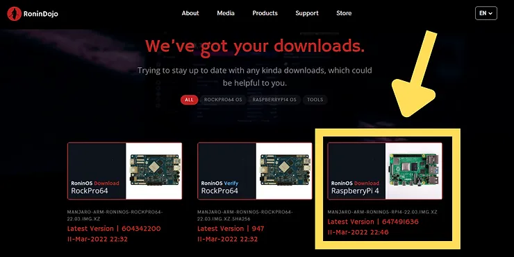
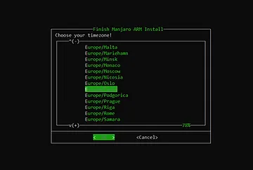
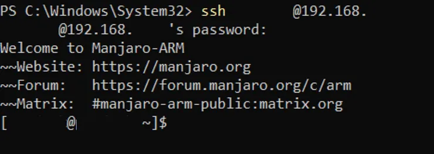
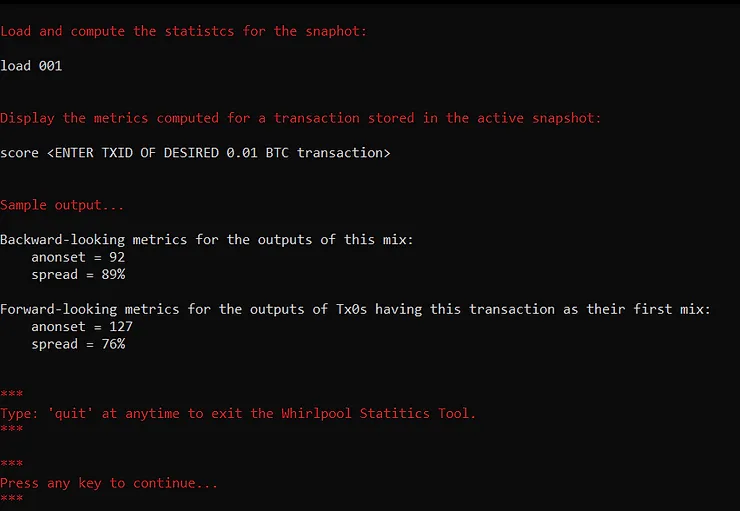
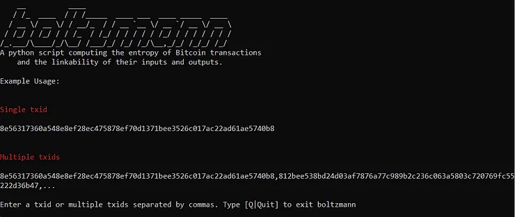
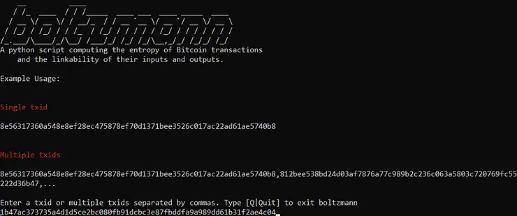

Eseguire e utilizzare il proprio nodo è essenziale per partecipare attivamente alla rete Bitcoin. Sebbene l'esecuzione di un nodo Bitcoin non offra vantaggi finanziari all'utente, consente di preservare la propria privacy, agire in modo indipendente e controllare la fiducia nella rete.

In questo articolo, esamineremo in dettaglio RoninDojo, una soluzione eccellente per eseguire il proprio nodo Bitcoin.

### Sommario:

- Cosa è RoninDojo?
- Quale hardware scegliere?
- Come installare RoninDojo?
- Come utilizzare RoninDojo?
- Conclusioni

Se non sei familiare con il funzionamento e il ruolo di un nodo Bitcoin, ti consiglio di iniziare leggendo questo articolo: Il nodo Bitcoin - Parte 1/2: Concetti tecnici.

## Cosa è RoninDojo?

Dojo è un server nodo Bitcoin completo sviluppato dal team di Samourai Wallet. Puoi installarlo liberamente su qualsiasi macchina.

RoninDojo è un assistente di installazione e uno strumento di amministrazione per Dojo e altri strumenti vari. RoninDojo utilizza l'implementazione originale di Dojo e aggiunge numerosi altri strumenti, semplificando l'installazione e la gestione.

Offrono anche un hardware "plug-and-play", il RoninDojo Tanto, con RoninDojo preinstallato su una macchina assemblata dal loro team. Il Tanto è una soluzione a pagamento, interessante per coloro che non vogliono sporcare le mani.

Il codice di RoninDojo è open-source, quindi è anche possibile installare questa soluzione sul proprio hardware. Questa opzione è economica, ma richiede un po' più di lavoro, ed è quello che faremo in questo articolo.

RoninDojo è un Dojo, quindi consente di integrare facilmente Whirlpool CLI nel proprio nodo Bitcoin per ottenere la migliore esperienza possibile di CoinJoin. Grazie a Whirlpool CLI, non solo potrai far mescolare i tuoi bitcoin 24 ore su 24, 7 giorni su 7 senza dover tenere acceso il tuo computer personale, ma potrai anche migliorare notevolmente la tua privacy.

RoninDojo include numerosi altri strumenti che si basano sul tuo Dojo, come ad esempio il calcolatore Boltzmann che consente di determinare il livello di privacy di una transazione, il server Electrum per collegare i tuoi diversi portafogli Bitcoin al tuo nodo o il server Mempool per osservare le tue transazioni in modo privato.
Rispetto a un'altra soluzione di nodo come Umbrel, che ti ho presentato in questo articolo, RoninDojo si inserisce in una linea di sviluppo profondamente orientata verso le soluzioni "On Chain" e verso strumenti che ottimizzano la privacy degli utenti. RoninDojo non consente quindi di interagire con la Lightning Network.
Un RoninDojo offre meno strumenti rispetto a un Umbrel, ma le poche funzionalità essenziali per un Bitcoiner presenti su Ronin sono incredibilmente stabili.

Quindi, se non hai bisogno di tutte le funzionalità di un server Umbrel e desideri esclusivamente avere un nodo semplice e stabile con alcuni strumenti essenziali come Whirlpool o Mempool, allora RoninDojo è sicuramente una buona soluzione per te.

Secondo me, la linea di sviluppo di Umbrel è molto orientata verso la Lightning Network e verso strumenti versatili. Resta comunque un nodo Bitcoin, ma si cerca di farne un mini-server multitasking. Al contrario, la linea di sviluppo di RoninDojo si avvicina di più a quella del team di Samourai Wallet e si concentra sugli strumenti essenziali di un Bitcoiner che gli consentono una piena indipendenza e una gestione ottimizzata della sua privacy su Bitcoin.

Si prega di notare che l'installazione di un nodo RoninDojo è leggermente più complessa rispetto a un nodo Umbrel.

Ora che abbiamo potuto delineare il profilo di RoninDojo, vediamo insieme come configurare questo nodo.

## Quale hardware scegliere?

Per scegliere la macchina che ospita e fa funzionare RoninDojo, hai diverse opzioni.

Come spiegato in precedenza, la scelta più semplice sarà quella di ordinare il Tanto, una macchina plug-and-play appositamente progettata per questo scopo. Per ordinare il tuo, vai qui: https://shop.ronindojo.io/product-category/nodes/.

Dato che il team di RoninDojo produce codice open-source, è anche possibile implementare RoninDojo su altre macchine. Puoi trovare le ultime versioni dell'assistente di installazione su questa pagina: https://ronindojo.io/en/downloads.html, e le ultime versioni del codice su questa pagina: https://code.samourai.io/ronindojo/RoninDojo.

Personalmente, l'ho installato su un Raspberry Pi 4 8GB e funziona perfettamente.

Tuttavia, attenzione, il team di RoninDojo ci informa che ci sono spesso problemi a causa del case e dell'adattatore SSD. Pertanto, è sconsigliato utilizzare un case con un cavo per l'SSD della tua macchina. È preferibile utilizzare una scheda di espansione di archiviazione appositamente progettata per la tua scheda madre, come questa: Carte d'espansione di archiviazione Raspberry Pi 4.

Ecco un esempio di configurazione per creare il tuo nodo RoninDojo:

- Un Raspberry Pi 4.
- Un case con una ventola.
- Una scheda di espansione di archiviazione compatibile.
- Un cavo di alimentazione.
- Una micro SD industriale da almeno 16GB.
- Un SSD da almeno 1TB.
- Un cavo ethernet RJ45, preferibilmente di categoria 8.

## Come installare RoninDojo?

### Passo 1: Preparare la micro SD avviabile.

Una volta montata la tua macchina, puoi iniziare l'installazione di RoninDojo. Per farlo, inizia creando una micro SD avviabile scrivendo l'immagine disco corretta.

Inserisci la tua scheda micro SD nel tuo computer personale e vai sul sito ufficiale di RoninDojo per scaricare l'immagine disco di RoninOS: https://ronindojo.io/en/downloads.html.

Scarica l'immagine disco corrispondente al tuo hardware. Nel mio caso, ho scaricato l'immagine "MANJARO-ARM-RONINOS-RPI4-22.03.IMG.XZ":

Una volta scaricata l'immagine, verifica la sua integrità utilizzando il file .SHA256 corrispondente. Spiego dettagliatamente come fare questo in questo articolo: Come verificare l'integrità di un software Bitcoin su Windows?

Le istruzioni specifiche per verificare l'integrità di RoninOS sono disponibili anche su questa pagina in inglese: https://wiki.ronindojo.io/en/extras/verify.

Per scrivere questa immagine sulla tua micro SD, puoi utilizzare un software come Balena Etcher che puoi scaricare qui: https://www.balena.io/etcher/.

Per farlo, seleziona l'immagine in Etcher e scrivila sulla micro SD:

Una volta completata l'operazione, puoi inserire la micro SD avviabile nel Raspberry Pi e accendere la macchina.

### Passo 2: Configurare RoninOS.

RoninOS è il sistema operativo del tuo nodo RoninDojo, è una versione modificata di Manjaro, una distribuzione Linux. Dopo aver avviato la tua macchina e aspettato qualche minuto, puoi iniziare la configurazione.

Per connetterti in remoto, devi trovare l'indirizzo IP della tua macchina RoninDojo. Puoi farlo ad esempio accedendo all'interfaccia di amministrazione del tuo router, oppure puoi scaricare un software come https://angryip.org/ per scansionare la tua rete locale e trovare l'IP della macchina.

Una volta trovato l'IP, puoi prendere il controllo della tua macchina da un altro computer connesso alla stessa rete locale utilizzando SSH.

Da un computer con MacOS o Linux, apri semplicemente il terminale. Da un computer con Windows, puoi utilizzare uno strumento specializzato come Putty o direttamente Windows PowerShell.

Una volta aperto il terminale, digita il seguente comando:

> ssh root@192.168.?.?

Sostituisci semplicemente i due punti interrogativi con l'IP del tuo RoninDojo trovato in precedenza.
Suggerimento: In una shell, fai clic destro per incollare un elemento.

Successivamente, verrai reindirizzato alla schermata di configurazione di Manjaro. Utilizza le frecce per selezionare la giusta disposizione della tastiera dalla lista a discesa.

Scegli un nome utente e una password per la tua sessione. Utilizza una password forte e fai un backup sicuro. Puoi eventualmente utilizzare una password semplice durante l'installazione e successivamente modificarla facilmente con la possibilità di "copia e incolla" in RoninUI. Questo ti permetterà di impostare una password molto robusta senza doverla digitare manualmente durante l'installazione di Manjaro.

Successivamente, ti verrà chiesto di scegliere una password per l'utente root. Per la password di root, inserisci direttamente una password forte. Non avrai la possibilità di modificarla tramite RoninUI. Assicurati anche di fare un backup sicuro di questa password di root.

Successivamente, inserisci la tua località e la tua zona oraria.

Successivamente, scegli un nome host.

Infine, verifica le informazioni di configurazione di Manjaro e conferma.

### Passaggio 3: Scarica RoninDojo.

La configurazione iniziale di RoninOS verrà eseguita. Una volta completata, come mostrato nella schermata sopra, la macchina si riavvierà. Attendi qualche istante, quindi inserisci il seguente comando per riconnetterti alla tua macchina RoninDojo:

> ssh pseudo@192.168.?.?

Sostituisci "pseudo" con il nome utente che hai scelto in precedenza e sostituisci i punti interrogativi con l'indirizzo IP del tuo RoninDojo.

Successivamente, inserisci la tua password utente.

Nel terminale, apparirà così:

Ora sei connesso alla tua macchina che al momento ha solo RoninOS. Ora dovrai installare RoninDojo.

Scarica l'ultima versione di RoninDojo inserendo il seguente comando:

> git clone https://code.samourai.io/ronindojo/RoninDojo

Il download verrà eseguito rapidamente. Nel terminale apparirà così:

Attendi il completamento del download, quindi installa e accedi all'interfaccia utente di RoninDojo utilizzando il seguente comando:

> ~/RoninDojo/ronin

Ti verrà quindi chiesto di inserire la tua password utente:

Questa procedura è necessaria solo la prima volta che accedi al tuo RoninDojo. Successivamente, per accedere a RoninCLI tramite SSH, dovrai semplicemente inserire il comando [SSH pseudo@192.168.?.?] sostituendo "pseudo" con il tuo nome utente e inserendo l'IP del tuo nodo. Ti verrà richiesta la password dell'utente.

Successivamente vedrai questa bellissima animazione:

Poi finalmente arriverai all'interfaccia utente CLI di RoninDojo.

### Passaggio 4: Installare RoninDojo.

Dal menu principale, accedi al menu "System" utilizzando le frecce della tastiera. Utilizza il tasto Invio per confermare la tua scelta.

Quindi vai al menu "System Setup & Install".

Infine, seleziona "System Setup" e "Install RoninDojo" utilizzando la barra spaziatrice, quindi seleziona "Accetta" per avviare l'installazione.

Lascia che l'installazione si completi tranquillamente. Nel mio caso ci sono volute circa 2 ore. Lascia aperto il tuo terminale durante l'operazione.

Osserva occasionalmente il tuo terminale, ti verrà chiesto di premere un tasto in determinati momenti dell'installazione, come ad esempio qui:

Alla fine dell'installazione, vedrai i diversi container avviarsi:

Poi il tuo nodo si riavvierà. Riconnettiti a RoninCLI per il passaggio successivo.

### Passaggio 5: Scaricare la blockchain e accedere a RoninUI.

Una volta completata l'installazione, il tuo nodo inizierà a scaricare la blockchain di Bitcoin. Questo è ciò che viene chiamato IBD (Initial Block Download). Di solito ci vogliono tra 2 e 14 giorni a seconda della tua connessione internet e del tuo dispositivo.

Puoi seguire l'avanzamento del download della blockchain accedendo all'interfaccia web di RoninUI.

Per accedervi da una rete locale, digita nel tuo browser nella barra degli indirizzi:

- O l'indirizzo IP della tua macchina (192.168.?.?)

- O: ronindojo.local

Ricorda di disattivare il tuo VPN se ne stai usando uno.

### Possibile complicazione

Se non riesci a connetterti a RoninUI dal tuo browser, verifica il corretto funzionamento dell'applicazione dal tuo terminale connesso al tuo nodo tramite SSH. Accedi al menu principale seguendo le istruzioni precedenti:

- Digita: SSH pseudo@192.168.?.? sostituendo con le tue credenziali.

- Inserisci la tua password utente.

Una volta nel menu principale, vai su:

> RoninUI > Riavvia

Se l'applicazione si riavvia correttamente, il problema è a livello di connessione dal tuo browser. Verifica di non utilizzare una VPN e assicurati di essere connesso alla stessa rete del tuo nodo.

Se il riavvio restituisce un errore, prova a aggiornare il sistema operativo e quindi reinstalla RoninUI. Per aggiornare il sistema operativo:

> Sistema > Aggiornamenti software > Aggiorna sistema operativo

Una volta completato l'aggiornamento e il riavvio, ricollegati al tuo nodo tramite SSH e quindi reinstalla RoninUI:

> RoninUI > Reinstalla

Dopo aver scaricato nuovamente RoninUI, prova a connetterti a RoninUI tramite il tuo browser.

> Suggerimento: se esci da RoninCLI per errore e ti ritrovi sul terminale Manjaro, digita semplicemente il comando "ronin" per tornare direttamente al menu principale di RoninCLI.

### Accesso web

Puoi anche accedere all'interfaccia web di RoninUI da qualsiasi rete utilizzando Tor. Per farlo, ottieni l'indirizzo Tor di RoninUI da RoninCLI:

> Credenziali > Ronin UI

Prendi l'indirizzo Tor che termina con .onion e accedi a Ronin UI inserendo questo indirizzo nel tuo browser Tor. Fai attenzione a non divulgare le tue credenziali, sono informazioni sensibili.

Una volta connesso, ti verrà richiesta la password dell'utente. È la stessa che usi per accedere tramite SSH.

Possiamo vedere l'avanzamento dell'IBD. Sii paziente, stai recuperando tutte le transazioni effettuate su Bitcoin dal 3 gennaio 2009.

Dopo aver scaricato l'intera blockchain, l'indicizzatore compatterà il database. Questa operazione richiede circa 12 ore. Puoi anche seguire il suo progresso su "Indicizzatore" su RoninUI.

Il tuo nodo RoninDojo sarà completamente funzionale dopo questo:

Se desideri cambiare la password dell'utente per renderla più sicura, puoi farlo ora dall'opzione "Impostazioni". Su RoninDojo, non c'è uno strato di sicurezza aggiuntivo, quindi ti consiglio di scegliere una password veramente robusta e di fare attenzione al suo backup.

## Come utilizzare RoninDojo?

Una volta che la blockchain è stata scaricata e compattata, puoi iniziare a utilizzare i servizi offerti dal tuo nuovo nodo RoninDojo. Vediamo insieme come utilizzarli.

### Collegare i tuoi software di portafoglio a electrs.

La prima utilità del tuo nodo appena installato e sincronizzato sarà quella di diffondere le tue transazioni alla rete Bitcoin. Quindi probabilmente vorrai connettere i tuoi diversi software di gestione del portafoglio.

Puoi farlo tramite Electrum Rust Server (electrs). L'applicazione è di solito preinstallata sul tuo nodo RoninDojo. Se non è il caso, puoi installarla manualmente dall'interfaccia RoninCLI.

Vai semplicemente su:

> Applicazioni > Gestisci applicazioni > Installa Electrum Server

Per ottenere l'indirizzo Tor del tuo Electrum Server, dal menu RoninCLI, vai su:

> Credenziali > Electrs

Dovrai semplicemente inserire il link in .onion nel software del tuo portafoglio. Ad esempio, su Sparrow Wallet, basta andare nella scheda:

> File > Preferenze > Server

Nel tipo di server, seleziona "Private Electrum", quindi inserisci l'indirizzo Tor del tuo Server Electrum nel campo corrispondente. Infine, clicca su "Test Connection" per testare e salvare la tua connessione.

### Collegare i software del portafoglio a Samourai Dojo.

Invece di utilizzare Electrs, puoi anche utilizzare Samourai Dojo per collegare il tuo portafoglio software compatibile al tuo nodo RoninDojo. Ad esempio, Samourai Wallet offre questa opzione.

Per farlo, sarà sufficiente scannerizzare il codice QR di connessione del tuo Dojo. Per accedervi da RoninUI, clicca sulla scheda "Dashboard" e poi sul pulsante "Manage" nella casella del tuo Dojo. Potrai quindi vedere i codici QR di connessione al tuo Dojo e a BTC-RPC Explorer. Per visualizzarli in chiaro, clicca su "Display values".

Per collegare il tuo portafoglio Samourai Wallet al tuo Dojo, dovrai scannerizzare questo codice QR durante l'installazione dell'applicazione:

### Utilizzare il proprio Explorer Mempool.

Strumento essenziale per i Bitcoiner, l'explorer ti permette di verificare diverse informazioni sulla catena Bitcoin. Con Mempool, ad esempio, puoi verificare in tempo reale le commissioni applicate dagli altri utenti per regolare al meglio le tue. Puoi anche verificare lo stato di conferma di una delle tue transazioni o controllare il saldo di un indirizzo.

Questi strumenti di explorer possono esporre a rischi di perdita di privacy e ti obbligano a fidarti del database di un terzo. Quando utilizzi questo strumento online senza passare per il tuo proprio nodo:

- Rischierai di divulgare informazioni sul tuo portafoglio.

- Ti affidi al gestore del sito web per la catena di proof of work che ospita.

Per evitare questi rischi, puoi utilizzare la tua istanza Mempool sul tuo nodo tramite la rete Tor. Con questa soluzione, non solo preservi la tua privacy quando utilizzi il servizio, ma non devi più fare affidamento su un provider poiché stai interrogando il tuo stesso database.
Per fare ciò, inizia installando Mempool Space Visualizer da RoninCLI:

> Applicazioni > Gestisci Applicazioni > Installa Mempool Space Visualizer

Una volta installato, ottieni il link per il tuo Mempool. L'indirizzo Tor ti permetterà di accedervi da qualsiasi rete. Allo stesso modo, otteniamo questo link tramite RoninCLI:

> Credenziali > Mempool

Basta inserire il tuo indirizzo Mempool Tor nel browser Tor per utilizzare la tua stessa istanza Mempool, basata sui tuoi dati. Ti consiglio di aggiungere questo indirizzo Tor ai tuoi preferiti per potervi accedere più rapidamente. Puoi anche crearne un collegamento sul tuo desktop.

Se non hai ancora il browser Tor, puoi scaricarlo qui: https://www.torproject.org/download/

Puoi anche accedervi dal tuo smartphone installando Tor Browser e inserendo lo stesso indirizzo. Da qualsiasi luogo, potrai monitorare lo stato della catena Bitcoin utilizzando il tuo stesso nodo.

### Utilizzare Whirlpool CLI.

Il tuo nodo RoninDojo include anche WhirlpoolCLI, un'interfaccia da riga di comando remota per automatizzare i mix Whirlpool.

Quando esegui un CoinJoin con l'implementazione Whirlpool, l'applicazione che stai utilizzando deve rimanere aperta per poter eseguire mix e remix. Questo processo può essere tedioso per l'utente che desidera avere anon sets elevati, poiché il dispositivo che ospita l'applicazione con Whirlpool deve rimanere costantemente acceso. In pratica, ciò significa che se desideri impegnare i tuoi UTXO in remix 24 ore su 24, dovrai lasciare il tuo computer personale o il tuo telefono acceso costantemente con l'applicazione aperta.

Una soluzione a questa limitazione è utilizzare WhirlpoolCLI su una macchina destinata a rimanere sempre accesa, come ad esempio un nodo Bitcoin. Grazie a questo, i nostri UTXO possono essere remixati 24 ore su 24 e 7 giorni su 7 senza dover lasciare un'altra macchina oltre al nostro nodo Bitcoin accesa.
WhirlpoolCLI si utilizza insieme a WhirlpoolGUI, un'interfaccia grafica da installare su un computer personale che consente di gestire facilmente i Coinjoin. Spiegherò in dettaglio come configurare Whirlpool CLI con il proprio dojo in questo articolo: [link](https://www.pandul.fr/post/comprendre-et-utiliser-le-coinjoin-sur-bitcoin#:~:text=dans%20cette%20partie.-,Tutoriel%20%3A%20Whirpool%20CLI%20sur%20Dojo%20et%20Whirlpool%20GUI.,-Si%20vous%20souhaitez).

Per saperne di più sul Coinjoin in generale, spiego tutto in questo articolo: [link](https://www.pandul.fr/post/comprendre-et-utiliser-le-coinjoin-sur-bitcoin).

### Utilizzare Whirlpool Stat Tool.

Dopo aver eseguito dei CoinJoin con Whirlpool, potresti voler sapere concretamente quale è il livello di privacy delle tue UTXO mixate. Whirlpool Stat Tool ti consente di farlo facilmente. Con questo strumento, puoi calcolare il punteggio prospettico e il punteggio retrospettivo delle tue UTXO mixate. Per saperne di più sul calcolo di questi Anon Sets e sul loro funzionamento, ti consiglio di leggere questa parte: [link](https://www.pandul.fr/post/comprendre-et-utiliser-le-coinjoin-sur-bitcoin#:~:text=perdre%20en%20confidentialit%C3%A9.-,Anon%20Sets.,-Comme%20expliqu%C3%A9%20pr%C3%A9c%C3%A9demment).

Lo strumento è preinstallato sul tuo RoninDojo. Al momento, è disponibile solo da RoninCLI. Per avviarlo dal menu principale, vai su:

> Samourai Toolkit > Whirlpool Stat Tool

Le istruzioni per l'uso verranno visualizzate. Una volta completato, premi un tasto qualsiasi per accedere alle righe di comando:

Vedrai apparire il terminale:

> wst#/tmp>

Per uscire da questa interfaccia e tornare al menu RoninCLI, digita semplicemente il comando:

> quit

Per iniziare, impostiamo il proxy su Tor per poter estrarre i dati da OXT in modo confidenziale. Digita il comando:

> socks5 127.0.0.1:9050

Successivamente, scarica i dati del pool che contiene la tua transazione:

> download 0001
>
> Sostituisci 0001 con il codice di denominazione del pool che ti interessa.

I codici di denominazione sono i seguenti su WST:

- Pool 0,5 bitcoin: 05

- Pool 0,05 bitcoin: 005

- Pool 0,01 bitcoin: 001

- Pool 0,001 bitcoin: 0001

Una volta scaricati i dati, caricarli con il comando:

> load 0001
>
> Sostituisci 0001 con il codice di denominazione del pool che ti interessa.

Lascia che il caricamento avvenga, potrebbe richiedere alcuni minuti. Dopo aver caricato i dati, digita il comando "score" seguito dal tuo TXID (identificativo della transazione) per ottenere i suoi Anon Sets:

> score TXID
>
> Sostituisci TXID con l'identificativo della tua transazione.

WST ti mostrerà quindi il punteggio retrospettivo (Backward-looking metrics) e poi il punteggio prospettico (Forward-looking metrics). Oltre ai punteggi degli Anon Sets, WST ti fornisce anche il tasso di diffusione del tuo output nel pool in base all'anon set.

Si prega di notare che il punteggio prospettico del tuo UTXO viene calcolato a partire dall'identificativo della tua transazione di mixaggio iniziale, non dall'ultimo mixaggio. Al contrario, il punteggio retrospettivo di un UTXO viene calcolato a partire dall'identificativo dell'ultimo ciclo.

Ancora una volta, se non si comprendono questi concetti degli Anon Sets, si consiglia di leggere questa parte del mio articolo su Coinjoin in cui spiego tutto in dettaglio con schemi: https://www.pandul.fr/post/comprendre-et-utiliser-le-coinjoin-sur-bitcoin#:~:text=perdre%20en%20confidentialit%C3%A9.-,Anon%20Sets.,-Comme%20expliqu%C3%A9%20pr%C3%A9c%C3%A9demment

### Utilizzare il calcolatore Boltzmann.

Il calcolatore Boltzmann è uno strumento che consente di calcolare facilmente diverse metriche avanzate su una transazione Bitcoin, in particolare il suo livello di entropia. Tutti questi dati ti permetteranno di mettere dei numeri sul livello di privacy di una transazione e di individuare eventuali errori. Questo strumento è preinstallato sul tuo nodo RoninDojo.

Per accedervi da RoninCLI, accedi tramite SSH e vai al menu:

> Samourai Toolkit > Boltzmann Calculator

Prima di spiegarti come utilizzarlo su RoninDojo, ti spiegherò cosa rappresentano queste metriche, come vengono calcolate e a cosa servono.

Questi indicatori possono essere utilizzati per qualsiasi transazione Bitcoin, ma sono particolarmente interessanti per studiare la qualità di una transazione Coinjoin.

1. Il primo indicatore calcolato da questo software è il numero di combinazioni possibili. È indicato nel calcolatore come "nb combinations". Date le valori degli UTXO, questo indicatore rappresenta il numero di possibili mappature degli input verso gli output.

> Se non sei familiare con il termine "UTXO", ti consiglio di leggere questo breve articolo: Meccanismo di una transazione Bitcoin: UTXO, input e output.

In altre parole, questo indicatore rappresenta il numero di interpretazioni possibili per una transazione data. Ad esempio: una struttura Coinjoin Whirlpool 5x5 avrà un numero di combinazioni possibili pari a 1496:

Crediti: https://kycp.org/#/fe5e5abab7ea452f87603f7ebc2fa4e77380eafcc927e1cb51e1a72401ab073d

2. Il secondo indicatore calcolato è l'entropia di una transazione ("Entropy"). Dato che il numero di combinazioni possibili può essere molto elevato per una transazione, si può scegliere di utilizzare l'entropia. L'entropia rappresenta il logaritmo binario del numero di combinazioni possibili. La sua formula è la seguente per:

- E: l'entropia della transazione.

- C: il numero di combinazioni possibili per la transazione.

> E = log2(C)

In matematica, il logaritmo binario (base 2) è la funzione inversa della funzione potenza di 2. In altre parole, il logaritmo binario di x è la potenza alla quale il numero 2 deve essere elevato per ottenere il valore x.

Quindi:

> E = log2(C)
> C = 2^E

Questo indicatore è quindi espresso in bit. Ad esempio, ecco il calcolo dell'entropia di una transazione Coinjoin con struttura Whirlpool 5x5, con il numero di combinazioni possibili pari a 1496 come visto in precedenza:

> C = 1496
>
> E = log2(1496)
>
> E = 10.5469 bit

Questa transazione Coinjoin ha quindi un'entropia di 10.5469 bit, il che è molto buono.

Più alto è questo indicatore, più ci sono interpretazioni diverse della transazione e quindi maggiore è la confidenzialità della transazione.

Prendiamo un altro esempio. Ecco una transazione "classica" che ha un input e due output:

Crediti: https://oxt.me/graph/transaction/tiid/9815286

Questa transazione ha solo un'interpretazione possibile:

> [(inp 0) > (Outp 0 ; Outp 1)]

Quindi la sua entropia sarà uguale a 0:

> C = 1
>
> E = log2(C)
>
> E = 0

3. Il terzo indicatore restituito dal calcolatore Boltzmann è l'efficienza del portafoglio della Tx chiamata "Wallet Efficiency". Questo indicatore consente semplicemente di confrontare la transazione in ingresso con la migliore transazione possibile nella stessa configurazione.

Quindi introdurremo il concetto di entropia massima, che rappresenta l'entropia più alta raggiungibile per una struttura di transazione data. Ad esempio, la struttura Coinjoin di tipo Whirlpool 5x5 avrà un'entropia massima pari a 10.5469. L'indicatore di efficienza confronta quindi questa entropia massima con l'entropia effettiva della transazione in ingresso. La sua formula è la seguente per:

- ER: Entropia effettiva espressa in bit.

- EM: Entropia massima con la stessa struttura espressa in bit.

- Ef: Efficienza espressa in bit.

> Ef = ER - EM
>
> Ef = 10.5469 - 10.5469
>
> Ef = 0 bit

Questo indicatore è anche espresso in percentuale, quindi la sua formula diventa:

- CR: Numero di combinazioni possibili effettive.

- CM: Numero di combinazioni possibili al massimo con la stessa struttura.

- Ef: Efficienza espressa in percentuale.

> Ef = CR/CM
>
> Ef = 1496/1496
>
> Ef = 100%

Un'efficienza del 100% significa quindi che questa transazione ha il massimo livello di privacy possibile rispetto alla sua struttura.

4. Il quarto indicatore calcolato è la densità dell'entropia ("Entropy Density"). Permette di rapportare l'entropia a ogni input o output. Pertanto, questo indicatore può essere utilizzato per confrontare l'efficienza tra diverse transazioni di dimensioni diverse.

Il calcolo è molto semplice, si divide l'entropia della transazione per il numero di input e output presenti. Ad esempio, per un Coinjoin di tipo Whirlpool 5x5 avremo:

    ED: Densità dell'entropia espressa in bit.

    E: Entropia della transazione espressa in bit.

    T: numero totale di input e output nella transazione.

T = 5 + 5 = 10
ED = E / T
ED = 10.5469 / 10
ED = 1.054 bit

La quinta informazione fornita dal calcolatore Boltzmann è la tabella delle probabilità di collegamento tra input e output. Questa tabella fornisce semplicemente la probabilità (punteggio di Boltzmann) che un determinato input corrisponda a un determinato output.

Se riprendiamo il nostro esempio con un Coinjoin Whirlpool, la tabella delle probabilità sarà:

| Input | Output 0 | Output 1 | Output 2 | Output 3 | Output 4 |
| ----- | -------- | -------- | -------- | -------- | -------- | --- | --- | --- | --- | --- | --- | --- |
| 0     | 34%      | 34%      | 34%      | 34%      | 34%      |
| 1     | 34%      | 34%      | 34%      | 34%      | 34%      |
| 2     | 34%      | 34%      | 34%      | 34%      | 34%      |
| 3     | 34%      | 34%      | 34%      | 34%      | 34%      |     | 4   | 34% | 34% | 34% | 34% | 34% |

Si può vedere chiaramente che ogni input ha la stessa probabilità di essere collegato ad ogni output.

Tuttavia, se prendiamo ad esempio una transazione con un input e due output, allora avremo:

| Input | Output 0 | Output 1 |
| ----- | -------- | -------- |
| 0     | 100%     | 100%     |

In questo esempio possiamo vedere che la probabilità di ogni output di provenire dall'input 0 è del 100%.

Più questa probabilità è bassa, maggiore sarà la confidenzialità.

6. La sesta informazione calcolata è il numero di collegamenti deterministici. Vi verrà anche fornito il rapporto di collegamenti deterministici. Questo indicatore mette in evidenza il numero di collegamenti tra gli input e gli output della transazione che hanno una probabilità del 100%, cioè che sono indiscutibili.

Il rapporto indica quindi il numero di collegamenti deterministici nella transazione rispetto al numero totale di collegamenti.

Ad esempio, una transazione Coinjoin Whirlpool non ha alcun collegamento deterministico tra gli input e gli output. L'indicatore sarà quindi uguale a zero e il rapporto sarà anche del 0%.

Tuttavia, per la seconda transazione studiata (1 input e 2 output), l'indicatore è uguale a 2 e il rapporto è del 100%.

Quindi se questo indicatore è uguale a zero, indica una buona confidenzialità.

Ora che abbiamo studiato gli indicatori, vediamo come calcolarli utilizzando questo software. Da RoninCLI, vai al menu:

> Samourai Toolkit > Boltzmann Calculator

Una volta avviato il software, inserisci l'ID della transazione che desideri studiare. Puoi inserire più transazioni separandole con una virgola, quindi premi Invio:

Il calcolatore restituirà tutti gli indicatori che abbiamo visto in precedenza:

Digita il comando "Quit" per uscire dal software e tornare al menu di RoninCLI.

Per saperne di più sul calcolatore Boltzmann, ti consiglio di leggere questi articoli:

- https://medium.com/@laurentmt/introducing-boltzmann-85930984a159

- https://gist.github.com/LaurentMT/e758767ca4038ac40aaf

### Collegare Bisq.

Bisq è una piattaforma di scambio che consente di acquistare e vendere bitcoin peer-to-peer. Viene utilizzato con un software desktop che viene eseguito su Tor e consente di scambiare bitcoin senza dover fornire la propria identità.
Bisq protegge gli scambi peer-to-peer utilizzando un sistema di firma multipla 2/2. Puoi utilizzare questo software con il tuo nodo RoninDojo per ottimizzare la privacy dei tuoi scambi e fidarti dei dati della blockchain del tuo nodo.

Per scaricare il software Bisq, vai al loro sito ufficiale: https://bisq.network/

Per familiarizzare con il software, ti consiglio di leggere questa pagina: https://bisq.network/getting-started/

Per ottenere il link di connessione dal tuo RoninDojo, dovrai accedere a RoninCLI tramite SSH. Quindi vai al menu:

> Applicazioni > Gestisci applicazioni

Inserisci la tua password e spunta la casella:

> [ ] Abilita connessione Bisq

Conferma la tua scelta. Lascia che il tuo nodo si installi, quindi vai a recuperare l'indirizzo Tor V3 da:

> Credenziali > Bitcoind

Copia l'indirizzo sotto "Bitcoin Daemon".

Puoi anche recuperare il tuo indirizzo Bitcoind Tor V3 dall'interfaccia RoninUI facendo clic su "Gestisci" nella sezione "Bitcoin Core" dalla "Dashboard":

Per connettere il tuo nodo a Bisq, vai al menu:

> Impostazioni > Informazioni sulla rete

Fai clic sulla bolla "Utilizza nodi Bitcoin Core personalizzati". Quindi inserisci il tuo indirizzo Bitcoin TorV3 nella casella apposita, con ".onion" ma senza "http://".

Riavvia il software Bisq. Il tuo nodo è ora connesso a Bisq.

### Altre funzionalità.

Il tuo nodo RoninDojo include anche altre funzionalità di base. Hai la possibilità di scansionare informazioni specifiche per assicurarti che vengano prese in considerazione.

Ad esempio, potrebbe capitare che il tuo portafoglio collegato al tuo RoninDojo non trovi i bitcoin di tua proprietà. Il saldo è a 0 anche se sei sicuro di avere bitcoin in quel portafoglio. Ci sono molte possibili cause da considerare, tra cui un errore nei percorsi di derivazione, e tra queste è anche possibile che il tuo nodo non stia osservando i tuoi indirizzi.

Per risolvere il problema, puoi verificare che il tuo nodo stia monitorando correttamente il tuo xpub con lo strumento "xpub tool". Per accedervi da RoninUI, vai al menu:

> Manutenzione > Strumento XPUB

Inserisci l'xpub che sta causando il problema e clicca su "Verifica" per controllare questa informazione.

Se il tuo xpub viene monitorato correttamente dal nodo, vedrai apparire questo:

Verifica che tutte le transazioni siano visualizzate correttamente. Verifica anche che il tipo di derivazione corrisponda a quello del tuo portafoglio. Qui possiamo vedere che il nodo interpreta questa xpub come una derivazione BIP44. Se questo tipo di derivazione non corrisponde a quello del tuo portafoglio, clicca sul pulsante "Retype", quindi seleziona BIP44/BIP49/BIP84 in base alla tua scelta:

Se la tua xpub non è tracciata dal tuo nodo, vedrai comparire questa schermata che ti invita a importarla:

Puoi anche utilizzare altri strumenti di manutenzione:

- Transaction Tool: ti consente di osservare i dettagli di una transazione specifica.

- Address Tool: ti consente di verificare che un indirizzo specifico sia tracciato correttamente dal tuo Dojo.

- Rescan Blocks: forza il tuo nodo a scansionare nuovamente un intervallo di blocchi scelto.

Troverai anche su RoninUI lo strumento "Push Tx". Ti consente di diffondere una transazione firmata sulla rete Bitcoin. Questa deve essere inserita nel formato esadecimale:

## Conclusion.

Abbiamo potuto vedere come installare e utilizzare questo magnifico strumento che è RoninDojo. È una scelta eccellente per eseguire il proprio nodo Bitcoin. È una soluzione stabile, che integra e tiene aggiornati tutti gli strumenti essenziali per un Bitcoiner.

Se l'uso del terminale non ti spaventa e non hai bisogno di strumenti legati alla Lightning Network, allora RoninDojo potrebbe piacerti.

Se puoi, considera di fare una donazione agli sviluppatori che producono gratuitamente questi software liberi e open source per te: https://donate.ronindojo.io/

Per saperne di più su RoninDojo, ti consiglio di consultare i link nelle mie risorse esterne qui sotto.

### Per approfondire:

- Comprendere e utilizzare il CoinJoin su Bitcoin.

- Le funzioni di hash - estratto dall'ebook Bitcoin Démocratisé 1.

- Tutto ciò che c'è da sapere sulla Passphrase Bitcoin.

### Risorse esterne:

- https://samouraiwallet.com/dojo
- https://ronindojo.io/index.html
- https://wiki.ronindojo.io/en/home
- https://code.samourai.io/ronindojo/RoninDojo
- https://gist.github.com/LaurentMT/e758767ca4038ac40aaf
- https://medium.com/@laurentmt/introducing-boltzmann-85930984a159
- https://oxt.me/
- https://kycp.org/#/
- https://fr.wikipedia.org/wiki/Formule_de_Boltzmann
- https://wiki.ronindojo.io/en/setup/bisq
- https://bisq.network/
