La mission de PlanB est de mettre à disposition des ressources éducatives de premier plan sur Bitcoin, et ce, dans un maximum de langues. L'intégralité des contenus publiés sur le site est open-source et est hébergée sur GitHub, ce qui offre la possibilité à quiconque de participer à l'enrichissement de la plateforme.

Au-delà des tutoriels et des formations, PlanB Network offre également une vaste bibliothèque de contenus éducatifs variés sur Bitcoin, accessibles à tous, [dans la section "BET" (_Bitcoin Educational Toolkit_)](https://planb.network/resources/bet). Cette base de données inclut des posters éducatifs, des mèmes, des affiches de propagande humoristiques, des schémas techniques, des logos, et d'autres outils pour les utilisateurs. L'objectif de cette initiative est de soutenir les individus et les communautés qui enseignent Bitcoin à travers le monde, en leur fournissant les ressources visuelles nécessaires.

Vous souhaitez participer à l'enrichissement de cette base de données, mais vous ne savez pas comment faire ? Ce tutoriel est fait pour vous !

*Il est impératif que tous les contenus intégrés au site soient libres de droit ou respectent la licence du fichier source. Aussi, l'intégralité des visuels publiés sur PlanB Network sont mis à disposition sous licence [CC-BY-SA](https://creativecommons.org/licenses/by-sa/4.0/).*

- Tout d'abord, il vous faut avoir un compte sur GitHub. Si vous ne savez pas comment créer un compte, nous avons fait [un tutoriel détaillé pour vous accompagner](https://planb.network/tutorials/others/create-github-account).
- Rendez-vous sur [le dépôt GitHub de PlanB dédié à la data](https://github.com/PlanB-Network/bitcoin-educational-content/tree/dev/resources/bet) dans la section `resources/bet/` :

- Cliquez en haut à droite sur le bouton `Add file`, puis sur `Create new file` :

- Si vous n'avez encore jamais contribué sur les contenus de PlanB Network, vous allez devoir créer votre fork du dépôt original. Faire un fork d'un dépôt consiste à créer une copie de ce dépôt sur votre propre compte GitHub, ce qui vous permet de travailler sur le projet sans affecter le dépôt original. Cliquez sur le bouton `Fork this repository` :

- Vous arrivez ensuite sur la page d'édition de GitHub :

- Créez un dossier pour votre contenu. Pour ce faire, dans la case `Name your file...`, notez le nom de votre contenu en minuscules avec des tirets à la place des espaces. Dans mon exemple, disons que je souhaite ajouter un visuel en PDF de la liste de 2048 mots du BIP39. Je vais donc appeler mon dossier `bip39-wordlist` :

- Pour valider la création du dossier, il suffit de noter un slash à la suite du nom dans la même case, par exemple : `bip39-wordlist/`. Le fait d'ajouter un slash permet de créer automatiquement un dossier plutôt qu'un fichier :

- Dans ce dossier, vous allez créer un premier fichier YAML nommé `bet.yml` :

- Remplissez ce fichier avec les informations relatives à votre contenu à l'aide de ce template :

```yaml
builder: 
type: 
links:
  download: 
  view: 
    - en: 
tags:
  - 
  - 
contributors:
  - 
```

Voici les informations à remplir pour chaque champ :

- **`builder`** : Indiquez votre identifiant d'organisation sur PlanB Network. Si vous n'avez pas encore d'identifiant "builder" pour votre entreprise, vous pouvez en créer un [en suivant ce tutoriel](https://planb.network/tutorials/others/add-builder). Si vous n'en possédez pas, vous pouvez simplement utiliser votre nom, votre pseudonyme, ou le nom de votre entreprise sans avoir créé de profil builder.

- **`type`** : Sélectionnez la nature de votre contenu parmi les deux options suivantes :
	- `Educational Content` pour les contenus éducatifs.
	- `Visual Content` pour les autres types de contenus divers.

- **`links`** : Fournissez les liens vers vos contenus. Vous avez deux options :
	- Si vous choisissez d'héberger votre contenu directement sur le GitHub de PlanB, vous devrez ajouter les liens de ce fichier durant les étapes suivantes.
	- Si vos contenus sont hébergés ailleurs, comme sur votre site web personnel, indiquez les liens correspondants ici :
	    - `download` : Un lien pour télécharger votre contenu.
	    - `view` : Un lien pour visualiser votre contenu (peut être le même que le lien de téléchargement). Si votre contenu est disponible en plusieurs langues, ajoutez un lien pour chaque langue.

- **`tags`** : Ajoutez deux étiquettes associées à votre contenu. Exemples :
	- bitcoin
	- technology
	- economy
	- education
	- meme...

- **`contributors`** : Mentionnez votre identifiant de contributeur si vous en avez un.

Par exemple, votre fichier YAML pourrait ressembler à celui-ci : 

```yaml
builder: DecouvreBitcoin
type: Educational Content
links:
  download: https://workspace.planb.network/s/fojeJa7ZbftQTwo
  view: 
    - en: https://penpot.planb.network/#/view/c157057b-fd28-8042-8004-5004d6068cdd?page-id=7d7b7e64-d4bb-807c-8004-50116435dca5&section=interactions&index=0&share-id=7154756b-3ebd-8040-8004-64753689c627&zoom=fill
    - fr: https://penpot.planb.network/#/view/c157057b-fd28-8042-8004-5004d6068cdd?page-id=c2967cf3-0fc9-806b-8004-64732b2071d2&section=interactions&index=0&share-id=7154756b-3ebd-8040-8004-647396aa3682&zoom=fill
    - es: https://penpot.planb.network/#/view/c157057b-fd28-8042-8004-5004d6068cdd?page-id=c2967cf3-0fc9-806b-8004-647329f4f5af&section=interactions&index=0&share-id=7154756b-3ebd-8040-8004-6474b451a565&zoom=fill
tags:
  - bitcoin
  - technology
contributors:
  - rabbit-hole
```

- Dans mon exemple, je vais laisser les liens vides pour le moment, car je vais ajouter mon PDF directement sur GitHub :

- Une fois vos modifications sur ce fichier terminées, enregistrez-les en cliquant sur le bouton `Commit changes...` :

- Ajoutez un titre pour vos modifications, ainsi qu'une courte description :

- Cliquez sur le bouton vert `Propose changes` :

- Vous arrivez ensuite sur une page qui résume tous vos changements :

- Cliquez sur votre image de profil GitHub en haut à droite, puis sur `Your Repositories` :
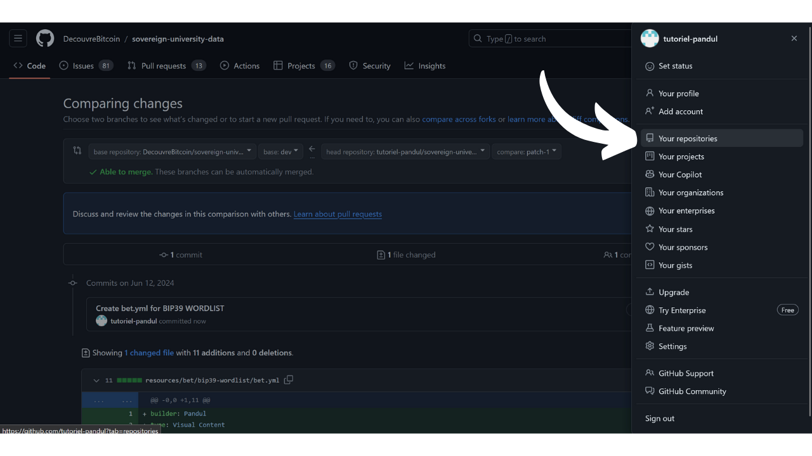
- Sélectionnez votre fork du dépôt de PlanB Network :

- Vous devriez voir apparaître sur le haut de la fenêtre une notification avec votre nouvelle branche. Elle s'appelle sûrement `patch-1`. Cliquez dessus :

- Vous êtes maintenant sur votre branche de travail (**vérifiez que vous êtes bien sur la même branche que vos modifications précédentes, c'est important !**) :
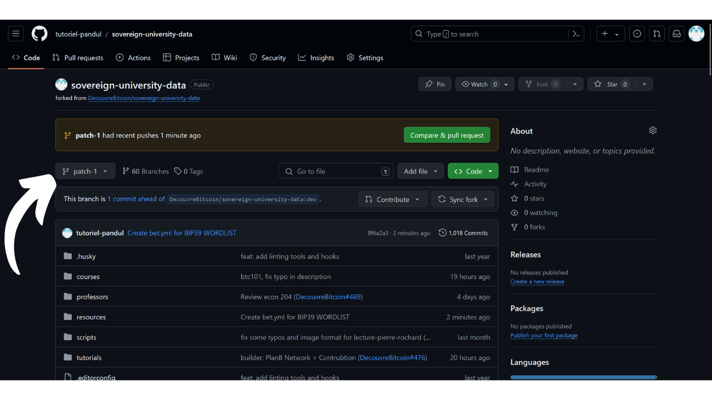
- Retournez dans le dossier `resources/bet/` et sélectionnez le dossier de votre contenu que vous venez de créer dans le commit précédent :

- Dans le dossier de votre contenu, cliquez sur le bouton `Add file`, puis sur `Create new file` :

- Nommez ce nouveau dossier `assets` et confirmez sa création en mettant un slash `/` à la fin :

- Dans ce dossier `assets`, créez un fichier nommé `.gitkeep` :
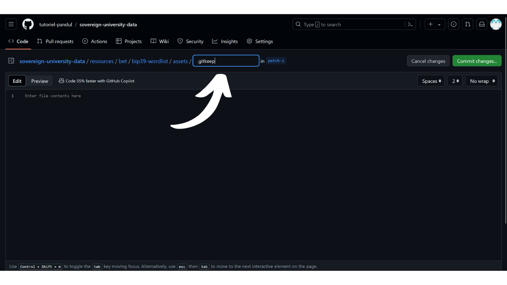
- Cliquez sur le bouton `Commit changes...` :

- Laissez le titre du commit par défaut, et vérifiez bien que la case `Commit directly to the patch-1 branch` est cochée, puis cliquez sur `Commit changes` :
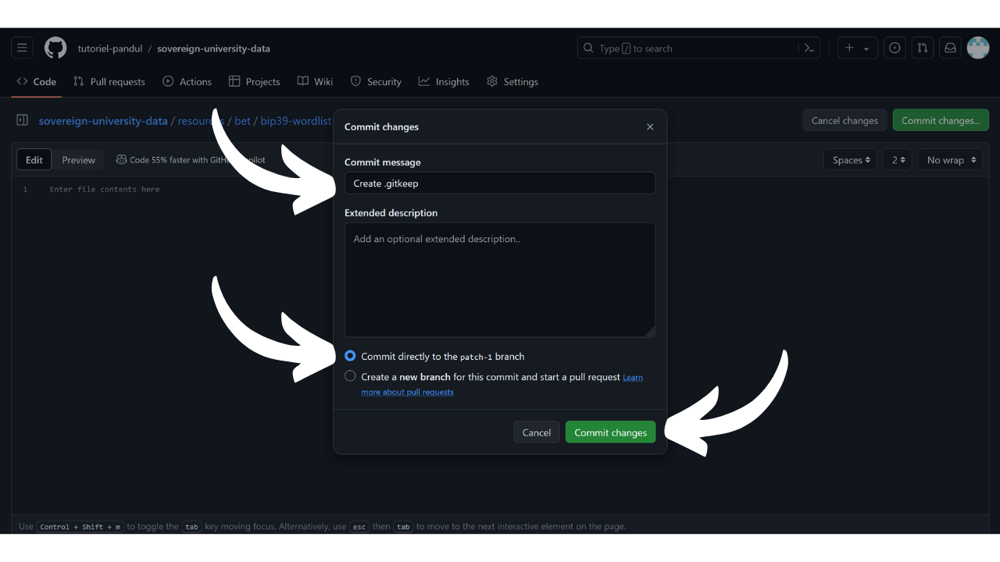
- Retournez dans le dossier `assets` :
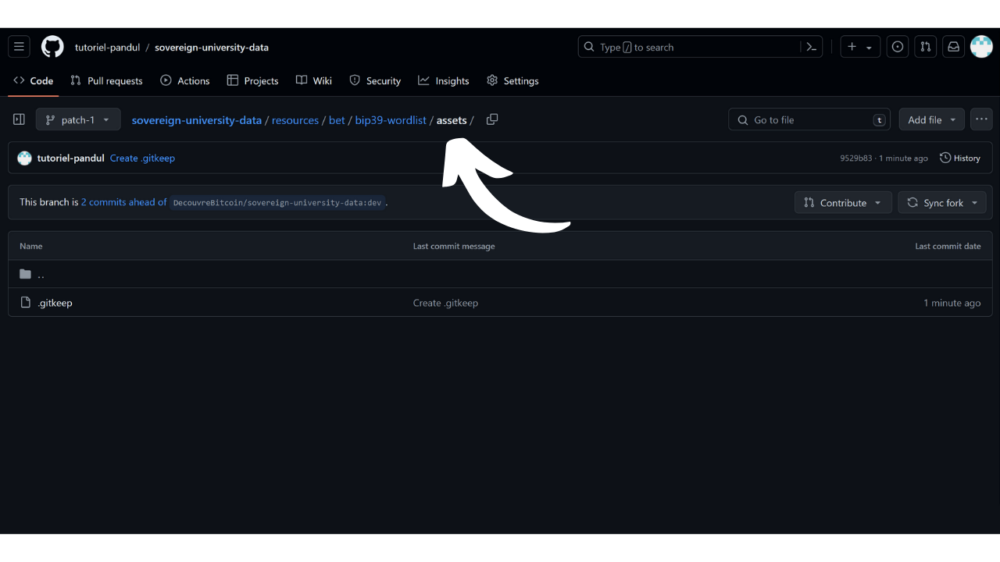
- Cliquez sur le bouton `Add file`, puis sur `Upload files` :
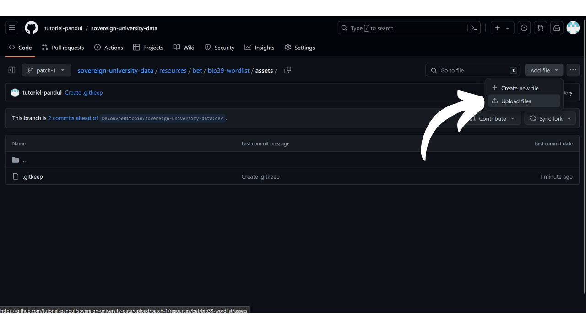
- Une nouvelle page va s'ouvrir. Glissez et déposez dans la zone une miniature qui représente votre contenu. C'est cette image qui sera affichée sur le site de PlanB Network :
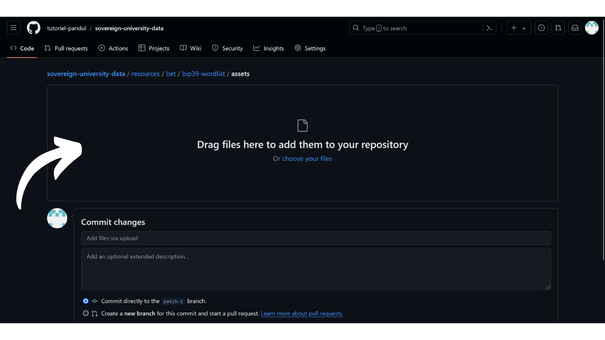
- Ça peut être un aperçu, un logo ou une icône :
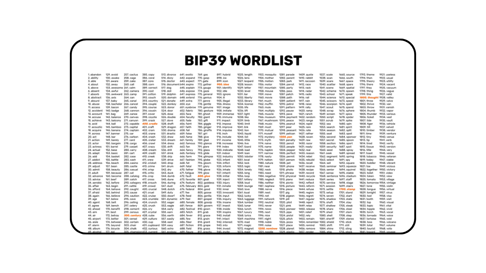
- Une fois l'image chargée, vérifiez que la case `Commit directly to the patch-1 branch` est cochée, puis cliquez sur `Commit changes` :

- Attention, votre image doit s'appeler `logo` et doit être au format `.webp`. Le nom complet du fichier devrait donc être : `logo.webp` :
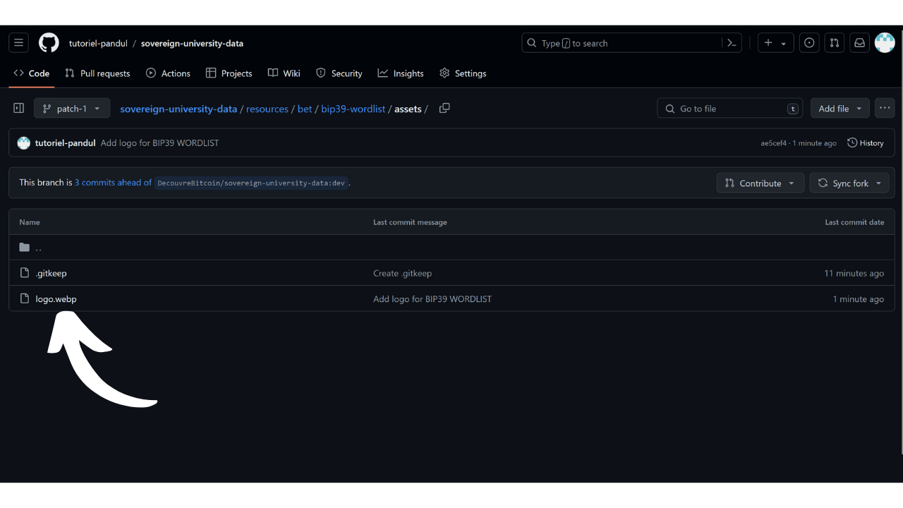
- Retournez dans votre dossier `assets` et cliquez sur le fichier intermédiaire `.gitkeep` :

- Une fois sur le fichier, cliquez sur les 3 petits points en haut à droite puis sur `Delete file` :

- Vérifiez que vous êtes toujours sur la même branche de travail, puis cliquez sur le bouton `Commit changes` :
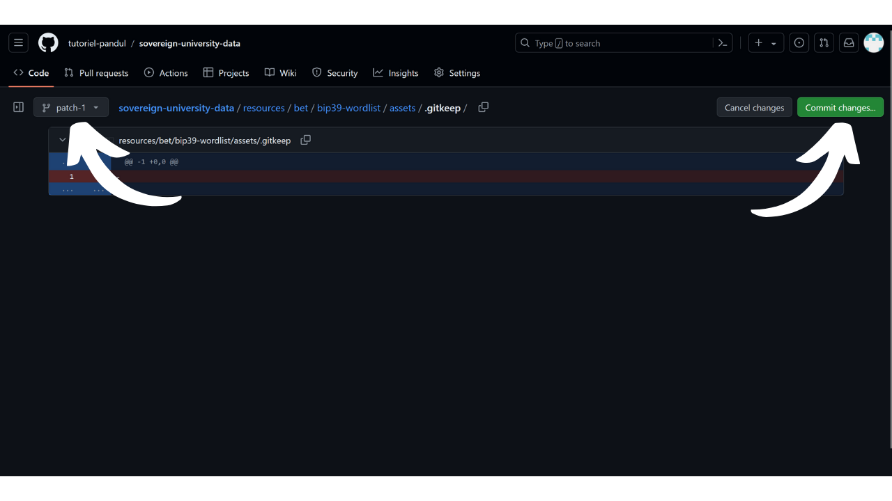
- Ajoutez un titre et une description à votre commit, puis cliquez sur `Commit changes` :

- Retournez dans le dossier de votre contenu :
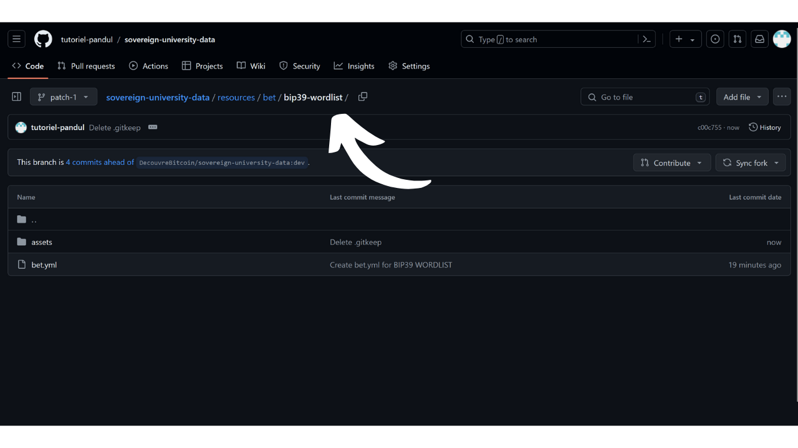
- Cliquez sur le bouton `Add file`, puis sur `Create new file` :
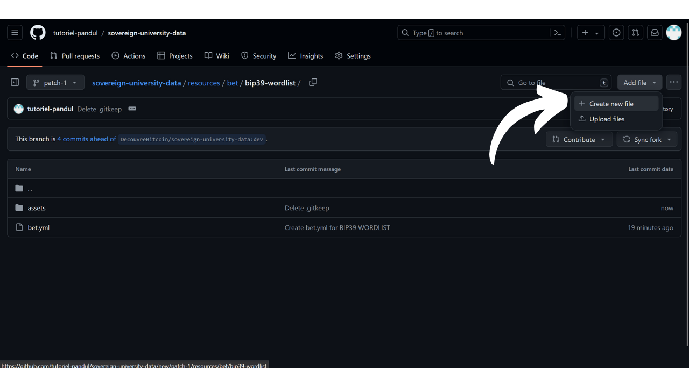
- Créez un nouveau fichier YAML en le nommant avec l'indicateur de votre langue natale. Ce fichier va être utilisé pour la description du contenu. Par exemple, si je veux rédiger ma description en anglais, je vais nommer ce fichier `en.yml` :
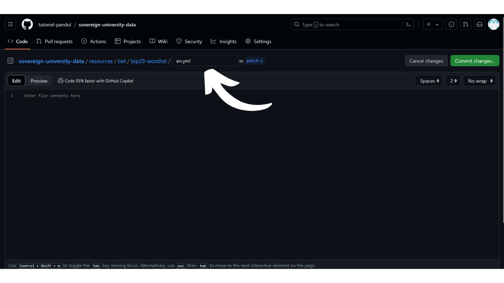
- Remplissez ce fichier YAML à l'aide de ce modèle :

```yaml
name: 
description: |
  
```

- Pour la clé `name`, vous pouvez ajouter le nom de votre contenu ;
- Pour la clé `description`, vous devez simplement ajouter un court paragraphe qui décrit votre contenu. La description doit être dans la même langue que le nom du fichier. Vous n'avez pas besoin de traduire cette description dans toutes les langues prises en charge sur le site, car les équipes de PlanB le feront avec leur modèle. 

Par exemple, voici à quoi pourrait ressembler votre fichier :

```yaml
name: BIP39 WORDLIST
description: |
  Complete and numbered list of the 2048 English words from the BIP39 dictionary used to encode mnemonic phrases. The document can be printed on a single page.
```

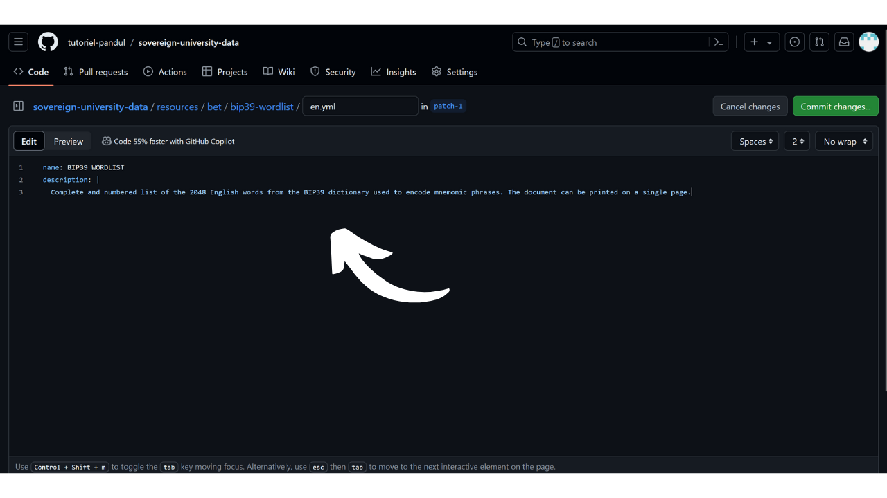
- Cliquez sur le bouton `Commit changes...` :
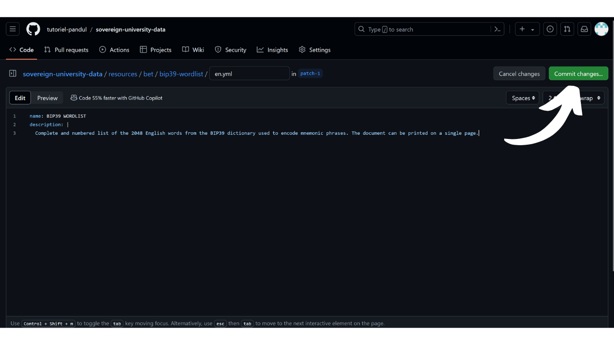
- Vérifiez que la case `Commit directly to the patch-1 branch` est cochée, ajoutez un titre, puis cliquez sur `Commit changes` :
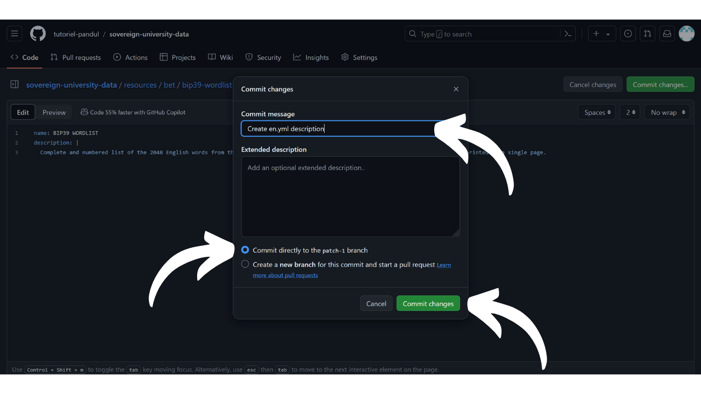
- Le dossier de votre contenu devrait dorénavant ressembler à celui-ci :


---

*Si vous préférez ne pas ajouter le contenu sur GitHub et que vous avez déjà noté les liens dans le fichier `bet.yml` durant les étapes précédentes , vous pouvez passer cette section et aller directement à la partie concernant la création de la Pull Request.*

- Retournez dans le dossier `/assets` :

- Cliquez sur le bouton `Add file`, puis sur `Upload files` :

- Une nouvelle page va s'ouvrir. Glissez et déposez dans la zone le contenu que vous souhaitez partager :
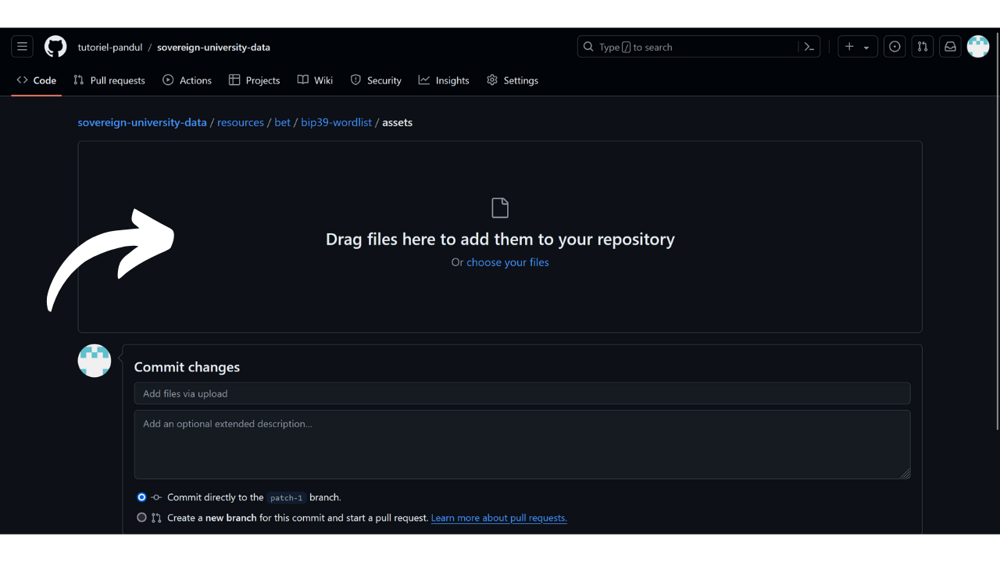
- Par exemple, j'ai ajouté le fichier PDF de la liste BIP39 :

- Une fois le contenu chargé, vérifiez que la case `Commit directly to the patch-1 branch` est cochée, puis cliquez sur `Commit changes` :

- Retournez dans votre dossier `/assets` et cliquez sur le fichier que vous venez de charger :
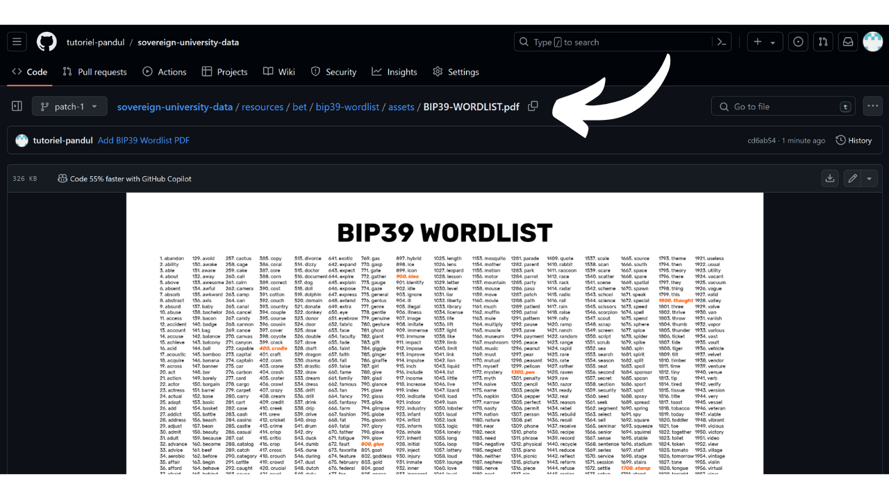
- Récupérez l'URL intermédiaire de votre fichier. Par exemple, dans mon cas, l'URL est :

```url
https://github.com/tutoriel-pandul/sovereign-university-data/blob/patch-1/resources/bet/bip39-wordlist/assets/BIP39-WORDLIST.pdf
```

- Conservez uniquement la dernière partie de l'URL à partir de `/ressources` :

```url
/resources/bet/bip39-wordlist/assets/BIP39-WORDLIST.pdf
```

- Ajoutez à la base de l'URL les informations suivantes pour avoir le bon lien :

```url
https://github.com/PlanB-Network/bitcoin-educational-content/blob/dev/resources/bet/bip39-wordlist/assets/BIP39-WORDLIST.pdf
```

Ce que l'on fait ici, c'est que l'on anticipe le futur lien vers votre fichier, une fois que votre proposition sera fusionnée sur le dépôt source de PlanB Network.

- Retournez sur votre fichier `bet.yml` et cliquez sur l'icône du crayon :
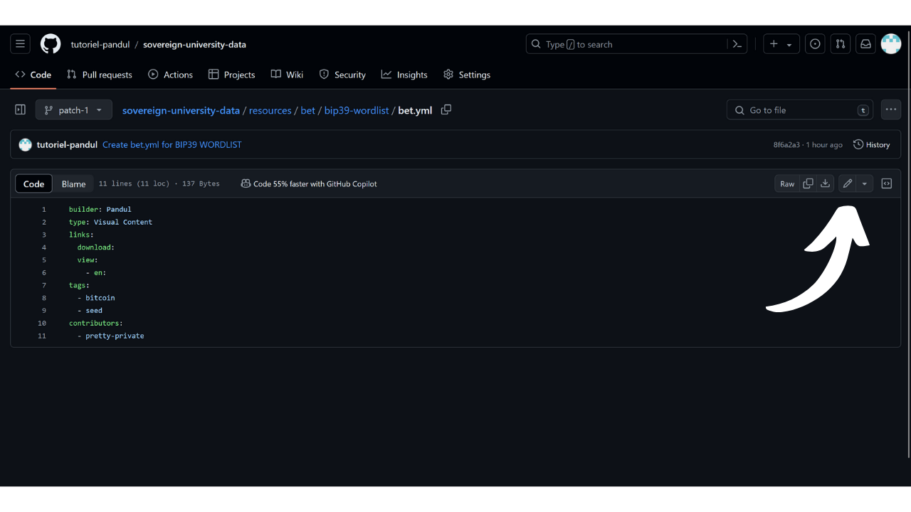
- Ajoutez-y votre lien :
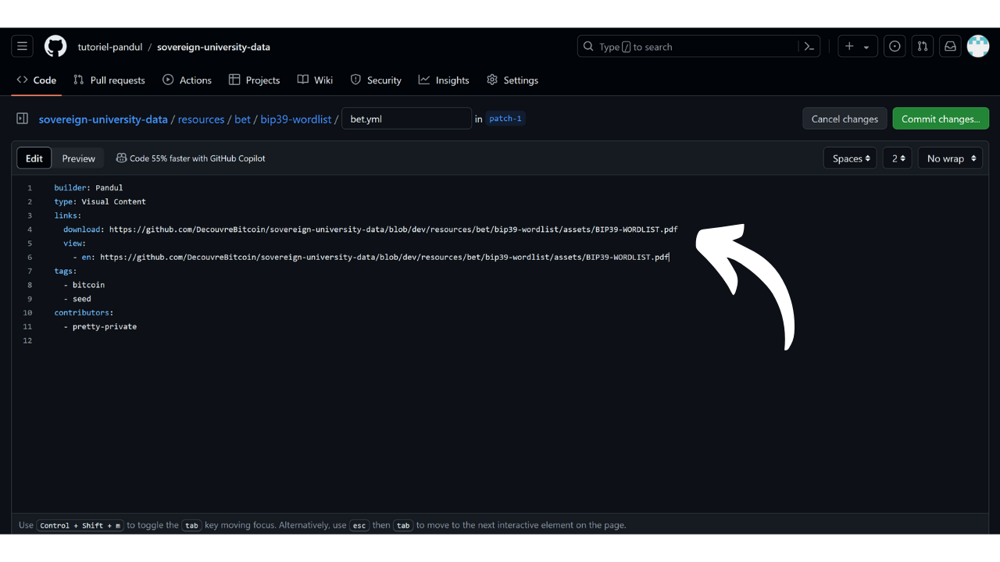
- Une fois vos modifications terminées, cliquez sur le bouton `Commit changes...` :
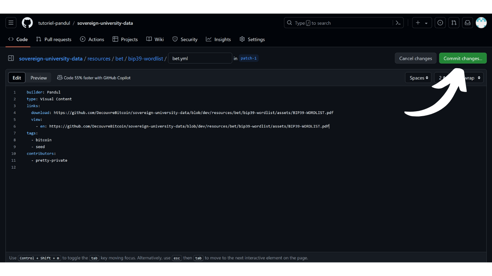
- Ajoutez un titre pour vos modifications, ainsi qu'une courte description :

- Cliquez sur le bouton vert `Commit changes` :
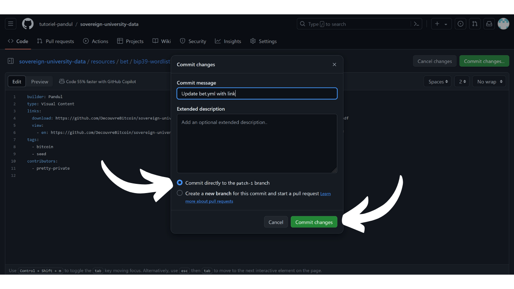

---

- Si tout vous convient, revenez à la racine de votre fork :

- Vous devriez voir apparaître un message vous indiquant que votre branche a subi des modifications. Cliquez sur le bouton `Compare & pull request` :

- Ajoutez un titre clair et une description sur votre PR :

- Cliquez sur le bouton `Create pull request` :

Félicitations ! Votre PR a bien été créée. Un administrateur va maintenant la vérifier et, si tout est conforme, l'intégrer au dépôt principal de PlanB Network. Vous devriez voir votre BET apparaître sur le site web quelques jours plus tard.

Pensez bien à suivre le progrès de votre PR. Il est possible qu'un administrateur y laisse un commentaire pour demander des informations supplémentaires. Tant que votre PR n'est pas validée, vous pouvez la consulter dans l'onglet Pull requests sur le dépôt GitHub de PlanB Network :

Merci beaucoup pour votre précieuse contribution ! :)