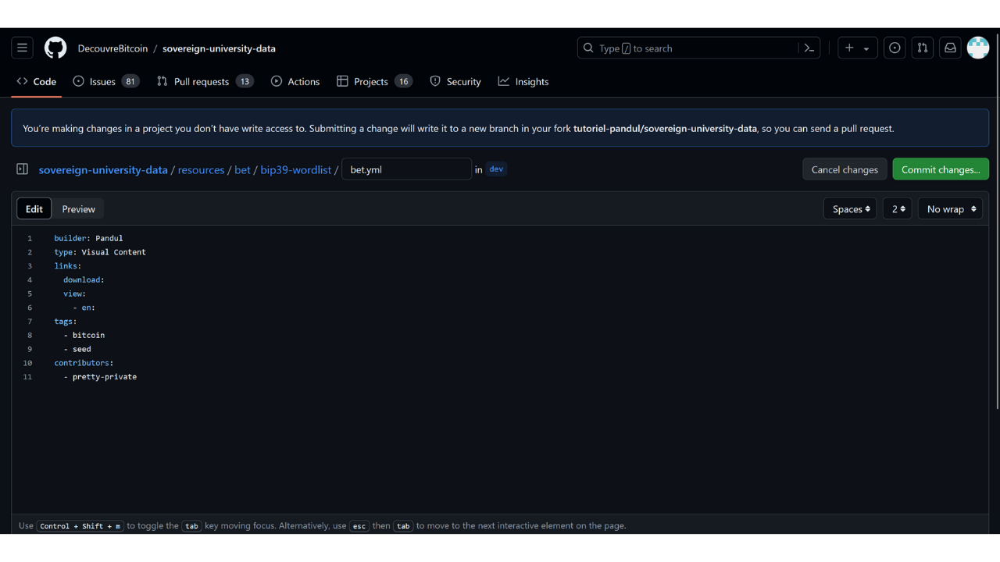
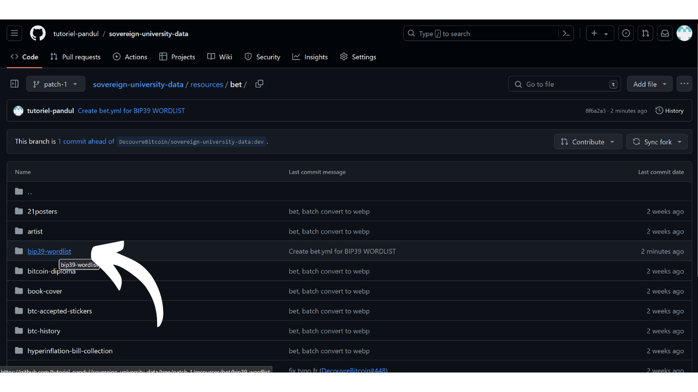
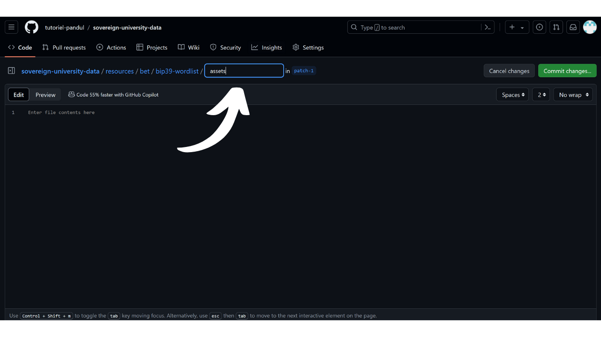

A missão da PlanB é fornecer recursos educacionais líderes sobre Bitcoin, em tantos idiomas quanto possível. Todo o conteúdo publicado no site é de código aberto e hospedado no GitHub, o que permite a qualquer pessoa participar do enriquecimento da plataforma.

Além de tutoriais e treinamentos, a Rede PlanB também oferece uma vasta biblioteca de conteúdo educacional variado sobre Bitcoin, acessível a todos, [na seção "BET" (_Bitcoin Educational Toolkit_)](https://planb.network/resources/bet). Esta base de dados inclui pôsteres educacionais, memes, pôsteres de propaganda humorística, diagramas técnicos, logotipos e outras ferramentas para os usuários. O objetivo desta iniciativa é apoiar indivíduos e comunidades que ensinam Bitcoin ao redor do mundo, fornecendo-lhes os recursos visuais necessários.

Você quer participar do enriquecimento desta base de dados, mas não sabe como? Este tutorial é para você!

*É imperativo que todo o conteúdo integrado ao site seja livre de direitos ou respeite a licença do arquivo fonte. Além disso, todos os visuais publicados na Rede PlanB estão disponíveis sob a licença [CC-BY-SA](https://creativecommons.org/licenses/by-sa/4.0/).*

- Primeiro, você precisa ter uma conta no GitHub. Se você não sabe como criar uma conta, fizemos [um tutorial detalhado para guiá-lo](https://planb.network/tutorials/others/create-github-account).
- Vá para [o repositório GitHub da PlanB dedicado a dados](https://github.com/PlanB-Network/bitcoin-educational-content/tree/dev/resources/bet) na seção `resources/bet/`:

- Clique no topo direito no botão `Add file`, depois em `Create new file`:

- Se você nunca contribuiu para os conteúdos da Rede PlanB antes, precisará criar seu fork do repositório original. Fazer um fork de um repositório significa criar uma cópia desse repositório em sua própria conta do GitHub, o que permite trabalhar no projeto sem afetar o repositório original. Clique no botão `Fork this repository`:

- Você então chegará à página de edição do GitHub:

- Crie uma pasta para o seu conteúdo. Para fazer isso, na caixa `Name your file...`, escreva o nome do seu conteúdo em letras minúsculas com hífens no lugar de espaços. No meu exemplo, digamos que eu queira adicionar um visual em PDF da lista de 2048 palavras BIP39. Então, vou chamar minha pasta de `bip39-wordlist`: 
- Para confirmar a criação da pasta, simplesmente adicione uma barra após o nome na mesma caixa, por exemplo: `bip39-wordlist/`. Adicionar uma barra cria automaticamente uma pasta em vez de um arquivo:

- Nesta pasta, você criará um primeiro arquivo YAML chamado `bet.yml`:

- Preencha este arquivo com informações relacionadas ao seu conteúdo usando este modelo:

```yaml
builder: 
type: 
links:
  download: 
  view: 
    - en: 
tags:
  - 
  - 
contributors:
  - 
```
```yaml
builder: Indique o identificador da sua organização na Rede PlanB. Se você ainda não possui um identificador "builder" para sua empresa, você pode criar um [seguindo este tutorial](https://planb.network/tutorials/others/add-builder). Se você não possui um, pode simplesmente usar seu nome, seu pseudônimo ou o nome da sua empresa sem ter criado um perfil de construtor.
type: Selecione a natureza do seu conteúdo entre as seguintes duas opções:
  - `Educational Content` para conteúdos educacionais.
  - `Visual Content` para outros tipos de conteúdos diversos.

links: Forneça links para seus conteúdos. Você tem duas opções:
  - Se você escolher hospedar seu conteúdo diretamente no GitHub da PlanB, precisará adicionar os links para este arquivo durante as etapas seguintes.
  - Se seus conteúdos estão hospedados em outro lugar, como no seu site pessoal, indique os links correspondentes aqui:
      - `download`: Um link para baixar seu conteúdo.
      - `view`: Um link para visualizar seu conteúdo (pode ser o mesmo que o link de download). Se seu conteúdo está disponível em múltiplos idiomas, adicione um link para cada idioma.

tags: Adicione duas tags associadas ao seu conteúdo. Exemplos:
  - bitcoin
  - tecnologia
  - economia
  - educação
  - meme...

contributors: Mencione seu identificador de contribuidor se você tiver um.

Por exemplo, seu arquivo YAML poderia parecer assim:

```yaml
builder: DecouvreBitcoin
type: Educational Content
links:
  download: https://workspace.planb.network/s/fojeJa7ZbftQTwo
  view:
- No meu exemplo, deixarei os links vazios por enquanto, pois adicionarei meu PDF diretamente no GitHub:

- Uma vez que suas modificações neste arquivo estejam completas, salve-as clicando no botão `Commit changes...`:

- Adicione um título para suas modificações, bem como uma breve description:

- Clique no botão verde `Propose changes`:

- Você então chegará em uma página que resume todas as suas mudanças:

- Clique na foto do seu perfil do GitHub no canto superior direito, depois em `Your Repositories`:

- Selecione seu fork do repositório da Rede PlanB:

- Você deverá ver uma notificação no topo da janela com seu novo branch. Provavelmente se chama `patch-1`. Clique nele:

- Você está agora no seu branch de trabalho (**certifique-se de que está no mesmo branch que suas modificações anteriores, isso é importante!**):

- Volte para a pasta `resources/bet/` e selecione a pasta do seu conteúdo que você acabou de criar no commit anterior:

- Na pasta do seu conteúdo, clique no botão `Add file`, depois em `Create new file`:

- Nomeie esta nova pasta `assets` e confirme sua criação colocando uma barra `/` no final:

- Nesta pasta `assets`, crie um arquivo chamado `.gitkeep`: 
```
- Clique no botão `Commit changes...`: - Deixe o título do commit como padrão e certifique-se de que a caixa `Commit directly to the patch-1 branch` esteja marcada, então clique em `Commit changes`: 
- Retorne à pasta `assets`: 
- Clique no botão `Add file`, depois em `Upload files`: 
- Uma nova página será aberta. Arraste e solte uma miniatura que represente seu conteúdo na área. Esta imagem será exibida no site da Rede PlanB: 
- Pode ser uma pré-visualização, um logo ou um ícone: 
- Uma vez que a imagem esteja carregada, certifique-se de que a caixa `Commit directly to the patch-1 branch` esteja marcada, então clique em `Commit changes`: 
- Tenha cuidado, sua imagem deve ser nomeada `logo` e deve estar no formato `.webp`. O nome completo do arquivo deve ser, portanto: `logo.webp`: 
- Retorne à sua pasta `assets` e clique no arquivo intermediário `.gitkeep`: 
- Uma vez no arquivo, clique nos três pequenos pontos no canto superior direito e depois em `Delete file`: 
- Certifique-se de que você ainda está na mesma branch de trabalho, então clique no botão `Commit changes`: 
- Adicione um título e uma descrição ao seu commit, então clique em `Commit changes`: 
- Retorne à pasta do seu conteúdo: 
- Clique no botão `Add file`, depois em `Create new file`: 
- Crie um novo arquivo YAML nomeando-o com o indicador do seu idioma nativo. Este arquivo será usado para a descrição do conteúdo. Por exemplo, se eu quiser escrever minha descrição em inglês, nomearei este arquivo como `en.yml`: 
- Preencha este arquivo YAML usando este modelo:

```yaml
name: 
description: |
  
```

- Para a chave `name`, você pode adicionar o nome do seu conteúdo;
- Para a chave `description`, você simplesmente precisa adicionar um curto parágrafo que descreva seu conteúdo. A descrição deve estar no mesmo idioma que o nome do arquivo. Você não precisa traduzir esta descrição para todos os idiomas suportados no site, pois as equipes da PlanB farão isso com seu modelo.
Por exemplo, aqui está como seu arquivo pode parecer:

```yaml
name: BIP39 WORDLIST
description: |
  Lista completa e numerada das 2048 palavras em inglês do dicionário BIP39 usadas para codificar frases mnemônicas. O documento pode ser impresso em uma única página.
```


- Clique no botão `Commit changes...`:

- Certifique-se de que a caixa `Commit directly to the patch-1 branch` esteja marcada, adicione um título, então clique em `Commit changes`:

- Sua pasta de conteúdo agora deve ter esta aparência:

*Se você prefere não adicionar o conteúdo no GitHub e já anotou os links no arquivo `bet.yml` durante as etapas anteriores, você pode pular esta seção e ir diretamente para a parte referente à criação do Pull Request.*
- Retorne à pasta `/assets`:

- Clique no botão `Add file`, depois em `Upload files`:

- Uma nova página será aberta. Arraste e solte na área o conteúdo que deseja compartilhar:

- Por exemplo, eu adicionei o arquivo PDF da lista BIP39:

- Uma vez que o conteúdo esteja carregado, certifique-se de que a caixa `Commit directly to the patch-1 branch` esteja marcada, então clique em `Commit changes`:

- Retorne à sua pasta `/assets` e clique no arquivo que acabou de carregar:

- Recupere a URL intermediária do seu arquivo. Por exemplo, no meu caso, a URL é:

```url
https://github.com/tutorial-pandul/sovereign-university-data/blob/patch-1/resources/bet/bip39-wordlist/assets/BIP39-WORDLIST.pdf
```

- Mantenha apenas a última parte da URL a partir de `/resources` em diante:

```url
/resources/bet/bip39-wordlist/assets/BIP39-WORDLIST.pdf
```

- Adicione à base da URL as seguintes informações para ter o link correto:

```url
https://github.com/DiscoverBitcoin/sovereign-university-data/blob/dev/resources/bet/bip39-wordlist/assets/BIP39-WORDLIST.pdf
```

O que estamos fazendo aqui é antecipar o futuro link para o seu arquivo, uma vez que sua proposta tenha sido mesclada ao repositório fonte da Rede PlanB.
- Volte ao seu arquivo `bet.yml` e clique no ícone de lápis: 
- Adicione seu link lá:

- Uma vez que suas alterações estejam completas, clique no botão `Commit changes...`:

- Adicione um título para suas mudanças, bem como uma breve description:

- Clique no botão verde `Commit changes`:


---

- Se tudo parece bom para você, retorne à raiz do seu fork:

- Você deverá ver uma mensagem indicando que sua branch foi modificada. Clique no botão `Compare & pull request`:

- Adicione um título claro e uma descrição para o seu PR:

- Clique no botão `Create pull request`:

Parabéns! Seu PR foi criado com sucesso. Um administrador agora irá revisá-lo e, se tudo estiver em ordem, mesclá-lo ao repositório principal da Rede PlanB. Você deverá ver seu BET aparecer no site alguns dias depois.

Certifique-se de acompanhar o progresso do seu PR. Um administrador pode deixar um comentário pedindo informações adicionais. Enquanto seu PR não for validado, você pode consultá-lo na aba Pull requests no repositório GitHub da Rede PlanB:

Muito obrigado pela sua valiosa contribuição! :)