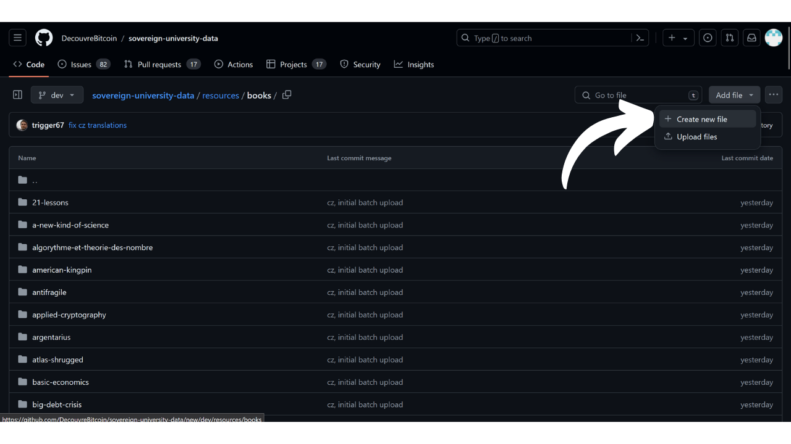
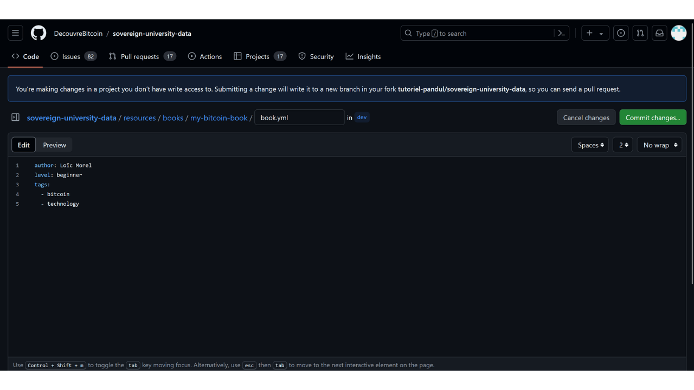
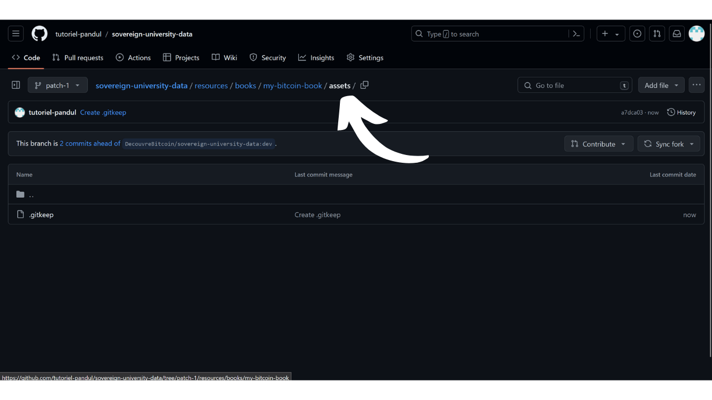

PlanB's mission is to provide top-tier educational resources on Bitcoin in as many languages as possible. All content published on the site is open-source and hosted on GitHub, allowing anyone to contribute to the enrichment of the platform.

**Do you want to add a book related to Bitcoin on the PlanB Network site and increase the visibility of your work, but don't know how? This tutorial is for you!**

- First, you need to have a GitHub account. If you don't know how to create an account, we have made [a detailed tutorial to guide you](https://planb.network/tutorials/others/create-github-account).
- Go to [the GitHub repository of PlanB dedicated to data](https://github.com/PlanB-Network/bitcoin-educational-content/tree/dev/resources/books) in the `resources/books/` section:

- Click on the top right on the `Add file` button, then on `Create new file`:

- If you have never contributed to the contents of PlanB Network before, you will need to create your fork of the original repository. Forking a repository means creating a copy of that repository on your own GitHub account, allowing you to work on the project without affecting the original repository. Click on the `Fork this repository` button:

- You will then arrive at the GitHub editing page:

- Create a folder for your book. To do this, in the `Name your file...` box, write the name of your book in lowercase with dashes instead of spaces. For example, if your book is called "*My Bitcoin Book*", you should note `my-bitcoin-book`:

- To validate the creation of the folder, simply add a slash after your book name in the same box, for example: `my-bitcoin-book/`. Adding a slash automatically creates a folder rather than a file:

- In this folder, you will create a first YAML file named `book.yml`:

- Fill this file with information about your book using this template:

```yaml
author: 
level: 
tags:
  - 
  - 
```

Here are the details to fill in for each field:
- **`author`**: Indicate the name of the book's author.
- **`level`**: Indicate the required level to be able to read and understand the book well. Choose a level among the following:
	- `beginner`
	- `intermediate`
- `advanced` - `expert`
- **`tags`**: Add two or three tags related to your book. For example:
    - `bitcoin`
    - `history`
    - `technology`
    - `economy`
    - `education`...

For example, your YAML file could look like this:

```yaml
author: Loïc Morel
level: beginner
tags:
  - bitcoin
  - technology
```


- Once you have finished making changes to this file, save them by clicking on the `Commit changes...` button:

- Add a title for your changes, as well as a short description:

- Click on the green `Propose changes` button:

- You will then arrive at a page summarizing all your changes:

- Click on your GitHub profile picture at the top right, then on `Your Repositories`:

- Select your fork of the PlanB Network repository:

- You should see a notification at the top of the window with your new branch. It's probably called `patch-1`. Click on it:

- You are now on your working branch:

- Go back to the `resources/books/` folder and select the folder of your book that you just created in the previous commit:

- In the folder of your book, click on the `Add file` button, then on `Create new file`:

- Name this new folder `assets` and confirm its creation by putting a slash `/` at the end:

- In this `assets` folder, create a file named `.gitkeep`:

- Click on the `Commit changes...` button:

- Leave the commit title as default, and make sure the `Commit directly to the patch-1 branch` box is checked, then click on `Commit changes`:

- Return to the `assets` folder:

- Click on the `Add file` button, then on `Upload files`:

- A new page will open. Drag and drop the cover image of your book into the area. This image will be displayed on the PlanB Network site:

- Be careful, the image must be in the format of a book, to best adapt to our website, like for example:

- Once the image is uploaded, make sure the `Commit directly to the patch-1 branch` box is checked, then click on `Commit changes`:
- Please note, your image must be named `cover_en` if the cover is in English and must be in `.webp` format. Therefore, the complete file name should be `cover_en.webp`, `cover_fr.webp`, `cover_it.webp`, etc. If you wish to use a different cover image for each language, for example in the case of a book translation, you can place them in the same location in the `assets` folder:

- Go back to your `assets` folder and click on the `.gitkeep` intermediary file:

- Once on the file, click on the 3 small dots at the top right and then on `Delete file`:

- Ensure you are still on the same working branch, then click on the `Commit changes...` button:

- Add a title and description to your commit, then click on `Commit changes`:

- Return to your book's folder:

- Click on the `Add file` button, then on `Create new file`:

- Create a new YAML file by naming it with the language indicator of the book. This file will be used for the book's description. For example, if I want to write my description in English, I will name this file `en.yml`:

- Fill out this YAML file using this template:
```yaml
title: ""
publication_year: 
cover: cover_en.webp
original: true
description: |

contributors:
  - 
```

Here are the details to fill in for each field:
- **`title`**: Indicate the name of the book in quotes.
- **`publication_year`**: Indicate the year the book was published.
- **`cover`**: Indicate the name of the file corresponding to the cover image, in accordance with the language of the YAML file you are currently editing. For example, if you are editing the `en.yml` file and you have previously added the English cover image titled `cover_en.webp`, simply indicate `cover_en.webp` in this field.
- **`description`**: Add a short paragraph that describes the book. The description must be in the same language as indicated in the title of the YAML file.
- **`contributors`**: Add your contributor ID if you have one.

For example, your YAML file could look like this:

```yaml
title: "My Bitcoin Book"
publication_year: 2021
cover: cover_en.webp
original: true
description: |
Discover the groundbreaking world of Bitcoin with this comprehensive guide tailored for beginners. My Bitcoin Book demystifies the complexities of Bitcoin, providing a clear and concise introduction to how the protocol works. From its revolutionary technology to its potential impact on the global economy, this book offers invaluable insights and practical knowledge. Perfect for those new to Bitcoin, it covers the basics, security tips, and the future of digital finance. Dive into the future of money and empower yourself with the knowledge to navigate the digital age confidently.

contributors:
  - pretty-private


- Click on the `Commit changes...` button:

- Ensure the `Commit directly to the patch-1 branch` box is checked, add a title, then click on `Commit changes`:

- The book folder should now look like this:

- If everything looks good to you, return to the root of your fork:

- You should see a message indicating that your branch has been modified. Click on the `Compare & pull request` button:

- Add a clear title and a description to your PR:

- Click on the `Create pull request` button:

Congratulations! Your PR has been successfully created. An administrator will now review it and, if everything is in order, merge it into the main repository of the PlanB Network. You should see your book appear on the website a few days later.

Be sure to follow the progress of your PR. An administrator may leave a comment asking for additional information. As long as your PR is not validated, you can view it in the `Pull requests` tab on the PlanB Network's GitHub repository:

Thank you very much for your valuable contribution! :)