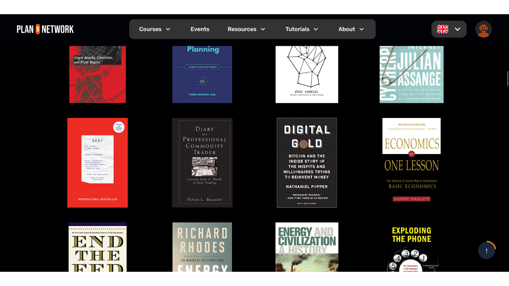
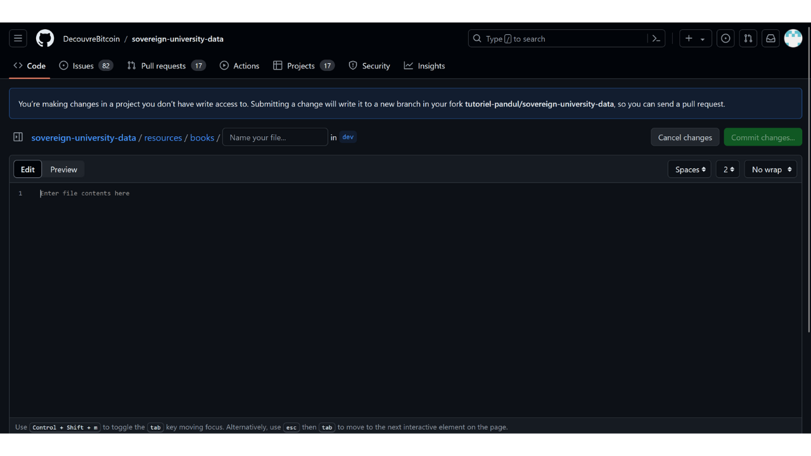
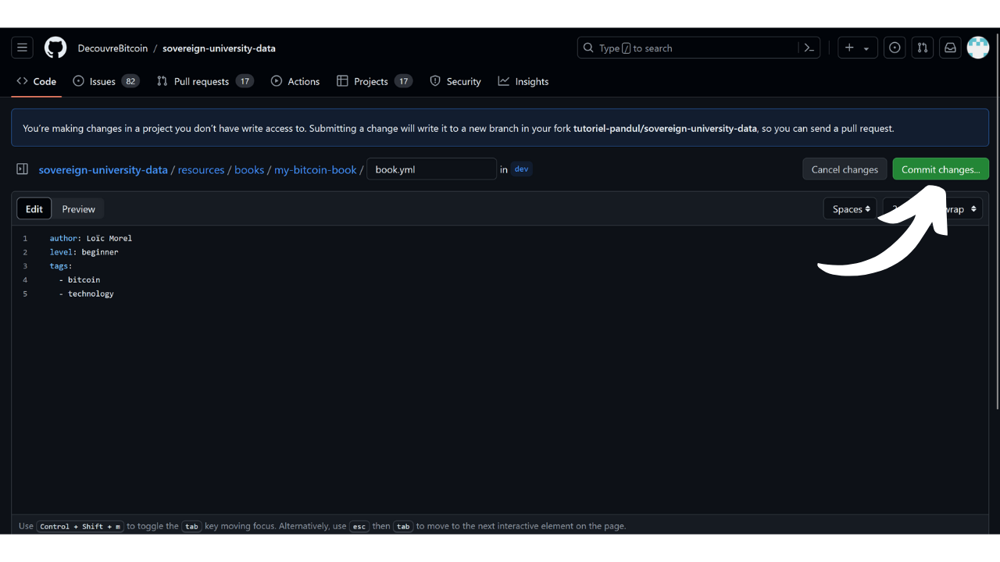
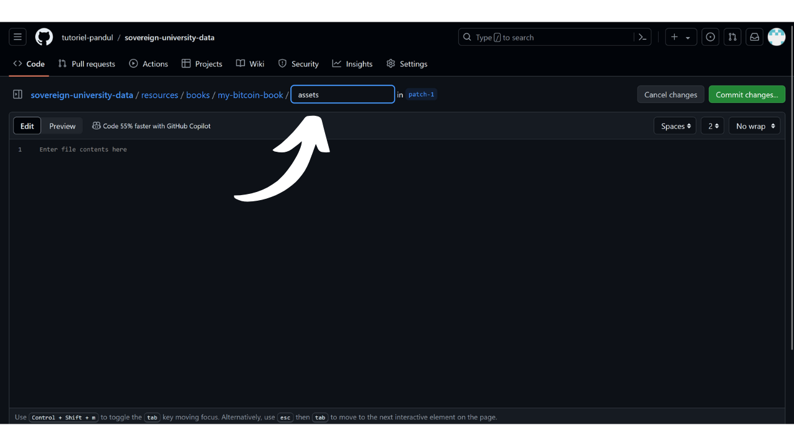
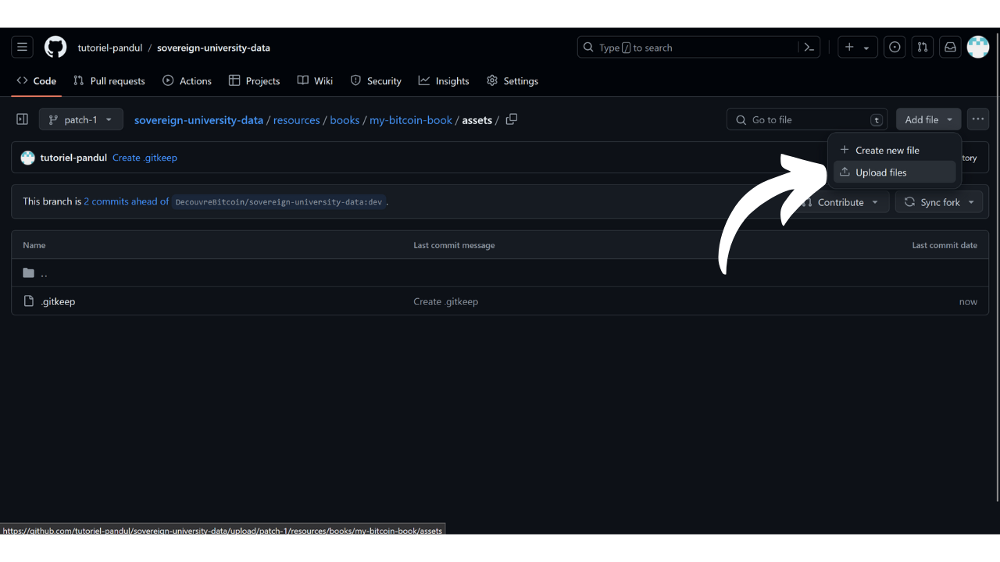

La misión de PlanB es proporcionar recursos educativos de primera categoría sobre Bitcoin en tantos idiomas como sea posible. Todo el contenido publicado en el sitio es de código abierto y alojado en GitHub, lo que permite a cualquier persona contribuir al enriquecimiento de la plataforma.

**¿Quieres añadir un libro relacionado con Bitcoin en el sitio de la Red PlanB y aumentar la visibilidad de tu trabajo, pero no sabes cómo? ¡Este tutorial es para ti!**

- Primero, necesitas tener una cuenta de GitHub. Si no sabes cómo crear una cuenta, hemos hecho [un tutorial detallado para guiarte](https://planb.network/tutorials/others/create-github-account).
- Ve a [el repositorio de GitHub de PlanB dedicado a datos](https://github.com/PlanB-Network/bitcoin-educational-content/tree/dev/resources/books) en la sección `resources/books/`:

- Haz clic en la parte superior derecha en el botón `Add file`, luego en `Create new file`:

- Si nunca has contribuido al contenido de la Red PlanB antes, necesitarás crear tu fork del repositorio original. Hacer un fork de un repositorio significa crear una copia de ese repositorio en tu propia cuenta de GitHub, lo que te permite trabajar en el proyecto sin afectar el repositorio original. Haz clic en el botón `Fork this repository`:

- Luego llegarás a la página de edición de GitHub:

- Crea una carpeta para tu libro. Para hacerlo, en el cuadro `Name your file...`, escribe el nombre de tu libro en minúsculas con guiones en lugar de espacios. Por ejemplo, si tu libro se llama "*Mi Libro de Bitcoin*", deberías anotar `mi-libro-de-bitcoin`:

- Para validar la creación de la carpeta, simplemente añade una barra inclinada después del nombre de tu libro en el mismo cuadro, por ejemplo: `mi-libro-de-bitcoin/`. Añadir una barra inclinada crea automáticamente una carpeta en lugar de un archivo:

- En esta carpeta, crearás un primer archivo YAML llamado `book.yml`:

- Llena este archivo con información sobre tu libro usando esta plantilla:

```yaml
author: 
level: 
tags:
  - 
  - 
```

Aquí están los detalles a completar para cada campo:
- **`author`**: Indica el nombre del autor del libro.
- **`level`**: Indica el nivel requerido para poder leer y entender bien el libro. Elige un nivel entre los siguientes:
	- `beginner`
	- `intermediate`
- `advanced` - `expert`
- **`tags`**: Añade dos o tres etiquetas relacionadas con tu libro. Por ejemplo:
    - `bitcoin`
    - `history`
    - `technology`
    - `economy`
    - `education`...

Por ejemplo, tu archivo YAML podría lucir así:

```yaml
author: Loïc Morel
level: beginner
tags:
  - bitcoin
  - technology
```


- Una vez que hayas terminado de hacer cambios en este archivo, guárdalos haciendo clic en el botón `Commit changes...`:

- Agrega un título para tus cambios, así como una breve description: 
- Haz clic en el botón verde `Propose changes`:

- Luego llegarás a una página que resume todos tus cambios:

- Haz clic en tu foto de perfil de GitHub en la parte superior derecha, luego en `Your Repositories`:

- Selecciona tu bifurcación del repositorio PlanB Network:

- Deberías ver una notificación en la parte superior de la ventana con tu nueva rama. Probablemente se llame `patch-1`. Haz clic en ella:

- Ahora estás en tu rama de trabajo:

- Regresa a la carpeta `resources/books/` y selecciona la carpeta de tu libro que acabas de crear en el commit anterior:

- En la carpeta de tu libro, haz clic en el botón `Add file`, luego en `Create new file`:

- Nombra esta nueva carpeta `assets` y confirma su creación colocando una barra `/` al final:

- En esta carpeta `assets`, crea un archivo llamado `.gitkeep`:

- Haz clic en el botón `Commit changes...`:

- Deja el título del commit como predeterminado, y asegúrate de que la casilla `Commit directly to the patch-1 branch` esté marcada, luego haz clic en `Commit changes`:

- Regresa a la carpeta `assets`:

- Haz clic en el botón `Add file`, luego en `Upload files`:

- Se abrirá una nueva página. Arrastra y suelta la imagen de portada de tu libro en el área. Esta imagen se mostrará en el sitio de PlanB Network:

- Ten cuidado, la imagen debe estar en formato de libro, para adaptarse mejor a nuestro sitio web, como por ejemplo:

- Una vez que la imagen esté cargada, asegúrate de que la casilla `Commit directly to the patch-1 branch` esté marcada, luego haz clic en `Commit changes`:
- Ten en cuenta que tu imagen debe llamarse `cover_en` si la portada está en inglés y debe estar en formato `.webp`. Por lo tanto, el nombre completo del archivo debería ser `cover_en.webp`, `cover_fr.webp`, `cover_it.webp`, etc. Si deseas usar una imagen de portada diferente para cada idioma, por ejemplo, en el caso de una traducción de libro, puedes colocarlas en la misma ubicación en la carpeta `assets`:

- Regresa a tu carpeta `assets` y haz clic en el archivo intermediario `.gitkeep`:

- Una vez en el archivo, haz clic en los 3 puntos pequeños en la parte superior derecha y luego en `Delete file`:

- Asegúrate de seguir en la misma rama de trabajo, luego haz clic en el botón `Commit changes...`:

- Agrega un título y descripción a tu commit, luego haz clic en `Commit changes`:

- Regresa a la carpeta de tu libro: 
- Haz clic en el botón `Add file`, luego en `Create new file`:

- Crea un nuevo archivo YAML nombrándolo con el indicador de idioma del libro. Este archivo se utilizará para la descripción del libro. Por ejemplo, si quiero escribir mi descripción en inglés, nombraré este archivo `en.yml`:

- Rellena este archivo YAML utilizando esta plantilla:
```yaml
title: ""
publication_year: 
cover: cover_en.webp
original: true
description: |

contributors:
  - 
```

Aquí están los detalles a completar para cada campo:
- **`title`**: Indica el nombre del libro entre comillas.
- **`publication_year`**: Indica el año en que se publicó el libro.
- **`cover`**: Indica el nombre del archivo correspondiente a la imagen de portada, de acuerdo con el idioma del archivo YAML que estás editando actualmente. Por ejemplo, si estás editando el archivo `en.yml` y previamente has añadido la imagen de portada en inglés titulada `cover_en.webp`, simplemente indica `cover_en.webp` en este campo.
- **`description`**: Añade un breve párrafo que describa el libro. La descripción debe estar en el mismo idioma que se indica en el título del archivo YAML.
- **`contributors`**: Añade tu ID de colaborador si tienes uno.

Por ejemplo, tu archivo YAML podría lucir así:

```yaml
title: "Mi Libro de Bitcoin"
publication_year: 2021
cover: cover_en.webp
original: true
description: |
Descubre el innovador mundo de Bitcoin con esta guía completa diseñada para principiantes. Mi Libro de Bitcoin desmitifica las complejidades de Bitcoin, proporcionando una introducción clara y concisa de cómo funciona el protocolo. Desde su tecnología revolucionaria hasta su posible impacto en la economía global, este libro ofrece perspectivas valiosas y conocimiento práctico. Perfecto para aquellos nuevos en Bitcoin, cubre los fundamentos, consejos de seguridad y el futuro de las finanzas digitales. Sumérgete en el futuro del dinero y empodérate con el conocimiento para navegar la era digital con confianza.

contributors:
  - pretty-private


- Haz clic en el botón `Commit changes...`:

- Asegúrate de que la casilla `Commit directly to the patch-1 branch` esté marcada, añade un título, luego haz clic en `Commit changes`:

- La carpeta del libro debería lucir así ahora:

- Si todo te parece correcto, regresa a la raíz de tu bifurcación:

- Deberías ver un mensaje indicando que tu rama ha sido modificada. Haz clic en el botón `Compare & pull request`:

- Añade un título claro y una descripción a tu PR:

- Haz clic en el botón `Create pull request`:

¡Felicidades! Tu PR ha sido creado exitosamente. Un administrador lo revisará ahora y, si todo está en orden, lo fusionará en el repositorio principal de la Red PlanB. Deberías ver tu libro aparecer en el sitio web unos días después.

Asegúrate de seguir el progreso de tu PR. Un administrador puede dejar un comentario solicitando información adicional. Mientras tu PR no esté validado, puedes verlo en la pestaña `Pull requests` en el repositorio de GitHub de la Red PlanB.
 ¡Muchas gracias por tu valiosa contribución! :)