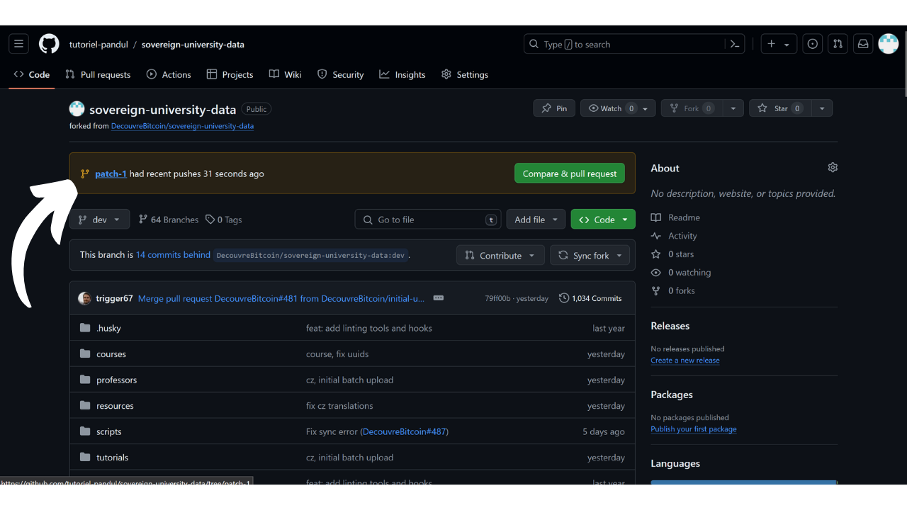
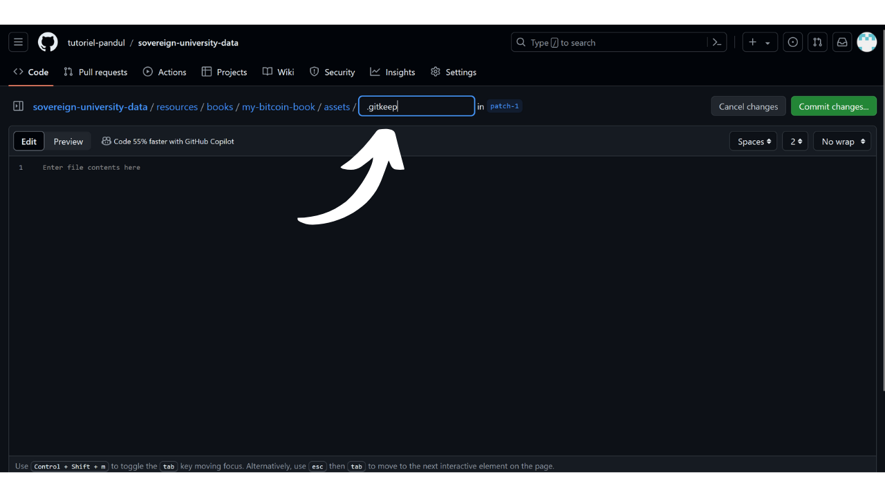
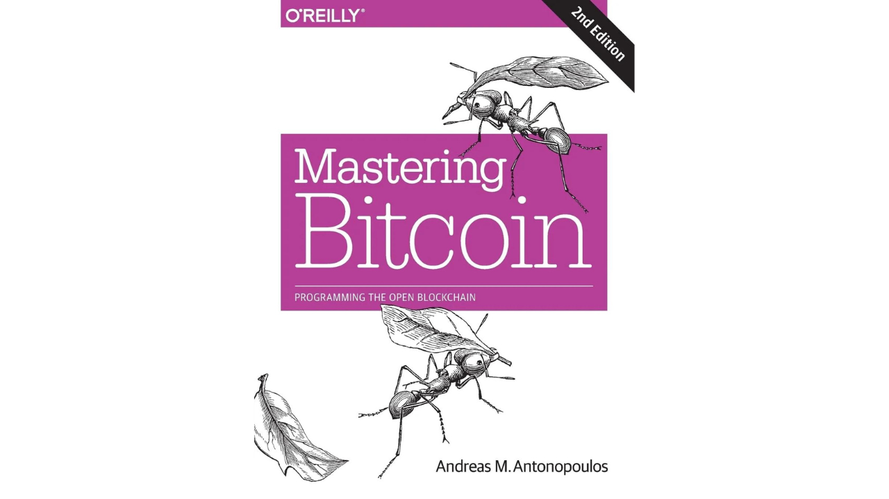
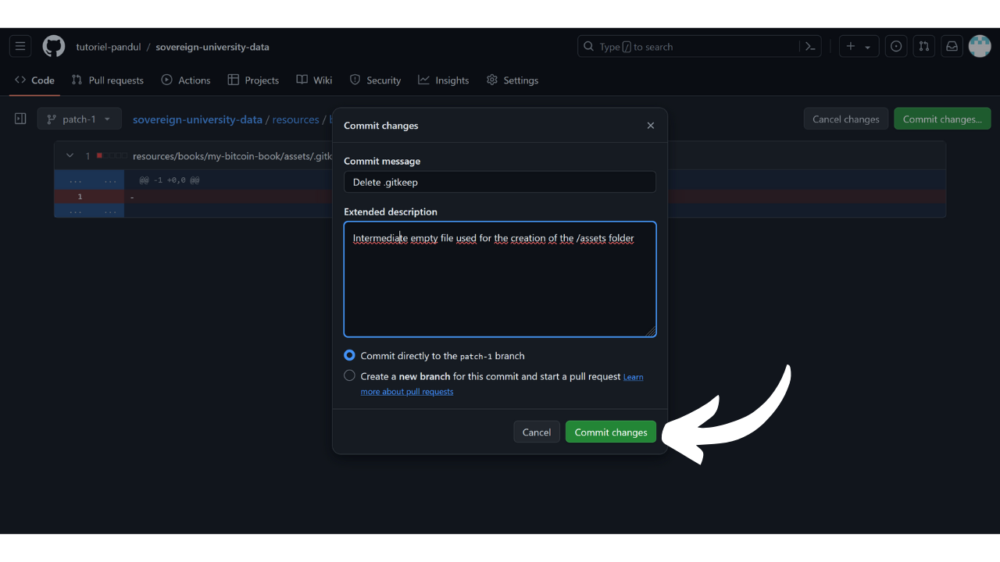

A missão da PlanB é fornecer recursos educacionais de primeira linha sobre Bitcoin em tantos idiomas quanto possível. Todo o conteúdo publicado no site é de código aberto e hospedado no GitHub, permitindo que qualquer pessoa contribua para o enriquecimento da plataforma.

**Você quer adicionar um livro relacionado ao Bitcoin no site da Rede PlanB e aumentar a visibilidade do seu trabalho, mas não sabe como? Este tutorial é para você!**

- Primeiro, você precisa ter uma conta no GitHub. Se você não sabe como criar uma conta, fizemos [um tutorial detalhado para guiá-lo](https://planb.network/tutorials/others/create-github-account).
- Vá para [o repositório GitHub da PlanB dedicado a dados](https://github.com/DecouvreBitcoin/sovereign-university-data/tree/dev/resources/books) na seção `resources/books/`:

- Clique no canto superior direito no botão `Add file`, depois em `Create new file`:

- Se você nunca contribuiu para os conteúdos da Rede PlanB antes, precisará criar seu fork do repositório original. Fazer um fork de um repositório significa criar uma cópia desse repositório em sua própria conta do GitHub, permitindo que você trabalhe no projeto sem afetar o repositório original. Clique no botão `Fork this repository`:

- Você então chegará à página de edição do GitHub:

- Crie uma pasta para o seu livro. Para fazer isso, na caixa `Name your file...`, escreva o nome do seu livro em letras minúsculas com hífens no lugar de espaços. Por exemplo, se o seu livro se chama "*Meu Livro Bitcoin*", você deve anotar `meu-livro-bitcoin`:

- Para validar a criação da pasta, simplesmente adicione uma barra após o nome do seu livro na mesma caixa, por exemplo: `meu-livro-bitcoin/`. Adicionar uma barra cria automaticamente uma pasta em vez de um arquivo:

- Nesta pasta, você criará um primeiro arquivo YAML chamado `book.yml`:

- Preencha este arquivo com informações sobre o seu livro usando este modelo:

```yaml
author: 
level: 
tags:
  - 
  - 
```

Aqui estão os detalhes para preencher em cada campo:
- **`author`**: Indique o nome do autor do livro.
- **`level`**: Indique o nível necessário para poder ler e entender bem o livro. Escolha um nível entre os seguintes:
	- `beginner`
	- `intermediate`
- `advanced` - `expert`
- **`tags`**: Adicione duas ou três tags relacionadas ao seu livro. Por exemplo:
    - `bitcoin`
    - `history`
    - `technology`
    - `economy`
    - `education`...

Por exemplo, seu arquivo YAML poderia ficar assim:

```yaml
author: Loïc Morel
level: beginner
tags:
  - bitcoin
  - technology
```


- Uma vez que você tenha terminado de fazer alterações neste arquivo, salve-as clicando no botão `Commit changes...`:

- Adicione um título para suas alterações, bem como uma breve description: 
- Clique no botão verde `Propose changes` (Propor alterações):

- Você então chegará a uma página resumindo todas as suas alterações:

- Clique na foto do seu perfil do GitHub no canto superior direito, depois em `Your Repositories` (Seus Repositórios):

- Selecione o seu fork do repositório PlanB Network:

- Você deverá ver uma notificação no topo da janela com o seu novo branch. Provavelmente se chama `patch-1`. Clique nele:

- Agora você está no seu branch de trabalho:

- Volte para a pasta `resources/books/` (recursos/livros) e selecione a pasta do seu livro que você acabou de criar no commit anterior:

- Na pasta do seu livro, clique no botão `Add file` (Adicionar arquivo), depois em `Create new file` (Criar novo arquivo):

- Nomeie esta nova pasta como `assets` e confirme sua criação colocando uma barra `/` no final:

- Nesta pasta `assets`, crie um arquivo chamado `.gitkeep`:

- Clique no botão `Commit changes...` (Confirmar alterações...):

- Deixe o título do commit como padrão, e certifique-se de que a caixa `Commit directly to the patch-1 branch` (Confirmar diretamente no branch patch-1) esteja marcada, depois clique em `Commit changes` (Confirmar alterações):

- Retorne para a pasta `assets`:

- Clique no botão `Add file` (Adicionar arquivo), depois em `Upload files` (Carregar arquivos):

- Uma nova página será aberta. Arraste e solte a imagem de capa do seu livro na área. Esta imagem será exibida no site da PlanB Network:

- Tenha cuidado, a imagem deve estar no formato de um livro, para melhor se adaptar ao nosso site, como por exemplo:

- Uma vez que a imagem esteja carregada, certifique-se de que a caixa `Commit directly to the patch-1 branch` (Confirmar diretamente no branch patch-1) esteja marcada, depois clique em `Commit changes` (Confirmar alterações):
- Por favor, note que sua imagem deve ser nomeada `cover_en` se a capa estiver em inglês e deve estar no formato `.webp`. Portanto, o nome completo do arquivo deve ser `cover_en.webp`, `cover_fr.webp`, `cover_it.webp`, etc. Se você desejar usar uma imagem de capa diferente para cada idioma, por exemplo, no caso de uma tradução de livro, você pode colocá-las no mesmo local na pasta `assets`:

- Volte para a sua pasta `assets` e clique no arquivo intermediário `.gitkeep`:

- Uma vez no arquivo, clique nos 3 pequenos pontos no canto superior direito e depois em `Delete file` (Excluir arquivo):

- Certifique-se de que você ainda está no mesmo branch de trabalho, depois clique no botão `Commit changes...` (Confirmar alterações...):

- Adicione um título e descrição ao seu commit, depois clique em `Commit changes` (Confirmar alterações):

- Retorne à pasta do seu livro: 
- Clique no botão `Add file`, depois em `Create new file`:

- Crie um novo arquivo YAML nomeando-o com o indicador de idioma do livro. Este arquivo será usado para a descrição do livro. Por exemplo, se eu quiser escrever minha descrição em inglês, nomearei este arquivo como `en.yml`:

- Preencha este arquivo YAML usando este modelo:
```yaml
title: ""
publication_year: 
cover: cover_en.webp
original: true
description: |

contributors:
  - 
```

Aqui estão os detalhes para preencher em cada campo:
- **`title`**: Indique o nome do livro entre aspas.
- **`publication_year`**: Indique o ano em que o livro foi publicado.
- **`cover`**: Indique o nome do arquivo correspondente à imagem de capa, de acordo com o idioma do arquivo YAML que você está editando atualmente. Por exemplo, se você está editando o arquivo `en.yml` e anteriormente adicionou a imagem de capa em inglês intitulada `cover_en.webp`, simplesmente indique `cover_en.webp` neste campo.
- **`description`**: Adicione um parágrafo curto que descreve o livro. A descrição deve estar no mesmo idioma indicado no título do arquivo YAML.
- **`contributors`**: Adicione seu ID de contribuidor, se tiver um.

Por exemplo, seu arquivo YAML poderia ficar assim:

```yaml
title: "Meu Livro sobre Bitcoin"
publication_year: 2021
cover: cover_en.webp
original: true
description: |
Descubra o mundo revolucionário do Bitcoin com este guia abrangente feito para iniciantes. Meu Livro sobre Bitcoin desmistifica as complexidades do Bitcoin, fornecendo uma introdução clara e concisa sobre como o protocolo funciona. Desde sua tecnologia revolucionária até seu impacto potencial na economia global, este livro oferece insights valiosos e conhecimento prático. Perfeito para aqueles novos no Bitcoin, ele abrange os fundamentos, dicas de segurança e o futuro das finanças digitais. Mergulhe no futuro do dinheiro e capacite-se com o conhecimento para navegar na era digital com confiança.

contributors:
  - pretty-private


- Clique no botão `Commit changes...`:

- Certifique-se de que a caixa `Commit directly to the patch-1 branch` esteja marcada, adicione um título e clique em `Commit changes`:

- A pasta do livro agora deve estar assim:

- Se tudo estiver correto para você, retorne à raiz do seu fork:

- Você deverá ver uma mensagem indicando que sua branch foi modificada. Clique no botão `Compare & pull request`:

- Adicione um título claro e uma descrição ao seu PR:

- Clique no botão `Create pull request`:

Parabéns! Seu PR foi criado com sucesso. Um administrador agora irá revisá-lo e, se tudo estiver em ordem, mesclá-lo ao repositório principal da Rede PlanB. Você deverá ver seu livro aparecer no site alguns dias depois.

Certifique-se de acompanhar o progresso do seu PR. Um administrador pode deixar um comentário pedindo informações adicionais. Enquanto seu PR não for validado, você pode visualizá-lo na aba `Pull requests` no repositório GitHub da Rede PlanB.
 Muito obrigado pela sua valiosa contribuição! :)