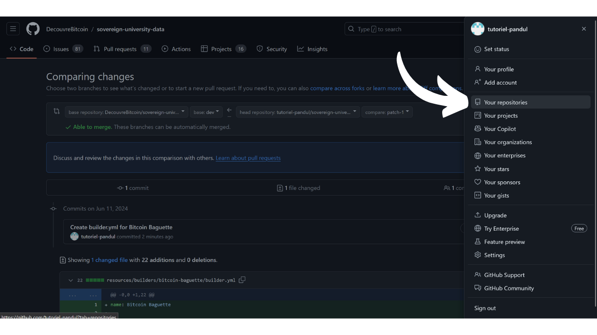
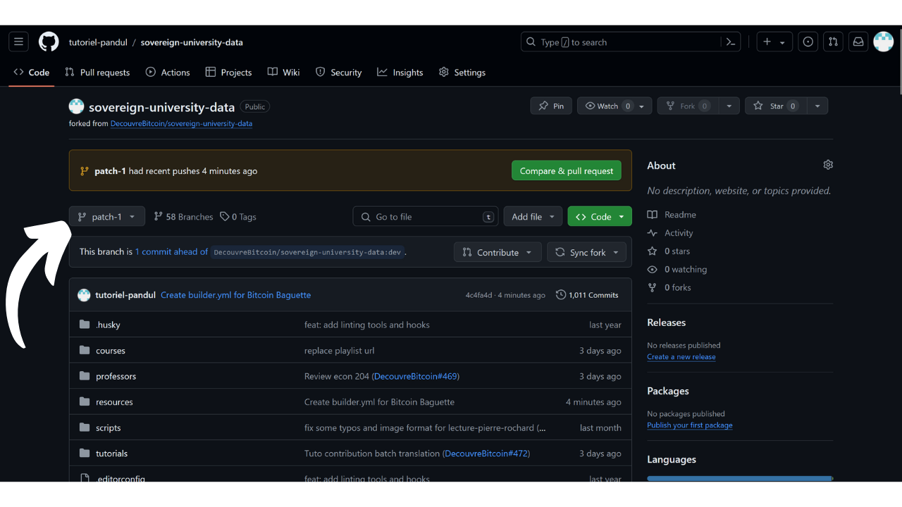
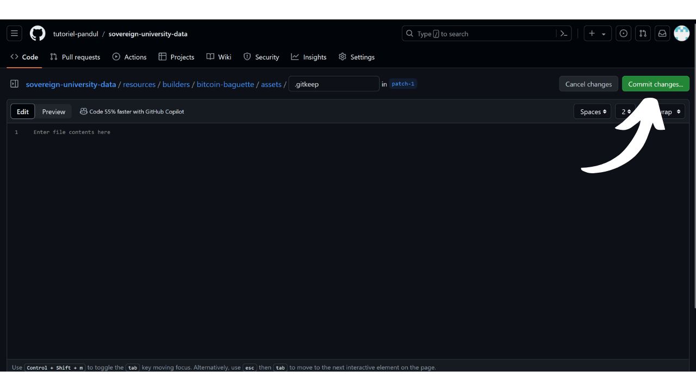
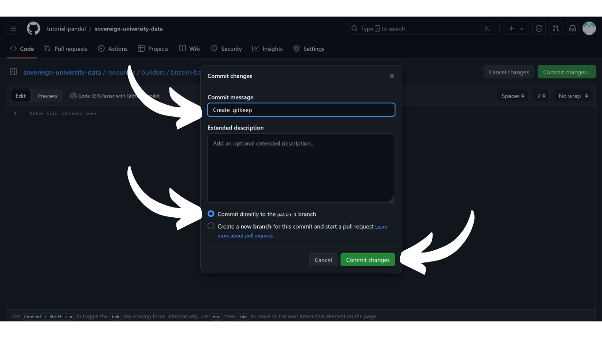
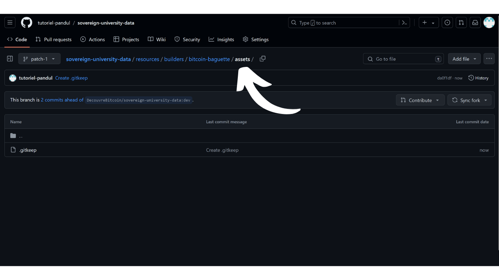
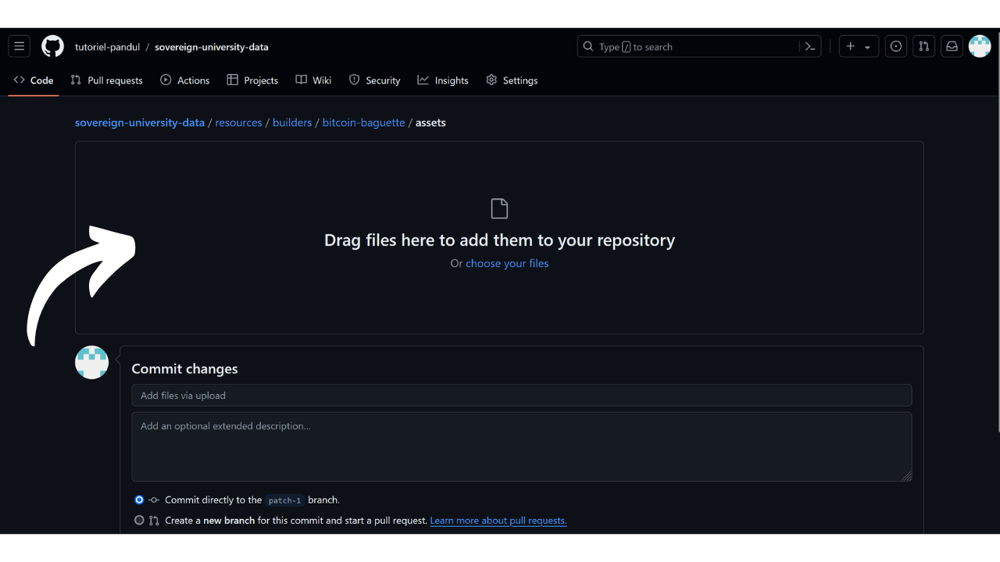
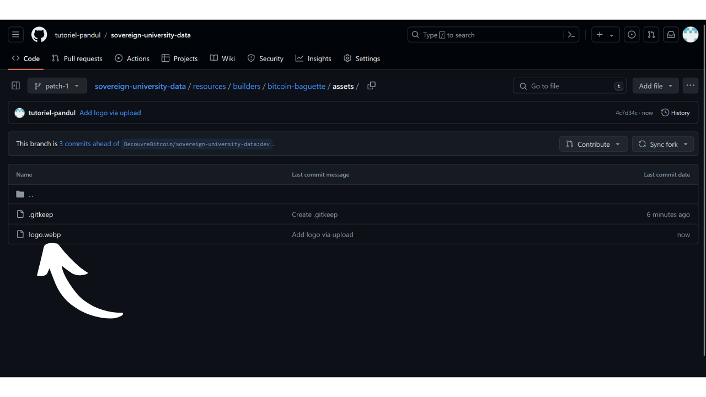
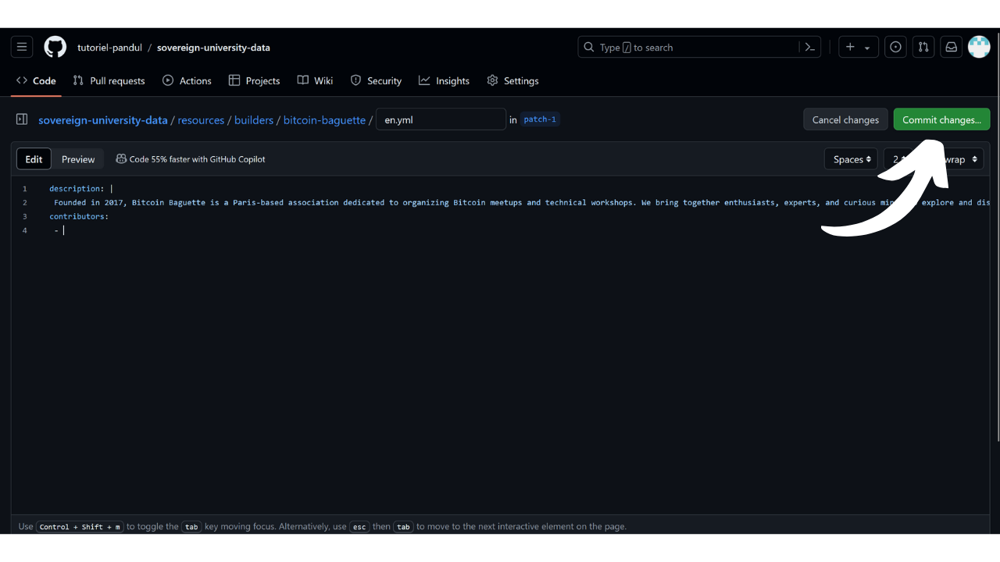
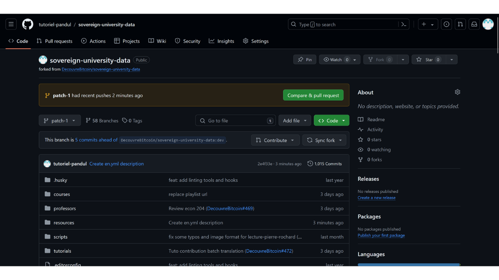

Die Mission von PlanB ist es, erstklassige Bildungsressourcen über Bitcoin in möglichst vielen Sprachen bereitzustellen. Alle Inhalte, die auf der Seite veröffentlicht werden, sind Open-Source und werden auf GitHub gehostet, was es jedem ermöglicht, an der Bereicherung der Plattform teilzunehmen.

Möchten Sie einen neuen Bitcoin "Entwickler" zur PlanB Netzwerkseite hinzufügen und Ihrem Unternehmen oder Ihrer Software Sichtbarkeit verleihen, wissen aber nicht wie? Dieses Tutorial ist für Sie!

- Zuerst benötigen Sie ein GitHub-Konto. Wenn Sie nicht wissen, wie Sie ein Konto erstellen, haben wir [ein detailliertes Tutorial erstellt, um Sie anzuleiten](https://planb.network/tutorials/others/create-github-account).
- Gehen Sie zu [dem GitHub-Repository von PlanB, das den Daten gewidmet ist](https://github.com/PlanB-Network/bitcoin-educational-content/tree/dev/resources/builders) im Abschnitt `resources/builder/`:

- Klicken Sie oben rechts auf den Button `Add file`, dann auf `Create new file`:

- Wenn Sie noch nie zu den Inhalten des PlanB Netzwerks beigetragen haben, müssen Sie Ihren Fork des Original-Repositorys erstellen. Ein Repository zu forken bedeutet, eine Kopie dieses Repositorys auf Ihrem eigenen GitHub-Konto zu erstellen, was es Ihnen ermöglicht, am Projekt zu arbeiten, ohne das Original-Repository zu beeinflussen. Klicken Sie auf den Button `Fork this repository`:

- Sie gelangen dann zur GitHub-Bearbeitungsseite:

- Erstellen Sie einen Ordner für Ihr Unternehmen. Um dies zu tun, schreiben Sie in das Feld `Name your file...` den Namen Ihres Unternehmens in Kleinbuchstaben mit Bindestrichen anstelle von Leerzeichen. Wenn Ihr Unternehmen beispielsweise "Bitcoin Baguette" heißt, sollten Sie `bitcoin-baguette` schreiben:

- Um die Erstellung des Ordners zu validieren, fügen Sie einfach einen Schrägstrich nach Ihrem Namen in dasselbe Feld ein, zum Beispiel: `bitcoin-baguette/`. Das Hinzufügen eines Schrägstrichs erstellt automatisch einen Ordner anstelle einer Datei:

- In diesem Ordner erstellen Sie eine erste YAML-Datei mit dem Namen `builder.yml`:

- Füllen Sie diese Datei mit Informationen über Ihr Unternehmen mit dieser Vorlage aus:

```yaml
name:

address_line_1:
address_line_2:
address_line_3: 

language:
  - 

links:
  website:
  twitter:
  Github:
  youtube:
  nostr:

tags:
  - 
  - 

category:
```

Hier ist, was für jeden Schlüssel ausgefüllt werden soll:
- `name`: Der Name Ihres Unternehmens (obligatorisch);
- `address` : Der Standort Ihres Unternehmens (optional);
- `language` : Die Länder, in denen Ihr Unternehmen tätig ist, oder die unterstützten Sprachen (optional);
- `links` : Die verschiedenen offiziellen Links Ihres Unternehmens (optional);
- `tags` : 2 Begriffe, die Ihr Unternehmen qualifizieren (obligatorisch);
- `category` : Die Kategorie, die am besten das Feld beschreibt, in dem Ihr Unternehmen tätig ist, unter den folgenden Auswahlmöglichkeiten:
	- `wallet`,
	- `infrastructure`,
	- `exchange`,
	- `education`,
	- `service`,
	- `communities`,
	- `conference`,
	- `privacy`,
	- `investment`,
	- `node`,
	- `mining`,
	- `news`,
	- `manufacturer`.
Zum Beispiel könnte Ihre YAML-Datei so aussehen:
```yaml
name: Bitcoin Baguette

address_line_1: Paris, Frankreich
address_line_2:
address_line_3: 

language:
  - fr
  - en

links:
  website: https://bitcoin-baguette.com
  twitter: https://twitter.com/bitcoinbaguette
  Github:
  youtube:
  nostr:

tags:
  - bitcoin
  - bildung

category: bildung
```


- Sobald Sie mit den Änderungen an dieser Datei fertig sind, speichern Sie diese, indem Sie auf den `Commit changes...`-Button klicken:

- Fügen Sie einen Titel für Ihre Änderungen hinzu, zusammen mit einer kurzen Beschreibung:

- Klicken Sie auf den grünen `Propose changes`-Button:

- Sie gelangen dann auf eine Seite, die alle Ihre Änderungen zusammenfasst:

- Klicken Sie oben rechts auf Ihr GitHub-Profilbild und dann auf `Your Repositories`:

- Wählen Sie Ihren Fork des PlanB Network-Repositorys aus:

- Sie sollten eine Benachrichtigung am oberen Rand des Fensters mit Ihrem neuen Branch sehen. Er heißt wahrscheinlich `patch-1`. Klicken Sie darauf:

- Sie befinden sich jetzt auf Ihrem Arbeitsbranch (**stellen Sie sicher, dass Sie sich auf demselben Branch wie Ihre vorherigen Änderungen befinden, das ist wichtig!**):

- Gehen Sie zurück zum Ordner `resources/builders/` und wählen Sie den Ordner Ihres Unternehmens aus, den Sie im vorherigen Commit erstellt haben:

- Im Ordner Ihres Unternehmens klicken Sie auf den `Add file`-Button und dann auf `Create new file`:

- Benennen Sie diesen neuen Ordner `assets` und bestätigen Sie dessen Erstellung, indem Sie am Ende ein Schrägstrich `/` setzen:

- In diesem `assets`-Ordner erstellen Sie eine Datei mit dem Namen `.gitkeep`:

- Klicken Sie auf den `Commit changes...`-Button:

- Lassen Sie den Commit-Titel wie vorgegeben und stellen Sie sicher, dass das Kästchen `Commit directly to the patch-1 branch` angekreuzt ist, dann klicken Sie auf `Commit changes`: 
- Gehen Sie zurück zum `assets`-Ordner:

- Klicken Sie auf den `Add file`-Button und dann auf `Upload files`:

- Eine neue Seite wird geöffnet. Ziehen Sie ein Bild Ihres Unternehmens oder Ihrer Software in den Bereich. Dieses Bild wird auf der PlanB Network-Seite angezeigt:

- Es kann das Logo oder ein Icon sein:

- Sobald das Bild hochgeladen ist, überprüfen Sie, ob das Kästchen `Commit directly to the patch-1 branch` angekreuzt ist, und klicken Sie dann auf `Commit changes`:

- Achten Sie darauf, dass Ihr Bild quadratisch sein muss, `logo` genannt werden muss und im `.webp`-Format vorliegen muss. Der vollständige Dateiname sollte daher lauten: `logo.webp`:

- Gehen Sie zurück zu Ihrem `assets`-Ordner und klicken Sie auf die Zwischendatei `.gitkeep`:
- Klicken Sie einmal auf die Datei, dann oben rechts auf die drei kleinen Punkte und anschließend auf `Datei löschen`:

- Überprüfen Sie, ob Sie sich noch immer auf dem gleichen Arbeitsbranch befinden, und klicken Sie dann auf den Button `Änderungen übernehmen`:

- Fügen Sie einen Titel und eine Beschreibung zu Ihrem Commit hinzu, dann klicken Sie auf `Änderungen übernehmen`:

- Gehen Sie zurück zum Ordner Ihres Unternehmens:

- Klicken Sie auf den Button `Datei hinzufügen`, dann auf `Neue Datei erstellen`:

- Erstellen Sie eine neue YAML-Datei, indem Sie sie mit dem Indikator Ihrer Muttersprache benennen. Diese Datei wird für die Beschreibung des Builders verwendet. Wenn ich zum Beispiel meine Beschreibung auf Englisch schreiben möchte, benenne ich diese Datei `en.yml`:

- Füllen Sie diese YAML-Datei mit dieser Vorlage aus:
```yaml
description: |
 
contributors:
 - 
```

- Für den Schlüssel `contributors` können Sie Ihren Beitragenden-Identifikator zum PlanB-Netzwerk hinzufügen, falls Sie einen haben. Wenn nicht, lassen Sie dieses Feld leer.
- Für den Schlüssel `description` müssen Sie lediglich einen kurzen Absatz hinzufügen, der Ihr Unternehmen oder Ihre Software beschreibt. Die Beschreibung muss in der gleichen Sprache sein wie der Dateiname. Sie müssen diese Beschreibung nicht in alle auf der Website unterstützten Sprachen übersetzen, da dies von den PlanB-Teams mit ihrem Modell gemacht wird. Hier ist ein Beispiel, wie Ihre Datei aussehen könnte:
```yaml
description: |
Gegründet im Jahr 2017, ist Bitcoin Baguette ein in Paris ansässiger Verein, der sich der Organisation von Bitcoin-Treffen und technischen Workshops widmet. Wir bringen Enthusiasten, Experten und neugierige Köpfe zusammen, um die Feinheiten der Bitcoin-Technologie zu erkunden und zu diskutieren. Unsere Veranstaltungen bieten eine Plattform für den Austausch von Wissen, Networking und die Vertiefung des Verständnisses der inneren Funktionsweise von Bitcoin. Werden Sie Teil der Bitcoin-Community in Paris bei Bitcoin Baguette und bleiben Sie auf dem Laufenden über die neuesten Entwicklungen im Bereich.

contributors:
- 
```

- Klicken Sie auf den Button `Änderungen übernehmen`:

- Stellen Sie sicher, dass das Kästchen `Direkt in den Branch patch-1 übernehmen` angekreuzt ist, fügen Sie einen Titel hinzu, dann klicken Sie auf `Änderungen übernehmen`:

- Der Ordner Ihres Unternehmens sollte jetzt so aussehen:

- Wenn alles zu Ihrer Zufriedenheit ist, kehren Sie zurück zur Wurzel Ihres Forks:

- Sie sollten eine Nachricht sehen, die darauf hinweist, dass Ihr Branch Änderungen erfahren hat. Klicken Sie auf den Button `Vergleichen & Pull-Request erstellen`:

- Fügen Sie einen klaren Titel und eine Beschreibung zu Ihrem PR hinzu:

- Klicken Sie auf den Button `Pull-Request erstellen`:

Herzlichen Glückwunsch! Ihr PR wurde erfolgreich erstellt. Ein Administrator wird ihn nun überprüfen und, wenn alles in Ordnung ist, in das Hauptrepository des PlanB-Netzwerks integrieren. Ihr Builder-Profil sollte einige Tage später auf der Website erscheinen.

Achten Sie darauf, den Fortschritt Ihres PR zu verfolgen. Ein Administrator könnte einen Kommentar hinterlassen, der um zusätzliche Informationen bittet. Solange Ihr PR nicht validiert ist, können Sie ihn im Tab `Pull-Requests` im GitHub-Repository des PlanB-Netzwerks einsehen:

Vielen Dank für Ihren wertvollen Beitrag! :)