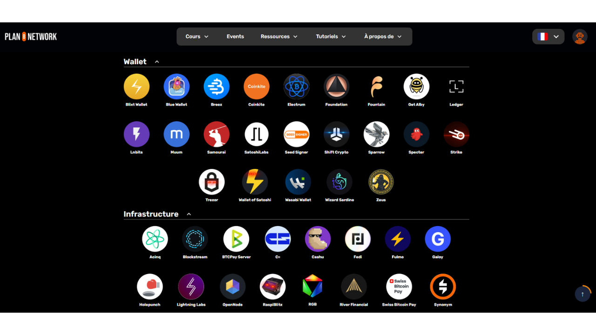
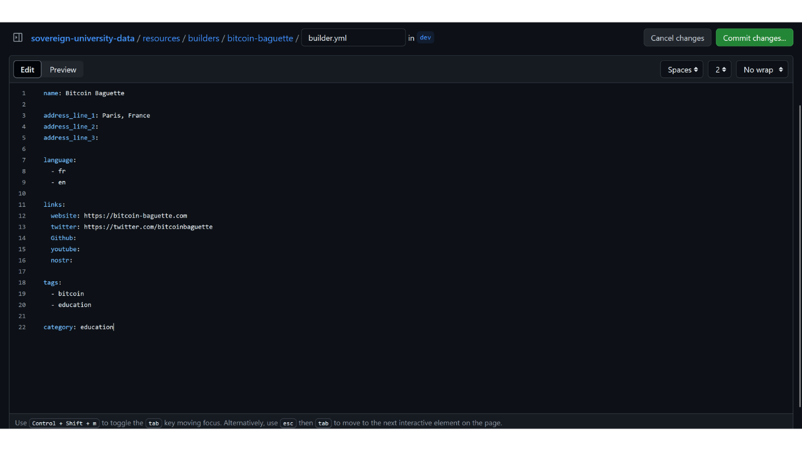

A missão da PlanB é fornecer recursos educacionais de primeira linha sobre Bitcoin, em tantos idiomas quanto possível. Todo o conteúdo publicado no site é de código aberto e hospedado no GitHub, o que permite que qualquer pessoa participe do enriquecimento da plataforma.

Você quer adicionar um novo "construtor" de Bitcoin ao site da Rede PlanB e dar visibilidade à sua empresa ou software, mas não sabe como? Este tutorial é para você!

- Primeiro, você precisa ter uma conta no GitHub. Se você não sabe como criar uma conta, fizemos [um tutorial detalhado para guiá-lo](https://planb.network/tutorials/others/create-github-account).
- Vá para [o repositório GitHub da PlanB dedicado a dados](https://github.com/DecouvreBitcoin/sovereign-university-data/tree/dev/resources/builders) na seção `resources/builder/`:

- Clique no canto superior direito no botão `Add file`, depois em `Create new file`:

- Se você nunca contribuiu para os conteúdos da Rede PlanB antes, precisará criar seu fork do repositório original. Fazer um fork de um repositório significa criar uma cópia desse repositório em sua própria conta do GitHub, o que permite trabalhar no projeto sem afetar o repositório original. Clique no botão `Fork this repository`:

- Você então chegará à página de edição do GitHub:

- Crie uma pasta para sua empresa. Para fazer isso, na caixa `Name your file...`, escreva o nome da sua empresa em letras minúsculas com hífens no lugar de espaços. Por exemplo, se sua empresa se chama "Bitcoin Baguette", você deve escrever `bitcoin-baguette`:

- Para validar a criação da pasta, simplesmente adicione uma barra após o nome na mesma caixa, por exemplo: `bitcoin-baguette/`. Adicionar uma barra cria automaticamente uma pasta em vez de um arquivo:

- Nesta pasta, você criará um primeiro arquivo YAML chamado `builder.yml`:

- Preencha este arquivo com informações sobre sua empresa usando este modelo:

```yaml
name:

address_line_1:
address_line_2:
address_line_3: 

language:
  - 

links:
  website:
  twitter:
  Github:
  youtube:
  nostr:

tags:
  - 
  - 

category:
```

Aqui está o que preencher para cada chave:
- `name`: O nome da sua empresa (obrigatório);
- `address` : A localização do seu negócio (opcional);
- `language` : Os países em que sua empresa opera ou os idiomas suportados (opcional);
- `links` : Os diversos links oficiais do seu negócio (opcional);
- `tags` : 2 termos que qualificam seu negócio (obrigatório);
- `category` : A categoria que melhor descreve o campo em que sua empresa atua dentre as seguintes opções:
	- `wallet` (carteira),
	- `infrastructure` (infraestrutura),
	- `exchange` (câmbio),
	- `education` (educação),
	- `service` (serviço),
	- `communities` (comunidades),
	- `conference` (conferência),
	- `privacy` (privacidade),
	- `investment` (investimento),
	- `node` (nó),
	- `mining` (mineração),
	- `news` (notícias),
	- `manufacturer` (fabricante).
Por exemplo, seu arquivo YAML poderia ter esta aparência:
```yaml
name: Bitcoin Baguette

address_line_1: Paris, França
address_line_2:
address_line_3: 

language:
  - fr
  - en

links:
  website: https://bitcoin-baguette.com
  twitter: https://twitter.com/bitcoinbaguette
  Github:
  youtube:
  nostr:

tags:
  - bitcoin
  - educação

category: educação
```


- Uma vez que você tenha terminado de fazer alterações neste arquivo, salve-as clicando no botão `Commit changes...`:

- Adicione um título para suas alterações, junto com uma breve description:

- Clique no botão verde `Propose changes`:

- Você então chegará a uma página resumindo todas as suas alterações:

- Clique na foto do seu perfil do GitHub no canto superior direito, depois em `Your Repositories`:

- Selecione o seu fork do repositório PlanB Network:

- Você deverá ver uma notificação no topo da janela com o seu novo branch. Provavelmente se chama `patch-1`. Clique nele:

- Agora você está no seu branch de trabalho (**certifique-se de que está no mesmo branch que suas modificações anteriores, isso é importante!**):

- Volte para a pasta `resources/builders/` e selecione a pasta do seu negócio que você acabou de criar no commit anterior:

- Na pasta do seu negócio, clique no botão `Add file`, depois em `Create new file`:

- Nomeie esta nova pasta como `assets` e confirme sua criação colocando uma barra `/` no final:

- Nesta pasta `assets`, crie um arquivo chamado `.gitkeep`:

- Clique no botão `Commit changes...`:

- Deixe o título do commit como padrão, e certifique-se de que a caixa `Commit directly to the patch-1 branch` esteja marcada, então clique em `Commit changes`: 
- Volte para a pasta `assets`:

- Clique no botão `Add file`, depois em `Upload files`:

- Uma nova página será aberta. Arraste e solte uma imagem da sua empresa ou do seu software na área. Esta imagem será exibida no site da PlanB Network:

- Pode ser o logo ou um ícone:

- Uma vez que a imagem esteja carregada, verifique se a caixa `Commit directly to the patch-1 branch` está marcada, então clique em `Commit changes`:

- Tenha cuidado, sua imagem deve ser quadrada, deve ser nomeada `logo`, e deve estar no formato `.webp`. O nome completo do arquivo deve ser, portanto: `logo.webp`:

- Volte para a sua pasta `assets` e clique no arquivo intermediário `.gitkeep`:
- Uma vez no arquivo, clique nos três pequenos pontos no canto superior direito e então em `Delete file` (Apagar arquivo):

- Verifique se você ainda está na mesma branch de trabalho, então clique no botão `Commit changes` (Confirmar alterações):

- Adicione um título e uma descrição ao seu commit, então clique em `Commit changes` (Confirmar alterações):

- Volte para a pasta da sua empresa:

- Clique no botão `Add file` (Adicionar arquivo), depois em `Create new file` (Criar novo arquivo):

- Crie um novo arquivo YAML nomeando-o com o indicador do seu idioma nativo. Este arquivo será usado para a descrição do construtor. Por exemplo, se eu quiser escrever minha descrição em inglês, nomearei este arquivo como `en.yml`:

- Preencha este arquivo YAML usando este modelo:
```yaml
description: |
 
contributors:
 - 
```

- Para a chave `contributors` (contribuidores), você pode adicionar seu identificador de contribuidor na Rede PlanB se tiver um. Se não tiver, deixe este campo vazio.
- Para a chave `description` (descrição), você simplesmente precisa adicionar um curto parágrafo que descreva sua empresa ou seu software. A descrição deve estar no mesmo idioma do nome do arquivo. Você não precisa traduzir esta descrição para todos os idiomas suportados no site, pois as equipes da PlanB farão isso usando seu modelo. Por exemplo, aqui está como seu arquivo poderia parecer:
```yaml
description: |
Fundada em 2017, a Bitcoin Baguette é uma associação sediada em Paris dedicada a organizar meetups de Bitcoin e workshops técnicos. Reunimos entusiastas, especialistas e mentes curiosas para explorar e discutir as complexidades da tecnologia Bitcoin. Nossos eventos fornecem uma plataforma para compartilhamento de conhecimento, networking e fomento de um entendimento mais profundo sobre os mecanismos internos do Bitcoin. Junte-se a nós na Bitcoin Baguette para fazer parte da comunidade Bitcoin de Paris e manter-se atualizado com os últimos avanços no campo.

contributors:
- 
```

- Clique no botão `Commit changes` (Confirmar alterações):

- Certifique-se de que a caixa `Commit directly to the patch-1 branch` (Confirmar diretamente na branch patch-1) esteja marcada, adicione um título, então clique em `Commit changes` (Confirmar alterações):

- A pasta da sua empresa agora deve parecer assim:

- Se tudo estiver de acordo com sua satisfação, retorne à raiz do seu fork:

- Você deverá ver uma mensagem indicando que sua branch sofreu alterações. Clique no botão `Compare & pull request` (Comparar e criar pull request):

- Adicione um título claro e uma descrição ao seu PR:

- Clique no botão `Create pull request` (Criar pull request):

Parabéns! Seu PR foi criado com sucesso. Um administrador agora irá revisá-lo e, se tudo estiver em ordem, integrá-lo ao repositório principal da Rede PlanB. Você deverá ver seu perfil de construtor aparecer no site alguns dias depois.

Certifique-se de acompanhar o progresso do seu PR. Um administrador pode deixar um comentário pedindo informações adicionais. Enquanto seu PR não for validado, você pode consultá-lo na aba `Pull requests` no repositório GitHub da Rede PlanB:

Muito obrigado pela sua valiosa contribuição! :)