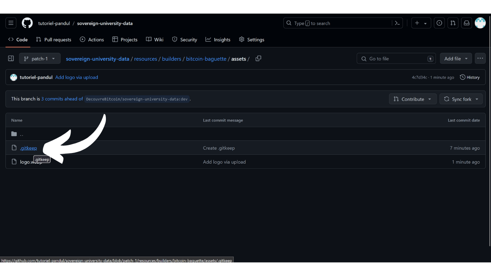
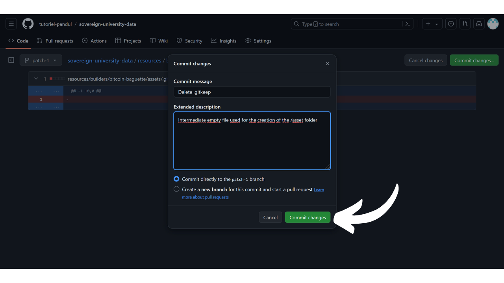
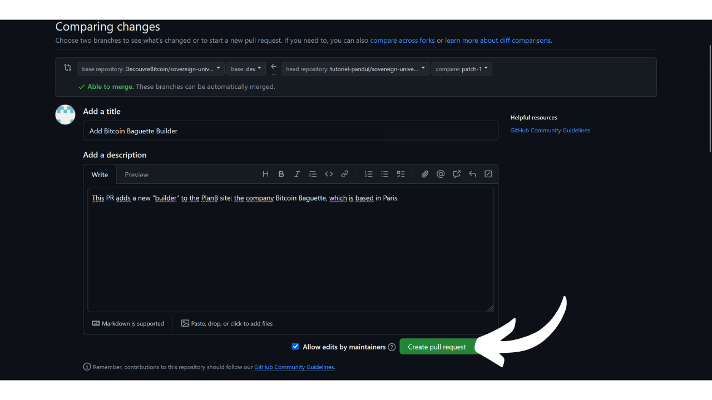

Миссия PlanB - предоставлять образовательные ресурсы высшего качества о Bitcoin на максимально возможном количестве языков. Все контент, опубликованный на сайте, является открытым и размещается на GitHub, что позволяет любому желающему участвовать в обогащении платформы.

Хотите добавить нового "строителя" Bitcoin на сайт сети PlanB и дать видимость вашей компании или программному обеспечению, но не знаете как? Этот учебник для вас!

- Во-первых, вам нужен аккаунт на GitHub. Если вы не знаете, как создать аккаунт, мы подготовили [подробный учебник, который вас направит](https://planb.network/tutorials/others/create-github-account).
- Перейдите в [репозиторий GitHub PlanB, посвященный данным](https://github.com/DecouvreBitcoin/sovereign-university-data/tree/dev/resources/builders) в раздел `resources/builder/`:

- Нажмите в верхнем правом углу на кнопку `Add file`, затем на `Create new file`:

- Если вы никогда ранее не вносили вклад в содержание сети PlanB, вам нужно будет создать вашу собственную копию оригинального репозитория. Создание копии репозитория означает создание копии этого репозитория на вашем собственном аккаунте GitHub, что позволяет вам работать над проектом, не влияя на оригинальный репозиторий. Нажмите на кнопку `Fork this repository`:

- Затем вы попадете на страницу редактирования GitHub:

- Создайте папку для вашей компании. Для этого в поле `Name your file...` напишите название вашей компании строчными буквами с дефисами вместо пробелов. Например, если ваша компания называется "Bitcoin Baguette", вы должны написать `bitcoin-baguette`:

- Чтобы подтвердить создание папки, просто добавьте слэш после вашего имени в том же поле, например: `bitcoin-baguette/`. Добавление слэша автоматически создает папку, а не файл:

- В этой папке вы создадите первый YAML файл с именем `builder.yml`:

- Заполните этот файл информацией о вашей компании, используя этот шаблон:

```yaml
name:

address_line_1:
address_line_2:
address_line_3: 

language:
  - 

links:
  website:
  twitter:
  Github:
  youtube:
  nostr:

tags:
  - 
  - 

category:
```

Вот что нужно заполнить для каждого ключа:
- `name`: Название вашей компании (обязательно);
- `address` : Местоположение вашего бизнеса (необязательно);
- `language` : Страны, в которых работает ваш бизнес, или поддерживаемые языки (необязательно);
- `links` : Различные официальные ссылки вашего бизнеса (необязательно);
- `tags` : 2 термина, которые характеризуют ваш бизнес (обязательно);
- `category` : Категория, которая лучше всего описывает сферу, в которой работает ваш бизнес, среди следующих вариантов:
	- `wallet` (кошелек),
	- `infrastructure` (инфраструктура),
	- `exchange` (биржа),
	- `education` (образование),
	- `service` (сервис),
	- `communities` (сообщества),
	- `conference` (конференция),
	- `privacy` (конфиденциальность),
	- `investment` (инвестиции),
	- `node` (узел),
	- `mining` (майнинг),
	- `news` (новости),
	- `manufacturer` (производитель).
Например, ваш YAML-файл может выглядеть так:
```yaml
name: Bitcoin Baguette

address_line_1: Париж, Франция
address_line_2:
address_line_3: 

language:
  - fr
  - en

links:
  website: https://bitcoin-baguette.com
  twitter: https://twitter.com/bitcoinbaguette
  Github:
  youtube:
  nostr:

tags:
  - bitcoin
  - образование

category: образование
```


- Как только вы закончите вносить изменения в этот файл, сохраните их, нажав на кнопку `Commit changes...`:

- Добавьте заголовок для ваших изменений вместе с кратким описанием:

- Нажмите на зеленую кнопку `Propose changes`:

- Затем вы попадете на страницу, где будут суммированы все ваши изменения:

- Нажмите на изображение вашего профиля GitHub в правом верхнем углу, затем на `Your Repositories`:

- Выберите ваш форк репозитория PlanB Network:

- Вы должны увидеть уведомление в верхней части окна с вашей новой веткой. Вероятно, она называется `patch-1`. Нажмите на нее:

- Теперь вы находитесь в своей рабочей ветке (**убедитесь, что вы находитесь в той же ветке, что и ваши предыдущие изменения, это важно!**):

- Вернитесь в папку `resources/builders/` и выберите папку вашего бизнеса, которую вы только что создали в предыдущем коммите:

- В папке вашего бизнеса нажмите на кнопку `Add file`, затем на `Create new file`:

- Назовите эту новую папку `assets` и подтвердите ее создание, поставив слэш `/` в конце:

- В этой папке `assets` создайте файл с именем `.gitkeep`:

- Нажмите на кнопку `Commit changes...`:

- Оставьте заголовок коммита по умолчанию и убедитесь, что отмечен флажок `Commit directly to the patch-1 branch`, затем нажмите на `Commit changes`: 
- Вернитесь в папку `assets`:

- Нажмите на кнопку `Add file`, затем на `Upload files`:

- Откроется новая страница. Перетащите изображение вашей компании или вашего программного обеспечения в область. Это изображение будет отображаться на сайте PlanB Network:

- Это может быть логотип или иконка:

- Как только изображение будет загружено, убедитесь, что отмечен флажок `Commit directly to the patch-1 branch`, затем нажмите на `Commit changes`:

- Будьте внимательны, ваше изображение должно быть квадратным, должно быть названо `logo`, и должно быть в формате `.webp`. Полное имя файла, следовательно, должно быть: `logo.webp`:

- Вернитесь в вашу папку `assets` и нажмите на промежуточный файл `.gitkeep`:
- Перейдите к файлу, нажмите на три маленькие точки в верхнем правом углу, затем на `Delete file` (Удалить файл):

- Убедитесь, что вы находитесь на той же рабочей ветке, затем нажмите на кнопку `Commit changes` (Подтвердить изменения):

- Добавьте заголовок и описание к вашему коммиту, затем нажмите на `Commit changes` (Подтвердить изменения):

- Вернитесь в папку вашей компании:

- Нажмите на кнопку `Add file` (Добавить файл), затем на `Create new file` (Создать новый файл):

- Создайте новый YAML файл, назвав его индикатором вашего родного языка. Этот файл будет использоваться для описания конструктора. Например, если я хочу написать мое описание на английском, я назову этот файл `en.yml`:

- Заполните этот YAML файл, используя этот шаблон:
```yaml
description: |
 
contributors:
 - 
```

- Для ключа `contributors` вы можете добавить ваш идентификатор участника в сети PlanB, если у вас он есть. Если нет, оставьте это поле пустым.
- Для ключа `description` вам просто нужно добавить короткий абзац, описывающий вашу компанию или ваше программное обеспечение. Описание должно быть на том же языке, что и имя файла. Вам не нужно переводить это описание на все поддерживаемые на сайте языки, так как это сделают команды PlanB, используя их модель. Например, вот как может выглядеть ваш файл:
```yaml
description: |
Основанная в 2017 году, Bitcoin Baguette — это парижская ассоциация, посвященная организации встреч посвященных Bitcoin и технических мастер-классов. Мы собираем энтузиастов, экспертов и любопытных умов для изучения и обсуждения тонкостей технологии Bitcoin. Наши мероприятия предоставляют платформу для обмена знаниями, налаживания контактов и углубленного понимания внутреннего устройства Bitcoin. Присоединяйтесь к нам в Bitcoin Baguette, чтобы стать частью парижского сообщества Bitcoin и оставаться в курсе последних достижений в этой области.

contributors:
- 
```

- Нажмите на кнопку `Commit changes` (Подтвердить изменения):

- Убедитесь, что отмечен пункт `Commit directly to the patch-1 branch` (Прямой коммит в ветку patch-1), добавьте заголовок, затем нажмите на `Commit changes` (Подтвердить изменения):

- Теперь папка вашей компании должна выглядеть так:

- Если все устраивает, вернитесь к корню вашего форка:

- Вы должны увидеть сообщение, указывающее на то, что ваша ветка претерпела изменения. Нажмите на кнопку `Compare & pull request` (Сравнить и создать запрос на включение изменений):

- Добавьте четкий заголовок и описание к вашему PR:

- Нажмите на кнопку `Create pull request` (Создать запрос на включение изменений):

Поздравляем! Ваш PR был успешно создан. Теперь администратор рассмотрит его и, если все в порядке, интегрирует в основной репозиторий сети PlanB. Ваш профиль конструктора появится на сайте через несколько дней.

Обязательно следите за ходом вашего PR. Администратор может оставить комментарий с просьбой предоставить дополнительную информацию. Пока ваш PR не будет подтвержден, вы можете просматривать его во вкладке `Pull requests` (Запросы на включение изменений) на репозитории GitHub сети PlanB:

Большое спасибо за ваш ценный вклад! :)