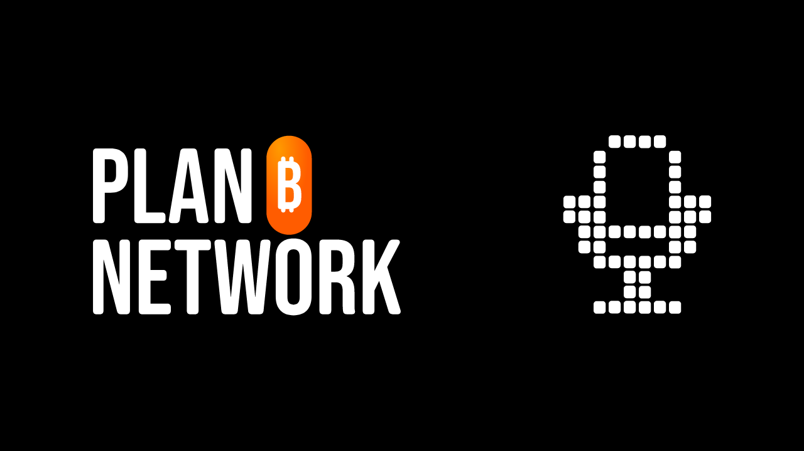
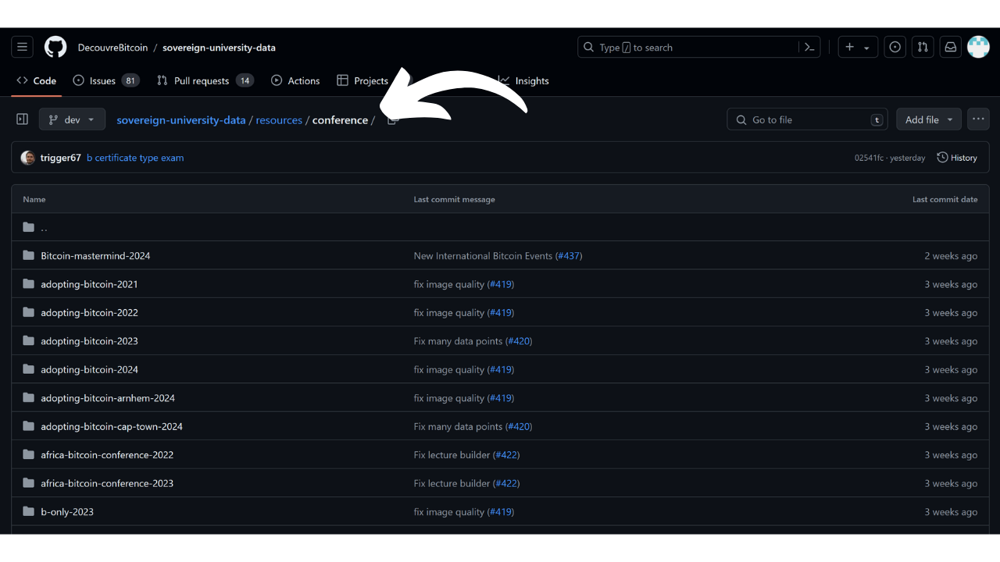
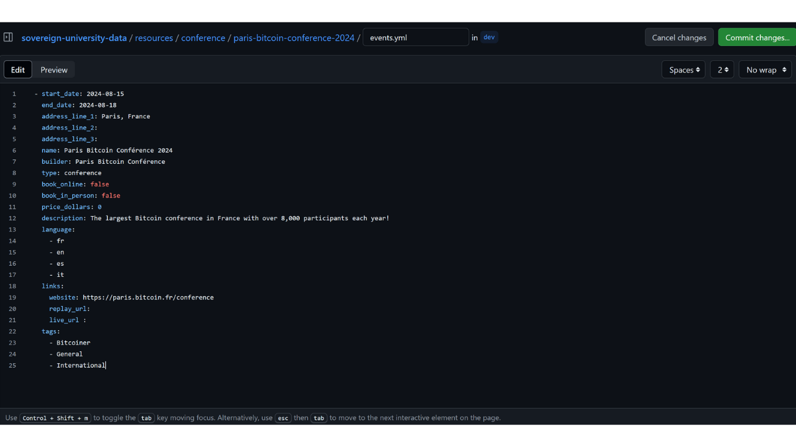
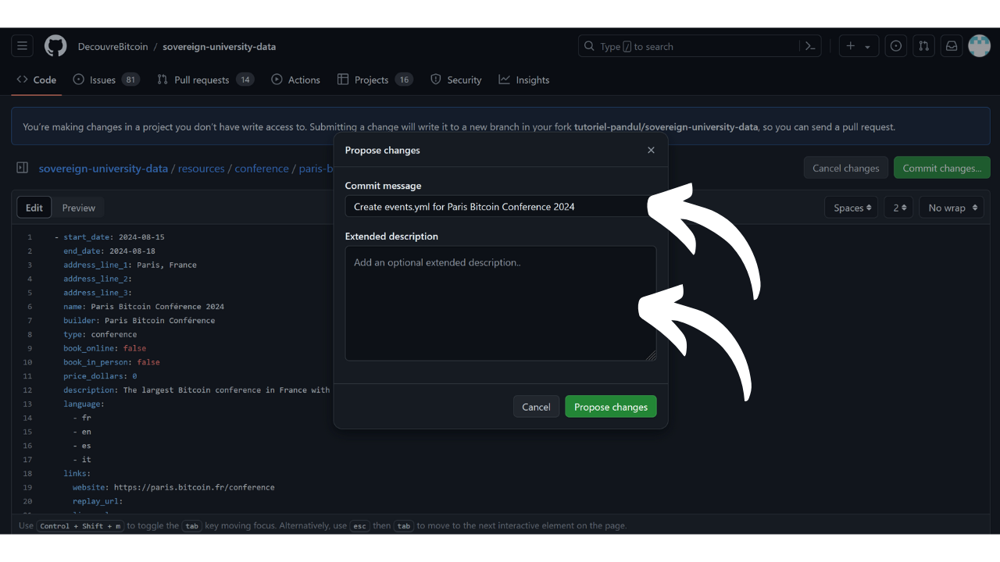

PlanB's mission is to provide top-tier educational resources on Bitcoin in as many languages as possible. All content published on the site is open-source and hosted on GitHub, offering anyone the opportunity to contribute to the enrichment of the platform.

If you want to add a Bitcoin conference to the PlanB Network site and increase visibility for your event, but don't know how? This tutorial is for you!

- First, you need to have an account on GitHub. If you don't know how to create an account, we have made [a detailed tutorial to guide you](https://planb.network/tutorials/others/create-github-account).
- Go to [the GitHub repository of PlanB dedicated to data](https://github.com/PlanB-Network/bitcoin-educational-content/tree/dev/resources/conference) in the `resources/conference/` section:

- Click on the top right on the `Add file` button, then on `Create new file`:

- If you have never contributed to the contents of PlanB Network before, you will need to create your fork of the original repository. Forking a repository means creating a copy of that repository on your own GitHub account, allowing you to work on the project without affecting the original repository. Click on the `Fork this repository` button:

- You will then arrive at the GitHub editing page:

- Create a folder for your conference. To do this, in the `Name your file...` box, write the name of your conference in lowercase with dashes instead of spaces. For example, if your conference is called "Paris Bitcoin Conference", you should note `paris-bitcoin-conference`. Also add the year of your conference, for example: `paris-bitcoin-conference-2024`:

- To validate the creation of the folder, simply note a slash after your name in the same box, for example: `paris-bitcoin-conference-2024/`. Adding a slash automatically creates a folder rather than a file:

- In this folder, you will create a first YAML file named `events.yml`:

- Fill this file with information about your conference using this template:

```yaml
- start_date:
  end_date:
  address_line_1:
  address_line_2: 
  address_line_3: 
  name:
  builder:
  type: conference
  book_online: false
  book_in_person: false
  price_dollars: 0
  description:
  language: 
    - 
  links:
    website:
    replay_url:    
    live_url :
  tags: 
    - 
```

For example, your YAML file could look like this:

```yaml
- start_date: 2024-08-15
  end_date: 2024-08-18
  address_line_1: Paris, France
  address_line_2: 
  address_line_3: 
  name: Paris Bitcoin Conference 2024
  builder: Paris Bitcoin Conference
  type: conference
  book_online: false
  book_in_person: false
  price_dollars: 0
  description: The largest Bitcoin conference in France with over 8,000 participants each year!
  language: 
    - fr
    - en
    - es
    - it
  links:
    website: https://paris.bitcoin.fr/conference
    replay_url:
    live_url :
  tags: 
    - Bitcoiner
    - General
    - International
```

If you do not yet have a "*builder*" identifier for your organization, you can add it [by following this other tutorial](https://planb.network/tutorials/others/add-builder).

- Once you have finished making changes to this file, save them by clicking on the `Commit changes...` button:

- Add a title for your changes, as well as a short description:

- Click on the green `Propose changes` button:

- You will then arrive at a page summarizing all your changes:

- Click on your GitHub profile picture at the top right, then on `Your Repositories`:

- Select your fork of the PlanB Network repository:

- You should see a notification at the top of the window with your new branch. It's probably called `patch-1`. Click on it:

- You are now on your working branch:

- Go back to the `resources/conference/` folder and select the folder of your conference that you just created in the previous commit:

- In the folder of your conference, click on the `Add file` button, then on `Create new file`:

- Name this new folder `assets` and confirm its creation by putting a slash `/` at the end:

- In this `assets` folder, create a file named `.gitkeep`:

- Click on the `Commit changes...` button:

- Leave the commit title as default, and make sure the `Commit directly to the patch-1 branch` box is checked, then click on `Commit changes`:

- Return to the `assets` folder:

- Click on the `Add file` button, then on `Upload files`: 
- A new page will open. Drag and drop an image that represents your conference and will be displayed on the PlanB Network site:

- It can be the logo, a thumbnail, or even a poster:

- Once the image is uploaded, check that the `Commit directly to the patch-1 branch` box is ticked, then click on `Commit changes`:

- Be careful, your image must be named `thumbnail` and must be in `.webp` format. The full file name should therefore be: `thumbnail.webp`:

- Return to your `assets` folder and click on the intermediary file `.gitkeep`:

- Once on the file, click on the 3 small dots at the top right then on `Delete file`:

- Verify that you are still on the same working branch, then click on the `Commit changes` button:

- Add a title and a description to your commit, then click on `Commit changes`:

- Go back to the root of your repository:

- You should see a message indicating that your branch has undergone changes. Click on the `Compare & pull request` button:

- Add a clear title and a description to your PR:

- Click on the `Create pull request` button:

Congratulations! Your PR has been successfully created. An administrator will now check it and, if everything is in order, merge it into the main repository of PlanB Network. You should see your event appear on the website a few days later.

Be sure to follow the progress of your PR. An administrator may leave a comment asking for additional information. As long as your PR is not validated, you can consult it in the `Pull requests` tab on the PlanB Network GitHub repository:

Thank you very much for your valuable contribution! :)
