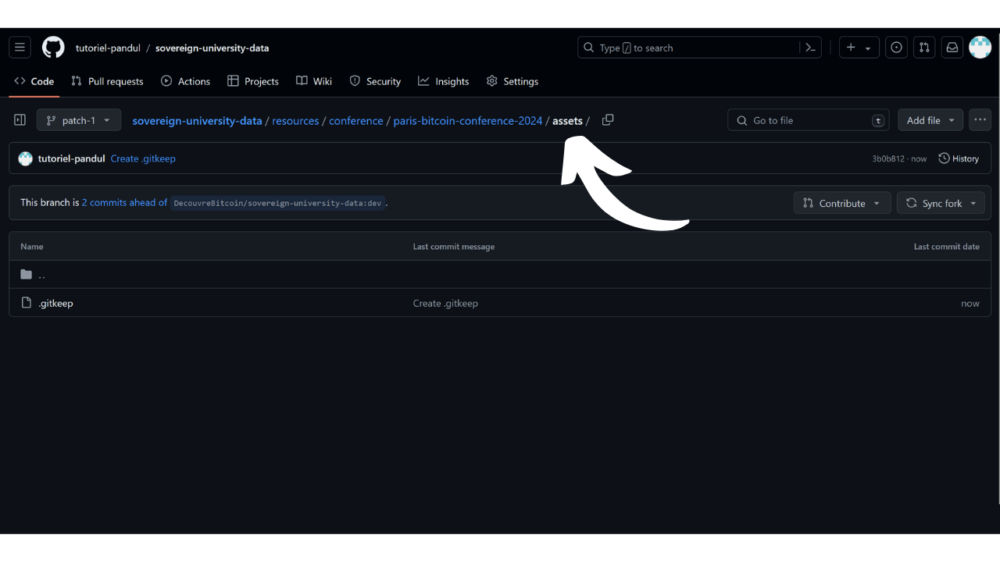
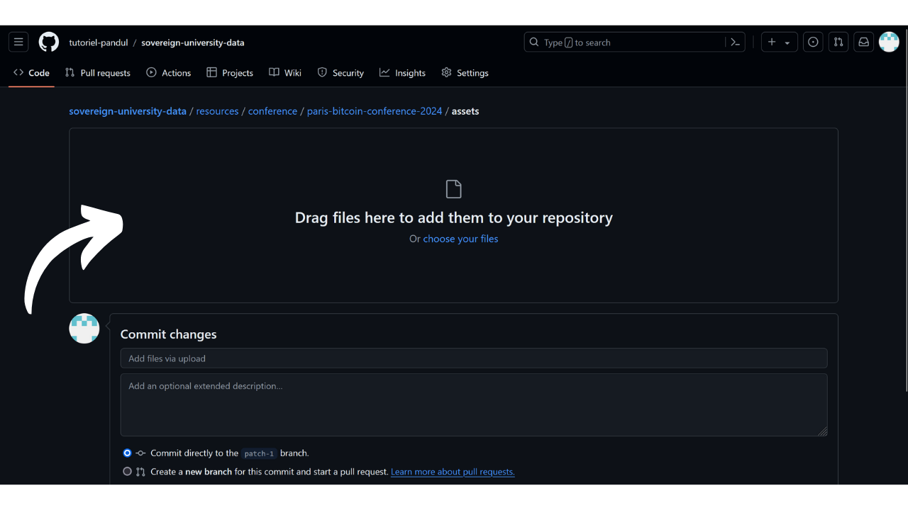
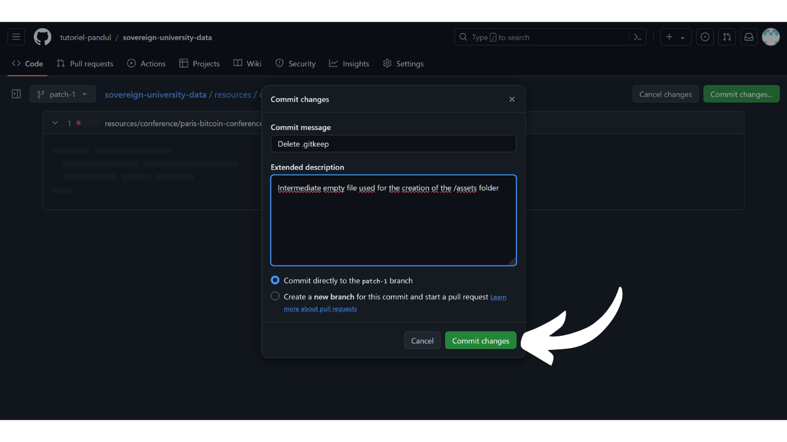

La misión de PlanB es proporcionar recursos educativos de primer nivel sobre Bitcoin en tantos idiomas como sea posible. Todo el contenido publicado en el sitio es de código abierto y alojado en GitHub, ofreciendo a cualquier persona la oportunidad de contribuir al enriquecimiento de la plataforma.

Si quieres agregar una conferencia sobre Bitcoin al sitio de la Red PlanB y aumentar la visibilidad de tu evento, ¿pero no sabes cómo? ¡Este tutorial es para ti!

- Primero, necesitas tener una cuenta en GitHub. Si no sabes cómo crear una cuenta, hemos hecho [un tutorial detallado para guiarte](https://planb.network/tutorials/others/create-github-account).
- Ve a [el repositorio de GitHub de PlanB dedicado a datos](https://github.com/PlanB-Network/bitcoin-educational-content/tree/dev/resources/conference) en la sección `resources/conference/`:

- Haz clic en la parte superior derecha en el botón `Add file`, luego en `Create new file`:

- Si nunca has contribuido al contenido de la Red PlanB antes, necesitarás crear tu fork del repositorio original. Hacer un fork de un repositorio significa crear una copia de ese repositorio en tu propia cuenta de GitHub, lo que te permite trabajar en el proyecto sin afectar el repositorio original. Haz clic en el botón `Fork this repository`:

- Luego llegarás a la página de edición de GitHub:

- Crea una carpeta para tu conferencia. Para hacerlo, en el cuadro `Name your file...`, escribe el nombre de tu conferencia en minúsculas con guiones en lugar de espacios. Por ejemplo, si tu conferencia se llama "Paris Bitcoin Conference", deberías anotar `paris-bitcoin-conference`. También agrega el año de tu conferencia, por ejemplo: `paris-bitcoin-conference-2024`:

- Para validar la creación de la carpeta, simplemente anota una barra inclinada después de tu nombre en el mismo cuadro, por ejemplo: `paris-bitcoin-conference-2024/`. Agregar una barra inclinada crea automáticamente una carpeta en lugar de un archivo:

- En esta carpeta, crearás un primer archivo YAML llamado `events.yml`:

- Llena este archivo con información sobre tu conferencia usando esta plantilla:

```yaml
- start_date:
  end_date:
  address_line_1:
  address_line_2: 
  address_line_3: 
  name:
  builder:
  type: conference
  book_online: false
  book_in_person: false
  price_dollars: 0
  description:
  language: 
    - 
  links:
    website:
    replay_url:    
    live_url :
  tags: 
    - 
``` 

Por ejemplo, tu archivo YAML podría lucir así:

```yaml
- start_date: 2024-08-15
  end_date: 2024-08-18
  address_line_1: París, Francia
  address_line_2: 
  address_line_3: 
  name: Paris Bitcoin Conference 2024
  builder: Paris Bitcoin Conference
  type: conference
  book_online: false
  book_in_person: false
  price_dollars: 0
  description: ¡La conferencia de Bitcoin más grande de Francia con más de 8,000 participantes cada año!
  language:
- fr    - en
    - es
    - it
  enlaces:
    sitio_web: https://paris.bitcoin.fr/conference
    url_repetición:
    url_en_vivo:
  etiquetas: 
    - Bitcoiner
    - General
    - Internacional
```

Si todavía no tienes un identificador de "*constructor*" para tu organización, puedes añadirlo [siguiendo este otro tutorial](https://planb.network/tutorials/others/add-builder).

- Una vez que hayas terminado de hacer cambios en este archivo, guárdalos haciendo clic en el botón `Commit changes...`:

- Añade un título para tus cambios, así como una breve description:

- Haz clic en el botón verde `Propose changes`:

- Luego llegarás a una página que resume todos tus cambios:

- Haz clic en la foto de perfil de tu GitHub en la parte superior derecha, luego en `Your Repositories`:

- Selecciona tu bifurcación del repositorio de PlanB Network:

- Deberías ver una notificación en la parte superior de la ventana con tu nueva rama. Probablemente se llame `patch-1`. Haz clic en ella:

- Ahora estás en tu rama de trabajo:

- Regresa a la carpeta `resources/conference/` y selecciona la carpeta de tu conferencia que acabas de crear en el commit anterior:

- En la carpeta de tu conferencia, haz clic en el botón `Add file`, luego en `Create new file`:

- Nombra esta nueva carpeta `assets` y confirma su creación poniendo una barra `/` al final:

- En esta carpeta `assets`, crea un archivo llamado `.gitkeep`:

- Haz clic en el botón `Commit changes...`:

- Deja el título del commit como predeterminado, y asegúrate de que la casilla `Commit directly to the patch-1 branch` esté marcada, luego haz clic en `Commit changes`:

- Regresa a la carpeta `assets`:

- Haz clic en el botón `Add file`, luego en `Upload files`: 
- Se abrirá una nueva página. Arrastra y suelta una imagen que represente tu conferencia y que se mostrará en el sitio de PlanB Network:

- Puede ser el logo, una miniatura o incluso un póster:

- Una vez que la imagen esté subida, verifica que la casilla `Commit directly to the patch-1 branch` esté marcada, luego haz clic en `Commit changes`:

- Ten cuidado, tu imagen debe llamarse `thumbnail` y debe estar en formato `.webp`. Por lo tanto, el nombre completo del archivo debería ser: `thumbnail.webp`:

- Regresa a tu carpeta `assets` y haz clic en el archivo intermedio `.gitkeep`:

- Una vez en el archivo, haz clic en los 3 pequeños puntos en la parte superior derecha y luego en `Delete file`:
- Verifica que sigues en la misma rama de trabajo, luego haz clic en el botón `Commit changes`:

- Añade un título y una descripción a tu commit, luego haz clic en `Commit changes`:

- Regresa a la raíz de tu repositorio:

- Deberías ver un mensaje indicando que tu rama ha sufrido cambios. Haz clic en el botón `Compare & pull request`:

- Añade un título claro y una descripción a tu PR:

- Haz clic en el botón `Create pull request`:

¡Felicidades! Tu PR ha sido creado exitosamente. Un administrador lo revisará ahora y, si todo está en orden, lo fusionará en el repositorio principal de PlanB Network. Deberías ver tu evento aparecer en el sitio web unos días después.

Asegúrate de seguir el progreso de tu PR. Un administrador puede dejar un comentario solicitando información adicional. Mientras tu PR no esté validado, puedes consultarlo en la pestaña `Pull requests` en el repositorio de GitHub de PlanB Network:

¡Muchas gracias por tu valiosa contribución! :)
