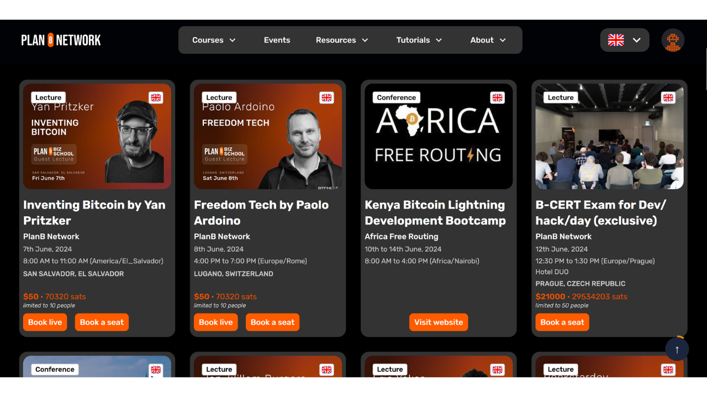
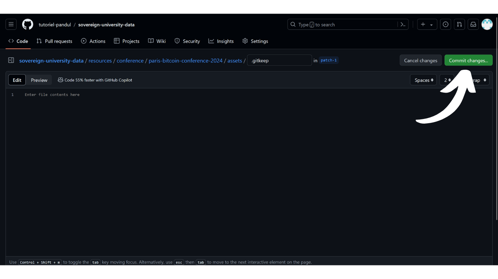
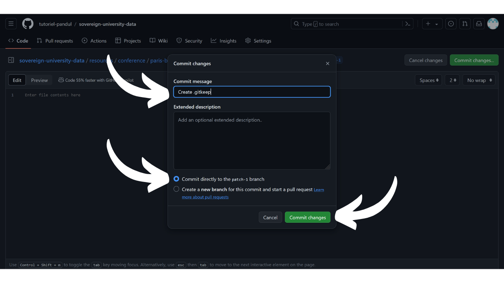
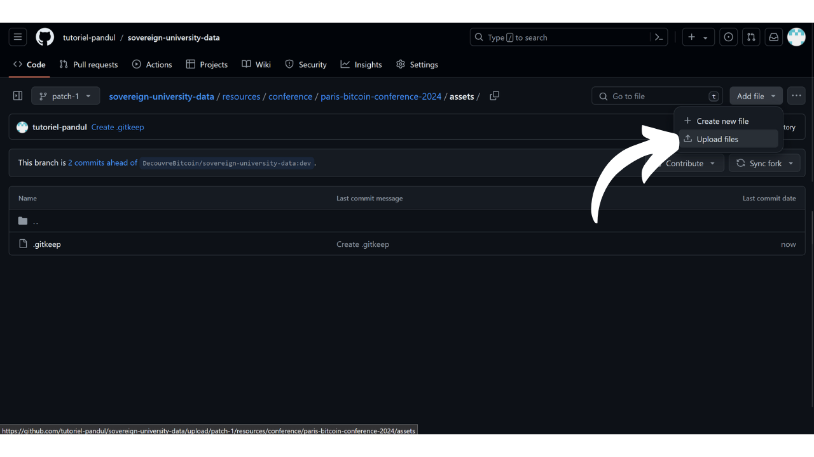
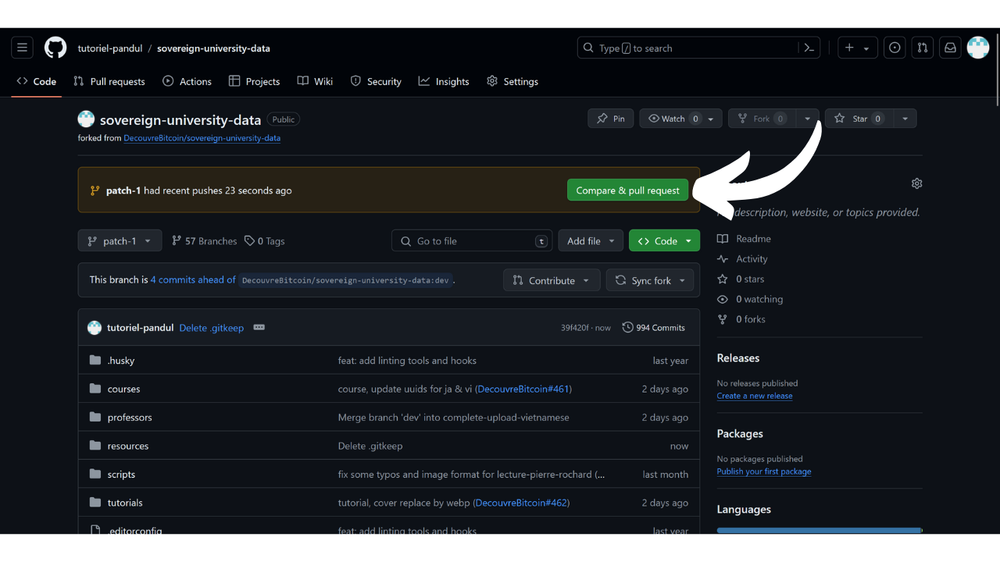

PlanBのミッションは、できるだけ多くの言語でBitcoinに関する最高級の教育リソースを提供することです。サイトに公開されているすべてのコンテンツはオープンソースであり、GitHubにホストされているため、誰でもプラットフォームの充実に貢献する機会を得ることができます。

PlanB NetworkサイトにBitcoinカンファレンスを追加してイベントの可視性を高めたいけれど、方法がわからない場合、このチュートリアルはあなたのためのものです！

- まず、GitHubにアカウントを持っている必要があります。アカウントの作成方法がわからない場合は、[詳細なチュートリアルを用意しています](https://planb.network/tutorials/others/create-github-account)。
- `resources/conference/`セクションにある[PlanB専用のデータGitHubリポジトリ](https://github.com/DecouvreBitcoin/sovereign-university-data/tree/dev/resources/conference)にアクセスしてください：

- 右上の`Add file`ボタンをクリックし、次に`Create new file`をクリックします：

- もしPlanB Networkのコンテンツに以前から貢献したことがない場合、オリジナルのリポジトリのフォークを作成する必要があります。リポジトリをフォークするとは、そのリポジトリのコピーを自分のGitHubアカウント上に作成することで、オリジナルのリポジトリに影響を与えることなくプロジェクトに取り組むことができるようになります。`Fork this repository`ボタンをクリックしてください：

- そうすると、GitHubの編集ページに到着します：

- あなたのカンファレンス用のフォルダを作成します。これを行うには、`Name your file...`ボックスに、スペースの代わりにダッシュを使用して、カンファレンスの名前を小文字で記入します。例えば、カンファレンスが"Paris Bitcoin Conference"と呼ばれている場合、`paris-bitcoin-conference`と記入する必要があります。また、カンファレンスの年も追加してください。例：`paris-bitcoin-conference-2024`：

- フォルダの作成を確定するには、同じボックスで名前の後にスラッシュを記入するだけです。例：`paris-bitcoin-conference-2024/`。スラッシュを追加すると、自動的にフォルダが作成され、ファイルではなくなります：

- このフォルダ内に、`events.yml`という名前の最初のYAMLファイルを作成します：

- このテンプレートを使用して、カンファレンスに関する情報をファイルに記入します：

```yaml
- start_date:
  end_date:
  address_line_1:
  address_line_2: 
  address_line_3: 
  name:
  builder:
  type: conference
  book_online: false
  book_in_person: false
  price_dollars: 0
  description:
  language: 
    - 
  links:
    website:
    replay_url:    
    live_url :
  tags: 
    - 
```

例えば、あなたのYAMLファイルは以下のようになるかもしれません：

```yaml
- start_date: 2024-08-15
  end_date: 2024-08-18
  address_line_1: Paris, France
  address_line_2: 
  address_line_3: 
  name: Paris Bitcoin Conference 2024
  builder: Paris Bitcoin Conference
  type: conference
  book_online: false
  book_in_person: false
  price_dollars: 0
  description: フランスで最大のBitcoinカンファレンスで、毎年8,000人以上の参加者がいます！
  language:
- fr    - en
    - es
    - it
  リンク:
    website: https://paris.bitcoin.fr/conference
    replay_url:
    live_url :
  タグ: 
    - Bitcoiner
    - General
    - International
```

もしまだあなたの組織に「*builder*」という識別子がない場合は、[この他のチュートリアルに従って追加する](https://planb.network/tutorials/others/add-builder)ことができます。

- このファイルへの変更が完了したら、`Commit changes...`ボタンをクリックして保存してください：

- 変更のタイトルと短い説明を追加してください：

- 緑色の`Propose changes`ボタンをクリックしてください：

- そうすると、あなたの変更をすべてまとめたページに到着します：

- 右上のGitHubプロフィール画像をクリックし、`Your Repositories`を選択してください：

- PlanB Networkリポジトリのフォークを選択してください：

- 新しいブランチに関する通知がウィンドウの上部に表示されるはずです。おそらく`patch-1`と呼ばれています。それをクリックしてください：

- これで、作業ブランチにいます：

- `resources/conference/`フォルダに戻り、前のコミットで作成したあなたのカンファレンスのフォルダを選択してください：

- あなたのカンファレンスのフォルダ内で、`Add file`ボタンをクリックし、`Create new file`を選択してください：

- この新しいフォルダに`assets`と名付け、スラッシュ`/`を末尾に付けてその作成を確認してください：

- この`assets`フォルダ内に、`.gitkeep`というファイルを作成してください：

- `Commit changes...`ボタンをクリックしてください：

- コミットタイトルはデフォルトのままにし、`Commit directly to the patch-1 branch`ボックスがチェックされていることを確認し、`Commit changes`をクリックしてください：

- `assets`フォルダに戻ってください：

- `Add file`ボタンをクリックし、`Upload files`を選択してください： 
- 新しいページが開きます。PlanB Networkサイトに表示されるあなたのカンファレンスを代表する画像をドラッグアンドドロップしてください：

- それはロゴ、サムネイル、またはポスターでも構いません：

- 画像がアップロードされたら、`Commit directly to the patch-1 branch`ボックスがチェックされていることを確認し、`Commit changes`をクリックしてください：

- 注意してください、あなたの画像は`thumbnail`と名付けられ、`.webp`フォーマットでなければなりません。したがって、完全なファイル名は`thumbnail.webp`であるべきです：

- `assets`フォルダに戻り、中間ファイル`.gitkeep`をクリックしてください：

- ファイル上にいるとき、右上の3つの小さな点をクリックし、`Delete file`を選択してください：
- 現在作業中のブランチにまだいることを確認し、`Commit changes`ボタンをクリックしてください：

- コミットにタイトルと説明を追加し、`Commit changes`をクリックしてください：

- リポジトリのルートに戻ってください：

- ブランチに変更があったことを示すメッセージが表示されるはずです。`Compare & pull request`ボタンをクリックしてください：

- PRに明確なタイトルと説明を追加してください：

- `Create pull request`ボタンをクリックしてください：

おめでとうございます！PRは正常に作成されました。管理者がこれを確認し、すべてが順調であれば、PlanB Networkのメインリポジトリにマージされます。数日後には、ウェブサイト上であなたのイベントが表示されるはずです。

PRの進行状況を確認し続けてください。管理者が追加情報を求めるコメントを残すことがあります。PRが承認されるまで、PlanB Network GitHubリポジトリの`Pull requests`タブでそれを確認することができます：

貴重な貢献をいただき、ありがとうございます！ :)
