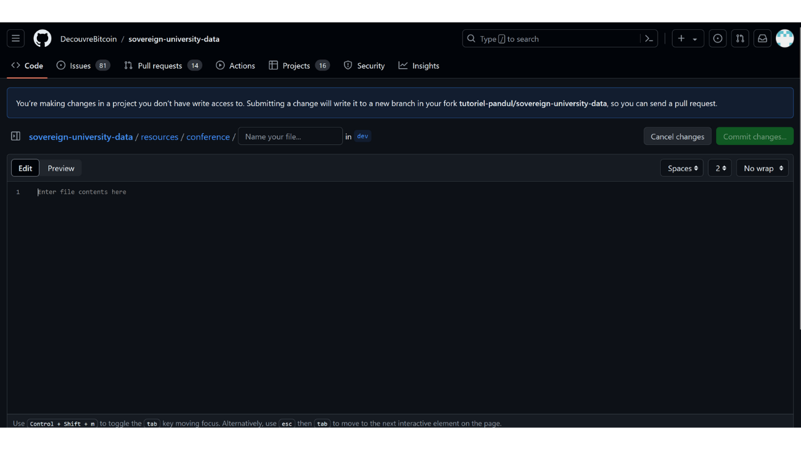
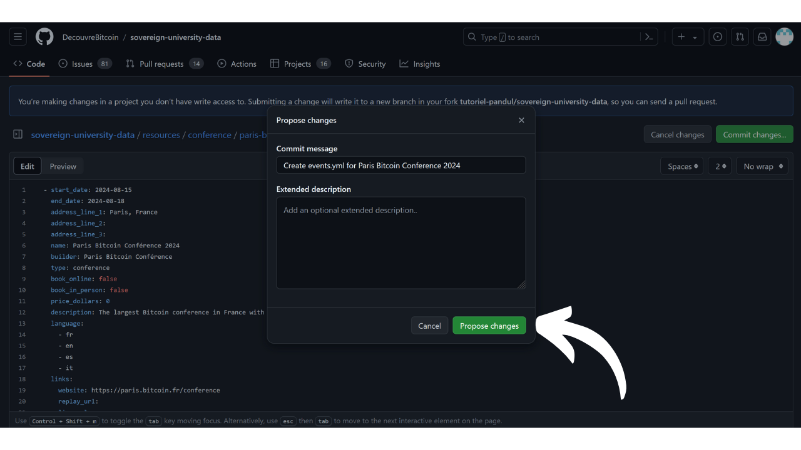
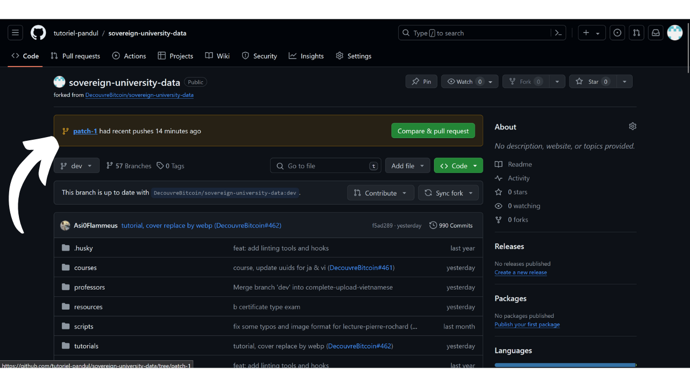
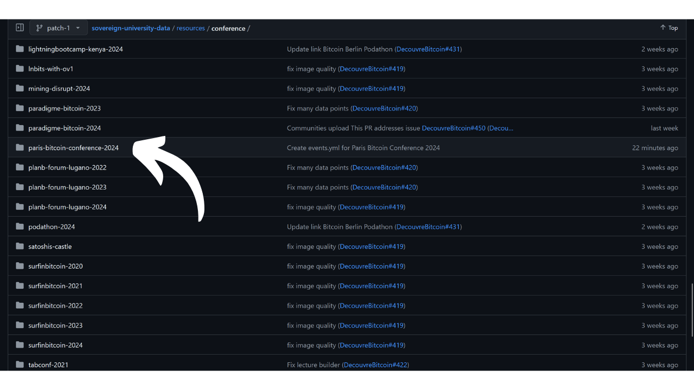

Sứ mệnh của PlanB là cung cấp nguồn tài nguyên giáo dục hàng đầu về Bitcoin bằng càng nhiều ngôn ngữ khác nhau càng tốt. Tất cả nội dung được xuất bản trên trang web đều là mã nguồn mở và được lưu trữ trên GitHub, cung cấp cơ hội cho bất kỳ ai đóng góp vào việc làm phong phú nền tảng.

Nếu bạn muốn thêm một hội nghị Bitcoin vào trang web Mạng lưới PlanB và tăng độ nhìn thấy cho sự kiện của mình, nhưng không biết làm thế nào? Hướng dẫn này dành cho bạn!

- Đầu tiên, bạn cần phải có một tài khoản trên GitHub. Nếu bạn không biết cách tạo tài khoản, chúng tôi đã tạo [một hướng dẫn chi tiết để hướng dẫn bạn](https://planb.network/tutorials/others/create-github-account).
- Truy cập vào [kho lưu trữ GitHub của PlanB dành riêng cho dữ liệu](https://github.com/DecouvreBitcoin/sovereign-university-data/tree/dev/resources/conference) trong phần `resources/conference/`:

- Nhấp vào nút `Add file` ở góc trên bên phải, sau đó chọn `Create new file`:

- Nếu bạn chưa bao giờ đóng góp vào nội dung của Mạng lưới PlanB trước đây, bạn sẽ cần tạo bản sao (fork) của kho lưu trữ gốc. Fork một kho lưu trữ có nghĩa là tạo một bản sao của kho lưu trữ đó trên tài khoản GitHub của bạn, cho phép bạn làm việc trên dự án mà không ảnh hưởng đến kho lưu trữ gốc. Nhấp vào nút `Fork this repository`:

- Bạn sẽ được chuyển đến trang chỉnh sửa GitHub:

- Tạo một thư mục cho hội nghị của bạn. Để làm điều này, trong ô `Name your file...`, viết tên hội nghị của bạn bằng chữ thường với dấu gạch ngang thay cho khoảng trắng. Ví dụ, nếu hội nghị của bạn có tên là "Paris Bitcoin Conference", bạn nên ghi `paris-bitcoin-conference`. Cũng thêm năm của hội nghị của bạn, ví dụ: `paris-bitcoin-conference-2024`:

- Để xác nhận việc tạo thư mục, chỉ cần ghi một dấu gạch chéo sau tên của bạn trong cùng một ô, ví dụ: `paris-bitcoin-conference-2024/`. Thêm một dấu gạch chéo tự động tạo một thư mục thay vì một tệp:

- Trong thư mục này, bạn sẽ tạo một tệp YAML đầu tiên có tên `events.yml`:

- Điền thông tin về hội nghị của bạn vào tệp này bằng cách sử dụng mẫu này:

```yaml
- start_date:
  end_date:
  address_line_1:
  address_line_2: 
  address_line_3: 
  name:
  builder:
  type: conference
  book_online: false
  book_in_person: false
  price_dollars: 0
  description:
  language: 
    - 
  links:
    website:
    replay_url:    
    live_url :
  tags: 
    - 
```

Ví dụ, tệp YAML của bạn có thể trông như thế này:

```yaml
- start_date: 2024-08-15
  end_date: 2024-08-18
  address_line_1: Paris, France
  address_line_2: 
  address_line_3: 
  name: Hội Nghị Bitcoin Paris 2024
  builder: Hội Nghị Bitcoin Paris
  type: conference
  book_online: false
  book_in_person: false
  price_dollars: 0
  description: Hội nghị Bitcoin lớn nhất tại Pháp với hơn 8,000 người tham gia mỗi năm!
  language:
- fr    - en
    - es
    - it
  links:
    website: https://paris.bitcoin.fr/conference
    replay_url:
    live_url :
  tags: 
    - Bitcoiner
    - General
    - International
```

Nếu tổ chức của bạn chưa có một "*builder*" identifier, bạn có thể thêm nó [bằng cách theo dõi hướng dẫn khác này](https://planb.network/tutorials/others/add-builder).

- Sau khi bạn hoàn thành việc chỉnh sửa tệp này, lưu chúng bằng cách nhấp vào nút `Commit changes...`:

- Thêm một tiêu đề cho các thay đổi của bạn, cũng như một mô tả ngắn gọn:

- Nhấp vào nút màu xanh `Propose changes`:

- Bạn sẽ đến trang tóm tắt tất cả các thay đổi của bạn:

- Nhấp vào ảnh đại diện GitHub của bạn ở góc trên bên phải, sau đó vào `Your Repositories`:

- Chọn fork của bạn từ kho lưu trữ PlanB Network:

- Bạn sẽ thấy một thông báo ở đầu cửa sổ với nhánh mới của bạn. Có thể nó được gọi là `patch-1`. Nhấp vào nó:

- Bây giờ bạn đang ở trên nhánh làm việc của mình:

- Quay lại thư mục `resources/conference/` và chọn thư mục của hội nghị mà bạn vừa tạo trong commit trước:

- Trong thư mục của hội nghị của bạn, nhấp vào nút `Add file`, sau đó vào `Create new file`:

- Đặt tên thư mục mới này là `assets` và xác nhận việc tạo nó bằng cách đặt một dấu gạch chéo `/` ở cuối:

- Trong thư mục `assets` này, tạo một tệp tên là `.gitkeep`:

- Nhấp vào nút `Commit changes...`:

- Giữ nguyên tiêu đề commit mặc định, và đảm bảo rằng ô `Commit directly to the patch-1 branch` được chọn, sau đó nhấp vào `Commit changes`:

- Quay lại thư mục `assets`:

- Nhấp vào nút `Add file`, sau đó vào `Upload files`: 
- Một trang mới sẽ mở ra. Kéo và thả một hình ảnh đại diện cho hội nghị của bạn và sẽ được hiển thị trên trang web PlanB Network:

- Đó có thể là logo, một hình thu nhỏ, hoặc thậm chí một poster:

- Một khi hình ảnh được tải lên, kiểm tra xem ô `Commit directly to the patch-1 branch` đã được đánh dấu chưa, sau đó nhấp vào `Commit changes`:

- Hãy cẩn thận, hình ảnh của bạn phải được đặt tên là `thumbnail` và phải ở định dạng `.webp`. Tên tệp đầy đủ nên là: `thumbnail.webp`:

- Quay lại thư mục `assets` của bạn và nhấp vào tệp trung gian `.gitkeep`:

- Một khi đã ở trên tệp, nhấp vào 3 chấm nhỏ ở góc trên bên phải sau đó vào `Delete file`:
- Kiểm tra xem bạn vẫn đang ở trên cùng một nhánh làm việc, sau đó nhấp vào nút `Commit changes`:

- Thêm một tiêu đề và mô tả cho lần commit của bạn, sau đó nhấp vào `Commit changes`:

- Quay lại gốc của kho lưu trữ của bạn:

- Bạn sẽ thấy một thông báo cho biết nhánh của bạn đã trải qua những thay đổi. Nhấp vào nút `Compare & pull request`:

- Thêm một tiêu đề rõ ràng và mô tả cho PR của bạn:

- Nhấp vào nút `Create pull request`:

Xin chúc mừng! PR của bạn đã được tạo thành công. Một quản trị viên giờ đây sẽ kiểm tra nó và, nếu mọi thứ đều ổn, sẽ hợp nhất nó vào kho lưu trữ chính của Mạng lưới PlanB. Bạn sẽ thấy sự kiện của mình xuất hiện trên trang web vài ngày sau.

Hãy chắc chắn theo dõi tiến trình của PR của bạn. Một quản trị viên có thể để lại bình luận yêu cầu thông tin bổ sung. Miễn là PR của bạn chưa được xác nhận, bạn có thể xem nó trong tab `Pull requests` trên kho lưu trữ GitHub của Mạng lưới PlanB:

Cảm ơn bạn rất nhiều vì đã đóng góp quý báu của mình! :)
