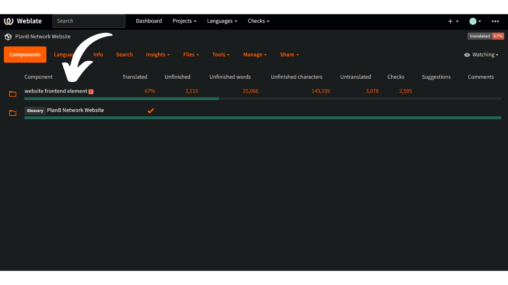
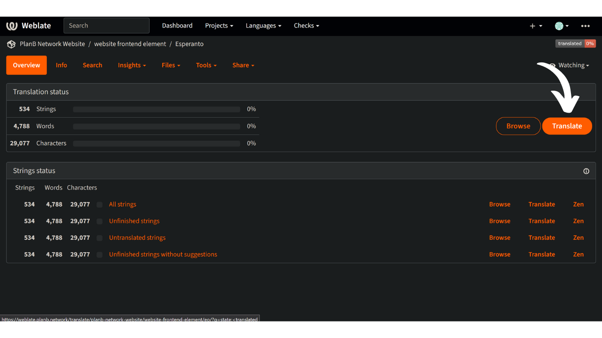

Die Mission von PlanB ist es, erstklassige Bildungsressourcen über Bitcoin in so vielen Sprachen wie möglich bereitzustellen. Alle auf der Website veröffentlichten Inhalte sind Open-Source und werden auf GitHub gehostet, was es jedem ermöglicht, an der Bereicherung der Plattform teilzunehmen. Beiträge können verschiedene Formen annehmen: Korrigieren und Korrekturlesen bestehender Texte, Übersetzen in andere Sprachen, Aktualisieren von Informationen oder Erstellen neuer Tutorials, die auf unserer Website noch nicht verfügbar sind.

Auf PlanB haben wir bereits viele Sprachen auf der Website verfügbar, und wir arbeiten kontinuierlich daran, neue hinzuzufügen. Um das Frontend effizient zu übersetzen, verwenden wir das Weblate-Tool, das die Zusammenarbeit erleichtert und Übersetzungen organisiert. Es ist ein sehr einfaches Tool, um damit zu beginnen.

Wenn Ihre Muttersprache noch nicht auf unserer Website verfügbar ist und Sie durch Hinzufügen dieser beitragen möchten, ist dieses Tutorial für Sie!

## Überprüfung der Verfügbarkeit einer Sprache im PlanB Netzwerk

Der erste Schritt besteht darin zu überprüfen, ob Ihre Sprache nicht bereits zu denen gehört, an denen wir arbeiten.

- Gehen Sie zu [unserer Weblate-Plattform](https://weblate.planb.network/projects/planb-network-website/):

- Im Menü `Website frontend element` finden Sie eine Liste aller Sprachen, an denen wir arbeiten:

Wenn Ihre Sprache in dieser Liste ist, müssen Sie sie nicht erneut hinzufügen. Um zu einer bestehenden Sprache beizutragen, haben wir [ein weiteres Tutorial erstellt, das Sie entdecken können](https://planb.network/tutorials/others/translate-front-weblate).

Wenn Ihre Sprache nicht dabei ist, folgen Sie dem untenstehenden Tutorial, um sie hinzuzufügen.

## Hinzufügen einer neuen Sprache zum PlanB Netzwerk

- Der erste Schritt besteht darin, ein Konto bei Weblate zu erstellen. Wenn Sie nicht wissen, wie das geht, können Sie [unserem detaillierten Leitfaden folgen](https://planb.network/tutorials/others/translate-front-weblate).
- Sobald Ihr Konto erstellt ist, gehen Sie zum Menü `Website frontend element` und wählen Sie die Registerkarte `Languages`:

- Klicken Sie auf das `+` links im Fenster:

- Öffnen Sie die Dropdown-Liste und wählen Sie die Sprache aus, die Sie im PlanB Netzwerk erstellen möchten. Wenn die Sprache, die Sie suchen, nicht in der Dropdown-Liste verfügbar ist, können Sie direkt @asi0_flammeus auf Telegram kontaktieren, damit sie diese manuell erstellen können:

- Klicken Sie auf den Button `Start new translation`:

- Sie gelangen dann auf die Übersetzungsverwaltungsseite für Ihre Sprache:

- Um sofort mit der Übersetzung des Frontends zu beginnen, klicken Sie auf den Button `Translate`: 
Um durch den Übersetzungsprozess geführt zu werden, schauen Sie sich [unser spezielles Tutorial zu diesem Thema an](https://planb.network/tutorials/others/translate-front-weblate)!

Herzlichen Glückwunsch, Sie haben den Prozess der Übersetzung der PlanB Netzwerkseite in eine neue Sprache eingeleitet! Sie können beginnen, das gesamte Frontend über Weblate zu übersetzen. Dies umfasst alle Texte auf der Website, mit Ausnahme von Bildungsinhalten (Kurse, Tutorials...), für die wir eine andere halbautomatisierte Humans x AI-Methode verwenden.
Als Nächstes können Sie @asi0_flammeus auf Telegram kontaktieren, der Ihnen dabei helfen wird, einige Kurse zu überprüfen, die automatisch mit ihrem Modell übersetzt wurden. Wenn diese Inhalte als zufriedenstellend angesehen werden, können Sie fortfahren, alle anderen Inhalte auf der Website (Kurse, Tutorials...) zu überprüfen. Sobald diese Schritte abgeschlossen sind, können wir in Erwägung ziehen, die neue Sprache offiziell in die PlanB Network-Website zu integrieren, was es allen Sprechern Ihrer Sprache ermöglichen wird, ohne Barrieren auf qualitativ hochwertige Inhalte über Bitcoin zuzugreifen.

Ein großes Dankeschön für Ihren wertvollen Beitrag! :)