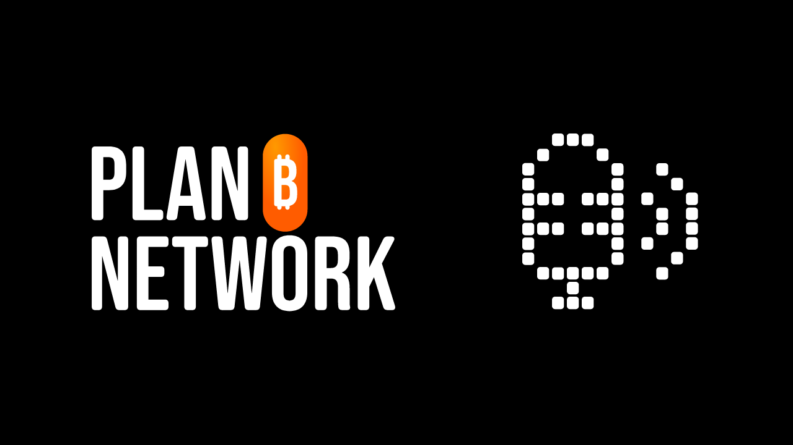
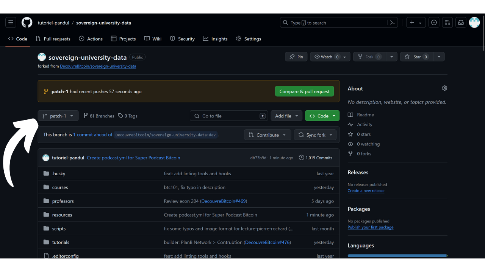
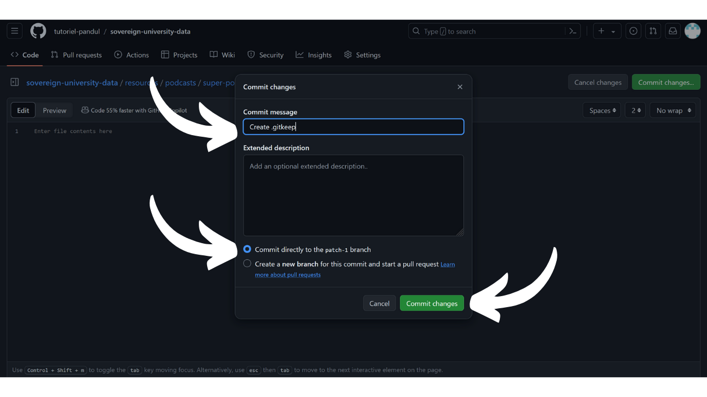

Die Mission von PlanB ist es, erstklassige Bildungsressourcen über Bitcoin in möglichst vielen Sprachen bereitzustellen. Alle Inhalte, die auf der Website veröffentlicht werden, sind Open-Source und werden auf GitHub gehostet, was es jedem ermöglicht, an der Bereicherung der Plattform teilzunehmen.

Möchten Sie einen Bitcoin-Podcast zum PlanB Netzwerk hinzufügen und die Sichtbarkeit Ihrer Show erhöhen, wissen aber nicht wie? Dieses Tutorial ist für Sie!

- Zuerst benötigen Sie ein GitHub-Konto. Wenn Sie nicht wissen, wie man eines erstellt, haben wir [ein detailliertes Tutorial erstellt, um Sie anzuleiten](https://planb.network/tutorials/others/create-github-account).
- Gehen Sie zu [dem GitHub-Repository von PlanB, das den Daten gewidmet ist](https://github.com/PlanB-Network/bitcoin-educational-content/tree/dev/resources/podcasts) im Abschnitt `resources/podcasts/`:

- Klicken Sie oben rechts auf den Button `Add file`, dann auf `Create new file`:

- Wenn Sie noch nie zum Inhalt des PlanB Netzwerks beigetragen haben, müssen Sie Ihren Fork des Original-Repositorys erstellen. Ein Repository zu forken bedeutet, eine Kopie dieses Repositorys auf Ihrem eigenen GitHub-Konto zu erstellen, was es Ihnen ermöglicht, am Projekt zu arbeiten, ohne das Original-Repository zu beeinflussen. Klicken Sie auf den Button `Fork this repository`:

- Sie gelangen dann zur GitHub-Bearbeitungsseite:

- Erstellen Sie einen Ordner für Ihren Podcast. Um dies zu tun, schreiben Sie in das Feld `Name your file...` den Namen Ihres Podcasts in Kleinbuchstaben mit Bindestrichen anstelle von Leerzeichen. Zum Beispiel, wenn Ihre Show "Super Podcast Bitcoin" heißt, sollten Sie `super-podcast-bitcoin` schreiben:

- Um die Erstellung des Ordners zu bestätigen, fügen Sie einfach einen Schrägstrich nach dem Namen Ihres Podcasts in dasselbe Feld ein, zum Beispiel: `super-podcast-bitcoin/`. Das Hinzufügen eines Schrägstrichs erstellt automatisch einen Ordner anstatt einer Datei:

- In diesem Ordner erstellen Sie eine erste YAML-Datei mit dem Namen `podcast.yml`:

- Füllen Sie diese Datei mit Informationen über Ihren Podcast anhand dieser Vorlage aus:

```yaml
name: 
host: 
language: 
links:
  podcast: 
  twitter: 
  website: 
description: |
  
tags:
  - 
  - 
contributors:
  - 
```

Hier sind die Details, die für jedes Feld ausgefüllt werden müssen:

- **`name`**: Geben Sie den Namen Ihres Podcasts an.
- **`host`**: Listen Sie die Namen oder Pseudonyme der Sprecher oder des Gastgebers des Podcasts auf. Jeder Name sollte durch ein Komma getrennt werden.
- **`language`**: Geben Sie den Sprachcode der Sprache an, in der Ihr Podcast gesprochen wird. Zum Beispiel für Englisch, notieren Sie `en`, für Italienisch `it`...

- **`links`**: Stellen Sie Links zu Ihrem Inhalt bereit. Sie haben zwei Optionen:
	- `podcast`: der Link zu Ihrem Podcast,
	- `twitter`: der Link zum Twitter-Profil des Podcasts oder der Organisation, die ihn produziert,
	- `website`: der Link zur Website des Podcasts oder der Organisation, die ihn produziert.
- **`description`**: Fügen Sie einen kurzen Absatz hinzu, der Ihren Podcast beschreibt. Die Beschreibung muss in der gleichen Sprache sein, wie im Feld `language:` angegeben.
- **`tags`**: Fügen Sie zwei Tags hinzu, die mit Ihrem Podcast in Verbindung stehen. Beispiele:
    - `bitcoin`
    - `technologie`
    - `wirtschaft`
    - `bildung`...

- **`contributors`**: Erwähnen Sie Ihre Mitwirkenden-ID, falls Sie eine haben.

Zum Beispiel könnte Ihre YAML-Datei so aussehen:

```yaml
name: Super Podcast Bitcoin
host: Rogzy, JohnOnChain, Lounes, Fanis, Ajlex, Guillaume, Pantamis, Sosthene, Loic
language: en
links:
  podcast: https://podcasts.apple.com/us/podcast/decouvrebitcoin-replay/id1693844092
  twitter: https://twitter.com/decouvrebitcoin
  website: https://decouvrebitcoin.fr
description: |
  Super Podcast Bitcoin ist eine technische LIVE-Sitzung, die einmal pro Woche auf Twitter stattfindet, um tief in das Bitcoin-Protokoll, Layer-Zwei-Lösungen und alles, was den Verstand begeistert, einzutauchen. Unsere Gastgeber Lounes, Pantamis, Loïc und Sosthene werden Ihre Fragen beantworten und die technischste Show über Bitcoin weltweit bieten.

tags:
  - bitcoin
  - technologie
contributors:
  - rabbit-hole
```


- Sobald Sie mit den Änderungen an dieser Datei fertig sind, speichern Sie diese, indem Sie auf den `Commit changes...`-Button klicken:

- Fügen Sie einen Titel für Ihre Änderungen hinzu sowie eine kurze Beschreibung:

- Klicken Sie auf den grünen `Propose changes`-Button:

- Sie gelangen dann auf eine Seite, die alle Ihre Änderungen zusammenfasst:

- Klicken Sie oben rechts auf Ihr GitHub-Profilbild und dann auf `Your Repositories`:

- Wählen Sie Ihren Fork des PlanB Network-Repositorys aus:

- Sie sollten eine Benachrichtigung am oberen Fensterrand mit Ihrem neuen Branch sehen. Er heißt wahrscheinlich `patch-1`. Klicken Sie darauf:

- Sie befinden sich jetzt auf Ihrem Arbeitsbranch:

- Gehen Sie zurück zum Ordner `resources/podcast/` und wählen Sie den Podcast-Ordner aus, den Sie im vorherigen Commit erstellt haben: 
- Klicken Sie in Ihrem Podcast-Ordner auf den `Add file`-Button und dann auf `Create new file`:

- Benennen Sie diesen neuen Ordner `assets` und bestätigen Sie dessen Erstellung, indem Sie am Ende ein Schrägstrich `/` hinzufügen:

- Erstellen Sie in diesem `assets`-Ordner eine Datei mit dem Namen `.gitkeep`:

- Klicken Sie auf den `Commit changes...`-Button:

- Belassen Sie den Commit-Titel wie vorgegeben und stellen Sie sicher, dass das Kästchen `Commit directly to the patch-1 branch` angekreuzt ist, dann klicken Sie auf `Commit changes`:

- Kehren Sie zum `assets`-Ordner zurück:

- Klicken Sie auf den `Add file`-Button und dann auf `Upload files`:

- Eine neue Seite wird geöffnet. Ziehen Sie Ihr Podcast-Logo in den Bereich. Dieses Bild wird auf der PlanB Network-Seite angezeigt: 
- Achten Sie darauf, dass das Bild quadratisch sein muss, um am besten auf unsere Website zu passen:

- Sobald das Bild hochgeladen ist, überprüfen Sie, ob das Kästchen `Commit directly to the patch-1 branch` angekreuzt ist, dann klicken Sie auf `Commit changes`:

- Achten Sie darauf, dass Ihr Bild `logo` benannt sein muss und im `.webp` Format vorliegen muss. Der vollständige Dateiname sollte daher lauten: `logo.webp`:

- Kehren Sie zu Ihrem `assets` Ordner zurück und klicken Sie auf die Zwischendatei `.gitkeep`:

- Einmal bei der Datei, klicken Sie auf die drei kleinen Punkte oben rechts und dann auf `Delete file`:

- Überprüfen Sie, dass Sie immer noch auf dem gleichen Arbeitsbranch sind, dann klicken Sie auf den `Commit changes` Button:

- Fügen Sie einen Titel und eine Beschreibung zu Ihrem Commit hinzu, dann klicken Sie auf `Commit changes`:

- Gehen Sie zurück zur Wurzel Ihres Repositories:

- Sie sollten eine Nachricht sehen, die darauf hinweist, dass Ihr Branch Änderungen erfahren hat. Klicken Sie auf den `Compare & pull request` Button:

- Fügen Sie einen klaren Titel und eine Beschreibung zu Ihrem PR hinzu:

- Klicken Sie auf den `Create pull request` Button:

Herzlichen Glückwunsch! Ihr PR wurde erfolgreich erstellt. Ein Administrator wird ihn nun überprüfen und, wenn alles in Ordnung ist, in das Hauptrepository von PlanB Network mergen. Sie sollten Ihren Podcast einige Tage später auf der Website sehen.

Bitte stellen Sie sicher, dass Sie den Fortschritt Ihres PR verfolgen. Ein Administrator kann einen Kommentar hinterlassen, der nach zusätzlichen Informationen fragt. Solange Ihr PR nicht validiert ist, können Sie ihn im `Pull requests` Tab im PlanB Network GitHub-Repository sehen:

Vielen Dank für Ihren wertvollen Beitrag! :)