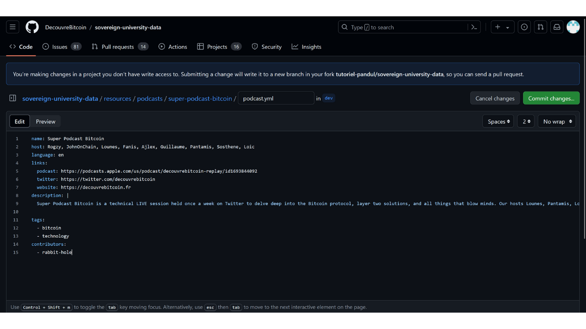
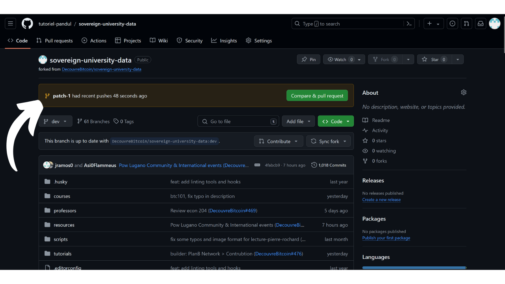

PlanB's mission is to provide top-tier educational resources on Bitcoin in as many languages as possible. All content published on the site is open-source and hosted on GitHub, allowing anyone to participate in enriching the platform.

Are you looking to add a Bitcoin podcast to the PlanB Network site and increase visibility for your show, but don't know how? This tutorial is for you!

- First, you need to have a GitHub account. If you don't know how to create one, we have made [a detailed tutorial to guide you](https://planb.network/tutorials/others/create-github-account).
- Go to [the GitHub repository of PlanB dedicated to data](https://github.com/PlanB-Network/bitcoin-educational-content/tree/dev/resources/podcasts) in the `resources/podcasts/` section:

- Click on the top right on the `Add file` button, then on `Create new file`:

- If you have never contributed to the content of PlanB Network before, you will need to create your fork of the original repository. Forking a repository means creating a copy of that repository on your own GitHub account, allowing you to work on the project without affecting the original repository. Click on the `Fork this repository` button:

- You will then arrive at the GitHub editing page:

- Create a folder for your podcast. To do this, in the `Name your file...` box, write the name of your podcast in lowercase with dashes instead of spaces. For example, if your show is called "Super Podcast Bitcoin", you should write `super-podcast-bitcoin`:

- To validate the creation of the folder, simply add a slash after your podcast name in the same box, for example: `super-podcast-bitcoin/`. Adding a slash automatically creates a folder rather than a file:

- In this folder, you will create a first YAML file named `podcast.yml`:

- Fill in this file with information about your podcast using this template:

```yaml
name: 
host: 
language: 
links:
  podcast: 
  twitter: 
  website: 
description: |
  
tags:
  - 
  - 
contributors:
  - 
```

Here are the details to fill in for each field:

- **`name`**: Indicate the name of your podcast.
- **`host`**: List the names or pseudonyms of the speakers or the host of the podcast. Each name should be separated by a comma.
- **`language`**: Indicate the language code of the language spoken in your podcast. For example, for English, note `en`, for Italian `it`...

- **`links`**: Provide links to your content. You have two options:
	- `podcast`: the link to your podcast,
	- `twitter`: the link to the Twitter profile of the podcast or the organization producing it,
	- `website`: the link to the website of the podcast or the organization producing it.

- **`description`**: Add a short paragraph that describes your podcast. The description must be in the same language as indicated in the `language:` field.

- **`tags`**: Add two tags associated with your podcast. Examples:
    - `bitcoin`
    - `technology`
    - `economy`
    - `education`...

- **`contributors`**: Mention your contributor ID if you have one.

For example, your YAML file could look like this:

```yaml
name: Super Podcast Bitcoin
host: Rogzy, JohnOnChain, Lounes, Fanis, Ajlex, Guillaume, Pantamis, Sosthene, Loic
language: en
links:
  podcast: https://podcasts.apple.com/us/podcast/decouvrebitcoin-replay/id1693844092
  twitter: https://twitter.com/decouvrebitcoin
  website: https://decouvrebitcoin.fr
description: |
  Super Podcast Bitcoin is a technical LIVE session held once a week on Twitter to delve deep into the Bitcoin protocol, layer two solutions, and all things that blow minds. Our hosts Lounes, Pantamis, Loïc, and Sosthene will answer your questions and offer the most technical show on Bitcoin in the world.

tags:
  - bitcoin
  - technology
contributors:
  - rabbit-hole
```



- Once you have finished making changes to this file, save them by clicking on the `Commit changes...` button:

- Add a title for your changes, as well as a short description:

- Click on the green `Propose changes` button:

- You will then arrive on a page that summarizes all your changes:

- Click on your GitHub profile picture at the top right, then on `Your Repositories`:

- Select your fork of the PlanB Network repository:

- You should see a notification at the top of the window with your new branch. It's probably called `patch-1`. Click on it:

- You are now on your working branch:

- Go back to the `resources/podcast/` folder and select the podcast folder you just created in the previous commit: 
- In your podcast folder, click on the `Add file` button, then on `Create new file`:

- Name this new folder `assets` and confirm its creation by adding a slash `/` at the end:

- In this `assets` folder, create a file named `.gitkeep`:

- Click on the `Commit changes...` button:

- Leave the commit title as default, and make sure the `Commit directly to the patch-1 branch` box is checked, then click on `Commit changes`:

- Return to the `assets` folder:

- Click on the `Add file` button, then on `Upload files`:

- A new page will open. Drag and drop your podcast logo into the area. This image will be displayed on the PlanB Network site:

- Be careful, the image must be square, to best fit our website:

- Once the image is uploaded, verify that the `Commit directly to the patch-1 branch` box is checked, then click on `Commit changes`:

- Be careful, your image must be named `logo` and must be in `.webp` format. The full file name should therefore be: `logo.webp`:

- Return to your `assets` folder and click on the intermediary file `.gitkeep`:

- Once on the file, click on the three small dots at the top right then on `Delete file`:

- Verify that you are still on the same working branch, then click on the `Commit changes` button:

- Add a title and description to your commit, then click on `Commit changes`:

- Go back to the root of your repository:

- You should see a message indicating that your branch has undergone changes. Click on the `Compare & pull request` button:

- Add a clear title and description to your PR:

- Click on the `Create pull request` button:

Congratulations! Your PR has been successfully created. An administrator will now review it and, if everything is in order, merge it into the main repository of PlanB Network. You should see your podcast appear on the website a few days later.

Please make sure to follow the progress of your PR. An administrator may leave a comment asking for additional information. As long as your PR is not validated, you can view it in the `Pull requests` tab on the PlanB Network GitHub repository:

Thank you very much for your valuable contribution! :)