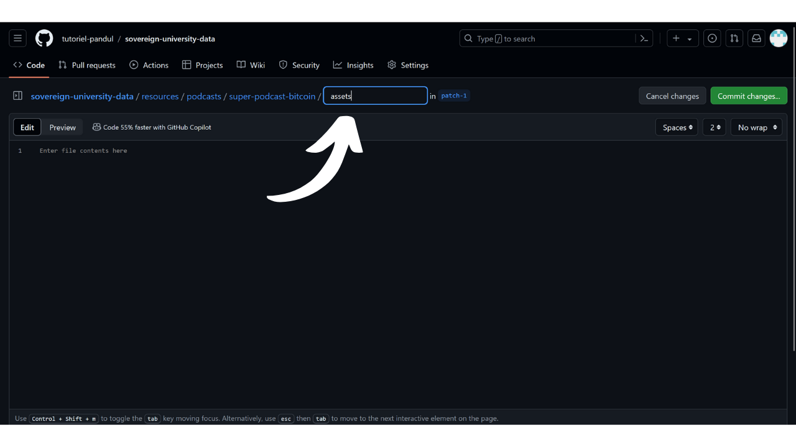
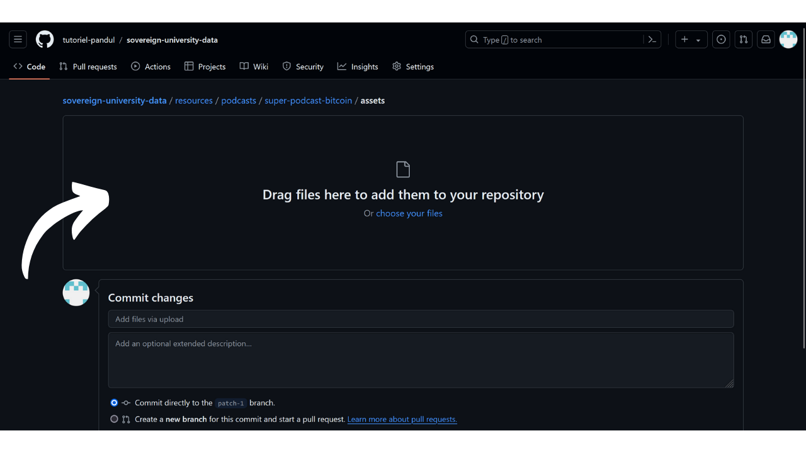

La mission de PlanB est de mettre à disposition des ressources éducatives de premier plan sur Bitcoin, et ce, dans un maximum de langues. L'intégralité des contenus publiés sur le site est open-source et est hébergée sur GitHub, ce qui offre la possibilité à quiconque de participer à l'enrichissement de la plateforme.

Vous souhaitez ajouter un podcast Bitcoin sur le site de PlanB Network et donner de la visibilité à votre émission, mais vous ne savez pas comment faire ? Ce tutoriel est fait pour vous !

- Tout d'abord, il vous faut avoir un compte sur GitHub. Si vous ne savez pas comment créer un compte, nous avons fait [un tutoriel détaillé pour vous accompagner](https://planb.network/tutorials/others/create-github-account).
- Rendez-vous sur [le dépôt GitHub de PlanB dédié à la data](https://github.com/PlanB-Network/bitcoin-educational-content/tree/dev/resources/podcasts) dans la section `resources/podcasts/` :

- Cliquez en haut à droite sur le bouton `Add file`, puis sur `Create new file` :

- Si vous n'avez encore jamais contribué sur les contenus de PlanB Network, vous allez devoir créer votre fork du dépôt original. Faire un fork d'un dépôt consiste à créer une copie de ce dépôt sur votre propre compte GitHub, ce qui vous permet de travailler sur le projet sans affecter le dépôt original. Cliquez sur le bouton `Fork this repository` :

- Vous arrivez ensuite sur la page d'édition de GitHub :

- Créez un dossier pour votre podcast. Pour ce faire, dans la case `Name your file...`, notez le nom de votre podcast en minuscules avec des tirets à la place des espaces. Par exemple, si votre émission s'appelle "Super Podcast Bitcoin", vous devez noter `super-podcast-bitcoin` :

- Pour valider la création du dossier, il suffit de noter un slash à la suite de votre nom de podcast dans la même case, par exemple : `super-podcast-bitcoin/`. Le fait d'ajouter un slash permet de créer automatiquement un dossier plutôt qu'un fichier :

- Dans ce dossier, vous allez créer un premier fichier YAML nommé `podcast.yml` :

- Remplissez ce fichier avec les informations relatives à votre podcast à l'aide de ce template :

```yaml
name: 
host: 
language: 
links:
  podcast: 
  twitter: 
  website: 
description: |
  
tags:
  - 
  - 
contributors:
  - 
```

Voici les informations à remplir pour chaque champ :

- **`name`** : Indiquez le nom de votre podcast.

- **`host`** : Indiquez les noms ou pseudos des intervenants ou de l'hôte du podcast. Chaque nom doit être séparé par une virgule.

- **`language`** : Indiquez le code de la langue parlée dans votre podcast. Par exemple, pour l'anglais, notez `en`, pour l'italien `it`...

- **`links`** : Fournissez les liens vers vos contenus. Vous avez deux options :
	- `podcast` : le lien vers votre podcast,
	- `twitter` : le lien vers le profil Twitter du podcast ou de l'organisation qui le produit,
	- `website` : le lien vers le site web du podcast ou de l'organisation qui le produit.

- **`description`** : Ajoutez un court paragraphe qui décrit votre podcast. La description doit être dans la même langue que celle indiquée dans le champ `language:`.

- **`tags`** : Ajoutez deux étiquettes associées à votre podcast. Exemples :
    - `bitcoin`
    - `technology`
    - `economy`
    - `education`...

- **`contributors`** : Mentionnez votre identifiant de contributeur si vous en avez un.

Par exemple, votre fichier YAML pourrait ressembler à celui-ci : 

```yaml
name: Super Podcast Bitcoin
host: Rogzy, JohnOnChain, Lounes, Fanis, Ajlex, Guillaume, Pantamis, Sosthene, Loic
language: en
links:
  podcast: https://podcasts.apple.com/us/podcast/decouvrebitcoin-replay/id1693844092
  twitter: https://twitter.com/decouvrebitcoin
  website: https://decouvrebitcoin.fr
description: |
  Super Podcast Bitcoin is a technical LIVE session held once a week on Twitter to delve deep into the Bitcoin protocol, layer two solutions, and all things that blow minds. Our hosts Lounes, Pantamis, Loïc, and Sosthene will answer your questions and offer the most technical show on Bitcoin in the world.

tags:
  - bitcoin
  - technology
contributors:
  - rabbit-hole
```


- Une fois vos modifications sur ce fichier terminées, enregistrez-les en cliquant sur le bouton `Commit changes...` :

- Ajoutez un titre pour vos modifications, ainsi qu'une courte description :

- Cliquez sur le bouton vert `Propose changes` :

- Vous arrivez ensuite sur une page qui résume tous vos changements :

- Cliquez sur votre image de profil GitHub en haut à droite, puis sur `Your Repositories` :

- Sélectionnez votre fork du dépôt de PlanB Network :

- Vous devriez voir apparaître sur le haut de la fenêtre une notification avec votre nouvelle branche. Elle s'appelle sûrement `patch-1`. Cliquez dessus :

- Vous êtes maintenant sur votre branche de travail :

- Retournez dans le dossier `resources/podcast/` et sélectionnez le dossier de votre podcast que vous venez de créer dans le commit précédent :

- Dans le dossier de votre podcast, cliquez sur le bouton `Add file`, puis sur `Create new file` :

- Nommez ce nouveau dossier `assets` et confirmez sa création en mettant un slash `/` à la fin :

- Dans ce dossier `assets`, créez un fichier nommé `.gitkeep` :

- Cliquez sur le bouton `Commit changes...` :

- Laissez le titre du commit par défaut, et vérifiez bien que la case `Commit directly to the patch-1 branch` est cochée, puis cliquez sur `Commit changes` :

- Retournez dans le dossier `assets` :

- Cliquez sur le bouton `Add file`, puis sur `Upload files` :

- Une nouvelle page va s'ouvrir. Glissez et déposez dans la zone le logo de votre podcast. Cette image sera affichée sur le site de PlanB Network :

- Attention, l'image doit être carrée, afin de s'adapter au mieux à notre site web :

- Une fois l'image chargée, vérifiez que la case `Commit directly to the patch-1 branch` est cochée, puis cliquez sur `Commit changes` : 

- Attention, votre image doit s'appeler `logo` et doit être au format `.webp`. Le nom complet du fichier devrait donc être : `logo.webp` :

- Retournez dans votre dossier `assets` et cliquez sur le fichier intermédiaire `.gitkeep` :

- Une fois sur le fichier, cliquez sur les 3 petits points en haut à droite puis sur `Delete file` :

- Vérifiez que vous êtes toujours sur la même branche de travail, puis cliquez sur le bouton `Commit changes` :

- Ajoutez un titre et une description à votre commit, puis cliquez sur `Commit changes` :

- Revenez à la racine de votre dépôt :

- Vous devriez voir apparaître un message vous indiquant que votre branche a subi des modifications. Cliquez sur le bouton `Compare & pull request` :

- Ajoutez un titre clair et une description sur votre PR :

- Cliquez sur le bouton `Create pull request` :

Félicitations ! Votre PR a bien été créée. Un administrateur va maintenant la vérifier et, si tout est conforme, l'intégrer au dépôt principal de PlanB Network. Vous devriez voir votre podcast apparaître sur le site web quelques jours plus tard.

Pensez bien à suivre le progrès de votre PR. Il est possible qu'un administrateur y laisse un commentaire pour demander des informations supplémentaires. Tant que votre PR n'est pas validée, vous pouvez la consulter dans l'onglet `Pull requests` sur le dépôt GitHub de PlanB Network :

Merci beaucoup pour votre précieuse contribution ! :)