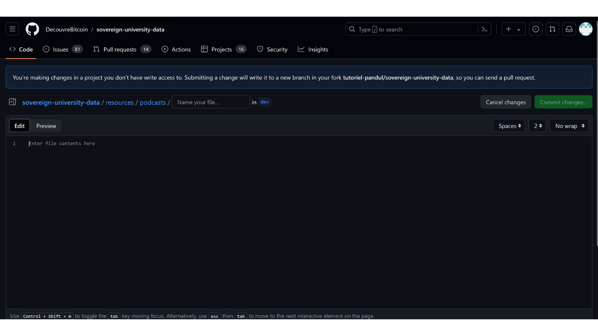
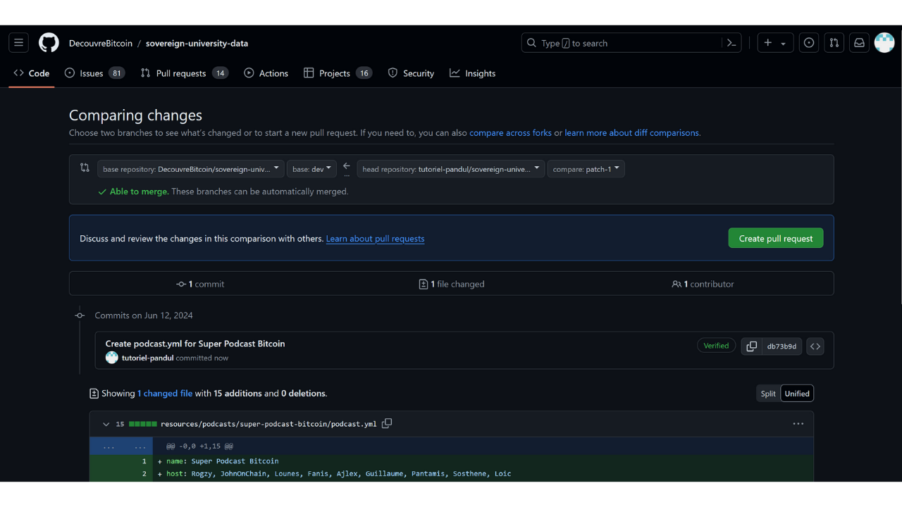
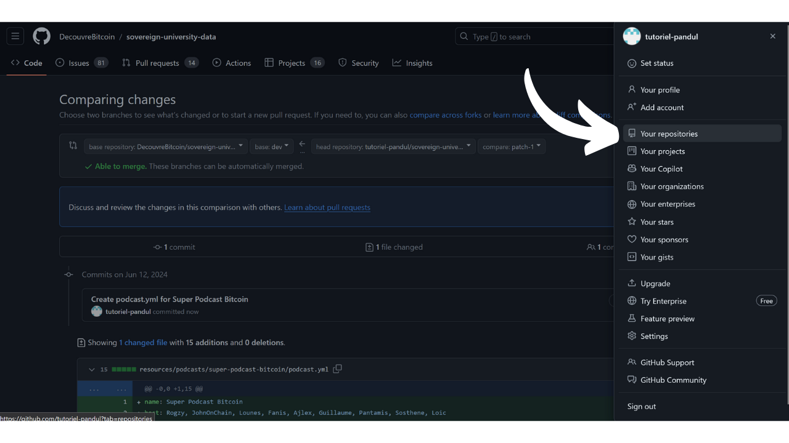
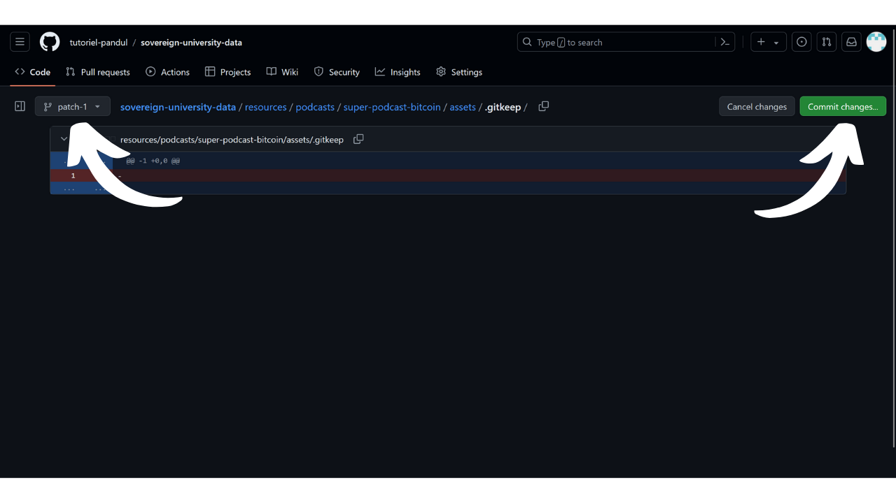
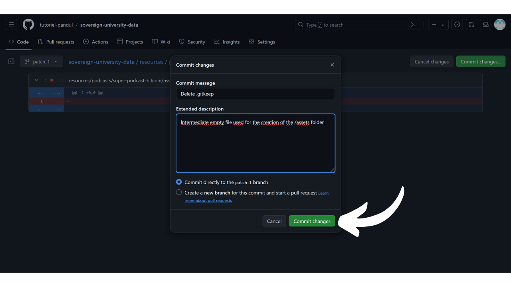

La missione di PlanB è fornire risorse educative di primo livello su Bitcoin in quante più lingue possibile. Tutti i contenuti pubblicati sul sito sono open-source e ospitati su GitHub, permettendo a chiunque di partecipare all'arricchimento della piattaforma.

Stai cercando di aggiungere un podcast su Bitcoin al sito della Rete PlanB e aumentare la visibilità del tuo show, ma non sai come fare? Questo tutorial è per te!

- Prima di tutto, devi avere un account GitHub. Se non sai come crearne uno, abbiamo realizzato [un tutorial dettagliato per guidarti](https://planb.network/tutorials/others/create-github-account).
- Vai al [repository GitHub di PlanB dedicato ai dati](https://github.com/PlanB-Network/bitcoin-educational-content/tree/dev/resources/podcasts) nella sezione `resources/podcasts/`:

- Clicca in alto a destra sul pulsante `Add file`, poi su `Create new file`:

- Se non hai mai contribuito al contenuto della Rete PlanB prima d'ora, dovrai creare il tuo fork del repository originale. Fare un fork di un repository significa creare una copia di quel repository sul proprio account GitHub, permettendoti di lavorare sul progetto senza influenzare il repository originale. Clicca sul pulsante `Fork this repository`:

- Arriverai quindi alla pagina di modifica di GitHub:

- Crea una cartella per il tuo podcast. Per fare ciò, nella casella `Name your file...`, scrivi il nome del tuo podcast in minuscolo con i trattini al posto degli spazi. Ad esempio, se il tuo show si chiama "Super Podcast Bitcoin", dovresti scrivere `super-podcast-bitcoin`:

- Per validare la creazione della cartella, basta aggiungere una barra dopo il nome del tuo podcast nella stessa casella, per esempio: `super-podcast-bitcoin/`. Aggiungere una barra crea automaticamente una cartella anziché un file:

- In questa cartella, creerai un primo file YAML chiamato `podcast.yml`:

- Compila questo file con le informazioni sul tuo podcast usando questo modello:

```yaml
name: 
host: 
language: 
links:
  podcast: 
  twitter: 
  website: 
description: |
  
tags:
  - 
  - 
contributors:
  - 
```

Ecco i dettagli da compilare per ogni campo:

- **`name`**: Indica il nome del tuo podcast.
- **`host`**: Elenca i nomi o pseudonimi degli speaker o del conduttore del podcast. Ogni nome dovrebbe essere separato da una virgola.
- **`language`**: Indica il codice della lingua parlata nel tuo podcast. Ad esempio, per l'inglese, nota `en`, per l'italiano `it`...

- **`links`**: Fornisci i link ai tuoi contenuti. Hai due opzioni:
	- `podcast`: il link al tuo podcast,
	- `twitter`: il link al profilo Twitter del podcast o dell'organizzazione che lo produce,
	- `website`: il link al sito web del podcast o dell'organizzazione che lo produce.
- **`description`**: Aggiungi un breve paragrafo che descrive il tuo podcast. La descrizione deve essere nella stessa lingua indicata nel campo `language:`.
- **`tags`**: Aggiungi due tag associati al tuo podcast. Esempi:
    - `bitcoin`
    - `tecnologia`
    - `economia`
    - `educazione`...

- **`contributors`**: Menciona il tuo ID di contributore se ne possiedi uno.

Ad esempio, il tuo file YAML potrebbe apparire così:

```yaml
name: Super Podcast Bitcoin
host: Rogzy, JohnOnChain, Lounes, Fanis, Ajlex, Guillaume, Pantamis, Sosthene, Loic
language: en
links:
  podcast: https://podcasts.apple.com/us/podcast/decouvrebitcoin-replay/id1693844092
  twitter: https://twitter.com/decouvrebitcoin
  website: https://decouvrebitcoin.fr
description: |
  Super Podcast Bitcoin è una sessione tecnica LIVE tenuta una volta a settimana su Twitter per approfondire il protocollo Bitcoin, le soluzioni di secondo livello e tutto ciò che stupisce. I nostri ospiti Lounes, Pantamis, Loïc e Sosthene risponderanno alle vostre domande e offriranno lo spettacolo più tecnico su Bitcoin al mondo.

tags:
  - bitcoin
  - tecnologia
contributors:
  - rabbit-hole
```


- Una volta terminato di apportare modifiche a questo file, salvali cliccando sul pulsante `Commit changes...`:

- Aggiungi un titolo per le tue modifiche, così come una breve descrizione:

- Clicca sul pulsante verde `Propose changes`:

- Arriverai quindi su una pagina che riassume tutte le tue modifiche:

- Clicca sulla tua immagine del profilo GitHub in alto a destra, poi su `Your Repositories`:

- Seleziona il tuo fork del repository PlanB Network:

- Dovresti vedere una notifica in alto alla finestra con il tuo nuovo branch. Probabilmente si chiama `patch-1`. Cliccaci sopra:

- Ora sei sul tuo branch di lavoro:

- Torna alla cartella `resources/podcast/` e seleziona la cartella del podcast che hai appena creato nel commit precedente: 
- Nella tua cartella podcast, clicca sul pulsante `Add file`, poi su `Create new file`:

- Nominare questa nuova cartella `assets` e confermarne la creazione aggiungendo una barra `/` alla fine:

- In questa cartella `assets`, crea un file chiamato `.gitkeep`:

- Clicca sul pulsante `Commit changes...`:

- Lascia il titolo del commit come predefinito, e assicurati che la casella `Commit directly to the patch-1 branch` sia selezionata, poi clicca su `Commit changes`:

- Ritorna alla cartella `assets`:

- Clicca sul pulsante `Add file`, poi su `Upload files`:

- Si aprirà una nuova pagina. Trascina e rilascia il logo del tuo podcast nell'area indicata. Questa immagine verrà visualizzata sul sito della Rete PlanB: 
- Attenzione, l'immagine deve essere quadrata, per adattarsi al meglio al nostro sito web: 
- Una volta caricata l'immagine, verifica che la casella `Commit directly to the patch-1 branch` sia selezionata, poi clicca su `Commit changes`: 
- Attenzione, la tua immagine deve essere denominata `logo` e deve essere in formato `.webp`. Il nome completo del file deve quindi essere: `logo.webp`: 
- Torna alla tua cartella `assets` e clicca sul file intermedio `.gitkeep`: 
- Una volta sul file, clicca sui tre piccoli punti in alto a destra e poi su `Delete file`: 
- Verifica di essere ancora sullo stesso ramo di lavoro, poi clicca sul pulsante `Commit changes`: 
- Aggiungi un titolo e una descrizione al tuo commit, poi clicca su `Commit changes`: 
- Torna alla radice del tuo repository: 
- Dovresti vedere un messaggio che indica che il tuo ramo ha subito delle modifiche. Clicca sul pulsante `Compare & pull request`: 
- Aggiungi un titolo chiaro e una descrizione al tuo PR: 
- Clicca sul pulsante `Create pull request`: 
Congratulazioni! Il tuo PR è stato creato con successo. Un amministratore lo esaminerà ora e, se tutto è in ordine, lo unirà al repository principale della Rete PlanB. Dovresti vedere apparire il tuo podcast sul sito web qualche giorno dopo.

Assicurati di seguire il progresso del tuo PR. Un amministratore potrebbe lasciare un commento chiedendo ulteriori informazioni. Finché il tuo PR non è validato, puoi visualizzarlo nella scheda `Pull requests` sul repository GitHub della Rete PlanB: 
Grazie mille per il tuo prezioso contributo! :)