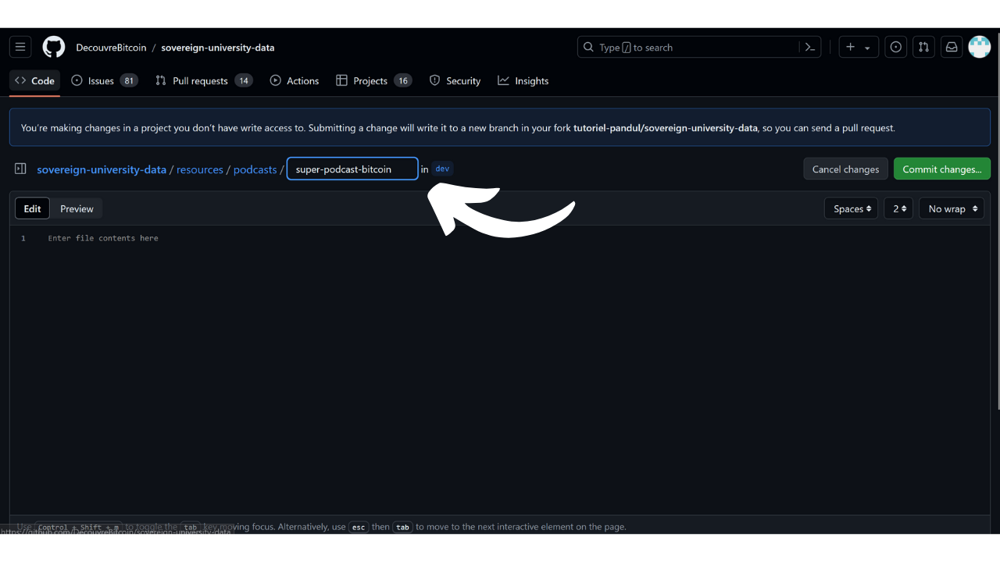
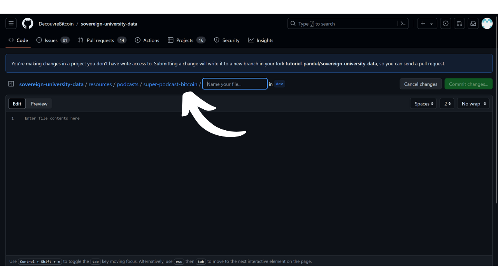
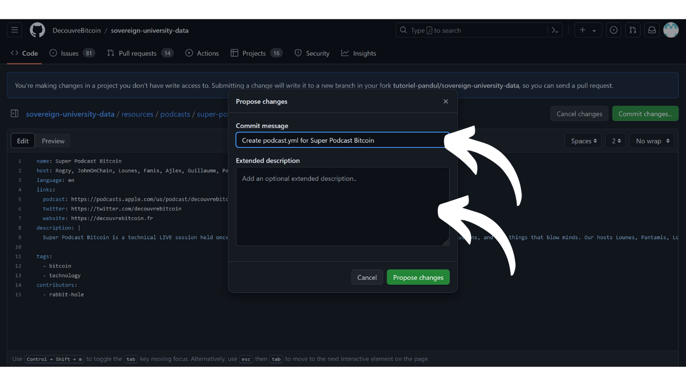
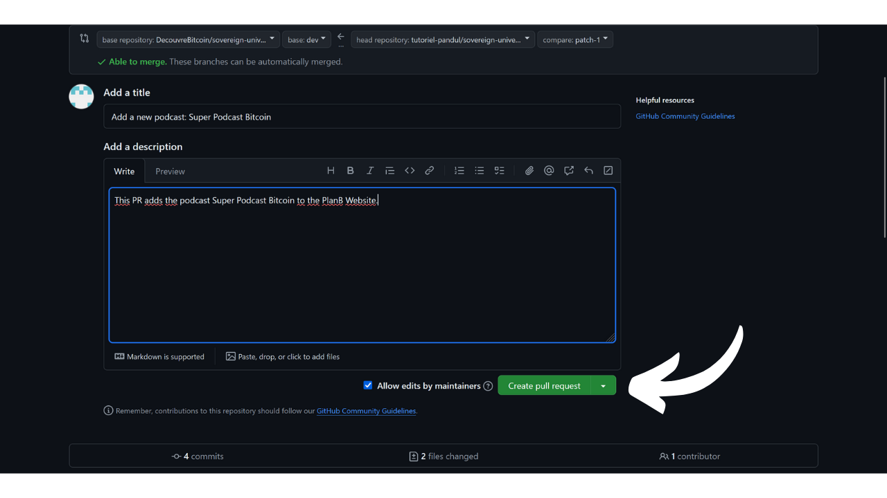

PlanBのミッションは、可能な限り多くの言語でビットコインに関する最高水準の教育リソースを提供することです。サイトに公開されているすべてのコンテンツはオープンソースであり、GitHub上でホストされているため、誰でもプラットフォームを豊かにするために参加することができます。

あなたのショーの可視性を高めるためにPlanBネットワークサイトにビットコインポッドキャストを追加したいですが、方法がわからないですか？このチュートリアルはあなたのためのものです！

- まず、GitHubアカウントを持っている必要があります。作成方法がわからない場合は、[詳細なチュートリアルを用意しています](https://planb.network/tutorials/others/create-github-account)。
- `resources/podcasts/`セクションにある[PlanB専用のデータのGitHubリポジトリ](https://github.com/DecouvreBitcoin/sovereign-university-data/tree/dev/resources/podcasts)にアクセスしてください：

- 右上の`Add file`ボタンをクリックし、次に`Create new file`をクリックします：

- 以前にPlanB Networkのコンテンツに貢献したことがない場合は、元のリポジトリのフォークを作成する必要があります。リポジトリをフォークするとは、そのリポジトリのコピーを自分のGitHubアカウント上に作成することを意味し、元のリポジトリに影響を与えることなくプロジェクトに取り組むことができます。`Fork this repository`ボタンをクリックします：

- そうすると、GitHubの編集ページに到着します：

- ポッドキャスト用のフォルダを作成します。これを行うには、`Name your file...`ボックスに、スペースの代わりにダッシュを使用して、ポッドキャストの名前を小文字で入力します。例えば、あなたのショーが「Super Podcast Bitcoin」と呼ばれている場合は、`super-podcast-bitcoin`と書くべきです：

- フォルダの作成を確定するには、同じボックスでポッドキャスト名の後にスラッシュを追加するだけです。例：`super-podcast-bitcoin/`。スラッシュを追加すると、ファイルではなくフォルダが自動的に作成されます：

- このフォルダ内に、最初のYAMLファイル`podcast.yml`を作成します：

- このテンプレートを使用して、ポッドキャストに関する情報をファイルに記入します：

```yaml
name: 
host: 
language: 
links:
  podcast: 
  twitter: 
  website: 
description: |
  
tags:
  - 
  - 
contributors:
  - 
```

各フィールドに記入する詳細は以下の通りです：

- **`name`**: ポッドキャストの名前を示します。
- **`host`**: ポッドキャストのスピーカーやホストの名前や偽名をリストします。各名前はコンマで区切ります。
- **`language`**: ポッドキャストで話されている言語の言語コードを示します。例えば、英語の場合は`en`、イタリア語の場合は`it`など...

- **`links`**: コンテンツへのリンクを提供します。2つのオプションがあります：
	- `podcast`: ポッドキャストへのリンク、
	- `twitter`: ポッドキャストまたはそれを制作している組織のTwitterプロフィールへのリンク、
	- `website`: ポッドキャストまたはそれを制作している組織のウェブサイトへのリンク。
```yaml
name: スーパーポッドキャスト ビットコイン
host: Rogzy, JohnOnChain, Lounes, Fanis, Ajlex, Guillaume, Pantamis, Sosthene, Loic
language: ja
links:
  podcast: https://podcasts.apple.com/us/podcast/decouvrebitcoin-replay/id1693844092
  twitter: https://twitter.com/decouvrebitcoin
  website: https://decouvrebitcoin.fr
description: |
  スーパーポッドキャスト ビットコインは、ビットコインプロトコル、レイヤー2ソリューション、そして心を揺さぶる全てのことに深く潜り込むための、週に一度の技術的LIVEセッションです。ホストのLounes, Pantamis, Loïc, Sostheneがあなたの質問に答え、世界で最も技術的なビットコインショーを提供します。

tags:
  - ビットコイン
  - 技術
contributors:
  - ラビットホール
```

- 変更をこのファイルに加えたら、`Commit changes...`ボタンをクリックして保存します：

- 変更にタイトルと短い説明を追加します：

- 緑色の`Propose changes`ボタンをクリックします：

- そうすると、あなたの変更をすべてまとめたページに到着します：

- 右上のGitHubプロフィール写真をクリックし、`Your Repositories`を選択します：

- PlanB Networkリポジトリのフォークを選択します：

- 新しいブランチに関するウィンドウ上部の通知が表示されます。おそらく`patch-1`と呼ばれています。それをクリックします：

- これで作業ブランチにいます：

- `resources/podcast/`フォルダに戻り、前のコミットで作成したポッドキャストフォルダを選択します： 
- ポッドキャストフォルダ内で、`Add file`ボタンをクリックし、`Create new file`を選択します：

- この新しいフォルダに`assets`と名付け、スラッシュ`/`を追加してその作成を確認します：

- この`assets`フォルダ内に、`.gitkeep`という名前のファイルを作成します：

- `Commit changes...`ボタンをクリックします：

- コミットタイトルはデフォルトのままにし、`Commit directly to the patch-1 branch`ボックスがチェックされていることを確認し、`Commit changes`をクリックします：

- `assets`フォルダに戻ります：

- `Add file`ボタンをクリックし、`Upload files`を選択します：

- 新しいページが開きます。ポッドキャストのロゴをエリアにドラッグ＆ドロップしてください。この画像はPlanB Networkサイトに表示されます：
- 注意してください、画像は正方形でなければなりません。当社のウェブサイトに最適にフィットするためです：
- 画像がアップロードされたら、`patch-1ブランチに直接コミットする`ボックスがチェックされていることを確認し、その後`コミット変更`をクリックしてください：
- 注意してください、画像は`logo`という名前でなければならず、`.webp`フォーマットである必要があります。完全なファイル名は、したがって`logo.webp`でなければなりません：
- `assets`フォルダに戻り、中間ファイル`.gitkeep`をクリックしてください：
- ファイル上にいるとき、右上の三つの小さな点をクリックし、その後`ファイル削除`をクリックしてください：
- 同じ作業ブランチにまだいることを確認し、その後`コミット変更`ボタンをクリックしてください：
- コミットにタイトルと説明を追加し、その後`コミット変更`をクリックしてください：
- リポジトリのルートに戻ってください：
- ブランチに変更があったことを示すメッセージが表示されるはずです。`比較＆プルリクエスト`ボタンをクリックしてください：
- PRに明確なタイトルと説明を追加してください：
- `プルリクエストを作成`ボタンをクリックしてください：
おめでとうございます！PRは正常に作成されました。管理者がこれをレビューし、すべてが順序どおりであれば、PlanB Networkのメインリポジトリにマージします。数日後には、ウェブサイト上であなたのポッドキャストが表示されるはずです。

PRの進行状況を確認してください。管理者が追加情報を求めるコメントを残すことがあります。PRが承認されない限り、PlanB Network GitHubリポジトリの`プルリクエスト`タブでそれを見ることができます：
貴重な貢献をいただき、ありがとうございます！:)